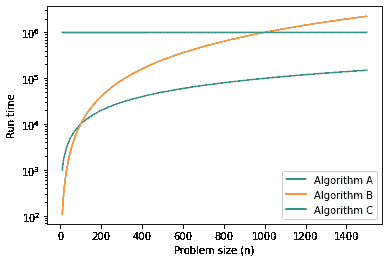

# 第三章：算法分析

> 原文：[`allendowney.github.io/DSIRP/analysis.html`](https://allendowney.github.io/DSIRP/analysis.html)

[点击这里在 Colab 上运行本章](https://colab.research.google.com/github/AllenDowney/DSIRP/blob/main/notebooks/analysis.ipynb)

**算法分析**是计算机科学的一个分支，研究算法的性能，特别是它们的运行时间和空间需求。参见[`en.wikipedia.org/wiki/Analysis_of_algorithms`](http://en.wikipedia.org/wiki/Analysis_of_algorithms)。

算法分析的实际目标是预测不同算法的性能，以指导设计决策。

在 2008 年美国总统竞选期间，候选人巴拉克·奥巴马在访问谷歌时被要求进行即兴分析。首席执行官埃里克·施密特开玩笑地问他“对一百万个 32 位整数进行排序的最有效方法是什么。”奥巴马显然已经得到了消息，因为他很快回答说：“我认为冒泡排序不是正确的方法。”参见[`www.youtube.com/watch?v=k4RRi_ntQc8`](http://www.youtube.com/watch?v=k4RRi_ntQc8)。

这是真的：冒泡排序在概念上简单，但对于大型数据集来说速度慢。Schmidt 可能在寻找的答案是“基数排序”（[`en.wikipedia.org/wiki/Radix_sort`](http://en.wikipedia.org/wiki/Radix_sort)）。

但是，如果你在面试中遇到这样的问题，我认为更好的答案是：“对一百万个整数进行排序的最快方法是使用我正在使用的语言提供的任何排序函数。它的性能对于绝大多数应用来说已经足够好了，但如果我的应用程序运行太慢，我会使用性能分析工具来查看时间花在哪里。如果看起来更快的排序算法会对性能产生显著影响，那么我会寻找一个好的基数排序的实现。”

算法分析的目标是对算法进行有意义的比较，但存在一些问题：

+   算法的相对性能可能取决于硬件的特性，因此一个算法在 A 机器上可能更快，另一个算法在 B 机器上可能更快。解决这个问题的常见方法是指定一个**机器模型**，并分析在给定模型下算法所需的步骤或操作数。

+   相对性能可能取决于数据集的细节。例如，如果数据已经部分排序，某些排序算法可能运行得更快；在这种情况下，其他算法可能运行得更慢。避免这个问题的常见方法是分析**最坏情况**。有时分析平均情况的性能是有用的，但通常更难，可能不明显应该对哪组情况进行平均。

+   相对性能还取决于问题的规模。对于小列表而言快速的排序算法可能对于长列表而言较慢。解决这个问题的常见方法是将运行时间（或操作次数）表示为问题规模的函数，并根据随着问题规模增加而增长的速度将函数分组到不同的类别中。

这种比较的好处是它适合于对算法进行简单的分类。例如，如果我知道算法 A 的运行时间倾向于与输入大小$n$成比例，而算法 B 倾向于与$n²$成比例，那么我期望 A 比 B 更快，至少对于较大的$n$值来说是这样。

这种分析有一些注意事项，但我们稍后会讨论。

## 增长的顺序

假设你已经分析了两个算法，并根据输入大小表达了它们的运行时间：算法 A 需要$100n+1$步来解决大小为$n$的问题；算法 B 需要$n² + n + 1$步。

以下表格显示了这些算法在不同问题规模下的运行时间：

```py
import numpy as np
import pandas as pd

n = np.array([10, 100, 1000, 10000])
table = pd.DataFrame(index=n)
table['Algorithm A'] = 100 * n + 1
table['Algorithm B'] = n**2 + n + 1
table['Ratio (B/A)'] = table['Algorithm B'] / table['Algorithm A']
table 
```

|  | 算法 A | 算法 B | 比率（B/A） |
| --- | --- | --- | --- |
| 10 | 1001 | 111 | 0.110889 |
| 100 | 10001 | 10101 | 1.009999 |
| 1000 | 100001 | 1001001 | 10.009910 |
| 10000 | 1000001 | 100010001 | 100.009901 |

在$n=10$时，算法 A 看起来非常糟糕；它比算法 B 花费的时间几乎多了 10 倍。但对于$n=100$，它们大致相同，对于更大的值，A 要好得多。

根本原因是对于较大的$n$值，任何包含$n²$项的函数都会比其主导项为$n$的函数增长更快。**主导项**是具有最高指数的项。

对于算法 A，主导项有一个较大的系数 100，这就是为什么对于较小的$n$，B 比 A 做得更好。但无论系数如何，总会有一些值的$n$，其中$a n² > b n$，对于任何$a$和$b$的值。

相同的论点也适用于非主导项。假设算法 C 的运行时间是$n+1000000$；对于足够大的$n$，它仍然比算法 B 更好。

```py
import numpy as np
import pandas as pd

n = np.array([10, 100, 1000, 10000])
table = pd.DataFrame(index=n)
table['Algorithm C'] = n + 1000000
table['Algorithm B'] = n**2 + n + 1
table['Ratio (C/B)'] = table['Algorithm B'] / table['Algorithm C']
table 
```

|  | 算法 C | 算法 B | 比率（C/B） |
| --- | --- | --- | --- |
| 10 | 1000010 | 111 | 0.000111 |
| 100 | 1000100 | 10101 | 0.010100 |
| 1000 | 1001000 | 1001001 | 1.000001 |
| 10000 | 1010000 | 100010001 | 99.019803 |

一般来说，我们期望具有较小主导项的算法对于大问题来说是更好的算法，但对于较小的问题，可能存在另一个算法更好的**交叉点**。

以下图表显示了三种算法在一系列问题规模下的运行时间（以任意单位表示）。对于较小的问题规模，算法 B 是最快的，但对于较大的问题规模，它是最差的。在图中，我们可以看到交叉点在哪里。

```py
import matplotlib.pyplot as plt

ns = np.arange(10, 1500)
ys = 100 * ns + 1
plt.plot(ns, ys, label='Algorithm A')

ys = ns**2 + ns + 1
plt.plot(ns, ys, label='Algorithm B')

ys = ns + 1_000_000
plt.plot(ns, ys, label='Algorithm C')

plt.yscale('log')
plt.xlabel('Problem size (n)')
plt.ylabel('Run time')
plt.legend(); 
```



这些交叉点的位置取决于算法、输入和硬件的细节，因此通常在算法分析中被忽略。但这并不意味着你可以忘记它。

## 大 O 符号

如果两个算法具有相同的主导阶项，很难说哪个更好；同样，答案取决于细节。因此，在算法分析中，具有相同主导项的函数被认为是等价的，即使它们具有不同的系数。

**增长顺序**是一组被认为是等价的增长行为的函数。例如，$2n$、$100n$和$n+1$属于相同的增长顺序，用**大 O 符号**写作$O(n)$，通常被称为**线性**，因为集合中的每个函数都随着$n$线性增长。

所有主导项为$n²$的函数都属于$O(n²)$；它们被称为**二次**。

以下表格显示了在算法分析中最常见的一些增长顺序，按糟糕程度递增排列。

| 增长顺序 | 名称 |
| --- | --- |
| $O(1)$ | 常数 |
| $O(\log_b n)$ | 对数（对于任何$b$） |
| $O(n)$ | 线性 |
| $O(n \log_b n)$ | 线性对数 |
| $O(n²)$ | 二次 |
| $O(n³)$ | 立方 |
| $O(c^n)$ | 指数（对于任何$c$） |

对于对数项，对数的底数并不重要；改变底数相当于乘以一个常数，这不会改变增长顺序。同样，无论指数的底数是什么，所有指数函数都属于相同的增长顺序。指数函数增长非常快，因此指数算法只对小问题有用。

### 练习

阅读维基百科关于大 O 符号的页面[`en.wikipedia.org/wiki/Big_O_notation`](http://en.wikipedia.org/wiki/Big_O_notation)，并回答以下问题：

1.  $n³ + n²$的增长顺序是多少？$1000000 n³ + n²$呢？$n³ + 1000000 n²$呢？

1.  $(n² + n) \cdot (n + 1)$的增长顺序是多少？在开始乘法之前，记住你只需要主导项。

1.  如果$f$在$O(g)$中，对于某些未指定的函数$g$，我们可以说什么关于$af+b$，其中$a$和$b$是常数？

1.  如果$f_1$和$f_2$在$O(g)$中，我们对$f_1 + f_2$能说什么？

1.  如果$f_1$在$O(g)$中，$f_2$在$O(h)$中，我们对$f_1 + f_2$能说什么？

1.  如果$f_1$在$O(g)$中，$f_2$在$O(h)$中，我们对$f_1 \cdot f_2$能说什么？

关心性能的程序员通常觉得这种分析很难接受。他们有一点道理：有时系数和非主导项确实会产生真正的差异。有时硬件的细节、编程语言和输入的特性会产生很大的差异。对于小问题，增长顺序是无关紧要的。

但是，如果您记住这些警告，算法分析是一个有用的工具。至少对于大问题来说，“更好”的算法通常更好，有时它甚至*好得多*。具有相同增长顺序的两个算法之间的差异通常是一个常数因子，但好算法和坏算法之间的差异是无限的！

## 示例：添加列表的元素

在 Python 中，大多数算术运算都是常数时间；乘法通常比加法和减法花费更长的时间，而除法花费的时间更长，但这些运行时间不取决于操作数的大小。非常大的整数是一个例外；在这种情况下，运行时间随着数字的位数增加。

迭代列表的`for`循环是线性的，只要循环体中的所有操作都是常数时间。例如，对列表的元素求和是线性的：

```py
def compute_sum(t):
    total = 0
    for x in t:
        total += x
    return total 
```

```py
t = range(10)
compute_sum(t) 
```

```py
45 
```

内置函数`sum`也是线性的，因为它做的事情相同，但它往往更快，因为它是一个更有效的实现；在算法分析的语言中，它有一个较小的主导系数。

```py
%timeit compute_sum(t) 
```

```py
303 ns ± 1.26 ns per loop (mean ± std. dev. of 7 runs, 1000000 loops each) 
```

```py
%timeit sum(t) 
```

## 示例：排序

Python 提供了一个列表方法，`sort`，它可以就地修改列表，还有一个函数，`sorted`，可以创建一个新列表。

阅读维基百科关于排序算法的页面[`en.wikipedia.org/wiki/Sorting_algorithm`](http://en.wikipedia.org/wiki/Sorting_algorithm)并回答以下问题：

1.  “比较排序”是什么？比较排序的最佳最坏情况增长顺序是什么？任何排序算法的最佳最坏情况增长顺序是什么？

1.  冒泡排序的增长顺序是多少，为什么巴拉克·奥巴马认为它是“错误的方式”？

1.  基数排序的增长顺序是多少？我们需要什么前提条件来使用它？

1.  什么是稳定排序，为什么在实践中可能很重要？

1.  最糟糕的排序算法是什么（有名字的）？

1.  C 库使用什么排序算法？Python 使用什么排序算法？这些算法是稳定的吗？您可能需要在网上搜索找到这些答案。

1.  许多非比较排序都是线性的，那么为什么 Python 使用$O(n \log n)$的比较排序？

*Python 中的数据结构和信息检索*

版权所有 2021 Allen Downey

许可证：[知识共享署名-非商业性使用-相同方式共享 4.0 国际许可协议](https://creativecommons.org/licenses/by-nc-sa/4.0/)
