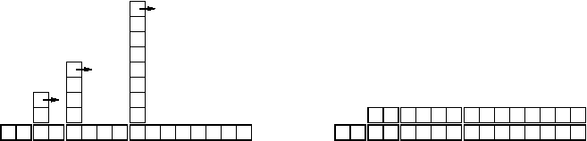

# 实现映射类型

> 原文：[`allendowney.github.io/DSIRP/hashmap.html`](https://allendowney.github.io/DSIRP/hashmap.html)

[单击此处在 Colab 上运行本章](https://colab.research.google.com/github/AllenDowney/DSIRP/blob/main/notebooks/hashmap.ipynb)

## 搜索算法分析

**搜索**是一种算法，它接受一个集合和一个目标项，并确定目标是否在集合中，通常返回目标的索引。

最简单的搜索算法是“线性搜索”，它按顺序遍历集合的项，如果找到目标，则停止。在最坏的情况下，它必须遍历整个集合，因此运行时间是线性的。

序列的`in`运算符使用线性搜索；字符串方法如`find`和`count`也是如此。

如果序列的元素是有序的，可以使用**二分搜索**，其时间复杂度为$O(\log n)$。二分搜索类似于您在字典中查找单词的算法（纸质字典，而不是数据结构）。您不是从开头开始按顺序检查每个项目，而是从中间开始检查您要查找的单词是在之前还是之后。如果在之前，那么您搜索序列的前半部分。否则，您搜索后半部分。无论哪种方式，剩余项的数量都减少了一半。

如果序列有 100 万个项，将需要大约 20 步来查找单词或得出结论它不在那里。因此，这比线性搜索快约 50,000 倍。

二分搜索可能比线性搜索快得多，但它要求序列有序，这可能需要额外的工作。

还有另一种数据结构，称为**哈希表**，它甚至更快 - 它可以在常数时间内进行搜索 - 而且不需要对项进行排序。Python 字典是使用哈希表实现的，这就是为什么大多数字典操作，包括`in`运算符，都是常数时间。

## LinearMap

为了解释哈希表的工作原理以及它们的性能为何如此出色，我从一个简单的映射实现开始，逐渐改进，直到它成为一个哈希表。

我使用 Python 来演示这些实现，但在现实生活中，您不会在 Python 中编写这样的代码；您只需使用字典！因此，在这个笔记本中，您必须想象字典不存在，并且您想要实现一个从键到值的映射的数据结构。

我们将实现的操作是：

+   `add(k, v)`: 添加一个新项，将键`k`映射到值`v`。使用 Python 字典`d`，此操作写为`d[k] = v`。

+   `get(k)`: 查找并返回与键`k`对应的值。使用 Python 字典`d`，此操作写为`d[k]`或`d.get(k)`。

目前，我假设每个键只出现一次。

这是使用元组列表实现此接口的简单实现，其中每个元组都是一个键值对。

```py
items = []

key = 'a'
value = 1
items.append((key, value))

items.append(('b', 2))

target = 'b'
for k, v in items:
    if k == target:
        print(v) 
```

```py
2 
```

```py
items = []

def add(k, v):
    items.append((k, v))

add('a', 1)
add('b', 2)

def get(target):
    for key, val in items:
        if key == target:
            print(val)

get('b') 
```

```py
2 
```

```py
class LinearMap:
    def __init__(self):
        self.items = []

lmap = LinearMap()
lmap.items 
```

```py
[] 
```

```py
class LinearMap:

    def __init__(self):
        self.items = []

    def add(self, k, v):
        self.items.append((k, v))

    def get(self, target):
        for k, v in self.items:
            if k == target:
                return v
        raise KeyError(f'{target} not found') 
```

`__init__`创建一个带有空项列表的新映射，因此这需要常数时间。

`add`将一个键值元组附加到项的列表中，这需要常数时间。

`get`使用`for`循环搜索列表：如果找到目标键，则返回相应的值；否则引发`KeyError`。因此，`get`是线性的。

让我们尝试一下这个实现。

```py
import string

lmap = LinearMap()

for i, c in enumerate(string.ascii_lowercase):
    lmap.add(c, i)

lmap.get('x') 
```

```py
23 
```

另一种方法是按键排序列表。然后`get`可以使用二分搜索，其时间复杂度为$O(\log n)$。但是在列表中间插入新项是线性的，因此这可能不是最佳选择。

我们还可以使用二叉搜索树，它可以在对数时间内实现`add`和`get`，但这仍然不如常数时间好，所以让我们继续前进。

## BetterMap

一种改进`LinearMap`的方法是将键值对列表分成较小的列表。这里有一个名为`BetterMap`的实现，它是 100 个 LinearMaps 的列表。正如我们将在下面看到的，`get`的增长顺序仍然是线性的，但`BetterMap`是通向哈希表的一步：

```py
class BetterMap:

    def __init__(self, n=100):
        self.maps = [LinearMap() for i in range(100)]

    def find_map(self, k):
        index = hash(k) % len(self.maps)
        return self.maps[index]

    def add(self, k, v):
        m = self.find_map(k)
        m.add(k, v)

    def get(self, k):
        m = self.find_map(k)
        return m.get(k) 
```

`__init__`创建了一个`LinearMap`对象的列表。

`find_map`被`add`和`get`使用，以确定要将新项目放在哪个地图中，或者要搜索哪个地图。

`find_map`使用内置函数`hash`，它接受几乎任何 Python 对象并返回一个整数。这种实现的局限性在于它只能使用可哈希的键。像列表和字典这样的可变类型是不可哈希的。

被认为是等价的可哈希对象返回相同的哈希值，但反之则不一定成立：具有不同值的两个对象可以返回相同的哈希值。

`find_map`使用模运算符将哈希值包装到 0 到`len(self.maps)`的范围内，因此结果是列表中的合法索引。当然，这意味着许多不同的哈希值将包装到相同的索引上。但是，如果哈希函数将事物相当均匀地分布开来（这就是哈希函数的设计目的），那么我们期望每个`LinearMap`有$n/100$个项目。

让我们试一试：

```py
bmap = BetterMap()

for i, c in enumerate(string.ascii_lowercase):
    bmap.add(c, i)

bmap.get('x') 
```

```py
23 
```

```py
for lmap in bmap.maps:
    print(len(lmap.items)) 
```

```py
0
0
0
0
0
1
0
0
0
1
1
0
0
1
0
0
0
0
0
0
0
0
1
0
0
0
0
0
0
0
0
0
1
1
1
1
0
0
0
0
0
0
0
1
0
0
0
0
0
0
0
0
2
1
0
1
0
0
0
0
0
1
2
0
0
0
0
1
1
2
0
0
1
0
1
0
0
0
0
0
0
0
0
0
0
0
0
0
0
0
0
2
0
0
0
0
0
0
0
1 
```

由于`LinearMap.get`的运行时间与项目数量成正比，我们期望`BetterMap`比`LinearMap`快大约 100 倍。增长的顺序仍然是线性的，但是主导系数更小。

## 哈希函数

`BetterMap.find_map`使用[内置函数`hash`](https://docs.python.org/3/library/functions.html#hash)，它接受任何可哈希对象并返回一个整数：

> `hash(object)`
> 
> 返回对象的哈希值（如果有）。哈希值是整数。它们用于在字典查找期间快速比较字典键。比较相等的数值具有相同的哈希值（即使它们是不同类型的，就像 1 和 1.0 一样）。

```py
from fractions import Fraction

hash(2), hash(2.0), hash(2 + 0j), hash(Fraction(4, 2)) 
```

```py
(2, 2, 2, 2) 
```

```py
t = 2,
hash(t) 
```

```py
6909455589863252355 
```

```py
try:
    hash([2])
except TypeError as e:
    print(e) 
```

```py
unhashable type: 'list' 
```

```py
hash('2') 
```

```py
133118177212449111 
```

## HashMap

这（最后）是使哈希表快速的关键思想：如果你可以保持`LinearMaps`的最大长度有限，`LinearMap.get`就是常数时间。你所需要做的就是跟踪项目的数量，当每个`LinearMap`的项目数量超过阈值时，通过添加更多的`LinearMaps`来调整哈希表的大小。

这是一个哈希表的实现：

```py
class HashMap:

    def __init__(self):
        self.bmap = BetterMap(2)
        self.num = 0

    def get(self, k):
        return self.bmap.get(k)

    def add(self, k, v):
        if self.num == len(self.bmap.maps):
            self.resize()

        self.bmap.add(k, v)
        self.num += 1

    def resize(self):
        new_bmap = BetterMap(len(self.bmap.maps) * 2)

        for m in self.bmap.maps:
            for k, v in m.items:
                new_bmap.add(k, v)

        self.bmap = new_bmap 
```

`__init__`创建了一个`BetterMap`并初始化了`num`，用于跟踪项目的数量。

`get`只是调用`BetterMap.get`，它使用`find_map`来确定要搜索哪个`LinearMap`。

真正的工作发生在`add`中，它检查了项目的数量和`BetterMap`的大小：如果它们相等，每个 LinearMap 的平均项目数为 1，因此调用`resize`。

`resize`创建一个新的`BetterMap`，比以前的大一倍，然后将旧地图中的项目“重新散列”到新地图中。

```py
hmap = HashMap()

for i, c in enumerate(string.ascii_lowercase):
    hmap.add(c, i)

hmap.get('x') 
```

```py
23 
```

重新散列是必要的，因为改变`LinearMap`对象的数量会改变`find_map`中模运算符的分母。这意味着一些以前散列到相同`LinearMap`的对象将被分割（这正是我们想要的，对吧？）。

重新散列是线性的，因此`resize`是线性的，这可能看起来很糟糕，因为我承诺`add`将是常数时间。但请记住，我们不必每次都调整大小，因此`add`通常是常数时间，只偶尔是线性时间。运行`add` $n$ 次的总工作量与 $n$ 成正比，因此每次`add`的平均时间是常数时间！

要了解这是如何工作的，请考虑从空的`HashTable`开始并添加一系列项目。我们从 2 个`LinearMap`对象开始，因此前 2 个添加很快（不需要调整大小）。假设它们每个需要一个单位的工作。下一个添加需要调整大小，因此我们必须重新散列前两个项目（让我们称之为 2 个单位的工作），然后添加第三个项目（再增加一个单位）。添加下一个项目的成本为 1 个单位，因此到目前为止，前 4 个项目的总成本为 6 个单位的工作。

下一个`add`成本为 5 个单位，但接下来的三个单位每个只有一个单位，因此前 8 个添加的总成本为 14 个单位。

下一个`add`成本为 9 个单位，但然后我们可以在下一次调整大小之前再添加 7 个，因此前 16 个添加的总成本为 30 个单位。

32 次添加后，总成本为 62 个单位，我希望你开始看到一个模式。在$n$次添加后，其中$n$是 2 的幂，总成本为$2n-2$个单位，因此每次添加的平均工作量略低于 2 个单位。当$n$是 2 的幂时，这是最佳情况；对于其他值的$n$，平均工作量略高，但这并不重要。重要的是它是$O(1)$。

下图显示了这个图形化的工作原理。每个块代表一个工作单位。列显示了从左到右每次添加的总工作量：前两次添加每次花费 1 个单位，第三次花费 3 个单位，依此类推。



重新哈希的额外工作表现为一系列越来越高的塔，它们之间的空间越来越大。现在，如果你推倒这些塔，将调整大小的成本分摊到所有添加中，你可以图形化地看到，$n$次添加后的总成本是$2n-2$。

该算法的一个重要特点是，当我们调整`HashTable`的大小时，它呈几何增长；也就是说，我们将大小乘以一个常数。如果你以算术方式增加大小——每次添加一个固定数量——那么每次`add`的平均时间是线性的。

## 运行时间

对于字典的实现，一个好的哈希函数是那种能够将值分散开来，使得每个`LinearMap`对象中的项目数量大致相同。

在最坏的情况下，如果哈希函数为所有对象返回相同的值，它们将全部在同一个`LinearMap`中，`get`操作将是线性的。

哈希函数可能计算成本很高，特别是如果键是大对象（比如长字符串）。因此，字典之所以“快”，是因为操作是常数时间，但它们可能“慢”，因为前导常数相对较高。

如果字典中的项目数量很少，其他实现可能会更快。

**练习：**这两个函数的增长顺序是什么？当单词长度为 11 个字母时，哪一个更快？

```py
from collections import Counter

def is_anagram2(word1, word2):
    return Counter(word1) == Counter(word2) 
```

```py
def is_anagram3(word1, word2):
    return sorted(word1) == sorted(word2) 
```

```py
%timeit is_anagram2('tachymetric', 'mccarthyite') 
```

```py
4.84 µs ± 144 ns per loop (mean ± std. dev. of 7 runs, 100000 loops each) 
```

```py
%timeit is_anagram3('tachymetric', 'mccarthyite') 
```

```py
758 ns ± 13.9 ns per loop (mean ± std. dev. of 7 runs, 1000000 loops each) 
```

*Python 中的数据结构和信息检索*

版权所有 2021 Allen Downey

许可证：[知识共享署名-非商业性使用-相同方式共享 4.0 国际许可协议](https://creativecommons.org/licenses/by-nc-sa/4.0/)
