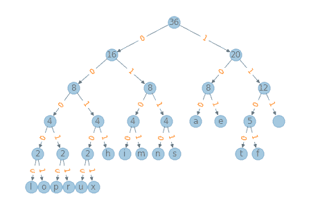

# 第十五章：哈夫曼编码

> 原文：[`allendowney.github.io/DSIRP/huffman.html`](https://allendowney.github.io/DSIRP/huffman.html)

[点击此处在 Colab 上运行本章](https://colab.research.google.com/github/AllenDowney/DSIRP/blob/main/notebooks/huffman.ipynb)

哈夫曼编码是一种“常用于无损数据压缩的最佳前缀编码”。“代码”，“前缀”和“最佳”是该定义的三个部分，我们必须解开。

在这种情况下，“代码”是从符号到比特串的映射。例如，[ASCII](https://en.wikipedia.org/wiki/ASCII)是一种字符编码，将字符（如字母、数字和标点符号）映射到七位整数。由于所有 ASCII 比特串的长度相同，它是一个“固定长度代码”，与哈夫曼代码相对应的是“可变长度代码”。

为了解码使用可变长度代码编码的内容，必须有一种方法来确定一个比特串的结束和下一个比特串的开始。一般来说，有三种解决这个问题的方法：

+   一个选择是在每个比特串的开头使用一个特殊的序列来指示其长度。这是[Unicode 的工作原理](https://stackoverflow.com/questions/1543613/how-does-utf-8-variable-width-encoding-work)。

+   另一个选择是在每个比特串的末尾使用一个特殊的序列来标记结束。

+   第三种选择是使用“前缀码”，这就是哈夫曼编码的工作原理。

前缀码是一种代码，其中代码中的整个比特串不是代码中任何比特串的前缀。如果一个代码具有这个属性，我们可以逐位读取比特并检查是否已经完成了有效的比特串。如果是这样，我们知道我们已经到达了比特串的末尾，因为它不能是另一个比特串的前缀。

例如，以下是一个只有三个符号的前缀码：

```py
symbol        bit string
x             1
y             01
z             001 
```

在这个代码中，我们可以使用比特串`101001`对字符串`xyz`进行编码，并且我们可以在没有歧义的情况下解码结果。

这就是说哈夫曼编码是前缀码的含义；最后，哈夫曼编码在这样的意义上是“最佳的”，它为最常见的符号提供了短代码，为最不常见的符号提供了长代码。结果是，它最小化了编码一系列符号所需的平均比特数。

然而，为了实现这一壮举，我们必须知道符号的相对频率。做到这一点的一种方法是从一个“语料库”开始，这是一个包含我们期望的文本中的符号比例的文本。

举个例子，我将使用来自[Huffman code Wikipedia page](https://en.wikipedia.org/wiki/Huffman_coding)的文本。

```py
text = 'this is an example of a huffman tree' 
```

我们可以使用`Counter`来计算文本中每个符号出现的次数。

```py
from collections import Counter

c = Counter(text)
c 
```

```py
Counter({'t': 2,
         'h': 2,
         'i': 2,
         's': 2,
         ' ': 7,
         'a': 4,
         'n': 2,
         'e': 4,
         'x': 1,
         'm': 2,
         'p': 1,
         'l': 1,
         'o': 1,
         'f': 3,
         'u': 1,
         'r': 1}) 
```

现在让我们看看如何使用这些计数来构建一个哈夫曼编码。第一步是构建一个哈夫曼树，这是一棵二叉树，其中每个节点都包含一个计数，有些节点包含符号。

要制作一个哈夫曼树，我们从一个节点序列开始，每个符号一个节点。为了表示节点，我将使用一个`namedtuple`。

```py
from collections import namedtuple

Node = namedtuple('Node', ['count', 'letter', 'left', 'right']) 
```

例如，这是一个代表符号`a`的节点，计数为`4`。由于这个节点没有子节点，它是一个叶节点。

```py
left = Node(4, 'a', None, None)
left 
```

```py
Node(count=4, letter='a', left=None, right=None) 
```

这是另一个代表符号`n`及其计数的叶节点。

```py
right = Node(2, 'n', None, None)
right 
```

```py
Node(count=2, letter='n', left=None, right=None) 
```

我们使用`namedtuple`的一个原因是它的行为类似于元组，因此如果我们比较两个`Node`对象，我们会得到类似元组的排序顺序。

```py
left > right 
```

```py
True 
```

如果两个节点具有相同的`count`，它们将按字母顺序排序。

## 制作树

给定这两个叶节点，我们可以制作这样的树：

```py
count = left.count + right.count
root = Node(count, '\0', left, right)
root 
```

```py
Node(count=6, letter='\x00', left=Node(count=4, letter='a', left=None, right=None), right=Node(count=2, letter='n', left=None, right=None)) 
```

因为`root`有子节点，它不是一个叶节点；它是一个内部节点。在哈夫曼树中，内部节点不代表符号，所以我将`letter`设置为空字符`\0`。内部节点的计数是其子节点的计数之和。

现在，要构建一棵赫夫曼树，我们将从一个节点集合开始，每个符号一个节点，并通过以下步骤“自下而上”构建树：

1.  移除具有最低计数的节点。

1.  移除具有下一个最低计数的节点。

1.  创建一个新节点，将刚刚移除的节点作为子节点。

1.  将新节点放回集合中。

1.  如果集合中只有一个节点，则它就是赫夫曼树，我们完成了。

一般来说，我们可以使用任何类型的集合，但是如果我们看一下此算法所需的操作，最有效的选项是堆。

但是我们将首先通过迭代`Counter`并制作`Node`对象的列表，

```py
nodes = [Node(count, letter, None, None) 
         for (letter, count) in c.items()]
nodes 
```

```py
[Node(count=2, letter='t', left=None, right=None),
 Node(count=2, letter='h', left=None, right=None),
 Node(count=2, letter='i', left=None, right=None),
 Node(count=2, letter='s', left=None, right=None),
 Node(count=7, letter=' ', left=None, right=None),
 Node(count=4, letter='a', left=None, right=None),
 Node(count=2, letter='n', left=None, right=None),
 Node(count=4, letter='e', left=None, right=None),
 Node(count=1, letter='x', left=None, right=None),
 Node(count=2, letter='m', left=None, right=None),
 Node(count=1, letter='p', left=None, right=None),
 Node(count=1, letter='l', left=None, right=None),
 Node(count=1, letter='o', left=None, right=None),
 Node(count=3, letter='f', left=None, right=None),
 Node(count=1, letter='u', left=None, right=None),
 Node(count=1, letter='r', left=None, right=None)] 
```

接下来我们将使用堆模块将列表转换为堆。

```py
from heapq import heapify, heappop, heappush

heap = nodes.copy()
heapify(heap)
heap 
```

```py
[Node(count=1, letter='l', left=None, right=None),
 Node(count=1, letter='p', left=None, right=None),
 Node(count=1, letter='o', left=None, right=None),
 Node(count=1, letter='r', left=None, right=None),
 Node(count=2, letter='h', left=None, right=None),
 Node(count=2, letter='i', left=None, right=None),
 Node(count=1, letter='u', left=None, right=None),
 Node(count=2, letter='s', left=None, right=None),
 Node(count=1, letter='x', left=None, right=None),
 Node(count=2, letter='m', left=None, right=None),
 Node(count=7, letter=' ', left=None, right=None),
 Node(count=4, letter='a', left=None, right=None),
 Node(count=2, letter='t', left=None, right=None),
 Node(count=3, letter='f', left=None, right=None),
 Node(count=2, letter='n', left=None, right=None),
 Node(count=4, letter='e', left=None, right=None)] 
```

现在我们可以使用堆来构建一棵树。

**练习：**编写一个名为`make_tree`的函数，该函数接受`Node`对象的堆，并使用我描述的算法制作并返回一棵赫夫曼树。换句话说，它应该将节点连接成一棵树并返回根节点。

使用此代码进行测试。

```py
tree = make_tree(heap) 
```

## 绘制树

为了查看它的样子，我们将使用 NetworkX 和一个名为 EoN 的库。

```py
try:
    import EoN
except ImportError:
    !pip  install  EoN 
```

以下函数遍历赫夫曼树并创建一个 NetworkX `DiGraph`。

```py
import networkx as nx

def add_edges(parent, G):
  """Make a NetworkX graph that represents the tree."""
    if parent is None:
        return

    for child in (parent.left, parent.right):
        if child:
            G.add_edge(parent, child)
            add_edges(child, G) 
```

```py
G = nx.DiGraph()
add_edges(tree, G) 
```

以下函数再次遍历树，并在字典中收集节点标签。

```py
def get_labels(parent, labels):
    if parent is None:
        return

    if parent.letter == '\0':
        labels[parent] = parent.count
    else:
        labels[parent] = parent.letter

    get_labels(parent.left, labels)
    get_labels(parent.right, labels) 
```

```py
labels = {}
get_labels(tree, labels) 
```

```py
def get_edge_labels(parent, edge_labels):
    if parent is None:
        return

    if parent.left:
        edge_labels[parent, parent.left] = '0'
        get_edge_labels(parent.left, edge_labels)

    if parent.right:
        edge_labels[parent, parent.right] = '1'
        get_edge_labels(parent.right, edge_labels) 
```

```py
edge_labels = {}
get_edge_labels(tree, edge_labels)
len(edge_labels) 
```

```py
30 
```

现在我们准备好画图了。

```py
from EoN import hierarchy_pos

def draw_tree(tree):
    G = nx.DiGraph()
    add_edges(tree, G)
    pos = hierarchy_pos(G)
    labels = {}
    get_labels(tree, labels)
    edge_labels = {}
    get_edge_labels(tree, edge_labels)
    nx.draw(G, pos, labels=labels, alpha=0.4)
    nx.draw_networkx_edge_labels(G, pos, edge_labels=edge_labels, font_color='C1') 
```

```py
draw_tree(tree) 
```



结果可能与[维基百科页面](https://en.wikipedia.org/wiki/Huffman_coding)上的树不完全相同，但是我们树中的一个字母应该与他们树中相同字母处于相同的层级。

## 制作表

以下函数遍历树，跟踪路径。当它找到叶节点时，在表中进行记录。

```py
def is_leaf(node):
    return node.left is None and node.right is None 
```

```py
def make_table(node, path, table):
    if node is None:
        return

    if is_leaf(node):
        table[node.letter] = path
        return

    make_table(node.left, path+'0', table)
    make_table(node.right, path+'1', table) 
```

```py
table = {}
make_table(tree, '', table)

table 
```

```py
{'l': '00000',
 'o': '00001',
 'p': '00010',
 'r': '00011',
 'u': '00100',
 'x': '00101',
 'h': '0011',
 'i': '0100',
 'm': '0101',
 'n': '0110',
 's': '0111',
 'a': '100',
 'e': '101',
 't': '1100',
 'f': '1101',
 ' ': '111'} 
```

## 编码

我们可以使用表来对字符串进行编码，通过查找字符串中的每个符号并将结果连接成一个位字符串。

```py
def encode(s, table):
    t = [table[letter] for letter in s]
    return ''.join(t) 
```

这是一个例子，需要注意的是，我们可以对除了我们开始的语料库之外的字符串进行编码，只要它不包含语料库中没有的符号。

```py
code = encode('this is spinal tap',table)
code 
```

```py
'1100001101000111111010001111110111000100100011010000000111110010000010' 
```

## 解码

要解码位字符串，我们从树的顶部开始并跟随路径，在看到`0`时向左转，在看到`1`时向右转。如果我们到达叶节点，我们已经解码了一个符号，因此我们应该记录它，然后跳回树的顶部开始解码下一个符号。

**练习：**编写一个名为`decode`的函数，该函数以 0 和 1 组成的字符串和一个赫夫曼树作为参数。它应该解码消息并将其作为字符串返回。

```py
decode(code, tree) 
```

```py
'this is spinal tap' 
```

*Python 中的数据结构和信息检索*

版权所有 2021 年 Allen Downey

许可证：[知识共享署名-非商业性使用-相同方式共享 4.0 国际许可协议](https://creativecommons.org/licenses/by-nc-sa/4.0/)
