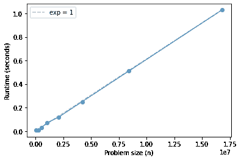

# 双端队列

> 原文：[`allendowney.github.io/DSIRP/deque.html`](https://allendowney.github.io/DSIRP/deque.html)

[单击此处在 Colab 上运行本章](https://colab.research.google.com/github/AllenDowney/DSIRP/blob/main/notebooks/deque.ipynb)

## 双端队列

使用 Python 列表，我们可以在常数时间内从列表的*末尾*添加和删除元素，但是从开头添加和删除元素需要线性时间。这是因为 Python 列表是使用动态增长的数组实现的。

使用链接列表，我们可以在常数时间内添加和删除列表的*开头*的元素，但是从末尾添加和删除元素需要线性时间。

使用这两种实现中的任何一种，都可以轻松地创建一个堆栈，也就是说，我们添加的第一个元素是我们移除的最后一个元素。堆栈也称为“先进后出”队列，缩写为 FILO。

但是实现“先进先出”队列并不容易，也就是说，我们添加的第一个元素是*第一个*要移除的元素。

幸运的是，有方法可以实现可以在常数时间内从两端添加和删除元素的列表。具有此属性的集合称为双端队列，缩写为“deque”，发音类似于“deck”。

实现 deque 的一种方法是双向链表，也称为“头尾链接列表”。双向链表中的每个节点都有对列表中前一个节点的引用以及下一个元素的引用，我将其称为`left`和`right`。

```py
class Node:
    def __init__(self, data, left=None, right=None):
        self.data = data
        self.left = left
        self.right = right

    def __repr__(self):
        return f'Node({self.data})' 
```

我们可以像这样创建节点：

```py
node1 = Node(1)
node2 = Node(2)
node3 = Node(3)

node1 
```

```py
Node(1) 
```

然后将它们链接起来，就像这样：

```py
node1.right = node2
node2.right = node3

node2.left = node1
node3.left = node2 
```

要从左到右遍历列表，我们可以从开头开始并跟随`right`链接。

```py
node = node1
while node:
    print(node)
    node = node.right 
```

```py
Node(1)
Node(2)
Node(3) 
```

要从右到左遍历，我们从末尾开始并跟随`left`链接。

```py
node = node3
while node:
    print(node)
    node = node.left 
```

```py
Node(3)
Node(2)
Node(1) 
```

## 双端队列对象

对于某些操作，拥有另一个表示整个列表的对象将很方便（而不是它的一个节点）。

这是类定义。

```py
class Deque:
    def __init__(self, head=None, tail=None):
        self.head = head
        self.tail = tail

    def __repr__(self):
        return f'LinkedList({self.head}, {self.tail})' 
```

现在我们可以创建一个具有对`node1`和`node3`的引用的`Deque`：

```py
deque = Deque(node1, node3)
deque 
```

```py
LinkedList(Node(1), Node(3)) 
```

出于调试目的，我将使用以下函数，它从右到左打印列表，然后从左到右打印，这可以确认所有的链接都是正确的。

```py
def print_deque(deque):
    node = deque.head
    while node:
        print(node.data, end=', ')
        node = node.right
    print()

    node = deque.tail
    while node:
        print(node.data, end=', ')
        node = node.left
    print() 
```

这是一个例子。

```py
print_deque(deque) 
```

```py
1, 2, 3, 
3, 2, 1, 
```

## 推

现在让我们看看如何在常数时间内从开头和末尾添加和删除元素。我们将从推送操作开始。

如果我们从一个空的 deque 开始，添加第一个节点是一个特殊情况，所以我会将其放入一个函数中。

```py
def push_first(deque, value):
    deque.head = deque.tail = Node(value, None, None) 
```

这是一个例子。

```py
deque = Deque()
push_first(deque, 1)
print_deque(deque) 
```

```py
1, 
1, 
```

**练习：**编写`left_push`，它接受一个`Deque`对象和一个新值，并将该值添加到 deque 的开头。

如果队列为空，则应调用`push_first`来处理特殊情况；否则应处理一般情况。

您可以使用以下示例来测试您的函数：

```py
deque = Deque()
left_push(deque, 2)
print_deque(deque) 
```

```py
2, 
2, 
```

```py
left_push(deque, 1)
print_deque(deque) 
```

```py
1, 2, 
2, 1, 
```

**练习：**编写`right_push`，它接受一个`Deque`对象和一个新值，并将该值添加到 deque 的末尾。

如果队列为空，则应调用`push_first`来处理特殊情况；否则应处理一般情况。

您可以使用以下示例来测试您的函数：

```py
deque = Deque()
right_push(deque, 3)
print_deque(deque) 
```

```py
3, 
3, 
```

```py
right_push(deque, 4)
print_deque(deque) 
```

```py
3, 4, 
4, 3, 
```

## 弹出

要从 deque 中弹出元素，我们必须处理两种特殊情况：

+   如果`head`和`tail`都是`None`，则 deque 为空，我们应该引发`ValueError`。

+   如果`head`和`tail`引用同一个`Node`，则只有一个元素，因此我们应该删除它并使 deque 为空。

以下函数处理这些情况。

```py
def pop_last(deque):
    if deque.head is None:
        raise ValueError('Tried to pop from empty deque')

    old_head = deque.head
    deque.head = deque.tail = None
    return old_head.data 
```

我们可以这样测试它：

```py
deque = Deque()
left_push(deque, 1)
pop_last(deque) 
```

```py
1 
```

```py
print_deque(deque) 
```

**练习：**编写`left_pop`，它接受一个`Deque`对象，删除第一个节点，并返回第一个数据值。

如果队列为空或只有一个元素，则应调用`pop_last`来处理特殊情况；否则应处理一般情况。

您可以使用以下示例来测试您的代码。

```py
deque = Deque()
left_push(deque, 2)
left_push(deque, 1)
print_deque(deque) 
```

```py
1, 2, 
2, 1, 
```

```py
left_pop(deque) 
```

```py
1 
```

检查剩余的列表是否格式良好。

```py
print_deque(deque) 
```

```py
2, 
2, 
```

```py
left_pop(deque) 
```

```py
2 
```

```py
try:
    left_pop(deque)
except ValueError as e:
    print(e) 
```

```py
Tried to pop from empty deque 
```

**练习：**编写`right_pop`，它接受一个`Deque`对象，删除最后一个节点，并返回最后一个数据值。

如果队列为空或只有一个元素，它应该调用`pop_last`来处理特殊情况；否则，它应该处理一般情况。

您可以使用以下示例来测试您的函数。

```py
deque = Deque()
left_push(deque, 2)
left_push(deque, 1)
print(deque) 
```

```py
LinkedList(Node(1), Node(2)) 
```

```py
right_pop(deque) 
```

```py
2 
```

```py
print_deque(deque) 
```

```py
1, 
1, 
```

```py
right_pop(deque) 
```

```py
1 
```

```py
try:
    right_pop(deque)
except ValueError as e:
    print(e) 
```

```py
Tried to pop from empty deque 
```

## collections.deque

Python 的 collections 模块提供了 deque 的实现。您可以在[这里阅读文档](https://docs.python.org/3/library/collections.html#collections.deque)和在[这里查看源代码](https://github.com/python/cpython/blob/d943d19172aa93ce88bade15b9f23a0ce3bc72ff/Modules/_collectionsmodule.c)。

为了确认它可以在常数时间内添加和删除元素，让我们运行一些计时测试。

```py
from os.path import basename, exists

def download(url):
    filename = basename(url)
    if not exists(filename):
        from urllib.request import urlretrieve
        local, _ = urlretrieve(url, filename)
        print('Downloaded ' + local)

download('https://github.com/AllenDowney/DSIRP/raw/main/timing.py') 
```

```py
from collections import deque

def appendleft(n):
    d = deque()
    [d.appendleft(x) for x in range(n)] 
```

```py
def popleft(n):
    d = deque()
    [d.appendleft(x) for x in range(n)]    
    [d.popleft() for _ in range(n)] 
```

```py
from timing import run_timing_test

ns, ts = run_timing_test(appendleft) 
```

```py
1024 0.0
2048 0.0
4096 0.0
8192 0.0
16384 0.0
32768 0.0
65536 0.009999999999999787
131072 0.0
262144 0.010000000000000231
524288 0.029999999999999805
1048576 0.06999999999999984
2097152 0.1200000000000001
4194304 0.25
8388608 0.5100000000000002
16777216 1.0299999999999998 
```

```py
def append(n):
    d = deque()
    [d.append(x) for x in range(n)] 
```

```py
from timing import plot_timing_test

plot_timing_test(ns, ts, scale='linear') 
```



运行这些操作`n`次在`n`中是线性的，这意味着每个操作至少在平均情况下是常数时间。

**练习：** 修改上面的示例以确认`append`和`pop`也是常数时间。

*Python 中的数据结构和信息检索*

版权所有 2021 Allen Downey

许可证：[知识共享署名-非商业性使用-相同方式共享 4.0 国际许可协议](https://creativecommons.org/licenses/by-nc-sa/4.0/)
