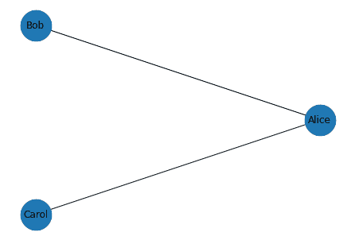
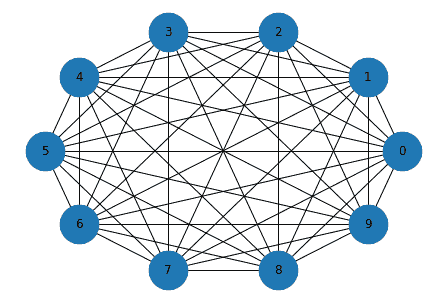
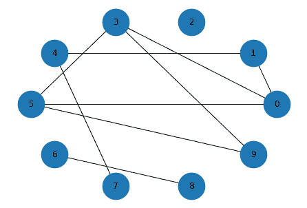
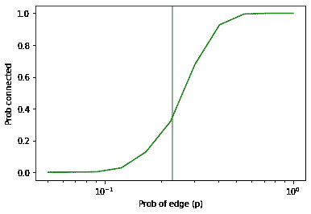

# 第二十三章：图

> 原文：[`allendowney.github.io/DSIRP/graph.html`](https://allendowney.github.io/DSIRP/graph.html)
> 
> 译者：[飞龙](https://github.com/wizardforcel)
> 
> 协议：[CC BY-NC-SA 4.0](http://creativecommons.org/licenses/by-nc-sa/4.0/)


这个笔记本是从[Think Complexity](https://greenteapress.com/wp/think-complexity-2e/)的第二章改编的。

[点击这里在 Colab 上运行本章](https://colab.research.google.com/github/AllenDowney/DSIRP/blob/main/notebooks/graph.ipynb)

## 图

图是一个节点和边的集合，其中节点通常表示对象或想法，边表示它们之间的关系。例如，在表示社交网络的图中，节点可以表示人，边可以表示他们之间的友谊。

NetworkX 提供了用于表示图形的数据结构和实现图形算法的函数。为了展示它是如何工作的，我们将创建一个代表社交网络的小图。

这是我们如何创建一个图并添加节点。

```py
import networkx as nx

G = nx.Graph()
G.add_node('Alice')
G.add_node('Bob', age=23)
G.add_node('Carol', cat='mittens')
list(G.nodes()) 
```

```py
['Alice', 'Bob', 'Carol'] 
```

可选地，您可以提供与节点关联的属性。在这个例子中，Bob 有一个`age`属性，Carol 有一只猫。

这是我们如何在节点之间添加边。

```py
G.add_edge('Alice', 'Bob')
G.add_edge('Alice', 'Carol', type='enemy')
list(G.edges()) 
```

```py
[('Alice', 'Bob'), ('Alice', 'Carol')] 
```

可选地，您可以提供与边关联的属性。在这个例子中，第二条边有一个名为`type`的属性，表示关系的性质。

这是如何绘制图形的。

```py
def draw_graph(G):
    nx.draw_circular(G, node_size=1500, with_labels=True) 
```

```py
draw_graph(G) 
```



**练习：**假设 Alice 介绍了 Bob 和 Carol，他们成为了好朋友。通过在 Bob 和 Carol 之间添加一个适当的属性的边来更新社交网络，然后再次绘制图形。

## 图表示

NetworkX 使用一个从每个节点映射到从节点到边的字典来表示图形。

如果我们从顶层字典中选择一个元素，结果将是一个类似字典的对象。

```py
G['Alice'] 
```

```py
AtlasView({'Bob': {}, 'Carol': {'type': 'enemy'}}) 
```

所以我们可以像这样遍历节点的邻居：

```py
for neighbor in G['Alice']:
    print(neighbor) 
```

```py
Bob
Carol 
```

或者像这样枚举邻居和边:

```py
for key, value in G['Alice'].items():
    print(key, value) 
```

```py
Bob {}
Carol {'type': 'enemy'} 
```

边由属性字典表示。在这个例子中，第一条边没有属性，第二条边有一个名为`type`的属性。

我们可以像这样选择一条边：

```py
G['Alice']['Carol'] 
```

```py
{'type': 'enemy'} 
```

要检查是否有从一个节点到另一个节点的边，我们可以使用`in`运算符：

```py
def has_edge(G, u, v):
    return v in G[u] 
```

```py
has_edge(G, 'Alice', 'Bob') 
```

```py
True 
```

但是有一个可以做同样事情的方法。

```py
G.has_edge('Alice', 'Bob') 
```

```py
True 
```

## 完全图

在完全图中，所有节点彼此相连。为了创建一个完全图，我们将使用以下生成器函数，遍历所有节点对。

```py
def all_pairs(nodes):
    for i, u in enumerate(nodes):
        for j, v in enumerate(nodes):
            if i < j:
                yield u, v 
```

这是一个有 10 个节点的完全图：

```py
def make_complete_graph(n):
    nodes = range(n)
    G = nx.Graph()
    G.add_nodes_from(nodes)
    G.add_edges_from(all_pairs(nodes))
    return G 
```

```py
complete = make_complete_graph(10) 
```

这是它的样子。

```py
draw_graph(complete) 
```



## 随机图

接下来我们将创建一个 Erdos-Renyi 图，这是一个随机图，其中每对节点之间的边的概率是$p$。

辅助函数`flip`以概率`p`返回`True`，以概率`1-p`返回`False`

```py
import random

def flip(p):
    return random.random() < p 
```

`random_pairs`是一个生成器函数，它枚举所有可能的节点对，并以概率`p`产生每一个。

```py
def random_pairs(nodes, p):
    for edge in all_pairs(nodes):
        if flip(p):
            yield edge 
```

`make_random_graph`创建一个 ER 图，其中每对节点之间的边的概率是`p`。

```py
def make_random_graph(n, p):
    nodes = range(n)
    G = nx.Graph()
    G.add_nodes_from(nodes)
    G.add_edges_from(random_pairs(nodes, p))
    return G 
```

这是一个`n=10`和`p=0.3`的例子

```py
random_graph = make_random_graph(10, 0.3)
len(random_graph.edges()) 
```

```py
9 
```

这是它的样子：

```py
draw_graph(random_graph) 
```



## 连通性

如果您可以从任何节点开始并沿着一系列边到达任何其他节点，则图形是**连接**的。

要检查图是否连通，我们将使用深度优先搜索的一个版本。首先，让我们看看基本 DFS 出了什么问题；然后我们将解决问题。

```py
def basic_dfs(G, start):
    stack = [start]

    while stack:
        node = stack.pop()
        print(node)
        stack.extend(G[node]) 
```

```py
# basic_dfs(random_graph, 0) 
```

对于大多数图形，基本版本的 DFS 永远运行，因为它一遍又一遍地访问相同的节点。解决方法是跟踪我们见过的节点，并避免多次访问它们。

**练习：**编写一个名为`reachable_nodes`的函数，它接受一个图和一个起始节点，使用 DFS 找到可以从起始节点到达的所有节点，并返回一个包含它们的集合。

提示：考虑使用什么样的集合。

在完全图中，从节点 0 开始，我们可以到达所有节点：

```py
reachable_nodes(complete, 0) 
```

```py
{0, 1, 2, 3, 4, 5, 6, 7, 8, 9} 
```

在随机图中，可能可以到达所有节点，也可能不行。

```py
reachable_nodes(random_graph, 0) 
```

```py
{0, 1, 3, 4, 5, 7, 9} 
```

因此，我们可以使用`reachable_nodes`来检查图是否连通：

```py
def is_connected(G):
    start = next(iter(G))
    reachable = reachable_nodes(G, start)
    return len(reachable) == len(G) 
```

同样，完全图是连通的：

```py
is_connected(complete) 
```

```py
True 
```

如果我们使用较低的`p`值生成一个随机图，它可能不连通。

```py
random_graph = make_random_graph(10, 0.1)
len(random_graph.edges()) 
```

```py
4 
```

```py
is_connected(random_graph) 
```

```py
False 
```

如果我们使用较高的`p`值生成一个随机图，它可能不连通。

```py
random_graph = make_random_graph(10, 0.9)
len(random_graph.edges()) 
```

```py
40 
```

```py
is_connected(random_graph) 
```

```py
True 
```

## 连通性的概率

这种行为是网络科学中的一篇[重要论文](https://www.renyi.hu/~p_erdos/1960-10.pdf)的主题。我们可以使用 NetworkX 和我们编写的函数来复制他们的一个结果。

以下函数接受`n`和`p`，生成`iters`个图，并返回连接的图的比例。

```py
import numpy as np

def prob_connected(n, p, iters=100):
    tf = [is_connected(make_random_graph(n, p))
          for i in range(iters)]
    return np.mean(tf) 
```

当`n=10`且`p=0.23`时，连通的概率约为 33%。

```py
n = 10
prob_connected(n, 0.23, iters=10000) 
```

```py
0.3518 
```

根据 Erdos 和 Renyi，对于`n=10`，`p`的临界值约为 0.23。

```py
pstar = np.log(n) / n
pstar 
```

```py
0.23025850929940458 
```

因此，让我们绘制一系列`p`值的连通性概率

```py
ps = np.logspace(-1.3, 0, 11)
ps 
```

```py
array([0.05011872, 0.0676083 , 0.09120108, 0.12302688, 0.16595869,
       0.22387211, 0.30199517, 0.40738028, 0.54954087, 0.74131024,
       1\.        ]) 
```

我将使用`iters=1000`来估计概率

```py
ys = [prob_connected(n, p, 1000) for p in ps]

for p, y in zip(ps, ys):
    print(p, y) 
```

```py
0.05011872336272722 0.0
0.06760829753919818 0.001
0.09120108393559097 0.003
0.12302687708123815 0.028
0.16595869074375605 0.128
0.22387211385683395 0.319
0.3019951720402016 0.679
0.40738027780411273 0.927
0.5495408738576245 0.995
0.7413102413009173 1.0
1.0 1.0 
```

然后绘制它们，在计算出的临界值处添加一条垂直线

```py
import matplotlib.pyplot as plt

plt.axvline(pstar, color='gray')
plt.plot(ps, ys, color='green')
plt.xlabel('Prob of edge (p)')
plt.ylabel('Prob connected')
plt.xscale('log') 
```



**练习：** 在我的`reachable_nodes`实现中，您可能会对将*所有*邻居添加到堆栈中而不检查它们是否已在`seen`中而感到困扰。编写此函数的一个版本，在将其添加到堆栈之前检查邻居。这种“优化”是否改变了增长的顺序？它是否使函数更快？

```py
complete = make_complete_graph(100) 
```

```py
%timeit len(reachable_nodes(complete, 0)) 
```

```py
565 µs ± 8.91 µs per loop (mean ± std. dev. of 7 runs, 1000 loops each) 
```

```py
%timeit len(reachable_nodes_precheck(complete, 0)) 
```

```py
611 µs ± 47.9 µs per loop (mean ± std. dev. of 7 runs, 1000 loops each) 
```

对于较大的`n`值，这两种方法的性能如何比较？

*Python 中的数据结构和信息检索*

版权所有 2021 Allen Downey

许可证：[知识共享署名-非商业-相同方式共享 4.0 国际许可协议](https://creativecommons.org/licenses/by-nc-sa/4.0/)
