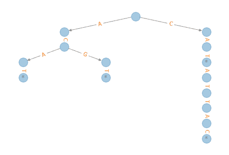

# 第二十六章：测验 6

> 原文：[`allendowney.github.io/DSIRP/quiz06.html`](https://allendowney.github.io/DSIRP/quiz06.html)

在开始此测验之前：

1.  单击“复制到驱动器”以复制测验，

1.  单击“共享”,

1.  单击“更改”，然后选择“任何拥有此链接的人都可以编辑”

1.  单击“复制链接”和

1.  将链接粘贴到[此 Canvas 作业](https://canvas.olin.edu/courses/313/assignments/5138)中。

此测验是开放笔记，开放互联网。

+   您可以向讲师寻求帮助，但不能向其他人寻求帮助。

+   您可以使用在互联网上找到的代码，但是如果您从单个来源使用了多行代码，您应该注明出处。

## 序列树

假设您有大量的 DNA 序列，使用包含字符`A`、`C`、`G`和`T`的字符串表示，这些是构成 DNA 的碱基。

存储这些序列的一种方法是在树中，其中每个节点有四个子节点，每个子节点代表一个碱基。以下是这样一个节点的类定义。

```py
class Node:
    def __init__(self):
        self.children = [None, None, None, None]
        self.end = False

    def __repr__(self):
        return f'Node({self.end}, {self.children})' 
```

实例变量是：

+   `children`，这是一个包含四个`Node`对象的列表，其中`None`表示缺少一个子节点。

+   `end`：这是一个`bool`，表示这个`Node`是否代表序列的结尾。

我将使用以下字典将每个碱基映射到其在子列表中的索引。

```py
index_map = dict(A=0, C=1, G=2, T=3)
index_map 
```

```py
{'A': 0, 'C': 1, 'G': 2, 'T': 3} 
```

以下函数将一个新序列插入到树中。

```py
def insert(root, sequence):
    node = root
    for base in sequence:
        i = index_map[base]
        if node.children[i] is None:
            node.children[i] = Node()
        node = node.children[i]
    node.end = True 
```

例如，这是一个只包含一个序列`CA`的树。

```py
node = Node()
insert(node, 'CA')
node 
```

```py
Node(False, [None, Node(False, [Node(True, [None, None, None, None]), None, None, None]), None, None]) 
```

树的根有一个子节点，索引为`1`。

```py
child = node.children[1]
child 
```

```py
Node(False, [Node(True, [None, None, None, None]), None, None, None]) 
```

该子节点有一个子节点，索引为`0`。

```py
grandchild = child.children[0]
grandchild 
```

```py
Node(True, [None, None, None, None]) 
```

在孙子中，`end`为`True`，这表示树中有一个以此节点结尾的序列。

以下是一个包含更多序列的示例。

```py
tree = Node()
for sequence in ['ACGT', 'ACAT', 'CAT', 'CATATTAC']:
    insert(tree, sequence) 
```

我将使用 NetworkX 和 EoN 来绘制这棵树。

```py
try:
    import EoN
except ImportError:
    !pip  install  EoN 
```

```py
import networkx as nx

def add_edges(parent, G):
  """Traverse the tree and add edges to G."""
    for child in parent.children:
        if child:
            G.add_edge(parent, child)
            add_edges(child, G) 
```

```py
G = nx.DiGraph()
add_edges(tree, G) 
```

```py
def get_labels(parent, labels):
  """Traverse the tree and add node labels to a dictionary."""
    if parent.end:
        labels[parent] = '*'
    else:
        labels[parent] = ''

    for child in parent.children:
        if child:
            get_labels(child, labels) 
```

```py
def get_edge_labels(parent, edge_labels):
  """Traverse the tree and add edge labels to a dictionary."""
    bases = 'ACGT'
    for i, child in enumerate(parent.children):
        if child:
            edge_labels[parent, child] = bases[i]
            get_edge_labels(child, edge_labels) 
```

```py
from EoN import hierarchy_pos

def draw_tree(tree):
    G = nx.DiGraph()
    add_edges(tree, G)
    pos = hierarchy_pos(G)
    labels = {}
    get_labels(tree, labels)
    edge_labels = {}
    get_edge_labels(tree, edge_labels)
    nx.draw(G, pos, labels=labels, alpha=0.4)
    nx.draw_networkx_edge_labels(G, pos, 
                                 edge_labels=edge_labels, 
                                 font_color='C1') 
```

```py
draw_tree(tree) 
```



## 问题 1

编写一个名为`find`的函数，它接受以下参数

+   代表树的根的`Node`和

+   表示碱基序列的字符串。

如果序列出现在树中，则应返回`True`，否则返回`False`。

您可以使用以下示例来测试您的代码：

```py
find(tree, 'CAT')  # should be True 
```

```py
True 
```

```py
find(tree, 'ACAT') # should be True 
```

```py
True 
```

```py
find(tree, 'TAG') # should be False 
```

```py
False 
```

```py
find(tree, 'CA') # should be False 
```

```py
False 
```

## 问题 2

编写一个名为`find_all_rec`的函数，它接受以下参数：

+   树中的一个`Node`。

+   指示从根到当前`Node`的碱基序列的路径。

+   一个序列列表。

此函数应该遍历树并将它发现的所有完整序列添加到列表中。

提示：查看`huffman.ipynb`中的`make_table`。

您可以使用以下示例来测试您的代码。

```py
t = []
find_all_rec(tree, '', t)
t 
```

```py
['ACAT', 'ACGT', 'CAT', 'CATATTAC'] 
```

结果应该是一个包含以下元素的列表，不一定按照这个顺序

```py
['ACAT', 'ACGT', 'CAT', 'CATATTAC'] 
```

## 问题 3

编写一个名为`find_all`的函数，它接受一个`Node`和一系列碱基。它应该遍历树并返回一个包含以给定前缀开头的树中所有序列的列表。

注意：即使您对上一个问题的答案不起作用，您仍然可以将`find_all_rec`作为解决方案的一部分使用。

您可以使用以下示例来测试您的代码。

```py
find_all(tree, 'CA')   # Should return ['CAT', 'CATATTAC'] 
```

```py
['CAT', 'CATATTAC'] 
```

```py
find_all(tree, 'A')    # Should return ['ACAT', 'ACGT'] 
```

```py
['ACAT', 'ACGT'] 
```

```py
find_all(tree, '')     # Should return all sequences in the tree 
```

```py
['ACAT', 'ACGT', 'CAT', 'CATATTAC'] 
```

## 问题 4

假设我们编写一个更通用的`Node.__init__`版本，它将`end`和`children`作为可选参数。

```py
class BadNode:
    def __init__(self, end=True, children=[None, None, None, None]):
        self.children = children
        self.end = end

    def __repr__(self):
        return f'Node({self.end}, {self.children})' 
```

我们编写一个使用`BadNode`的`insert`的版本：

```py
def bad_insert(root, sequence):
    node = root
    for base in sequence:
        i = index_map[base]
        if node.children[i] is None:
            node.children[i] = BadNode(end=False)
        node = node.children[i]
    node.end = True 
```

如果我们使用新版本来构建一棵树，就像这样：

```py
tree2 = BadNode()
for sequence in ['ACGT', 'ACAT', 'CAT', 'CATATTAC']:
    bad_insert(tree2, sequence) 
```

似乎可以工作。但是如果我们绘制树，就会得到`RecursionError`。

```py
draw_tree(tree2) 
```

```py
---------------------------------------------------------------------------
RecursionError  Traceback (most recent call last)
<ipython-input-67-f08ae257619c> in <module>
----> 1 draw_tree(tree2)

<ipython-input-50-bd629f554f38> in draw_tree(tree)
  3 def draw_tree(tree):
  4     G = nx.DiGraph()
----> 5     add_edges(tree, G)
  6     pos = hierarchy_pos(G)
  7     labels = {}

<ipython-input-46-db255f1cfa96> in add_edges(parent, G)
  6         if child:
  7             G.add_edge(parent, child)
----> 8             add_edges(child, G)

... last 1 frames repeated, from the frame below ...

<ipython-input-46-db255f1cfa96> in add_edges(parent, G)
  6         if child:
  7             G.add_edge(parent, child)
----> 8             add_edges(child, G)

RecursionError: maximum recursion depth exceeded while calling a Python object 
```

在定义`BadNode`的单元格中，编写一个解释问题所在的注释，然后修复它。

注意：您的修复版本仍应接受`end`和`children`作为可选参数。

Python 中的数据结构和信息检索

版权所有 2021 年 Allen Downey

许可：[知识共享署名-非商业-相同方式共享 4.0 国际许可协议](https://creativecommons.org/licenses/by-nc-sa/4.0/)
