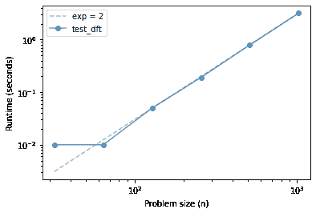
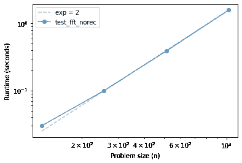
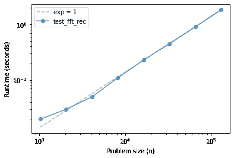

# 第二十九章：FFT

> 原文：[`allendowney.github.io/DSIRP/fft.html`](https://allendowney.github.io/DSIRP/fft.html)

[单击此处在 Colab 上运行本章](https://colab.research.google.com/github/AllenDowney/DSIRP/blob/main/notebooks/fft.ipynb)

```py
from os.path import basename, exists

def download(url):
    filename = basename(url)
    if not exists(filename):
        from urllib.request import urlretrieve
        local, _ = urlretrieve(url, filename)
        print('Downloaded ' + local)

download('https://github.com/AllenDowney/DSIRP/raw/main/timing.py') 
```

```py
from timing import run_timing_test, plot_timing_test 
```

## 离散傅里叶变换

根据我们在[Wikipedia](https://en.wikipedia.org/wiki/Discrete_Fourier_transform)上的朋友：

> 离散傅里叶变换将$N$个复数${\displaystyle \mathbf{x} =x_{0},x_{1},\ldots ,x_{N-1}}$序列转换为另一个复数序列${\displaystyle \mathbf{X} =X_{0},X_{1},\ldots ,X_{N-1},}$，其定义为
> 
> $$X_k = \sum_{n=0}^N x_n \cdot e^{-i 2 \pi k n / N} $$

注意：

+   $X$和$x$的长度相同，为$N$。

+   $n$是指定$x$元素的索引，和

+   $k$是指定$X$元素的索引。

让我们从一个小例子开始，使用 Numpy 的 FFT 实现来计算 DFT。

```py
x = [1, 0, 0, 0] 
```

```py
import numpy as np

np.fft.fft(x) 
```

```py
array([1.+0.j, 1.+0.j, 1.+0.j, 1.+0.j]) 
```

现在我们知道答案是什么，让我们自己计算一下。

这是计算$X$的一个元素的表达式。

```py
pi = np.pi
exp = np.exp
N = len(x)
k = 0 
```

```py
sum(x[n] * exp(-2j * pi * k * n / N) for n in range(N)) 
```

```py
(1+0j) 
```

将此代码包装在一个函数中可以使`k`和`n`的作用更清晰：

+   `k`是指定要计算 DFT 的元素的参数，和

+   `n`是我们用来计算总和的循环变量。

```py
def dft_k(x, k):
    N = len(x)
    return sum(x[n] * exp(-2j * pi * k * n / N) for n in range(N)) 
```

```py
dft_k(x, k=1) 
```

```py
(1+0j) 
```

通常我们一次计算$X$，所以我们可以将`dft_k`包装在另一个函数中：

```py
def dft(x):
    N = len(x)
    X = [dft_k(x, k) for k in range(N)]
    return X 
```

```py
dft(x) 
```

```py
[(1+0j), (1+0j), (1+0j), (1+0j)] 
```

这就是我们从 Numpy 得到的。

## 计时 DFT

让我们看看`dft`的性能如何。

```py
def test_dft(N):
    x = np.random.normal(size=N)
    X = dft(x) 
```

```py
%time test_dft(512) 
```

```py
CPU times: user 772 ms, sys: 44 µs, total: 772 ms
Wall time: 772 ms 
```

```py
ns, ts = run_timing_test(test_dft, start_at=5)
plot_timing_test(ns, ts, 'test_dft', exp=2) 
```

```py
32 0.010000000000000231
64 0.009999999999999787
128 0.050000000000000266
256 0.18999999999999995
512 0.79
1024 3.1799999999999993 
```



## 实现 FFT

FFT 算法的关键是[Danielson-Lanczos 引理](https://mathworld.wolfram.com/Danielson-LanczosLemma.html)，它说

$ X_k = E_k + e^{-i 2 \pi n / N} O_k $

哪里

+   $E$是$x$的偶数元素的 FFT，和

+   $O$是$x$的奇数元素的 DFT。

在我们可以将这个表达式转换成代码之前，我们必须处理一个问题。

请记住，如果$x$的长度为$N$，那么$X$的长度也是$N$。

如果我们选择$x$的偶数元素，结果是一个长度为$N/2$的序列，这意味着$E$的长度为$N/2$。$O$也是一样。

但是如果$k$从$0$增加到$N-1$，当它超过$N/2-1$时，我们该怎么办？

幸运的是，DFT 是重复的，所以$X_N$和$X_0$是相同的。这意味着我们可以通过重复它们来扩展$E$和$O$的长度，使用 Numpy 函数`tile`可以做到这一点。

所以，这是一个基于 D-L 引理的`merge`版本。

```py
def merge(E, O):
    N = len(E) * 2
    ns = np.arange(N)
    W = np.exp(-2j * pi * ns / N)
    return np.tile(E, 2) + W * np.tile(O, 2) 
```

**练习：**作为实现 FFT 的第一步，编写一个名为`fft_norec`的非递归函数，该函数接受一个名为`x`的序列。

1.  将`x`分为偶数和奇数元素，

1.  使用`dft`来计算`E`和`O`，和

1.  使用`merge`来计算`X`。

```py
fft_norec(x) 
```

```py
array([1.+0.j, 1.+0.j, 1.+0.j, 1.+0.j]) 
```

让我们看看性能如何。

```py
def test_fft_norec(N):
    x = np.random.normal(size=N)
    spectrum = fft_norec(x) 
```

```py
%time test_fft_norec(512) 
```

```py
CPU times: user 384 ms, sys: 3.38 ms, total: 388 ms
Wall time: 387 ms 
```

```py
ns, ts = run_timing_test(test_fft_norec, start_at=5)
plot_timing_test(ns, ts, 'test_fft_norec', exp=2) 
```

```py
32 0.0
64 0.0
128 0.030000000000001137
256 0.09999999999999964
512 0.3899999999999988
1024 1.5899999999999999 
```



**练习：**从`fft_norec`开始，编写一个名为`fft_rec`的完全递归的函数；也就是说，它应该使用`fft_rec`而不是使用`dft`来计算两半的 DFT。

您需要一个基本情况来避免无限递归。您有两个选择：

1.  长度为 1 的数组的 DFT 是数组本身。

1.  如果参数`x`小于某个阈值长度，则可以使用 DFT。

使用下面的`test_fft_rec`来检查函数的性能。

```py
fft_rec(x) 
```

```py
array([1.+0.j, 1.+0.j, 1.+0.j, 1.+0.j]) 
```

```py
def test_fft_rec(N):
    x = np.random.normal(size=N)
    spectrum = fft_rec(x) 
```

```py
%time test_fft_rec(512) 
```

```py
CPU times: user 8.36 ms, sys: 42 µs, total: 8.4 ms
Wall time: 7.92 ms 
```

```py
ns, ts = run_timing_test(test_fft_rec)
plot_timing_test(ns, ts, 'test_fft_rec', exp=1) 
```

```py
1024 0.019999999999999574
2048 0.030000000000001137
4096 0.049999999999998934
8192 0.11000000000000121
16384 0.22999999999999865
32768 0.45000000000000107
65536 0.9000000000000004
131072 1.83 
```



如果一切按计划进行，您的 FFT 实现应该比`dft`和`fft_norec`更快，并且在一系列问题规模上，它可能与线性函数无法区分。

*Python 中的数据结构和信息检索*

版权所有 2021 Allen Downey

许可证：[知识共享署名-非商业-相同方式共享 4.0 国际许可协议](https://creativecommons.org/licenses/by-nc-sa/4.0/)
