# 绘图

> 原文：[`allendowney.github.io/ElementsOfDataScience/06_plotting.html`](https://allendowney.github.io/ElementsOfDataScience/06_plotting.html)

[点击这里在 Colab 上运行这个笔记本](https://colab.research.google.com/github/AllenDowney/ElementsOfDataScience/blob/master/06_plotting.ipynb)或[点击这里下载](https://github.com/AllenDowney/ElementsOfDataScience/raw/master/06_plotting.ipynb)。

本章介绍了创建图和图表的方法，更一般地称为**数据可视化**。例如，我们将生成三个图：

+   我们将复制一张来自皮尤研究中心的图表，显示了美国宗教信仰随时间的变化。

+   我们将复制*经济学人*上显示波士顿和伦敦三明治价格的图表（我们在第三章中看到了这些数据）。

+   我们将制作一个图来测试 Zipf 定律，它描述了单词频率和它们的排名之间的关系。

使用本章的工具，你可以生成各种简单的图表。我们将在后面的章节中看到更多的可视化工具。但在我们开始绘图之前，我们需要一个新的语言特性：关键字参数。

## 关键字参数

当你调用大多数函数时，你必须提供值。例如，当你调用`np.exp`时，它会将$e$提高到给定的幂，你提供的值是一个数字：

```py
import numpy as np

np.exp(1) 
```

```py
2.718281828459045 
```

当你调用`np.power`时，你必须提供两个数字：

```py
np.power(10, 6) 
```

```py
1000000 
```

你提供的值被称为**参数**。具体来说，这些例子中的值是**位置参数**，因为它们的位置决定了它们的使用方式。在第二个例子中，`power`计算`10`的六次方，而不是`6`的 10 次方，因为参数的顺序。

许多函数还接受**关键字参数**，这些参数通过名称来识别。例如，我们之前使用`int`将字符串转换为整数。下面是我们如何将它与字符串一起使用作为位置参数：

```py
int('21') 
```

```py
21 
```

默认情况下，`int`假定数字是以 10 进制。但你可以提供一个指定不同进制的关键字参数。例如，字符串`'21'`，在 8 进制中表示数字`2 * 8 + 1 = 17`。下面是我们如何使用`int`进行这种转换。

```py
int('21', base=8) 
```

```py
17 
```

整数值`8`是一个关键字参数，关键字是`base`。

指定关键字参数看起来像一个赋值语句，但它不会创建一个新变量。当你指定一个关键字参数时，你不会选择变量名。在这个例子中，关键字名`base`是`int`的一部分。如果你指定另一个关键字名，你会得到一个错误。

**练习：**`print`函数接受一个名为`end`的关键字参数，指定它在行末打印的字符。默认情况下，`end`是换行符`\n`。所以如果你调用`print`超过一次，结果通常会出现在不同的行上，就像这样：

```py
for x in [1, 2, 3]:
    print(x) 
```

```py
1
2
3 
```

修改前面的例子，使其打印出列表的元素，全部在一行上，它们之间用空格隔开。然后修改它，打印出一个开放括号在开头，一个闭合括号和换行符在结尾。

## 宗教信仰图表

现在我们准备做一些图表。2019 年 10 月，皮尤研究中心在[`www.pewresearch.org/religion/2019/10/17/in-u-s-decline-of-christianity-continues-at-rapid-pace/`](https://www.pewresearch.org/religion/2019/10/17/in-u-s-decline-of-christianity-continues-at-rapid-pace/)上发布了“在美国，基督教的衰落继续以快速的速度”。其中包括这张图，显示了美国成年人在过去 10 年中宗教信仰的变化。

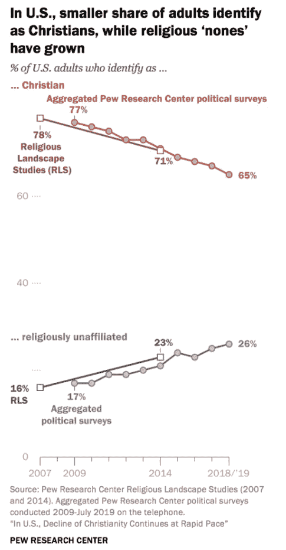

作为练习，我们将复制这张图。它显示了来自两个来源的结果，宗教景观研究和皮尤研究政治调查。政治调查提供了更多年的数据，所以我们将重点关注这一点。

图中的数据可从 Pew Research 的[`www.pewforum.org/wp-content/uploads/sites/7/2019/10/Detailed-Tables-v1-FOR-WEB.pdf`](https://www.pewforum.org/wp-content/uploads/sites/7/2019/10/Detailed-Tables-v1-FOR-WEB.pdf)获取，但它们在一个 PDF 文档中。有时可以从 PDF 文档中提取数据，但现在我们将手动输入数据。

```py
year = [2009, 2010, 2011, 2012, 2013, 2014, 2015, 2016, 2017, 2018]

christian = [77, 76, 75, 73, 73, 71, 69, 68, 67, 65]

unaffiliated = [17, 17, 19, 19, 20, 21, 24, 23, 25, 26] 
```

我们将用于绘图的库是 Matplotlib；更具体地说，我们将使用它的一部分称为 Pyplot，并将其用别名`plt`导入。

```py
import matplotlib.pyplot as plt 
```

Pyplot 提供了一个名为`plot`的函数，用于绘制线图。它接受两个序列作为参数，`x`值和`y`值。这些序列可以是元组、列表或数组。

```py
plt.plot(year, christian); 
```

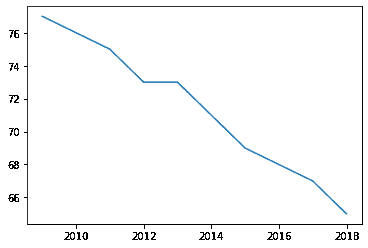

行末的分号阻止了`plot`的返回值（表示线的对象）被显示。

如果在单个单元格中绘制多条线，它们将出现在同一坐标轴上。

```py
plt.plot(year, christian)
plt.plot(year, unaffiliated); 
```

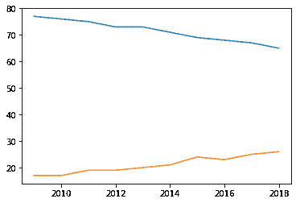

在同一坐标轴上绘制它们可以直接进行比较。但是，请注意，Pyplot 会自动选择轴的范围；在这个例子中，`y`轴从 15 左右开始，而不是从零开始。

因此，它提供了一个误导性的图片，使得这两条线的比率看起来比实际情况要大。我们可以使用函数`plt.ylim`设置`y`轴的限制。参数是一个包含两个值的列表，下限和上限。

```py
plt.plot(year, christian)
plt.plot(year, unaffiliated)

plt.ylim([0, 80]); 
```

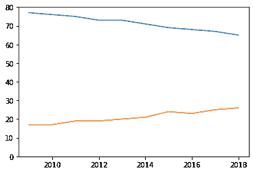

这样更好，但是这张图缺少一些最重要的元素：坐标轴的标签和标题。

## 装饰坐标轴

为了标记轴并添加标题，我们将使用 Pyplot 函数`xlabel`、`ylabel`和`title`。它们都以字符串作为参数。

```py
plt.plot(year, christian)
plt.plot(year, unaffiliated)

plt.ylim([0, 80])
plt.xlabel('Year')
plt.ylabel('% of adults')
plt.title('Religious affiliation of U.S adults'); 
```


现在让我们添加另一个重要元素，一个说明哪条线是哪条线的图例。为此，我们为每条线添加一个标签，使用关键字参数`label`。然后我们调用`plt.legend`创建图例。

```py
plt.plot(year, christian, label='Christian')
plt.plot(year, unaffiliated, label='Unaffiliated')

plt.ylim([0, 80])
plt.xlabel('Year')
plt.ylabel('% of adults')
plt.title('Religious affiliation of U.S adults')
plt.legend(); 
```

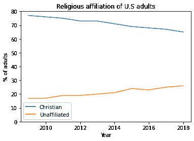

图例显示了我们在创建线时提供的标签。

练习：原始图绘制了数据点之间的线，但也绘制了标记显示每个数据点的位置。通常最好包括标记，特别是如果每年的数据不可用。

修改前面的示例，包括一个关键字参数`marker`，其字符串值为`'o'`，表示要绘制圆圈作为标记。

练习：在原始图中，标有“基督教”的线是红色的，标有“无宗教信仰”的线是灰色的。

找到`plt.plot`的在线文档，并弄清楚如何使用关键字参数来指定颜色。选择颜色（大致）与原始图相匹配。

`legend`函数接受一个关键字参数，指定图例的位置。阅读此函数的文档，并将图例移动到图的左中部。

## 绘制三明治价格

在第三章中，我们使用了《经济学人》一篇文章中的数据，比较了波士顿和伦敦的三明治价格：“为什么美国人午餐比英国人贵”[`www.economist.com/finance-and-economics/2019/09/07/why-americans-pay-more-for-lunch-than-britons-do`](https://www.economist.com/finance-and-economics/2019/09/07/why-americans-pay-more-for-lunch-than-britons-do)。

文章中包括了这张图，显示了两个城市的几种三明治的价格：

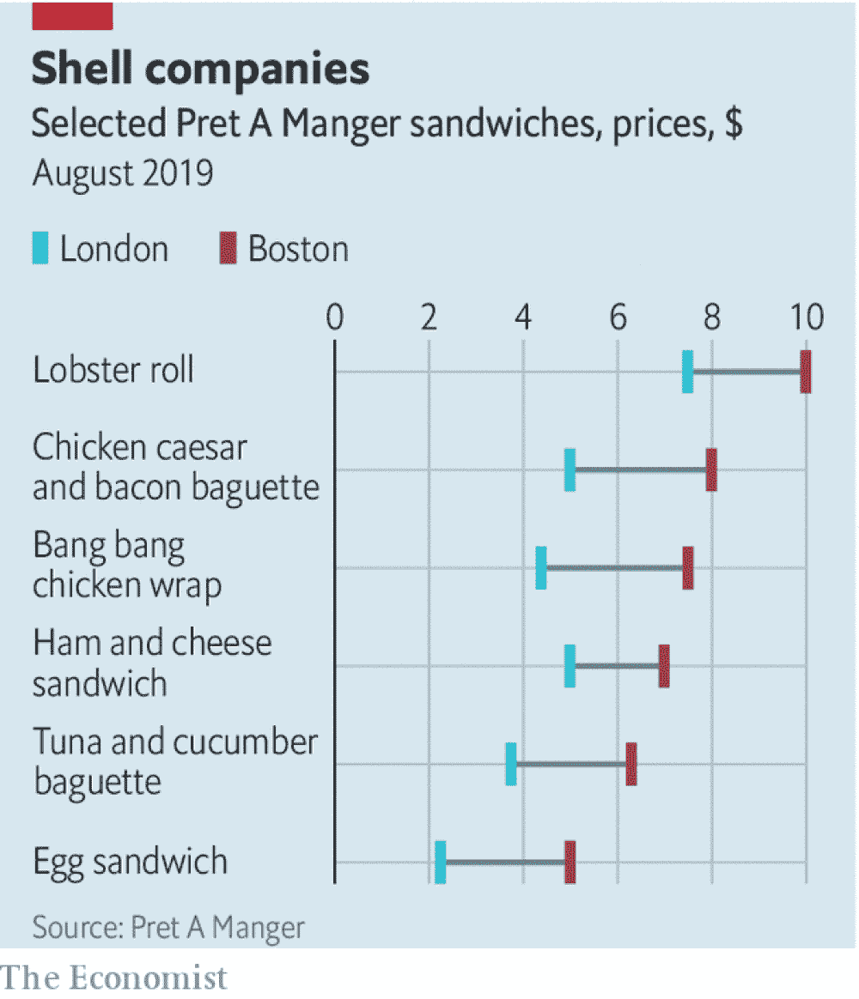

作为练习，让我们看看是否可以复制这张图。这是文章中的数据：三明治的名称和每个城市的价格列表。

```py
name_list = [
    'Lobster roll',
    'Chicken caesar',
    'Bang bang chicken',
    'Ham and cheese',
    'Tuna and cucumber',
    'Egg'
]

boston_price_list = [9.99, 7.99, 7.49, 7, 6.29, 4.99]
london_price_list = [7.5, 5, 4.4, 5, 3.75, 2.25] 
```

在前一节中，我们在`y`轴上绘制了百分比，时间在`x`轴上。现在我们想要在`y`轴上绘制三明治的名称，在`x`轴上绘制价格。方法如下：

```py
plt.plot(boston_price_list, name_list)
plt.xlabel('Price in USD'); 
```

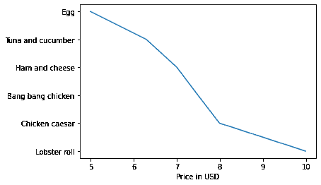

`name_list`是一个字符串列表；Pyplot 会按照从上到下，等距离排列它们。

默认情况下，Pyplot 使用线连接点，但在这个例子中，线条没有意义，因为三明治的名称是离散的；在鸡蛋三明治和金枪鱼三明治之间没有中间点。

我们可以使用关键字参数打开标记并关闭线条。

```py
plt.plot(boston_price_list, name_list, 
         marker='o', linestyle='')
plt.xlabel('Price in USD'); 
```

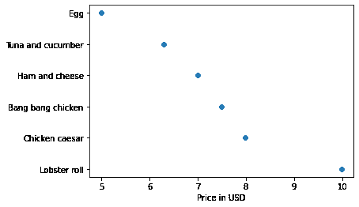

或者我们可以更简洁地做同样的事情，通过提供一个**格式字符串**作为位置参数。在这个例子中，`'o'`表示圆形标记，`'s'`表示正方形。您可以阅读`plt.plot`的文档，了解更多关于格式字符串的信息。

让我们在这个过程中添加一个标题：

```py
plt.plot(boston_price_list, name_list, 'o')
plt.plot(london_price_list, name_list, 's')

plt.xlabel('Price in USD')
plt.title('Pret a Manger prices in Boston and London'); 
```

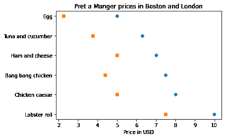

现在，为了近似原始图中的颜色，我们可以使用字符串`'C3'`和`'C0'`，它们指定默认颜色序列中的颜色。您可以在 Pyplot 文档中阅读更多关于指定颜色的信息：[`matplotlib.org/3.1.1/tutorials/colors/colors.html`](https://matplotlib.org/3.1.1/tutorials/colors/colors.html)。

```py
plt.plot(boston_price_list, name_list, 'o', color='C3')
plt.plot(london_price_list, name_list, 's', color='C0')

plt.xlabel('Price in USD')
plt.title('Pret a Manger prices in Boston and London'); 
```


为了用线连接这些点，我们将使用`plt.hlines`，它绘制水平线。它需要三个参数：`y`轴上的值序列，这个例子中是三明治的名称，以及`x`轴上的两个值序列，分别是伦敦价格和波士顿价格。

```py
plt.hlines(name_list, london_price_list, boston_price_list, color='gray')

plt.plot(boston_price_list, name_list, 'o', color='C3')
plt.plot(london_price_list, name_list, 's', color='C0')

plt.xlabel('Price in USD')
plt.title('Pret a Manger prices in Boston and London'); 
```

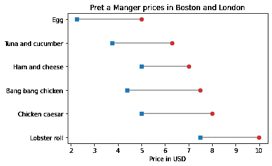

**练习：**完成这个例子，添加一个标识伦敦和波士顿价格的图例。记住，每次调用`plt.plot`时都必须添加一个`label`关键字，然后调用`plt.legend`。

请注意，我们图中的三明治的顺序与原始图中的三明治的顺序相反。Pyplot 有一个函数可以反转`y`轴；看看你能否找到它并用它来反转三明治列表的顺序。

## 齐夫定律

在几乎任何一本书中，无论是什么语言，如果你统计单词的唯一数量以及每个单词出现的次数，你都会发现一个显著的模式：最常见的单词出现的次数是第二常见单词的两倍，至少近似如此，第三常见单词出现的次数是第二常见单词的三倍，依此类推。

一般来说，如果我们按照词频降序排列单词，单词的排名（第一、第二、第三等）与它们出现的次数之间存在反比关系。这一观察最著名的是由乔治·金斯利·齐夫提出的，因此被称为齐夫定律。

为了查看这个定律是否适用于《战争与和平》中的单词，我们将制作一个齐夫图，显示：

+   `y`轴上每个单词的频率，以及

+   `x`轴上每个单词的排名，从 1 开始。

在上一章中，我们循环遍历了书中的内容，并创建了一个包含所有标点符号的字符串。以下是结果，我们将再次需要它们。

```py
all_punctuation = ',.-:[#]*/“’—‘!?”;()%@' 
```

以下代码循环遍历书中的内容，并创建一个字典，将每个单词映射到它出现的次数。

```py
first_line = "CHAPTER I\n"
last_line = "*** END OF THE PROJECT GUTENBERG EBOOK WAR AND PEACE ***\n"

fp = open('2600-0.txt')
for line in fp:
    if line == first_line:
        break

unique_words = {}
for line in fp:
    if line == last_line:
        break

    for word in line.split():
        word = word.lower()
        word = word.strip(all_punctuation)
        if word in unique_words:
            unique_words[word] += 1
        else:
            unique_words[word] = 1 
```

在`unique_words`中，键是单词，值是它们的频率。我们可以使用`values`函数从字典中获取值。结果的类型是`dict_values`：

```py
freqs = unique_words.values()
type(freqs) 
```

```py
dict_values 
```

在绘制之前，我们必须对它们进行排序，但`sort`函数无法处理`dict_values`。

我们可以使用`list`来制作一个频率列表：

```py
freqs = list(unique_words.values())
type(freqs) 
```

```py
list 
```

现在我们可以使用`sort`。默认情况下，它按升序排序，但我们可以传递一个关键字参数来反转顺序。

```py
freqs.sort(reverse=True) 
```

现在，对于排名，我们需要一个从 1 到`n`的序列，其中`n`是`freqs`中元素的数量。我们可以使用`range`函数，它返回一个类型为`range`的值。

作为一个小例子，这里是从 1 到 5 的范围。

```py
range(1, 5) 
```

```py
range(1, 5) 
```

然而，有一个问题。如果我们使用范围来制作一个列表，我们会发现“从 1 到 5 的范围”包括 1，但不包括 5。

```py
list(range(1, 5)) 
```

```py
[1, 2, 3, 4] 
```

这可能看起来很奇怪，但通常更方便的是在这种定义方式下使用`range`，而不是看起来更自然的方式（参见[`www.cs.utexas.edu/users/EWD/transcriptions/EWD08xx/EWD831.html`](https://www.cs.utexas.edu/users/EWD/transcriptions/EWD08xx/EWD831.html)）。无论如何，我们可以通过增加第二个参数来得到我们想要的：

```py
list(range(1, 6)) 
```

```py
[1, 2, 3, 4, 5] 
```

因此，最后，我们可以制作一个代表从`1`到`n`的排名的范围：

```py
n = len(freqs)
ranks = range(1, n+1)
ranks 
```

```py
range(1, 20683) 
```

现在我们可以绘制频率与排名的图表：

```py
plt.plot(ranks, freqs)

plt.xlabel('Rank')
plt.ylabel('Frequency')
plt.title("War and Peace and Zipf's law"); 
```

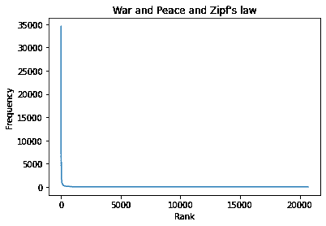

最常见的几个词非常常见，但绝大多数词都很少见。这与 Zipf 定律一致，但 Zipf 定律更具体。它声称频率应该与排名成反比。如果这是真的，我们可以写成：

$f = k / r$

其中$r$是一个词的排名，$f$是它的频率，$k$是一个未知的比例常数。如果我们两边取对数，我们得到

$\log f = \log k - \log r$

这个方程意味着，如果我们在对数-对数刻度上绘制$f$与$r$，我们期望看到一条截距为$\log k$，斜率为-1 的直线。

## 对数刻度

我们可以使用`plt.xscale`来绘制`x`轴的对数刻度。

```py
plt.plot(ranks, freqs)

plt.xlabel('Rank')
plt.ylabel('Frequency')
plt.title("War and Peace and Zipf's law")
plt.xscale('log') 
```


以及`plt.yscale`来绘制`y`轴的对数刻度。

```py
plt.plot(ranks, freqs)

plt.xlabel('Rank')
plt.ylabel('Frequency')
plt.title("War and Peace and Zipf's law")
plt.xscale('log')
plt.yscale('log') 
```

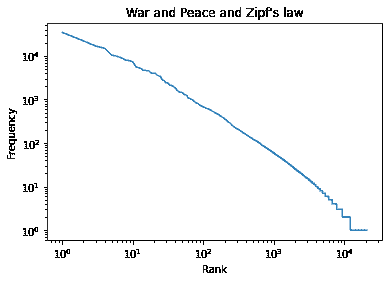

结果不完全是一条直线，但很接近。我们可以通过连接端点来感受斜率。我们将从`xs`中选择第一个和最后一个元素。

```py
xs = ranks[0], ranks[-1]
xs 
```

```py
(1, 20682) 
```

以及`ys`中的第一个和最后一个元素。

```py
ys = freqs[0], freqs[-1]
ys 
```

```py
(34559, 1) 
```

并在它们之间绘制一条线。

```py
plt.plot(xs, ys, color='gray')
plt.plot(ranks, freqs)

plt.xlabel('Rank')
plt.ylabel('Frequency')
plt.title("War and Peace and Zipf's law")
plt.xscale('log')
plt.yscale('log') 
```

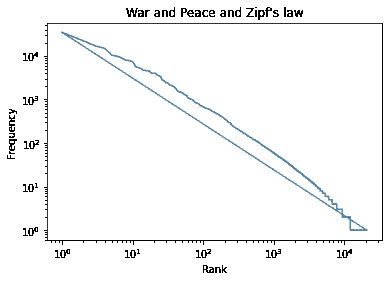

这条线的斜率是“上升与下降”，也就是`y`轴上的差除以`x`轴上的差。

我们可以使用`np.log10`来计算第一个和最后一个值的以 10 为底的对数来计算上升：

```py
np.log10(ys) 
```

```py
array([4.53640692, 0\.        ]) 
```

然后我们可以使用`np.diff`来计算元素之间的差异：

```py
rise = np.diff(np.log10(ys))
rise 
```

```py
array([-4.53640692]) 
```

在下一个练习中，您将计算灰线的运行和斜率。

**练习：**使用`log10`和`diff`来计算运行，也就是`x`轴上的差。然后将上升除以运行得到灰线的斜率。它是否接近-1，正如 Zipf 定律所预测的那样？

## 总结

本章介绍了 Matplotlib 库，我们用它来复制了 Zipf 图的两个图。这些例子展示了数据可视化的最常见元素，包括线和标记，轴上的值和标签，图例和标题。Zipf 图还展示了在对数刻度上绘制数据的强大功能。
