# 分布

> 原文：[`allendowney.github.io/ElementsOfDataScience/08_distributions.html`](https://allendowney.github.io/ElementsOfDataScience/08_distributions.html)
> 
> 译者：[飞龙](https://github.com/wizardforcel)
> 
> 协议：[CC BY-NC-SA 4.0](http://creativecommons.org/licenses/by-nc-sa/4.0/)


[点击此处在 Colab 上运行此笔记本](https://colab.research.google.com/github/AllenDowney/ElementsOfDataScience/blob/master/08_distributions.ipynb) 或 [点击此处下载](https://github.com/AllenDowney/ElementsOfDataScience/raw/master/08_distributions.ipynb)。

在本章中，我们将看到描述一组值的三种方法：

+   概率质量函数（PMF），表示数据集中一组值及每个值出现的次数。

+   累积分布函数（CDF），它包含与 PMF 相同的信息，但以一种更容易可视化、比较和执行一些计算的形式呈现。 

+   核密度估计（KDE），类似于直方图的平滑连续版本。

例如，我们将使用一些来自《一般社会调查》（GSS）的数据，来研究年龄和收入的分布，并探讨收入和教育之间的关系。

但我们将从统计学中最重要的概念之一开始，即分布。

## 分布

分布是一组值及其对应的概率。例如，如果你掷一个六面骰子，有六种可能的结果，数字`1`到`6`，它们的概率都是相同的，为`1/6`。

我们可以用表格表示这些结果的分布，如下所示：

| 值 | 概率 |
| --- | --- |
| 1 | 1/6 |
| 2 | 1/6 |
| 3 | 1/6 |
| 4 | 1/6 |
| 5 | 1/6 |
| 6 | 1/6 |

更一般地，分布可以有任意数量的值，这些值可以是任何类型，并且概率不必相等。

为了在 Python 中表示分布，我们将使用一个名为`empiricaldist`的库，代表“经验分布”，其中“经验”表示它是基于数据而不是数学公式的。

`empiricaldist`提供了一个名为`Pmf`的对象，代表“概率质量函数”。`Pmf`对象包含一组可能的结果及其概率。

例如，这是一个代表掷六面骰子结果的`Pmf`：

```py
from empiricaldist import Pmf

outcomes = [1,2,3,4,5,6]
die = Pmf(1/6, outcomes) 
```

第一个参数是每个结果的概率；第二个参数是结果的列表。我们可以这样显示结果。

```py
die 
```

|  | 概率 |
| --- | --- |
| 1 | 0.166667 |
| 2 | 0.166667 |
| 3 | 0.166667 |
| 4 | 0.166667 |
| 5 | 0.166667 |
| 6 | 0.166667 |

`Pmf`对象是 Pandas `Series`的一个专门版本，因此它提供了`Series`的所有属性和方法，以及一些我们很快会看到的额外方法。

## 一般社会调查

现在我们将使用`Pmf`对象来表示来自新数据集——美国普查局的《一般社会调查》（GSS）的值分布。GSS 对美国成年居民进行代表性抽样调查，并询问有关人口统计学、个人历史和社会政治问题信仰的问题。政治家、政策制定者和研究人员广泛使用它。

GSS 数据集包含数百列；使用一个名为[GSS Explorer](https://gssdataexplorer.norc.org/)的在线工具，我只选择了一些列，并创建了数据的一个子集，称为**提取**。

与我们在上一章中使用的 NSFG 数据一样，GSS 数据以固定宽度格式存储，由 Stata 数据字典描述。

```py
dict_file = 'GSS.dct'
data_file = 'GSS.dat.gz' 
```

我们将使用`statadict`库来读取数据字典。

```py
from statadict import parse_stata_dict

stata_dict = parse_stata_dict(dict_file) 
```

数据文件已经压缩，但我们可以使用`gzip`库来打开它。

```py
import gzip

fp = gzip.open(data_file) 
```

结果是一个类似文件的对象，因此我们可以将它作为参数传递给`read_fwf`：

```py
import pandas as pd

gss = pd.read_fwf(fp, 
                  names=stata_dict.names, 
                  colspecs=stata_dict.colspecs)
gss.shape 
```

```py
(64814, 8) 
```

结果是一个`DataFrame`，每个受访者一行，每个变量一列。以下是前几行。

```py
gss.head() 
```

|  | 年份 | ID_ | 年龄 | 教育 | 性别 | 枪支法 | 大麻 | 实际收入 |
| --- | --- | --- | --- | --- | --- | --- | --- | --- |
| 0 | 1972 | 1 | 23 | 16 | 2 | 1 | 0 | 18951.0 |
| 1 | 1972 | 2 | 70 | 10 | 1 | 1 | 0 | 24366.0 |
| 2 | 1972 | 3 | 48 | 12 | 2 | 1 | 0 | 24366.0 |
| 3 | 1972 | 4 | 27 | 17 | 2 | 1 | 0 | 30458.0 |
| 4 | 1972 | 5 | 61 | 12 | 2 | 1 | 0 | 50763.0 |

我会在接下来的过程中解释这些变量，但如果你想了解更多信息，可以阅读[`gssdataexplorer.norc.org/variables/vfilter`](https://gssdataexplorer.norc.org/variables/vfilter)上的在线文档。

## 教育分布

要开始处理这个数据集，让我们看看`EDUC`的分布，它记录了每个受访者的教育年限。首先，我们将从`DataFrame`中选择一列，并使用`value_counts`来查看其中包含哪些值。

```py
gss['EDUC'].value_counts().sort_index() 
```

```py
0       165
1        47
2       152
3       257
4       319
5       402
6       828
7       879
8      2724
9      2083
10     2880
11     3743
12    19663
13     5360
14     7160
15     2910
16     8355
17     1967
18     2384
19      920
20     1439
98       73
99      104
Name: EDUC, dtype: int64 
```

`value_counts`的结果是一组可能的值以及每个值出现的次数，因此它是一种分布。

值`98`和`99`是“不知道”和“无回答”的特殊代码。我们将使用`replace`将这些代码替换为`NaN`。

```py
import numpy as np

educ = gss['EDUC'].replace([98, 99], np.nan) 
```

我们已经看到了一种可视化分布的方法，即直方图。这是教育水平的直方图。

```py
import matplotlib.pyplot as plt

educ.hist(grid=False)
plt.xlabel('Years of education')
plt.ylabel('Number of respondents')
plt.title('Histogram of education level'); 
```

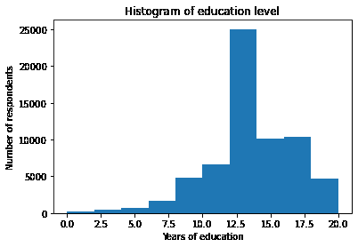

根据直方图，我们可以看到分布的一般形状和中心趋势——看起来峰值接近 12 年的教育。但是直方图并不是可视化这种分布的最佳方式，因为它掩盖了一些重要的细节。

另一种方法是使用`Pmf`。函数`Pmf.from_seq`接受任何类型的序列——如列表、元组或 Pandas `Series`——并计算序列中值的分布。

```py
pmf_educ = Pmf.from_seq(educ, normalize=False)
type(pmf_educ) 
```

```py
empiricaldist.empiricaldist.Pmf 
```

关键字参数`normalize=False`表示我们不想对这个 PMF 进行标准化。我很快会解释这是什么意思。

这是前几行的样子。

```py
pmf_educ.head() 
```

|  | probs |
| --- | --- |
| 0.0 | 165 |
| 1.0 | 47 |
| 2.0 | 152 |

在这个数据集中，有`165`名受访者报告称他们没有接受过正规教育，有`47`名只接受了一年的教育。这是最后几行。

```py
pmf_educ.tail() 
```

|  | probs |
| --- | --- |
| 18.0 | 2384 |
| 19.0 | 920 |
| 20.0 | 1439 |

有`1439`名受访者报告称他们接受了 20 年或更多年的正规教育，这可能意味着他们上了大学和研究生院。

您可以使用方括号运算符在`Pmf`中查找一个值并获得相应的计数：

```py
pmf_educ[20] 
```

```py
1439 
```

通常当我们制作 PMF 时，我们想知道每个值的*比例*，而不是计数。我们可以通过设置`normalize=True`来实现；然后我们得到一个**标准化**的 PMF，即第二列中的值加起来为 1 的 PMF。

```py
pmf_educ_norm = Pmf.from_seq(educ, normalize=True)
pmf_educ_norm.head() 
```

|  | probs |
| --- | --- |
| 0.0 | 0.002553 |
| 1.0 | 0.000727 |
| 2.0 | 0.002352 |

现在，如果我们使用方括号运算符，结果将是一个分数。例如，12 年教育的人数约为 30%：

```py
pmf_educ_norm[12] 
```

```py
0.30420656899299164 
```

`Pmf`提供了一个`bar`方法，可以将值及其概率绘制成条形图。

```py
pmf_educ_norm.bar(label='EDUC')

plt.xlabel('Years of education')
plt.xticks(range(0, 21, 4))
plt.ylabel('PMF')
plt.title('Distribution of years of education')
plt.legend(); 
```

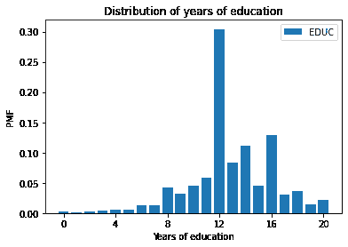

在这个图中，我们可以看到最常见的值是 12 年，但也有 14 和 16 的峰值，对应着两年和四年的大学。

对于这些数据，PMF 可能比直方图更好。PMF 显示所有唯一的值，因此我们可以看到峰值在哪里。因为直方图将值放入箱中，它掩盖了这些细节。对于这个数据集和默认的箱数，我们无法看到 14 和 16 年的峰值。但是 PMF 也有局限性，我们会看到。

首先，这里有一个练习，你可以练习一下 PMF。

**练习：**让我们看看`DataFrame`中的`YEAR`列，它表示每个受访者被采访的年份。

为`YEAR`制作一个未标准化的`Pmf`并显示结果。2018 年有多少受访者？

## 累积分布函数

现在我们将看到另一种表示分布的方法，即累积分布函数（CDF）。`empiricaldist`提供了一个代表 CDF 的`Cdf`对象。我们可以这样导入它：

```py
from empiricaldist import Cdf 
```

例如，假设我们有一个包含五个值的序列：

```py
values = 1, 2, 2, 3, 5 
```

这是这些值的`Pmf`。

```py
Pmf.from_seq(values) 
```

|  | probs |
| --- | --- |
| 1 | 0.2 |
| 2 | 0.4 |
| 3 | 0.2 |
| 5 | 0.2 |

如果从`values`中随机抽取一个值，`Pmf`会告诉你获得`x`的机会，对于任何`x`的值。因此，值`1`的概率是`1/5`；值`2`的概率是`2/5`；值`3`和`5`的概率各为`1/5`。

CDF 类似于 PMF，因为它包含值及其概率；不同之处在于 CDF 中的概率是 PMF 中概率的累积和。

这是相同五个值的`Cdf`对象。

```py
Cdf.from_seq(values) 
```

|  | probs |
| --- | --- |
| 1 | 0.2 |
| 2 | 0.6 |
| 3 | 0.8 |
| 5 | 1.0 |

如果从`values`中随机抽取一个值，`Cdf`会告诉你获得一个值*小于或等于*`x`的机会，对于任何给定的`x`。

因此，`1`的`Cdf`是`1/5`，因为序列中五个值中有一个小于或等于 1。

2 的`Cdf`是`3/5`，因为五个值中有三个小于或等于 2。

`5`的`Cdf`是`5/5`，因为所有的值都小于或等于 5。

## 年龄的 CDF

现在让我们看一个更实质性的`Cdf`，即美国社会总体调查中受访者年龄的分布。

我们将使用的变量是'AGE'。根据代码簿，值的范围是从`18`到`89`，其中`89`表示“89 岁或更大”。特殊代码`98`和`99`表示“不知道”和“没有回答”。参见[`gssdataexplorer.norc.org/variables/53/vshow`](https://gssdataexplorer.norc.org/variables/53/vshow)。

我们可以使用`replace`将特殊代码替换为`NaN`。

```py
age = gss['AGE'].replace([98, 99], np.nan) 
```

我们可以这样计算这些值的`Cdf`：

```py
cdf_age = Cdf.from_seq(age) 
```

`Cdf`提供了一个名为`plot`的方法，用于绘制 CDF 作为一条线。下面是它的样子。

```py
cdf_age.plot()

plt.xlabel('Age (years)')
plt.ylabel('CDF')
plt.title('Distribution of age'); 
```

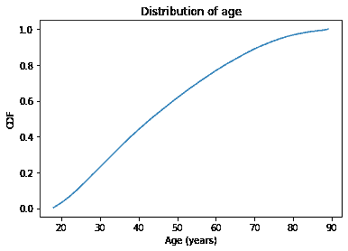

$x$-轴是年龄，从 18 到 89。$y$-轴是累积概率，从 0 到 1。

`cdf_age`可以作为一个函数使用，因此如果给它一个年龄，它会返回相应的概率（在 NumPy 数组中）。

```py
q = 51
p = cdf_age(q)
p 
```

```py
array(0.63318676) 
```

`q`代表“数量”，这是我们要查找的内容。`p`代表概率，这是结果。在这个例子中，数量是 51 岁，相应的概率约为`0.63`。这意味着大约 63%的受访者年龄为 51 岁或更年轻。

下图中的箭头显示了如何从 CDF 中读取这个值，至少是近似的。

```py
cdf_age.plot()

x = 17
draw_line(p, q, x)
draw_arrow_left(p, q, x)

plt.xlabel('Age (years)')
plt.xlim(x-1, 91)
plt.ylabel('CDF')
plt.title('Distribution of age'); 
```

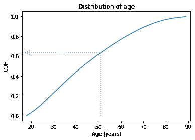

CDF 是一个可逆函数，这意味着如果你有一个概率`p`，你可以查找相应的数量`q`。`Cdf`提供了一个名为`inverse`的方法，用于计算累积分布函数的逆函数。

```py
p1 = 0.25
q1 = cdf_age.inverse(p1)
q1 
```

```py
array(31.) 
```

在这个例子中，我们查找概率`0.25`，结果是`31`。

这意味着 25%的受访者年龄为 31 岁或以下。另一种说法是“31 岁是这个分布的第 25 百分位数”。

如果我们查找概率`0.75`，它返回`59`，所以 75%的受访者年龄为 59 岁或更年轻。

```py
p2 = 0.75
q2 = cdf_age.inverse(p2)
q2 
```

```py
array(59.) 
```

在下图中，箭头显示了如何从 CDF 中读取这些值。

```py
cdf_age.plot()

x = 17
draw_line(p1, q1, x)
draw_arrow_down(p1, q1, 0)

draw_line(p2, q2, x)
draw_arrow_down(p2, q2, 0)

plt.xlabel('Age (years)')
plt.xlim(x-1, 91)
plt.ylabel('CDF')
plt.title('Distribution of age'); 
```


从第 25 百分位到第 75 百分位的距离称为**四分位距**，或 IQR。它衡量了分布的扩散程度，因此类似于标准差或方差。

因为它是基于百分位数的，所以它不会受到极端值或异常值的影响，就像标准差那样。因此 IQR 比方差更**稳健**，这意味着即使数据中存在错误或极端值，它也能很好地工作。

**练习：**使用`cdf_age`，计算 GSS 数据集中*年龄*大于 65 岁的受访者的比例。

**练习：** 几乎每个国家的收入分配都是长尾的，这意味着有少数人拥有非常高的收入。在 GSS 数据集中，列`REALINC`代表转换为 1986 年美元的总家庭收入。通过绘制 CDF，我们可以对这种分布的形状有所了解。

从`gss`数据集中选择`REALINC`，创建一个名为`cdf_income`的`Cdf`，并绘制它。记得标记坐标轴！

## 比较分布

到目前为止，我们已经看到了两种表示分布的方法，PMF 和 CDF。现在我们将使用 PMF 和 CDF 来比较分布，并看到它们各自的优缺点。

比较分布的一种方法是在同一坐标轴上绘制多个 PMF。例如，假设我们想比较男性和女性受访者的年龄分布。

首先，我们将创建一个对男性受访者为真的布尔 Series。

```py
male = (gss['SEX'] == 1) 
```

还有一个对女性受访者为真的布尔 Series。

```py
female = (gss['SEX'] == 2) 
```

现在我们可以选择男性和女性受访者的年龄。

```py
male_age = age[male]
female_age = age[female] 
```

并为每个绘制一个 PMF。

```py
pmf_male_age = Pmf.from_seq(male_age)
pmf_male_age.plot(label='Male')

pmf_female_age = Pmf.from_seq(female_age)
pmf_female_age.plot(label='Female')

plt.xlabel('Age (years)') 
plt.ylabel('PMF')
plt.title('Distribution of age by sex')
plt.legend(); 
```

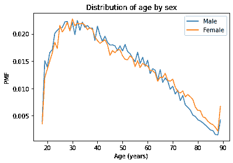

图表非常嘈杂。在 40 到 50 的范围内，男性的 PMF 似乎更高。而在 70 到 80 之间，女性更高。但这两种差异可能都是由于随机变化造成的。

现在让我们用 CDF 做同样的事情；一切都一样，只是我们用`Cdf`替换`Pmf`。

```py
cdf_male_age = Cdf.from_seq(male_age)
cdf_male_age.plot(label='Male')

cdf_female_age = Cdf.from_seq(female_age)
cdf_female_age.plot(label='Female')

plt.xlabel('Age (years)') 
plt.ylabel('CDF')
plt.title('Distribution of age by sex')
plt.legend(); 
```

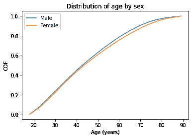

一般来说，CDF 比 PMF 更加平滑。因为它们平滑了随机性，我们通常可以更好地看到不同分布之间的真实差异。在这种情况下，这两条线在 40 岁之前几乎重合；之后，男性的 CDF 高于女性。那么这意味着什么呢？

解释这种差异的一种方式是，男性在特定年龄以下的比例通常比女性更高。例如，大约 79%的男性年龄在 60 岁以下，而女性为 76%。

```py
cdf_male_age(60), cdf_female_age(60) 
```

```py
(array(0.78599958), array(0.75529908)) 
```

另一种方法是比较百分位数。例如，女性的中位年龄比男性大约大一岁。

```py
cdf_male_age.inverse(0.5), cdf_female_age.inverse(0.5) 
```

```py
(array(43.), array(44.)) 
```

**练习：** 男性中有多少比例超过 80 岁？女性呢？

## 比较收入

再举一个例子，让我们看看家庭收入，并比较 1995 年前后的分布（我选择 1995 年是因为它大致是调查的中点）。变量`REALINC`代表 1986 年美元的家庭收入。

我们将创建一个布尔`Series`来选择 1995 年前后接受访谈的受访者。

```py
pre95 = (gss['YEAR'] < 1995)
post95 = (gss['YEAR'] >= 1995) 
```

现在我们可以绘制 PMF 了。

```py
income = gss['REALINC'].replace(0, np.nan)

Pmf.from_seq(income[pre95]).plot(label='Before 1995')
Pmf.from_seq(income[post95]).plot(label='After 1995')

plt.xlabel('Income (1986 USD)')
plt.ylabel('PMF')
plt.title('Distribution of income')
plt.legend(); 
```


这个分布中有很多唯一的值，但没有一个出现得很频繁。因此，PMF 非常嘈杂，我们无法真正看到分布的形状。

比较这两个分布也很困难。看起来 1995 年后有更多高收入者，但很难确定。通过 CDF 我们可以得到更清晰的图像。

```py
Cdf.from_seq(income[pre95]).plot(label='Before 1995')
Cdf.from_seq(income[post95]).plot(label='After 1995')

plt.xlabel('Income (1986 USD)')
plt.ylabel('CDF')
plt.title('Distribution of income')
plt.legend(); 
```

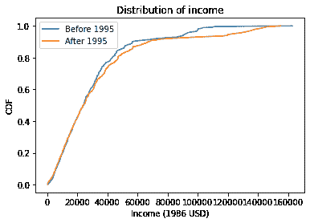

在 30000 美元以下，两个 CDF 几乎相同；在此之上，我们可以看到 1995 年后的分布向右移动了。换句话说，高收入人群的比例大致相同，但高收入者的收入增加了。

一般来说，我建议使用 CDF 进行探索性分析。它们可以清晰地展现分布，噪音不会太多，并且适合比较分布，特别是当你有两个以上的分布时。

**练习：** 在前一个图中，美元金额足够大，导致`x`轴上的标签很拥挤。通过以千美元为单位表示收入（并相应更新`x`标签）来改进图表。

**练习：** 让我们比较 GSS 数据集中不同教育水平的收入

为此，我们将创建布尔`Series`来识别具有不同教育水平的受访者。

+   在美国，12 年的教育通常意味着受访者已经完成了高中（中等教育）。

+   14 年教育的受访者可能已经完成了副学士学位（两年大学）

+   16 年教育的人可能已经完成了学士学位（四年大学或大学）。

定义名为`high`、`assc`和`bach`的布尔`Series`，对于受访者，这些布尔值为真

+   12 年或更少的教育，

+   13、14 或 15 岁，以及

+   16 岁或更多。

计算并绘制每个组的收入分布。记得标记 CDFs，显示图例，并标记坐标轴。写几句话描述和解释结果。

## 建模分布

一些分布有名称。例如，你可能熟悉正态分布，也称为高斯分布或钟形曲线。你可能听说过其他分布，比如指数分布、二项分布，或者泊松分布。

这些“带有名称的分布”被称为**解析**，因为它们由解析数学函数描述，与基于数据的经验分布相对。

事实证明，我们在世界上测量的许多事物都具有可以用解析分布很好近似的分布，因此这些分布有时是现实世界的良好模型。

在这种情况下，我所说的“模型”是指对世界的简化描述，足够准确以满足其预期目的。

在本节中，我们将计算正态分布的 CDF，并将其与数据的经验分布进行比较。但在我们开始处理真实数据之前，我们将从虚假数据开始。

以下语句使用 NumPy 的`random`库从均值为`0`，标准差为`1`的正态分布中生成 1000 个值。

```py
np.random.seed(17) 
```

```py
sample = np.random.normal(size=1000) 
```

这是样本的经验分布的样子。

```py
cdf_sample = Cdf.from_seq(sample)
cdf_sample.plot(label='Random sample')

plt.xlabel('x')
plt.ylabel('CDF')
plt.legend(); 
```

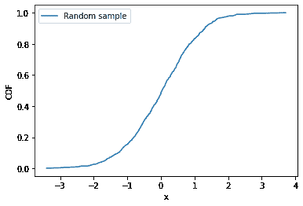

如果我们不知道这个样本是从正态分布中抽取的，并且我们想要检查，我们可以将数据的 CDF 与理想正态分布的 CDF 进行比较，我们可以使用 SciPy 库来计算。

```py
from scipy.stats import norm

xs = np.linspace(-3, 3)
ys = norm(0, 1).cdf(xs) 
```

首先，我们从`scipy.stats`中导入`norm`，这是与统计相关的一组函数。

然后我们使用`linspace()`创建一个从-3 到 3 的等间距点的数组；这些是我们将评估正态 CDF 的`x`值。

接下来，`norm(0, 1)`创建一个表示均值为`0`，标准差为`1`的正态分布的对象。

最后，`cdf`计算正态分布的 CDF，在每个`xs`处进行评估。

我将用灰线绘制正态分布的 CDF，然后再次绘制数据的 CDF。

```py
plt.plot(xs, ys, color='gray', label='Normal CDF')
cdf_sample.plot(label='Random sample')

plt.xlabel('x')
plt.ylabel('CDF')
plt.legend(); 
```

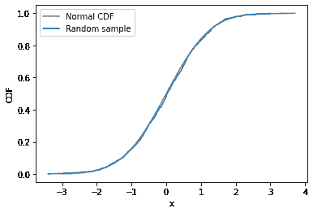

随机样本的 CDF 与正态模型一致。这并不奇怪，因为数据实际上是从正态分布中抽取的。当我们在现实世界中收集数据时，我们并不希望它与正态分布一样好。在下一个练习中，我们将尝试并查看。

**练习：**正态分布是否是美国人口年龄分布的良好模型？

要回答这个问题：

+   计算 GSS 数据集中年龄的平均值和标准差。

+   使用`linspace`创建一个在 18 到 89 之间的等间距值的数组。

+   使用`norm`创建一个与数据具有相同均值和标准差的正态分布，然后使用它来计算数组中每个值的正态 CDF。

+   用灰线绘制正态分布的 CDF。

+   绘制 GSS 中年龄的 CDF。

绘制的 CDF 是否很好地吻合？

**练习：**在许多数据集中，收入的分布大约是**对数正态**的，这意味着收入的对数符合正态分布。让我们看看 GSS 数据是否符合这一点。

+   从`gss`中提取`REALINC`并使用`np.log10()`计算其对数。提示：在计算对数之前，用`NaN`替换值`0`。

+   计算对数转换后的收入的均值和标准差。

+   使用`norm`函数创建一个与对数转换后的收入具有相同均值和标准差的正态分布。

+   绘制正态分布的 CDF。

+   计算并绘制对数转换后的收入的 CDF。

对数转换后的收入和正态分布的 CDF 有多相似？

## 核密度估计

我们已经看到了两种表示分布的方法，PMF 和 CDF。现在我们将学习另一种方法：概率密度函数，或 PDF。我们用来计算正态 CDF 的`norm`函数也可以计算正态 PDF：

```py
xs = np.linspace(-3, 3)
ys = norm(0,1).pdf(xs)
plt.plot(xs, ys, color='gray', label='Normal PDF')

plt.xlabel('x')
plt.ylabel('PDF')
plt.title('Normal density function')
plt.legend(); 
```

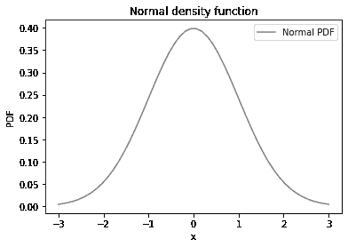

正态 PDF 是经典的“钟形曲线”。

诱人的是将数据的 PMF 与正态分布的 PDF 进行比较，但这并不起作用。让我们看看如果我们尝试会发生什么：

```py
plt.plot(xs, ys, color='gray', label='Normal PDF')

pmf_sample = Pmf.from_seq(sample)
pmf_sample.plot(label='Random sample')

plt.xlabel('x')
plt.ylabel('PDF')
plt.title('Normal density function')
plt.legend(); 
```

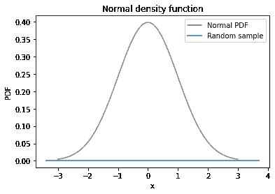

样本的 PMF 是底部的一条直线。在随机样本中，每个值都是唯一的，因此它们的概率都相同，为 1000 中的一个。

然而，我们可以使用样本中的点来估计它们来自的分布的 PDF。这个过程称为**核密度估计**，或 KDE。这是从 PMF（概率质量函数）到 PDF（概率密度函数）的一种方法。

为了生成 KDE 图，我们将使用 Seaborn 库，导入为`sns`。Seaborn 提供`kdeplot`，它接受样本，估计 PDF 并绘制。

```py
import seaborn as sns

sns.kdeplot(sample, label='Estimated sample PDF')

plt.xlabel('x')
plt.ylabel('PDF')
plt.title('Normal density function')
plt.legend(); 
```

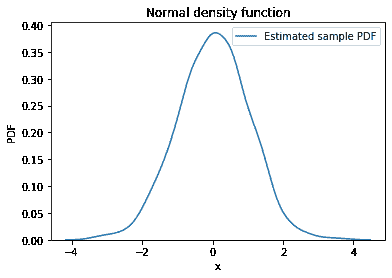

现在我们可以比较 KDE 图和正态 PDF。

```py
plt.plot(xs, ys, color='gray', label='Normal PDF')
sns.kdeplot(sample, label='Estimated sample PDF')

plt.xlabel('x')
plt.ylabel('PDF')
plt.title('Normal density function')
plt.legend(); 
```

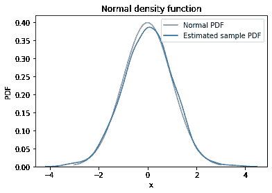

KDE 图与正态 PDF 相当匹配，尽管当我们比较 PDF 时，差异看起来更大，而在比较 CDF 时并非如此。这意味着 PDF 是寻找差异的更敏感的方法，但通常它太敏感了。

很难判断明显的差异是否有意义，或者它们只是随机的，就像在这种情况下一样。

**练习：**在以前的练习中，我们问“正态分布是否是美国人口年龄分布的良好模型？”为了回答这个问题，我们绘制了数据的 CDF 并将其与具有相同均值和标准差的正态分布的 CDF 进行比较。

现在我们将比较数据的估计密度和正态 PDF。

+   再次计算 GSS 数据集中年龄的均值和标准差。

+   使用`linspace`创建一个在 18 到 89 之间的值数组。

+   使用`norm`创建一个与数据具有相同均值和标准差的正态分布，然后使用它来计算数组中每个值的正态 PDF。

+   用灰线绘制正态 PDF。

+   使用`sns.kdeplot`估计和绘制 GSS 中年龄的密度。

注意：Seaborn 无法处理 NaN，因此在调用`kdeplot`之前使用`dropna`将其删除。

PDF 和 KDE 图有多符合？

**练习：**在以前的练习中，我们使用 CDF 来查看收入分布是否符合对数正态分布。我们可以使用 PDF 和 KDE 进行相同的比较。

+   再次从`gss`中提取`REALINC`并使用`np.log10()`计算其对数。

+   计算对数转换后的收入的均值和标准差。

+   使用`norm`创建一个与对数转换后的收入具有相同均值和标准差的正态分布。

+   绘制正态分布的 PDF。

+   使用`sns.kdeplot()`估计和绘制对数转换后的收入的密度。

## 总结

在本章中，我们已经看到了四种可视化分布的方法，PMF、CDF 和 KDE 图。

一般来说，我在探索数据时使用 CDF。这样，我可以最好地了解情况，而不会被噪音分散注意力。

然后，如果我要向不熟悉 CDF 的观众展示结果，如果数据集包含少量唯一值，我可能会使用 PMF，如果有许多唯一值，我可能会使用 KDE。
