# 第十一章：关系

> 原文：[`allendowney.github.io/ElementsOfDataScience/09_relationships.html`](https://allendowney.github.io/ElementsOfDataScience/09_relationships.html)
> 
> 译者：[飞龙](https://github.com/wizardforcel)
> 
> 协议：[CC BY-NC-SA 4.0](http://creativecommons.org/licenses/by-nc-sa/4.0/)


[点击这里在 Colab 上运行此笔记本](https://colab.research.google.com/github/AllenDowney/ElementsOfDataScience/blob/master/09_relationships.ipynb) 或 [点击这里下载它](https://github.com/AllenDowney/ElementsOfDataScience/raw/master/09_relationships.ipynb)。

本章探讨了变量之间的关系。

+   我们将使用散点图、箱线图和小提琴图来可视化关系，

+   我们将使用相关性和简单回归来量化关系。

本章最重要的一课是，在你试图量化之前，你应该始终可视化变量之间的关系；否则，你很可能会被误导。

## 探索关系

到目前为止，我们主要考虑了一个变量。现在是时候探索变量之间的关系了。作为第一个例子，我们将研究身高和体重之间的关系。

我们将使用疾病控制中心运行的行为风险因素监测系统（BRFSS）的数据，该调查包括 40 多万名受访者，但为了使事情更容易处理，我们将使用 10 万名受访者的随机子样本。

```py
import pandas as pd

brfss = pd.read_hdf('brfss.hdf5', 'brfss')
brfss.shape 
```

```py
(100000, 9) 
```

这是前几行。

```py
brfss.head() 
```

|  | 性别 | HTM4 | WTKG3 | 收入 | _LLCPWT | _AGEG5YR | _VEGESU1 | _HTMG10 | 年龄 |
| --- | --- | --- | --- | --- | --- | --- | --- | --- | --- |
| 96230 | 2.0 | 160.0 | 60.33 | 8.0 | 1398.525290 | 6.0 | 2.14 | 150.0 | 47.0 |
| 244920 | 2.0 | 163.0 | 58.97 | 5.0 | 84.057503 | 13.0 | 3.14 | 160.0 | 89.5 |
| 57312 | 2.0 | 163.0 | 72.57 | 8.0 | 390.248599 | 5.0 | 2.64 | 160.0 | 42.0 |
| 32573 | 2.0 | 165.0 | 74.84 | 1.0 | 11566.705300 | 3.0 | 1.46 | 160.0 | 32.0 |
| 355929 | 2.0 | 170.0 | 108.86 | 3.0 | 844.485450 | 3.0 | 1.81 | 160.0 | 32.0 |

BRFSS 包括数百个变量。在本章的示例中，我们将只使用九个。我们将从`HTM4`开始，它记录了每个受访者的身高（厘米），以及`WTKG3`，它记录了体重（千克）。

```py
height = brfss['HTM4']
weight = brfss['WTKG3'] 
```

为了可视化这些变量之间的关系，我们将制作一个**散点图**，它显示每对值的一个标记。散点图是常见且容易理解的，但要正确绘制它们却是令人惊讶地困难。

作为第一次尝试，我们将使用带有样式字符串`o`的`plot`，它会为每个数据点绘制一个圆。

```py
import matplotlib.pyplot as plt

plt.plot(height, weight, 'o')

plt.xlabel('Height in cm')
plt.ylabel('Weight in kg')
plt.title('Scatter plot of weight versus height'); 
```

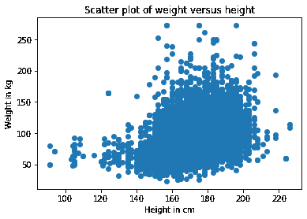

每个标记代表一个人的身高和体重。

根据结果的形状，看起来身高较高的人体重更重，但是这张图有一些让人难以解释的地方。最重要的是，它**过度绘制**，这意味着标记堆叠在一起，所以你无法判断哪里有很多数据点，哪里只有一个。当发生这种情况时，结果可能会严重误导。

改进绘图的一种方法是使用透明度，我们可以使用关键字参数`alpha`来实现。alpha 值越低，每个数据点就越透明。

这是使用`alpha=0.02`的样子。

```py
plt.plot(height, weight, 'o', alpha=0.02)

plt.xlabel('Height in cm')
plt.ylabel('Weight in kg')
plt.title('Scatter plot of weight versus height'); 
```

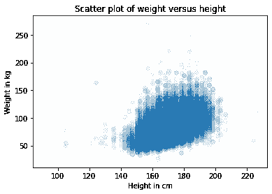

这样做更好，但是有这么多数据点，散点图仍然被过度绘制。下一步是使标记变小。通过`markersize=1`和较低的 alpha 值，散点图的饱和度较低。这是它的样子。

```py
plt.plot(height, weight, 'o', alpha=0.02, markersize=1)

plt.xlabel('Height in cm')
plt.ylabel('Weight in kg')
plt.title('Scatter plot of weight versus height'); 
```

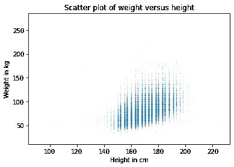

这次更好了，但现在我们可以看到点落在离散的列中。这是因为大多数身高是以英寸报告的，然后转换为厘米。我们可以通过向值添加一些随机噪声来打破这些列；实际上，我们是在填补被舍入的值。像这样添加随机噪声被称为**抖动**。

我们可以使用 NumPy 从均值为 0、标准差为 2 的正态分布中添加噪声。

```py
import numpy as np

noise = np.random.normal(0, 2, size=len(brfss))
height_jitter = height + noise 
```

这是带有抖动高度的图的样子。

```py
plt.plot(height_jitter, weight, 'o', 
         alpha=0.02, markersize=1)

plt.xlabel('Height in cm')
plt.ylabel('Weight in kg')
plt.title('Scatter plot of weight versus height'); 
```

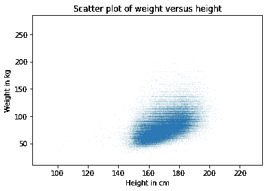

列已经消失，但现在我们可以看到有些人四舍五入了他们的体重。我们可以通过对体重进行抖动来修复这个问题。

```py
noise = np.random.normal(0, 2, size=len(brfss))
weight_jitter = weight + noise 
```

```py
plt.plot(height_jitter, weight_jitter, 'o', 
         alpha=0.02, markersize=1)

plt.xlabel('Height in cm')
plt.ylabel('Weight in kg')
plt.title('Scatter plot of weight versus height'); 
```


最后，让我们放大到大多数数据点所在的区域。

函数`xlim`和`ylim`设置了$x$和$y$轴的下限和上限；在这种情况下，我们绘制了从 140 到 200 厘米的身高和最多 160 公斤的体重。

以下是它的样子。

```py
plt.plot(height_jitter, weight_jitter, 'o', 
         alpha=0.02, markersize=1)

plt.xlim([140, 200])
plt.ylim([0, 160])
plt.xlabel('Height in cm')
plt.ylabel('Weight in kg')
plt.title('Scatter plot of weight versus height'); 
```

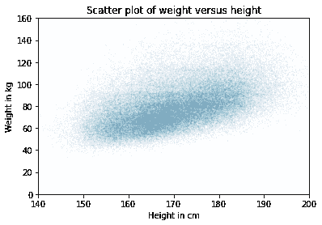

现在我们对身高和体重之间的关系有了可靠的图片。 

下面你可以看到我们开始的误导性图和我们最终得到的更可靠的图。它们显然是不同的，并且它们表明了这些变量之间不同的关系。

```py
# Set the figure size
plt.figure(figsize=(8, 3))

# Create subplots with 2 rows, 1 column, and start plot 1
plt.subplot(1, 2, 1)
plt.plot(height, weight, 'o')

plt.xlabel('Height in cm')
plt.ylabel('Weight in kg')
plt.title('Scatter plot of weight versus height')

# Adjust the layout so the two plots don't overlap
plt.tight_layout()

# Start plot 2
plt.subplot(1, 2, 2)

plt.plot(height_jitter, weight_jitter, 'o', 
         alpha=0.02, markersize=1)

plt.xlim([140, 200])
plt.ylim([0, 160])
plt.xlabel('Height in cm')
plt.ylabel('Weight in kg')
plt.title('Scatter plot of weight versus height')
plt.tight_layout() 
```

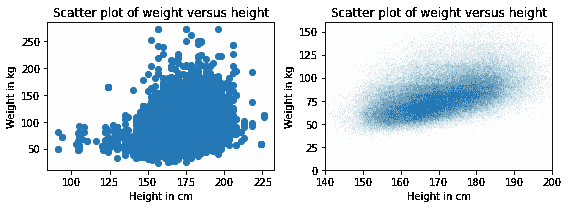

这个例子的重点是制作一个有效的散点图需要一些努力。

**练习：**人们随着年龄增长是否倾向于增加体重？我们可以通过可视化体重和年龄之间的关系来回答这个问题。

但在制作散点图之前，逐个变量地可视化分布是一个好主意。所以让我们看看年龄的分布。

BRFSS 数据集包括一个名为`AGE`的列，表示每个受访者的年龄（以年为单位）。为了保护受访者的隐私，年龄被舍入到 5 年的区间。`AGE`包含区间的中点。

+   从 DataFrame `brfss`中提取变量`'AGE'`并将其赋值给`age`。

+   将`age`的 PMF 绘制为条形图，使用`empiricaldist`中的`Pmf`。

```py
from empiricaldist import Pmf 
```

**练习：**现在让我们看看体重的分布。包含体重（公斤）的列是`WTKG3`。因为这一列包含许多唯一的值，将其显示为 PMF 效果不是很好。

```py
Pmf.from_seq(weight).bar()

plt.xlabel('Weight in kg')
plt.ylabel('PMF')
plt.title('Distribution of weight'); 
```

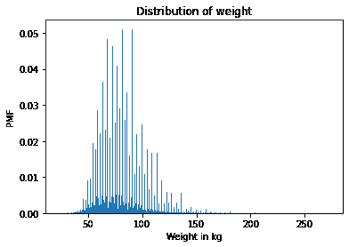

为了更好地查看这个分布，尝试绘制 CDF。

计算具有相同均值和标准差的正态分布的 CDF，并将其与体重的分布进行比较。正态分布是否是这些数据的良好模型？对于对数转换后的体重呢？

**练习：**现在让我们制作一个`weight`与`age`的散点图。调整`alpha`和`markersize`以避免重叠。使用`ylim`将`y`轴限制在 0 到 200 公斤。

**练习：**在上一个练习中，年龄分布在列中，因为它们已经被舍入到 5 年的区间。如果我们对它们进行抖动，散点图将更清楚地显示出它们之间的关系。

+   给`age`添加均值为`0`、标准差为`2.5`的随机噪声。

+   制作散点图并再次调整`alpha`和`markersize`。

## 可视化关系

在前一节中，我们使用散点图来可视化变量之间的关系，在练习中，你探索了年龄和体重之间的关系。在本节中，我们将看到其他可视化这些关系的方法，包括箱线图和小提琴图。

让我们从体重与年龄的散点图开始。

```py
age = brfss['AGE']
noise = np.random.normal(0, 1.0, size=len(brfss))
age_jitter = age + noise

plt.plot(age_jitter, weight_jitter, 'o', 
         alpha=0.01, markersize=1)

plt.xlabel('Age in years')
plt.ylabel('Weight in kg')
plt.ylim([0, 200])
plt.title('Weight versus age'); 
```

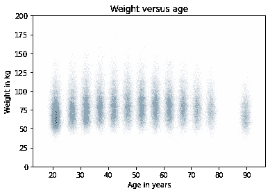

在这个散点图的版本中，重量被抖动了，但列之间仍然有空间。这使得可以看到每个年龄组的分布形状和组之间的差异。从这个视角来看，体重似乎在 40 或 50 岁时增加，然后开始减少。

如果我们进一步思考这个想法，我们可以使用 KDE 来估计每一列的密度函数并绘制它。而且这有一个名字；它叫做**小提琴图**。Seaborn 提供了一个函数来制作小提琴图，但在使用之前，我们必须去掉任何带有缺失数据的行。方法如下：

```py
data = brfss.dropna(subset=['AGE', 'WTKG3'])
data.shape 
```

```py
(92729, 9) 
```

`dropna()`创建一个新的 DataFrame，删除`brfss`中`AGE`或`WTKG3`为`NaN`的行。现在我们可以调用`violinplot`。

```py
import seaborn as sns

sns.violinplot(x='AGE', y='WTKG3', data=data, inner=None)

plt.xlabel('Age in years')
plt.ylabel('Weight in kg')
plt.title('Weight versus age'); 
```

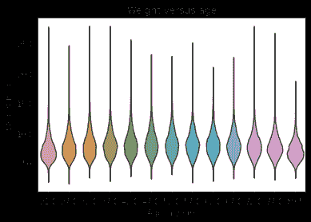

`x`和`y`参数表示我们希望`AGE`在 x 轴上，`WTKG3`在 y 轴上。`data`是我们刚刚创建的 DataFrame，其中包含我们要绘制的变量。参数`inner=None`简化了图。

在图中，每个形状代表一个年龄组中的体重分布。这些形状的宽度与估计的密度成比例，所以就像两个垂直的 KDE 绘制在一起。

另一种相关的查看这类数据的方法叫做**箱线图**，它代表了每个组中值的摘要统计信息。

生成箱线图的代码非常相似。

```py
sns.boxplot(x='AGE', y='WTKG3', data=data, whis=10)

plt.xlabel('Age in years')
plt.ylabel('Weight in kg')
plt.title('Weight versus age'); 
```


参数`whis=10`关闭了一个我们不需要的功能。如果你对此感到好奇，你可以[阅读文档](https://seaborn.pydata.org/generated/seaborn.boxplot.html)。

每个箱子代表一个年龄组中的体重分布。每个箱子的高度代表从第 25 到第 75 百分位数的范围。每个箱子中间的线是中位数。从顶部和底部伸出的脊柱显示了最小值和最大值。

在我看来，这个图给了我们最好的体重和年龄之间的关系视图。

+   从中位数来看，似乎 40 多岁的人最重；年轻和年长的人体重较轻。

+   从箱子的大小来看，似乎 40 多岁的人体重的变化最大。

+   这些图还显示了体重分布的偏斜程度；也就是说，最重的人远离中位数的距离比最轻的人大得多。

对于偏向较高值的数据，有时在对数刻度上查看它是有用的。我们可以使用 Pyplot 函数`yscale`来做到这一点。

```py
sns.boxplot(x='AGE', y='WTKG3', data=data, whis=10)

plt.yscale('log')
plt.xlabel('Age in years')
plt.ylabel('Weight in kg (log scale)')
plt.title('Weight versus age'); 
```

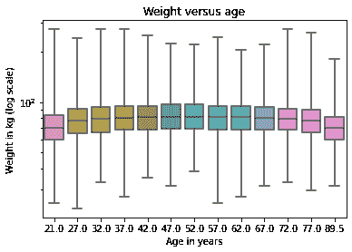

在对数刻度上，分布是对称的，因此脊柱的长度相同，箱子靠近图的中间，我们可以更清楚地看到年龄和体重之间的关系。

在接下来的练习中，你将有机会为其他变量生成小提琴图和箱线图。

**练习：**之前我们看过身高和体重的散点图，看到较高的人倾向于更重。现在让我们使用箱线图来更仔细地观察。`brfss` DataFrame 包含一个名为`_HTMG10`的列，表示以厘米为单位分组的身高。

+   制作一个箱线图，显示每个身高组中体重的分布。

+   将 y 轴绘制在对数刻度上。

建议：如果`x`轴上的标签发生碰撞，你可以像这样旋转它们：

```py
plt.xticks(rotation='45') 
```

**练习：**作为第二个例子，让我们看一下收入和身高之间的关系。

在 BRFSS 中，收入被表示为一个分类变量；也就是说，受访者被分配到 8 个收入类别中的一个。列名是`INCOME2`。

在将收入与其他任何东西联系之前，让我们通过计算 PMF 来查看分布。

+   从`brfss`中提取`INCOME2`并将其分配给`income`。

+   绘制`income`的 PMF 作为条形图。

注意：你会发现大约三分之一的受访者属于最高收入组；理想情况下，如果高端有更多的组会更好，但我们将使用现有的数据。

**练习：**生成一个小提琴图，显示每个收入组中身高的分布。你能看到这些变量之间的关系吗？

## 量化相关性

在前一节中，我们可视化了变量对之间的关系。现在我们将学习**相关系数**，它量化了这些关系的强度。

当人们随意提到“相关性”时，他们可能指的是两个变量之间的任何关系。在统计学中，它通常指的是皮尔逊相关系数，它是一个介于`-1`和`1`之间的数字，用来量化变量之间线性关系的强度。

为了演示，我们将从 BRFSS 数据集中选择三列：

```py
columns = ['HTM4', 'WTKG3', 'AGE']
subset = brfss[columns] 
```

结果是一个只有这些列的 DataFrame。有了这些数据子集，我们可以使用`corr`方法，就像这样：

```py
subset.corr() 
```

|  | 身高 | 体重 | 年龄 |
| --- | --- | --- | --- |
| 身高 | 1.000000 | 0.474203 | -0.093684 |
| 体重 | 0.474203 | 1.000000 | 0.021641 |
| 年龄 | -0.093684 | 0.021641 | 1.000000 |

结果是一个**相关矩阵**。从第一行开始阅读，`HTM4`与自身的相关性为`1`。这是预期的；任何事物与自身的相关性都是`1`。

下一个条目更有趣；身高和体重的相关性约为`0.47`。它是正相关的，这意味着身材较高的人体重更重，它的预测价值适中，但不是很大。如果你知道某人的身高，你可以更好地猜测他们的体重。

身高和年龄之间的相关性约为`-0.09`。它是负相关的，这意味着年长的人倾向于身材较矮，但它很弱，这意味着如果你试图猜测他们的身高，知道某人的年龄并不会有太大帮助。

年龄和体重之间的相关性甚至更小。很容易得出结论认为年龄和体重之间没有关系，但我们已经看到有关系。那么为什么相关性如此之低呢？记住体重和年龄之间的关系是这样的。

```py
data = brfss.dropna(subset=['AGE', 'WTKG3'])
sns.boxplot(x='AGE', y='WTKG3', data=data, whis=10)

plt.xlabel('Age in years')
plt.ylabel('Weight in kg')
plt.title('Weight versus age'); 
```

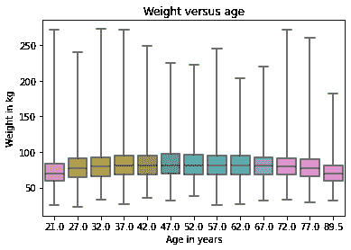

四十多岁的人体重最重；年轻和年长的人体重较轻。所以这种关系是非线性的。但是相关性只能测量线性关系。如果关系是非线性的，相关性通常低估了它的强度。

为了演示，我将生成一些虚假数据：`xs`包含在`-1`和`1`之间等间距的点。`ys`是`xs`的平方加上一些随机噪音。

```py
xs = np.linspace(-1, 1)
ys = xs**2 + np.random.normal(0, 0.05, len(xs)) 
```

这是`xs`和`ys`的散点图。

```py
plt.plot(xs, ys, 'o', alpha=0.5)
plt.xlabel('x')
plt.ylabel('y')
plt.title('Scatter plot of a fake dataset'); 
```

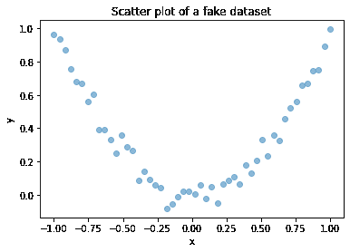

很明显这是一个强关系；如果给定`x`，你可以更好地猜测`y`。但是这里的相关矩阵是这样的：

```py
np.corrcoef(xs, ys) 
```

```py
array([[ 1\.        , -0.02804226],
       [-0.02804226,  1\.        ]]) 
```

尽管存在强烈的非线性关系，但计算出的相关性接近`0`。

一般来说，如果相关性很高——即接近`1`或`-1`——你可以得出结论认为有强烈的线性关系。但如果相关性接近`0`，这并不意味着没有关系；可能存在非线性关系。

这是我认为相关性不是一个很好的统计量的原因之一。还有一个需要小心的相关性原因；它并不意味着人们认为的意思。具体来说，相关性对斜率没有任何说明。如果我们说两个变量相关，那意味着我们可以用一个变量来预测另一个变量。但这可能不是我们关心的。

例如，假设我们关心体重增加的健康影响，所以我们绘制 20 到 50 岁之间的年龄与体重的关系。我将生成两组虚假数据来说明这一点。在每个数据集中，`xs`代表年龄，`ys`代表体重。

```py
np.random.seed(18)
xs1 = np.linspace(20, 50)
ys1 = 75 + 0.02 * xs1 + np.random.normal(0, 0.15, len(xs1))

plt.plot(xs1, ys1, 'o', alpha=0.5)
plt.xlabel('Age in years')
plt.ylabel('Weight in kg')
plt.title('Fake dataset #1'); 
```

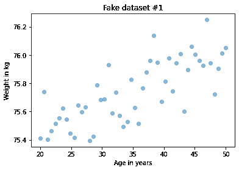

以下是第二个数据集：

```py
np.random.seed(18)
xs2 = np.linspace(20, 50)
ys2 = 65 + 0.2 * xs2 + np.random.normal(0, 3, len(xs2))

plt.plot(xs2, ys2, 'o', alpha=0.5)
plt.xlabel('Age in years')
plt.ylabel('Weight in kg')
plt.title('Fake dataset #2'); 
```

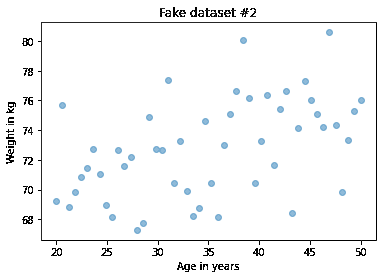

我构建了这些例子，使它们看起来相似，但它们的相关性有很大的不同：

```py
rho1 = np.corrcoef(xs1, ys1)[0][1]
rho1 
```

```py
0.7579660563439401 
```

```py
rho2 = np.corrcoef(xs2, ys2)[0][1]
rho2 
```

```py
0.4782776976576317 
```

在第一个例子中，相关性很强，接近 0.75。在第二个例子中，相关性适中，接近 0.5。因此我们可能认为第一个关系更重要。但更仔细地观察两个图中的 y 轴。

在第一个例子中，30 年内的平均体重增加不到 1 公斤；而在第二个例子中，超过 5 公斤！如果我们关心体重增加的健康影响，第二个关系可能更重要，即使相关性较低。

我们真正关心的统计量是线的斜率，而不是相关系数。

在下一节中，我们将看到如何估计这个斜率。但首先，让我们练习一下相关性。

**练习：**BRFSS 的目的是探索健康风险因素，因此包括有关饮食的问题。列`_VEGESU1`代表受访者每天报告的蔬菜摄入量。

让我们看看这个变量与年龄和收入的关系。

+   从`brfss` DataFrame 中选择列`'AGE'`，`INCOME2`和`_VEGESU1`。

+   计算这些变量的相关矩阵。

**练习：**在上一个练习中，收入和蔬菜消费之间的相关性约为 0.12。年龄和蔬菜消费之间的相关性约为-0.01。

以下哪些是对这些结果的正确解释？

+   *A*: 这个数据集中收入较高的人吃更多蔬菜。

+   *B*: 收入和蔬菜消费之间的关系是线性的。

+   *C*: 年龄较大的人吃更多蔬菜。

+   *D*: 年龄和蔬菜消费之间可能存在强烈的非线性关系。

**练习：**通常在计算相关性之前，先可视化变量之间的关系是一个好主意。我们在上一个例子中没有这样做，但现在还不算太晚。

生成年龄和蔬菜之间关系的可视化。如果有的话，你会如何描述这种关系？

## 简单线性回归

在上一节中，我们看到相关性并不总是能够衡量我们真正想要知道的内容。在本节中，我们将看看另一种方法：简单线性回归。

让我们再次看一下体重和年龄之间的关系。在上一节中，我生成了两个虚假数据集来阐明一个观点：

```py
plt.figure(figsize=(8, 3))

plt.subplot(1, 2, 1)
plt.plot(xs1, ys1, 'o', alpha=0.5)
plt.xlabel('Age in years')
plt.ylabel('Weight in kg')
plt.title('Fake dataset #1')
plt.tight_layout()

plt.subplot(1, 2, 2)
plt.plot(xs2, ys2, 'o', alpha=0.5)
plt.xlabel('Age in years')
plt.ylabel('Weight in kg')
plt.title('Fake dataset #2')
plt.tight_layout() 
```

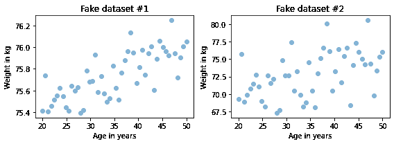

左边的那个相关性更高，约为 0.75，而右边的为 0.5。但在这种情况下，我们可能关心的统计量是线的斜率，而不是相关系数。为了估计斜率，我们可以使用 SciPy 的 stats 库中的`linregress`。

```py
from scipy.stats import linregress

res1 = linregress(xs1, ys1)
res1._asdict() 
```

```py
{'slope': 0.018821034903244386,
 'intercept': 75.08049023710964,
 'rvalue': 0.7579660563439402,
 'pvalue': 1.8470158725246148e-10,
 'stderr': 0.002337849260560818,
 'intercept_stderr': 0.08439154079040358} 
```

结果是一个`LinregressResult`对象，包含五个值：`slope`是数据最佳拟合线的斜率；`intercept`是截距。我们稍后会解释其他一些值。

对于虚假数据集＃1，估计的斜率约为每年 0.019 公斤或 30 年范围内约 0.56 公斤。

```py
res1.slope * 30 
```

```py
0.5646310470973316 
```

以下是虚假数据集＃2 的结果。

```py
res2 = linregress(xs2, ys2)
res2._asdict() 
```

```py
{'slope': 0.17642069806488855,
 'intercept': 66.60980474219305,
 'rvalue': 0.47827769765763173,
 'pvalue': 0.0004430600283776241,
 'stderr': 0.04675698521121631,
 'intercept_stderr': 1.6878308158080697} 
```

估计的斜率几乎高出 10 倍：约为每年 0.18 公斤或每 30 年约 5.3 公斤：

```py
res2.slope * 30 
```

```py
5.292620941946657 
```

这里所谓的`rvalue`是相关性，它证实了我们之前看到的；第一个例子的相关性更高，约为 0.75，而第二个例子的效应强度，由线的斜率来衡量，约高出 10 倍。

我们可以使用`linregress`的结果来计算最佳拟合线：首先得到观察到的`xs`的最小值和最大值；然后乘以斜率并加上截距。以下是第一个例子的情况。

```py
plt.plot(xs1, ys1, 'o', alpha=0.5)

fx = np.array([xs1.min(), xs1.max()])
fy = res1.intercept + res1.slope * fx
plt.plot(fx, fy, '-')

plt.xlabel('Age in years')
plt.ylabel('Weight in kg')
plt.title('Fake Dataset #1'); 
```

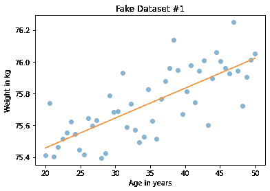

这是第二个示例的情况。

```py
plt.plot(xs2, ys2, 'o', alpha=0.5)

fx = np.array([xs2.min(), xs2.max()])
fy = res2.intercept + res2.slope * fx
plt.plot(fx, fy, '-')

plt.xlabel('Age in years')
plt.ylabel('Weight in kg')
plt.title('Fake Dataset #2'); 
```

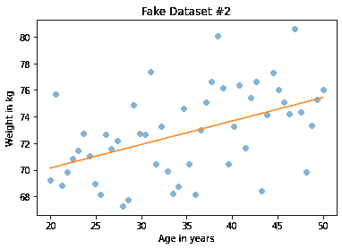

除非您仔细查看垂直刻度，否则这里的可视化可能会产生误导；第二个图中的斜率几乎是第一个图的 10 倍。

## 身高和体重的回归分析

现在让我们看一个真实数据的回归分析示例。这是身高和体重的散点图。

```py
plt.plot(height_jitter, weight_jitter, 'o', 
         alpha=0.02, markersize=1)

plt.xlim([140, 200])
plt.ylim([0, 160])
plt.xlabel('Height in cm')
plt.ylabel('Weight in kg')
plt.title('Scatter plot of weight versus height'); 
```


为了计算回归线，我们将再次使用`linregress`。但它无法处理`NaN`值，所以我们必须使用`dropna`来删除缺少我们需要的数据的行。

```py
subset = brfss.dropna(subset=['WTKG3', 'HTM4'])
height_clean = subset['HTM4']
weight_clean = subset['WTKG3'] 
```

现在我们可以计算线性回归。

```py
res_hw = linregress(height_clean, weight_clean)
res_hw._asdict() 
```

```py
{'slope': 0.9192115381848297,
 'intercept': -75.12704250330233,
 'rvalue': 0.47420308979024584,
 'pvalue': 0.0,
 'stderr': 0.005632863769802998,
 'intercept_stderr': 0.9608860265433182} 
```

斜率约为 0.92 千克每厘米，这意味着我们预计一个厘米更高的人几乎会重一公斤。这相当多。

与以前一样，我们可以计算最佳拟合线：

```py
fx = np.array([height_clean.min(), height_clean.max()])
fy = res_hw.intercept + res_hw.slope * fx 
```

这就是它的样子。

```py
plt.plot(height_jitter, weight_jitter, 'o', alpha=0.02, markersize=1)

plt.plot(fx, fy, '-')

plt.xlim([140, 200])
plt.ylim([0, 160])
plt.xlabel('Height in cm')
plt.ylabel('Weight in kg')
plt.title('Scatter plot of weight versus height'); 
```

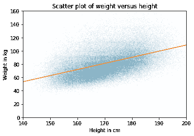

这条线的斜率似乎与散点图一致。

线性回归与相关性有相同的问题；它只能衡量线性关系的强度。这是体重与年龄的散点图，我们之前看到过。

```py
plt.plot(age_jitter, weight_jitter, 'o', 
         alpha=0.01, markersize=1)

plt.ylim([0, 160])
plt.xlabel('Age in years')
plt.ylabel('Weight in kg')
plt.title('Weight versus age'); 
```

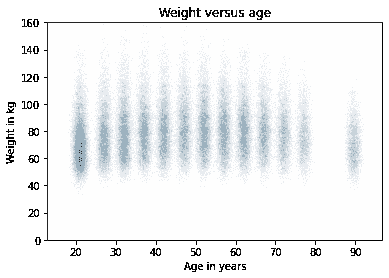

40 多岁的人体重最重；年轻人和老年人体重较轻。因此，这种关系是非线性的。

如果我们不看散点图，盲目计算回归线，我们会得到这样的结果。

```py
subset = brfss.dropna(subset=['WTKG3', 'AGE'])
age_clean = subset['AGE']
weight_clean = subset['WTKG3']

res_aw = linregress(age_clean, weight_clean)
res_aw._asdict() 
```

```py
{'slope': 0.023981159566968724,
 'intercept': 80.07977583683224,
 'rvalue': 0.021641432889064068,
 'pvalue': 4.374327493007566e-11,
 'stderr': 0.003638139410742186,
 'intercept_stderr': 0.18688508176870167} 
```

估计的斜率仅为 0.02 千克每年，或 30 年内为 0.6 千克。这是最佳拟合线的样子。

```py
plt.plot(age_jitter, weight_jitter, 'o', 
         alpha=0.01, markersize=1)

fx = np.array([age_clean.min(), age_clean.max()])
fy = res_aw.intercept + res_aw.slope * fx
plt.plot(fx, fy, '-')

plt.ylim([0, 160])
plt.xlabel('Age in years')
plt.ylabel('Weight in kg')
plt.title('Weight versus age'); 
```

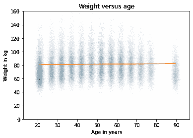

一条直线无法很好地捕捉这些变量之间的关系。

在下一章中，您将看到如何使用多元回归来估计非线性关系。但首先，让我们练习简单的回归。

**练习：**你认为谁吃更多蔬菜，低收入人群还是高收入人群？让我们找出来。

正如我们之前看到的，`INCOME2`列代表收入水平，`_VEGESU1`代表受访者每天报告的蔬菜食用量。

制作一个蔬菜食用量与收入的散点图，即将蔬菜食用量放在`y`轴上，将收入组放在`x`轴上。

您可能想使用`ylim`来放大`y`轴的底部一半。

**练习：**现在让我们估计蔬菜消费与收入之间关系的斜率。

+   使用`dropna`来选择`INCOME2`和`_VEGESU1`不是`NaN`的行。

+   提取`INCOME2`和`_VEGESU1`并计算这些变量的简单线性回归。

回归线的斜率是多少？在我们探讨的问题背景下，这个斜率意味着什么？

**练习：**最后，在散点图上绘制回归线。

## 总结

本章介绍了可视化两个变量之间关系的三种方法：散点图、小提琴图和箱线图。当您探索新数据集时，散点图通常是一个不错的选择，但需要注意避免过度绘制。小提琴图和箱线图在一个变量只取少数离散值时特别有用。

我们考虑了两种量化关系强度的方法：相关系数和回归线的斜率。这些统计数据捕捉了我们可能称之为“强度”的不同方面。相关系数指示了我们能够根据另一个变量来预测一个变量的能力。回归线的斜率指示了我们在改变另一个变量时可以期望的差异。根据上下文，其中一种可能更相关。
