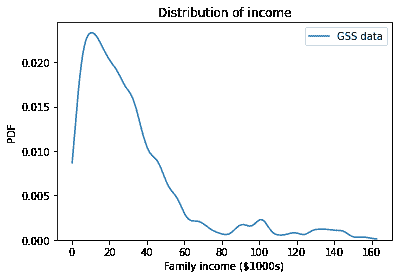
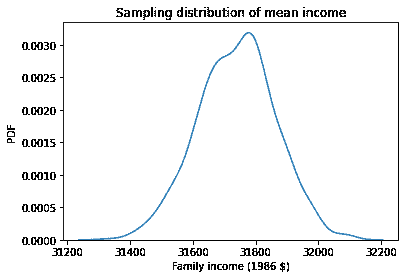
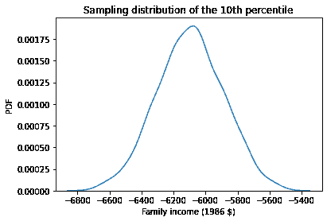
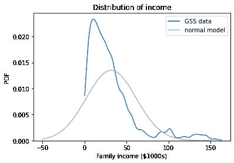
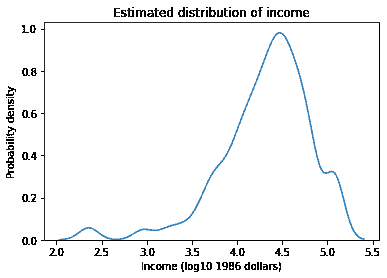
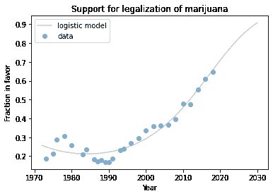

# Bootstrap 抽样

> 原文：[`allendowney.github.io/ElementsOfDataScience/12_bootstrap.html`](https://allendowney.github.io/ElementsOfDataScience/12_bootstrap.html)
> 
> 译者：[飞龙](https://github.com/wizardforcel)
> 
> 协议：[CC BY-NC-SA 4.0](http://creativecommons.org/licenses/by-nc-sa/4.0/)


[单击此处在 Colab 上运行此笔记本](https://colab.research.google.com/github/AllenDowney/ElementsOfDataScience/blob/master/12_bootstrap.ipynb) 或 [单击此处下载](https://github.com/AllenDowney/ElementsOfDataScience/raw/master/12_bootstrap.ipynb)。

在上一章中，我们使用重采样来计算标准误差和置信区间，以量化由于随机抽样而导致的估计变异性。作为示例之一，我们使用了来自总体社会调查（GSS）的数据，探索了支持枪支管制的变化，并计算了估计比例的置信区间。

在本章中，我们将使用 GSS 数据来估计平均收入和收入的第 10 百分位数。我们将看到，在上一章中使用的重采样方法适用于平均收入，但不适用于第 10 百分位数。

为了解决这个问题，我们将使用另一种重采样方法，称为自助法或自助抽样（参见[`en.wikipedia.org/wiki/Bootstrapping_(statistics)`](https://en.wikipedia.org/wiki/Bootstrapping_(statistics))）。然后，我们将使用自助法来计算其他统计量的抽样分布和置信区间，包括相关系数和线性回归的参数。最后，我将指出当数据集中没有足够不同的值时，自助法重采样存在的问题，以及用 KDE 重采样解决它的方法。

## 估计平均收入

作为第一个例子，我们将使用总体社会调查的数据来估计平均家庭收入。以下单元加载了我存储在 HDF 文件中的数据。

```py
import pandas as pd

gss = pd.read_hdf('gss_eda.hdf', 'gss')
gss.head() 
```

|  | 年份 | ID_ | 年龄 | 教育 | 性别 | 枪支法 | 大麻 | REALINC |
| --- | --- | --- | --- | --- | --- | --- | --- | --- |
| 0 | 1972 | 1 | 23.0 | 16.0 | 2 | 1.0 | NaN | 18951.0 |
| 1 | 1972 | 2 | 70.0 | 10.0 | 1 | 1.0 | NaN | 24366.0 |
| 2 | 1972 | 3 | 48.0 | 12.0 | 2 | 1.0 | NaN | 24366.0 |
| 3 | 1972 | 4 | 27.0 | 17.0 | 2 | 1.0 | NaN | 30458.0 |
| 4 | 1972 | 5 | 61.0 | 12.0 | 2 | 1.0 | NaN | 50763.0 |

列`REALINC`记录了家庭收入，转换为 1986 年的美元。以下图使用 Seaborn 函数`kdeplot`显示了家庭收入的分布。参数`cut=0`将曲线截断，使其不超出观察到的最小和最大值。

```py
import matplotlib.pyplot as plt
import seaborn as sns

sns.kdeplot(gss['REALINC'] / 1000, label='GSS data', cut=0)

plt.xlabel('Family income ($1000s)')
plt.ylabel('PDF')
plt.title('Distribution of income')
plt.legend(); 
```



收入分布向右倾斜；大多数家庭收入低于 60000 美元，但有些收入明显更高。以下是报告收入的均值和标准差。

```py
mean_realinc = gss['REALINC'].mean()
std_income = gss['REALINC'].std()
print(mean_realinc, std_income) 
```

```py
31742.56337281537 29526.06789623489 
```

这个样本的平均家庭收入是 31743 美元。但如果我们再次进行 GSS 调查，平均值可能会更高或更低。为了了解它可能变化多少，我们可以使用上一章中的这个函数来模拟抽样过程。

```py
import numpy as np

def simulate_sample_mean(n, mu, sigma):
    sample = np.random.normal(mu, sigma, size=n)
    return sample.mean() 
```

`simulate_sample_mean`的参数是样本大小和收入的观察均值和标准差。它从具有给定均值和标准差的正态分布中生成样本，并返回样本的均值。

在调用此函数之前，我们必须计算有效响应的数量。

```py
n_realinc = gss['REALINC'].notna().sum()
n_realinc 
```

```py
58293 
```

现在，如果我们调用`simulate_sample_mean`一次，我们将从均值的抽样分布中获得一个值。

```py
simulate_sample_mean(n_realinc, mean_realinc, std_income) 
```

```py
31725.9120143765 
```

如果我们多次调用它，我们将从抽样分布中获得一个随机样本。

```py
t1 = [simulate_sample_mean(n_realinc, mean_realinc, std_income)
      for i in range(1000)] 
```

这是均值的抽样分布的样子：

```py
sns.kdeplot(t1)

plt.xlabel('Family income (1986 $)')
plt.ylabel('PDF')
plt.title('Sampling distribution of mean income'); 
```



这个分布显示了如果我们再次进行 GSS 调查，我们期望观察到的均值会有多大变化。我们将使用以下函数来总结抽样分布。

```py
def summarize(t, digits=2):
    table = pd.DataFrame(columns=['Estimate', 'SE', 'CI90'])
    est = np.mean(t).round(digits)
    SE = np.std(t).round(digits)
    CI90 = np.percentile(t, [5, 95]).round(digits)
    table.loc[''] = est, SE, CI90
    return table 
```

```py
summary1 = summarize(t1, digits=1)
summary1 
```

|  | 估计 | SE | CI90 |
| --- | --- | --- | --- |
|  | 31739.4 | 123.3 | [31531.6, 31941.8] |

结果显示了抽样分布的均值、标准误差和 90%的置信区间。抽样分布的均值接近数据的均值，正如我们所期望的那样。标准误差量化了抽样分布的宽度，约为 128 美元。简单地说，这就是我们预期如果再次进行调查，样本均值会发生多大变化。如果我们多次进行调查并计算每次的平均收入，我们预期 90%的结果会落在 31538 美元到 31958 美元的范围内。

在本节中，我们使用正态分布来模拟抽样过程。正态分布并不是收入分布的特别好的模型，但对于这个例子来说，它足够好用，结果是合理的。在下一节中，我们将看到一个正态分布不够好，结果不合理的例子；然后我们将看到如何解决这个问题。

## 估计百分位数

假设我们不是估计平均收入，而是想要估计第 10 百分位数。计算收入的百分位数通常与收入不平等的讨论相关。要计算数据的第 10 百分位数，我们可以使用 NumPy 函数`percentile`，但是我们必须删除 NaN 值。

```py
np.percentile(gss['REALINC'].dropna(), 10) 
```

```py
5631.3 
```

样本的第 10 百分位数是 5631 美元，但如果我们收集另一个样本，结果可能会更高或更低。为了看到它会变化多少，我们可以使用以下函数来模拟抽样过程：`simulate_sample_percentile`生成一个来自正态分布的样本，并返回第 10 百分位数。

```py
def simulate_sample_percentile(n, mu, sigma):
    sample = np.random.normal(mu, sigma, size=n)
    return np.percentile(sample, 10) 
```

如果我们多次调用它，结果就是来自第 10 百分位数的抽样。

```py
t2 = [simulate_sample_percentile(n_realinc, mean_realinc, std_income)
      for i in range(1000)] 
```

这就是抽样分布的样子。

```py
sns.kdeplot(t2)

plt.xlabel('Family income (1986 $)')
plt.ylabel('PDF')
plt.title('Sampling distribution of the 10th percentile'); 
```



我们可以看到出现了一些问题。抽样分布中的所有值都是负数，即使样本中没有人报告负收入。我们可以总结结果如下。

```py
summary2 = summarize(t2)
summary2 
```

|  | 估计 | 标准误差 | 90%置信区间 |
| --- | --- | --- | --- |
|  | -6095.13 | 207.46 | [-6441.61, -5753.08] |

但是估计和置信区间都是负数，这是一个不合理的结果。为了看看发生了什么，让我们再次看看报告的收入分布，与具有相同均值和标准差的正态分布相比。

```py
from scipy.stats import norm

xs = np.linspace(-50, 150)
ys = norm(mean_realinc/1000, std_income/1000).pdf(xs) 
```

```py
sns.kdeplot(gss['REALINC'] / 1000, label='GSS data', cut=0)
plt.plot(xs, ys, color='0.7', label='normal model')

plt.xlabel('Family income ($1000s)')
plt.ylabel('PDF')
plt.title('Distribution of income')
plt.legend(); 
```



问题在于正态模型延伸到了观察值的下限之外，因此它并不产生合理的结果。幸运的是，有一个更健壮的简单替代方法：自助法。

## 自助法

自助法是一种基于我们在上一章中看到的框架的重采样方法：


这个想法是，我们将原始样本视为整个人口，并通过选择带有替换的随机行来模拟抽样过程。`DataFrame`提供了一个名为`sample`的方法，我们可以用它来选择行的随机样本。

```py
bootstrapped = gss.sample(n=n_realinc, replace=True)
bootstrapped.shape 
```

```py
(58293, 8) 
```

参数`n=n_realinc`表示自助抽样的样本大小与原始样本相同。

`replace=True`表示采样是带有替换的；也就是说，同一行可以被选择多次。为了看到每行在自助抽样中出现的次数，我们可以使用`value_counts`和`_ID`列，该列包含每个受访者的唯一标识符。

```py
repeats = bootstrapped['ID_'].value_counts()
repeats.head() 
```

```py
797    50
195    48
197    47
171    45
920    45
Name: ID_, dtype: int64 
```

有几行出现了 40 多次。由于一些行出现了很多次，其他行则根本没有出现。为了看到有多少，我们可以使用`set`减法来计算在原始数据集中出现但在自助抽样中没有出现的`ID_`的值。

```py
unused = set(gss['ID_']) - set(bootstrapped['ID_'])
len(unused) 
```

```py
567 
```

现在我们可以使用自助法来生成抽样分布。例如，以下函数接受一个`DataFrame`，生成一个自助抽样，并返回平均收入。

```py
def bootstrap_mean(df, varname):
    bootstrapped = df.sample(n=len(df), replace=True)
    return bootstrapped[varname].mean() 
```

如果我们多次运行它，我们会得到一个来自均值抽样分布的样本。

```py
t3 = [bootstrap_mean(gss, 'REALINC')
      for i in range(1001)] 
```

以下是结果的总结，与基于正常模型的结果进行了比较。

```py
summary3 = summarize(t3)
table = pd.concat([summary1, summary3])
table.index=['normal model', 'bootstrapping']
table 
```

|  | 估计 | 标准误 | CI90 |
| --- | --- | --- | --- |
| 正常模型 | 31739.40 | 123.30 | [31531.6, 31941.8] |
| 自助法 | 31742.67 | 121.39 | [31544.79, 31946.17] |

自助法抽样得到的结果与基于正常模型的结果一致。现在让我们看看当我们估计第 10 百分位数时会发生什么。

以下函数生成一个自助法样本，并返回第 10 百分位数。它使用 Pandas 的`quantile`而不是 Numpy 的`percentile`，因为`quantile`会删除`NaN`值。`quantile`的参数是 0 到 1 之间的概率，而不是 0 到 100 之间的百分比。

```py
def bootstrap_income_percentile(df):
    bootstrapped = df.sample(n=len(df), replace=True)
    return bootstrapped['REALINC'].quantile(0.1) 
```

我们可以使用它来生成来自第 10 百分位数抽样分布的样本。

```py
t4 = [bootstrap_income_percentile(gss)
      for i in range(1001)] 
```

以下是结果，以及基于正常模型的结果。

```py
summary4 = summarize(t4)
table = pd.concat([summary2, summary4])
table.index=['normal model', 'bootstrapping']
table 
```

|  | 估计 | 标准误 | CI90 |
| --- | --- | --- | --- |
| 正常模型 | -6095.13 | 207.46 | [-6441.61, -5753.08] |
| 自助法 | 5649.50 | 88.71 | [5512.5, 5806.0] |

抽样分布的均值与数据的第 10 百分位数一致，为 5631 美元。因此，自助法得到的结果比基于正常模型的结果更合理。

总的来说，自助法是稳健的；也就是说，它适用于许多不同的分布和许多不同的统计数据。然而，在本章的最后，我们会看到一个它失败的例子。

## 处理更大的数据

随着样本量的增加，由于随机抽样引起的误差变得更小。为了演示这种效果，我将使用行为风险因素监测系统（BRFSS）的数据。

在之前的章节中，我们使用 BRFSS 数据来探索身高和体重之间的关系，以及收入和蔬菜消费之间的关系。在本节中，我们将使用它来估计美国男性的平均身高。

首先，让我们阅读 2019 年的数据，我已经将其存储在一个 HDF 文件中。

```py
import pandas as pd

brfss = pd.read_hdf('brfss.hdf', 'brfss')
brfss.shape 
```

```py
(418268, 9) 
```

这个数据集包含 418268 行，每行代表一个受访者，以及 11 列，每列代表我选择的一个变量。以下是前几行。

```py
brfss.head() 
```

|  | SEQNO | HTM4 | WTKG3 | _SEX | _AGEG5YR | _VEGESU1 | _INCOMG | _LLCPWT | AGE |
| --- | --- | --- | --- | --- | --- | --- | --- | --- | --- |
| 0 | 2019000001 | 157.0 | 69.85 | 2 | 13.0 | 114.0 | 2 | 135.304080 | 82.0 |
| 1 | 2019000002 | 163.0 | 48.99 | 2 | 11.0 | 121.0 | 3 | 1454.882220 | 72.0 |
| 2 | 2019000003 | 165.0 | 86.18 | 2 | 10.0 | 164.0 | 5 | 215.576852 | 67.0 |
| 3 | 2019000004 | 165.0 | 55.34 | 2 | 13.0 | NaN | 4 | 261.282838 | 82.0 |
| 4 | 2019000005 | 152.0 | 49.90 | 2 | 13.0 | 178.0 | 9 | 535.270103 | 82.0 |

`HTM4`列包含了受访者的身高（厘米）。

```py
height = brfss['HTM4'] 
```

为了选择男性受访者，我们将使用`SEX`列生成一个布尔`Series`。

```py
male = (brfss['_SEX'] == 1)
male.sum() 
```

```py
189835 
```

我们可以使用`notna`和`sum`来计算具有有效身高数据的男性受访者的数量。

```py
n_height = height[male].notna().sum()
n_height 
```

```py
182269 
```

以下是这些值的均值和标准差。

```py
mean_height = height[male].mean()
std_height = height[male].std()
mean_height, std_height 
```

```py
(178.0768644146838, 7.9664553134728395) 
```

美国男性的平均身高约为 178 厘米；标准差约为 8 厘米。我们可以使用自助法来生成来自均值抽样分布的值。为了减少计算时间，我将迭代次数设置为 201。

```py
t5 = [bootstrap_mean(brfss[male], 'HTM4')
      for i in range(201)]

summarize(t5, digits=3) 
```

|  | 估计 | 标准误 | CI90 |
| --- | --- | --- | --- |
|  | 178.079 | 0.019 | [178.047, 178.107] |

由于样本量很大，标准误很小，置信区间很窄。这个结果表明我们的估计非常精确，这在随机抽样误差很小的意义上是正确的。

但还有其他误差来源。例如，该数据集中的身高和体重是基于自我报告的，因此容易受到社会期望偏差的影响。还有可能在记录数据时出现错误。在 BRFSS 的前一年，有大量身高记录为 60 或 61 厘米的可疑情况。我怀疑其中许多人的身高是六英尺，或六英尺一英寸，而在记录数据时出现了问题。

这就引出了这个例子的第一个要点：

> 在大样本量下，由于随机抽样而产生的误差很小，但在现实世界的数据中，通常意味着存在更大的其他误差来源。因此，我们无法确定估计值是否准确。

事实上，在这个例子中还有另一个我们没有考虑到的误差来源：过采样。

## 加权自助法

按设计，BRFSS 对一些人口统计学群体进行了过采样；也就是说，某些群体的人比其他人更有可能出现在样本中。如果这些群体的人平均身高要么高于其他人，要么低于其他人，我们的估计平均值将不准确。

我们在第七章遇到了这个问题，那里我们使用了来自美国家庭增长调查（NSFG）的数据来计算美国婴儿的平均出生体重。在那个例子中，我们通过计算加权平均值来校正过采样。

在这个例子中，我们将使用一种不同的方法，即**加权自助法**，来估计平均值并计算置信区间。

BRFSS 数据集包括一个名为`_LLCPWT`的列，其中包含抽样权重。每个受访者的抽样权重是他们代表的人口数量。过采样群体的人抽样权重较低；而欠采样群体的人抽样权重较高。数值范围如下。

```py
brfss['_LLCPWT'].describe() 
```

```py
count    418268.000000
mean        603.513276
std        1082.430311
min           1.016173
25%         111.160528
50%         272.869258
75%         654.211787
max       42066.730900
Name: _LLCPWT, dtype: float64 
```

最低的抽样权重约为 1；最大值为 42,066。所以这是一个非常广泛的范围！

我们可以通过将它们作为参数传递给`sample`来考虑这些权重。这样，任何行被选中的概率将与其抽样权重成比例。

```py
n = len(brfss)
bootstrapped = brfss.sample(n=n, replace=True, weights='_LLCPWT') 
```

就像我们在非加权自助法中看到的那样，同一行可能会出现多次。为了查看出现的次数，我们可以使用`value_counts`和`SEQNO`列，该列包含每个受访者的唯一标识符。

```py
repeats = bootstrapped['SEQNO'].value_counts()
repeats.head() 
```

```py
2019000108    139
2019000047    122
2019000048    115
2019000096    110
2019000851    110
Name: SEQNO, dtype: int64 
```

有些行出现了 100 多次。很可能，这些是具有最高抽样率的行，对应于欠采样群体的人。

为了查看有多少行根本不出现，我们可以使用`set`减法来计算原始数据集中出现但样本中没有出现的`SEQNO`值。

```py
unused = set(brfss['SEQNO']) - set(bootstrapped['SEQNO'])
len(unused) 
```

```py
826 
```

有几百行在这个样本中没有出现，但它们并没有完全被删除；当我们重复这个过程时，它们将出现在其他样本中。

我们可以使用加权自助法来生成从平均值的抽样分布中获得的值。以下函数使用`sample`和`_LLCPWT`列生成一个自助法样本，然后返回平均身高。

```py
def weighted_bootstrap_mean(df):
    n = len(df)
    sample = df.sample(n=n, replace=True, weights='_LLCPWT')
    return sample['HTM4'].mean() 
```

我将使用一个只包含男性受访者的`DataFrame`来测试这个函数。如果我们运行一次，我们将从加权平均值的抽样分布中获得一个单一值。

```py
male_df = brfss[male]
weighted_bootstrap_mean(male_df) 
```

```py
177.63307589732193 
```

如果我们多次运行它，我们将从抽样分布中获得一个随机样本。

```py
t6 = [weighted_bootstrap_mean(male_df) 
      for i in range(201)]

summarize(t6, digits=3) 
```

|  | 估计值 | 标准误 | CI90 |
| --- | --- | --- | --- |
|  | 177.639 | 0.021 | [177.602, 177.671] |

抽样分布的平均值估计了美国男性的平均身高，经过过采样校正。如果我们将其与我们计算的非加权平均值进行比较，它会略低一些。

```py
print(np.mean(t6), mean_height) 
```

```py
177.6394121015467 178.0768644146838 
```

因此，似乎过采样群体的人平均身高要比其他人高，足以使非加权平均值提高约半厘米。

加权和未加权平均值之间的差异大于置信区间的宽度。因此，在这个例子中，如果我们未能校正过抽样，错误将大于由随机抽样引起的变异性。

## 相关性和回归

自助法重采样可用于估计其他统计量及其抽样分布。例如，在第九章中，我们计算了身高和体重之间的相关性，约为 0.48。

```py
var1, var2 = 'HTM4', 'WTKG3'
corr = brfss[var1].corr(brfss[var2])
corr 
```

```py
0.47715146283881427 
```

该相关性未考虑过抽样。我们可以使用此函数进行校正，该函数生成加权的自助采样，并用它来计算具有名称`var1`和`var2`的列的相关性。

```py
def weighted_bootstrap_corr(df, var1, var2):
    n = len(df)
    sample = df.sample(n=n, replace=True, weights='_LLCPWT')
    corr = sample[var1].corr(sample[var2])
    return corr 
```

**练习：**使用此函数从身高和体重的相关性抽样分布中绘制 101 个值。这些值的均值是多少？与我们未校正过抽样的相关性相比，它是否有很大不同？计算估计相关性的标准误差和 90%置信区间。

**练习：**在第九章中，我们还计算了体重随身高的回归线斜率。以下是 2019 年的结果。

```py
from scipy.stats import linregress

subset = brfss.dropna(subset=['WTKG3', 'HTM4'])
res = linregress(subset['HTM4'], subset['WTKG3'])
res.slope 
```

```py
0.932929241334935 
```

估计的斜率为 0.93 千克/厘米，这意味着我们预计比平均身高高 1 厘米的人体重会比平均体重重 0.93 千克。

编写一个名为`weighted_bootstrap_slope`的函数，该函数接受一个`DataFrame`，生成一个加权的自助采样，使用身高和体重运行`linregress`，并返回回归线的斜率。

运行 101 次并收集结果。使用抽样分布计算斜率估计的均值、标准误差和 90%置信区间。

## 自助法的局限性

自助法的一个局限性是它可能计算成本很高。对于小数据集，通常足够快，我们可以从抽样分布中生成 1000 个值，这意味着我们可以精确计算标准误差和置信区间。对于较大的数据集，我们可以通过生成更少的值来减少计算时间。使用 100-200 个值，我们得到的标准误通常足够精确，但置信区间的边界可能会更嘈杂。

另一个可能更为严重的局限性是，自助法采样在包含少量不同值的数据集中效果不佳。为了演示，我将从 2018 年的 GSS 数据中选择数据：

```py
one_year = gss['YEAR']==2018
gss2018 = gss[one_year] 
```

我将使用自助法从收入的抽样分布中生成值。

```py
t9 = [bootstrap_income_percentile(gss2018)
      for i in range(1001)] 
```

以下是结果。

```py
summary9 = summarize(t9)
summary9 
```

|  | 估计 | 标准误 | CI90 |
| --- | --- | --- | --- |
|  | 5158.3 | 232.53 | [5107.5, 5107.5] |

估计值和标准误看起来乍一看是合理的，但置信区间的宽度为 0，这表明出了问题！

问题在于`REALINC`不是一个数值变量；它是一个伪装的分类变量。使用`value_counts`，我们可以看到这一列中只有 26 个不同的值。

```py
len(gss2018['REALINC'].value_counts()) 
```

```py
26 
```

原因是 GSS 不要求受访者报告他们的收入。相反，它给他们一个收入范围的列表，并要求他们选择其收入所在范围。这些范围在相关变量`INCOME`的文档中有描述（参见[`gssdataexplorer.norc.org/variables/104/vshow`](https://gssdataexplorer.norc.org/variables/104/vshow)）。

然后 GSS 分析师计算每个范围的中点，并通过通货膨胀调整为 1986 年的美元。方法的详细信息可从[`gss.norc.org/Documents/reports/methodological-reports/MR101%20Getting%20the%20Most%20Out%20of%20the%20GSS%20Income%20Measures.pdf`](https://gss.norc.org/Documents/reports/methodological-reports/MR101%20Getting%20the%20Most%20Out%20of%20the%20GSS%20Income%20Measures.pdf)获取。

结果是`REALINC`中只有 26 个不同的值。当我们生成一个自助抽样样本并计算第 10 个百分位数时，我们得到其中的一个小子集。以下是出现在我们样本中的值：

```py
pd.Series(t9).value_counts().sort_index() 
```

```py
5107.5    955
5675.0      1
5902.0      1
6015.5      2
6242.5     42
dtype: int64 
```

只有 5 个不同的值，其中一个出现的概率超过 95%。当我们计算 90%的置信区间时，这个值既是第 5 个百分位数，也是第 95 个百分位数。

自助法适用于大多数分布和大多数统计量；它无法处理的唯一问题是数据缺乏多样性。然而，即使这个问题也可以解决。根本原因是数据被过度离散化，因此解决方案是对其进行平滑处理。抖动是一种选择。另一种选择是使用核密度估计（KDE）。

## KDE 重采样

我们已经多次使用 KDE 来估计和绘制基于样本的概率密度。我们还可以用它来平滑离散化的数据。

在第八章中，我们看到收入的分布很好地符合对数正态分布的模型，因此如果我们取收入的对数，它就很好地符合正态分布。以下是收入数据的对数。

```py
log_realinc = np.log10(gss2018['REALINC'].dropna()) 
```

以下是估计的密度的样子。

```py
sns.kdeplot(log_realinc)

plt.xlabel('Income (log10 1986 dollars)')
plt.ylabel('Probability density')
plt.title('Estimated distribution of income'); 
```



为了从这个分布中抽取样本，我们将使用一个名为`gaussian_kde`的 Scipy 函数，它接受数据并返回一个表示估计密度的对象。

```py
from scipy.stats import gaussian_kde

kde = gaussian_kde(log_realinc) 
```

`kde`提供了一个名为`resample`的方法，从估计的密度中抽取随机值。就像我们在之前的例子中所做的那样，我们将生成一个与原始数据大小相同的重采样数据集。

```py
n = gss2018['REALINC'].notna().sum()
n 
```

```py
2152 
```

现在我们可以抽取一个样本，计算第 10 个百分位数，并将其从对数转换为美元值。

```py
sample = kde.resample(n)
10 ** np.percentile(sample, 10) 
```

```py
5130.216531511149 
```

结果是第 10 个百分位数的抽样分布中的一个随机值。以下函数封装了这些步骤。

```py
def resample_kde_percentile(kde):
    sample = kde.resample(kde.n)
    return 10 ** np.percentile(sample, 10) 
```

现在我们可以从抽样分布中生成一个样本。

```py
t10 = [resample_kde_percentile(kde)
       for i in range(1000)]

summary10 = summarize(t10) 
```

以下表格将 KDE 重采样的结果与之前的自助法结果进行了比较。

```py
table = pd.concat([summary9, summary10])
table.index=['bootstrapping', 'KDE resampling']
table 
```

|  | 估计 | 标准误 | CI90 |
| --- | --- | --- | --- |
| 自助法 | 5158.30 | 232.53 | [5107.5, 5107.5] |
| KDE 重采样 | 5092.02 | 270.36 | [4674.41, 5560.08] |

两种方法的均值和标准误差大致相同。不同之处在于，我们从 KDE 重采样得到的置信区间要合理得多。

## 总结

到目前为止，本章中有十个例子；让我们来回顾一下：

1.  首先，我们使用基于正态模型的重采样来估计 GSS 中家庭收入的平均值并计算置信区间。

1.  然后我们使用相同的方法来估计收入的第 10 个百分位数，发现抽样分布中的所有值都是负数。问题在于正态模型不适合收入分布。

1.  为了解决这个问题，我们转而使用自助抽样。首先我们估计了家庭收入的平均值，并确认结果与基于正态模型的结果一致。

1.  然后我们使用自助法估计收入的第 10 个百分位数。结果更加合理。

1.  接下来，我们使用 BRFSS 的数据来估计美国男性的平均身高。由于这个数据集很大，置信区间非常小。这意味着估计是精确的，因为由于随机抽样引起的变异性很小，但我们不知道它是否准确，因为还有其他可能的误差来源。

1.  其中一个误差来源是过度抽样；也就是说，有些人出现在样本中的可能性比其他人更高。在 BFRSS 中，每个受访者都有一个抽样权重，表示他们在人口中代表多少人。我们使用这些权重进行加权自助法，并发现由于过度抽样而产生的误差大于由随机抽样引起的变异性。

1.  在一个练习中，您使用了加权自助法来估计身高和体重的相关性，并计算置信区间。

1.  在另一个练习中，你估计了回归线的斜率并计算了置信区间。

1.  然后我演示了当数据集只有少量不同值时，bootstrap 抽样存在的问题，

1.  并提出了使用 KDE 对数据进行平滑处理，并从估计的分布中抽样的解决方案。

在下面的练习中，你可以再做一个例子。这比之前的练习要复杂一些，但我会带你一步步完成。

**练习：**在第十章中，我们使用逻辑回归模型来模拟年龄、性别和教育水平对大麻合法化支持的影响。回到那个例子，让我们探索支持率随时间的变化，并为未来十年生成预测。

为了准备数据进行逻辑回归，我们必须重新编码`GRASS`列，使`1`表示支持合法化，`0`表示不支持。

```py
gss['GRASS'].replace(2, 0, inplace=True)
gss['GRASS'].value_counts() 
```

```py
0.0    25662
1.0    11884
Name: GRASS, dtype: int64 
```

作为解释变量，我们将使用`YEAR`和`YEAR`的平方，我将它们存储在名为`YEAR2`的列中。

```py
gss['YEAR2'] = (gss['YEAR']-1990) ** 2 
```

现在我们可以这样运行模型：

```py
import statsmodels.formula.api as smf

formula = 'GRASS ~ YEAR + YEAR2'
results = smf.logit(formula, data=gss).fit(disp=False) 
```

为了生成预测，我将创建一个`DataFrame`，其中包含`YEAR`的一系列值，直到 2030 年，并对应的`YEAR2`的值。

```py
years = np.linspace(1972, 2030)
df_pred = pd.DataFrame()
df_pred['YEAR'] = years
df_pred['YEAR2'] = (df_pred['YEAR']-1990)**2

pred = results.predict(df_pred) 
```

我将使用`groupby`来计算每年支持合法化的受访者比例。

```py
grass_by_year = gss.groupby('YEAR')['GRASS'].mean() 
```

以下函数绘制数据并装饰坐标轴。

```py
def plot_data():
    grass_by_year.plot(style='o', alpha=0.5, label='data')
    plt.xlabel('Year')
    plt.ylabel('Fraction in favor')
    plt.title('Support for legalization of marijuana')
    plt.legend(loc='upper left'); 
```

预测的结果如下图所示，与数据一起绘制。

```py
plt.plot(years, pred, label='logistic model', color='gray', alpha=0.4)
plot_data() 
```



该模型很好地拟合了过去的数据，并对未来十年做出了合理的预测，尽管我们永远无法确定这样的趋势是否会持续。

这种表示结果的方式可能会误导，因为它没有显示我们对预测的不确定性。随机抽样只是众多不确定性中的一个来源，对于这种预测来说，它肯定不是最大的不确定性。但它是最容易量化的，所以让我们这样做，即使只是作为一种练习。

编写一个名为`bootstrap_regression_line`的函数，它以`DataFrame`作为参数，使用`sample`对行进行重新抽样，运行逻辑回归模型，为`df_pred`中的行生成预测，并返回预测结果。

调用这个函数 101 次，并将结果保存为`Series`对象的列表。要可视化结果，你有两个选择：

1.  循环遍历列表，并使用低`alpha`值的灰色线绘制每个预测。重叠的线将形成一个区域，显示随时间变化的不确定性范围。

1.  将`Series`列表传递给`np.percentile`，并使用参数`axis=0`来计算每列的第 5 和第 95 百分位数。将这些百分位数绘制为两条线，或者使用`plt.fill_between`来绘制它们之间的阴影区域。
