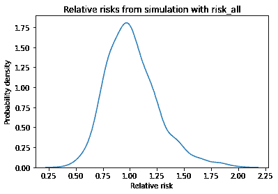
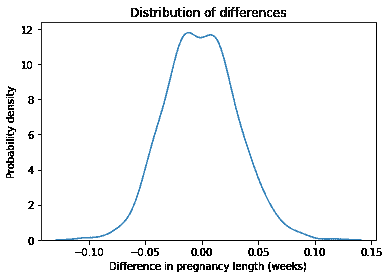
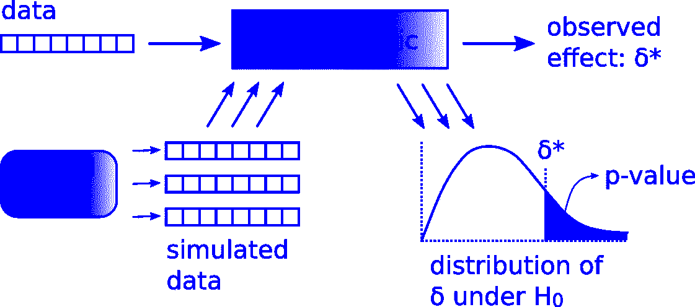
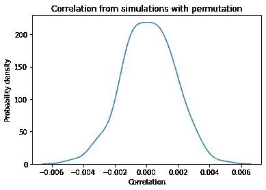
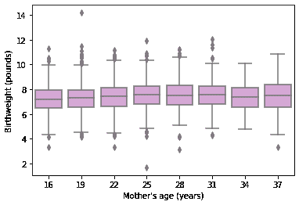

# 假设检验

> 原文：[`allendowney.github.io/ElementsOfDataScience/13_hypothesis.html`](https://allendowney.github.io/ElementsOfDataScience/13_hypothesis.html)
> 
> 译者：[飞龙](https://github.com/wizardforcel)
> 
> 协议：[CC BY-NC-SA 4.0](http://creativecommons.org/licenses/by-nc-sa/4.0/)


[单击此处在 Colab 上运行此笔记本](https://colab.research.google.com/github/AllenDowney/ElementsOfDataScience/blob/master/13_hypothesis.ipynb)或[单击此处下载](https://github.com/AllenDowney/ElementsOfDataScience/raw/master/13_hypothesis.ipynb)。

本章介绍了统计假设检验，这在统计学历史上是一个有争议的话题，很难提供一个简单的定义。相反，我将从一个例子开始，提出假设检验旨在解决的问题，然后展示一个解决方案。

我将展示的解决方案与您在统计书籍中找到的不同。我们将使用计算模拟而不是数学分析。这种方法有两个优点和一个缺点：

+   优势：标准统计课程包括许多不同的测试，许多人发现很难记住应该使用哪一个。在我看来，模拟使得只有一个测试框架更加清晰。

+   优势：模拟使建模决策明确。所有统计方法都是基于模型的，但是当我们使用数学方法时，很容易忘记它们所基于的假设。通过计算，假设更加明显，更容易尝试不同的模型。

+   缺点：模拟需要大量计算。本笔记本中的一些示例需要几秒钟才能运行，并且结果只是近似值。对于一些问题，有更快更准确的解析方法。

本章的示例包括与花生过敏有关的临床试验结果，以及来自国家家庭增长调查（NSFG）和行为风险因素监测系统（BRFSS）的调查数据。

## 测试医疗治疗

LEAP 研究是一项随机试验，测试了食用花生零食对花生过敏发展的影响（请参阅[`www.leapstudy.co.uk/leap-0#.YEJax3VKikA`](http://www.leapstudy.co.uk/leap-0#.YEJax3VKikA)）。受试者是婴儿，他们因被诊断患有其他食物过敏而有高发花生过敏的风险。在几年的时间里，一半的受试者定期食用含花生的零食；另一半则完全不食用花生。

该研究的结论报告于 2015 年：

> 避免食用花生的儿童中，有 17%在 5 岁时发展出花生过敏。值得注意的是，只有 3%的儿童在 5 岁时被随机分配食用花生零食的情况下发展出过敏。因此，在高风险婴儿中，从生命的第 11 个月开始持续食用花生对预防花生过敏的发展非常有效。

这些结果看起来令人印象深刻，但作为怀疑论的数据科学家，我们应该怀疑是否可能被随机性愚弄。也许组之间的明显差异是由于偶然而不是治疗的有效性。为了查看这是否可能，我们将使用一个模型来模拟实验，其中治疗没有效果，并看看我们有多少次看到组之间如此大的差异。

该研究的详细结果报告在*新英格兰医学杂志*中（请参阅[`www.nejm.org/doi/full/10.1056/NEJMoa1414850`](https://www.nejm.org/doi/full/10.1056/NEJMoa1414850)）。在那篇文章中，图 1 显示了治疗组和对照组的受试者人数，这两组恰好相等。

```py
n_control = 314
n_treatment = 314 
```

从图 2 中，我们可以提取每组发展花生过敏的受试者人数。具体来说，我们将使用“意向治疗分析的两个队列”的数字。

```py
k_control = 54
k_treatment = 10 
```

利用这些数字，我们可以计算每组的风险百分比。

```py
risk_control = k_control / n_control * 100
risk_control 
```

```py
17.197452229299362 
```

```py
risk_treatment = k_treatment / n_treatment * 100
risk_treatment 
```

```py
3.1847133757961785 
```

这些与论文中报告的百分比一致。为了量化两组之间的差异，我们将使用相对风险，即两组风险的比率。

```py
relative_risk_actual = risk_treatment / risk_control
relative_risk_actual 
```

```py
0.1851851851851852 
```

治疗组的风险约为对照组风险的 18%。因此似乎治疗效果非常好。为了检查，让我们想象一个情况，即治疗完全无效，因此两组的风险实际上是相同的，我们观察到的差异是由于偶然因素造成的。如果是这样，我们可以通过合并两组来估计假设风险：

```py
n_all = n_control + n_treatment
k_all = k_control + k_treatment
risk_all = k_all / n_all
risk_all 
```

```py
0.10191082802547771 
```

如果两组的风险相同，那么接近 10%。现在我们可以使用这个假设风险来模拟实验。这是`simulate_group_percent`，我们在第十一章中看到的。它以组的大小`n`和风险`p`作为参数。它模拟实验并返回作为组的百分比的病例数，这就是观察到的风险。

```py
import numpy as np

def simulate_group_percent(n, p):
    xs = np.random.random(size=n)
    k = np.sum(xs < p)
    return k / n * 100 
```

如果我们多次调用这个函数，结果是一系列观察到的风险，每个模拟实验一个。这是治疗组的列表。

```py
t1 = [simulate_group_percent(n_treatment, risk_all)
      for i in range(1000)] 
```

还有对照组。

```py
t2 = [simulate_group_percent(n_control, risk_all)
      for i in range(1000)] 
```

如果我们对这些列表进行逐元素划分，结果是相对风险的列表，每个模拟实验一个。

```py
relative_risks = np.divide(t2, t1) 
```

我们可以使用 KDE 图来可视化这些结果的分布。

```py
import matplotlib.pyplot as plt
import seaborn as sns

sns.kdeplot(relative_risks)

plt.xlabel('Relative risk')
plt.ylabel('Probability density')
plt.title('Relative risks from simulation with risk_all'); 
```



请记住，这些模拟是基于风险对两组相同的假设，因此我们期望相对风险大部分时间接近 1。而且确实如此。

在一些模拟实验中，相对风险低至 0.5 或高至 2，这意味着我们可能会看到这样的结果，即使两组之间没有差异，也是合理的。

但实际实验中的相对风险是 0.18，我们在模拟实验中从未看到过如此小的结果。我们可以得出结论，如果两组的风险实际上是相同的，我们观察到的相对风险是不太可能的。

## 计算 p 值

现在假设除了治疗组和对照组之外，实验还包括一个安慰剂组，该组被给予不含花生的小吃。假设这个组与其他组的大小相同，有 42 名受试者患有花生过敏。

要清楚，没有第三组，我编造了这些数字，但让我们看看这个假设是如何运作的。这是安慰剂组的风险。

```py
n_placebo = 314
k_placebo = 42

risk_placebo = k_placebo / n_placebo * 100
risk_placebo 
```

```py
13.375796178343949 
```

这是相对风险与对照组的比较。

```py
relative_risk_placebo = risk_placebo / risk_control
relative_risk_placebo 
```

```py
0.7777777777777778 
```

相对风险小于 1，这意味着安慰剂组的风险略低于对照组。因此我们可能会想知道安慰剂是否真的有效。为了至少部分回答这个问题，我们可以回到模拟实验的结果。

在假设两组实际上没有差异的情况下，即使两组相同，看到相对风险低至 0.77 也不会不寻常。事实上，我们可以计算看到相对风险低于或等于`relative_risk_placebo`的概率，即使两组相同，如下所示：

```py
p_value = (relative_risks <= relative_risk_placebo).mean()
p_value 
```

```py
0.137 
```

这个概率被称为**p 值**（参见[`en.wikipedia.org/wiki/P-value`](https://en.wikipedia.org/wiki/P-value)）。在这种情况下，p 值约为 14%，这意味着即使两组相同，我们也期望看到相对风险低至 0.77 的情况约 14%的时间。因此，对于这个想象的实验，我们不能排除明显差异是由于偶然因素造成的可能性。

## 第一个宝宝更可能晚到吗？

在前面的例子中，我们看到两组之间的比例差异。作为第二个例子，让我们考虑均值的差异。

当我和妻子期待第一个孩子时，我们听说第一个孩子更有可能晚出生。但我们也听说第一个孩子更有可能早出生。那到底是哪个？作为一个手头有太多时间的数据科学家，我决定找出答案。我从家庭增长国家调查（NSFG）中获取了数据，这是我们在之前章节中使用过的同一调查。我把 2015-2017 年调查的结果放在了一个 HDF 文件中。以下是前几行的结果。

```py
import pandas as pd

nsfg = pd.read_hdf('nsfg.hdf', 'nsfg')
nsfg.head() 
```

|  | CASEID | OUTCOME | BIRTHWGT_LB1 | BIRTHWGT_OZ1 | PRGLNGTH | NBRNALIV | AGECON | AGEPREG | BIRTHORD | HPAGELB | WGT2015_2017 |
| --- | --- | --- | --- | --- | --- | --- | --- | --- | --- | --- | --- |
| 0 | 70627 | 1 | 7.0 | 8.0 | 40 | 1.0 | 28 | 29.0 | 1.0 | 5.0 | 19877.457610 |
| 1 | 70627 | 4 | NaN | NaN | 14 | NaN | 32 | 32.0 | NaN | NaN | 19877.457610 |
| 2 | 70627 | 1 | 9.0 | 2.0 | 39 | 1.0 | 33 | 33.0 | 2.0 | 5.0 | 19877.457610 |
| 3 | 70628 | 1 | 6.0 | 9.0 | 39 | 1.0 | 17 | 18.0 | 1.0 | 1.0 | 4221.017695 |
| 4 | 70628 | 1 | 7.0 | 0.0 | 39 | 1.0 | 19 | 20.0 | 2.0 | 2.0 | 4221.017695 |

我们将使用`OUTCOME`列来选择以活产结束的怀孕。

```py
live = (nsfg['OUTCOME'] == 1)
live.sum() 
```

```py
6693 
```

并使用`PRGLNGTH`来选择在怀孕第 37 周或之后出生的足月婴儿。

```py
fullterm = (nsfg['PRGLNGTH'] >= 37) & (nsfg['PRGLNGTH'] < 48) 
```

这个数据集包括 2724 个第一个宝宝的数据。

```py
first = live & fullterm & (nsfg['BIRTHORD'] == 1)
n_first = first.sum()
n_first 
```

```py
2724 
```

还有 3115 个（不是第一个）婴儿。

```py
other = live & fullterm & (nsfg['BIRTHORD'] > 1)
n_other = other.sum()
n_other 
```

```py
3115 
```

现在我们可以选择第一个宝宝和其他宝宝的怀孕期长度。

```py
length = nsfg['PRGLNGTH']
length_first = length[first]
length_other = length[other] 
```

以下是两组的怀孕期长度的平均值，以周为单位。

```py
print(length_first.mean(), length_other.mean()) 
```

```py
39.39647577092511 39.19775280898877 
```

在这个数据集中，第一个宝宝的平均出生时间要晚一点。差异大约是 0.2 周，或者 33 小时。

```py
diff_actual = length_first.mean() - length_other.mean()
diff_actual, diff_actual * 7 * 24 
```

```py
(0.19872296193634043, 33.38545760530519) 
```

相对于平均长度为 39 周，这并不是一个很大的差异。我们可能会想知道，即使两组是相同的，是否会有这么大的差异。为了回答这个问题，让我们想象一个世界，在那里第一个宝宝和其他宝宝的怀孕期长度没有差异。我们应该如何对这样的世界建模？和建模决策一样，有很多选择。一个简单的方法是将两组合并，计算怀孕期长度的平均值和标准差，就像这样：

```py
length_live_full = length[live&fullterm]
mean = length_live_full.mean()
std = length_live_full.std()
mean, std 
```

```py
(39.29046069532454, 1.1864094701037506) 
```

现在我们可以使用第十一章中的`simulate_sample_mean`从正态分布中抽取一个随机样本，并返回均值。

```py
def simulate_sample_mean(n, mu, sigma):
    sample = np.random.normal(mu, sigma, size=n)
    return sample.mean() 
```

如果我们运行 1000 次，它会模拟抽样和测量过程，并返回从 1000 次模拟实验中的结果列表。以下是样本量为`n_first`的模拟结果：

```py
t_first = [simulate_sample_mean(n_first, mean, std)
           for i in range(1000)] 
```

还有样本量为`n_other`的样本。

```py
t_other = [simulate_sample_mean(n_other, mean, std)
           for i in range(1000)] 
```

如果我们逐个元素地减去模拟的均值，结果就是从模拟实验中观察到的差异列表，其中两组的分布是相同的。

```py
diffs = np.subtract(t_first, t_other) 
```

我们可以使用 KDE 图来可视化这些值的分布。

```py
sns.kdeplot(diffs)

plt.xlabel('Difference in pregnancy length (weeks)')
plt.ylabel('Probability density')
plt.title('Distribution of differences'); 
```



这个分布的中心接近于零，如果两组的分布相同，这是有道理的。仅仅偶然地，我们有时会看到 0.1 周的差异，但在 1000 次模拟中，我们从未看到数据中观察到的差异那么大，几乎是 0.2 周。

基于这个结果，我们基本可以排除我们看到的差异是由于随机抽样造成的可能性。但我们应该记住还有其他可能的误差来源。首先，NSFG 中的怀孕期长度是自我报告的。当受访者接受采访时，他们对第一个孩子的回忆可能不如对最近孩子的回忆准确。或者对怀孕期长度的估计可能在经验不足的母亲身上不太准确。

我的一位了解分娩情况比我更多的通讯员提出了另一个可能性。如果第一个宝宝是通过[剖腹产](https://en.wikipedia.org/wiki/Caesarean_section)出生的，那么后续的分娩更有可能是预定的，并且不太可能超过 39 周。这可能会降低非第一个宝宝的平均值。

总之，本节的结果表明观察到的差异不太可能是由于偶然造成的，但还有其他可能的解释。

## 假设检验框架

到目前为止，我们所做的例子都符合这个图示中所示的框架：



使用实验数据，我们计算观察到的**检验统计量**，在图示中用$\delta^*$表示，它量化了观察到的效应的大小。在花生过敏的例子中，检验统计量是相对风险。在怀孕期长度的例子中，它是均值的差异。

然后我们建立一个不存在效应的世界的模型。这个模型被称为**零假设**，在图示中表示为$H_0$。在花生过敏的例子中，该模型假设两组的风险是相同的。在怀孕的例子中，它假设长度是从相同的正态分布中抽取的。

接下来，我们使用模型多次模拟实验。每次模拟都会生成一个数据集，我们用它来计算一个检验统计量$\delta$。最后，我们收集模拟中的检验统计量，并计算一个 p 值，这是在零假设下观察到的效应$\delta^*$一样大的概率。

如果 p 值很小，我们通常可以排除观察到的效应是由于随机变化造成的可能性。但通常还有其他我们无法排除的解释，包括测量误差和不具代表性的抽样。

在这个框架中，我强调了模型的作用，因为对于一个给定的实验，可能会有几种可能的模型，每个模型都包括一些真实世界的元素，忽略其他元素。例如，我们使用正态分布来模拟怀孕期长度的变化。如果我们不想做出这个假设，另一种选择是通过对怀孕期长度进行洗牌来模拟零假设。

下面的函数接受两个表示两组怀孕期长度的序列。它将它们附加到一个单一的序列中，然后对其进行洗牌，然后再次将其分成与原始序列相同大小的组。返回值是两组之间的均值差异。

```py
def simulate_two_groups(data1, data2):
    n, m = len(data1), len(data2)
    data = np.append(data1, data2)
    np.random.shuffle(data)
    group1 = data[:n]
    group2 = data[n:]
    return group1.mean() - group2.mean() 
```

如果我们调用这个函数一次，我们会从一个模拟的世界中得到一个随机的均值差异，其中怀孕期长度的分布在两组中是相同的。

```py
simulate_two_groups(length_first, length_other) 
```

```py
-0.03111395525888838 
```

**练习：**使用这个函数运行 1000 次零假设的模拟，并将结果保存为`diff2`。制作一个 KDE 图来比较`diff2`的分布和正态模型`diff`的结果。

计算看到`diff_actual`这么大的差异的概率。这个 p 值是否与我们用正态模型得到的结果一致？

**练习：**第一个宝宝更有可能是*轻的*吗？要找出答案，我们可以使用 NSFG 的出生体重数据。我们需要的变量使用特殊代码来表示缺失数据，所以让我们用`NaN`来替换它们。

```py
nsfg['BIRTHWGT_LB1'].replace([0, 98, 99], np.nan, inplace=True)
nsfg['BIRTHWGT_OZ1'].replace([0, 98, 99], np.nan, inplace=True) 
```

并将磅和盎司合并成一个单一的变量。

```py
birthwgt = nsfg['BIRTHWGT_LB1'] + nsfg['BIRTHWGT_OZ1'] / 16 
```

我们可以使用`first`和`other`来选择第一个宝宝和其他宝宝的出生体重，去掉`NaN`值。

```py
birthwgt_first = birthwgt[first].dropna()
birthwgt_other = birthwgt[other].dropna() 
```

在这个数据集中，第一个宝宝的平均体重似乎要轻一些。

```py
print(birthwgt_first.mean(), birthwgt_other.mean()) 
```

```py
7.3370276162790695 7.507115749525616 
```

但通常情况下，我们应该怀疑是否被随机性愚弄了。要找出答案，计算实际均值之间的差异。然后使用`simulate_two_groups`来模拟一个世界，其中两组的出生体重都是从相同的分布中抽取的。在零假设下，均值之间的差异有多少次超过了数据集中的实际差异？你能从这个结果得出什么结论？

## 检验相关性

我们在前一节中使用的方法称为**置换检验**，因为我们在将它们分成组之前对怀孕期长度进行了置换（“置换”是洗牌的另一个词）。作为另一个例子，在本节中，我们将使用置换检验来检查观察到的相关性是否可能是由于偶然造成的。

举个例子，让我们再次看一下我们在第九章计算的相关性，使用的是行为风险因素监测系统（BRFSS）的数据。以下单元格读取数据。

```py
import pandas as pd

brfss = pd.read_hdf('brfss.hdf', 'brfss')
brfss.shape 
```

```py
(418268, 9) 
```

我们计算的相关性是身高、体重和年龄之间的。

```py
columns = ['HTM4', 'WTKG3', 'AGE']
subset = brfss[columns]
corr_actual = subset.corr()
corr_actual 
```

|  | HTM4 | WTKG3 | AGE |
| --- | --- | --- | --- |
| HTM4 | 1.000000 | 0.477151 | -0.135980 |
| WTKG3 | 0.477151 | 1.000000 | -0.064951 |
| AGE | -0.135980 | -0.064951 | 1.000000 |

身高和体重之间的相关性约为 0.48，相当强；如果你知道某人的身高，你可以更好地猜测他们的体重。其他相关性较弱；例如，知道某人的年龄不会显著提高你对他们身高或体重的猜测。

由于这些相关性很小，我们可能会想知道它们是否是由于偶然性造成的。为了回答这个问题，我们可以使用排列来模拟一个实际上两个变量之间没有相关性的世界。

但首先我们必须绕个弯来弄清楚如何洗牌 Pandas `Series`。举个例子，我将提取身高数据。

```py
series = brfss['HTM4']
series.head() 
```

```py
0    157.0
1    163.0
2    165.0
3    165.0
4    152.0
Name: HTM4, dtype: float64 
```

洗牌`Series`的惯用方法是使用`sample`，参数是`frac=1`，这意味着我们想要的元素的比例是`1`，也就是全部元素（参见[`stackoverflow.com/questions/29576430/shuffle-dataframe-rows`](https://stackoverflow.com/questions/29576430/shuffle-dataframe-rows)）。默认情况下，`sample`选择元素时不会重复，因此结果以随机顺序包含所有元素。

```py
shuffled = series.sample(frac=1)
shuffled.head() 
```

```py
56215     165.0
306509    152.0
358724    165.0
150802    178.0
221703    168.0
Name: HTM4, dtype: float64 
```

如果我们检查前几个元素，看起来像是一个随机样本，所以很好。但让我们看看如果我们使用洗牌`Series`来计算相关性会发生什么。

```py
corr = shuffled.corr(brfss['WTKG3'])
corr 
```

```py
0.47715146283881316 
```

这个结果看起来很熟悉：它是未洗牌列的相关性。问题在于，当我们洗牌一个`Series`时，索引也会随之洗牌。当我们计算相关性时，Pandas 使用索引将第一个`Series`的元素与第二个`Series`的元素对齐。对于许多操作来说，这是我们想要的行为，但在这种情况下，它破坏了洗牌的目的！

解决方法是使用`reset_index`，它给`Series`一个新的索引，参数是`drop=True`，它会删除旧的索引。所以我们必须这样洗牌`series`。

```py
shuffled = series.sample(frac=1).reset_index(drop=True) 
```

现在我们可以计算与洗牌`Series`的相关性。

```py
corr = shuffled.corr(brfss['WTKG3'])
corr 
```

```py
-0.003417891522999634 
```

结果很小，正如我们预期的那样，当元素随机排列时。

与其重复这个可怕的习语，不如把它放在一个函数中，再也不提及它了。

```py
def shuffle(series):
    return series.sample(frac=1).reset_index(drop=True) 
```

以下函数接受一个`DataFrame`和两个列名，制作一个洗牌副本，然后计算它与另一个的相关性。

```py
def simulate_correlation(df, var1, var2):
    corr = shuffle(df[var1]).corr(df[var2])
    return corr 
```

我们只需要洗牌其中一列；如果我们洗牌两列，它就不会变得更随机。现在我们可以使用这个函数来生成一个与洗牌列相关的样本。

```py
t = [simulate_correlation(brfss, 'HTM4', 'WTKG3')
     for i in range(200)] 
```

这是相关性的分布。

```py
sns.kdeplot(t)

plt.xlabel('Correlation')
plt.ylabel('Probability density')
plt.title('Correlation from simulations with permutation'); 
```



分布的中心接近 0，最大值（正数或负数）在 0.005 左右。如果我们用不同的列计算相同的分布，结果基本上是一样的。对于这么大的样本，洗牌列之间的相关性通常很小。

这些值与观察到的相关性相比如何？

+   身高和体重之间的相关性约为 0.48，因此我们极不可能看到像那样大的相关性。

+   身高和年龄的相关性更小，大约为-0.14，但即使这个值也不太可能是偶然的。

+   体重和年龄之间的相关性甚至更小，约为-0.06，但仍然比模拟中最大相关性大 10 倍。

我们可以得出结论，这些相关性可能不是由偶然造成的。这在某种意义上是有用的，因为它排除了一种可能的解释。但这个例子也展示了这种假设检验的局限性。在大样本量下，由于随机性造成的变异往往很小，因此很少能解释我们在真实数据中看到的效应。

而且假设检验可能会分散注意力，使人忽略更重要的问题。在第九章中，我们看到体重和年龄之间的关系是非线性的。但是相关系数只能测量线性关系，因此它无法捕捉到关系的真实强度。因此，测试相关性可能不是首要要做的更有用的事情。我们可以通过测试回归模型来做得更好。

## 测试回归模型

在之前的章节中，我们使用排列来模拟两个变量之间没有相关性的世界。在本节中，我们将对回归模型应用相同的方法。

例如，我们将使用 NSFG 数据来探索母亲年龄和她的宝宝出生体重之间的关系。

在之前的章节中，我们计算了出生体重和一个标识第一个宝宝的布尔变量。现在我们将它们存储为`nsfg`中的列，这样我们就可以在 StatsModels 中使用它们。

```py
nsfg['BIRTHWGT'] = birthwgt
nsfg['FIRST'] = first 
```

我们可以选择代表活产、足月婴儿的行的子集，并复制一份，以便我们可以修改子集而不影响原始数据。

```py
subset = nsfg[live & fullterm].copy()
n = len(subset)
n 
```

```py
5839 
```

为了可视化母亲年龄和新生儿体重之间的关系，我们将使用一个箱线图，将母亲的年龄分成 3 年一组的区间。我们可以使用`np.arange`来确定区间边界，使用`pd.cut`将`AGECON`的值放入区间中。

```py
bins = np.arange(15, 40, 3)
labels = (bins + 1)[:-1]

subset['AGEGRP'] = pd.cut(subset['AGECON'], 
                          bins, labels=labels) 
```

每个区间的标签是范围的中点；我使用了一个切片来删除最后一个标签，因为区间的数量比区间边界的数量少一个。

这是箱线图。

```py
sns.boxplot(x='AGEGRP', y='BIRTHWGT', data=subset, 
            whis=None, color='plum')

plt.xlabel("Mother's age (years)")
plt.ylabel('Birthweight (pounds)'); 
```



看起来，如果母亲的年龄在 25-31 岁之间，平均出生体重最高，如果她年龄较小或较大，则较低。因此，这种关系可能是非线性的。尽管如此，我们还是从一个线性模型开始，逐步提升。这是一个简单的回归，以母亲受孕时的年龄为函数。

```py
import statsmodels.formula.api as smf

results = smf.ols('BIRTHWGT ~ AGECON', data=subset).fit()
results.params 
```

```py
Intercept    7.025486
AGECON       0.016407
dtype: float64 
```

回归线的斜率是每年 0.016 磅，这意味着如果一个母亲比另一个母亲大一岁，我们预计她的宝宝会重约 0.016 磅，大约是四分之一盎司。

这个参数很小，所以我们可能会想知道明显的效应是否是由偶然造成的。为了回答这个问题，我们将使用排列来模拟母亲年龄和出生体重之间没有关系的世界。

作为一个检验统计量，我们将使用决定系数的系数，表示为$R²$，它量化了模型的预测能力（参见[`en.wikipedia.org/wiki/Coefficient_of_determination`](https://en.wikipedia.org/wiki/Coefficient_of_determination)）。回归结果包括一个名为`rsquared`的变量中的$R²$。

```py
results.rsquared 
```

```py
0.007578923866134457 
```

这个模型的$R²$值非常小，这意味着如果我们知道母亲的年龄（并使用线性模型），我们对宝宝的体重的猜测几乎没有改进。因此，这两个变量之间的明显关系可能是由偶然造成的。我们可以通过使用排列来模拟一个没有这种关系的世界来测试这种可能性。

以下函数接受一个`DataFrame`，洗牌`AGECON`列，计算线性回归模型，并返回$R²$。

```py
def simulate_rsquared(df):
    df['SHUFFLED'] = shuffle(df['AGECON'])
    formula = 'BIRTHWGT ~ SHUFFLED'
    results = smf.ols(formula, data=df).fit()
    return results.rsquared 
```

如果我们多次调用它，我们将从零假设下的$R²$分布中获得一个样本。

```py
rsquared_null = [simulate_rsquared(subset)
                 for i in range(200)] 
```

经过 200 次尝试，$R²$的最大值约为 0.003，比观察到的$R²$值约为 0.008 要小。我们得出结论，观察到的效应比我们预期的偶然效应要大。

```py
print(np.max(rsquared_null), results.rsquared) 
```

```py
0.0018894074007291817 0.007578923866134457 
```

**练习：**箱线图表明母亲年龄和出生体重之间的关系是非线性的，所以让我们尝试一个非线性模型。我将在`DataFrame`中添加一个母亲年龄的平方列。

```py
subset['AGECON2'] = subset['AGECON']**2 
```

然后再次用线性和二次项运行模型。

```py
formula = 'BIRTHWGT ~ AGECON + AGECON2'
results2 = smf.ols(formula, data=subset).fit()
results2.params 
```

```py
Intercept    5.894125
AGECON       0.109487
AGECON2     -0.001810
dtype: float64 
```

`AGECON2`的参数非常小，所以我们可能会怀疑它是否真的改善了模型，或者可能是随机性的产物。回答这个问题的一种方法是看$R²$的改善。

```py
results2.rsquared 
```

```py
0.01186101019657615 
```

$R²$的值约为 0.012，而线性模型的值为 0.008。按照这个标准，二次模型更好，但当我们向模型添加变量时，我们可能会因偶然性而获得一些改进。为了了解有多少改进，编写一个名为`simulate_rsquared2`的函数，该函数以`DataFrame`作为参数，洗牌`AGECON2`，运行带有`AGECON`和洗牌值的回归模型，并返回$R²$。运行你的函数 200 次，并计算模型中$R²$超过数据集观察值的次数。你能得出什么结论？

## 控制年龄

在之前的练习中，你计算了头胎婴儿和其他婴儿的出生体重差异，大约为 0.17 磅，然后检查我们是否可能偶然看到这么大的差异。如果一切按计划进行，你会发现这是非常不可能的。

但这并不一定意味着头胎婴儿有什么特别之处，使它们比其他婴儿更轻。相反，知道一个婴儿的出生顺序可能提供有关与出生体重相关的其他因素的信息。母亲的年龄可能是这个因素。

头胎婴儿可能比其他婴儿的母亲更年轻，而年轻的母亲 tend to 有更轻的婴儿。我们在头胎婴儿中看到的差异可能可以通过他们母亲的年龄来解释。因此，让我们看看如果控制年龄会发生什么。这是一个简单的出生体重回归，作为布尔变量`FIRST`的函数。

```py
formula = 'BIRTHWGT ~ FIRST'
results = smf.ols(formula, data=subset).fit()
results.params 
```

```py
Intercept        7.507116
FIRST[T.True]   -0.170088
dtype: float64 
```

与`FIRST`相关的参数是-0.17 磅，与我们计算的均值差异相同。但现在我们可以添加`AGECON`作为控制变量。

```py
formula = 'BIRTHWGT ~ FIRST + AGECON'
results = smf.ols(formula, data=subset).fit()
results.params 
```

```py
Intercept        7.163240
FIRST[T.True]   -0.121771
AGECON           0.013145
dtype: float64 
```

年龄效应解释了头胎婴儿和其他婴儿之间的一些差异。在控制年龄之后，剩下的差异约为 0.12 磅。由于年龄效应是非线性的，我们可以通过添加`AGECON2`更有效地控制年龄。

```py
formula = 'BIRTHWGT ~ FIRST + AGECON + AGECON2'
results = smf.ols(formula, data=subset).fit()
results.params 
```

```py
Intercept        6.128590
FIRST[T.True]   -0.099338
AGECON           0.096781
AGECON2         -0.001615
dtype: float64 
```

```py
slope_actual = results.params['FIRST[T.True]']
slope_actual 
```

```py
-0.0993380612156034 
```

当我们使用二次模型来控制年龄效应时，头胎婴儿和其他婴儿之间的剩余差异再次变小，约为 0.10 磅。

两个变量之间虚假关系的一个警告信号是，随着你增加控制变量，效应逐渐消失。因此，我们应该怀疑剩下的效应可能是由于偶然性。为了找出答案，我们将使用以下函数，该函数模拟一个世界，在这个世界中，头胎婴儿和其他婴儿的体重没有差异。它以`DataFrame`作为参数，洗牌`FIRST`列，使用`AGECON`和`AGECON2`运行回归模型，并返回估计的差异。

```py
def simulate_slope(df):
    df['SHUFFLED'] = shuffle(df['FIRST'])
    formula = 'BIRTHWGT ~ AGECON + AGECON2 + C(SHUFFLED)'
    results = smf.ols(formula, data=df).fit()
    return results.params['C(SHUFFLED)[T.True]'] 
```

如果我们多次运行它，我们将得到一个在零假设下的检验统计量分布的样本。

```py
slopes_null = [simulate_slope(subset)
               for i in range(200)] 
```

值的范围足够宽，以至于偶尔会超过观察到的效应大小。

```py
print(min(slopes_null), max(slopes_null)) 
```

```py
-0.11032834278896282 0.13869713337268225 
```

我们对 p 值的估计只是近似值，但看起来它在 1%到 2%之间。

```py
p_value = (np.abs(slopes_null) > np.abs(slope_actual)).mean()
p_value 
```

```py
0.015 
```

这个结果表明，如果两组之间的实际差异为零，观察到的 0.1 磅的差异是可能的，但不太可能。

那么我们应该如何解释这样的结果呢？在统计假设检验的传统中，通常使用 5%作为被认为是“统计显著”的结果的阈值（参见[`en.wikipedia.org/wiki/Statistical_hypothesis_testing`](https://en.wikipedia.org/wiki/Statistical_hypothesis_testing)）。按照这个标准，头胎婴儿和其他婴儿之间的体重差异是统计显著的。

然而，这种做法存在几个问题：

+   首先，阈值的选择应取决于上下文。对于生死决定，我们可能会选择更严格的阈值。对于像这样的闲聊话题，我们可以更加放松。

+   但是，可能根本没有必要应用阈值。另一种选择（在实践中很常见）是报告 p 值并让其自己说明。宣称结果是否显著并没有提供额外的价值。

+   最后，使用“显著”这个词是非常误导的，因为它暗示着结果在实践中是重要的。但是小的 p 值只意味着观察到的效应不太可能是偶然发生的。这并不意味着它是重要的。

这最后一点在大型数据集中尤其有问题，因为非常小的效应也可能是统计显著的。我们在 BRFSS 数据集中看到了一个例子，我们测试的相关性*全部*是统计显著的，即使实际上对实践没有影响。

## 总结

让我们回顾本章中的例子：

1.  我们从 LEAP 的数据开始，该数据研究了食用花生对花生过敏的影响。检验统计量是相对风险，零假设是治疗无效。

1.  然后我们研究了第一胎和其他胎儿的怀孕期长的差异。我们使用均值差作为检验统计量，并使用了两种零假设模型：一种基于正态模型，另一种基于数据的排列。作为练习，您测试了第一胎和其他胎儿的体重差异。

1.  接下来，我们使用排列来测试相关性，使用 BRFSS 的身高、体重和年龄数据。这个例子表明，对于大样本量，即使实际上对实践没有影响，观察到的效应通常也是“统计显著”的。

1.  我们使用回归模型探索了母亲年龄对出生体重的影响。为了查看效应是否可能是由于偶然发生的，我们使用排列来模拟零假设，$R²$作为检验统计量。

1.  最后，我们探讨了第一胎效应实际上是一种间接的母亲年龄效应的可能性。在控制了母亲年龄后，我们测试了第一胎和其他胎儿之间的剩余差异是否可能是偶然发生的。我们使用排列来模拟零假设和估计的斜率作为检验统计量。

作为最后一个练习，您可以使用相同的方法来探索父亲年龄效应。

**练习：** 父亲年龄效应是父亲年龄与子女各种结果之间的关系（参见[`en.wikipedia.org/wiki/Paternal_age_effect`](https://en.wikipedia.org/wiki/Paternal_age_effect)）。有证据表明，年轻父亲和老年父亲生的婴儿比中年父亲生的婴儿要轻。让我们看看 NSFG 数据集中的婴儿是否符合这一规律。`HPAGELB`列编码了父亲的年龄。以下是值，在用`NaN`替换缺失数据的代码后。

```py
subset['HPAGELB'].replace([98, 99], np.nan, inplace=True)
subset['HPAGELB'].value_counts().sort_index() 
```

```py
1.0     478
2.0    1391
3.0    1650
4.0    1225
5.0     592
6.0     411
Name: HPAGELB, dtype: int64 
```

以下是代码的含义：

| 代码 | 年龄 |
| --- | --- |
| 1 | 20 岁以下 |
| 2 | 20-24 岁 |
| 3 | 25-29 岁 |
| 4 | 30-34 岁 |
| 5 | 35-39 岁 |
| 6 | 40 岁或以上 |

让我们创建一个新的列，对于最年轻和最年长的父亲为真。

```py
subset['YO_DAD'] = subset['HPAGELB'].isin([1, 6]) 
```

我们可以在回归模型中使用这一列来计算年轻和老年父亲与其他父亲之间出生体重的差异。

```py
formula = 'BIRTHWGT ~ YO_DAD'
results = smf.ols(formula, data=subset).fit()
results.params 
```

```py
Intercept         7.447477
YO_DAD[T.True]   -0.140045
dtype: float64 
```

差异为负，与理论一致，约为 0.14 磅，与（明显的）第一个宝宝效应相当。但父亲年龄和母亲年龄之间存在很强的相关性。因此，看起来像是父亲年龄效应的可能实际上是间接的母亲年龄效应。为了找出答案，让我们看看如果控制母亲的年龄会发生什么。再次运行这个模型，以`AGECON`和`AGECON2`作为预测变量。父亲年龄的观察效应是否变小？

为了确定剩余效应是否可能是由于随机性，编写一个函数来洗牌`YO_DAD`，运行回归模型，并返回与洗牌列相关的参数。这个参数超过观察到的值的频率是多少？从结果中我们可以得出什么结论？
