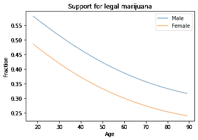
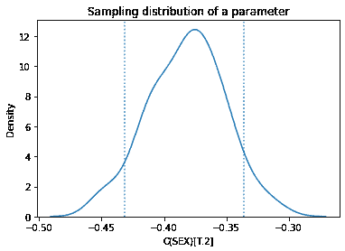
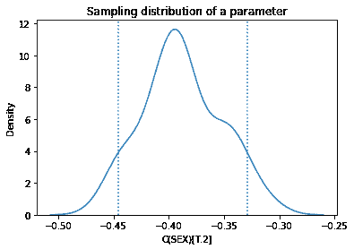

# 第十七章：重新采样和逻辑回归

> 原文：[`allendowney.github.io/ElementsOfDataScience/resample_logit.html`](https://allendowney.github.io/ElementsOfDataScience/resample_logit.html)
> 
> 译者：[飞龙](https://github.com/wizardforcel)
> 
> 协议：[CC BY-NC-SA 4.0](http://creativecommons.org/licenses/by-nc-sa/4.0/)


[单击此处在 Colab 上运行此笔记本](https://colab.research.google.com/github/AllenDowney/ElementsOfDataScience/blob/master/examples/resample_logit.ipynb)

计算抽样分布的不同方法以及从中得出的统计数据，如标准误差和置信区间，会产生不同的结果。它们没有对错之分；相反，它们基于不同的建模假设。在实践中，与其他误差来源相比，差异通常很小，因此我们可以自由选择任何方便的方法。

本文是由[Reddit](https://www.reddit.com/r/statistics/comments/10ayfm5/q_parametric_bootstrap_for_logistic_regression/)上最近的一个问题引发的：

> 我正在尝试对逻辑回归进行参数化自举，但我不知道随机误差项应该是什么。我知道如何对线性回归进行操作，因为误差项遵循正态分布。非常感谢任何关于这个主题的资源指针。

其中一位回答推荐了[这篇论文](https://www.scirp.org/journal/paperinformation.aspx?paperid=70962)：“逻辑回归模型中自举法的应用”，作者是 Isaac Akpor Adjei 和 Rezaul Karim。

该论文提出了通过自举抽样计算逻辑回归参数的抽样分布的两种方法。他们将其中一种表征为参数化的，另一种表征为非参数化的，并建议：

> 非参数化自举法依赖于对人口基础分布的较弱假设（或根本没有假设）。统计从业者应该仅在对人口基础分布的假设严重存疑时才使用非参数化程序。…然而，当假设没有被违反时，与相应的参数化程序相比，非参数化程序通常具有更大的方差（在点估计中），更低的功率（在假设检验中），更宽的区间（在置信区间估计中），更低的正确选择概率（在排名和选择中）和更高的风险（在决策理论中）（Efron and Tibshirani, 1994 [1]）。

这些建议的前提是，参数化和非参数化方法以不同的方式回答相同的问题，并且可能更喜欢其中一种，因为结果在某种方面更可取。它还基于这样的假设，即参数的抽样分布以及从中得出的统计数据是唯一和客观定义的。

我不同意这些前提。他们提出的参数化和非参数化方法是基于不同的建模决策，因此它们计算出对不同问题的答案。而且它们所基于的模型只是众多可能模型中的两种。

为了解释我的意思，我将实施他们提出的方法，并解释每种方法所基于的假设。然后我将提出第三种方法，这是两种方法的混合体。我将展示这三种方法产生不同的结果，并提出何时可能更喜欢其中一种的标准。

## 数据

作为一个例子，我将使用来自《通用社会调查》（GSS）的数据。我将从*数据科学要素*存储库中下载一个 HDF 文件，其中包含已经重新采样以纠正分层抽样的 GSS 数据子集。

```py
import pandas as pd
import numpy as np
import matplotlib.pyplot as plt
import seaborn as sns

np.random.seed(0) 
```

```py
from os.path import basename, exists

def download(url):
    filename = basename(url)
    if not exists(filename):
        from urllib.request import urlretrieve
        local, _ = urlretrieve(url, filename)
        print('Downloaded ' + local)

download('https://github.com/AllenDowney/' +
         'ElementsOfDataScience/raw/master/data/gss_eda.hdf') 
```

```py
gss = pd.read_hdf('gss_eda.hdf', 'gss')
gss.shape 
```

```py
(64814, 8) 
```

它包括 64,814 名受访者和每名受访者的 8 个变量。

```py
gss.head() 
```

|  | 年份 | ID_ | 年龄 | 教育 | 性别 | 枪支法 | 大麻 | 实际收入 |
| --- | --- | --- | --- | --- | --- | --- | --- | --- |
| 0 | 1972 | 1 | 23.0 | 16.0 | 2 | 1.0 | NaN | 18951.0 |
| 1 | 1972 | 2 | 70.0 | 10.0 | 1 | 1.0 | NaN | 24366.0 |
| 2 | 1972 | 3 | 48.0 | 12.0 | 2 | 1.0 | NaN | 24366.0 |
| 3 | 1972 | 4 | 27.0 | 17.0 | 2 | 1.0 | NaN | 30458.0 |
| 4 | 1972 | 5 | 61.0 | 12.0 | 2 | 1.0 | NaN | 50763.0 |

为了演示逻辑回归，我将使用[普遍社会调查](https://gssdataexplorer.norc.org/variables/285/vshow)中的一个问题，该问题问：“您认为大麻的使用应该合法化吗？”回答在名为`GRASS`的列中；以下是值。

```py
gss['GRASS'].value_counts() 
```

```py
2.0    25662
1.0    11884
Name: GRASS, dtype: int64 
```

我将使用 StatsModels，它提供了一个执行逻辑回归的函数。首先，我们必须重新编码因变量，使`1`表示“是”，`0`表示“否”。我们可以通过用`2`替换`0`来实现。

```py
gss['GRASS'].replace(2, 0, inplace=True) 
```

为了建模二次关系，我将添加包含`AGE`和`EDUC`的平方值的列。

```py
gss['AGE2'] = gss['AGE']**2
gss['EDUC2'] = gss['EDUC']**2 
```

我将删除具有我们需要的变量的缺失值的行。

```py
data = gss.dropna(subset=['AGE', 'EDUC', 'SEX', 'GUNLAW', 'GRASS']) 
```

## 逻辑回归

以下是具有这些变量的逻辑回归的结果。

```py
import statsmodels.formula.api as smf

formula = 'GRASS ~ AGE + AGE2 + EDUC + EDUC2 + C(SEX)'
result_hat = smf.logit(formula, data=data).fit()
result_hat.summary() 
```

```py
Optimization terminated successfully.
         Current function value: 0.593464
         Iterations 6 
```

逻辑回归结果

| 因变量： | GRASS | 观察次数： | 20475 |
| --- | --- | --- | --- |
| 模型： | 逻辑回归 | 残差 Df： | 20469 |
| 方法： | MLE | 模型 Df： | 5 |
| 日期： | 2023 年 1 月 17 日 | 伪 R-squ.： | 0.05003 |
| 时间： | 08:58:57 | 对数似然： | -12151. |
| 收敛： | 真 | LL-Null： | -12791. |
| 协方差类型： | 非鲁棒 | LLR p 值： | 1.555e-274 |
|  | 系数 | 标准误差 | z | P>&#124;z&#124; | [0.025 | 0.975] |
| 截距 | -1.6788 | 0.240 | -6.988 | 0.000 | -2.150 | -1.208 |
| C(SEX)[T.2] | -0.3849 | 0.031 | -12.394 | 0.000 | -0.446 | -0.324 |
| 年龄 | -0.0278 | 0.005 | -5.399 | 0.000 | -0.038 | -0.018 |
| AGE2 | 0.0001 | 5.28e-05 | 2.190 | 0.029 | 1.21e-05 | 0.000 |
| 教育 | 0.2000 | 0.031 | 6.412 | 0.000 | 0.139 | 0.261 |
| EDUC2 | -0.0029 | 0.001 | -2.450 | 0.014 | -0.005 | -0.001 |

为了了解结果的样子，我们可以绘制预测的“是”的概率作为年龄的函数，分别对男性和女性受访者。

```py
df = pd.DataFrame()
df['AGE'] = np.linspace(18, 89)
df['EDUC'] = 16

df['AGE2'] = df['AGE']**2
df['EDUC2'] = df['EDUC']**2

df['SEX'] = 1
pred1 = result_hat.predict(df)
pred1.index = df['AGE']

df['SEX'] = 2
pred2 = result_hat.predict(df)
pred2.index = df['AGE']

pred1.plot(label='Male', alpha=0.6)
pred2.plot(label='Female', alpha=0.6)

plt.xlabel('Age')
plt.ylabel('Fraction')
plt.title('Support for legal marijuana')
plt.legend(); 
```



男性比女性更有可能支持合法化，年轻人比年长者更有可能。

## 自举抽样

现在让我们实施被描述为非参数的方法，该方法基于自举重采样。以下函数用替换抽样`data`的行并在重采样数据上运行回归模型。

```py
options = dict(disp=False, start_params=result_hat.params) 

def bootstrap(i):
    bootstrapped = data.sample(n=len(data), replace=True)
    results = smf.logit(formula, data=bootstrapped).fit(**options)
    return results.params 
```

发送到'fit'的选项使其运行更快，但结果影响不大。

每次运行此过程，结果代表参数抽样分布的单次抽样。

```py
%timeit bootstrap(0) 
```

```py
82.2 ms ± 1.89 ms per loop (mean ± std. dev. of 7 runs, 10 loops each) 
```

通过多次运行它，我们从抽样分布中生成一个样本。`pqdm`在多个线程中运行抽样过程。

```py
try:
    from pqdm.threads import pqdm
except ImportError:
    !pip install pqdm
    from pqdm.threads import pqdm 
```

```py
estimates = pqdm(range(101), bootstrap, n_jobs=4)
sampling_dist = pd.DataFrame(estimates)
sampling_dist.head() 
```

|  | 截距 | C(SEX)[T.2] | 年龄 | 年龄 2 | 教育 | 教育 2 |
| --- | --- | --- | --- | --- | --- | --- |
| 0 | -1.747448 | -0.413202 | -0.027473 | 0.000114 | 0.213299 | -0.003302 |
| 1 | -2.055303 | -0.411384 | -0.029943 | 0.000129 | 0.276153 | -0.005563 |
| 2 | -2.050773 | -0.414960 | -0.023190 | 0.000094 | 0.242778 | -0.004530 |
| 3 | -2.031659 | -0.392391 | -0.029538 | 0.000147 | 0.251942 | -0.004616 |
| 4 | -1.847295 | -0.363829 | -0.031532 | 0.000156 | 0.238870 | -0.004339 |

这是其中一个参数的抽样分布的样子。

```py
ci90 = sampling_dist['C(SEX)[T.2]'].quantile([0.05, 0.95])
sns.kdeplot(sampling_dist['C(SEX)[T.2]'])
[plt.axvline(x, ls=':') for x in ci90]
plt.title('Sampling distribution of a parameter'); 
```


抽样分布的均值应该接近我们用原始数据集估计的参数，而且确实是这样。

```py
pd.DataFrame({"Sampling mean": sampling_dist.mean(), 
              "Estimates": result_hat.params}) 
```

|  | 抽样均值 | 估计 |
| --- | --- | --- |
| 截距 | -1.681880 | -1.678838 |
| C(SEX)[T.2] | -0.379621 | -0.384919 |
| 年龄 | -0.027804 | -0.027825 |
| AGE2 | 0.000115 | 0.000116 |
| 教育 | 0.201137 | 0.200002 |
| EDUC2 | -0.002912 | -0.002855 |

抽样分布的标准偏差应该接近 StatsModels 计算的标准误差，而且确实如此。它们中的大多数都足够接近，实际上差异可能并不重要。

```py
def standard_errors(sampling_dist, result_hat):
    df = pd.DataFrame({"Sampling std": sampling_dist.std(), 
                       "Standard error": result_hat.bse})
    num, den = df.values.T
    df['Percent diff'] = (num / den - 1) * 100
    return df 
```

```py
standard_errors(sampling_dist, result_hat) 
```

|  | 抽样标准差 | 标准误差 | 百分比差异 |
| --- | --- | --- | --- |
| 截距 | 0.248814 | 0.240243 | 3.567779 |
| C(SEX)[T.2] | 0.027137 | 0.031057 | -12.622418 |
| 年龄 | 0.004944 | 0.005153 | -4.066840 |
| 年龄 2 | 0.000051 | 0.000053 | -4.198399 |
| 教育 | 0.031756 | 0.031193 | 1.804886 |
| 教育 2 | 0.001197 | 0.001166 | 2.687507 |

当然，StatsModels 计算的标准误差并没有什么神奇之处；它们是基于抽样过程模型的近似值，就像重抽样的结果一样。

## 重抽样框架

抽样分布的目的是量化估计值由于随机抽样而产生的变异性。它是回答这个问题的答案：“如果我们多次运行这个抽样过程，我们期望结果会有多大变化？”

为了回答这个问题，我们需要一个抽样过程的模型。我们使用该模型来模拟抽样过程，并生成代表该过程可能生成的其他样本的反事实数据集。

以下图表示了这个框架。


在自助法重抽样中，我们将原始数据集的行视为总体，并从中抽取随机样本。我们使用这些模拟数据来计算样本统计量；在这个例子中，它是逻辑回归模型的参数。我们收集结果以形成抽样分布的样本，然后可以使用它来计算置信区间和标准误差。

这种模拟抽样过程的方式实际上是在询问，如果我们调查了不同的人会发生什么。但这并不是抽样过程的唯一可能模型。另一种可能是询问，如果我们调查了同样的人，但他们给出了不同的答案会发生什么。这就是参数化方法的基础模型。

## 参数化 bootstrap

那么，我们如何模拟这样一个抽样过程，即我们调查同样的人，但他们给出不同的答案？一种方法是假设，为了模拟的目的，我们从原始数据估计的参数是正确的。如果是这样，我们可以使用回归模型来计算每个受访者的预测概率，就像这样：

```py
pi_hat = result_hat.predict(data)
pi_hat.describe() 
```

```py
count    20475.000000
mean         0.317167
std          0.113654
min          0.025989
25%          0.234792
50%          0.317927
75%          0.400791
max          0.630366
dtype: float64 
```

现在我们可以使用这些概率为每个受访者生成一个有偏的硬币投掷。

```py
from scipy.stats import bernoulli

simulated = bernoulli.rvs(pi_hat.values)
simulated.mean() 
```

```py
0.3174114774114774 
```

然后我们可以用这些模拟值作为因变量运行回归模型。以下函数展示了如何做到这一点。

```py
def bootstrap2(i):
    flipped = data.assign(GRASS=bernoulli.rvs(pi_hat.values))
    results = smf.logit(formula, data=flipped).fit(**options)
    return results.params 
```

同样，单次模拟的结果是从抽样分布中随机抽取的值。

```py
bootstrap2(0) 
```

```py
Intercept     -1.805556
C(SEX)[T.2]   -0.352934
AGE           -0.023101
AGE2           0.000058
EDUC           0.196758
EDUC2         -0.002599
dtype: float64 
```

如果我们多次运行它，我们会得到抽样分布的一个样本。

```py
from pqdm.threads import pqdm

estimates = pqdm(range(101), bootstrap2, n_jobs=4) 
```

```py
sampling_dist2 = pd.DataFrame(estimates)
sampling_dist2.head() 
```

|  | 截距 | C(SEX)[T.2] | 年龄 | 年龄 2 | 教育 | 教育 2 |
| --- | --- | --- | --- | --- | --- | --- |
| 0 | -1.804015 | -0.384881 | -0.014708 | -0.000017 | 0.180796 | -0.002302 |
| 1 | -1.432664 | -0.422171 | -0.023207 | 0.000044 | 0.166255 | -0.001940 |
| 2 | -1.415658 | -0.406837 | -0.033815 | 0.000168 | 0.180158 | -0.001914 |
| 3 | -1.840253 | -0.394937 | -0.028435 | 0.000126 | 0.221295 | -0.003461 |
| 4 | -1.642430 | -0.375719 | -0.034946 | 0.000177 | 0.216985 | -0.003430 |

以下是单个参数的抽样分布。

```py
ci90 = sampling_dist2['C(SEX)[T.2]'].quantile([0.05, 0.95])
sns.kdeplot(sampling_dist2['C(SEX)[T.2]'])
[plt.axvline(x, ls=':') for x in ci90]
plt.title('Sampling distribution of a parameter'); 
```



标准偏差应该接近标准误差，而它们确实如此。

```py
standard_errors(sampling_dist2, result_hat) 
```

|  | 抽样标准差 | 标准误差 | 百分比差异 |
| --- | --- | --- | --- |
| 截距 | 0.199178 | 0.240243 | -17.092962 |
| C(SEX)[T.2] | 0.030494 | 0.031057 | -1.812430 |
| 年龄 | 0.005085 | 0.005153 | -1.327560 |
| 年龄 2 | 0.000054 | 0.000053 | 2.118557 |
| 教育 | 0.024899 | 0.031193 | -20.178173 |
| 教育 2 | 0.000935 | 0.001166 | -19.819110 |

因此，我们有两种产生不同抽样分布的抽样过程模型。但这并不是唯一的模型。

如果第一种方法问：“如果我们调查不同的人会怎样？”而第二种问：“如果我们调查同样的人，他们给出不同的答案会怎样？”，那么让我们考虑第三种方法，即问：“为什么不两者兼而有之？”。

## 混合模型

以下函数使用自助法抽样来模拟调查不同的人；然后使用参数化方法来模拟他们的回答。

```py
def bootstrap3(i):
    bootstrapped = data.sample(n=len(data), replace=True)
    pi_hat = result_hat.predict(bootstrapped)
    flipped = bootstrapped.assign(GRASS=bernoulli.rvs(pi_hat.values))
    results = smf.logit(formula, data=flipped).fit(**options)
    return results.params 
```

```py
bootstrap3(0) 
```

```py
Intercept     -1.655314
C(SEX)[T.2]   -0.386624
AGE           -0.024265
AGE2           0.000083
EDUC           0.182822
EDUC2         -0.002334
dtype: float64 
```

```py
from pqdm.threads import pqdm

estimates = pqdm(range(101), bootstrap3, n_jobs=4) 
```

```py
sampling_dist3 = pd.DataFrame(estimates)
sampling_dist3.head() 
```

|  | 截距 | C(SEX)[T.2] | 年龄 | 年龄 2 | 教育 | 教育 2 |
| --- | --- | --- | --- | --- | --- | --- |
| 0 | -2.019658 | -0.385612 | -0.025974 | 0.000108 | 0.249717 | -0.005012 |
| 1 | -1.648528 | -0.351063 | -0.025192 | 0.000100 | 0.182666 | -0.002312 |
| 2 | -1.780499 | -0.445770 | -0.032862 | 0.000173 | 0.242922 | -0.004569 |
| 3 | -1.534347 | -0.464670 | -0.029799 | 0.000125 | 0.189228 | -0.002218 |
| 4 | -1.336757 | -0.404636 | -0.030217 | 0.000137 | 0.160754 | -0.001453 |

这是一个参数的抽样分布。

```py
ci90 = sampling_dist3['C(SEX)[T.2]'].quantile([0.05, 0.95])
sns.kdeplot(sampling_dist3['C(SEX)[T.2]'])
[plt.axvline(x, ls=':') for x in ci90]
plt.title('Sampling distribution of a parameter'); 
```



同样，标准误与 StatsModels 计算的标准误相当。

```py
standard_errors(sampling_dist3, result_hat) 
```

|  | 抽样标准差 | 标准误 | 百分比差 |
| --- | --- | --- | --- |
| 截距 | 0.236901 | 0.240243 | -1.390859 |
| C(SEX)[T.2] | 0.035600 | 0.031057 | 14.629106 |
| 年龄 | 0.005769 | 0.005153 | 11.939358 |
| 年龄 2 | 0.000061 | 0.000053 | 15.337773 |
| 教育 | 0.031469 | 0.031193 | 0.884552 |
| 教育 2 | 0.001173 | 0.001166 | 0.613167 |

现在我们有四种计算抽样分布、置信区间和标准误的方法，它们得到了不同的结果。所以你可能会想…

## 哪一个是正确的？

它们都不正确。它们基于不同的抽样过程模型，因此量化了不同的不确定性来源。

在某些情况下，我们可能会发现不同的方法在某些假设下渐近地收敛于相同的结果。但这并不重要，因为对于有限的数据集，结果通常不相同。因此，重要的问题是这些差异是否足够重要。

在这个例子中，实现多个模型并比较结果很容易。如果它们有很大的不同，我们需要更仔细地思考它们基于的建模假设，并选择我们认为是最好的数据生成过程描述的模型。

但在这个例子中，差异很小，可能在实践中并不重要。因此，我们可以自由选择实现最容易的，或者计算最快的，或者在某些方面最方便的方法。

认为分析方法的结果是唯一正确的，而计算方法如重采样得到的结果是对其的近似，是一个常见的错误。分析方法通常计算速度快，但它们总是基于建模假设，通常是基于近似，因此它们并不比计算方法更正确。

版权所有 2023 年 Allen Downey

[署名-非商业性使用-相同方式共享 4.0 国际(CC BY-NC-SA 4.0)](https://creativecommons.org/licenses/by-nc-sa/4.0/)
