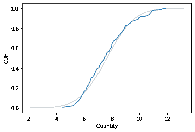
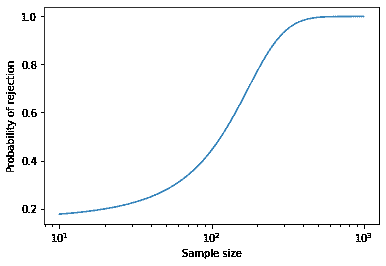

# 第十八章：永远不要测试正态性

> 原文：[`allendowney.github.io/ElementsOfDataScience/anderson.html`](https://allendowney.github.io/ElementsOfDataScience/anderson.html)
> 
> 译者：[飞龙](https://github.com/wizardforcel)
> 
> 协议：[CC BY-NC-SA 4.0](http://creativecommons.org/licenses/by-nc-sa/4.0/)


早在 2013 年，我写了[这篇博客文章](https://allendowney.blogspot.com/2013/08/are-my-data-normal.html)解释为什么你永远不应该使用统计测试来检查样本是否来自高斯分布。

我认为现实世界中的数据从来不是来自高斯分布，或者任何其他简单的数学模型，所以对于这个问题的答案总是否定的。

测试结果只有两种可能性：

+   如果你有足够的数据，测试将拒绝数据来自高斯分布的假设，或者

+   如果你没有足够的数据，测试将无法拒绝零假设。

无论如何，结果并没有告诉你任何有用的信息。

在这篇文章中，我将探讨一个特定的例子，并展示样本大小与测试结果之间的关系。我将再次得出结论，即

> 选择一个分布不是一个统计问题；这是一个建模决策。没有统计测试可以告诉你特定分布是否是你的数据的一个好模型。

[点击这里在 Colab 上运行这个笔记本](https://colab.research.google.com/github/AllenDowney/ElementsOfDataScience/blob/master/examples/anderson.ipynb)

```py
import pandas as pd
import numpy as np
import matplotlib.pyplot as plt
import seaborn as sns

np.random.seed(0) 
```

```py
try:
    import empiricaldist
except ImportError:
    !pip install empiricaldist 
```

我将首先生成一个实际来自对数正态分布的样本。

```py
from scipy.stats import norm

dist = norm(2, 0.2)
logs = dist.rvs(200)
sample = np.exp(logs) 
```

我将使用样本均值和标准差来制作样本的高斯模型。

```py
mu, sigma = sample.mean(), sample.std()

low, high = mu - 3.5*sigma, mu + 3.5*sigma
xs = np.linspace(low, high)
ys = norm.cdf(xs, mu, sigma) 
```

以下是样本的经验分布与高斯分布的 CDF 进行比较的样子。

```py
from empiricaldist import Cdf

plt.plot(xs, ys, color='gray', alpha=0.4)
Cdf.from_seq(sample).plot()
plt.xlabel('Quantity')
plt.ylabel('CDF'); 
```



看起来高斯分布是数据的一个相当好的模型，对于大多数目的来说可能已经足够好了。

让我们看看[Anderson-Darling 测试](https://docs.scipy.org/doc/scipy/reference/generated/scipy.stats.anderson.html)有什么说：

```py
from scipy.stats import anderson

statistic, critical_values, significance_level = anderson(sample)
statistic 
```

```py
1.7262363980891564 
```

```py
significance_level 
```

```py
array([15\. , 10\. ,  5\. ,  2.5,  1\. ]) 
```

```py
critical_values[2] 
```

```py
0.772 
```

A-D 统计量为 1.7，超过了临界值 0.77，因此在 5%的显著性水平下，我们可以拒绝这个样本来自高斯分布的假设。这是正确的答案，所以看起来我们已经做了一些有用的事情。但我们并没有。

## 样本大小

A-D 测试的结果取决于样本大小。为了演示，我将把测试包装在一个返回布尔值的函数中。

```py
def anderson_test(sample):
    statistic, critical_values, _ = anderson(sample)
    return statistic > critical_values[2] 
```

```py
anderson_test(sample) 
```

```py
True 
```

并将其包装在一个函数中，该函数接受一个分布和一个样本大小，生成一个样本，运行测试，并返回结果。

```py
def sample_and_test(dist, n):
    logs = dist.rvs(n)
    sample = np.exp(logs)
    return anderson_test(sample) 
```

现在让我们看看当我们改变样本大小时结果是什么样子的。

我将运行测试 1000 次，每次迭代后调整样本大小。如果测试拒绝零假设，我将减少样本大小约 4%；如果测试未能拒绝，我将增加样本大小约 4%。

这样样本大小就会随机游走，倾向于停留在拒绝零假设概率接近 50%的临界大小附近。

```py
n = 10
steps = norm(1.04, 0.01).rvs(1000)
res = []

for step in steps:
    result = sample_and_test(dist, int(n))
    res.append((result, n))
    if result:
        n /= step
    else:
        n *= step 
```

以下是前几个结果。

```py
data = pd.DataFrame(res, columns=['y', 'x'])
data['y'] = data['y'].astype(int)
data.head() 
```

|  | y | x |
| --- | --- | --- |
| 0 | 0 | 10.000000 |
| 1 | 0 | 10.363082 |
| 2 | 0 | 10.752798 |
| 3 | 0 | 11.301154 |
| 4 | 0 | 11.827253 |

现在我们可以使用逻辑回归来模拟拒绝零假设的概率作为样本大小的函数。

```py
import statsmodels.formula.api as smf

results = smf.logit('y ~ x', data=data).fit(disp=False)
results.params 
```

```py
Intercept   -1.684106
x            0.014555
dtype: float64 
```

以下是结果的样子（样本大小为对数轴）。

```py
from scipy.special import expit

b, a = results.params
ns = np.logspace(1, 3)
ps = expit(a * ns + b)

plt.plot(ns, ps)
plt.xlabel('Sample size')
plt.ylabel('Probability of rejection')
plt.xscale('log') 
```



当样本大小超过 200 时，拒绝的概率很高。当样本大小小于 100 时，拒绝的概率很低。但请注意，它并没有完全降到零，因为总是有 5%的假阳性的可能性。

我们可以使用逻辑模型的参数来计算临界值。

```py
from scipy.special import logit

b, a = results.params
n = (logit(0.5) - b) / a - b
n 
```

```py
117.39253624525765 
```

在这个样本大小下，拒绝零假设的概率接近 50%。

```py
outcomes = [sample_and_test(dist, int(n)) for i in range(1000)]
np.mean(outcomes) 
```

```py
0.483 
```

因此，结果只取决于样本大小。如果你有足够的数据，你会拒绝零假设；否则你可能不会。无论哪种方式，你都对你真正关心的问题一无所知，那就是高斯模型是否对你的目的来说是一个足够好的模型。

这是一个建模决策，没有统计检验可以帮助。在[原始文章](https://allendowney.blogspot.com/2013/08/are-my-data-normal.html)中，我提出了一些可能的方法。

版权所有 2023 年 Allen Downey

[署名-非商业性使用-相同方式共享 4.0 国际 (CC BY-NC-SA 4.0)](https://creativecommons.org/licenses/by-nc-sa/4.0/)
