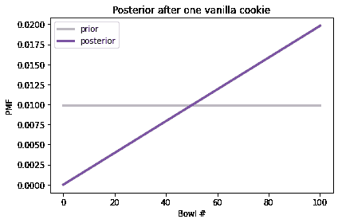
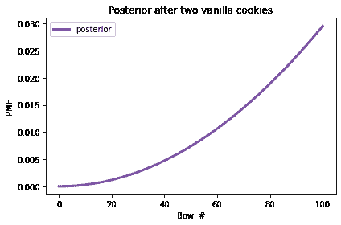
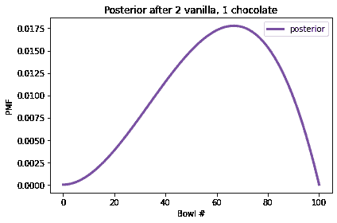

# 第三章：分布

> 原文：[`allendowney.github.io/ThinkBayes2/chap03.html`](https://allendowney.github.io/ThinkBayes2/chap03.html)
> 
> 译者：[飞龙](https://github.com/wizardforcel)
> 
> 协议：[CC BY-NC-SA 4.0](http://creativecommons.org/licenses/by-nc-sa/4.0/)


在上一章中，我们使用贝叶斯定理解决了一个饼干问题；然后我们再次使用贝叶斯表解决了这个问题。在本章中，冒昧地测试您的耐心，我们将再次使用`Pmf`对象解决这个问题，它代表了“概率质量函数”。我将解释这意味着什么，以及为什么它对贝叶斯统计学有用。

我们将使用`Pmf`对象来解决一些更具挑战性的问题，并朝着贝叶斯统计学迈出更大的一步。但我们将从分布开始。

## 分布

在统计学中，**分布**是一组可能的结果及其对应的概率。例如，如果你抛硬币，有两种可能的结果，概率大致相等。如果你掷一个六面骰子，可能的结果是 1 到 6 的数字，每个结果的概率是 1/6。

为了表示分布，我们将使用一个名为`empiricaldist`的库。一个“经验”分布是基于数据的，而不是理论分布。我们将在整本书中使用这个库。我将在本章介绍基本特性，以后我们将看到更多特性。

## 概率质量函数

如果分布中的结果是离散的，我们可以用**概率质量函数**或 PMF 来描述分布，它是一个将每个可能的结果映射到其概率的函数。

`empiricaldist`提供了一个名为`Pmf`的类，表示概率质量函数。要使用`Pmf`，可以像这样导入它：

```py
from empiricaldist import Pmf 
```

下面的例子制作了一个代表抛硬币结果的`Pmf`。

```py
coin = Pmf()
coin['heads'] = 1/2
coin['tails'] = 1/2
coin 
```

|  | probs |
| --- | --- |
| heads | 0.5 |
| tails | 0.5 |

`Pmf`创建一个没有结果的空`Pmf`。然后我们可以使用方括号运算符添加新的结果。在这个例子中，这两个结果用字符串表示，它们的概率相同，为 0.5。

您还可以从可能的结果的序列中制作一个`Pmf`。

下面的例子使用`Pmf.from_seq`制作了一个代表六面骰子的`Pmf`。

```py
die = Pmf.from_seq([1,2,3,4,5,6])
die 
```

|  | probs |
| --- | --- |
| 1 | 0.166667 |
| 2 | 0.166667 |
| 3 | 0.166667 |
| 4 | 0.166667 |
| 5 | 0.166667 |
| 6 | 0.166667 |

在这个例子中，序列中的所有结果都出现一次，因此它们的概率都相同，为$1/6$。

更一般地，结果可以出现多次，如下例所示：

```py
letters = Pmf.from_seq(list('Mississippi'))
letters 
```

|  | probs |
| --- | --- |
| M | 0.090909 |
| i | 0.363636 |
| p | 0.181818 |
| s | 0.363636 |

字母`M`在 11 个字符中出现一次，因此其概率为$1/11$。字母`i`出现 4 次，因此其概率为$4/11$。

由于字符串中的字母不是随机过程的结果，我将使用更一般的术语“数量”来表示`Pmf`中的字母。

`Pmf`类继承自 Pandas 的`Series`，因此您可以对`Pmf`对象执行`Series`可以执行的任何操作。

例如，您可以使用方括号运算符查找一个数量，并得到相应的概率。

```py
letters['s'] 
```

```py
0.36363636363636365 
```

在“密西西比”这个词中，大约 36%的字母是“s”。

但是，如果您要求一个不在分布中的数量的概率，您会得到一个`KeyError`。


```py
try:
    letters['t']
except KeyError as e:
    print(type(e)) 
```

```py
<class 'KeyError'> 
```

您还可以将`Pmf`作为函数调用，括号中是一个字母。

```py
letters('s') 
```

```py
0.36363636363636365 
```

如果数量在分布中，结果是相同的。但如果它不在分布中，结果是`0`，而不是错误。

```py
letters('t') 
```

```py
0 
```

用括号，您还可以提供一个数量的序列，并得到一个概率的序列。

```py
die([1,4,7]) 
```

```py
array([0.16666667, 0.16666667, 0\.        ]) 
```

`Pmf`中的数量可以是字符串、数字或任何其他可以存储在 Pandas `Series`索引中的类型。如果您熟悉 Pandas，这将有助于您处理`Pmf`对象。但我会在我们继续的过程中解释您需要了解的内容。

## 重新讨论饼干问题

在本节中，我将使用`Pmf`来解决<<_TheCookieProblem>>中的饼干问题。以下是问题的陈述：

> 假设有两个碗饼干。
> 
> +   碗 1 中有 30 块香草饼干和 10 块巧克力饼干。
> +   
> +   碗 2 中包含 20 块香草饼干和 20 块巧克力饼干。
> +   
> 现在假设你随机选择一个碗，不看的情况下随机选择一块饼干。如果饼干是香草味的，那么它来自碗 1 的概率是多少？

这是一个表示两个假设及其先验概率的`Pmf`：

```py
prior = Pmf.from_seq(['Bowl 1', 'Bowl 2'])
prior 
```

|  | 概率 |
| --- | --- |
| 碗 1 | 0.5 |
| 碗 2 | 0.5 |

这个分布包含了每个假设的先验概率，被称为（等待它）**先验分布**。

根据新数据（香草饼干）更新分布，我们将先验概率乘以可能性。从碗 1 抽取香草饼干的可能性是`3/4`。碗 2 的可能性是`1/2`。

```py
likelihood_vanilla = [0.75, 0.5]
posterior = prior * likelihood_vanilla
posterior 
```

|  | 概率 |
| --- | --- |
| 碗 1 | 0.375 |
| 碗 2 | 0.250 |

结果是未归一化的后验概率；也就是说，它们不加起来为 1。为了使它们加起来为 1，我们可以使用`normalize`，这是`Pmf`提供的一个方法。

```py
posterior.normalize() 
```

```py
0.625 
```

`normalize`的返回值是数据的总概率，即$5/8$。

`posterior`包含了每个假设的后验概率，被称为（现在等待它）**后验分布**。

```py
posterior 
```

|  | 概率 |
| --- | --- |
| 碗 1 | 0.6 |
| 碗 2 | 0.4 |

从后验分布中，我们可以选择碗 1 的后验概率：

```py
posterior('Bowl 1') 
```

```py
0.6 
```

答案是 0.6。

使用`Pmf`对象的一个好处是可以轻松地使用更多数据进行连续更新。例如，假设你把第一块饼干放回去（碗的内容不变），然后再次从同一个碗中抽取。如果第二块饼干也是香草味的，我们可以像这样进行第二次更新：

```py
posterior *= likelihood_vanilla
posterior.normalize()
posterior 
```

|  | 概率 |
| --- | --- |
| 碗 1 | 0.692308 |
| 碗 2 | 0.307692 |

现在碗 1 的后验概率几乎为 70%。但是假设我们再次做同样的事情，拿到了一块巧克力饼干。

以下是新数据的可能性：

```py
likelihood_chocolate = [0.25, 0.5] 
```

这是更新。

```py
posterior *= likelihood_chocolate
posterior.normalize()
posterior 
```

|  | 概率 |
| --- | --- |
| 碗 1 | 0.529412 |
| 碗 2 | 0.470588 |

现在碗 1 的后验概率约为 53%。经过两块香草饼干和一块巧克力饼干后，后验概率接近 50/50。

## 101 个碗

接下来让我们解决一个有 101 个碗的饼干问题：

+   碗 0 中包含 0%的香草饼干，

+   碗 1 中包含 1%的香草饼干，

+   碗 2 中包含 2%的香草饼干，

等等，一直到

+   碗 99 中包含 99%的香草饼干，

+   碗 100 中包含所有的香草饼干。

与之前版本一样，只有两种饼干，香草味和巧克力味。所以碗 0 是全巧克力饼干，碗 1 是 99%巧克力，依此类推。

假设我们随机选择一个碗，随机选择一块饼干，结果是香草味。对于每个$x$的值，饼干来自碗$x$的概率是多少？

为了解决这个问题，我将使用`np.arange`制作一个表示 101 个假设的数组，编号从 0 到 100。

```py
import numpy as np

hypos = np.arange(101) 
```

我们可以使用这个数组来制作先验分布：

```py
prior = Pmf(1, hypos)
prior.normalize() 
```

```py
101 
```

正如这个例子所示，我们可以用两个参数初始化一个`Pmf`。第一个参数是先验概率；第二个参数是一系列数量。

在这个例子中，概率都是相同的，所以我们只需要提供其中一个；它会在假设之间“广播”。由于所有假设的先验概率相同，这个分布是**均匀**的。

以下是前几个假设及其概率。

```py
prior.head() 
```

|  | 概率 |
| --- | --- |
| 0 | 0.009901 |
| 1 | 0.009901 |
| 2 | 0.009901 |

数据的可能性是每个碗中香草饼干的比例，我们可以使用`hypos`来计算：

```py
likelihood_vanilla = hypos/100
likelihood_vanilla[:5] 
```

```py
array([0\.  , 0.01, 0.02, 0.03, 0.04]) 
```

现在我们可以按照通常的方式计算后验分布：

```py
posterior1 = prior * likelihood_vanilla
posterior1.normalize()
posterior1.head() 
```

|  | 概率 |
| --- | --- |
| 0 | 0.000000 |
| 1 | 0.000198 |
| 2 | 0.000396 |

以下图显示了先验分布和一块香草饼干后的后验分布。


```py
from utils import decorate

def decorate_bowls(title):
    decorate(xlabel='Bowl #',
             ylabel='PMF',
             title=title) 
``` 显示代码单元格源代码 隐藏代码单元格源代码

```py
prior.plot(label='prior', color='C5')
posterior1.plot(label='posterior', color='C4')
decorate_bowls('Posterior after one vanilla cookie') 
``` 

Bowl 0 的后验概率是 0，因为它不含香草饼干。Bowl 100 的后验概率最高，因为它含有最多的香草饼干。在中间，后验分布的形状是一条线，因为似然性与碗的编号成比例。

现在假设我们把饼干放回去，再从同一个碗里拿出一个香草饼干。这是第二块饼干后的更新：

```py
posterior2 = posterior1 * likelihood_vanilla
posterior2.normalize() 
```

显示代码单元格输出 隐藏代码单元格输出

```py
0.6699999999999999 
```

这是后验分布的样子。

显示代码单元格源代码 隐藏代码单元格源代码

```py
posterior2.plot(label='posterior', color='C4')
decorate_bowls('Posterior after two vanilla cookies') 
``` 

两块香草饼干后，高编号的碗具有最高的后验概率，因为它们含有最多的香草饼干；低编号的碗具有最低的概率。

但是假设我们再次拿出一个巧克力饼干。这是更新后的情况：

```py
likelihood_chocolate = 1 - hypos/100

posterior3 = posterior2 * likelihood_chocolate
posterior3.normalize() 
```

显示代码单元格输出 隐藏代码单元格输出

```py
0.2462686567164179 
```

这是后验分布的样子。

显示代码单元格源代码 隐藏代码单元格源代码

```py
posterior3.plot(label='posterior', color='C4')
decorate_bowls('Posterior after 2 vanilla, 1 chocolate') 
``` 

现在 Bowl 100 已经被排除了，因为它不含巧克力饼干。但是高编号的碗仍然比低编号的碗更有可能，因为我们看到的香草饼干比巧克力饼干多。

事实上，后验分布的峰值在于 Bowl 67，这对应于我们观察到的数据中香草饼干的比例，$2/3$。

具有最高后验概率的数量被称为**MAP**，代表“最大后验概率”，其中“后验”是拉丁文中不必要的术语，表示“后验”。

要计算 MAP，我们可以使用`Series`方法`idxmax`：

```py
posterior3.idxmax() 
```

```py
67 
```

或者`Pmf`为相同的事情提供了一个更容易记住的名称：

```py
posterior3.max_prob() 
```

```py
67 
```

你可能会怀疑，这个例子并不是关于碗，而是关于估计比例。想象一下，你有一碗饼干。你不知道有多少比例的饼干是香草的，但你认为任何比例从 0 到 1 都是同样可能的。如果你拿出三块饼干，其中两块是香草的，你认为碗里的饼干比例是多少？我们刚刚计算的后验分布就是这个问题的答案。

我们将在下一章回到估计比例。但首先让我们使用`Pmf`来解决骰子问题。

## 骰子问题

在上一章中，我们使用贝叶斯表解决了骰子问题。以下是问题的陈述：

> 假设我有一个盒子，里面有一个 6 面骰子，一个 8 面骰子和一个 12 面骰子。我随机选择一个骰子，掷出来，然后报告结果是 1。我选择了 6 面骰子的概率是多少？

让我们使用`Pmf`来解决这个问题。我将使用整数来表示假设：

```py
hypos = [6, 8, 12] 
```

我们可以这样制作先验分布：

```py
prior = Pmf(1/3, hypos)
prior 
```

|  | 概率 |
| --- | --- |
| 6 | 0.333333 |
| 8 | 0.333333 |
| 12 | 0.333333 |

与前一个示例一样，先验概率被广播到了假设上。`Pmf`对象有两个属性：

+   `qs`包含了分布中的数量；

+   `ps`包含了相应的概率。

```py
prior.qs 
```

```py
array([ 6,  8, 12]) 
```

```py
prior.ps 
```

```py
array([0.33333333, 0.33333333, 0.33333333]) 
```

现在我们准备进行更新。以下是每个假设的数据的似然。

```py
likelihood1 = 1/6, 1/8, 1/12 
```

以下是更新。

```py
posterior = prior * likelihood1
posterior.normalize()
posterior 
```

|  | 概率 |
| --- | --- |
| 6 | 0.444444 |
| 8 | 0.333333 |
| 12 | 0.222222 |

6 面骰子的后验概率为$4/9$。

现在假设我再次掷同一个骰子，并得到了 7。以下是似然：

```py
likelihood2 = 0, 1/8, 1/12 
```

6 面骰子的似然是 0，因为在 6 面骰子上不可能得到 7。其他两个似然与上一次更新中的相同。

以下是更新：

```py
posterior *= likelihood2
posterior.normalize()
posterior 
```

|  | 概率 |
| --- | --- |
| 6 | 0.000000 |
| 8 | 0.692308 |
| 12 | 0.307692 |

在掷出 1 和 7 后，8 面骰子的后验概率约为 69%。

## 更新骰子

以下函数是上一节中更新的更一般版本：

```py
def update_dice(pmf, data):
  """Update pmf based on new data."""
    hypos = pmf.qs
    likelihood = 1 / hypos
    impossible = (data > hypos)
    likelihood[impossible] = 0
    pmf *= likelihood
    pmf.normalize() 
```

第一个参数是表示可能的骰子及其概率的`Pmf`。第二个参数是掷骰子的结果。

第一行从`Pmf`中选择了代表假设的数量。由于假设是整数，我们可以用它们来计算似然。一般来说，如果骰子有`n`面，那么任何可能结果的概率就是`1/n`。

但是，我们必须检查不可能的结果！如果结果超过了骰子的假设面数，那么该结果的概率就是 0。

`impossible`是一个布尔`Series`，对于每个不可能的结果都是`True`。我将其用作`likelihood`的索引，将相应的概率设置为 0。

最后，我将`pmf`乘以似然，并进行归一化。

以下是如何使用此函数来计算上一节中的更新。我从先验分布的新副本开始：

```py
pmf = prior.copy()
pmf 
```

|  | 概率 |
| --- | --- |
| 6 | 0.333333 |
| 8 | 0.333333 |
| 12 | 0.333333 |

并使用`update_dice`来进行更新。

```py
update_dice(pmf, 1)
update_dice(pmf, 7)
pmf 
```

|  | 概率 |
| --- | --- |
| 6 | 0.000000 |
| 8 | 0.692308 |
| 12 | 0.307692 |

结果是一样的。我们将在下一章中看到这个函数的一个版本。

## 总结

本章介绍了`empiricaldist`模块，它提供了`Pmf`，我们用它来表示一组假设及其概率。

`empiricaldist`基于 Pandas；`Pmf`类继承自 Pandas 的`Series`类，并提供了特定于概率质量函数的其他功能。我们将在整本书中使用`empiricaldist`中的`Pmf`和其他类，因为它们简化了代码并使其更易读。但我们也可以直接使用 Pandas 来做同样的事情。

我们使用`Pmf`来解决饼干问题和骰子问题，这些问题我们在上一章中看到了。使用`Pmf`可以很容易地对多个数据进行顺序更新。

我们还解决了一个更一般的饼干问题，有 101 个碗而不是两个。然后我们计算了 MAP，即具有最高后验概率的数量。

在下一章中，我将介绍欧洲问题，并使用二项分布。最后，我们将从使用贝叶斯定理转向进行贝叶斯统计。

但首先你可能想要做练习。

## 练习

**练习：**假设我有一个装有 6 面骰子、8 面骰子和 12 面骰子的盒子。我随机选择一个骰子，掷 4 次，并得到 1、3、5 和 7。我选择了 8 面骰子的概率是多少？

您可以使用`update_dice`函数或自行进行更新。


```py
# Solution

pmf = prior.copy()
for data in [1, 3, 5, 7]:
    update_dice(pmf, data)

pmf 
```

|  | 概率 |
| --- | --- |
| 6 | 0.000000 |
| 8 | 0.835052 |

| 12 | 0.164948 |

**练习：**在前一个版本的骰子问题中，先验概率是相同的，因为盒子里包含每种骰子。但是假设盒子里有 1 个 4 面骰子，2 个 6 面骰子，3 个 8 面骰子，4 个 12 面骰子和 5 个 20 面骰子。我选择一个骰子，掷出一个 7。我选择了一个 8 面骰子的概率是多少？

提示：要制作先验分布，请使用两个参数调用`Pmf`。


```py
# Solution

# Notice that I don't bother to normalize the prior.
# The `Pmf` gets normalized during the update, so we
# don't have to normalize it before.

ps = [1,2,3,4,5]
qs = [4,6,8,12,20]
pmf = Pmf(ps, qs)
update_dice(pmf, 7)
pmf 
```

|  | 概率 |
| --- | --- |
| 4 | 0.000000 |
| 6 | 0.000000 |
| 8 | 0.391304 |
| 12 | 0.347826 |

| 20 | 0.260870 |

**练习：**假设我有两个袜子抽屉。一个抽屉里有黑色和白色袜子的数量相同。另一个抽屉里有红色、绿色和蓝色袜子的数量相同。假设我随机选择一个抽屉，随机选择两只袜子，然后告诉你我拿到了一双相配的袜子。袜子是白色的概率是多少？

为简单起见，让我们假设两个抽屉里都有很多袜子，取出一只袜子对比例的变化可以忽略不计。


```py
# Solution

# In the BlackWhite drawer, the probability of getting a match is 1/2
# In the RedGreenBlue drawer, the probability of a match is 1/3

hypos = ['BlackWhite', 'RedGreenBlue']
prior = Pmf(1/2, hypos)
likelihood = 1/2, 1/3
posterior = prior * likelihood
posterior.normalize()
posterior 
```

|  | 概率 |
| --- | --- |
| 黑白 | 0.6 |

| 红绿蓝 | 0.4 | 

```py
# Solution

# If I drew from the BlackWhite drawer, the probability the
# socks are white is 1/2

posterior['BlackWhite'] / 2 
```

```py
0.30000000000000004 
```

**练习：**这是来自[贝叶斯数据分析](http://www.stat.columbia.edu/~gelman/book/)的一个问题：

> 埃尔维斯·普雷斯利有一个双胞胎兄弟（在出生时去世）。埃尔维斯是同卵双胞胎的概率是多少？

提示：1935 年，大约 2/3 的双胞胎是异卵的，1/3 是同卵的。


```py
# Solution

# The trick to this question is to notice that Elvis's twin was a brother.
# If they were identical twins, it is certain they would be the same sex.
# If they were fraternal twins, the likelihood is only 50%.

# Here's a solution using a Bayes table

import pandas as pd

table = pd.DataFrame(index=['identical', 'fraternal'])
table['prior'] = 1/3, 2/3
table['likelihood'] = 1, 1/2

table['unnorm'] = table['prior'] * table['likelihood']
prob_data = table['unnorm'].sum()

table['posterior'] = table['unnorm'] / prob_data
table 
```

|  | 先验 | 似然 | 未归一化 | 后验 |
| --- | --- | --- | --- | --- |
| 相同 | 0.333333 | 1.0 | 0.333333 | 0.5 |

| 异卵 | 0.666667 | 0.5 | 0.333333 | 0.5 | 

```py
# Solution

# Here's a solution using a Pmf

hypos = ['identical', 'fraternal']
prior = Pmf([1/3, 2/3], hypos)
prior 
```

|  | 概率 |
| --- | --- |
| 相同 | 0.333333 |

| 异卵 | 0.666667 | 

```py
# Solution

likelihood = 1, 1/2
posterior = prior * likelihood
posterior.normalize()
posterior 
```

|  | 概率 |
| --- | --- |
| 相同 | 0.5 |

| 异卵 | 0.5 |
