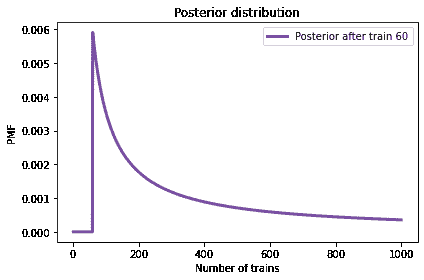
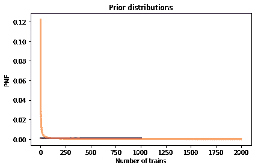
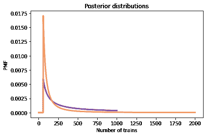
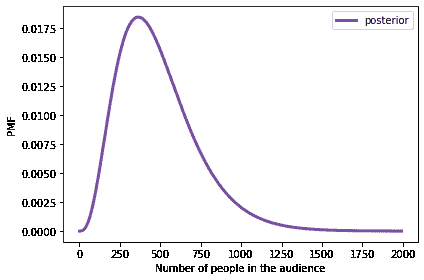
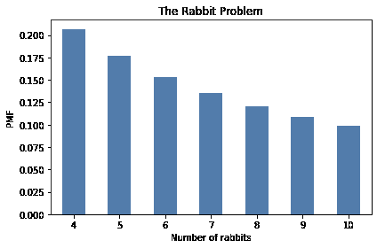
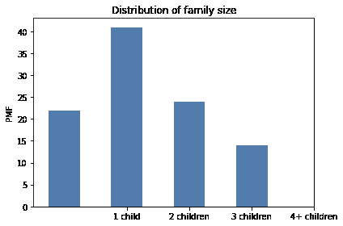

# 第五章：估计计数

> 原文：[`allendowney.github.io/ThinkBayes2/chap05.html`](https://allendowney.github.io/ThinkBayes2/chap05.html)
> 
> 译者：[飞龙](https://github.com/wizardforcel)
> 
> 协议：[CC BY-NC-SA 4.0](http://creativecommons.org/licenses/by-nc-sa/4.0/)


在前一章中，我们解决了涉及估计比例的问题。在欧元问题中，我们估计了硬币正面朝上的概率，在练习中，您估计了击球率、在税收上作假的人的比例以及击落入侵外星人的机会。

显然，其中一些问题比其他问题更现实，有些比其他问题更有用。

在本章中，我们将解决与计数或估计人口规模有关的问题。同样，一些例子看起来很愚蠢，但其中一些，比如德国坦克问题，有真正的应用，有时甚至是生死攸关的情况。

## 火车问题

我在 Frederick Mosteller 的[*Fifty Challenging Problems in Probability with Solutions*](https://store.doverpublications.com/0486653552.html)中找到了火车问题：

> “一个铁路公司按顺序给其火车编号为 1…N。有一天你看到一个编号为 60 的火车。估计铁路公司有多少火车。”

基于这一观察，我们知道铁路公司有 60 辆或更多的火车。但还有多少？为了应用贝叶斯推理，我们可以将这个问题分为两个步骤：

+   在我们看到数据之前，我们对$N$了解多少？

+   对于给定的$N$值，看到数据（编号为 60 的火车）的可能性有多大？

第一个问题的答案是先验。第二个问题的答案是可能性。

我们没有太多依据来选择先验，所以我们将从简单的开始，然后考虑其他选择。让我们假设$N$可能是 1 到 1000 之间的任何一个值。

这是先验分布：

```py
import numpy as np
from empiricaldist import Pmf

hypos = np.arange(1, 1001)
prior = Pmf(1, hypos) 
```

现在让我们来计算数据的可能性。在一个假设的$N$辆火车中，我们看到编号 60 的概率是多少？如果我们假设看到任何一辆火车的可能性是相等的，那么看到任何一辆火车的概率是$1/N$。

这是进行更新的函数：

```py
def update_train(pmf, data):
  """Update pmf based on new data."""
    hypos = pmf.qs
    likelihood = 1 / hypos
    impossible = (data > hypos)
    likelihood[impossible] = 0
    pmf *= likelihood
    pmf.normalize() 
```

这个函数可能看起来很熟悉；它与前一章中骰子问题的更新函数相同。在可能性方面，火车问题与骰子问题相同。

这是更新：

```py
data = 60
posterior = prior.copy()
update_train(posterior, data) 
```

这是后验的样子：

显示代码单元格源代码 隐藏代码单元格源代码

```py
from utils import decorate

posterior.plot(label='Posterior after train 60', color='C4')
decorate(xlabel='Number of trains',
         ylabel='PMF',
         title='Posterior distribution') 
``` 

毫不奇怪，所有小于 60 的$N$值都被排除了。

如果你必须猜的话，最有可能的值是 60。

```py
posterior.max_prob() 
```

```py
60 
```

这可能看起来不是一个很好的猜测；毕竟，你碰巧看到编号最高的火车的机会有多大呢？然而，如果你想最大化准确猜中答案的机会，你应该猜 60。

但也许这不是正确的目标。另一种方法是计算后验分布的均值。给定一组可能的数量$q_i$及其概率$p_i$，分布的均值为：

$$\mathrm{mean} = \sum_i p_i q_i$$

我们可以这样计算：

```py
np.sum(posterior.ps * posterior.qs) 
```

```py
333.41989326370776 
```

或者我们可以使用`Pmf`提供的方法：

```py
posterior.mean() 
```

```py
333.41989326370776 
```

后验的均值是 333，所以如果你想最小化误差，这可能是一个很好的猜测。如果您一遍又一遍地玩这个猜测游戏，使用后验的均值作为您的估计将在长期内最小化[均方误差](http://en.wikipedia.org/wiki/Minimum_mean_square_error)。

## 对先验的敏感性

我在上一节中使用的先验是从 1 到 1000 均匀分布的，但我没有为选择均匀分布或特定的上限提供理由。我们可能会想知道后验分布对先验的敏感性。由于数据很少——只有一个观察结果——它是敏感的。

这张表显示了当我们改变上限时会发生什么：

显示代码单元格源代码 隐藏代码单元格源代码

```py
import pandas as pd

df = pd.DataFrame(columns=['Posterior mean'])
df.index.name = 'Upper bound'

for high in [500, 1000, 2000]:
    hypos = np.arange(1, high+1)
    pmf = Pmf(1, hypos)
    update_train(pmf, data=60)
    df.loc[high] = pmf.mean()

df 
```

|  | 后验均值 |
| --- | --- |
| 上限 |  |
| --- | --- |
| 500 | 207.079228 |
| 1000 | 333.419893 |
| 2000 | 552.179017 |

随着上限的变化，后验均值会发生较大变化。这很糟糕。

当后验对先验敏感时，有两种处理方法：

+   获取更多数据。

+   获取更多背景信息并选择更好的先验。

有更多数据时，基于不同先验的后验分布往往会收敛。

例如，假设除了火车 60 之外，我们还看到火车 30 和 90。

当我们观察到三列火车时，后验均值如何取决于先验的上限：

显示代码单元格源代码 隐藏代码单元格源代码

```py
df = pd.DataFrame(columns=['Posterior mean'])
df.index.name = 'Upper bound'

dataset = [30, 60, 90]

for high in [500, 1000, 2000]:
    hypos = np.arange(1, high+1)
    pmf = Pmf(1, hypos)
    for data in dataset:
        update_train(pmf, data)
    df.loc[high] = pmf.mean()

df 
```

|  | 后验均值 |
| --- | --- |
| 上限 |  |
| --- | --- |
| 500 | 151.849588 |
| 1000 | 164.305586 |
| 2000 | 171.338181 |

差异较小，但显然三列火车不足以使后验收敛。

## 幂律先验

如果没有更多数据可用，另一个选择是通过收集更多背景信息来改进先验。假设一个拥有 1000 辆火车的火车运营公司和一个只有 1 辆火车的公司一样可能是不合理的。

通过一些努力，我们可能可以找到在观察区域内操作火车的公司名单。或者我们可以采访铁路运输专家，收集有关公司的典型规模的信息。

但即使不涉及铁路经济的具体情况，我们也可以做一些有根据的猜测。在大多数领域，有许多小公司，较少中等规模的公司，只有一两家非常大的公司。

事实上，公司规模的分布往往遵循幂律，正如 Robert Axtell 在《科学》中报道的那样（[`www.sciencemag.org/content/293/5536/1818.full.pdf`](http://www.sciencemag.org/content/293/5536/1818.full.pdf)）。

这个定律表明，如果有 1000 家公司拥有少于 10 辆火车，可能有 100 家公司拥有 100 辆火车，10 家公司拥有 1000 辆火车，可能有一家公司拥有 10000 辆火车。

从数学上讲，幂律意味着具有给定大小 N 的公司的数量与$(1/N)^{\alpha}$成比例，其中$\alpha$是通常接近 1 的参数。

我们可以构建这样的幂律先验：

```py
alpha = 1.0
ps = hypos**(-alpha)
power = Pmf(ps, hypos, name='power law')
power.normalize() 
```

显示代码单元格输出 隐藏代码单元格输出

```py
8.178368103610282 
```

为了比较，这里再次是均匀先验。

```py
hypos = np.arange(1, 1001)
uniform = Pmf(1, hypos, name='uniform')
uniform.normalize() 
```

```py
1000 
```

这是幂律先验的样子，与均匀先验相比：

显示代码单元格源代码 隐藏代码单元格源代码

```py
uniform.plot(color='C4')
power.plot(color='C1')

decorate(xlabel='Number of trains',
         ylabel='PMF',
         title='Prior distributions') 
``` 

这是两种先验的更新。

```py
dataset = [60]
update_train(uniform, dataset)
update_train(power, dataset) 
```

这里是后验分布。

显示代码单元格源代码 隐藏代码单元格源代码

```py
uniform.plot(color='C4')
power.plot(color='C1')

decorate(xlabel='Number of trains',
         ylabel='PMF',
         title='Posterior distributions') 
``` 

幂律给较高值较少的先验概率，这会产生较低的后验均值，并且对上限的敏感性较小。

当我们使用幂律先验并观察到三列火车时，后验均值如何取决于上限：

显示代码单元格源代码 隐藏代码单元格源代码

```py
df = pd.DataFrame(columns=['Posterior mean'])
df.index.name = 'Upper bound'

alpha = 1.0
dataset = [30, 60, 90]

for high in [500, 1000, 2000]:
    hypos = np.arange(1, high+1)
    ps = hypos**(-alpha)
    power = Pmf(ps, hypos)
    for data in dataset:
        update_train(power, data)
    df.loc[high] = power.mean()

df 
```

|  | 后验均值 |
| --- | --- |
| 上限 |  |
| --- | --- |
| 500 | 130.708470 |
| 1000 | 133.275231 |
| 2000 | 133.997463 |

现在差异要小得多。实际上，具有任意大的上限，均值收敛于 134。

因此，幂律先验更加现实，因为它基于有关公司规模的一般信息，并且在实践中表现更好。

## 可信区间

到目前为止，我们已经看到了两种总结后验分布的方法：具有最高后验概率的值（MAP）和后验均值。这两者都是**点估计**，即估计我们感兴趣的数量的单个值。

总结后验分布的另一种方法是使用百分位数。如果您参加过标准化测试，您可能熟悉百分位数。例如，如果您的分数是第 90 百分位数，这意味着您的表现与或优于参加测试的 90%的人。

如果我们给定一个值`x`，我们可以通过找到所有小于或等于`x`的值并加起它们的概率来计算它的**百分位数排名**。

`Pmf`提供了一个执行此计算的方法。因此，例如，我们可以计算公司拥有少于或等于 100 列火车的概率：

```py
power.prob_le(100) 
```

```py
0.2937469222495771 
```

使用幂律先验和三列火车的数据集，结果约为 29%。因此 100 列火车是第 29 百分位数。

另一方面，假设我们想计算特定的百分位数；例如，分布的中位数是第 50 百分位数。我们可以通过累加概率直到总和超过 0.5 来计算它。以下是一个执行此操作的函数：

```py
def quantile(pmf, prob):
  """Compute a quantile with the given prob."""
    total = 0
    for q, p in pmf.items():
        total += p
        if total >= prob:
            return q
    return np.nan 
```

循环使用`items`，它在分布中迭代数量和概率。在循环内，我们按顺序累加数量的概率。当总和等于或超过`prob`时，我们返回相应的数量。

这个函数被称为`quantile`，因为它计算的是分位数而不是百分位数。区别在于我们如何指定`prob`。如果`prob`是在 0 到 100 之间的百分比，我们称相应的数量为百分位数。如果`prob`是在 0 到 1 之间的概率，我们称相应的数量为**分位数**。

以下是我们如何使用此函数来计算后验分布的第 50 百分位数：

```py
quantile(power, 0.5) 
```

```py
113 
```

结果，113 列火车是后验分布的中位数。

`Pmf`提供了一个名为`quantile`的方法，执行相同的操作。我们可以这样调用它来计算第 5 和第 95 百分位数：

```py
power.quantile([0.05, 0.95]) 
```

```py
array([ 91., 243.]) 
```

结果是从 91 到 243 列火车的区间，这意味着：

+   火车数量少于或等于 91 的概率为 5%。

+   火车数量大于 243 的概率为 5%。

因此，火车数量在 91 到 243 之间的概率为 90%（不包括 91，包括 243）。因此，这个区间被称为 90%的**可信区间**。

`Pmf`还提供了`credible_interval`，它计算包含给定概率的区间。

```py
power.credible_interval(0.9) 
```

```py
array([ 91., 243.]) 
```

## 德国坦克问题

在第二次世界大战期间，美国驻伦敦大使馆的经济战部门使用统计分析来估计德国的坦克和其他装备的生产。

西方盟国已经获得了包括坦克的底盘和发动机序列号在内的日志簿、库存和维修记录。

对这些记录的分析表明，制造商和坦克类型按 100 个数字的块分配序列号，每个块中的数字按顺序使用，并且并非每个块中的所有数字都被使用。因此，在每个 100 个数字的块内，估计德国坦克生产的问题可以简化为一种火车问题。

基于这一观点，美国和英国的分析师得出的估计明显低于其他形式情报的估计。战后的记录表明，他们的估计明显更准确。

他们对轮胎、卡车、火箭和其他设备进行了类似的分析，得出了准确和可操作的经济情报。

德国坦克问题在历史上很有趣；它也是统计估计的现实应用的一个很好的例子。

有关这个问题的更多信息，请参见[维基百科页面](https://en.wikipedia.org/wiki/German_tank_problem)和 Ruggles 和 Brodie，“第二次世界大战中经济情报的实证方法”，*美国统计协会杂志*，1947 年 3 月，[可在此处找到](https://web.archive.org/web/20170123132042/https://www.cia.gov/library/readingroom/docs/CIA-RDP79R01001A001300010013-3.pdf)。

## 信息先验

在贝叶斯派中，选择先验分布有两种方法。有些人建议选择最能代表问题背景信息的先验；在这种情况下，先验被称为**信息性的**。使用信息性先验的问题在于人们可能拥有不同的信息或以不同方式解释它。因此，信息性先验可能看起来是任意的。

另一种选择是所谓的**无信息先验**，旨在尽可能不受限制，以便让数据自己说话。在某些情况下，您可以确定一个具有某些理想特性的唯一先验，比如代表所估计数量的最小先验信息。

无信息性先验很吸引人，因为它们似乎更客观。但我通常倾向于使用信息性先验。为什么？首先，贝叶斯分析总是基于建模决策。选择先验是这些决策之一，但不是唯一的决策，甚至可能不是最主观的决策。因此，即使无信息性先验更客观，整个分析仍然是主观的。

此外，对于大多数实际问题，您可能处于两种情况之一：要么您有大量数据，要么没有太多数据。如果您有大量数据，先验的选择并不重要；信息性和无信息性的先验几乎产生相同的结果。如果您没有太多数据，使用相关的背景信息（如幂律分布）会产生很大的影响。

如果像德国坦克问题一样，您必须根据结果做出生死决定，那么您可能应该使用您掌握的所有信息，而不是通过假装自己知道得比实际更少来维持客观性的幻觉。

## 总结

本章介绍了火车问题，它的似然函数与骰子问题相同，并且可以应用于德国坦克问题。在所有这些例子中，目标是估计数量或人口的大小。

在下一章中，我将介绍“赔率”作为概率的替代，以及贝叶斯定理的另一种形式贝叶斯规则。我们将计算总和和乘积的分布，并用它们来估计国会中腐败的成员数量，以及其他问题。

但首先，您可能想要解决这些练习。

## 练习

**练习：**假设您在一个大型讲堂上发表演讲，消防队员中断了，因为他们认为观众超过了 1200 人，这是房间的安全容量。

您认为人数少于 1200 人，并且您愿意证明这一点。数数太耗时，所以您尝试了一个实验：

+   您问有多少人是在 5 月 11 日出生的，有两个人举手。

+   您问有多少人是在 5 月 23 日出生的，有 1 个人举手。

+   最后，您问有多少人是在 8 月 1 日出生的，没有人举手。

观众有多少人？有超过 1200 人的概率是多少。提示：记住二项分布。


```py
# Solution

# I'll use a uniform prior from 1 to 2000
# (we'll see that the probability is small that there are
# more than 2000 people in the room)

hypos = np.arange(1, 2000, 10)
prior = Pmf(1, hypos)
prior.normalize() 
```

```py
200 
``` 

```py
# Solution

# We can use the binomial distribution to compute the probability
# of the data for each hypothetical audience size

from scipy.stats import binom

likelihood1 = binom.pmf(2, hypos, 1/365)
likelihood2 = binom.pmf(1, hypos, 1/365)
likelihood3 = binom.pmf(0, hypos, 1/365) 
``` 

```py
# Solution

# Here's the update

posterior = prior * likelihood1 * likelihood2 * likelihood3
posterior.normalize() 
```

```py
0.006758799800451805 
``` 

```py
# Solution

# And here's the posterior distribution

posterior.plot(color='C4', label='posterior')
decorate(xlabel='Number of people in the audience',
         ylabel='PMF') 
```



```py
# Solution

# If we have to guess the audience size,
# we might use the posterior mean

posterior.mean() 
```

```py
486.2255161687084 
``` 

```py
# Solution

# And we can use prob_gt to compute the probability
# of exceeding the capacity of the room.

# It's about 1%, which may or may not satisfy the fire marshal

posterior.prob_gt(1200) 
```

```py
0.011543092507699223 
```

**练习：**我经常在我家后面的花园里看到[兔子](https://en.wikipedia.org/wiki/Eastern_cottontail)，但很难分辨它们，所以我不知道有多少只兔子。

假设我部署了一个运动传感[照相陷阱](https://en.wikipedia.org/wiki/Camera_trap)，它每天都会拍摄它看到的第一只兔子。三天后，我比较了照片，得出两张照片是同一只兔子，另一张是不同的兔子。

有多少只兔子来到我的花园？

要回答这个问题，我们必须考虑先验分布和数据的可能性：

+   我有时一次看到四只兔子，所以我知道至少有那么多。如果有超过 10 只，我会感到惊讶。所以，至少作为一个起点，我认为从 4 到 10 的均匀先验是合理的。

+   为了简化问题，让我们假设访问我的花园的所有兔子在某一天被照相陷阱捕捉到的概率相等。我们还假设照相陷阱每天都能拍到一张照片。


```py
# Solution

hypos = np.arange(4, 11)
prior = Pmf(1, hypos) 
``` 

```py
# Solution

# The probability that the second rabbit is the same as the first is 1/N
# The probability that the third rabbit is different is (N-1)/N

N = hypos
likelihood = (N-1) / N**2 
``` 

```py
# Solution

posterior = prior * likelihood
posterior.normalize()

posterior.bar(alpha=0.7)
decorate(xlabel='Number of rabbits',
         ylabel='PMF',
         title='The Rabbit Problem') 
```



**练习：**假设在刑事司法系统中，所有监禁刑期为 1、2 或 3 年，每种刑期的数量相等。有一天，你去了一所监狱，随机选择了一个囚犯。他们服刑 3 年的概率是多少？你观察到的囚犯的平均剩余刑期是多少？


```py
# Solution

# Here's the prior distribution of sentences

hypos = np.arange(1, 4)
prior = Pmf(1/3, hypos)
prior 
```

|  | 概率 |
| --- | --- |
| 1 | 0.333333 |
| 2 | 0.333333 |

| 3 | 0.333333 | 

```py
# Solution

# If you visit a prison at a random point in time,
# the probability of observing any given prisoner
# is proportional to the duration of their sentence.

likelihood = hypos
posterior = prior * likelihood
posterior.normalize()
posterior 
```

|  | 概率 |
| --- | --- |
| 1 | 0.166667 |
| 2 | 0.333333 |

| 3 | 0.500000 | 

```py
# Solution

# The mean of the posterior is the average sentence.
# We can divide by 2 to get the average remaining sentence.

posterior.mean() / 2 
```

```py
1.1666666666666665 
```

**练习：**如果我在美国随机选择一个成年人，他们有兄弟姐妹的概率是多少？准确地说，他们的母亲至少有一个其他孩子的概率是多少。

[皮尤研究中心的这篇文章](https://www.pewsocialtrends.org/2015/05/07/family-size-among-mothers/)提供了一些相关数据。

从中，我提取了 2014 年 40-44 岁的美国母亲家庭规模的以下分布：


```py
import matplotlib.pyplot as plt

qs = [1, 2, 3, 4]
ps = [22, 41, 24, 14]
prior = Pmf(ps, qs)
prior.bar(alpha=0.7)

plt.xticks(qs, ['1 child', '2 children', '3 children', '4+ children'])
decorate(ylabel='PMF',
         title='Distribution of family size') 
```



为简单起见，让我们假设 4+类别中的所有家庭都恰好有 4 个孩子。


```py
# Solution

# When you choose a person a random, you are more likely to get someone
# from a bigger family; in fact, the chance of choosing someone from
# any given family is proportional to the number of children

likelihood = qs
posterior = prior * likelihood
posterior.normalize()
posterior 
```

|  | 概率 |
| --- | --- |
| 1 | 0.094828 |
| 2 | 0.353448 |
| 3 | 0.310345 |

| 4 | 0.241379 | 

```py
# Solution

# The probability that they have a sibling is the probability
# that they do not come from a family of 1 

1 - posterior[1] 
```

```py
0.9051724137931034 
``` 

```py
# Solution

# Or we could use prob_gt again

posterior.prob_gt(1) 
```

```py
0.9051724137931034 
```

**练习：**[末日论证](https://en.wikipedia.org/wiki/Doomsday_argument)是“一种概率论证，它声称可以根据迄今为止出生的人类总数的估计来预测未来人类的数量。”

假设宇宙中只有两种可能的智慧文明。"短寿"类型在出生 20 亿人后就灭绝了。"长寿"类型一直存活到出生 20 亿人后。假设这两种文明同样可能。你认为我们生活在哪种文明中？

末日论证称我们可以使用迄今为止出生的人类总数作为数据。根据[人口参考局](https://www.prb.org/howmanypeoplehaveeverlivedonearth/)，迄今为止出生的人总数约为 1080 亿。

由于你是最近出生的，让我们假设你实际上是第 1080 亿个人。如果$N$是将来会出生的总人数，我们认为你是随机选择的一个人，那么你可能是第 1 个人，也可能是第$N$个人，也可能是中间的任何一个数字。那么你成为第 1080 亿个人的概率是多少？

根据这些数据和可疑的先验，我们的文明将是短寿的概率是多少？


```py
# Solution

hypos = [200, 2000]
prior = Pmf(1, hypos) 
``` 

```py
# Solution

likelihood = 1/prior.qs
posterior = prior * likelihood
posterior.normalize()
posterior 
```

|  | 概率 |
| --- | --- |
| 200 | 0.909091 |

| 2000 | 0.090909 | 

```py
# Solution

# According to this analysis, the probability is about 91% that our 
# civilization will be short-lived. 
# But this conclusion is based on a dubious prior.

# And with so little data, the posterior depends strongly on the prior. 
# To see that, run this analysis again with a different prior, 
# and see what the results look like.

# What do you think of the Doomsday argument? 
```
