# 第八章：泊松过程

> 原文：[`allendowney.github.io/ThinkBayes2/chap08.html`](https://allendowney.github.io/ThinkBayes2/chap08.html)
> 
> 译者：[飞龙](https://github.com/wizardforcel)
> 
> 协议：[CC BY-NC-SA 4.0](http://creativecommons.org/licenses/by-nc-sa/4.0/)


本章介绍了[泊松过程](https://en.wikipedia.org/wiki/Poisson_point_process)，这是用来描述在随机间隔发生的事件的模型。作为泊松过程的一个例子，我们将对足球中的进球进行建模，这是美式英语中对其他人称为“足球”的比赛的称呼。我们将使用比赛中的进球数来估计泊松过程的参数；然后我们将使用后验分布来进行预测。

然后我们将解决世界杯问题。

## 世界杯问题

2018 年 FIFA 世界杯决赛中，法国以 4 比 2 击败克罗地亚。根据这个结果：

1.  我们应该对法国是更好的球队有多有信心？

1.  如果同样的球队再次比赛，法国再次获胜的机会是多少？

要回答这些问题，我们必须做出一些建模决策。

+   首先，我假设对于任何一支球队对抗另一支球队，都存在一些未知的进球率，以每场比赛的进球数来衡量，我将用 Python 变量`lam`或希腊字母$\lambda$来表示，发音为“lambda”。

+   其次，我假设在比赛的任何一分钟内进球的概率是相等的。因此，在一场 90 分钟的比赛中，任何一分钟进球的概率是$\lambda/90$。

+   第三，我假设一支球队在同一分钟内永远不会进两球。

当然，这些假设都不完全符合现实世界，但我认为它们是合理的简化。正如 George Box 所说的，“所有模型都是错误的；但有些是有用的。” ([`en.wikipedia.org/wiki/All_models_are_wrong`](https://en.wikipedia.org/wiki/All_models_are_wrong))。

在这种情况下，这个模型是有用的，因为如果这些假设至少在某种程度上是正确的，那么比赛中进球数遵循泊松分布，至少在某种程度上是正确的。

## 泊松分布

如果比赛中进球数遵循[泊松分布](https://en.wikipedia.org/wiki/Poisson_distribution)，进球率为$\lambda$，则进球$k$的概率是

$$\lambda^k \exp(-\lambda) ~/~ k!$$

对于任何非负的$k$值。

SciPy 提供了一个代表泊松分布的`poisson`对象。我们可以像这样创建一个$\lambda=1.4$的对象：

```py
from scipy.stats import poisson

lam = 1.4
dist = poisson(lam)
type(dist) 
```

```py
scipy.stats._distn_infrastructure.rv_frozen 
```

结果是一个代表“冻结”随机变量的对象，并提供`pmf`，用于评估泊松分布的概率质量函数。

```py
k = 4
dist.pmf(k) 
```

```py
0.039471954028253146 
```

这个结果意味着，如果平均进球率是每场比赛 1.4 个进球，那么在一场比赛中进 4 个进球的概率约为 4%。

我们将使用以下函数来创建一个代表泊松分布的`Pmf`。

```py
from empiricaldist import Pmf

def make_poisson_pmf(lam, qs):
  """Make a Pmf of a Poisson distribution."""
    ps = poisson(lam).pmf(qs)
    pmf = Pmf(ps, qs)
    pmf.normalize()
    return pmf 
```

`make_poisson_pmf`接受进球率`lam`和一个数量数组`qs`作为参数，它应该评估泊松 PMF。它返回一个`Pmf`对象。

例如，这是对于`lam=1.4`得分的分布，计算了从 0 到 9 的`k`值。

```py
import numpy as np

lam = 1.4
goals = np.arange(10)
pmf_goals = make_poisson_pmf(lam, goals) 
```

这就是它的样子。


```py
from utils import decorate

def decorate_goals(title=''):
    decorate(xlabel='Number of goals',
        ylabel='PMF',
        title=title) 
``` 显示代码单元格源代码 隐藏代码单元格源代码

```py
pmf_goals.bar(label=r'Poisson distribution with $\lambda=1.4/details>)

decorate_goals('Distribution of goals scored') 
``` 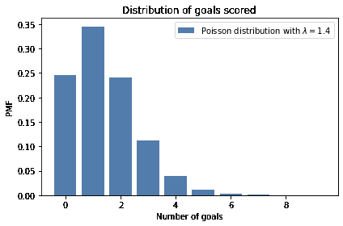

最可能的结果是 0、1 和 2；更高的值是可能的，但越来越不太可能。超过 7 的值是可以忽略的。这个分布表明，如果我们知道进球率，我们就可以预测进球数。

现在让我们换个角度来看：给定一个进球数，我们能说出关于进球率的什么？

要回答这个问题，我们需要考虑`lam`的先验分布，它表示在我们看到比分之前可能值及其概率的范围。

## 伽玛分布

如果你曾经看过一场足球比赛，你对 `lam` 有一些了解。在大多数比赛中，球队每场比赛都会进几个球。在罕见的情况下，一支球队可能进超过 5 个球，但他们几乎不会进超过 10 个球。

使用[以前世界杯的数据](https://www.statista.com/statistics/269031/goals-scored-per-game-at-the-fifa-world-cup-since-1930/)，我估计每支球队平均每场比赛进球约为 1.4 球。所以我将 `lam` 的平均值设为 1.4。

对于一支强队对阵一支弱队，我们期望 `lam` 更高；对于一支弱队对阵一支强队，我们期望它更低。

为了模拟进球率的分布，我将使用[伽玛分布](https://en.wikipedia.org/wiki/Gamma_distribution)，我之所以选择它是因为：

1.  进球率是连续的且非负的，伽玛分布适用于这种类型的数量。

1.  伽玛分布只有一个参数 `alpha`，即平均值。所以我们可以很容易地构造一个具有我们想要的平均值的伽玛分布。

1.  正如我们将看到的，伽玛分布的形状是一个合理的选择，考虑到我们对足球的了解。

还有一个原因，我将在 <<_ConjugatePriors>> 中透露。

SciPy 提供了 `gamma`，它创建了一个表示伽玛分布的对象。`gamma` 对象提供了 `pdf`，用于评估伽玛分布的**概率密度函数**（PDF）。

这是我们如何使用它的方式。

```py
from scipy.stats import gamma

alpha = 1.4
qs = np.linspace(0, 10, 101)
ps = gamma(alpha).pdf(qs) 
```

参数 `alpha` 是分布的平均值。`qs` 是 `lam` 在 0 到 10 之间的可能值。`ps` 是**概率密度**，我们可以将其视为未归一化的概率。

为了使它们归一化，我们可以将它们放入 `Pmf` 中并调用 `normalize`：

```py
from empiricaldist import Pmf

prior = Pmf(ps, qs)
prior.normalize() 
```

结果是伽玛分布的离散近似。看起来是这样的。

Show code cell content Hide code cell content

```py
def decorate_rate(title=''):
    decorate(xlabel='Goal scoring rate (lam)',
        ylabel='PMF',
        title=title) 
``` Show code cell source Hide code cell source

```py
prior.plot(ls='--', label='prior', color='C5')
decorate_rate(r'Prior distribution of $\lambda/details>) 
``` 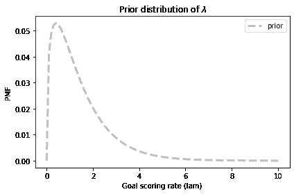

这个分布代表了我们对进球的先验知识：`lam` 通常小于 2，偶尔高达 6，很少会更高。

我们可以确认平均值约为 1.4。

Show code cell content Hide code cell content

```py
prior.mean() 
```

```py
1.4140818156118378 
```

像往常一样，对于先验的细节，有理智的人可能会有不同的看法，但这已经足够开始了。让我们进行一次更新。

## 更新

假设你已经知道了进球率 $\lambda$，并且被要求计算进 $k$ 球的概率。这正是我们通过计算泊松 PMF 来回答的问题。

例如，如果 $\lambda$ 是 1.4，那么在一场比赛中进 4 球的概率是：

```py
lam = 1.4
k = 4
poisson(lam).pmf(4) 
```

```py
0.039471954028253146 
```

现在假设我们有一个可能值数组 $\lambda$；我们可以计算每个 `lam` 的数据的可能性，就像这样：

```py
lams = prior.qs
k = 4
likelihood = poisson(lams).pmf(k) 
```

这就是我们需要做的更新。为了得到后验分布，我们将先验乘以我们刚刚计算的可能性，并将结果归一化。

以下函数封装了这些步骤。

```py
def update_poisson(pmf, data):
  """Update Pmf with a Poisson likelihood."""
    k = data
    lams = pmf.qs
    likelihood = poisson(lams).pmf(k)
    pmf *= likelihood
    pmf.normalize() 
```

第一个参数是先验；第二个是进球数。

在这个例子中，法国进了 4 个球，所以我将先验的副本并更新它与数据。

```py
france = prior.copy()
update_poisson(france, 4) 
```

这是后验分布的样子，以及先验。

Show code cell source Hide code cell source

```py
prior.plot(ls='--', label='prior', color='C5')
france.plot(label='France posterior', color='C3')

decorate_rate('Posterior distribution for France') 
``` 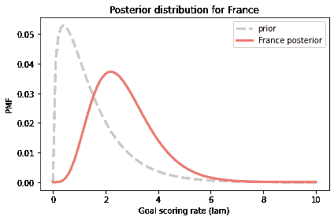

数据`k=4`使我们认为更高的`lam`值更可能，更低的值更不可能。因此后验分布向右移动。

让我们对克罗地亚也做同样的操作：

```py
croatia = prior.copy()
update_poisson(croatia, 2) 
```

这就是结果。

显示代码单元格源代码 隐藏代码单元格源代码

```py
prior.plot(ls='--', label='prior', color='C5')
croatia.plot(label='Croatia posterior', color='C0')

decorate_rate('Posterior distribution for Croatia') 
``` 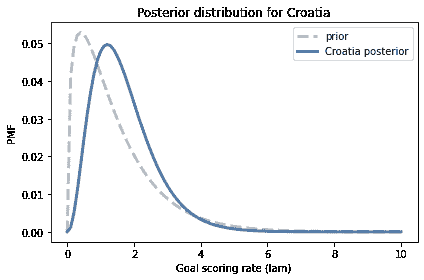

这是这些分布的后验均值。

```py
print(croatia.mean(), france.mean()) 
```

```py
1.6999765866755225 2.699772393342308 
```

先验分布的均值约为 1.4。克罗地亚进球 2 个后，他们的后验均值为 1.7，接近先验和数据的中点。同样，法国进球 4 个后，他们的后验均值为 2.7。

这些结果是贝叶斯更新的典型特征：后验分布的位置是先验和数据之间的折衷。

## 优势概率

现在我们对每支球队都有了一个后验分布，我们可以回答第一个问题：我们对法国更好的球队有多有信心？

在模型中，“更好”意味着对手的进球率更高。我们可以使用后验分布来计算从法国分布中抽取的随机值超过从克罗地亚分布中抽取的值的概率。

一种方法是枚举两个分布的所有值对，累加一个值超过另一个值的总概率。

```py
def prob_gt(pmf1, pmf2):
  """Compute the probability of superiority."""
    total = 0
    for q1, p1 in pmf1.items():
        for q2, p2 in pmf2.items():
            if q1 > q2:
                total += p1 * p2
    return total 
```

这类似于我们在<<_Addends>>中使用的方法来计算总和的分布。这是我们使用它的方式：

```py
prob_gt(france, croatia) 
```

```py
0.7499366290930155 
```

`Pmf`提供了一个执行相同操作的函数。

```py
Pmf.prob_gt(france, croatia) 
```

```py
0.7499366290930174 
```

结果略有不同，因为`Pmf.prob_gt`使用数组操作符而不是`for`循环。

无论哪种方式，结果都接近 75%。因此，基于一场比赛，我们有中等的信心认为法国实际上是更好的球队。

当然，我们应该记住，这个结果是基于进球率恒定的假设。实际上，如果一支球队落后一个进球，他们可能会在比赛结束时更积极地比赛，这使得他们更有可能得分，但也更有可能失去额外的进球。

和往常一样，结果只有模型一样好。

## 预测复赛

现在我们可以回答第二个问题：如果同样的球队再次比赛，克罗地亚获胜的机会有多大？为了回答这个问题，我们将生成“后验预测分布”，即我们期望一支球队得分的进球数。

如果我们知道进球率`lam`，进球的分布将是参数为`lam`的泊松分布。由于我们不知道`lam`，进球的分布是具有不同`lam`值的泊松分布的混合。

首先，我将生成一个`Pmf`对象的序列，每个值对应一个`lam`值。

```py
pmf_seq = [make_poisson_pmf(lam, goals) 
           for lam in prior.qs] 
```

以下图显示了这些分布在几个`lam`值下的情况。

显示代码单元格源代码 隐藏代码单元格源代码

```py
import matplotlib.pyplot as plt

for i, index in enumerate([10, 20, 30, 40]):
    plt.subplot(2, 2, i+1)
    lam = prior.qs[index]
    pmf = pmf_seq[index]
    pmf.bar(label=f'$\lambda$ = {lam}', color='C3')
    decorate_goals() 
``` 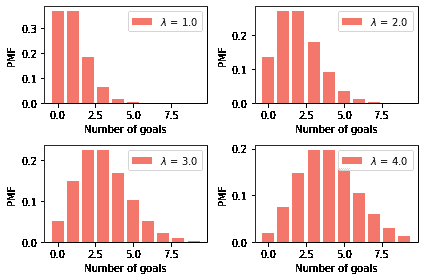

预测分布是这些`Pmf`对象的混合，根据后验概率加权。我们可以使用<<_GeneralMixtures>>中的`make_mixture`来计算这个混合。

```py
from utils import make_mixture

pred_france = make_mixture(france, pmf_seq) 
```

这是法国在复赛中进球数的预测分布。

显示代码单元格源代码 隐藏代码单元格源代码

```py
pred_france.bar(color='C3', label='France')
decorate_goals('Posterior predictive distribution') 
``` 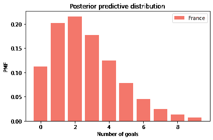

这个分布代表了两种不确定性：我们不知道`lam`的实际值，即使知道了，我们也不知道下一场比赛的进球数。

这是克罗地亚的预测分布。

```py
pred_croatia = make_mixture(croatia, pmf_seq) 
```


```py
pred_croatia.bar(color='C0', label='Croatia')
decorate_goals('Posterior predictive distribution') 
```

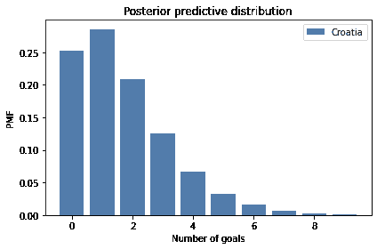

我们可以使用这些分布来计算法国赢得、输掉或打平复赛的概率。

```py
win = Pmf.prob_gt(pred_france, pred_croatia)
win 
```

```py
0.5703522415934519 
```

```py
lose = Pmf.prob_lt(pred_france, pred_croatia)
lose 
```

```py
0.26443376257235873 
```

```py
tie = Pmf.prob_eq(pred_france, pred_croatia)
tie 
```

```py
0.16521399583418947 
```

假设法国赢得一半的比赛，他们在复赛中获胜的机会约为 65%。

```py
win + tie/2 
```

```py
0.6529592395105466 
```

这比他们的优势概率低一点，为 75%。这是有道理的，因为我们对于单场比赛的结果不太确定，而对于进球率我们更有把握。即使法国是更好的球队，他们也可能输掉比赛。

## 指数分布

在本笔记本的最后一个练习中，你将有机会解决世界杯问题的以下变种：

> 在 2014 年 FIFA 世界杯中，德国在半决赛中与巴西对阵。德国在 11 分钟后进球，然后在 23 分钟处再次进球。在比赛的这一时刻，你预计德国在 90 分钟后会进多少球？他们进 5 个以上的球的概率是多少（事实上，他们确实进了）？

在这个版本中，请注意数据不是在固定时间段内的进球数，而是进球之间的时间。

要计算这样的数据的可能性，我们可以再次利用泊松过程的理论。如果每个团队都有一个恒定的进球率，我们期望进球之间的时间遵循[指数分布](https://en.wikipedia.org/wiki/Exponential_distribution)。

如果进球率是$\lambda$，那么在$t$时间间隔内看到进球的概率与指数分布的概率密度函数成正比：

$$\lambda \exp(-\lambda t)$$

因为$t$是一个连续的量，这个表达式的值不是概率；它是概率密度。然而，它与数据的概率成正比，所以我们可以将其用作贝叶斯更新中的似然。

SciPy 提供了`expon`，它创建了一个表示指数分布的对象。然而，它并没有像你期望的那样将`lam`作为参数，这使得它难以使用。由于指数分布的概率密度函数很容易计算，我将使用自己的函数。

```py
def expo_pdf(t, lam):
  """Compute the PDF of the exponential distribution."""
    return lam * np.exp(-lam * t) 
```

为了看看指数分布的样子，让我们再次假设`lam`为 1.4；我们可以这样计算$t$的分布：

```py
lam = 1.4
qs = np.linspace(0, 4, 101)
ps = expo_pdf(qs, lam)
pmf_time = Pmf(ps, qs)
pmf_time.normalize() 
```

```py
25.616650745459093 
```

这就是它的样子：


```py
def decorate_time(title=''):
    decorate(xlabel='Time between goals (games)',
             ylabel='PMF',
             title=title) 
``` 显示代码单元格源代码 隐藏代码单元格源代码

```py
pmf_time.plot(label='exponential with $\lambda$ = 1.4')

decorate_time('Distribution of time between goals') 
``` 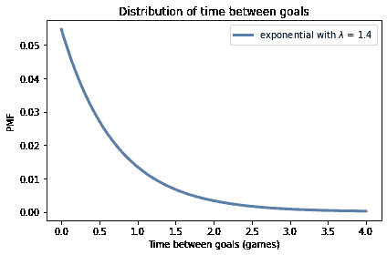

这是反直觉的，但事实上，最有可能进球的时间是立即。之后，每个连续时间间隔的概率都会略微降低。

以 1.4 的进球率来说，一个球队可能需要超过一场比赛来进球，但他们很少需要超过两场比赛。

## 总结

本章介绍了三种新的分布，因此很难将它们区分开来。让我们来回顾一下：

+   如果一个系统满足泊松模型的假设，那么在一段时间内的事件数量遵循泊松分布，这是一个从 0 到无穷大的整数数量的离散分布。在实践中，我们通常可以忽略有限限制之上的低概率数量。

+   同样在泊松模型下，事件之间的间隔遵循指数分布，这是一个从 0 到无穷大的连续分布。因为它是连续的，所以它由概率密度函数（PDF）描述，而不是概率质量函数（PMF）。但当我们使用指数分布来计算数据的可能性时，我们可以将密度视为未归一化的概率。

+   泊松分布和指数分布由事件率参数化，表示为$\lambda$或`lam`。

+   对于$\lambda$的先验分布，我使用了伽玛分布，这是一个从 0 到无穷大的连续分布，但我用一个离散的、有界的 PMF 来近似它。伽玛分布有一个参数，表示为$\alpha$或`alpha`，它也是它的均值。

我选择了伽玛分布，因为其形状与我们对进球率的背景知识一致。还有其他分布可以使用；然而，我们将在<<_ConjugatePriors>>中看到，伽玛分布可能是一个特别好的选择。

但在我们到达那里之前，我们还有一些事情要做，从这些练习开始。

## 练习

**练习：** 让我们完成我们开始的练习：

> 在 2014 年 FIFA 世界杯上，德国在半决赛中与巴西对阵。德国在 11 分钟后进球，然后在第 23 分钟再次进球。在比赛的那一刻，你期望德国在 90 分钟后进球多少个？他们有多大概率会再进 5 个球（事实上，他们确实进了）？

以下是我建议的步骤：

1.  从我们在上一个问题中使用的相同的伽玛先验开始，计算每个可能的`lam`值在 11 分钟后进球的可能性。不要忘记将所有时间转换为游戏而不是分钟。

1.  计算德国在第一个进球后`lam`的后验分布。

1.  计算再过 12 分钟后再进球的可能性并进行另一个更新。绘制先验、一个进球后的后验和两个进球后的后验。

1.  计算德国在比赛剩余时间内可能进球的后验预测分布，`90-23`分钟。注意：您将不得不考虑如何为比赛的一部分生成预测进球。

1.  计算在剩下的时间内进球 5 个或更多的概率。


```py
# Solution

# Here's a function that updates the distribution of lam
# with the given time between goals

def update_expo(pmf, data):
  """Update based on an observed interval

 pmf: prior PMF
 data: time between goals in minutes
 """
    t = data / 90
    lams = pmf.qs
    likelihood = expo_pdf(t, lams)
    pmf *= likelihood
    pmf.normalize() 
``` 

```py
# Solution

# Here are the updates for the first and second goals

germany = prior.copy()
update_expo(germany, 11)

germany2 = germany.copy()
update_expo(germany2, 12) 
``` 

```py
# Solution

# Here are the mean values of `lam` after each update

germany.mean(), germany2.mean() 
```

```py
(2.1358882653086892, 2.703059034926364) 
``` 

```py
# Solution

# Here's what the posterior distributions look like

prior.plot(ls='--', label='prior', color='C5')
germany.plot(color='C3', label='Posterior after 1 goal')
germany2.plot(color='C16', label='Posterior after 2 goals')

decorate_rate('Prior and posterior distributions') 
```

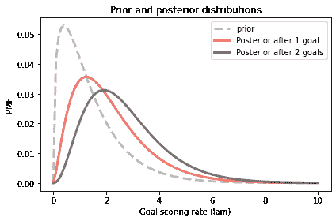

```py
# Solution

# Here's the predictive distribution for each possible value of `lam`

t = (90-23) / 90

pmf_seq = [make_poisson_pmf(lam*t, goals) 
           for lam in germany2.qs] 
``` 

```py
# Solution

# And here's the mixture of predictive distributions,
# weighted by the probabilities in the posterior distribution.

pred_germany2 = make_mixture(germany2, pmf_seq) 
``` 

```py
# Solution

# Here's what the predictive distribution looks like

pred_germany2.bar(color='C1', label='germany')
decorate_goals('Posterior predictive distribution') 
```

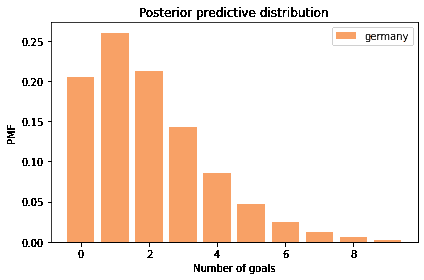

```py
# Solution

# Here's the probability of scoring exactly 5 more goals

pred_germany2[5] 
```

```py
0.047109658706113416 
``` 

```py
# Solution

# And the probability of 5 or more

pred_germany2.prob_ge(5) 
```

```py
0.09286200122834538 
```

**练习：**回到世界杯问题的第一个版本。假设法国和克罗地亚进行了一场复赛。法国率先得分的概率是多少？

提示：通过制作指数分布的混合来计算首个进球的后验预测分布。您可以使用以下函数制作近似指数分布的 PMF。


```py
def make_expo_pmf(lam, high):
  """Make a PMF of an exponential distribution.

 lam: event rate
 high: upper bound on the interval `t`

 returns: Pmf of the interval between events
 """
    qs = np.linspace(0, high, 101)
    ps = expo_pdf(qs, lam)
    pmf = Pmf(ps, qs)
    pmf.normalize()
    return pmf 
``` 

```py
# Solution

# Here are the predictive distributions for the 
# time until the first goal

pmf_seq = [make_expo_pmf(lam, high=4) for lam in prior.qs] 
``` 

```py
# Solution

# And here are the mixtures based on the two posterior distributions

pred_france = make_mixture(france, pmf_seq)
pred_croatia = make_mixture(croatia, pmf_seq) 
``` 

```py
# Solution

# Here's what the posterior predictive distributions look like

pred_france.plot(label='France', color='C3')
pred_croatia.plot(label='Croatia', color='C0')

decorate_time('Posterior predictive distribution') 
```

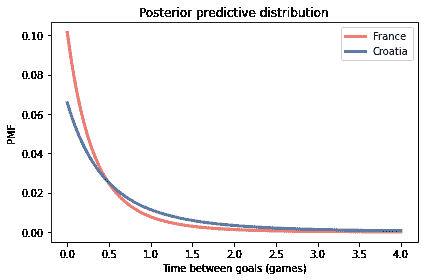

```py
# Solution

# And here's the probability France scores first

Pmf.prob_lt(pred_france, pred_croatia) 
```

```py
0.5904596116867543 
```

**练习：**在 2010-11 赛季的国家冰球联盟（NHL）总决赛中，我心爱的波士顿布鲁因队与令人厌恶的温哥华加人队进行了一场七场比赛的冠军系列赛。波士顿在前两场比赛中以 0-1 和 2-3 输掉了比赛，然后赢得了接下来的两场比赛，分别是 8-1 和 4-0。在系列赛的这一阶段，波士顿赢得下一场比赛的概率是多少，他们赢得冠军的概率又是多少？

为了选择先验分布，我从[`www.nhl.com`](http://www.nhl.com)获取了一些统计数据，具体是 2010-11 赛季每支球队的平均进球数。该分布很好地由均值为 2.8 的伽玛分布模拟。

你认为这些比赛的结果可能违反泊松模型的假设？这些违反会如何影响你的预测？


```py
# Solution

# When a team is winning or losing by an insurmountable margin,
# they might remove their best players from the game, which
# would affect their goal-scoring rate, violating the assumption
# that the goal scoring rate is constant.

# In this example, Boston won the third game 8-1, but scoring
# eight goals in a game might not reflect their true long-term
# goal-scoring rate.

# As a result, the analysis below might overestimate the chance
# that Boston wins.

# As it turned out, they did not. 
``` 

```py
# Solution

from scipy.stats import gamma

alpha = 2.8
qs = np.linspace(0, 15, 101)
ps = gamma.pdf(qs, alpha)
prior_hockey = Pmf(ps, qs)
prior_hockey.normalize() 
```

```py
6.666325137469514 
``` 

```py
# Solution

prior_hockey.plot(ls='--', color='C5')
decorate_rate('Prior distribution for hockey')
prior_hockey.mean() 
```

```py
2.7997400090376567 
```

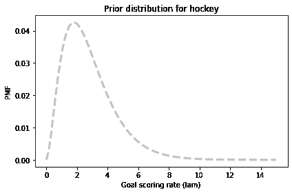

```py
# Solution

bruins = prior_hockey.copy()
for data in [0, 2, 8, 4]:
    update_poisson(bruins, data)

bruins.mean() 
```

```py
3.3599999999999985 
``` 

```py
# Solution

canucks = prior_hockey.copy()
for data in [1, 3, 1, 0]:
    update_poisson(canucks, data)

canucks.mean() 
```

```py
1.5599999606443666 
``` 

```py
# Solution

canucks.plot(label='Canucks')
bruins.plot(label='Bruins')

decorate_rate('Posterior distributions') 
```

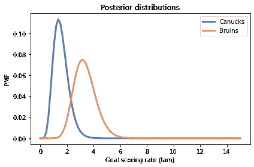

```py
# Solution

goals = np.arange(15)
pmf_seq = [make_poisson_pmf(lam, goals) for lam in bruins.qs] 
``` 

```py
# Solution

pred_bruins = make_mixture(bruins, pmf_seq)

pred_bruins.bar(label='Bruins', color='C1')
decorate_goals('Posterior predictive distribution') 
```


```py
# Solution

pred_canucks = make_mixture(canucks, pmf_seq)

pred_canucks.bar(label='Canucks')
decorate_goals('Posterior predictive distribution') 
```

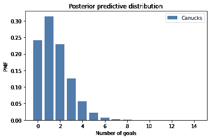

```py
# Solution

win = Pmf.prob_gt(pred_bruins, pred_canucks)
lose = Pmf.prob_lt(pred_bruins, pred_canucks)
tie = Pmf.prob_eq(pred_bruins, pred_canucks)

win, lose, tie 
```

```py
(0.7038631514645926, 0.16111690750716465, 0.1350199410282429) 
``` 

```py
# Solution

# Assuming the Bruins win half of the ties,
# their chance of winning the next game is...

p = win + tie/2
p 
```

```py
0.771373121978714 
``` 

```py
# Solution

# Their chance of winning the series is their
# chance of winning k=2 or k=3 of the remaining
# n=3 games.

from scipy.stats import binom

n = 3
a = binom.pmf([2,3], n, p)
a.sum() 
```

```py
0.8670900197850085 
```
