# 决策分析

> 原文：[`allendowney.github.io/ThinkBayes2/chap09.html`](https://allendowney.github.io/ThinkBayes2/chap09.html)

本章提出了一个受到电视游戏节目《价格是对的》启发的问题。这是一个愚蠢的例子，但它展示了一种称为贝叶斯[决策分析](https://en.wikipedia.org/wiki/Decision_analysis)的有用过程。

与以前的例子一样，我们将使用数据和先验分布来计算后验分布；然后我们将使用后验分布来选择一个涉及出价的游戏中的最佳策略。

作为解决方案的一部分，我们将使用核密度估计（KDE）来估计先验分布，并使用正态分布来计算数据的似然。

在本章的最后，我提出了一个相关的问题，你可以把它作为练习来解决。

## 价格就对了问题

2007 年 11 月 1 日，名为莱蒂亚和纳撒尼尔的参赛者出现在美国电视游戏节目《价格是对的》中。他们参加了一个名为“展示”的游戏，其目标是猜测一系列奖品的价格。离实际价格最接近且不超过的参赛者将赢得奖品。

纳撒尼尔先出手。他的展示包括一个洗碗机、一个酒柜、一个笔记本电脑和一辆汽车。他出价 26,000 美元。

莱蒂亚的展示包括一个弹球机、一个街机游戏、一个台球桌和巴哈马的一次巡游。她出价 21,500 美元。

纳撒尼尔的展示的实际价格是 25,347 美元。他的出价太高了，所以他输了。

莱蒂亚的展示的实际价格是 21,578 美元。

她只差了 78 美元，所以她赢得了她的展示，并且因为她的出价低于 250 美元，她还赢得了纳撒尼尔的展示。

对于一个贝叶斯思想家来说，这种情景提出了几个问题：

1.  在看到奖品之前，参赛者对展示的价格应该有什么先验信念？

1.  看到奖品后，参赛者应该如何更新这些信念？

1.  根据后验分布，参赛者应该出价多少？

第三个问题展示了贝叶斯方法的一个常见用途：决策分析。

这个问题是受到[一个例子](https://nbviewer.jupyter.org/github/CamDavidsonPilon/Probabilistic-Programming-and-Bayesian-Methods-for-Hackers/blob/master/Chapter5_LossFunctions/Ch5_LossFunctions_PyMC3.ipynb)的启发，该例子出自卡梅伦·戴维森-皮隆的书籍[*Probablistic Programming and Bayesian Methods for Hackers*](http://camdavidsonpilon.github.io/Probabilistic-Programming-and-Bayesian-Methods-for-Hackers)。

## 先验

为了选择价格的先验分布，我们可以利用以前节目的数据。幸运的是，[节目的粉丝们保留了详细的记录](https://web.archive.org/web/20121107204942/http://www.tpirsummaries.8m.com/)。

在这个例子中，我下载了包含 2011 年和 2012 年赛季每个展示的价格以及参赛者出价的文件。

以下函数读取数据并对其进行清理。

```py
import pandas as pd

def read_data(filename):
  """Read the showcase price data."""
    df = pd.read_csv(filename, index_col=0, skiprows=[1])
    return df.dropna().transpose() 
```

我将读取两个文件并将它们连接起来。

```py
df2011 = read_data('showcases.2011.csv')
df2012 = read_data('showcases.2012.csv')

df = pd.concat([df2011, df2012], ignore_index=True) 
```

<details class="hide above-input"><summary aria-label="Toggle hidden content">显示代码单元格内容 隐藏代码单元格内容</summary>

```py
print(df2011.shape, df2012.shape, df.shape) 
```

```py
(191, 6) (122, 6) (313, 6) 
```</details>

数据集如下所示：

```py
df.head(3) 
```

|  | 展示 1 | 展示 2 | 出价 1 | 出价 2 | 差额 1 | 差额 2 |
| --- | --- | --- | --- | --- | --- | --- |
| 0 | 50969.0 | 45429.0 | 42000.0 | 34000.0 | 8969.0 | 11429.0 |
| 1 | 21901.0 | 34061.0 | 14000.0 | 59900.0 | 7901.0 | -25839.0 |
| 2 | 32815.0 | 53186.0 | 32000.0 | 45000.0 | 815.0 | 8186.0 |

前两列“展示 1”和“展示 2”是以美元计的展示价值。接下来的两列是参赛者的出价。最后两列是实际价值和出价之间的差额。

## 核密度估计

这个数据集包含了 313 个以前展示的价格，我们可以把它看作是可能价格的样本。

我们可以使用这个样本来估计 Showcase 价格的先验分布。其中一种方法是核密度估计（KDE），它使用样本来估计平滑分布。如果你不熟悉 KDE，你可以[在这里阅读相关内容](https://mathisonian.github.io/kde)。

SciPy 提供了`gaussian_kde`，它接受一个样本并返回一个表示估计分布的对象。

以下函数接受`sample`，制作一个 KDE，对给定的一系列数量`qs`进行评估，并将结果作为归一化的 PMF 返回。

```py
from scipy.stats import gaussian_kde
from empiricaldist import Pmf

def kde_from_sample(sample, qs):
  """Make a kernel density estimate from a sample."""
    kde = gaussian_kde(sample)
    ps = kde(qs)
    pmf = Pmf(ps, qs)
    pmf.normalize()
    return pmf 
```

我们可以使用它来估计 Showcase 1 的值的分布：

```py
import numpy as np

qs = np.linspace(0, 80000, 81)
prior1 = kde_from_sample(df['Showcase 1'], qs) 
```

它看起来是这样的：

<details class="hide above-input"><summary aria-label="Toggle hidden content">显示代码单元格内容 隐藏代码单元格内容</summary>

```py
from utils import decorate

def decorate_value(title=''):
    decorate(xlabel='Showcase value ($)',
        ylabel='PMF',
        title=title) 
```</details> <details class="hide above-input"><summary aria-label="Toggle hidden content">显示代码单元格源代码 隐藏代码单元格源代码</summary>

```py
prior1.plot(label='Prior 1')
decorate_value('Prior distribution of showcase value') 
```</details> 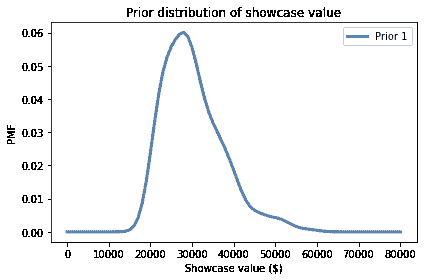

**练习：** 使用这个函数制作一个代表 Showcase 2 先验分布的`Pmf`，并绘制它。

<details class="hide above-input"><summary aria-label="Toggle hidden content">显示代码单元格内容 隐藏代码单元格内容</summary>

```py
# Solution

qs = np.linspace(0, 80000, 81)
prior2 = kde_from_sample(df['Showcase 2'], qs) 
```</details> <details class="hide above-input"><summary aria-label="Toggle hidden content">显示代码单元格内容 隐藏代码单元格内容</summary>

```py
# Solution

prior1.plot(label='Prior 1')
prior2.plot(label='Prior 2')

decorate_value('Prior distributions of showcase value') 
```

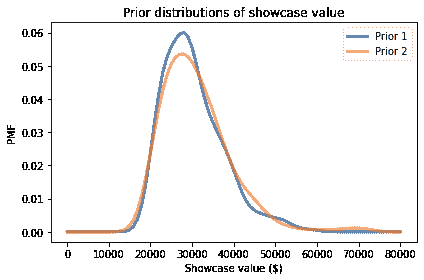</details>

## 误差的分布

要更新这些先验，我们必须回答这些问题：

+   我们应该考虑什么数据，以及如何量化它？

+   我们能计算一个似然函数吗？也就是说，对于每个假设的价格，我们能计算数据的条件似然性吗？

为了回答这些问题，我将把每个参赛者建模为一个具有已知误差特性的价格猜测工具。在这个模型中，当参赛者看到奖品时，他们猜测每个奖品的价格并将价格相加。让我们称这个总和为`guess`。

现在我们需要回答的问题是，“如果实际价格是`price`，那么参赛者的猜测是`guess`的可能性有多大？”

同样，如果我们定义`error = guess - price`，我们可以问，“参赛者的猜测偏离`error`的可能性有多大？”

为了回答这个问题，我将再次使用历史数据。对于数据集中的每个 Showcase，让我们看看参赛者出价和实际价格之间的差异：

```py
sample_diff1 = df['Bid 1'] - df['Showcase 1']
sample_diff2 = df['Bid 2'] - df['Showcase 2'] 
```

为了可视化这些差异的分布，我们可以再次使用 KDE。

```py
qs = np.linspace(-40000, 20000, 61)
kde_diff1 = kde_from_sample(sample_diff1, qs)
kde_diff2 = kde_from_sample(sample_diff2, qs) 
```

这些分布看起来是这样的：

<details class="hide above-input"><summary aria-label="Toggle hidden content">显示代码单元格源代码 隐藏代码单元格源代码</summary>

```py
kde_diff1.plot(label='Diff 1', color='C8')
kde_diff2.plot(label='Diff 2', color='C4')

decorate(xlabel='Difference in value ($)',
        ylabel='PMF',
        title='Difference between bid and actual value') 
```</details> 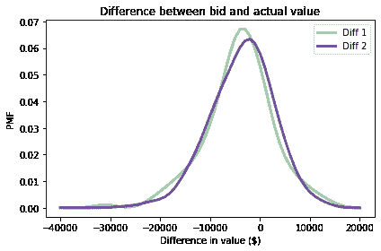

看起来出价太低的情况比出价太高的情况更常见，这是有道理的。请记住，在游戏规则下，如果你出价过高，你就会输掉比赛，所以参赛者可能会故意低估一定程度。

例如，如果他们猜测 Showcase 的价值是\$40,000，他们可能出价\$36,000 以避免超支。

看起来这些分布很好地符合正态分布，所以我们可以用它们的均值和标准差来总结它们。

例如，这是 Player 1 的`Diff`的均值和标准差。

```py
mean_diff1 = sample_diff1.mean()
std_diff1 = sample_diff1.std()

print(mean_diff1, std_diff1) 
```

```py
-4116.3961661341855 6899.909806377117 
```

现在我们可以使用这些差异来建模参赛者的误差分布。这一步有点棘手，因为我们实际上并不知道参赛者的猜测；我们只知道他们的出价。

所以我们必须做一些假设：

+   我假设参赛者之所以低估是因为他们在策略上，平均而言，他们的猜测是准确的。换句话说，他们的误差的均值是 0。

+   但我假设差异的扩散反映了它们误差的实际扩散。因此，我将使用差异的标准差作为它们误差的标准差。

基于这些假设，我将使用参数 0 和`std_diff1`创建一个正态分布。

SciPy 提供了一个名为`norm`的对象，表示具有给定均值和标准差的正态分布。

```py
from scipy.stats import norm

error_dist1 = norm(0, std_diff1) 
```

结果是一个对象，提供了`pdf`，用于评估正态分布的概率密度函数。

例如，这里是`error=-100`的概率密度，基于 Player 1 的误差分布。

```py
error = -100
error_dist1.pdf(error) 
```

```py
5.781240564008691e-05 
```

单独来看，这个数字并没有太多意义，因为概率密度不是概率。但它们与概率成比例，所以我们可以将它们用作贝叶斯更新中的可能性，正如我们将在下一节中看到的那样。

## 更新

假设你是 Player 1。你看到你的展示奖品，你猜测总价值为 23,000 美元。

根据你的猜测，我将从先前分布中的每个假设价格中减去；结果是你在每个假设下的误差。

```py
guess1 = 23000
error1 = guess1 - prior1.qs 
```

现在假设我们知道，基于过去的表现，你的估计误差很好地符合`error_dist1`。在这种假设下，我们可以计算每个假设下你的误差的可能性。

```py
likelihood1 = error_dist1.pdf(error1) 
```

结果是一个可能性数组，我们可以用它来更新先验。

```py
posterior1 = prior1 * likelihood1
posterior1.normalize() 
```

<details class="hide below-input"><summary aria-label="切换隐藏内容">显示代码单元格输出 隐藏代码单元格输出</summary>

```py
3.3889812097254624e-05 
```</details>

后验分布如下：

<details class="hide above-input"><summary aria-label="切换隐藏内容">显示代码单元格源代码 隐藏代码单元格源代码</summary>

```py
prior1.plot(color='C5', label='Prior 1')
posterior1.plot(color='C4', label='Posterior 1')

decorate_value('Prior and posterior distribution of showcase value') 
```</details> 

因为你的初始猜测在范围的较低端，后验分布已经向左移动。我们可以计算后验均值，看看移动了多少。

```py
prior1.mean(), posterior1.mean() 
```

```py
(30299.488817891375, 26192.024002392536) 
```

在看到奖品之前，你期望看到一个价值接近 30,000 美元的展示。在猜测 23,000 美元后，你更新了先验分布。根据先验和你的猜测的组合，你现在期望实际价格约为 26,000 美元。

**练习：**现在假设你是 Player 2。当你看到你的展示时，你猜测总价值为 38,000 美元。

使用`diff2`构建一个代表你估计误差分布的正态分布。

计算每个实际价格的你猜测的可能性，并用它来更新`prior2`。

绘制后验分布并计算后验均值。根据先验和你的猜测，你期望展示的实际价格是多少？

<details class="hide above-input"><summary aria-label="切换隐藏内容">显示代码单元格内容 隐藏代码单元格内容</summary>

```py
# Solution

mean_diff2 = sample_diff2.mean()
std_diff2 = sample_diff2.std()

print(mean_diff2, std_diff2) 
```

```py
-3675.891373801917 6886.260711323408 
```</details> <details class="hide above-input"><summary aria-label="切换隐藏内容">显示代码单元格内容 隐藏代码单元格内容</summary>

```py
# Solution

error_dist2 = norm(0, std_diff2) 
```</details> <details class="hide above-input"><summary aria-label="切换隐藏内容">显示代码单元格内容 隐藏代码单元格内容</summary>

```py
# Solution

guess2 = 38000
error2 = guess2 - prior2.qs

likelihood2 = error_dist2.pdf(error2) 
```</details> <details class="hide above-input"><summary aria-label="切换隐藏内容">显示代码单元格内容 隐藏代码单元格内容</summary>

```py
# Solution

posterior2 = prior2 * likelihood2
posterior2.normalize() 
```

```py
2.697812321910703e-05 
```</details> <details class="hide above-input"><summary aria-label="切换隐藏内容">显示代码单元格内容 隐藏代码单元格内容</summary>

```py
# Solution

prior2.plot(color='C5', label='Prior 2')
posterior2.plot(color='C15', label='Posterior 2')

decorate_value('Prior and posterior distribution of showcase value') 
```

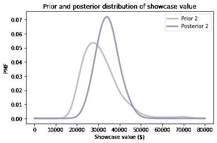</details><details class="hide above-input"><summary aria-label="切换隐藏内容">显示代码单元格内容 隐藏代码单元格内容</summary>

```py
# Solution

print(prior2.mean(), posterior2.mean()) 
```

```py
31047.62371912252 34305.20161642468 
```</details>

## 获胜的概率

现在我们对每个玩家都有了后验分布，让我们考虑一下策略。

首先，从玩家 1 的角度来看，让我们计算玩家 2 出价过高的概率。为了简单起见，我将只使用过去玩家的表现，忽略展示品的价值。

以下函数接受过去出价的序列，并返回出价过高的比例。

```py
def prob_overbid(sample_diff):
  """Compute the probability of an overbid."""
    return np.mean(sample_diff > 0) 
```

这是玩家 2 出价过高的估计。

```py
prob_overbid(sample_diff2) 
```

```py
0.29073482428115016 
```

现在假设玩家 1 低出了 5000 美元。玩家 2 低出的概率是多少？

以下函数使用过去的表现来估计玩家出价低于给定金额`diff`的概率：

```py
def prob_worse_than(diff, sample_diff):
  """Probability opponent diff is worse than given diff."""
    return np.mean(sample_diff < diff) 
```

这是玩家 2 低出 5000 美元以上的概率。

```py
prob_worse_than(-5000, sample_diff2) 
```

```py
0.38338658146964855 
```

这是他们低出 10000 美元以上的概率。

```py
prob_worse_than(-10000, sample_diff2) 
```

```py
0.14376996805111822 
```

我们可以结合这些函数来计算玩家 1 赢得比赛的概率，给定他们的出价与实际价格之间的差异：

```py
def compute_prob_win(diff, sample_diff):
  """Probability of winning for a given diff."""
    # if you overbid you lose
    if diff > 0:
        return 0

    # if the opponent overbids, you win
    p1 = prob_overbid(sample_diff)

    # or of their bid is worse than yours, you win
    p2 = prob_worse_than(diff, sample_diff)

    # p1 and p2 are mutually exclusive, so we can add them
    return p1 + p2 
```

这是你低出 5000 美元的情况下赢得比赛的概率。

```py
compute_prob_win(-5000, sample_diff2) 
```

```py
0.6741214057507987 
```

现在让我们看看一系列可能差异的赢得概率。

```py
xs = np.linspace(-30000, 5000, 121)
ys = [compute_prob_win(x, sample_diff2) 
      for x in xs] 
```

它看起来是这样的：

<details class="hide above-input"><summary aria-label="Toggle hidden content">显示代码单元格源代码 隐藏代码单元格源代码</summary>

```py
import matplotlib.pyplot as plt

plt.plot(xs, ys)

decorate(xlabel='Difference between bid and actual price ($)',
         ylabel='Probability of winning',
         title='Player 1') 
```</details> 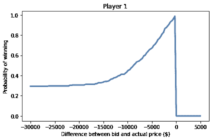

如果你低于 30000 美元，赢得比赛的机会约为 30%，这主要是你的对手出价过高的机会。

随着你的出价接近实际价格，你赢得比赛的机会接近 1。

当然，如果你出价过高，你就输了（即使你的对手也出价过高）。

**练习：** 从玩家 2 的角度运行相同的分析。使用来自玩家 1 的差异样本，计算：

1.  玩家 1 出价过高的概率。

1.  玩家 1 低出 5000 美元以上的概率。

1.  玩家 2 赢得比赛的概率，假设他们低出 5000 美元。

然后绘制玩家 2 赢得比赛的概率，以及他们的出价与实际价格之间可能的差异范围。

<details class="hide above-input"><summary aria-label="Toggle hidden content">显示代码单元格内容 隐藏代码单元格内容</summary>

```py
# Solution

prob_overbid(sample_diff1) 
```

```py
0.24600638977635783 
```</details> <details class="hide above-input"><summary aria-label="Toggle hidden content">显示代码单元格内容 隐藏代码单元格内容</summary>

```py
# Solution

prob_worse_than(-5000, sample_diff1) 
```

```py
0.3993610223642173 
```</details> <details class="hide above-input"><summary aria-label="Toggle hidden content">显示代码单元格内容 隐藏代码单元格内容</summary>

```py
# Solution

compute_prob_win(-5000, sample_diff1) 
```

```py
0.6453674121405751 
```</details> <details class="hide above-input"><summary aria-label="Toggle hidden content">显示代码单元格内容 隐藏代码单元格内容</summary>

```py
# Solution

xs = np.linspace(-30000, 5000, 121)
ys = [compute_prob_win(x, sample_diff1) for x in xs] 
```</details> <details class="hide above-input"><summary aria-label="Toggle hidden content">显示代码单元格内容 隐藏代码单元格内容</summary>

```py
# Solution

plt.plot(xs, ys)

decorate(xlabel='Difference between bid and actual price ($)',
         ylabel='Probability of winning',
         title='Player 2') 
```

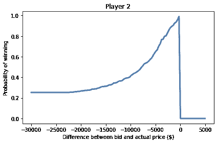</details>

## 决策分析

在前一节中，我们计算了在我们低出一定金额的情况下赢得比赛的概率。

实际上，参赛者不知道他们低出了多少，因为他们不知道实际价格。

但是他们确实有一个代表他们对实际价格的信念的后验分布，并且他们可以使用它来估计他们在给定出价下赢得比赛的概率。

以下函数接受可能的出价、实际价格的后验分布和对手差异的样本。

它循环遍历后验分布中的假设价格，并对每个价格进行计算，

1.  计算出价和假设价格之间的差异，

1.  计算玩家在给定差异情况下赢得比赛的概率，并

1.  将概率的加权和相加，其中权重是后验分布中的概率。

```py
def total_prob_win(bid, posterior, sample_diff):
  """Computes the total probability of winning with a given bid.

 bid: your bid
 posterior: Pmf of showcase value
 sample_diff: sequence of differences for the opponent

 returns: probability of winning
 """
    total = 0
    for price, prob in posterior.items():
        diff = bid - price
        total += prob * compute_prob_win(diff, sample_diff)
    return total 
```

这个循环实现了总概率法则：

$$P(win) = \sum_{price} P(price) ~ P(win ~|~ price)$$

这是基于 25,000 美元出价和后验分布`posterior1`的玩家 1 获胜的概率。

```py
total_prob_win(25000, posterior1, sample_diff2) 
```

```py
0.4842210945439812 
```

现在我们可以循环遍历一系列可能的出价，并计算每个出价的获胜概率。

```py
bids = posterior1.qs

probs = [total_prob_win(bid, posterior1, sample_diff2) 
         for bid in bids]

prob_win_series = pd.Series(probs, index=bids) 
```

这些是结果。

<details class="hide above-input"><summary aria-label="Toggle hidden content">显示代码单元格源代码 隐藏代码单元格源代码</summary>

```py
prob_win_series.plot(label='Player 1', color='C1')

decorate(xlabel='Bid ($)',
         ylabel='Probability of winning',
         title='Optimal bid: probability of winning') 
```</details> 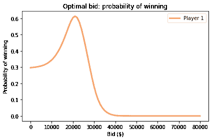

这是最大化玩家 1 获胜机会的出价。

```py
prob_win_series.idxmax() 
```

```py
21000.0 
```

```py
prob_win_series.max() 
```

```py
0.6136807192359474 
```

回想一下，你的猜测是\$23,000。使用你的猜测来计算后验分布，后验均值约为\$26,000。但是最大化获胜机会的出价是 21,000 美元。

**练习：**对玩家 2 进行相同的分析。

<details class="hide above-input"><summary aria-label="Toggle hidden content">显示代码单元格内容 隐藏代码单元格内容</summary>

```py
# Solution

bids = posterior2.qs

probs = [total_prob_win(bid, posterior2, sample_diff1) 
         for bid in bids]

prob_win_series = pd.Series(probs, index=bids) 
```</details> <details class="hide above-input"><summary aria-label="Toggle hidden content">显示代码单元格内容 隐藏代码单元格内容</summary>

```py
# Solution

prob_win_series.plot(label='Player 2', color='C1')

decorate(xlabel='Bid ($)',
         ylabel='Probability of winning',
         title='Optimal bid: probability of winning') 
```

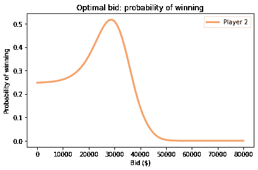</details><details class="hide above-input"><summary aria-label="Toggle hidden content">显示代码单元格内容 隐藏代码单元格内容</summary>

```py
# Solution

prob_win_series.idxmax() 
```

```py
29000.0 
```</details> <details class="hide above-input"><summary aria-label="Toggle hidden content">显示代码单元格内容 隐藏代码单元格内容</summary>

```py
# Solution

prob_win_series.max() 
```

```py
0.5171370053364229 
```</details>

## 最大化预期收益

在前一节中，我们计算了最大化获胜机会的出价。如果这是你的目标，我们计算的出价是最佳的。

但是获胜并不是一切。请记住，如果你的出价高出 250 美元或更少，你将赢得两个展示。因此，增加一点出价可能是个好主意：这会增加你超出出价并输掉的机会，但也会增加赢得两个展示的机会。

让我们看看结果如何。以下函数计算了平均而言，根据你的出价、实际价格和对手的误差样本，你将赢得多少。

```py
def compute_gain(bid, price, sample_diff):
  """Compute expected gain given a bid and actual price."""
    diff = bid - price
    prob = compute_prob_win(diff, sample_diff)

    # if you are within 250 dollars, you win both showcases
    if -250 <= diff <= 0:
        return 2 * price * prob
    else:
        return price * prob 
```

例如，如果实际价格是\$35000，你出价\$30000，平均而言你将赢得约 23,600 美元的奖品，考虑到你输掉的概率、赢得一个展示或赢得两个展示。

```py
compute_gain(30000, 35000, sample_diff2) 
```

```py
23594.249201277955 
```

实际上，我们不知道实际价格，但我们有一个代表我们对其了解的后验分布。通过对后验分布中的价格和概率进行平均，我们可以计算特定出价的预期收益。

在这种情况下，“预期”意味着可能的展示价值的平均值，按其概率加权。

```py
def expected_gain(bid, posterior, sample_diff):
  """Compute the expected gain of a given bid."""
    total = 0
    for price, prob in posterior.items():
        total += prob * compute_gain(bid, price, sample_diff)
    return total 
```

对于我们之前计算的后验，基于\$23,000 的猜测，出价\$21,000 的预期收益约为 16,900 美元。

```py
expected_gain(21000, posterior1, sample_diff2) 
```

```py
16923.59933856512 
```

但我们能做得更好吗？

要找出，我们可以循环遍历一系列出价，并找到最大化预期收益的出价。

```py
bids = posterior1.qs

gains = [expected_gain(bid, posterior1, sample_diff2) for bid in bids]

expected_gain_series = pd.Series(gains, index=bids) 
```

这些是结果。

<details class="hide above-input"><summary aria-label="Toggle hidden content">显示代码单元格源代码 隐藏代码单元格源代码</summary>

```py
expected_gain_series.plot(label='Player 1', color='C2')

decorate(xlabel='Bid ($)',
         ylabel='Expected gain ($)',
         title='Optimal bid: expected gain') 
```</details> 

这是最佳出价。

```py
expected_gain_series.idxmax() 
```

```py
22000.0 
```

使用该出价，预期收益约为 17,400 美元。

```py
expected_gain_series.max() 
```

```py
17384.899584430797 
```

回想一下，你的初始猜测是\$23,000。最大化获胜机会的出价是\$21,000。最大化你的预期收益的出价是 22,000 美元。

**练习：**对玩家 2 进行相同的分析。

<details class="hide above-input"><summary aria-label="Toggle hidden content">显示代码单元格内容 隐藏代码单元格内容</summary>

```py
# Solution

bids = posterior2.qs

gains = [expected_gain(bid, posterior2, sample_diff1) for bid in bids]

expected_gain_series = pd.Series(gains, index=bids) 
```</details> <details class="hide above-input"><summary aria-label="Toggle hidden content">显示代码单元格内容 隐藏代码单元格内容</summary>

```py
# Solution

expected_gain_series.plot(label='Player 2', color='C2')

decorate(xlabel='Bid ($)',
    ylabel='Expected gain ($)',
    title='Optimal bid: expected gain') 
```

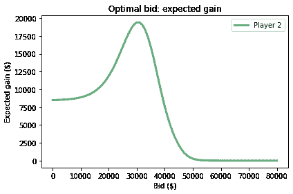</details><details class="hide above-input"><summary aria-label="Toggle hidden content">显示代码单元格内容隐藏代码单元格内容</summary>

```py
# Solution

expected_gain_series.idxmax() 
```

```py
30000.0 
```</details> <details class="hide above-input"><summary aria-label="Toggle hidden content">显示代码单元格内容隐藏代码单元格内容</summary>

```py
# Solution

expected_gain_series.max() 
```

```py
19404.164188501607 
```</details>

## 摘要

这一章节涉及的内容很多，让我们来回顾一下步骤：

1.  首先，我们使用 KDE 和过去节目的数据来估计展示价值的先验分布。

1.  然后我们使用过去节目的出价来建模误差分布为正态分布。

1.  我们使用误差分布进行贝叶斯更新，计算数据的可能性。

1.  我们使用后验分布来计算每个可能出价的获胜概率，并确定最大化获胜机会的出价。

1.  最后，我们使用获胜概率来计算每个可能出价的预期收益，并确定最大化预期收益的出价。

顺便说一句，这个例子展示了在不指定优化目标的情况下使用“最佳”一词的危险。最大化获胜机会的出价通常与最大化预期收益的出价不同。

## 讨论

当人们讨论贝叶斯估计的利弊时，与经典方法（有时称为“频率主义”）相对比，他们经常声称在许多情况下，贝叶斯方法和频率方法产生相同的结果。

在我看来，这种说法是错误的，因为贝叶斯和频率方法产生不同的*结果*种类：

+   频率方法的结果通常是一个被认为是最佳估计的单个值（根据几个标准之一），或者量化估计精度的区间。

+   贝叶斯方法的结果是一个代表所有可能结果及其概率的后验分布。

可以肯定地说，你可以使用后验分布来选择“最佳”估计或计算一个区间。在这种情况下，结果可能与频率估计相同。

但这样做会丢弃有用的信息，并且在我看来，消除了贝叶斯方法的主要优点：后验分布比单个估计甚至区间更有用。

本章的示例证明了这一点。使用整个后验分布，我们可以计算最大化获胜概率的出价，或者最大化预期收益的出价，即使计算收益的规则很复杂（且非线性）。

通过单个估计或区间，我们无法做到这一点，即使它们在某种意义上是“最佳的”。一般来说，频率估计对决策提供的指导很少。

如果你听到有人说贝叶斯和频率方法产生相同的结果，你可以确信他们不理解贝叶斯方法。

## 练习

**练习：**当我在马萨诸塞州剑桥工作时，我通常乘地铁到南站，然后乘通勤火车回 Needham。由于地铁不可预测，我会提前离开办公室，这样我可以等待多达 15 分钟，然后还能赶上通勤火车。

当我到达地铁站时，通常会有大约 10 个人在站台上等候。如果等待的人少于这个数字，我会认为我刚错过了一班火车，所以我预计会比平常等待更长时间。如果等待的人比这个数字多，我预计很快会有另一班火车。

但如果等待的乘客*远远*多于 10 人，我推断出出了问题，我预计会等很长时间。在这种情况下，我可能会离开并乘坐出租车。

我们可以使用贝叶斯决策分析来量化我直觉上做的分析。考虑到站台上的乘客数量，我们应该期待等待多长时间？什么时候应该放弃，乘坐出租车？

我对这个问题的分析在`redline.ipynb`中，它在这本书的存储库中。[单击此处在 Colab 上运行此笔记本](https://colab.research.google.com/github/AllenDowney/ThinkBayes2/blob/master/notebooks/redline.ipynb)。

**练习：**这个练习是由一个真实的故事启发的。2001 年，我创建了[Green Tea Press](https://greenteapress.com)来出版我的书，从*Think Python*开始。我从短期印刷商那里订购了 100 本书，并通过分销商开始销售这本书。

第一周之后，分销商报告说卖出了 12 本。根据这个报告，我认为我大约 8 周就会卖完，所以我准备好订购更多。我的印刷商给了我一个折扣，如果我订购超过 1000 本，所以我有点疯狂地订购了 2000 本。

几天后，我妈妈打电话告诉我她的这本书已经到了。我很惊讶，问了她有多少。她说有十本。

结果我只卖了两本书给非亲戚。而且卖出 2000 本书的时间比我预期的长得多。

这个故事的细节是独一无二的，但一般的问题几乎每个零售商都必须解决。根据过去的销售情况，你如何预测未来的销售情况？根据这些预测，你如何决定订购多少以及何时订购？

通常，一个错误决策的成本是复杂的。如果你分批下订单而不是一次性下大订单，你的成本可能会更高。如果你库存不足，你可能会失去顾客。如果你订购太多，你必须支付持有库存的各种成本。

所以，让我们解决我面临的问题的一个版本。设置问题需要一些工作；有关详细信息，请参阅本章的笔记本。

假设你开始在网上卖书。第一周你卖出 10 本（假设没有一个顾客是你的母亲）。第二周你卖出 9 本。

假设订单的到货是泊松过程，我们可以将每周的订单视为来自具有未知速率的泊松分布的样本。我们可以使用过去几周的订单来估计这个分布的参数，生成未来几周的预测分布，并计算最大化预期利润的订单大小。

+   假设印刷这本书的成本是每本 5 美元，

+   但如果你订购 100 本或更多，每本是 4.50 美元。

+   每卖出一本书，你就赚 10 美元。

+   但如果你在 8 周结束之前卖完了书，你将损失 50 美元的未来销售额。

+   如果你在 8 周结束时还有剩余的书，每多一本书你就会损失 2 美元的库存成本。

例如，假设你每周都有 10 本书的订单。如果你订购 60 本书，

+   总成本是 300 美元。

+   你卖掉了所有 60 本书，所以你赚了 600 美元。

+   但是这本书缺货两周，所以你将在未来销售中损失 100 美元。

总的来说，你的利润是 200 美元。

如果你订购 100 本书，

+   总成本是 450 美元。

+   你卖了 80 本书，所以你赚了 800 美元。

+   但是最后你还剩下 20 本书，所以你损失了 40 美元。

总的来说，你的利润是 310 美元。

结合这些成本和你的预测分布，你应该订购多少书才能最大化你的预期利润？

为了让你开始，以下函数根据问题的规范计算利润和成本：

<details class="hide above-input"> <summary aria-label="切换隐藏内容">显示代码单元格内容隐藏代码单元格内容</summary>

```py
def print_cost(printed):
  """Compute print costs.

 printed: integer number printed
 """
    if printed < 100:
        return printed * 5
    else:
        return printed * 4.5 
``` </ details> <details class="hide above-input"> <summary aria-label="切换隐藏内容">显示代码单元格内容隐藏代码单元格内容</summary>

```py
def total_income(printed, orders):
  """Compute income.

 printed: integer number printed
 orders: sequence of integer number of books ordered
 """
    sold = min(printed, np.sum(orders))
    return sold * 10 
``` </ details> <details class="hide above-input"> <summary aria-label="切换隐藏内容">显示代码单元格内容隐藏代码单元格内容</summary>

```py
def inventory_cost(printed, orders):
  """Compute inventory costs.

 printed: integer number printed
 orders: sequence of integer number of books ordered
 """
    excess = printed - np.sum(orders)
    if excess > 0:
        return excess * 2
    else:
        return 0 
``` </ details> <details class="hide above-input"> <summary aria-label="切换隐藏内容">显示代码单元格内容隐藏代码单元格内容</summary>

```py
def out_of_stock_cost(printed, orders):
  """Compute out of stock costs.

 printed: integer number printed
 orders: sequence of integer number of books ordered
 """
    weeks = len(orders)
    total_orders = np.cumsum(orders)
    for i, total in enumerate(total_orders):
        if total > printed:
            return (weeks-i) * 50
    return 0 
```</details> <details class="hide above-input"><summary aria-label="Toggle hidden content">显示代码单元格内容 隐藏代码单元格内容</summary>

```py
def compute_profit(printed, orders):
  """Compute profit.

 printed: integer number printed
 orders: sequence of integer number of books ordered
 """
    return (total_income(printed, orders) -
            print_cost(printed)-
            out_of_stock_cost(printed, orders) -
            inventory_cost(printed, orders)) 
```</details>

为了测试这些函数，假设我们每周确切地获得 10 个订单，持续 8 周：

<details class="hide above-input"><summary aria-label="Toggle hidden content">显示代码单元格内容 隐藏代码单元格内容</summary>

```py
always_10 = [10] * 8
always_10 
```

```py
[10, 10, 10, 10, 10, 10, 10, 10] 
```</details>

如果你打印 60 本书，你的净利润是 200 美元，就像例子中一样。

<details class="hide above-input"><summary aria-label="Toggle hidden content">显示代码单元格内容 隐藏代码单元格内容</summary>

```py
compute_profit(60, always_10) 
```

```py
200 
```</details>

如果你打印 100 本书，你的净利润是 310 美元。

<details class="hide above-input"><summary aria-label="Toggle hidden content">显示代码单元格内容 隐藏代码单元格内容</summary>

```py
compute_profit(100, always_10) 
```

```py
310.0 
```</details>

当然，在问题的背景下，你不知道每周会订购多少书。你甚至不知道订单的平均速率。但是，根据数据和对先验的一些假设，你可以计算订单速率的分布。

你将有机会这样做，但为了演示问题的决策分析部分，我将从一个任意的假设开始，即订单速率来自均值为 9 的伽马分布。

这是一个代表这个分布的`Pmf`。

<details class="hide above-input"><summary aria-label="Toggle hidden content">显示代码单元格内容 隐藏代码单元格内容</summary>

```py
from scipy.stats import gamma

alpha = 9
qs = np.linspace(0, 25, 101)
ps = gamma.pdf(qs, alpha)
pmf = Pmf(ps, qs)
pmf.normalize()
pmf.mean() 
```

```py
8.998788382371902 
```</details>

这是它的样子：

<details class="hide above-input"><summary aria-label="Toggle hidden content">显示代码单元格内容 隐藏代码单元格内容</summary>

```py
pmf.plot(color='C1')
decorate(xlabel=r'Book ordering rate ($\lambda$)',
        ylabel='PMF') 
```

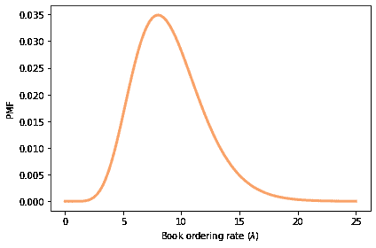</details>

现在，我们*可以*生成给定周内订购书籍数量的预测分布，但在这个例子中，我们必须处理一个复杂的成本函数。特别是，`out_of_stock_cost`取决于订单的顺序。

因此，我们建议不是生成预测分布，而是运行模拟。我将演示这些步骤。

首先，从我们的假设速率分布中，我们可以随机抽取 1000 个值。

<details class="hide above-input"><summary aria-label="Toggle hidden content">显示代码单元格内容 隐藏代码单元格内容</summary>

```py
rates = pmf.choice(1000)
np.mean(rates) 
```

```py
8.906 
```</details>

对于每个可能的速率，我们可以生成一个 8 个订单的序列。

<details class="hide above-input"><summary aria-label="Toggle hidden content">显示代码单元格内容 隐藏代码单元格内容</summary>

```py
np.random.seed(17)
order_array = np.random.poisson(rates, size=(8, 1000)).transpose()
order_array[:5, :] 
```

```py
array([[ 8,  2,  7,  8,  9,  9, 11, 12],
       [ 5,  3,  5,  4,  3,  9,  4,  4],
       [11, 11,  8,  3,  8,  7,  8,  5],
       [ 6,  5,  9,  6,  9,  9, 12,  6],
       [ 4,  4, 10,  5,  1,  6, 12,  6]]) 
```</details>

这个数组的每一行都是基于不同的假设订单速率的假设序列。

现在，如果你告诉我你打印了多少书，我可以计算你的预期利润，平均分布在这 1000 个可能的序列上。

<details class="hide above-input"><summary aria-label="Toggle hidden content">显示代码单元格内容 隐藏代码单元格内容</summary>

```py
def compute_expected_profits(printed, order_array):
  """Compute profits averaged over a sample of orders.

 printed: number printed
 order_array: one row per sample, one column per week
 """
    profits = [compute_profit(printed, orders)
               for orders in order_array]
    return np.mean(profits) 
```</details>

例如，如果你订购 70、80 或 90 本书，这是预期利润。

<details class="hide above-input"><summary aria-label="Toggle hidden content">显示代码单元格内容 隐藏代码单元格内容</summary>

```py
compute_expected_profits(70, order_array) 
```

```py
182.96 
```</details> <details class="hide above-input"><summary aria-label="Toggle hidden content">显示代码单元格内容 隐藏代码单元格内容</summary>

```py
compute_expected_profits(80, order_array) 
```

```py
181.994 
```</details> <details class="hide above-input"><summary aria-label="Toggle hidden content">显示代码单元格内容 隐藏代码单元格内容</summary>

```py
compute_expected_profits(90, order_array) 
```

```py
157.608 
```</details>

现在，让我们扫描一系列值，并计算预期利润作为你打印的书籍数量的函数。

<details class="hide above-input"><summary aria-label="Toggle hidden content">显示代码单元格内容 隐藏代码单元格内容</summary>

```py
printed_array = np.arange(70, 110)
t = [compute_expected_profits(printed, order_array)
                    for printed in printed_array]
expected_profits = pd.Series(t, printed_array) 
```</details> <details class="hide above-input"><summary aria-label="Toggle hidden content">显示代码单元格内容 隐藏代码单元格内容</summary>

```py
expected_profits.plot(label='')

decorate(xlabel='Number of books printed',
         ylabel='Expected profit ($)') 
```

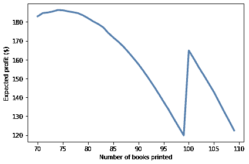</details>

这是最佳顺序和预期利润。

<details class="hide above-input"><summary aria-label="Toggle hidden content">显示代码单元格内容 隐藏代码单元格内容</summary>

```py
expected_profits.idxmax(), expected_profits.max() 
```

```py
(74, 186.328) 
```</details>

现在轮到你了。选择一个你认为合理的先验，用你得到的数据更新它，然后使用后验分布来进行我刚刚演示的分析。

<details class="hide above-input"><summary aria-label="Toggle hidden content">显示代码单元格内容 隐藏代码单元格内容</summary>

```py
# Solution

# For a prior I chose a log-uniform distribution; 
# that is, a distribution that is uniform in log-space
# from 1 to 100 books per week.

qs = np.logspace(0, 2, 101)
prior = Pmf(1, qs)
prior.normalize() 
```

```py
101 
```</details> <details class="hide above-input"><summary aria-label="Toggle hidden content">显示代码单元格内容 隐藏代码单元格内容</summary>

```py
# Solution

# Here's the CDF of the prior

prior.make_cdf().plot(color='C1')
decorate(xlabel=r'Book ordering rate ($\lambda$)',
         ylabel='CDF') 
```

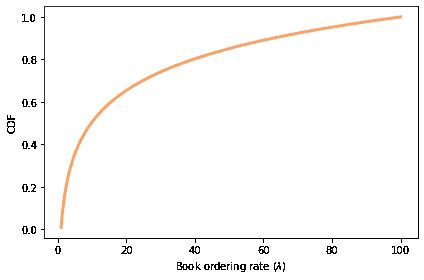</details><details class="hide above-input"><summary aria-label="Toggle hidden content">显示代码单元格内容 隐藏代码单元格内容</summary>

```py
# Solution

# Here's a function that updates the distribution of lambda
# based on one week of orders

from scipy.stats import poisson

def update_book(pmf, data):
  """Update book ordering rate.

 pmf: Pmf of book ordering rates
 data: observed number of orders in one week
 """
    k = data
    lams = pmf.index
    likelihood = poisson.pmf(k, lams)
    pmf *= likelihood
    pmf.normalize() 
```</details> <details class="hide above-input"><summary aria-label="Toggle hidden content">显示代码单元格内容 隐藏代码单元格内容</summary>

```py
# Solution

# Here's the update after week 1.

posterior1 = prior.copy()
update_book(posterior1, 10) 
```</details> <details class="hide above-input"><summary aria-label="Toggle hidden content">显示代码单元格内容 隐藏代码单元格内容</summary>

```py
# Solution

# And the update after week 2.

posterior2 = posterior1.copy()
update_book(posterior2, 9) 
```</details> <details class="hide above-input"><summary aria-label="Toggle hidden content">显示代码单元格内容 隐藏代码单元格内容</summary>

```py
# Solution

prior.mean(), posterior1.mean(), posterior2.mean() 
```

```py
(21.78849107458653, 10.000000817984526, 9.500000000003652) 
```</details> <details class="hide above-input"><summary aria-label="Toggle hidden content">显示代码单元格内容 隐藏代码单元格内容</summary>

```py
# Solution

# Now we can generate a sample of 1000 values from the posterior

rates = posterior2.choice(1000)
np.mean(rates) 
```

```py
9.408095235418383 
```</details> <details class="hide above-input"><summary aria-label="Toggle hidden content">显示代码单元格内容 隐藏代码单元格内容</summary>

```py
# Solution

# And we can generate a sequence of 8 weeks for each value

order_array = np.random.poisson(rates, size=(8, 1000)).transpose()
order_array[:5, :] 
```

```py
array([[ 9, 13,  7,  8, 11,  9, 11,  9],
       [ 7, 12,  9,  9,  9,  7, 11, 12],
       [12,  5, 10,  8, 12, 15, 13, 10],
       [ 5, 10,  7,  4,  9, 11,  8, 15],
       [ 5,  2,  3,  5,  3,  3,  4,  3]]) 
```</details> <details class="hide above-input"><summary aria-label="Toggle hidden content">显示代码单元格内容 隐藏代码单元格内容</summary>

```py
# Solution

# Here are the expected profits for each possible order

printed_array = np.arange(70, 110)
t = [compute_expected_profits(printed, order_array)
                    for printed in printed_array]
expected_profits = pd.Series(t, printed_array) 
```</details> <details class="hide above-input"><summary aria-label="Toggle hidden content">显示代码单元格内容 隐藏代码单元格内容</summary>

```py
# Solution

# And here's what they look like.

expected_profits.plot(label='')

decorate(xlabel='Number of books printed',
         ylabel='Expected profit ($)') 
```

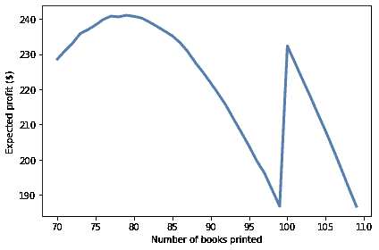</details><details class="hide above-input"><summary aria-label="Toggle hidden content">显示代码单元格内容 隐藏代码单元格内容</summary>

```py
# Solution

# Here's the optimal order.

expected_profits.idxmax() 
```

```py
79 
```</details>
