# 第十章：测试

> 原文：[`allendowney.github.io/ThinkBayes2/chap10.html`](https://allendowney.github.io/ThinkBayes2/chap10.html)
> 
> 译者：[飞龙](https://github.com/wizardforcel)
> 
> 协议：[CC BY-NC-SA 4.0](http://creativecommons.org/licenses/by-nc-sa/4.0/)


在<<_TheEuroProblem>>中，我提出了 David MacKay 的书中的一个问题，[*信息理论、推理和学习算法*](http://www.inference.org.uk/mackay/itila/p0.html)：

《卫报》于 2002 年 1 月 4 日星期五刊登了一份统计报告：

> 当比利时一欧元硬币被竖着转动 250 次时，正面出现了 140 次，反面出现了 110 次。伦敦政治经济学院的统计学讲师巴里·布莱特说：“这对我来说看起来非常可疑。如果硬币是公平的，得到这样极端结果的机会将低于 7%。”

“但[MacKay 问道]这些数据是否证明了硬币有偏而不是公平？”

我们在<<_EstimatingProportions>>中开始回答这个问题；回顾一下，我们的答案是基于这些建模决策：

+   如果你把一枚硬币竖着转动，有一定的概率$x$，它会正面朝上。

+   $x$的值因硬币的平衡和可能的其他因素而异。

从一个均匀的先验分布开始，我们用给定的数据更新了它，140 枚正面和 110 枚反面。然后我们使用后验分布来计算$x$的最可能值，后验均值和一个可信区间。

但我们从未真正回答过 MacKay 的问题：“这些数据是否证明了硬币有偏向而不是公平的？”

在这一章中，最后，我们将。

## 估计

让我们回顾一下<<_TheBinomialLikelihoodFunction>>中欧元问题的解决方案。我们从一个均匀的先验开始。

```py
import numpy as np
from empiricaldist import Pmf

xs = np.linspace(0, 1, 101)
uniform = Pmf(1, xs) 
```

我们使用二项分布来计算每个可能的$x$值的数据概率。

```py
from scipy.stats import binom

k, n = 140, 250
likelihood = binom.pmf(k, n, xs) 
```

我们以通常的方式计算了后验分布。

```py
posterior = uniform * likelihood
posterior.normalize() 
```

这就是它的样子。

显示代码单元格源代码隐藏代码单元格源代码

```py
from utils import decorate

posterior.plot(label='140 heads out of 250')

decorate(xlabel='Proportion of heads (x)',
         ylabel='Probability',
         title='Posterior distribution of x') 
```

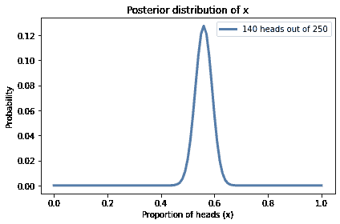

此外，后验均值约为 0.56，90%的可信区间为 0.51 到 0.61。

```py
print(posterior.mean(), 
      posterior.credible_interval(0.9)) 
```

```py
0.5595238095238094 [0.51 0.61] 
```

先验均值为 0.5，后验均值为 0.56，所以数据似乎证明了硬币有偏。

但事实证明并不是那么简单。

## 证据

在<<_OliversBlood>>中，我说数据被认为是支持假设$A$的证据，如果数据在$A$下比在备选假设$B$下更有可能；也就是说如果

$$P(D|A) > P(D|B)$$

此外，我们可以通过计算这些可能性的比值来量化证据的强度，这被称为[贝叶斯因子](https://en.wikipedia.org/wiki/Bayes_factor)，通常表示为$K$：

$$K = \frac{P(D|A)}{P(D|B)}$$

因此，对于欧元问题，让我们考虑两个假设，`公平`和`有偏`，并计算每个假设下数据的可能性。

如果硬币是公平的，正面的概率是 50%，我们可以使用二项分布计算数据的概率（250 次转动中的 140 次正面）：

```py
k = 140
n = 250

like_fair = binom.pmf(k, n, p=0.5)
like_fair 
```

```py
0.008357181724918204 
```

这是数据在硬币是公平的情况下的概率。

但如果硬币有偏，数据的概率是多少？这取决于“有偏”的含义。如果我们事先知道“有偏”意味着正面的概率是 56%，我们可以再次使用二项分布：

```py
like_biased = binom.pmf(k, n, p=0.56)
like_biased 
```

```py
0.05077815959518337 
```

现在我们可以计算可能性比：

```py
K = like_biased / like_fair
K 
```

```py
6.075990838368465 
```

如果硬币有偏，根据这个定义，数据大约有 6 倍的可能性，而如果硬币是公平的。

但我们使用数据来定义假设，这似乎有些欺骗。公平起见，我们应该在看到数据之前定义“有偏”。

## 均匀分布的偏差

假设“有偏”意味着正面的概率除了 50%之外的任何值，而其他所有值都是同等可能的。

我们可以通过制作一个均匀分布并去掉 50%来表示这个定义。

```py
biased_uniform = uniform.copy()
biased_uniform[0.5] = 0
biased_uniform.normalize() 
```

为了计算数据在这个假设下的总概率，我们计算每个$x$值的数据的条件概率。

```py
xs = biased_uniform.qs
likelihood = binom.pmf(k, n, xs) 
```

然后乘以先验概率并加总乘积：

```py
like_uniform = np.sum(biased_uniform * likelihood)
like_uniform 
```

```py
0.003900491927770735 
```

这就是在“偏置均匀”假设下的数据概率。

现在我们可以计算数据在“公平”和“偏置均匀”假设下的似然比：

```py
K = like_fair / like_uniform
K 
```

```py
2.1425968518013625 
```

如果按照这种“偏置”的定义，如果硬币是公平的话，数据大约是有偏的两倍。

为了了解证据的强度，我们可以应用贝叶斯定理。例如，如果硬币偏置的先验概率为 50％，则先验几率为 1，因此后验几率约为 2.1 比 1，后验概率约为 68％。

```py
prior_odds = 1
posterior_odds = prior_odds * K
posterior_odds 
```

```py
2.1425968518013625 
```

```py
def prob(o):
    return o / (o+1) 
```

```py
posterior_probability = prob(posterior_odds)
posterior_probability 
```

```py
0.6817918278551092 
```

将证据从 50％移动到 68％并不是很强有力的。

现在假设“偏置”并不意味着每个$x$值都是同等可能的。也许接近 50％的值更可能，而接近极端的值则不太可能。我们可以使用三角形分布来表示这种“偏置”的替代定义：

```py
ramp_up = np.arange(50)
ramp_down = np.arange(50, -1, -1)
a = np.append(ramp_up, ramp_down)

triangle = Pmf(a, xs, name='triangle')
triangle.normalize() 
```

就像我们对均匀分布所做的那样，我们可以将 50%作为$x$的可能值排除（但是如果我们跳过这个细节也不会有太大差别）。

```py
biased_triangle = triangle.copy()
biased_triangle[0.5] = 0
biased_triangle.normalize() 
```

这就是三角形先验与均匀先验的比较。

```py
biased_uniform.plot(label='uniform prior')
biased_triangle.plot(label='triangle prior')

decorate(xlabel='Proportion of heads (x)',
         ylabel='Probability',
         title='Uniform and triangle prior distributions') 
```

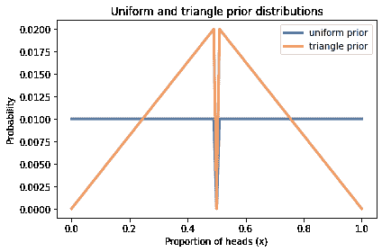

**练习：**现在计算在这种“偏置”的定义下数据的总概率，并计算贝叶斯因子，与公平假设相比。数据证据表明硬币是有偏的吗？


```py
# Solution

like_triangle = np.sum(biased_triangle * likelihood)
like_triangle 
```

```py
0.00698132546485788 
``` 

```py
# Solution

K = like_fair / like_triangle
K 
```

```py
1.1970766535647157 
``` 

```py
# Solution

# For this definition of "biased", the data are 
# very slightly in favor of the fair hypothesis. 
```

## 贝叶斯假设检验

在本章中，我们迄今所做的有时被称为“贝叶斯假设检验”，与[统计假设检验](https://en.wikipedia.org/wiki/Statistical_hypothesis_testing)相对。

在统计假设检验中，我们计算一个难以简洁定义的 p 值，并用它来确定结果是否“统计显著”，这也很难简洁定义。

贝叶斯的替代方法是报告贝叶斯因子$K$，它总结了支持一个假设或另一个假设的证据的强度。

有些人认为报告$K$比后验概率更好，因为$K$不依赖于先验概率。但正如我们在这个例子中看到的，$K$通常取决于假设的精确定义，这可能与先验概率一样有争议。

在我看来，贝叶斯假设检验更好，因为它可以衡量证据的强度，而不是试图做出二元决定。但它并没有解决我认为的根本问题，即假设检验并没有问出我们真正关心的问题。

要了解为什么，假设你测试了硬币并决定它实际上是有偏的。你可以用这个答案做什么？在我看来，没有太多。相比之下，我认为更有用（因此更有意义）的是两个问题：

+   预测：根据我们对硬币的了解，我们应该期待未来会发生什么？

+   决策：我们能否利用这些预测做出更好的决策？

到目前为止，我们已经看到了一些预测的例子。例如，在<<_PoissonProcesses>>中，我们使用了进球率的后验分布来预测足球比赛的结果。

我们之前已经看到了一个决策分析的例子：在<<_DecisionAnalysis>>中，我们使用价格分布来选择*价格对了*上的最佳出价。

所以让我们用另一个贝叶斯决策分析的例子结束这一章，贝叶斯老虎机策略。

## 贝叶斯老虎机

如果你去过赌场，你可能见过老虎机，有时被称为“单臂老虎机”，因为它有一个像手臂一样的把手，还有像强盗一样拿钱的能力。

贝叶斯老虎机策略是以单臂老虎机命名的，因为它解决了一个基于老虎机简化版本的问题。

假设每次你玩老虎机，都有固定的赢的概率。假设不同的老虎机给你不同的赢的概率，但你不知道这些概率是多少。

最初，你对每台机器有相同的先验信念，所以你没有理由偏好其中一台。但如果你玩了每台机器几次，你可以用结果来估计概率。你可以用估计的概率来决定下一次玩哪台机器。

在高层次上，这就是贝叶斯老虎机策略。现在让我们看看细节。

## 先验信念

如果我们对赢的概率一无所知，我们可以从均匀先验开始。

```py
xs = np.linspace(0, 1, 101)
prior = Pmf(1, xs)
prior.normalize() 
```

假设我们从四台老虎机中选择，我会为每台机器做一个先验的副本。

```py
beliefs = [prior.copy() for i in range(4)] 
```

这个函数在一个网格中显示四个分布。


```py
import matplotlib.pyplot as plt

options = dict(xticklabels='invisible', yticklabels='invisible')

def plot(beliefs, **options):
    for i, pmf in enumerate(beliefs):
        plt.subplot(2, 2, i+1)
        pmf.plot(label='Machine %s' % i)
        decorate(yticklabels=[])

        if i in [0, 2]:
            decorate(ylabel='PDF')

        if i in [2, 3]:
            decorate(xlabel='Probability of winning')

    plt.tight_layout() 
```

这里是四台机器的先验分布。

```py
plot(beliefs) 
```

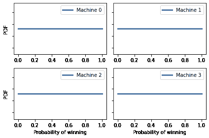

## 更新

每次我们玩老虎机，我们可以利用结果来更新我们的信念。以下函数进行更新。

```py
likelihood = {
    'W': xs,
    'L': 1 - xs
} 
```

```py
def update(pmf, data):
  """Update the probability of winning."""
    pmf *= likelihood[data]
    pmf.normalize() 
```

这个函数直接更新先验分布。`pmf`是一个代表`x`的先验分布的`Pmf`，`x`是赢的概率。

`data`是一个字符串，要么是`W`，表示赢，要么是`L`，表示输。

数据的似然性要么是`xs`，要么是`1-xs`，取决于结果。

假设我们选择一台机器，玩 10 次，赢了一次。我们可以根据这个结果计算`x`的后验分布，如下所示：

```py
bandit = prior.copy()

for outcome in 'WLLLLLLLLL':
    update(bandit, outcome) 
```

后验分布如下。


```py
bandit.plot()
decorate(xlabel='Probability of winning',
         ylabel='PDF',
         title='Posterior distribution, nine losses, one win') 
```

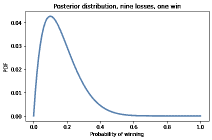

## 多个老虎机

现在假设我们有四台机器，它们的概率如下：

```py
actual_probs = [0.10, 0.20, 0.30, 0.40] 
```

记住，作为玩家，我们不知道这些概率。

以下函数接受一个机器的索引，模拟玩一次机器，并返回结果，`W`表示赢，`L`表示输。

```py
from collections import Counter

# count how many times we've played each machine
counter = Counter()

def play(i):
  """Play machine i.

 i: index of the machine to play

 returns: string 'W' or 'L'
 """
    counter[i] += 1
    p = actual_probs[i]
    if np.random.random() < p:
        return 'W'
    else:
        return 'L' 
```

`counter`是一个`Counter`，它是一种我们将用来跟踪每台机器被玩的次数的字典。

这里有一个测试，每台机器玩 10 次。

```py
for i in range(4):
    for _ in range(10):
        outcome = play(i)
        update(beliefs[i], outcome) 
```

每次通过内循环，我们玩一台机器并更新我们的信念。

我们的后验信念如下。

```py
plot(beliefs) 
```

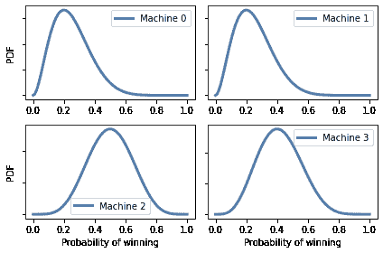

这里是实际概率、后验均值和 90%的可信区间。


```py
import pandas as pd

def summarize_beliefs(beliefs):
  """Compute means and credible intervals.

 beliefs: sequence of Pmf

 returns: DataFrame
 """
    columns = ['Actual P(win)', 
               'Posterior mean', 
               'Credible interval']

    df = pd.DataFrame(columns=columns)
    for i, b in enumerate(beliefs):
        mean = np.round(b.mean(), 3)
        ci = b.credible_interval(0.9)
        ci = np.round(ci, 3)
        df.loc[i] = actual_probs[i], mean, ci
    return df 
``` 

```py
summarize_beliefs(beliefs) 
```

|  | 实际赢的概率 | 后验均值 | 可信区间 |
| --- | --- | --- | --- |
| 0 | 0.1 | 0.250 | [0.08, 0.47] |
| 1 | 0.2 | 0.250 | [0.08, 0.47] |
| 2 | 0.3 | 0.500 | [0.27, 0.73] |
| 3 | 0.4 | 0.417 | [0.2, 0.65] |

我们期望置信区间大部分时间包含实际概率。

## 探索和开发

基于这些后验分布，你认为我们应该下一步玩哪台机器？一个选择是选择后验均值最高的机器。

这不是一个坏主意，但它有一个缺点：因为我们只玩了每台机器几次，后验分布很宽，重叠，这意味着我们不确定哪台机器是最好的；如果我们太早专注于一台机器，我们可能选择错误的机器并且玩得比应该更多。

为了避免这个问题，我们可以走向另一个极端，直到我们有信心确定了最好的机器，然后专门玩它。

这也不是一个坏主意，但它有一个缺点：当我们收集数据时，我们没有充分利用它；直到我们确定哪台机器是最好的，我们玩其他机器的次数比应该更多。

贝叶斯赌博策略通过同时收集和使用数据来避免这两个缺点。换句话说，它平衡了探索和开发。

这个想法的核心被称为[汤普森抽样](https://en.wikipedia.org/wiki/Thompson_sampling)：当我们选择一台机器时，我们随机选择，以便选择每台机器的概率与它是最好的概率成比例。

给定后验分布，我们可以计算每台机器的“优越概率”。

这是一种方法。我们可以从每个后验分布中抽取 1000 个值，就像这样：

```py
samples = np.array([b.choice(1000) 
                    for b in beliefs])
samples.shape 
```

```py
(4, 1000) 
```

结果有 4 行和 1000 列。我们可以使用`argmax`找到每列中最大值的索引：

```py
indices = np.argmax(samples, axis=0)
indices.shape 
```

```py
(1000,) 
```

这些索引的`Pmf`是每台机器产生最高值的次数的比例。

```py
pmf = Pmf.from_seq(indices)
pmf 
```

|  | 概率 |
| --- | --- |
| 0 | 0.048 |
| 1 | 0.043 |
| 2 | 0.625 |
| 3 | 0.284 |

这些分数近似于每台机器的优越概率。因此，我们可以通过从这个`Pmf`中选择一个值来选择下一个机器。

```py
pmf.choice() 
```

```py
1 
```

但是选择一个单一值需要很多工作，而且并不是真正必要的，因为有一个捷径。

如果我们从每个后验分布中抽取一个随机值，并选择产生最高值的机器，结果是我们将按照其优越概率选择每台机器。

以下函数就是做这个的。

```py
def choose(beliefs):
  """Use Thompson sampling to choose a machine.

 Draws a single sample from each distribution.

 returns: index of the machine that yielded the highest value
 """
    ps = [b.choice() for b in beliefs]
    return np.argmax(ps) 
```

这个函数从每台机器的后验分布中选择一个值，然后使用`argmax`找到产生最高值的机器的索引。

这是一个例子。

```py
choose(beliefs) 
```

```py
3 
```

## 策略

把所有这些放在一起，以下函数选择一台机器，玩一次，并更新`beliefs`：

```py
def choose_play_update(beliefs):
  """Choose a machine, play it, and update beliefs."""

    # choose a machine
    machine = choose(beliefs)

    # play it
    outcome = play(machine)

    # update beliefs
    update(beliefs[machine], outcome) 
```

为了测试它，让我们从一组新的信念和一个空的`Counter`开始。

```py
beliefs = [prior.copy() for i in range(4)]
counter = Counter() 
```

如果我们运行赌博算法 100 次，我们可以看到`beliefs`如何更新：

```py
num_plays = 100

for i in range(num_plays):
    choose_play_update(beliefs)

plot(beliefs) 
```

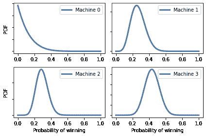

以下表格总结了结果。


```py
summarize_beliefs(beliefs) 
```

|  | 实际 P(获胜) | 后验均值 | 置信区间 |
| --- | --- | --- | --- |
| 0 | 0.1 | 0.107 | [0.0, 0.31] |
| 1 | 0.2 | 0.269 | [0.14, 0.42] |
| 2 | 0.3 | 0.293 | [0.18, 0.41] |
| 3 | 0.4 | 0.438 | [0.3, 0.58] |

置信区间通常包含获胜的实际概率。估计仍然很粗糙，特别是对于低概率的机器。但这是一个特点，而不是一个错误：目标是尽可能经常玩高概率的机器。使估计更精确是为了达到这个目的，而不是结束本身。

更重要的是，让我们看看每台机器被玩了多少次。


```py
def summarize_counter(counter):
  """Report the number of times each machine was played.

 counter: Collections.Counter

 returns: DataFrame
 """
    index = range(4)
    columns = ['Actual P(win)', 'Times played']
    df = pd.DataFrame(index=index, columns=columns)
    for i, count in counter.items():
        df.loc[i] = actual_probs[i], count
    return df 
``` 

```py
summarize_counter(counter) 
```

|  | 实际获胜概率 | 游戏次数 |
| --- | --- | --- |
| 0 | 0.1 | 7 |
| 1 | 0.2 | 24 |
| 2 | 0.3 | 39 |
| 3 | 0.4 | 30 |

如果一切按计划进行，概率较高的机器应该更频繁地被玩。

## 总结

在本章中，我们最终解决了欧元问题，确定了数据是否支持硬币公平还是有偏见的假设。我们发现答案取决于我们如何定义“有偏见”。我们使用贝叶斯因子对结果进行了总结，该因子量化了证据的强度。

但答案并不令人满意，因为在我看来，这个问题并不有趣。知道硬币是否有偏见并没有用，除非它能帮助我们做出更好的预测和更好的决策。

作为一个更有趣问题的例子，我们研究了“单臂老虎机”问题以及解决它的策略，即贝叶斯老虎机算法，该算法试图平衡探索和开发，即收集更多信息并充分利用我们已有的信息。

作为练习，你将有机会探索标准化测试的自适应策略。

贝叶斯老虎机和自适应测试是[贝叶斯决策理论](https://wiki.lesswrong.com/wiki/Bayesian_decision_theory)的例子，这是使用后验分布作为决策过程的一部分的想法，通常是通过选择最小化我们预期成本的行动（或最大化利益）。

我们在<<_MaximizingExpectedGain>>中用于竞猜《物价合适》的策略就是另一个例子。

这些策略展示了我认为贝叶斯方法胜过经典统计学的最大优势。当我们以概率分布的形式表示知识时，贝叶斯定理告诉我们如何随着获取更多数据而改变我们的信念，而贝叶斯决策理论告诉我们如何使这些知识可行。

## 练习

**练习：**像[SAT](https://en.wikipedia.org/wiki/SAT)这样的标准化测试经常作为大学入学过程的一部分。SAT 的目标是衡量考试者的学术准备情况；如果准确的话，他们的分数应该反映出他们在测试领域的实际能力。

直到最近，像 SAT 这样的测试是用纸和铅笔进行的，但现在学生可以选择在线测试。在在线格式中，测试可以是“自适应的”，这意味着它可以[根据先前问题的回答选择每个问题](https://www.nytimes.com/2018/04/05/education/learning/tests-act-sat.html)。

如果学生前几个问题答对了，测试可以用更难的问题来挑战他们。如果他们在挣扎，测试可以给他们更容易的问题。自适应测试有可能更“高效”，这意味着在相同数量的问题下，自适应测试可以更精确地测量测试者的能力。

为了验证这一点，我们将开发一个自适应测试模型，并量化其测量的精度。

此练习的详细信息在笔记本中。


```py
def prob_correct(ability, difficulty):
  """Probability of a correct response."""
    a = 100
    c = 0.25
    x = (ability - difficulty) / a
    p = c + (1-c) / (1 + np.exp(-x))
    return p 
```

我选择了`a`，使得分数范围可以与 SAT 可比，SAT 报告的分数范围是 200 到 800。

这是一个难度为 500，能力范围的逻辑曲线是什么样子。


```py
abilities = np.linspace(100, 900)
diff = 500
ps = prob_correct(abilities, diff) 
``` 

```py
plt.plot(abilities, ps)
decorate(xlabel='Ability',
         ylabel='Probability correct',
         title='Probability of correct answer, difficulty=500',
         ylim=[0, 1.05]) 
```

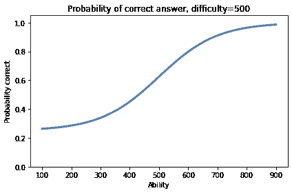

`ability=900`的人几乎可以肯定会得到正确答案。`ability=100`的人猜对的概率约为 25%。

## 模拟测试

为了模拟测试，我们将使用与赌徒策略相同的结构：

+   一个名为`play`的函数，用于模拟考试者回答一个问题。

+   一个名为`choose`的函数，用于选择下一个要提出的问题。

+   一个名为`update`的函数，它使用结果（正确回答或否）来更新考试者能力的估计。

这是`play`，它以`ability`和`difficulty`作为参数。


```py
def play(ability, difficulty):
  """Simulate a test-taker answering a question."""
    p = prob_correct(ability, difficulty)
    return np.random.random() < p 
```

`play`使用`prob_correct`来计算正确答案的概率，使用`np.random.random`生成 0 到 1 之间的随机值。返回值为`True`表示回答正确，否则为`False`。

作为测试，让我们模拟一个`ability=600`的考试者回答一个`difficulty=500`的问题。正确回答的概率约为 80%。


```py
prob_correct(600, 500) 
```

```py
0.7982939339725037 
```

假设这个人参加了一个有 51 个问题的测试，所有问题的难度都相同，为`500`。我们期望他们能对大约 80%的问题做出正确回答。

这是一次模拟的结果。


```py
num_questions = 51
outcomes = [play(600, 500) for _ in range(num_questions)]
np.mean(outcomes) 
```

```py
0.803921568627451 
```

我们期望他们能对大约 80%的问题做出正确回答。

现在假设我们不知道考试者的能力。我们可以使用刚刚生成的数据来估计。这就是我们接下来要做的。

## 先验

SAT 的设计是使得分数的分布大致呈正态分布，均值为 500，标准差为 100。因此，最低分 200 是均值的三个标准差以下，最高分 800 是均值的三个标准差以上。

我们可以使用该分布作为先验，但它倾向于截断分布的低端和高端。相反，我会将标准差膨胀到 300，以保留`ability`可能小于 200 或大于 800 的可能性。

这是代表先验分布的`Pmf`。


```py
from scipy.stats import norm

mean = 500
std = 300

qs = np.linspace(0, 1000)
ps = norm(mean, std).pdf(qs)

prior = Pmf(ps, qs)
prior.normalize() 
```

这是它的样子。


```py
prior.plot(label='std=300', color='C5')

decorate(xlabel='Ability',
         ylabel='PDF',
         title='Prior distribution of ability',
         ylim=[0, 0.032]) 
```

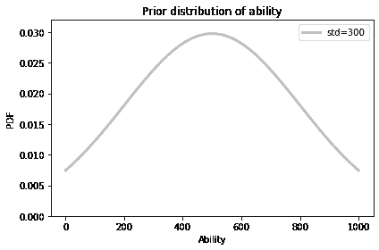

## 更新

以下函数接受一个先验`Pmf`和单个问题的结果，并就地更新`Pmf`。


```py
def update_ability(pmf, data):
  """Update the distribution of ability."""
    difficulty, outcome = data

    abilities = pmf.qs
    ps = prob_correct(abilities, difficulty)

    if outcome:
        pmf *= ps
    else:
        pmf *= 1 - ps

    pmf.normalize() 
```

`data`是一个包含问题难度和结果的元组：如果回答正确则为`True`，否则为`False`。

作为测试，让我们根据先前模拟的结果进行更新，基于一个`ability=600`的人回答了 51 个`difficulty=500`的问题。


```py
actual_600 = prior.copy()

for outcome in outcomes:
    data = (500, outcome)
    update_ability(actual_600, data) 
```

这是后验分布的样子。


```py
actual_600.plot(color='C4')

decorate(xlabel='Ability',
         ylabel='PDF',
         title='Posterior distribution of ability') 
```

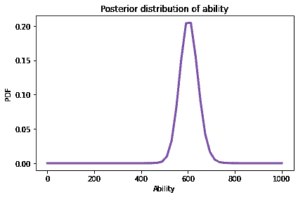

后验均值非常接近考试者的实际能力，即 600。


```py
actual_600.mean() 
```

```py
604.3325737356816 
```

如果我们再次运行这个模拟，我们将得到不同的结果。

## 适应

现在让我们模拟一个自适应测试。我将使用以下函数来选择问题，从最简单的策略开始：所有问题的难度都相同。


```py
def choose(i, belief):
  """Choose the difficulty of the next question."""
    return 500 
```

作为参数，`choose`接受`i`，即问题的索引，以及`belief`，即基于先前问题的回答的`ability`后验分布的`Pmf`。

这个`choose`版本不使用这些参数；它们只是为了我们可以测试其他策略（见本章末尾的练习）。

以下函数模拟了一个已知其实际能力的人参加考试。


```py
def simulate_test(actual_ability):
  """Simulate a person taking a test."""
    belief = prior.copy()
    trace = pd.DataFrame(columns=['difficulty', 'outcome'])

    for i in range(num_questions):
        difficulty = choose(i, belief)
        outcome = play(actual_ability, difficulty)
        data = (difficulty, outcome)
        update_ability(belief, data)
        trace.loc[i] = difficulty, outcome

    return belief, trace 
```

返回值是代表能力后验分布的`Pmf`和包含问题难度和结果的`DataFrame`。

这是一个例子，再次是针对`ability=600`的考试者。


```py
belief, trace = simulate_test(600) 
```

我们可以使用轨迹来查看有多少回答是正确的。


```py
trace['outcome'].sum() 
```

```py
42 
```

这就是后验分布的样子。


```py
belief.plot(color='C4', label='ability=600')

decorate(xlabel='Ability',
         ylabel='PDF',
         title='Posterior distribution of ability') 
```

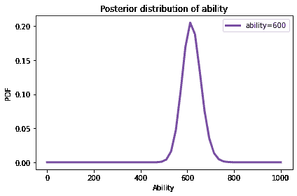

同样，后验分布代表了对考试者实际能力的相当好的估计。

## 量化精度

为了量化估计的精度，我将使用后验分布的标准差。标准差衡量了分布的扩散，因此更高的值表示对考试者能力的不确定性更大。

在前面的例子中，后验分布的标准差约为 40。


```py
belief.mean(), belief.std() 
```

```py
(618.6942050450824, 40.08554296596485) 
```

对于所有问题难度相同的考试，估计的精度强烈依赖于考试者的能力。为了证明这一点，我将循环遍历一系列能力，并使用总是返回`difficulty=500`的`choice`版本来模拟一次测试。


```py
actual_abilities = np.linspace(200, 800)
results = pd.DataFrame(columns=['ability', 'posterior_std'])
series = pd.Series(index=actual_abilities, dtype=float, name='std')

for actual_ability in actual_abilities:
    belief, trace = simulate_test(actual_ability)
    series[actual_ability] = belief.std() 
```

以下图显示了在每个能力水平上进行一次模拟时后验分布的标准差。

结果很嘈杂，所以我还绘制了一条通过[局部回归](https://en.wikipedia.org/wiki/Local_regression)拟合数据的曲线。


```py
from utils import plot_series_lowess

plot_series_lowess(series, 'C1')

decorate(xlabel='Actual ability',
         ylabel='Standard deviation of posterior') 
```

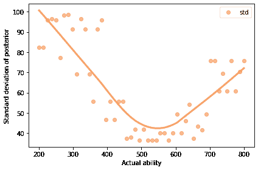

测试对于能力在`500`和`600`之间的人来说最精确，对于能力在范围高端的人来说不那么精确，对于能力在范围低端的人来说更糟糕。

当所有问题的难度都是`500`时，一个能力为`800`的人有很高的概率答对。所以当他们答对时，我们对他们的了解并不多。

如果测试包括一系列难度不同的问题，它会提供更多关于高端和低端人群的信息。

在章节末的练习中，你将有机会尝试其他策略，包括根据先前结果选择每个问题的自适应策略。

## 区分能力

在前一节中，我们使用后验分布的标准差来量化估计的精度。描述测试的表现（而不是测试者的表现）的另一种方法是衡量“区分能力”，即测试区分不同能力的测试者的能力。

为了衡量区分能力，我将模拟一个人进行 100 次测试；每次模拟后，我将使用后验分布的均值作为他们的“分数”。


```py
def sample_posterior(actual_ability, iters):
  """Simulate multiple tests and compute posterior means.

 actual_ability: number
 iters: number of simulated tests

 returns: array of scores
 """
    scores = []

    for i in range(iters):
        belief, trace = simulate_test(actual_ability)
        score = belief.mean()
        scores.append(score)

    return np.array(scores) 
```

以下是几个不同能力水平的人的分数样本。


```py
sample_500 = sample_posterior(500, iters=100) 
``` 

```py
sample_600 = sample_posterior(600, iters=100) 
``` 

```py
sample_700 = sample_posterior(700, iters=100) 
``` 

```py
sample_800 = sample_posterior(800, iters=100) 
```

以下是分数分布的样子。


```py
from empiricaldist import Cdf

cdf_500 = Cdf.from_seq(sample_500)
cdf_600 = Cdf.from_seq(sample_600)
cdf_700 = Cdf.from_seq(sample_700)
cdf_800 = Cdf.from_seq(sample_800) 
``` 

```py
cdf_500.plot(label='ability=500', color='C1',
            linestyle='dashed')
cdf_600.plot(label='ability=600', color='C3')
cdf_700.plot(label='ability=700', color='C2',
            linestyle='dashed')
cdf_800.plot(label='ability=800', color='C0')

decorate(xlabel='Test score',
         ylabel='CDF',
         title='Sampling distribution of test scores') 
```

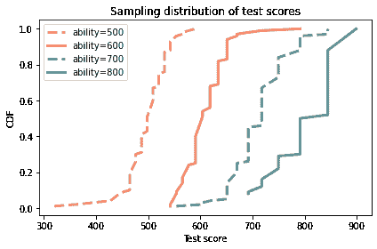

平均而言，能力更高的人得分更高，但任何人都可能有好天或坏天，所以分布之间存在一些重叠。

对于能力在`500`和`600`之间的人，测试的精度最高，测试的区分能力也很高。

如果能力在`500`和`600`之间的人参加测试，几乎可以肯定能力更高的人会得到更高的分数。


```py
np.mean(sample_600 > sample_500) 
```

```py
0.98 
```

对于能力在`600`和`700`之间的人，就不那么确定了。


```py
np.mean(sample_700 > sample_600) 
```

```py
0.95 
```

而对于能力在`700`和`800`之间的人，根本就不确定。


```py
np.mean(sample_800 > sample_700) 
```

```py
0.85 
```

但请记住，这些结果是基于一个测试，其中所有问题的难度都是相等的。如果你在章节末做练习，你会发现，如果测试包括一系列难度不同的问题，测试的表现会更好，甚至如果测试是自适应的话，表现会更好。

返回并修改`choose`，这是选择下一个问题难度的函数。

1.  编写一个`choose`的版本，通过使用`i`作为难度序列的索引，返回一系列难度。

1.  编写一个自适应的`choose`版本，它根据`belief`选择下一个问题的难度，这是测试者能力的后验分布，基于先前回答的结果。

对于两个新版本，再次运行模拟以量化测试的精度和区分能力。

对于`choose`的第一个版本，困难程度的理想分布是什么？

对于第二个版本，什么是最大化测试在能力范围内精度的自适应策略？


```py
# Solution

# I don't know what the optimal distribution of questions
# is, but my guess is that it would follow the distribution
# of ability.

# But as a simplification, I used a uniform distribution
# from 200 to 800.

# It works pretty well (and substantially better than the
# test where all questions are equally difficult.)

num_questions = 51
difficulties = np.linspace(200, 800, num_questions)

def choose(i, belief):
  """Choose the difficulty of the next question.

 i: index from [0..num_questions-1]
 belief: Pmf representing current estimate of ability

 returns: difficulty
 """
    return difficulties[i] 
``` 

```py
# Solution

# I suspect that the optimal strategy is to choose
# a question so that the test-taker has a 50% chance
# of getting it right.

# As rough approximation of that, I choose a question
# with difficulty equal to the posterior mean of ability.

# It works quite well (and substantially better than
# the previous version).

def choose(i, belief):
  """Choose the difficulty of the next question.

 i: index from [0..num_questions-1]
 belief: Pmf representing current estimate of ability

 returns: difficulty
 """
    return belief.mean() 
```
