# 第十一章：比较

> 原文：[`allendowney.github.io/ThinkBayes2/chap11.html`](https://allendowney.github.io/ThinkBayes2/chap11.html)
> 
> 译者：[飞龙](https://github.com/wizardforcel)
> 
> 协议：[CC BY-NC-SA 4.0](http://creativecommons.org/licenses/by-nc-sa/4.0/)


本章介绍了联合分布，这是处理多个变量的分布的基本工具。

我们将用它们来解决一个愚蠢的问题，然后再解决一个真正的问题。愚蠢的问题是，只知道一个人比另一个人高，就要弄清楚两个人有多高。真正的问题是根据比赛结果对国际象棋选手（或其他类型比赛的参与者）进行评分。

为了构建联合分布并计算这些问题的可能性，我们将使用外积和类似的操作。这就是我们将开始的地方。

## 外部操作

许多有用的操作可以表示为两个序列的“外积”，或者另一种“外部”操作。假设你有像`x`和`y`这样的序列：

```py
x = [1, 3, 5]
y = [2, 4] 
```

这些序列的外积是一个包含每对值的乘积的数组，一个来自每个序列。有几种计算外积的方法，但我认为最通用的一种是“网格”。

NumPy 提供了一个名为`meshgrid`的函数，用于计算网格。如果我们给它两个序列，它会返回两个数组。

```py
import numpy as np

X, Y = np.meshgrid(x, y) 
```

第一个数组包含了`x`的副本，按行排列，行数是`y`的长度。

```py
X 
```

```py
array([[1, 3, 5],
       [1, 3, 5]]) 
```

第二个数组包含了`y`的副本，按列排列，列数是`x`的长度。

```py
Y 
```

```py
array([[2, 2, 2],
       [4, 4, 4]]) 
```

因为这两个数组的大小相同，所以我们可以将它们用作算术函数的操作数，比如乘法。

```py
X * Y 
```

```py
array([[ 2,  6, 10],
       [ 4, 12, 20]]) 
```

这是`x`和`y`的外积。如果我们将它放在`DataFrame`中，我们可以更清楚地看到：

```py
import pandas as pd

df = pd.DataFrame(X * Y, columns=x, index=y)
df 
```

|  | 1 | 3 | 5 |
| --- | --- | --- | --- |
| 2 | 2 | 6 | 10 |
| 4 | 4 | 12 | 20 |

`x`的值显示为列名；`y`的值显示为行标签。每个元素都是`x`的一个值和`y`的一个值的乘积。

我们可以使用网格来计算其他操作，比如外部求和，它是一个包含`x`的元素和`y`的元素的*和*的数组。

```py
X + Y 
```

```py
array([[3, 5, 7],
       [5, 7, 9]]) 
```

我们还可以使用比较运算符来比较`x`中的元素和`y`中的元素。

```py
X > Y 
```

```py
array([[False,  True,  True],
       [False, False,  True]]) 
```

结果是一个布尔值数组。

也许现在还不明显这些操作为什么有用，但我们很快就会看到例子。有了这些，我们就准备好解决一个新的贝叶斯问题了。

## A 有多高？

假设我从美国成年男性人口中选择两个人；我将称他们为 A 和 B。如果我们看到 A 比 B 高，那么 A 有多高？

回答这个问题：

1.  我将使用关于美国成年男性身高的背景信息来形成一个身高的先验分布，

1.  我将构建 A 和 B 的身高的联合先验分布（我会解释这是什么），

1.  然后我将使用 A 更高的信息更新先验，和

1.  从联合后验分布中，我将提取 A 的身高的后验分布。

在美国，成年男性的平均身高是 178 厘米，标准偏差是 7.7 厘米。这个分布不完全是正态的，因为现实世界中没有什么是完全正态的，但正态分布是实际分布的一个很好的模型，所以我们可以将其用作 A 和 B 的先验分布。

这是一个从均值以下 3 个标准偏差到均值以上 3 个标准偏差的等间距值数组（略微向上取整）。

```py
mean = 178
qs = np.arange(mean-24, mean+24, 0.5) 
```

SciPy 提供了一个名为`norm`的函数，它表示具有给定均值和标准差的正态分布，并提供了`pdf`，用于评估正态分布的概率密度函数（PDF）：

```py
from scipy.stats import norm

std = 7.7
ps = norm(mean, std).pdf(qs) 
```

概率密度不是概率，但如果我们将它们放在`Pmf`中并进行归一化，结果就是正态分布的离散近似。

```py
from empiricaldist import Pmf

prior = Pmf(ps, qs)
prior.normalize() 
```

显示代码单元格输出 隐藏代码单元格输出

```py
1.9963309462450582 
```

就是这个样子。

显示代码单元格源代码 隐藏代码单元格源代码

```py
from utils import decorate

prior.plot(style='--', color='C5')

decorate(xlabel='Height in cm',
         ylabel='PDF',
         title='Approximate distribution of height for men in U.S.') 
``` 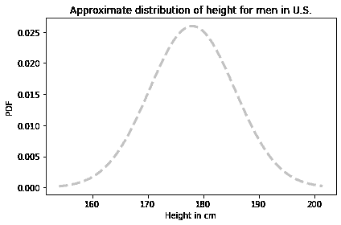

这个分布代表了我们在考虑`A`比`B`高的数据之前对`A`和`B`的身高的信念。

## 联合分布

下一步是构建一个代表每对身高概率的分布，这被称为联合分布。联合分布的元素是

$$P(A_x~\mathrm{and}~B_y)$$

即`A`为$x$厘米高，`B`为$y$厘米高的概率，对于所有的$x$和$y$值。

此时我们对`A`和`B`的了解是，他们是美国的男性居民，所以他们的身高是独立的；也就是说，知道`A`的身高并不会提供关于`B`身高的额外信息。

在这种情况下，我们可以这样计算联合概率：

$$P(A_x~\mathrm{and}~B_y) = P(A_x)~P(B_y)$$

每个联合概率是从`x`的分布中的一个元素和从`y`的分布中的一个元素的乘积。

因此，如果我们有代表`A`和`B`身高分布的`Pmf`对象，我们可以通过计算每个`Pmf`中概率的外积来计算联合分布。

以下函数接受两个`Pmf`对象，并返回一个代表联合分布的`DataFrame`。

```py
def make_joint(pmf1, pmf2):
  """Compute the outer product of two Pmfs."""
    X, Y = np.meshgrid(pmf1, pmf2)
    return pd.DataFrame(X * Y, columns=pmf1.qs, index=pmf2.qs) 
```

结果中的列名是来自`pmf1`的数量；行标签是来自`pmf2`的数量。

在这个例子中，`A`和`B`的先验分布是相同的，所以我们可以这样计算联合先验分布：

```py
joint = make_joint(prior, prior)
joint.shape 
```

```py
(96, 96) 
```

结果是一个`DataFrame`，`A`的可能身高沿着列，`B`的可能身高沿着行，联合概率作为元素。

如果先验被归一化，联合先验也将被归一化。

```py
joint.to_numpy().sum() 
```

```py
1.0 
```

为了计算所有元素的和，我们在调用`sum`之前将`DataFrame`转换为 NumPy 数组。否则，`DataFrame.sum`会计算列的和并返回一个`Series`。


```py
series = joint.sum()
series.shape 
```

```py
(96,) 
```

## 可视化联合分布

以下函数使用`pcolormesh`来绘制联合分布。

```py
import matplotlib.pyplot as plt

def plot_joint(joint, cmap='Blues'):
  """Plot a joint distribution with a color mesh."""
    vmax = joint.to_numpy().max() * 1.1
    plt.pcolormesh(joint.columns, joint.index, joint, 
                   cmap=cmap,
                   vmax=vmax,
                   shading='nearest')
    plt.colorbar()

    decorate(xlabel='A height in cm',
             ylabel='B height in cm') 
```

这就是联合先验分布的样子。

显示代码单元格源代码 隐藏代码单元格源代码

```py
plot_joint(joint)
decorate(title='Joint prior distribution of height for A and B') 
``` 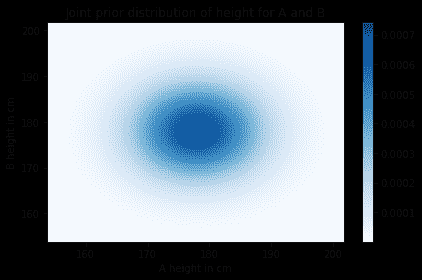

正如你所期望的，概率在均值附近最高（最暗），离均值越远就会下降。

可视化联合分布的另一种方法是等高线图。

```py
def plot_contour(joint):
  """Plot a joint distribution with a contour."""
    plt.contour(joint.columns, joint.index, joint,
                linewidths=2)
    decorate(xlabel='A height in cm',
             ylabel='B height in cm') 
```

显示代码单元格源代码 隐藏代码单元格源代码

```py
plot_contour(joint)
decorate(title='Joint prior distribution of height for A and B') 
``` 

每条线代表相等概率的水平。

## 可能性

现在我们有了一个联合先验分布，我们可以用数据来更新它，即`A`比`B`高。

联合分布中的每个元素代表了关于`A`和`B`身高的假设。要计算每对数量的可能性，我们可以从先验中提取列名和行标签，就像这样：

```py
x = joint.columns
y = joint.index 
```

然后使用它们来计算一个网格。

```py
X, Y = np.meshgrid(x, y) 
```

`X`包含`x`中的数量的副本，这些是`A`可能的身高。`Y`包含`y`中的数量的副本，这些是`B`可能的身高。

如果我们比较`X`和`Y`，结果是一个布尔数组：

```py
A_taller = (X > Y)
A_taller.dtype 
```

```py
dtype('bool') 
```

为了计算可能性，我将使用`np.where`来创建一个数组，其中`A_taller`为`True`的地方为`1`，其他地方为`0`。

```py
a = np.where(A_taller, 1, 0) 
```

为了可视化这个似然数组，我将把它放入一个`DataFrame`中，其中`x`的值作为列名，`y`的值作为行标签。

```py
likelihood = pd.DataFrame(a, index=x, columns=y) 
```

它看起来是这样的：

显示代码单元格源代码 隐藏代码单元格源代码

```py
plot_joint(likelihood, cmap='Oranges')
decorate(title='Likelihood of A>B') 
``` 

数据的似然是`X > Y`的地方为 1，其他地方为 0。

## 更新

我们有一个先验，我们有一个似然，我们准备好更新了。像往常一样，未归一化的后验是先验和似然的乘积。

```py
posterior = joint * likelihood 
```

我将使用以下函数来归一化后验：

```py
def normalize(joint):
  """Normalize a joint distribution."""
    prob_data = joint.to_numpy().sum()
    joint /= prob_data
    return prob_data 
```

```py
normalize(posterior) 
```

显示代码单元格输出 隐藏代码单元格输出

```py
0.49080747821526977 
```

这是它的样子。

显示代码单元格源代码 隐藏代码单元格源代码

```py
plot_joint(posterior)
decorate(title='Joint posterior distribution of height for A and B') 
``` 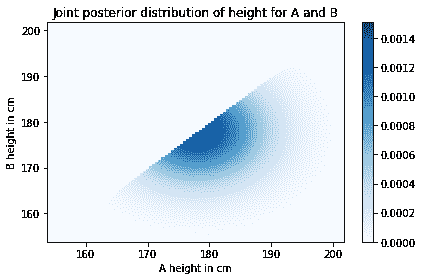

所有`B`比`A`高的对都被消除了。后验的其余部分看起来与先验相同，只是已经被重新归一化。

## 边缘分布

联合后验分布表示了我们对`A`和`B`的身高的信念，考虑到先验分布和`A`更高的信息。

从这个联合分布中，我们可以计算`A`和`B`的后验分布。要了解如何做到这一点，让我们从一个更简单的问题开始。

假设我们想知道`A`身高为 180 厘米的概率。我们可以从联合分布中选择`x=180`的列。

```py
column = posterior[180]
column.head() 
```

```py
154.0    0.000010
154.5    0.000013
155.0    0.000015
155.5    0.000019
156.0    0.000022
Name: 180.0, dtype: float64 
```

这一列包含了所有`x=180`的后验概率；如果我们把它们加起来，我们就得到了`A`身高为 180 厘米的总概率。

```py
column.sum() 
```

```py
0.03017221271570807 
```

大约是 3%。

现在，要获得`A`的身高的后验分布，我们可以将所有列相加，就像这样：

```py
column_sums = posterior.sum(axis=0)
column_sums.head() 
```

```py
154.0    0.000000e+00
154.5    1.012260e-07
155.0    2.736152e-07
155.5    5.532519e-07
156.0    9.915650e-07
dtype: float64 
```

参数`axis=0`表示我们要将列相加。

结果是一个包含`A`的每个可能身高及其概率的`Series`。换句话说，这是`A`的身高分布。

我们可以这样放入`Pmf`中：

```py
marginal_A = Pmf(column_sums) 
```

当我们从联合分布中提取单个变量的分布时，结果称为**边缘分布**。这个名字来自一个常见的可视化，它在中间显示联合分布，边缘分布在边缘显示。

这是`A`的边缘分布的样子：

显示代码单元格源代码 隐藏代码单元格源代码

```py
marginal_A.plot(label='Posterior for A')

decorate(xlabel='Height in cm',
         ylabel='PDF',
         title='Posterior distribution for A') 
``` 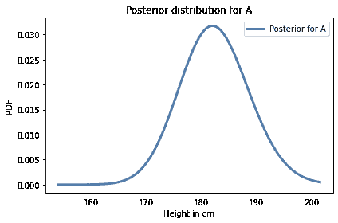

类似地，我们可以通过将行相加并将结果放入`Pmf`中来获得`B`的身高的后验分布。

```py
row_sums = posterior.sum(axis=1)
marginal_B = Pmf(row_sums) 
```

这是它的样子。

```py
marginal_B.plot(label='Posterior for B', color='C1')

decorate(xlabel='Height in cm',
         ylabel='PDF',
         title='Posterior distribution for B') 
```

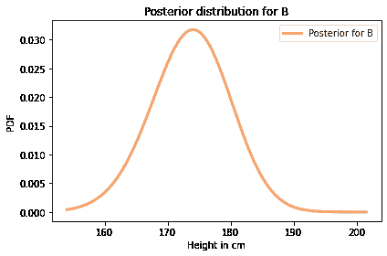

让我们把这一节的代码放在一个函数中：

```py
def marginal(joint, axis):
  """Compute a marginal distribution."""
    return Pmf(joint.sum(axis=axis)) 
```

`marginal`的参数是一个联合分布和一个轴编号：

+   如果 `axis=0`，它返回第一个变量（x 轴上的变量）的边际；

+   如果 `axis=1`，它返回第二个变量（y 轴上的变量）的边缘。

因此，我们可以这样计算两个边缘：

```py
marginal_A = marginal(posterior, axis=0)
marginal_B = marginal(posterior, axis=1) 
```

这是它们的样子，以及先验。

显示代码单元格源代码 隐藏代码单元格源代码

```py
prior.plot(style='--', label='Prior', color='C5')
marginal_A.plot(label='Posterior for A')
marginal_B.plot(label='Posterior for B')

decorate(xlabel='Height in cm',
         ylabel='PDF',
         title='Prior and posterior distributions for A and B') 
``` 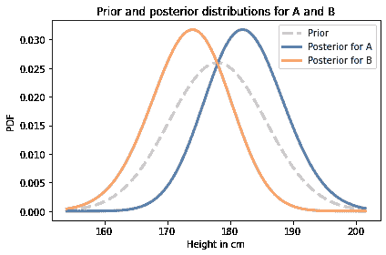

正如你所预期的，`A`的后验分布向右移动，`B`的后验分布向左移动。

我们可以通过计算后验均值来总结结果：

```py
prior.mean() 
```

```py
177.99516026921506 
```

```py
print(marginal_A.mean(), marginal_B.mean()) 
```

```py
182.3872812342168 173.6028600023339 
```

基于`A`比`B`高的观察，我们倾向于相信`A`比平均身高稍高，而`B`则稍矮。

注意，后验分布比先验分布略窄。我们可以通过计算它们的标准差来量化。

```py
prior.std() 
```

```py
7.624924796641578 
```

```py
print(marginal_A.std(), marginal_B.std()) 
```

```py
6.270461177645469 6.280513548175111 
```

后验分布的标准差略小，这意味着在比较后，我们对`A`和`B`的身高更加确定。

## 条件后验

现在假设我们测量`A`，发现他身高 170 厘米。这对我们有什么影响呢？

在联合分布中，每一列对应`A`可能的身高。我们可以这样选择对应于 170 厘米身高的列：

```py
column_170 = posterior[170] 
```

结果是一个代表`B`可能身高及其相对可能性的`Series`。这些可能性没有被归一化，但我们可以这样归一化它们：

```py
cond_B = Pmf(column_170)
cond_B.normalize() 
```

```py
0.004358061205454471 
```

通过默认情况下，制作`Pmf`会复制数据，因此我们可以在不影响`column_170`或`posterior`的情况下对`cond_B`进行归一化。结果是给定`A`身高为 170 厘米的`B`的条件分布。

这就是它的样子：

显示代码单元格源代码 隐藏代码单元格源代码

```py
prior.plot(style='--', label='Prior', color='C5')
marginal_B.plot(label='Posterior for B', color='C1')
cond_B.plot(label='Conditional posterior for B', 
            color='C4')

decorate(xlabel='Height in cm',
         ylabel='PDF',
         title='Prior, posterior and conditional distribution for B') 
``` 

条件后验分布被截断在 170 厘米，因为我们已经确定`B`比`A`矮，而`A`是 170 厘米。

## 依赖和独立

当我们构建联合先验分布时，我说`A`和`B`的身高是独立的，这意味着知道其中一个不会提供关于另一个的信息。换句话说，条件概率$P(A_x | B_y)$与无条件概率$P(A_x)$相同。

但在后验分布中，$A$和$B$不是独立的。如果我们知道`A`比`B`高，并且我们知道`A`有多高，那么这就给了我们关于`B`的信息。

我们刚刚计算的条件分布展示了这种依赖关系。

## 总结

在本章中，我们从“外部”操作开始，比如外积，用它来构建联合分布。

一般来说，你不能从两个边缘分布构建联合分布，但在分布独立的特殊情况下，你可以。

我们扩展了贝叶斯更新过程，并将其应用于联合分布。然后从后验联合分布中提取了边缘后验分布和条件后验分布。

作为练习，你将有机会将相同的过程应用于一个稍微困难但更有用的问题，根据比赛结果更新国际象棋选手的等级。

## 练习

**练习：**根据前面例子的结果，计算给定`B`身高为 180 厘米时`A`的后验条件分布。

提示：使用`loc`从`DataFrame`中选择一行。


```py
# Solution

# Select a row from the posterior and normalize it

row_180 = posterior.loc[180]
cond_A = Pmf(row_180)
cond_A.normalize() 
```

```py
0.019669089649708035 
``` 

```py
# Solution

# Here's what it looks like

cond_A.plot(label='Posterior for A given B=180', color='C4')
decorate(xlabel='Height in cm',
         ylabel='PDF',
         title='Conditional distribution for A') 
```

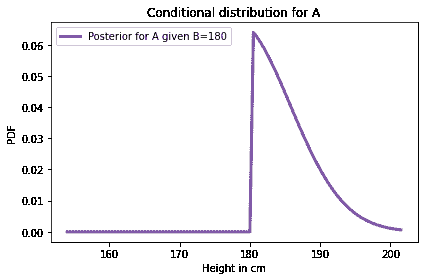

**练习：**假设我们已经确定`A`比`B`高，但我们不知道`B`有多高。现在我们选择一个随机女性`C`，发现她比`A`矮至少 15 厘米。计算`A`和`C`的身高的后验分布。

美国女性的平均身高为 163 厘米；标准差为 7.3 厘米。

显示代码单元格内容隐藏代码单元格内容

```py
# Solution

# Here's a prior distribution for the height of
# a randomly chosen woman

mean = 163
qs = np.arange(mean-24, mean+24, 0.5)

std = 7.3
ps = norm(mean, std).pdf(qs)

prior_C = Pmf(ps, qs)
prior_C.normalize() 
```

```py
1.997970387889823 
``` 显示代码单元格内容隐藏代码单元格内容

```py
# Solution

# Here's the joint prior for A and C

joint_AC = make_joint(marginal_A, prior_C)
joint_AC.shape 
```

```py
(96, 96) 
``` 显示代码单元格内容隐藏代码单元格内容

```py
# Solution

# To compute the likelihood of the data, we'll
# use a meshgrid

x = joint_AC.columns
y = joint_AC.index
X, Y = np.meshgrid(x, y)
a = np.where(X-Y>=15, 1, 0)
likelihood_AC = pd.DataFrame(a, index=y, columns=x) 
``` 显示代码单元格内容隐藏代码单元格内容

```py
# Solution

# Here's what the likelihood looks like

plot_joint(likelihood_AC, cmap='Oranges')
decorate(ylabel='C height in cm',
         title='Likelihood of A-C>=15') 
```

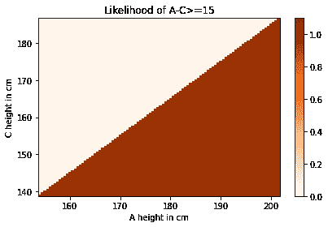显示代码单元格内容隐藏代码单元格内容

```py
# Solution

# Here's the update

posterior_AC = joint_AC * likelihood_AC
normalize(posterior_AC) 
```

```py
0.6839061829242195 
``` 显示代码单元格内容隐藏代码单元格内容

```py
# Solution

# And the joint posterior

plot_joint(posterior_AC)
decorate(ylabel='C height in cm',
         title='Joint posterior distribution of height for A and C') 
```

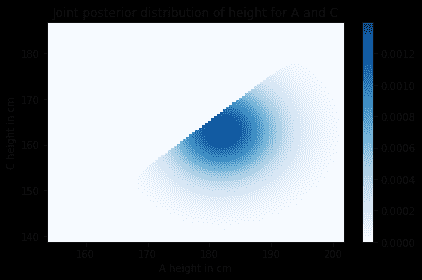显示代码单元格内容隐藏代码单元格内容

```py
# Solution

# Here are the marginal posterior distributions

marginal_AC = marginal(posterior_AC, axis=0)
marginal_C = marginal(posterior_AC, axis=1) 
``` 显示代码单元格内容隐藏代码单元格内容

```py
# Solution

# And here's what they look like

prior_C.plot(style='--', label='Prior for C', color='C5')
marginal_C.plot(label='Posterior for C', color='C2')
marginal_AC.plot(label='Posterior for A', color='C0')

decorate(xlabel='Height in cm',
         ylabel='PDF',
         title='Prior and posterior distributions for A and C') 
```

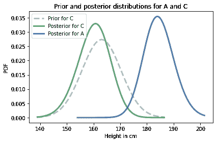

练习：[Elo 评级系统](https://en.wikipedia.org/wiki/Elo_rating_system)是一种量化国际象棋等游戏玩家技能水平的方法。

它基于玩家评级和游戏结果之间关系的模型。具体来说，如果$R_A$是玩家`A`的评级，$R_B$是玩家`B`的评级，那么`A`击败`B`的概率由[逻辑函数](https://en.wikipedia.org/wiki/Logistic_function)给出：

$$P(\mathrm{A~beats~B}) = \frac{1}{1 + 10^{(R_B-R_A)/400}}$$

参数 10 和 400 是确定评级范围的任意选择。在国际象棋中，范围是从 100 到 2800。

注意，获胜的概率仅取决于排名的差异。例如，如果$R_A$超过$R_B$100 分，`A`获胜的概率是

```py
1 / (1 + 10**(-100/400)) 
```

```py
0.6400649998028851 
```

假设`A`当前评级为 1600，但我们不确定其准确性。我们可以用均值为 1600，标准差为 100 的正态分布描述他们的真实评级，以表明我们的不确定性。

假设`B`当前评级为 1800，不确定性水平相同。

然后`A`和`B`进行比赛，`A`获胜。我们应该如何更新他们的评级？

回答这个问题：

1.  为`A`和`B`构建先验分布。

1.  使用它们构建联合分布，假设先验分布是独立的。

1.  使用上面的逻辑函数计算每个联合假设下结果的似然。

1.  使用联合先验和似然来计算联合后验。

1.  提取并绘制`A`和`B`的边际后验。

1.  计算`A`和`B`的后验均值。根据这个结果，他们的评级应该改变多少？

显示代码单元格内容隐藏代码单元格内容

```py
# Solution

# Here are the priors for A and B

qs = np.arange(1300, 1900, 10)
ps = norm(1600, 100).pdf(qs)
prior_A_elo = Pmf(ps, qs)
prior_A_elo.normalize()

qs = np.arange(1500, 2100, 10)
ps = norm(1800, 100).pdf(qs)
prior_B_elo = Pmf(ps, qs)
prior_B_elo.normalize() 
```

```py
0.09972780668486173 
``` 显示代码单元格内容隐藏代码单元格内容

```py
# Solution

# Here's what the priors look like

prior_A_elo.plot(style='--', label='Prior for A')
prior_B_elo.plot(style='--', label='Prior for B')

decorate(xlabel='Elo rating',
         ylabel='PDF',
         title='Prior distributions for A and B') 
```

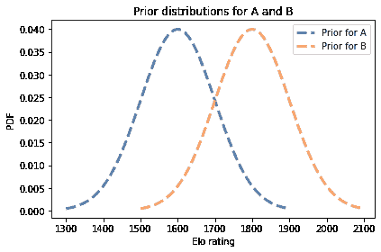显示代码单元格内容隐藏代码单元格内容

```py
# Solution

# Here is the joint prior distribution

joint_elo = make_joint(prior_A_elo, prior_B_elo)
joint_elo.shape 
```

```py
(60, 60) 
``` 

```py
# Solution

# And here's what it looks like

plot_joint(joint_elo)
decorate(xlabel='A rating',
         ylabel='B rating') 
```

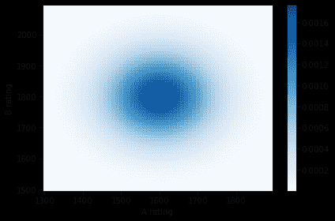

```py
# Solution

# Here's a meshgrid we can use to compute differences in rank

x = joint_elo.columns
y = joint_elo.index
X, Y = np.meshgrid(x, y)
diff = X - Y 
``` 

```py
# Solution

# And here are the likelihoods

a = 1 / (1 + 10**(-diff/400))
likelihood_elo = pd.DataFrame(a, columns=x, index=y)

plot_joint(likelihood_elo, cmap='Oranges')   
decorate(xlabel='A rating',
         ylabel='B rating') 
```

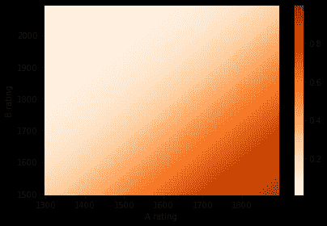

```py
# Solution

# Here's the update

posterior_elo = joint_elo * likelihood_elo
normalize(posterior_elo) 
```

```py
0.2660426288107942 
``` 

```py
# Solution

# Here's what the joint posterior looks like

plot_joint(posterior_elo)   
decorate(xlabel='A rating',
         ylabel='B rating') 
```

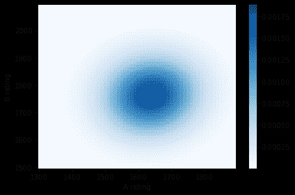

```py
# Solution

# Here are the marginal posterior distributions

marginal_A_elo = marginal(posterior_elo, axis=0)
marginal_B_elo = marginal(posterior_elo, axis=1) 
``` 

```py
# Solution

# Here's what they look like

marginal_A_elo.plot(label='Posterior for A')
marginal_B_elo.plot(label='Posterior for B')

decorate(xlabel='Elo rating',
         ylabel='PDF',
         title='Posterior distributions for A and B') 
```

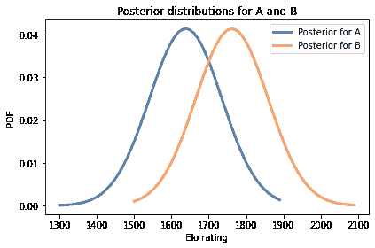

```py
# Solution

# Posterior means

marginal_A_elo.mean(), marginal_B_elo.mean() 
```

```py
(1636.648345528236, 1763.0203078793095) 
``` 

```py
# Solution

# Posterior standard deviation

marginal_A_elo.std(), marginal_B_elo.std() 
```

```py
(95.34063582447712, 95.61569535990881) 
```
