# 第十二章：分类

> 原文：[`allendowney.github.io/ThinkBayes2/chap12.html`](https://allendowney.github.io/ThinkBayes2/chap12.html)
> 
> 译者：[飞龙](https://github.com/wizardforcel)
> 
> 协议：[CC BY-NC-SA 4.0](http://creativecommons.org/licenses/by-nc-sa/4.0/)


分类可能是贝叶斯方法最著名的应用，它在 1990 年代作为第一代[垃圾邮件过滤器](https://en.wikipedia.org/wiki/Naive_Bayes_spam_filtering)的基础而闻名。

在本章中，我将演示使用由 Kristen Gorman 博士在南极洲帕尔默长期生态研究站收集并提供的数据进行贝叶斯分类（请参见 Gorman、Williams 和 Fraser 的[“南极企鹅（*Pygoscelis*属）群落中的生态性异形和环境变异”](https://journals.plos.org/plosone/article?id=10.1371/journal.pone.0090081)，2014 年 3 月）。我们将使用这些数据对企鹅进行物种分类。

## 企鹅数据

我将使用 Pandas 将数据加载到`DataFrame`中。

```py
import pandas as pd

df = pd.read_csv('penguins_raw.csv').dropna(subset=['Body Mass (g)'])
df.shape 
```

```py
(342, 17) 
```

数据集中每只企鹅一行，每个变量一列。

<details class="hide above-input"><summary aria-label="Toggle hidden content">Show code cell content Hide code cell content</summary>

```py
df.head() 
```

|  | studyName | Sample Number | Species | Region | Island | Stage | Individual ID | Clutch Completion | Date Egg | Culmen Length (mm) | Culmen Depth (mm) | Flipper Length (mm) | Body Mass (g) | Sex | Delta 15 N (o/oo) | Delta 13 C (o/oo) | Comments |
| --- | --- | --- | --- | --- | --- | --- | --- | --- | --- | --- | --- | --- | --- | --- | --- | --- | --- |
| 0 | PAL0708 | 1 | Adelie Penguin (Pygoscelis adeliae) | Anvers | Torgersen | Adult, 1 Egg Stage | N1A1 | Yes | 2007-11-11 | 39.1 | 18.7 | 181.0 | 3750.0 | MALE | NaN | NaN | Not enough blood for isotopes. |
| 1 | PAL0708 | 2 | Adelie Penguin (Pygoscelis adeliae) | Anvers | Torgersen | Adult, 1 Egg Stage | N1A2 | Yes | 2007-11-11 | 39.5 | 17.4 | 186.0 | 3800.0 | FEMALE | 8.94956 | -24.69454 | NaN |
| 2 | PAL0708 | 3 | Adelie Penguin (Pygoscelis adeliae) | Anvers | Torgersen | Adult, 1 Egg Stage | N2A1 | Yes | 2007-11-16 | 40.3 | 18.0 | 195.0 | 3250.0 | FEMALE | 8.36821 | -25.33302 | NaN |
| 4 | PAL0708 | 5 | Adelie Penguin (Pygoscelis adeliae) | Anvers | Torgersen | Adult, 1 Egg Stage | N3A1 | Yes | 2007-11-16 | 36.7 | 19.3 | 193.0 | 3450.0 | FEMALE | 8.76651 | -25.32426 | NaN |

| 5 | PAL0708 | 6 | Adelie Penguin (Pygoscelis adeliae) | Anvers | Torgersen | Adult, 1 Egg Stage | N3A2 | Yes | 2007-11-16 | 39.3 | 20.6 | 190.0 | 3650.0 | MALE | 8.66496 | -25.29805 | NaN |</details>

数据集中包含三种企鹅：阿德利企鹅、燕鸥企鹅和根趾企鹅。

我们将使用的测量值是：

+   以克（g）为单位的体重。

+   以毫米（mm）为单位的鳍长。

+   以毫米为单位的 culmen 长度。

+   以毫米为单位的 culmen 深度。

如果您对“culmen”一词不熟悉，它指的是[鸟嘴的顶部边缘](https://en.wikipedia.org/wiki/Bird_measurement#Culmen)。

如果物种之间存在实质差异并且物种内变异较小，则这些测量将对分类最有用。为了查看这一点是否成立，以及程度如何，我将为每个物种的每个测量绘制累积分布函数（CDF）。

以下函数接受`DataFrame`和列名。它返回一个字典，将每个物种名称映射到名为`colname`的列中值的`Cdf`。

```py
def make_cdf_map(df, colname, by='Species2'):
  """Make a CDF for each species."""
    cdf_map = {}
    grouped = df.groupby(by)[colname]
    for species, group in grouped:
        cdf_map[species] = Cdf.from_seq(group, name=species)
    return cdf_map 
```

以下函数绘制了给定列中每个物种的`Cdf`：

<details class="hide above-input"><summary aria-label="Toggle hidden content">Show code cell content Hide code cell content</summary>

```py
from empiricaldist import Cdf
from utils import decorate

def plot_cdfs(df, colname, by='Species2'):
  """Make a CDF for each species.

 df: DataFrame
 colname: string column name
 by: string column name

 returns: dictionary from species name to Cdf
 """
    cdf_map = make_cdf_map(df, colname, by)

    for species, cdf in cdf_map.items():
        cdf.plot(label=species, marker='')

    decorate(xlabel=colname,
             ylabel='CDF') 
```</details>

以下是 culmen 长度的分布。

<details class="hide above-input"><summary aria-label="Toggle hidden content">Show code cell source Hide code cell source</summary>

```py
colname = 'Culmen Length (mm)'
plot_cdfs(df, colname) 
```</details> 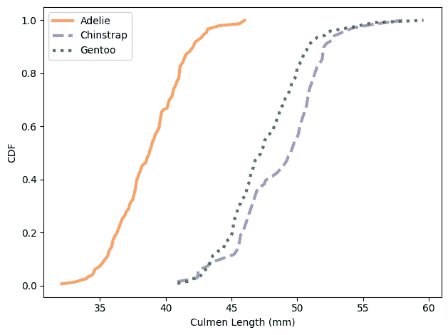

看起来我们可以使用 Culmen 长度来识别 Adélie 企鹅，但其他两个物种的分布几乎完全重叠。

这是翻转长度的分布。

<details class="hide above-input"><summary aria-label="Toggle hidden content">显示代码单元格源代码隐藏代码单元格源代码</summary>

```py
colname = 'Flipper Length (mm)'
plot_cdfs(df, colname) 
```</details> 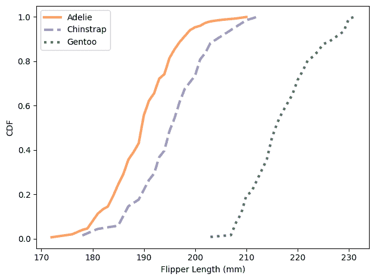

使用翻转长度，我们可以将 Gentoo 企鹅与其他两个物种区分开来。因此，只有这两个特征，似乎我们应该能够以一定的准确度对企鹅进行分类。

所有这些 CDF 都显示了正态分布的 S 形特征；我将在下一节中利用这一观察结果。

这是 Culmen 深度的分布。

<details class="hide above-input"><summary aria-label="Toggle hidden content">显示代码单元格内容隐藏代码单元格内容</summary>

```py
colname = 'Culmen Depth (mm)'
plot_cdfs(df, colname) 
```

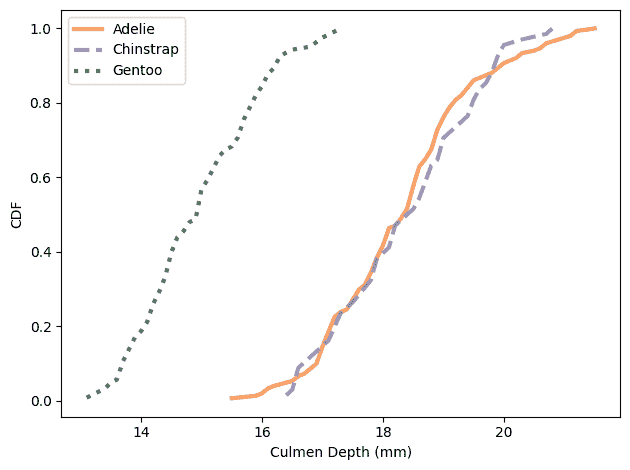</details>

这是体重的分布。

<details class="hide above-input"><summary aria-label="Toggle hidden content">显示代码单元格内容隐藏代码单元格内容</summary>

```py
colname = 'Body Mass (g)'
plot_cdfs(df, colname) 
```

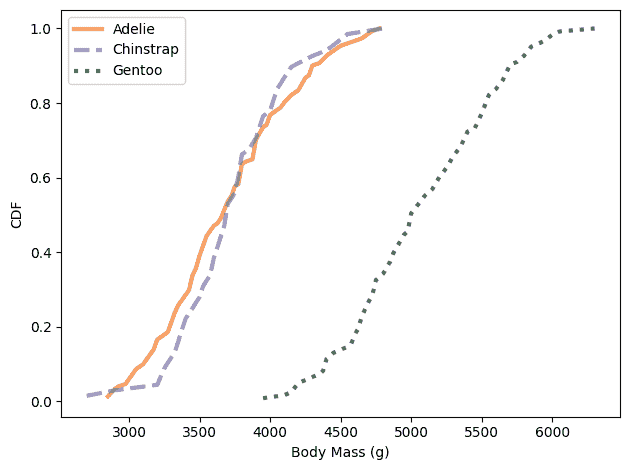</details>

Culmen 深度和体重可以将 Gentoo 企鹅与其他两个物种区分开来，但这些特征可能并没有提供太多额外的信息，超出我们从翻转长度和 Culmen 长度中获得的信息。

## 正态模型

让我们使用这些特征来对企鹅进行分类。我们将按照通常的贝叶斯方式进行：

1.  使用三种可能的物种和每种物种的先验概率定义一个先验分布，

1.  计算每个假设物种的数据可能性，然后

1.  计算每个假设的后验概率。

为了计算每个假设下数据的可能性，我将使用数据来估计每个物种的正态分布的参数。

以下函数接受一个`DataFrame`和一个列名；它返回一个从每个物种名称到`norm`对象的映射的字典。

`norm`在 SciPy 中定义；它表示具有给定均值和标准差的正态分布。

```py
from scipy.stats import norm

def make_norm_map(df, colname, by='Species2'):
  """Make a map from species to norm object."""
    norm_map = {}
    grouped = df.groupby(by)[colname]
    for species, group in grouped:
        mean = group.mean()
        std = group.std()
        norm_map[species] = norm(mean, std)
    return norm_map 
```

例如，这是翻转长度的`norm`对象字典：

```py
flipper_map = make_norm_map(df, 'Flipper Length (mm)')
flipper_map.keys() 
```

```py
dict_keys(['Adelie', 'Chinstrap', 'Gentoo']) 
```

现在假设我们测量一只企鹅，发现它的翻转长度为 193 厘米。在每个假设下，这个测量的概率是多少？

`norm`对象提供`pdf`，它计算正态分布的概率密度函数（PDF）。我们可以使用它来计算在给定分布中观察到的数据的可能性。

```py
data = 193
flipper_map['Adelie'].pdf(data) 
```

```py
0.054732511875530694 
```

结果是概率密度，因此我们不能将其解释为概率。但它与数据的可能性成正比，因此我们可以使用它来更新先验。

这是我们如何计算每个分布中数据的可能性。

```py
hypos = flipper_map.keys()
likelihood = [flipper_map[hypo].pdf(data) for hypo in hypos]
likelihood 
```

```py
[0.054732511875530694, 0.051721356158881626, 5.866045366199098e-05] 
```

现在我们准备好进行更新了。

## 更新

像往常一样，我将使用`Pmf`来表示先验分布。为简单起见，让我们假设这三种物种是等可能的。

```py
from empiricaldist import Pmf

prior = Pmf(1/3, hypos)
prior 
```

|  | probs |
| --- | --- |
| Adelie | 0.333333 |
| Chinstrap | 0.333333 |
| Gentoo | 0.333333 |

现在我们可以按照通常的方式进行更新。

```py
posterior = prior * likelihood
posterior.normalize()
posterior 
```

|  | probs |
| --- | --- |
| Adelie | 0.513860 |
| Chinstrap | 0.485589 |
| Gentoo | 0.000551 |

一只翻转长度为 193 毫米的企鹅不太可能是 Gentoo，但可能是 Adélie 或 Chinstrap（假设在测量之前这三种物种是等可能的）。

以下函数封装了我们刚刚运行的步骤。它接受一个代表先验分布的`Pmf`，观察到的数据，以及从每个假设到特征分布的映射。

```py
def update_penguin(prior, data, norm_map):
  """Update hypothetical species."""
    hypos = prior.qs
    likelihood = [norm_map[hypo].pdf(data) for hypo in hypos]
    posterior = prior * likelihood
    posterior.normalize()
    return posterior 
```

返回值是后验分布。

这是先前的例子，再次使用`update_penguin`：

```py
posterior1 = update_penguin(prior, 193, flipper_map)
posterior1 
```

|  | probs |
| --- | --- |
| Adelie | 0.513860 |
| Chinstrap | 0.485589 |
| Gentoo 0.000551 |

正如我们在 CDF 中看到的，鳍长并不能很好地区分 Adélie 和 Chinstrap 企鹅。

但是冠长*可以*做出这种区分，所以让我们使用它进行第二轮分类。首先我们估计每个物种的冠长分布如下：

```py
culmen_map = make_norm_map(df, 'Culmen Length (mm)') 
```

现在假设我们看到一只冠长为 48 毫米的企鹅。我们可以使用这些数据来更新先验。

```py
posterior2 = update_penguin(prior, 48, culmen_map)
posterior2 
```

|  | 概率 |
| --- | --- |
| Adelie | 0.001557 |
| Chinstrap | 0.474658 |
| Gentoo 0.523785 |

一只冠长为 48 毫米的企鹅几乎同样有可能是 Chinstrap 或 Gentoo。

一次使用一个特征，我们通常可以排除一种或另一种物种，但通常无法确定物种。使用多个特征可以做得更好。

## 朴素贝叶斯分类

为了更容易进行多次更新，我将使用以下函数，它接受一个先验`Pmf`、一系列测量和相应的一系列包含估计分布的字典。

```py
def update_naive(prior, data_seq, norm_maps):
  """Naive Bayesian classifier

 prior: Pmf
 data_seq: sequence of measurements
 norm_maps: sequence of maps from species to distribution

 returns: Pmf representing the posterior distribution
 """
    posterior = prior.copy()
    for data, norm_map in zip(data_seq, norm_maps):
        posterior = update_penguin(posterior, data, norm_map)
    return posterior 
```

它执行一系列更新，一次使用一个变量，并返回后验`Pmf`。

为了测试它，我将使用我们在上一节中看到的相同特征：冠长和鳍长。

```py
colnames = ['Flipper Length (mm)', 'Culmen Length (mm)']
norm_maps = [flipper_map, culmen_map] 
```

现在假设我们找到一只鳍长为 193 毫米，冠长为 48 毫米的企鹅。这是更新：

```py
data_seq = 193, 48
posterior = update_naive(prior, data_seq, norm_maps)
posterior 
```

|  | 概率 |
| --- | --- |
| Adelie 0.003455 |
| Chinstrap 0.995299 |
| Gentoo 0.001246 |

它几乎肯定是 Chinstrap。

```py
posterior.max_prob() 
```

```py
'Chinstrap' 
```

我们可以循环遍历数据集，并使用这两个特征对每只企鹅进行分类。

```py
import numpy as np

df['Classification'] = "None"

for i, row in df.iterrows():
    data_seq = row[colnames]
    posterior = update_naive(prior, data_seq, norm_maps)
    df.loc[i, 'Classification'] = posterior.max_prob() 
```

这个循环向`DataFrame`添加了一个名为`Classification`的列；它包含了每只企鹅的最大后验概率的物种。

所以让我们看看我们有多少是正确的。

<details class="hide above-input"><summary aria-label="Toggle hidden content">显示代码单元格内容 隐藏代码单元格内容</summary>

```py
len(df) 
```

```py
342 
```</details>

```py
valid = df['Classification'].notna()
valid.sum() 
```

```py
342 
```

```py
same = df['Species2'] == df['Classification']
same.sum() 
```

```py
324 
```

数据集中有 344 只企鹅，但其中两只企鹅的测量值丢失了，所以我们有 342 个有效案例。其中，有 324 个被正确分类，几乎是 95%。

```py
same.sum() / valid.sum() 
```

```py
0.9473684210526315 
```

以下函数封装了这些步骤。

```py
def accuracy(df):
  """Compute the accuracy of classification."""
    valid = df['Classification'].notna()
    same = df['Species2'] == df['Classification']
    return same.sum() / valid.sum() 
```

我们在本节中使用的分类器被称为“朴素”，因为它忽略了特征之间的相关性。为了看到这为什么重要，我将制作一个不那么朴素的分类器：一个考虑特征的联合分布的分类器。

## 联合分布

我将从制作数据的散点图开始。

```py
import matplotlib.pyplot as plt

def scatterplot(df, var1, var2):
  """Make a scatter plot."""
    grouped = df.groupby('Species2')
    for species, group in grouped:
        plt.plot(group[var1], group[var2],
                 label=species, ls="None", alpha=0.3)

    decorate(xlabel=var1, ylabel=var2) 
```

这是三种物种的冠长和鳍长的散点图。

```py
var1 = 'Flipper Length (mm)'
var2 = 'Culmen Length (mm)'
scatterplot(df, var1, var2) 
```

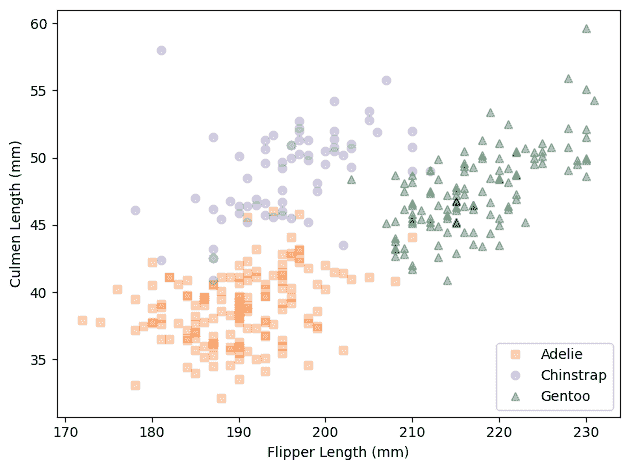

在每个物种内，这些测量的联合分布形成椭圆形，至少大致如此。椭圆的方向沿对角线，这表明冠长和鳍长之间存在相关性。

如果我们忽略这些相关性，我们假设这些特征是独立的。为了看看这是什么样子，我将假设每个物种的联合分布是独立的。

以下函数制作了一个近似正态分布的离散`Pmf`。

```py
def make_pmf_norm(dist, sigmas=3, n=101):
  """Make a Pmf approximation to a normal distribution."""
    mean, std = dist.mean(), dist.std()
    low = mean - sigmas * std
    high = mean + sigmas * std
    qs = np.linspace(low, high, n)
    ps = dist.pdf(qs)
    pmf = Pmf(ps, qs)
    pmf.normalize()
    return pmf 
```

我们可以使用它和`make_joint`来为每个物种制作冠长和鳍长的联合分布。

```py
from utils import make_joint

joint_map = {}
for species in hypos:
    pmf1 = make_pmf_norm(flipper_map[species])
    pmf2 = make_pmf_norm(culmen_map[species])
    joint_map[species] = make_joint(pmf1, pmf2) 
```

以下图比较了数据的散点图和联合分布的轮廓，假设它们是独立的。

```py
from utils import plot_contour

scatterplot(df, var1, var2)
for species in hypos:
    plot_contour(joint_map[species], alpha=0.5) 
```

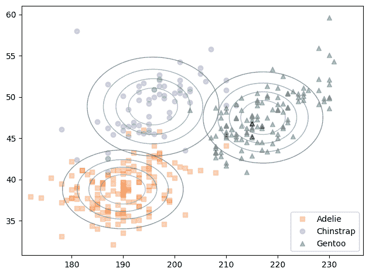

联合正态分布的轮廓形成椭圆。在这个例子中，因为特征是不相关的，椭圆与坐标轴对齐。但它们与数据不太对齐。

我们可以对数据进行更好的建模，并使用多元正态分布来计算更好的似然。

## 多元正态分布

正如我们所见，单变量正态分布的特征是由其均值和标准差来表征的。

多元正态分布的特征是特征的均值和**协方差矩阵**，其中包含**方差**，用于量化特征的扩展，以及**协方差**，用于量化它们之间的关系。

我们可以使用数据来估计企鹅种群的均值和协方差矩阵。首先我会选择我们想要的列。

```py
features = df[[var1, var2]] 
```

并计算均值。

```py
mean = features.mean()
mean 
```

```py
Flipper Length (mm)    200.915205
Culmen Length (mm)      43.921930
dtype: float64 
```

我们还可以计算协方差矩阵：

```py
cov = features.cov()
cov 
```

|  | 脚蹼长度（mm） | 喙长度（mm） |
| --- | --- | --- |
| 脚蹼长度（mm） | 197.731792 | 50.375765 |
| 喙长度（mm） | 50.375765 | 29.807054 |

结果是一个`DataFrame`，每个特征都有一行和一列。对角线上的元素是方差；对角线外的元素是协方差。

单独来看，方差和协方差很难解释。我们可以使用它们来计算标准差和相关系数，这样更容易解释，但是这种计算的细节现在并不重要。

相反，我们将把协方差矩阵传递给`multivariate_normal`，这是一个 SciPy 函数，它创建一个表示多元正态分布的对象。

作为参数，它接受一系列均值和一个协方差矩阵：

```py
from scipy.stats import multivariate_normal

multinorm = multivariate_normal(mean, cov) 
```

以下函数为每个物种创建一个`multivariate_normal`对象。

```py
def make_multinorm_map(df, colnames):
  """Make a map from each species to a multivariate normal."""
    multinorm_map = {}
    grouped = df.groupby('Species2')
    for species, group in grouped:
        features = group[colnames]
        mean = features.mean()
        cov = features.cov()
        multinorm_map[species] = multivariate_normal(mean, cov)
    return multinorm_map 
```

这是我们为前两个特征，脚蹼长度和喙长度制作这张地图的方法。

```py
multinorm_map = make_multinorm_map(df, [var1, var2]) 
```

## 可视化多元正态分布

本节使用一些 NumPy 魔术来生成多元正态分布的轮廓图。如果这对您有兴趣，太好了！否则，可以直接跳到结果。在下一节中，我们将进行实际的分类，结果证明比可视化更容易。

我将首先制作一个轮廓图，显示 Adélie 企鹅特征的分布。

这里是我们将使用的两个特征的单变量分布和我们刚刚计算的多元分布。

<details class="hide above-input"><summary aria-label="Toggle hidden content">显示代码单元格内容 隐藏代码单元格内容</summary>

```py
norm1 = flipper_map['Adelie']
norm2 = culmen_map['Adelie']
multinorm = multinorm_map['Adelie'] 
```</details>

我将为每个单变量分布制作一个离散的`Pmf`近似。

<details class="hide above-input"><summary aria-label="Toggle hidden content">显示代码单元格内容 隐藏代码单元格内容</summary>

```py
pmf1 = make_pmf_norm(norm1)
pmf2 = make_pmf_norm(norm2) 
```</details>

并使用它们制作一个包含所有值对的网格。

<details class="hide above-input"><summary aria-label="Toggle hidden content">显示代码单元格内容 隐藏代码单元格内容</summary>

```py
X, Y = np.meshgrid(pmf1.qs, pmf2.qs)
X.shape 
```

```py
(101, 101) 
```</details>

网格由两个数组表示：第一个包含沿`x`轴的`pmf1`的数量；第二个包含沿`y`轴的`pmf2`的数量。

为了评估每对值的多元分布，我们必须“堆叠”数组。

<details class="hide above-input"><summary aria-label="Toggle hidden content">显示代码单元格内容 隐藏代码单元格内容</summary>

```py
pos = np.dstack((X, Y))
pos.shape 
```

```py
(101, 101, 2) 
```</details>

结果是一个 3-D 数组，你可以把它看作是一对二维数组。当我们将这个数组传递给`multinorm.pdf`时，它会评估每对值的分布的概率密度函数。

<details class="hide above-input"><summary aria-label="Toggle hidden content">显示代码单元格内容 隐藏代码单元格内容</summary>

```py
densities = multinorm.pdf(pos)
densities.shape 
```

```py
(101, 101) 
```</details>

结果是一个概率密度数组。如果我们把它们放在一个`DataFrame`中并对它们进行归一化，结果就是两个特征的联合分布的离散近似。

<details class="hide above-input"><summary aria-label="Toggle hidden content">显示代码单元格内容 隐藏代码单元格内容</summary>

```py
from utils import normalize

joint = pd.DataFrame(densities, columns=pmf1.qs, index=pmf2.qs)
normalize(joint) 
```

```py
15.87134363991382 
```</details>

这是结果的样子。

<details class="hide above-input"><summary aria-label="Toggle hidden content">显示代码单元格内容 隐藏代码单元格内容</summary>

```py
plot_contour(joint)
decorate(xlabel=var1,
         ylabel=var2) 
```

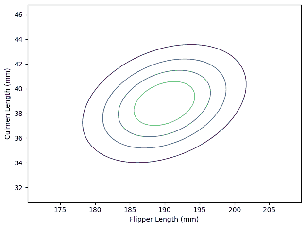</details>

多元正态分布的轮廓仍然是椭圆形，但现在我们已经考虑了特征之间的相关性，这些椭圆不再与坐标轴对齐。

以下函数封装了我们刚刚做的步骤。

<details class="hide above-input"><summary aria-label="切换隐藏内容">显示代码单元格内容 隐藏代码单元格内容</summary>

```py
def make_joint(norm1, norm2, multinorm):
  """Make a joint distribution.

 norm1: `norm` object representing the distribution of the first feature
 norm2: `norm` object representing the distribution of the second feature
 multinorm: `multivariate_normal` object representing the joint distribution
 """
    pmf1 = make_pmf_norm(norm1)
    pmf2 = make_pmf_norm(norm2)
    X, Y = np.meshgrid(pmf1.qs, pmf2.qs)
    pos = np.dstack((X, Y))
    densities = multinorm.pdf(pos)
    joint = pd.DataFrame(densities, columns=pmf1.qs, index=pmf2.qs)
    return joint 
```</details>

以下图显示了数据的散点图以及每个物种多元正态分布的轮廓。

<details class="hide above-input"><summary aria-label="切换隐藏内容">显示代码单元格源代码 隐藏代码单元格源代码</summary>

```py
scatterplot(df, var1, var2)

for species in hypos:
    norm1 = flipper_map[species]
    norm2 = culmen_map[species]
    multinorm = multinorm_map[species]
    joint = make_joint(norm1, norm2, multinorm)
    plot_contour(joint, alpha=0.5) 
```</details> 

因为多元正态分布考虑了特征之间的相关性，它是数据的更好模型。而且三个分布的轮廓重叠较少，这表明它们应该产生更好的分类。

## 一个不那么朴素的分类器

在之前的一节中，我们使用`update_penguin`根据观察到的数据和模拟每个假设下观察分布的`norm`对象的集合来更新先验`Pmf`。这里是它的代码：

```py
def update_penguin(prior, data, norm_map):
  """Update hypothetical species."""
    hypos = prior.qs
    likelihood = [norm_map[hypo].pdf(data) for hypo in hypos]
    posterior = prior * likelihood
    posterior.normalize()
    return posterior 
```

上次我们使用这个函数时，`norm_map`中的值是`norm`对象，但如果它们是`multivariate_normal`对象，它也可以工作。

我们可以用它来对鳍长 193、喙长 48 的企鹅进行分类：

```py
data = 193, 48
update_penguin(prior, data, multinorm_map) 
```

|  | 概率 |
| --- | --- |
| 阿德利 | 0.002740 |
| 领带企鹅 | 0.997257 |
| 坚尼 | 0.000003 |

具有这些测量的企鹅几乎可以肯定是领带企鹅。

现在让我们看看这个分类器是否比朴素贝叶斯分类器更好。我将把它应用到数据集中的每只企鹅：

```py
df['Classification'] = "None"

for i, row in df.iterrows():
    data = row[colnames]
    posterior = update_penguin(prior, data, multinorm_map)
    df.loc[i, 'Classification'] = posterior.idxmax() 
```

并计算准确率：

```py
accuracy(df) 
```

```py
0.9532163742690059 
```

结果只是稍微好一点：准确率为 95.3%，而朴素贝叶斯分类器为 94.7%。

## 总结

在本章中，我们实现了一个朴素贝叶斯分类器，它“朴素”是指它假设用于分类的特征是独立的。

为了看出这个假设有多糟糕，我们还实现了一个使用多元正态分布来模拟特征的联合分布（包括它们的依赖关系）的分类器。

在这个例子中，非朴素分类器只是略微更好。在某种程度上，这令人失望。毕竟那么多工作，看到更大的改进会更好。但从另一个方面来说，这是个好消息。一般来说，朴素贝叶斯分类器更容易实现，需要的计算量更少。如果它几乎和更复杂的算法一样有效，那么它可能是实际用途的一个不错选择。

说到实际用途，您可能已经注意到这个例子并不是很有用。如果我们想要识别企鹅的物种，有比测量它的鳍和喙更简单的方法。

但是*有*这种分类的科学用途。其中之一是我们开始的研究论文的主题：[性二态](https://en.wikipedia.org/wiki/Sexual_dimorphism)，也就是雄性和雌性动物之间的形态差异。

在一些物种中，如躄鱼，雄性和雌性看起来非常不同。在其他物种中，如模仿鸟，它们很难区分。性二态值得研究，因为它可以提供关于社会行为、性选择和进化的见解。

衡量物种性二态程度的一种方法是使用本章中的分类算法。如果您能找到一组特征，使得可以高准确度地按性别对个体进行分类，那就是高性二态的证据。

作为练习，你可以使用本章的数据集按性别对企鹅进行分类，并看看哪种物种是最二态的。

## 练习

**练习：** 在我的例子中，我使用了喙长和鳍长，因为它们似乎提供了最大的区分三种物种的能力。但也许我们可以通过使用更多特征来做得更好。

制作一个使用数据集中所有四个测量值的朴素贝叶斯分类器：喙长和深度、鳍长和体重。它比使用两个特征的模型更准确吗？

<details class="hide above-input"><summary aria-label="Toggle hidden content">显示代码单元格内容隐藏代码单元格内容</summary>

```py
# Solution

# Here are the norm maps for the other two features

depth_map = make_norm_map(df, 'Culmen Depth (mm)')
mass_map = make_norm_map(df, 'Body Mass (g)') 
```</details> <details class="hide above-input"><summary aria-label="Toggle hidden content">显示代码单元格内容隐藏代码单元格内容</summary>

```py
# Solution

# And here are sequences for the features and the norm maps

colnames4 = ['Culmen Length (mm)', 'Flipper Length (mm)', 
             'Culmen Depth (mm)', 'Body Mass (g)']
norm_maps4 = [culmen_map, flipper_map, 
              depth_map, mass_map] 
```</details> <details class="hide above-input"><summary aria-label="Toggle hidden content">显示代码单元格内容隐藏代码单元格内容</summary>

```py
# Solution

# Now let's classify and compute accuracy.

# We can do a little better with all four features,
# almost 97% accuracy

df['Classification'] = "None"

for i, row in df.iterrows():
    data_seq = row[colnames4]
    posterior = update_naive(prior, data_seq, norm_maps4)
    df.loc[i, 'Classification'] = posterior.max_prob()

accuracy(df) 
```

```py
0.9678362573099415 
```</details>

**练习：** 收集企鹅数据集的一个原因是为了量化不同企鹅物种之间的性二态性，即雄性和雌性企鹅之间的物理差异。量化二态性的一种方法是使用测量值来按性别对企鹅进行分类。如果一种物种的二态性更强，我们希望能够更准确地对它们进行分类。

作为练习，选择一种物种并使用贝叶斯分类器（朴素或非朴素）来按性别对企鹅进行分类。哪些特征最有用？你能达到什么准确度？

注意：一只 Gentoo 企鹅的`性别`值无效。我使用以下代码选择了一种物种并过滤掉无效数据。

<details class="hide above-input"><summary aria-label="Toggle hidden content">显示代码单元格内容隐藏代码单元格内容</summary>

```py
gentoo = (df['Species2'] == 'Gentoo')
subset = df[gentoo].copy() 
```</details> <details class="hide above-input"><summary aria-label="Toggle hidden content">显示代码单元格内容隐藏代码单元格内容</summary>

```py
subset['Sex'].value_counts() 
```

```py
Sex
MALE      61
FEMALE    58
Name: count, dtype: int64 
```</details> <details class="hide above-input"><summary aria-label="Toggle hidden content">显示代码单元格内容隐藏代码单元格内容</summary>

```py
valid = df['Sex'] != '.'
valid.sum() 
```

```py
342 
```</details> <details class="hide above-input"><summary aria-label="Toggle hidden content">显示代码单元格内容隐藏代码单元格内容</summary>

```py
subset = df[valid & gentoo].copy() 
```</details>

好的，你可以从这里完成。

<details class="hide above-input"><summary aria-label="Toggle hidden content">显示代码单元格内容隐藏代码单元格内容</summary>

```py
# Solution

# Here are the feature distributions grouped by sex

plot_cdfs(subset, 'Culmen Length (mm)', by='Sex') 
```

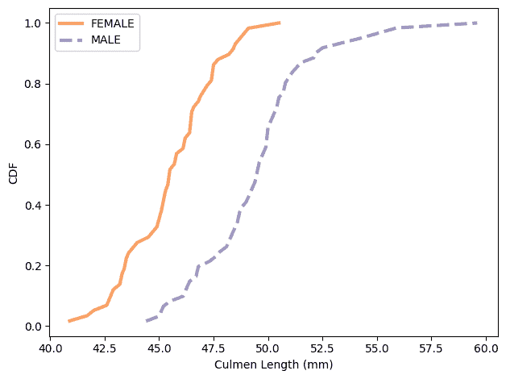</details><details class="hide above-input"><summary aria-label="Toggle hidden content">显示代码单元格内容隐藏代码单元格内容</summary>

```py
# Solution

plot_cdfs(subset, 'Culmen Depth (mm)', by='Sex') 
```

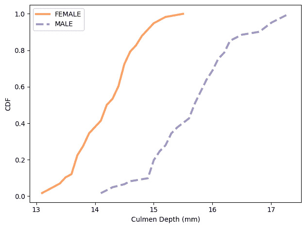</details><details class="hide above-input"><summary aria-label="Toggle hidden content">显示代码单元格内容隐藏代码单元格内容</summary>

```py
# Solution

plot_cdfs(subset, 'Flipper Length (mm)', by='Sex') 
```

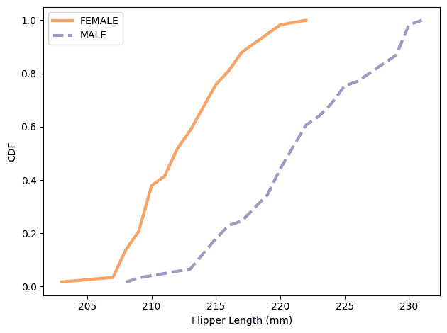</details><details class="hide above-input"><summary aria-label="Toggle hidden content">显示代码单元格内容隐藏代码单元格内容</summary>

```py
# Solution

plot_cdfs(subset, 'Body Mass (g)', by='Sex') 
```

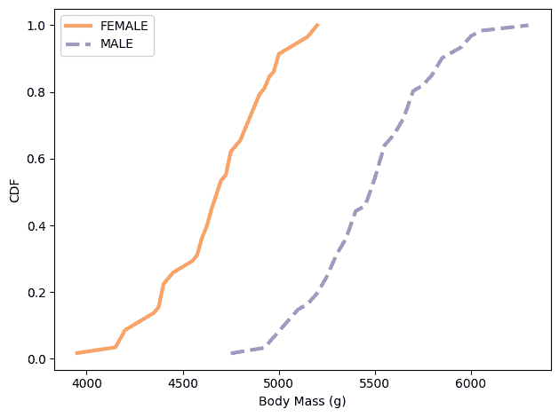</details><details class="hide above-input"><summary aria-label="Toggle hidden content">显示代码单元格内容隐藏代码单元格内容</summary>

```py
# Solution

# Here are the norm maps for the features, grouped by sex

culmen_map = make_norm_map(subset, 'Culmen Length (mm)', by='Sex')
flipper_map = make_norm_map(subset, 'Flipper Length (mm)', by='Sex')
depth_map = make_norm_map(subset, 'Culmen Depth (mm)', by='Sex')
mass_map = make_norm_map(subset, 'Body Mass (g)', by='Sex') 
```</details> <details class="hide above-input"><summary aria-label="Toggle hidden content">显示代码单元格内容隐藏代码单元格内容</summary>

```py
# Solution

# And here are the sequences we need for `update_naive`

norm_maps4 = [culmen_map, flipper_map, depth_map, mass_map]
colnames4 = ['Culmen Length (mm)', 'Flipper Length (mm)', 
             'Culmen Depth (mm)', 'Body Mass (g)'] 
```</details> <details class="hide above-input"><summary aria-label="Toggle hidden content">显示代码单元格内容隐藏代码单元格内容</summary>

```py
# Solution

# Here's the prior

hypos = culmen_map.keys()
prior = Pmf(1/2, hypos)
prior 
```

|  | 概率 |
| --- | --- |
| 女性 | 0.5 |

| MALE | 0.5 |</details> <details class="hide above-input"><summary aria-label="Toggle hidden content">显示代码单元格内容 隐藏代码单元格内容</summary>

```py
# Solution

# And the update

subset['Classification'] = "None"

for i, row in subset.iterrows():
    data_seq = row[colnames4]
    posterior = update_naive(prior, data_seq, norm_maps4)
    subset.loc[i, 'Classification'] = posterior.max_prob() 
```</details> <details class="hide above-input"><summary aria-label="Toggle hidden content">显示代码单元格内容 隐藏代码单元格内容</summary>

```py
# Solution

# This function computes accuracy

def accuracy_sex(df):
  """Compute the accuracy of classification.

 Compares columns Classification and Sex

 df: DataFrame
 """
    valid = df['Classification'].notna()
    same = df['Sex'] == df['Classification']
    return same.sum() / valid.sum() 
```</details> <details class="hide above-input"><summary aria-label="Toggle hidden content">显示代码单元格内容 隐藏代码单元格内容</summary>

```py
# Solution

# Using these features we can classify Gentoo penguins by
# sex with almost 92% accuracy

accuracy_sex(subset) 
```

```py
0.9186991869918699 
```</details> <details class="hide above-input"><summary aria-label="Toggle hidden content">显示代码单元格内容 隐藏代码单元格内容</summary>

```py
# Solution

# Here's the whole process in a function so we can
# classify the other species

def classify_by_sex(subset):
  """Run the whole classification process.

 subset: DataFrame
 """
    culmen_map = make_norm_map(subset, 'Culmen Length (mm)', by='Sex')
    flipper_map = make_norm_map(subset, 'Flipper Length (mm)', by='Sex')
    depth_map = make_norm_map(subset, 'Culmen Depth (mm)', by='Sex')
    mass_map = make_norm_map(subset, 'Body Mass (g)', by='Sex')

    norm_maps4 = [culmen_map, flipper_map, depth_map, mass_map]

    hypos = culmen_map.keys()
    prior = Pmf(1/2, hypos)

    subset['Classification'] = "None"

    for i, row in subset.iterrows():
        data_seq = row[colnames4]
        posterior = update_naive(prior, data_seq, norm_maps4)
        subset.loc[i, 'Classification'] = posterior.max_prob()

    return accuracy_sex(subset) 
```</details> <details class="hide above-input"><summary aria-label="Toggle hidden content">显示代码单元格内容 隐藏代码单元格内容</summary>

```py
# Solution

# Here's the subset of Adelie penguins

# The accuracy is about 88%

adelie = df['Species2']=='Adelie'
subset = df[adelie].copy()
classify_by_sex(subset) 
```

```py
0.8807947019867549 
```</details> <details class="hide above-input"><summary aria-label="Toggle hidden content">显示代码单元格内容 隐藏代码单元格内容</summary>

```py
# Solution

# And for Chinstrap, accuracy is about 92%

chinstrap = df['Species2']=='Chinstrap'
subset = df[chinstrap].copy()
classify_by_sex(subset) 
```

```py
0.9264705882352942 
```</details> <details class="hide above-input"><summary aria-label="Toggle hidden content">显示代码单元格内容 隐藏代码单元格内容</summary>

```py
# Solution

# It looks like Gentoo and Chinstrap penguins are about equally
# dimorphic, Adelie penguins a little less so.

# All of these results are consistent with what's in the paper. 
```</details>
