# 生存分析

> 原文：[`allendowney.github.io/ThinkBayes2/chap14.html`](https://allendowney.github.io/ThinkBayes2/chap14.html)

本章介绍了“生存分析”，这是一组用于回答关于事件发生时间的问题的统计方法。在医学领域，它实际上是关于生存，但它可以应用于任何类型事件的时间，或者可以是关于空间或其他维度的时间。

生存分析很具有挑战性，因为我们拥有的数据通常是不完整的。但正如我们将看到的，贝叶斯方法在处理不完整数据方面特别擅长。

作为示例，我们将考虑两个应用，它们比生死更不严肃：灯泡损坏的时间和收容所里狗被领养的时间。为了描述这些“生存时间”，我们将使用 Weibull 分布。

## Weibull 分布

[Weibull distribution](https://en.wikipedia.org/wiki/Weibull_distribution)经常用于生存分析，因为它是制造产品寿命分布的良好模型，至少在某些范围内。

SciPy 提供了几个版本的 Weibull 分布；我们将使用的是称为`weibull_min`的版本。为了使接口与我们的符号一致，我将把它包装在一个函数中，该函数以\(\lambda\)和\(k\)作为参数，\(\lambda\)主要影响分布的位置或“中心倾向”，\(k\)影响形状。

```py
from scipy.stats import weibull_min

def weibull_dist(lam, k):
    return weibull_min(k, scale=lam) 
```

例如，这是一个具有参数\(\lambda=3\)和\(k=0.8\)的 Weibull 分布。

```py
lam = 3
k = 0.8
actual_dist = weibull_dist(lam, k) 
```

结果是一个代表分布的对象。以下是具有这些参数的 Weibull CDF 的样子。

```py
import numpy as np
from empiricaldist import Cdf
from utils import decorate

qs = np.linspace(0, 12, 101)
ps = actual_dist.cdf(qs)
cdf = Cdf(ps, qs)
cdf.plot()

decorate(xlabel='Duration in time', 
         ylabel='CDF',
         title='CDF of a Weibull distribution') 
```

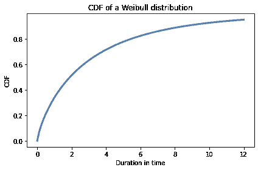

`actual_dist`提供了`rvs`，我们可以用它来从这个分布中生成一个随机样本。

```py
data = actual_dist.rvs(10)
data 
```

```py
array([0.80497283, 2.11577082, 0.43308797, 0.10862644, 5.17334866,
       3.25745053, 3.05555883, 2.47401062, 0.05340806, 1.08386395]) 
```

因此，给定分布的参数，我们可以生成一个样本。现在让我们看看是否可以反过来：给定样本，我们将估计参数。

以下是\(\lambda\)的均匀先验分布：

```py
from utils import make_uniform

lams = np.linspace(0.1, 10.1, num=101)
prior_lam = make_uniform(lams, name='lambda') 
```

\(k\)的均匀先验分布如下：

```py
ks = np.linspace(0.1, 5.1, num=101)
prior_k = make_uniform(ks, name='k') 
```

我将使用`make_joint`来为这两个参数制作一个联合先验分布。

```py
from utils import make_joint

prior = make_joint(prior_lam, prior_k) 
```

结果是一个代表联合先验的`DataFrame`，其中列中包含\(\lambda\)的可能值，行中包含\(k\)的值。

现在我将使用`meshgrid`来制作一个带有\(\lambda\)的 3-D 网格（`axis=0`），\(k\)的第二个轴（`axis=1`），以及数据的第三个轴（`axis=2`）。

```py
lam_mesh, k_mesh, data_mesh = np.meshgrid(
    prior.columns, prior.index, data) 
```

现在我们可以使用`weibull_dist`来计算每对参数和每个数据点的 Weibull 分布的概率密度函数。

```py
densities = weibull_dist(lam_mesh, k_mesh).pdf(data_mesh)
densities.shape 
```

```py
(101, 101, 10) 
```

数据的似然是沿`axis=2`的概率密度的乘积。

```py
likelihood = densities.prod(axis=2)
likelihood.sum() 
```

```py
2.0938302958838208e-05 
```

现在我们可以按照通常的方式计算后验分布。

```py
from utils import normalize

posterior = prior * likelihood
normalize(posterior) 
```

<details class="hide below-input"><summary aria-label="Toggle hidden content">显示代码单元格输出 隐藏代码单元格输出</summary>

```py
2.052573567183434e-09 
```</details>

以下函数封装了这些步骤。它接受一个联合先验分布和数据，并返回一个联合后验分布。

```py
def update_weibull(prior, data):
  """Update the prior based on data."""
    lam_mesh, k_mesh, data_mesh = np.meshgrid(
        prior.columns, prior.index, data)

    densities = weibull_dist(lam_mesh, k_mesh).pdf(data_mesh)
    likelihood = densities.prod(axis=2)

    posterior = prior * likelihood
    normalize(posterior)

    return posterior 
```

我们是这样使用它的。

```py
posterior = update_weibull(prior, data) 
```

以下是联合后验分布的等高线图。

<details class="hide above-input"><summary aria-label="Toggle hidden content">显示代码单元格源代码 隐藏代码单元格源代码</summary>

```py
from utils import plot_contour

plot_contour(posterior)
decorate(title='Posterior joint distribution of Weibull parameters') 
```</details> 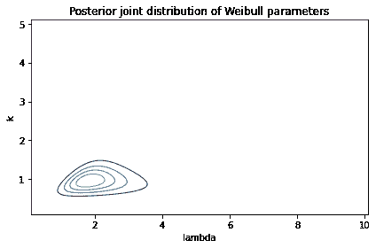

\(\lambda\)的可能值的范围大约是 1 到 4，其中包含了我们用来生成数据的实际值 3。而\(k\)的范围大约是 0.5 到 1.5，其中包含了实际值 0.8。

## 边缘分布

为了更准确地描述这些范围，我们可以提取边缘分布：

<details class="hide above-input"><summary aria-label="Toggle hidden content">显示代码单元格内容 隐藏代码单元格内容</summary>

```py
from utils import marginal

posterior_lam = marginal(posterior, 0)
posterior_k = marginal(posterior, 1) 
```</details>

并计算后验均值和 90%的可信区间。

<details class="hide above-input"><summary aria-label="Toggle hidden content">Show code cell content Hide code cell content</summary>

```py
import matplotlib.pyplot as plt

plt.axvline(3, color='C5')
posterior_lam.plot(color='C4', label='lambda')
decorate(xlabel='lam',
         ylabel='PDF', 
         title='Posterior marginal distribution of lam') 
```

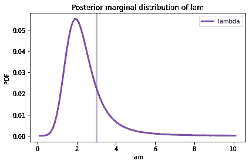</details>

垂直灰线显示了\(\lambda\)的实际值。

这是\(k\)的边际后验分布。

<details class="hide above-input"><summary aria-label="Toggle hidden content">Show code cell content Hide code cell content</summary>

```py
plt.axvline(0.8, color='C5')
posterior_k.plot(color='C12', label='k')
decorate(xlabel='k',
         ylabel='PDF', 
         title='Posterior marginal distribution of k') 
```

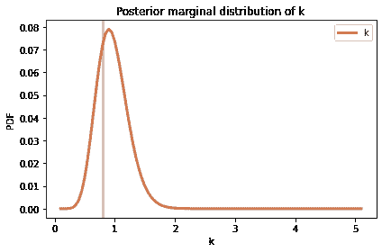</details>

后验分布很宽，这意味着只有 10 个数据点，我们无法精确估计参数。但对于两个参数，实际值都在可信区间内。

<details class="hide above-input"><summary aria-label="Toggle hidden content">Show code cell content Hide code cell content</summary>

```py
print(lam, posterior_lam.credible_interval(0.9)) 
```

```py
3 [1.2 4.4] 
```</details> <details class="hide above-input"><summary aria-label="Toggle hidden content">Show code cell content Hide code cell content</summary>

```py
print(k, posterior_k.credible_interval(0.9)) 
```

```py
0.8 [0.6 1.4] 
```</details>

## 不完整的数据

在前面的例子中，我们得到了来自 Weibull 分布的 10 个随机值，并且我们使用它们来估计参数（假装我们不知道）。

但在许多现实世界的情况下，我们并没有完整的数据；特别是当我们在某个时间点观察系统时，通常我们对过去有信息，但对未来没有。

例如，假设您在一家狗收容所工作，您对新狗到达和被领养之间的时间感兴趣。有些狗可能会立即被领养；其他狗可能需要等待更长时间。经营收容所的人可能希望推断这些居住时间的分布。

假设您在 8 周内监测到到达和离开，并且在该间隔期间有 10 只狗到达。我假设它们的到达时间是均匀分布的，所以我会生成这样的随机值。

```py
start = np.random.uniform(0, 8, size=10)
start 
```

```py
array([0.78026881, 6.08999773, 1.97550379, 1.1050535 , 2.65157251,
       0.66399652, 5.37581665, 6.45275039, 7.86193532, 5.08528588]) 
```

现在假设居住时间遵循我们在前面例子中使用的 Weibull 分布。我们可以这样从该分布中生成样本：

```py
duration = actual_dist.rvs(10)
duration 
```

```py
array([0.80497283, 2.11577082, 0.43308797, 0.10862644, 5.17334866,
       3.25745053, 3.05555883, 2.47401062, 0.05340806, 1.08386395]) 
```

我将使用这些值构建一个包含每只狗的到达和离开时间的`DataFrame`，称为`start`和`end`。

```py
import pandas as pd

d = dict(start=start, end=start+duration)
obs = pd.DataFrame(d) 
```

出于显示目的，我将按到达时间对`DataFrame`的行进行排序。

```py
obs = obs.sort_values(by='start', ignore_index=True)
obs 
```

|  | start | end |
| --- | --- | --- |
| 0	0.663997	3.921447 |
| 1	0.780269	1.585242 |
| 2	1.105053	1.213680 |
| 3	1.975504	2.408592 |
| 4	2.651573	7.824921 |
| 5 | 5.085286 | 6.169150 |
| 6	5.375817	8.431375 |
| 7 | 6.089998 | 8.205769 |
| 8	6.452750	8.926761 |
| 9	7.861935	7.915343 |

请注意，几条寿命线延伸到 8 周的观察窗口之外。因此，如果我们在第 8 周初观察到这个系统，我们将得到不完整的信息。具体来说，我们将不知道狗 6、7 和 8 的未来领养时间。

我将通过识别延伸到观察窗口之外的寿命来模拟这些不完整的数据：

```py
censored = obs['end'] > 8 
```

`censored`是一个布尔 Series，对于延伸到第 8 周之后的寿命线为`True`。

有时称为“被审查”的数据是因为它对我们是隐藏的。但在这种情况下，它是因为我们不知道未来而隐藏的，而不是因为有人在审查它。

对于被审查的寿命线，我将修改`end`以指示它们最后被观察到的时间，并修改`status`以指示观察是不完整的。

```py
obs.loc[censored, 'end'] = 8
obs.loc[censored, 'status'] = 0 
```

现在我们可以为每只狗绘制一个“寿命线”，显示时间线上的到达和离开时间。

<details class="hide above-input"><summary aria-label="Toggle hidden content">Show code cell content Hide code cell content</summary>

```py
def plot_lifelines(obs):
  """Plot a line for each observation.

 obs: DataFrame
 """
    for y, row in obs.iterrows():
        start = row['start']
        end = row['end']
        status = row['status']

        if status == 0:
            # ongoing
            plt.hlines(y, start, end, color='C0')
        else:
            # complete
            plt.hlines(y, start, end, color='C1')
            plt.plot(end, y, marker='o', color='C1')

    decorate(xlabel='Time (weeks)',
             ylabel='Dog index',
             title='Lifelines showing censored and uncensored observations')

    plt.gca().invert_yaxis() 
```</details> <details class="hide above-input"><summary aria-label="Toggle hidden content">显示代码单元格源代码 隐藏代码单元格源代码</summary>

```py
plot_lifelines(obs) 
```</details> 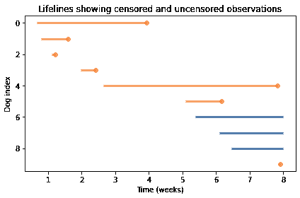

我将在表中再添加一列，其中包含寿命线的观察部分的持续时间。

```py
obs['T'] = obs['end'] - obs['start'] 
```

我们模拟的是在第 8 周开始时可用的数据。

## 使用不完整的数据

现在，让我们看看如何同时使用完整和不完整的数据来推断居住时间分布的参数。

首先，我将数据分成两组：`data1`包含已知到达和离开时间的狗的居住时间；`data2`包含在观察间隔内未被领养的狗的不完整居住时间。

```py
data1 = obs.loc[~censored, 'T']
data2 = obs.loc[censored, 'T'] 
```

<details class="hide above-input"><summary aria-label="Toggle hidden content">显示代码单元格内容 隐藏代码单元格内容</summary>

```py
data1 
```

```py
0    3.257451
1    0.804973
2    0.108626
3    0.433088
4    5.173349
5    1.083864
9    0.053408
Name: T, dtype: float64 
```</details> <details class="hide above-input"><summary aria-label="Toggle hidden content">显示代码单元格内容 隐藏代码单元格内容</summary>

```py
data2 
```

```py
6    2.624183
7    1.910002
8    1.547250
Name: T, dtype: float64 
```</details>

对于完整数据，我们可以使用`update_weibull`，它使用 Weibull 分布的概率密度函数来计算数据的似然。

```py
posterior1 = update_weibull(prior, data1) 
```

对于不完整的数据，我们需要更加深入地思考。在观察间隔结束时，我们不知道居住时间会是多少，但我们可以设定一个下限；也就是说，我们可以说居住时间将大于`T`。

这意味着我们可以使用生存函数来计算数据的似然，生存函数是分布中值大于`T`的概率。

以下函数与`update_weibull`相同，只是它使用`sf`来计算生存函数，而不是`pdf`。

```py
def update_weibull_incomplete(prior, data):
  """Update the prior using incomplete data."""
    lam_mesh, k_mesh, data_mesh = np.meshgrid(
        prior.columns, prior.index, data)

    # evaluate the survival function
    probs = weibull_dist(lam_mesh, k_mesh).sf(data_mesh)
    likelihood = probs.prod(axis=2)

    posterior = prior * likelihood
    normalize(posterior)

    return posterior 
```

这是使用不完整数据进行的更新。

```py
posterior2 = update_weibull_incomplete(posterior1, data2) 
```

这是两次更新后的联合后验分布的样子。

```py
plot_contour(posterior2)
decorate(title='Posterior joint distribution, incomplete data') 
```

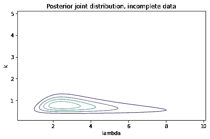

与之前的等高线图相比，看起来\(\lambda\)的可能值范围显著更宽。通过观察边际分布，我们可以更清楚地看到这一点。

```py
posterior_lam2 = marginal(posterior2, 0)
posterior_k2 = marginal(posterior2, 1) 
```

这是\(\lambda\)的后验边际分布，与我们使用所有完整数据得到的分布进行比较。

<details class="hide above-input"><summary aria-label="Toggle hidden content">显示代码单元格源代码 隐藏代码单元格源代码</summary>

```py
posterior_lam.plot(color='C5', label='All complete',
                   linestyle='dashed')
posterior_lam2.plot(color='C2', label='Some censored')

decorate(xlabel='lambda',
         ylabel='PDF', 
         title='Marginal posterior distribution of lambda') 
```</details> 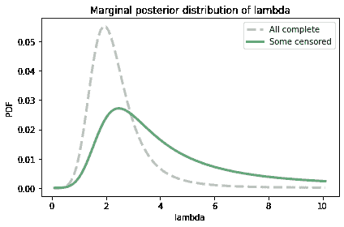

一些不完整数据的分布显著更宽。

另外，请注意后验分布在右侧并没有完全趋近于 0。这表明先验分布的范围不足以覆盖该参数的最可能值。如果我担心使这个分布更准确，我会回去用更宽的先验再次运行更新。

这是\(k\)的后验边际分布：

<details class="hide above-input"><summary aria-label="Toggle hidden content">显示代码单元格源代码 隐藏代码单元格源代码</summary>

```py
posterior_k.plot(color='C5', label='All complete',
                   linestyle='dashed')
posterior_k2.plot(color='C12', label='Some censored')

decorate(xlabel='k',
         ylabel='PDF', 
         title='Posterior marginal distribution of k') 
```</details> 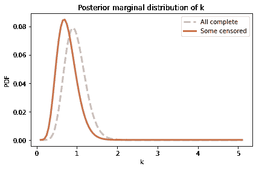

在这个例子中，当我们有不完整的数据时，边际分布向左移动，但宽度并没有显著增加。

总之，我们已经看到如何结合完整和不完整的数据来估计 Weibull 分布的参数，在许多现实场景中，这是非常有用的，因为其中一些数据是被截尾的。

一般来说，当我们有不完整数据时，后验分布会更宽，因为信息较少会导致更多的不确定性。

这个例子是基于我生成的数据；在下一节中，我们将用真实数据进行类似的分析。

## 灯泡

2007 年，研究人员进行了一项实验，以表征灯泡寿命的分布。以下是他们对实验的描述：

> 取了 50 个新的飞利浦（印度）灯泡，额定功率为 40 瓦，220 伏特（交流），并安装在水平方向上，均匀分布在一个 11 米 x7 米的实验室区域内。
> 
> 组件每隔 12 小时监视一次以寻找故障。记录的故障时刻是[记录的]，共获得了 32 个数据点，以至于最后一个灯泡也失败了。

<details class="hide above-input"><summary aria-label="Toggle hidden content">显示代码单元格内容 隐藏代码单元格内容</summary>

```py
download('https://gist.github.com/epogrebnyak/7933e16c0ad215742c4c104be4fbdeb1/raw/c932bc5b6aa6317770c4cbf43eb591511fec08f9/lamps.csv') 
```</details>

我们可以像这样将数据加载到`DataFrame`中：

```py
df = pd.read_csv('lamps.csv', index_col=0)
df.head() 
```

|  | h | f | K |
| --- | --- | --- | --- |
| i |  |  |  |
| --- | --- | --- | --- |
| 0 | 0 | 0 | 50 |
| 1 | 840 | 2 | 48 |
| 2 | 852 | 1 | 47 |
| 3 | 936 | 1 | 46 |
| 4 | 960 | 1 | 45 |

列`h`包含灯泡故障的时间（小时）；列`f`包含每个时间点故障的灯泡数量。我们可以使用`Pmf`来表示这些值和频率，如下所示：

```py
from empiricaldist import Pmf

pmf_bulb = Pmf(df['f'].to_numpy(), df['h'])
pmf_bulb.normalize() 
```

```py
50 
```

由于这个实验的设计，我们可以认为数据是寿命分布的代表样本，至少对于连续点亮的灯泡来说。

平均寿命约为 1400 小时。

<details class="hide above-input"><summary aria-label="Toggle hidden content">显示代码单元格内容 隐藏代码单元格内容</summary>

```py
pmf_bulb.mean() 
```

```py
1413.84 
```</details>

假设这些数据很好地符合 Weibull 分布，让我们估计适合数据的参数。同样，我将从\(\lambda\)和\(k\)的均匀先验开始：

```py
lams = np.linspace(1000, 2000, num=51)
prior_lam = make_uniform(lams, name='lambda') 
```

```py
ks = np.linspace(1, 10, num=51)
prior_k = make_uniform(ks, name='k') 
```

对于这个例子，先验分布中有 51 个值，而不是通常的 101 个。这是因为我们将使用后验分布进行一些计算密集型的计算。它们将以更少的值运行得更快，但结果将不太精确。

像往常一样，我们可以使用`make_joint`来制作先验联合分布。

```py
prior_bulb = make_joint(prior_lam, prior_k) 
```

虽然我们有 50 个灯泡的数据，但数据集中只有 32 个唯一的寿命。为了更新，方便起见，可以将数据表示为 50 个寿命，每个寿命重复给定的次数。我们可以使用`np.repeat`来转换数据。

```py
data_bulb = np.repeat(df['h'], df['f'])
len(data_bulb) 
```

```py
50 
```

现在我们可以使用`update_weibull`来进行更新。

```py
posterior_bulb = update_weibull(prior_bulb, data_bulb) 
```

这是后验联合分布的样子：

<details class="hide above-input"><summary aria-label="Toggle hidden content">显示代码单元格源代码 隐藏代码单元格源代码</summary>

```py
plot_contour(posterior_bulb)
decorate(title='Joint posterior distribution, light bulbs') 
```</details> 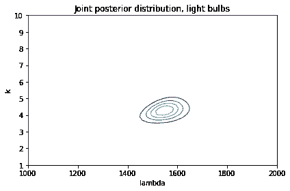

为了总结这个联合后验分布，我们将计算后验均值寿命。

## 后验均值

要计算联合分布的后验均值，我们将制作一个包含\(\lambda\)和\(k\)的值的网格。

```py
lam_mesh, k_mesh = np.meshgrid(
    prior_bulb.columns, prior_bulb.index) 
```

现在对于每一对参数，我们将使用`weibull_dist`来计算均值。

```py
means = weibull_dist(lam_mesh, k_mesh).mean()
means.shape 
```

```py
(51, 51) 
```

结果是一个与联合分布具有相同维度的数组。

现在我们需要用联合后验的相应概率对每个均值进行加权。

```py
prod = means * posterior_bulb 
```

最后，我们计算加权平均值的总和。

```py
prod.to_numpy().sum() 
```

```py
1412.7242774305005 
```

根据后验分布，我们认为平均寿命约为 1413 小时。

以下函数封装了这些步骤：

```py
def joint_weibull_mean(joint):
  """Compute the mean of a joint distribution of Weibulls."""
    lam_mesh, k_mesh = np.meshgrid(
        joint.columns, joint.index)
    means = weibull_dist(lam_mesh, k_mesh).mean()
    prod = means * joint
    return prod.to_numpy().sum() 
```

## 不完整信息

之前的更新不太正确，因为它假设每个灯泡在我们观察到它的瞬间就死了。

根据报告，研究人员每 12 小时只检查一次灯泡。因此，如果他们发现一个灯泡已经坏了，他们只知道它在上次检查后的 12 小时内坏掉了。

使用以下更新函数更加严格正确，它使用韦伯分布的 CDF 来计算在给定的 12 小时间隔内灯泡死亡的概率。

<details class="hide above-input"><summary aria-label="Toggle hidden content">显示代码单元格内容 隐藏代码单元格内容</summary>

```py
def update_weibull_between(prior, data, dt=12):
  """Update the prior based on data."""
    lam_mesh, k_mesh, data_mesh = np.meshgrid(
        prior.columns, prior.index, data)
    dist = weibull_dist(lam_mesh, k_mesh)
    cdf1 = dist.cdf(data_mesh)
    cdf2 = dist.cdf(data_mesh-12)
    likelihood = (cdf1 - cdf2).prod(axis=2)

    posterior = prior * likelihood
    normalize(posterior)

    return posterior 
```</details>

值落入区间的概率是区间开始和结束时的 CDF 之差。

这是我们运行更新的方式。

<details class="hide above-input"><summary aria-label="Toggle hidden content">显示代码单元格内容 隐藏代码单元格内容</summary>

```py
posterior_bulb2 = update_weibull_between(prior_bulb, data_bulb) 
```</details>

这就是结果。

<details class="hide above-input"><summary aria-label="Toggle hidden content">显示代码单元格内容 隐藏代码单元格内容</summary>

```py
plot_contour(posterior_bulb2)
decorate(title='Joint posterior distribution, light bulbs') 
```

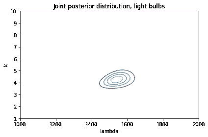</details>

这个结果在视觉上几乎与我们使用 PDF 得到的结果完全相同。这是个好消息，因为它表明即使不是严格正确，使用 PDF 也可以是一个很好的近似。

看看它是否有任何不同，让我们检查一下后验均值。

<details class="hide above-input"><summary aria-label="Toggle hidden content">显示代码单元格内容 隐藏代码单元格内容</summary>

```py
joint_weibull_mean(posterior_bulb) 
```

```py
1412.7242774305005 
```</details> <details class="hide above-input"><summary aria-label="Toggle hidden content">显示代码单元格内容 隐藏代码单元格内容</summary>

```py
joint_weibull_mean(posterior_bulb2) 
```

```py
1406.8171982320873 
```</details>

当我们考虑到观察之间的 12 小时间隔时，后验均值要少大约 6 小时。这是有道理的：如果我们假设灯泡在间隔的任何时间点都有同样的死亡概率，那么平均值将是间隔的中点。

## 后验预测分布

假设你安装了 100 个与上一节相同的灯泡，并在 1000 小时后回来检查。根据我们刚刚计算的后验分布，你找到的死灯泡数量的分布是什么？

如果我们确切地知道韦伯分布的参数，答案将是一个二项分布。

例如，如果我们知道\(\lambda=1550\)和\(k=4.25\)，我们可以使用`weibull_dist`来计算灯泡在你回来之前死亡的概率：

```py
lam = 1550
k = 4.25
t = 1000

prob_dead = weibull_dist(lam, k).cdf(t)
prob_dead 
```

```py
0.14381685899960547 
```

如果有 100 个灯泡，每个灯泡都有这个死亡的概率，那么死灯泡的数量遵循二项分布。

```py
from utils import make_binomial

n = 100
p = prob_dead
dist_num_dead = make_binomial(n, p) 
```

这就是它的样子。

<details class="hide above-input"><summary aria-label="Toggle hidden content">显示代码单元格内容 隐藏代码单元格内容</summary>

```py
dist_num_dead.plot(label='known parameters')

decorate(xlabel='Number of dead bulbs',
         ylabel='PMF',
         title='Predictive distribution with known parameters') 
```

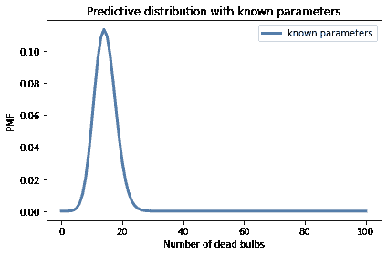</details>

但这是基于我们知道\(\lambda\)和\(k\)的假设，而我们并不知道。相反，我们有一个包含这些参数可能值和它们概率的后验分布。

因此，后验预测分布不是一个单一的二项式；相反，它是一个由后验概率加权的二项式混合物。

我们可以使用`make_mixture`来计算后验预测分布。

它不能用于联合分布，但我们可以将表示联合分布的`DataFrame`转换为`Series`，就像这样：

```py
posterior_series = posterior_bulb.stack()
posterior_series.head() 
```

```py
k    lambda
1.0  1000.0    8.146763e-25
     1020.0    1.210486e-24
     1040.0    1.738327e-24
     1060.0    2.418201e-24
     1080.0    3.265549e-24
dtype: float64 
```

结果是一个带有`MultiIndex`的`Series`，其中包含两个“级别”：第一级包含`k`的值；第二级包含`lam`的值。

以这种形式的后验分布，我们可以遍历可能的参数并为每对计算一个预测分布。

```py
pmf_seq = []
for (k, lam) in posterior_series.index:
    prob_dead = weibull_dist(lam, k).cdf(t)
    pmf = make_binomial(n, prob_dead)
    pmf_seq.append(pmf) 
```

现在我们可以使用`make_mixture`，传递`posterior_series`中的后验概率和`pmf_seq`中的二项式分布序列作为参数。

```py
from utils import make_mixture

post_pred = make_mixture(posterior_series, pmf_seq) 
```

这是后验预测分布的样子，与我们使用已知参数计算的二项分布相比。

<details class="hide above-input"><summary aria-label="Toggle hidden content">显示代码单元格源代码 隐藏代码单元格源代码</summary>

```py
dist_num_dead.plot(label='known parameters')
post_pred.plot(label='unknown parameters')
decorate(xlabel='Number of dead bulbs',
         ylabel='PMF',
         title='Posterior predictive distribution') 
```</details> 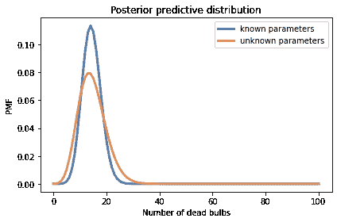

后验预测分布更宽，因为它代表了我们对参数以及死灯泡数量的不确定性。

## 总结

本章介绍了生存分析，用于回答关于事件发生时间的问题，以及 Weibull 分布，它是许多领域中“寿命”（广义解释）的良好模型。

我们使用联合分布来表示 Weibull 分布的参数的先验概率，并以三种方式更新它们：知道寿命的确切持续时间，知道下限，以及知道寿命落在给定区间内。

这些例子展示了贝叶斯方法的一个特点：它们可以适应处理不完整或“被审查”的数据，只需进行小的改动。作为练习，您将有机会处理另一种类型的被审查数据，当我们给出寿命的上限时。

本章中的方法适用于具有两个参数的任何分布。在练习中，您将有机会估计用于描述各种自然现象的两参数 gamma 分布的参数。

在下一章中，我们将继续使用三参数模型！

## 练习

**练习：**使用关于灯泡寿命的数据，我们计算了 Weibull 分布的参数\(\lambda\)和\(k\)的后验分布，以及 1000 小时后 100 个灯泡中死亡灯泡的后验预测分布。

现在假设您进行实验：您安装了 100 个灯泡，1000 小时后回来，发现 20 个灯泡坏了。根据这些数据更新后验分布。后验均值变化多少？

建议：

1.  使用网格来计算每对参数中在 1000 小时后找到一个灯泡死亡的概率。

1.  对于这些概率中的每一个，计算在 100 个灯泡中找到 20 个死灯泡的可能性。

1.  使用这些可能性来更新后验分布。

<details class="hide above-input"><summary aria-label="Toggle hidden content">显示代码单元格内容 隐藏代码单元格内容</summary>

```py
# Solution

t = 1000

lam_mesh, k_mesh = np.meshgrid(
    prior_bulb.columns, prior_bulb.index)
prob_dead = weibull_dist(lam_mesh, k_mesh).cdf(t)
prob_dead.shape 
```

```py
(51, 51) 
```</details> <details class="hide above-input"><summary aria-label="Toggle hidden content">显示代码单元格内容 隐藏代码单元格内容</summary>

```py
# Solution

from scipy.stats import binom

k = 20
n = 100
likelihood = binom(n, prob_dead).pmf(k)
likelihood.shape 
```

```py
(51, 51) 
```</details> <details class="hide above-input"><summary aria-label="Toggle hidden content">显示代码单元格内容 隐藏代码单元格内容</summary>

```py
# Solution

posterior_bulb3 = posterior_bulb * likelihood
normalize(posterior_bulb3)
plot_contour(posterior_bulb3)
decorate(title='Joint posterior distribution with k=20') 
```

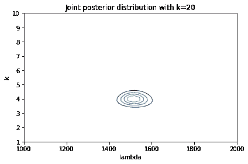</details><details class="hide above-input"><summary aria-label="Toggle hidden content">显示代码单元格内容 隐藏代码单元格内容</summary>

```py
# Solution

# Since there were more dead bulbs than expected,
# the posterior mean is a bit less after the update.

joint_weibull_mean(posterior_bulb3) 
```

```py
1378.3949572816412 
```</details>

**练习：**在这个练习中，我们将使用一个月的数据来估计描述西雅图日降雨量的分布的参数。然后我们将计算每日降雨的后验预测分布，并用它来估计罕见事件的概率，比如一天内降雨超过 1.5 英寸。

根据水文学家的说法，总日降雨量（有雨的日子）的分布很好地由两参数 gamma 分布建模。

当我们在<<_TheGammaDistribution>>中使用一参数 gamma 分布时，我们使用希腊字母\(\alpha\)表示参数。

对于两参数 gamma 分布，我们将使用\(k\)表示“形状参数”，它决定了分布的形状，希腊字母\(\theta\)或`theta`表示“比例参数”。

以下函数接受这些参数，并从 SciPy 返回一个`gamma`对象。

<details class="hide above-input"><summary aria-label="Toggle hidden content">显示代码单元格内容 隐藏代码单元格内容</summary>

```py
import scipy.stats

def gamma_dist(k, theta):
  """Makes a gamma object.

 k: shape parameter
 theta: scale parameter

 returns: gamma object
 """
    return scipy.stats.gamma(k, scale=theta) 
```</details>

现在我们需要一些数据。以下单元格下载了我在 2020 年 5 月从美国国家海洋和大气管理局（[NOAA](http://www.ncdc.noaa.gov/cdo-web/search)）收集的有关华盛顿西雅图的数据。

<details class="hide above-input"><summary aria-label="Toggle hidden content">显示代码单元格内容 隐藏代码单元格内容</summary>

```py
# Load the data file

download('https://github.com/AllenDowney/ThinkBayes2/raw/master/data/2203951.csv') 
```</details>

现在我们可以将其加载到`DataFrame`中：

<details class="hide above-input"><summary aria-label="Toggle hidden content">显示代码单元格内容 隐藏代码单元格内容</summary>

```py
weather = pd.read_csv('2203951.csv')
weather.head() 
```

|  | 站点 | 名称 | 日期 | AWND | PRCP | TMAX | TMIN | WT01 | WT03 | WT08 |
| --- | --- | --- | --- | --- | --- | --- | --- | --- | --- | --- |
| 0 | USW00024233 | 美国西雅图塔科马机场，华盛顿州 | 2020-05-01 | 4.47 | 0.00 | 66 | 43 | NaN | NaN | NaN |
| 1 | USW00024233 | 美国西雅图塔科马机场，华盛顿州 | 2020-05-02 | 9.40 | 0.24 | 58 | 47 | 1.0 | NaN | NaN |
| 2 | USW00024233 | 美国西雅图塔科马机场，华盛顿州 | 2020-05-03 | 11.63 | 0.06 | 57 | 44 | 1.0 | NaN | NaN |
| 3 | USW00024233 | 美国西雅图塔科马机场，华盛顿州 | 2020-05-04 | 4.47 | 0.00 | 65 | 39 | NaN | NaN | NaN |

| 4 | USW00024233 | 美国西雅图塔科马机场，华盛顿州 | 2020-05-05 | 7.83 | 0.00 | 71 | 49 | NaN | NaN | NaN |</details>

我将创建一个布尔系列来指示下雨的天数。

<details class="hide above-input"><summary aria-label="Toggle hidden content">显示代码单元格内容 隐藏代码单元格内容</summary>

```py
rained = weather['PRCP'] > 0
rained.sum() 
```

```py
14 
```</details>

并选择下雨的日子的总降雨量。

<details class="hide above-input"><summary aria-label="Toggle hidden content">显示代码单元格内容 隐藏代码单元格内容</summary>

```py
prcp = weather.loc[rained, 'PRCP']
prcp.describe() 
```

```py
count    14.000000
mean      0.222857
std       0.301060
min       0.010000
25%       0.052500
50%       0.110000
75%       0.225000
max       1.140000
Name: PRCP, dtype: float64 
```</details>

这是数据的累积分布函数的样子。

<details class="hide above-input"><summary aria-label="Toggle hidden content">显示代码单元格内容 隐藏代码单元格内容</summary>

```py
cdf_data = Cdf.from_seq(prcp)
cdf_data.plot()
decorate(xlabel='Total rainfall (in)',
         ylabel='CDF',
         title='Distribution of rainfall on days it rained') 
```

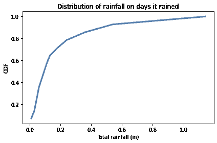</details>

最大降雨量为 1.14 英寸是一天。要估计超过 1.5 英寸的概率，我们需要从我们拥有的数据进行外推，因此我们的估计将取决于伽玛分布是否真的是一个好模型。

我建议您按以下步骤进行：

1.  为伽玛分布的参数构建先验分布。请注意，\(k\)和\(\theta\)必须大于 0。

1.  使用观察到的降雨量来更新参数的分布。

1.  计算降雨的后验预测分布，并用它来估计一天降雨超过 1.5 英寸的概率。

<details class="hide above-input"><summary aria-label="Toggle hidden content">显示代码单元格内容 隐藏代码单元格内容</summary>

```py
# Solution

# I'll use the MLE parameters of the gamma distribution
# to help me choose priors

k_est, _, theta_est = scipy.stats.gamma.fit(prcp, floc=0)
k_est, theta_est 
```

```py
(0.8898876017525283, 0.25043291132301665) 
```</details> <details class="hide above-input"><summary aria-label="Toggle hidden content">显示代码单元格内容 隐藏代码单元格内容</summary>

```py
# Solution

# I'll use uniform priors for the parameters.
# I chose the upper bounds by trial and error.

ks = np.linspace(0.01, 2, num=51)
prior_k = make_uniform(ks, name='k') 
```</details> <details class="hide above-input"><summary aria-label="Toggle hidden content">显示代码单元格内容 隐藏代码单元格内容</summary>

```py
# Solution

thetas = np.linspace(0.01, 1.5, num=51)
prior_theta = make_uniform(thetas, name='theta') 
```</details> <details class="hide above-input"><summary aria-label="Toggle hidden content">显示代码单元格内容 隐藏代码单元格内容</summary>

```py
# Solution

# Here's the joint prior

prior = make_joint(prior_k, prior_theta) 
```</details> <details class="hide above-input"><summary aria-label="Toggle hidden content">显示代码单元格内容 隐藏代码单元格内容</summary>

```py
# Solution

# I'll use a grid to compute the densities

k_mesh, theta_mesh, data_mesh = np.meshgrid(
    prior.columns, prior.index, prcp) 
```</details> <details class="hide above-input"><summary aria-label="Toggle hidden content">显示代码单元格内容 隐藏代码单元格内容</summary>

```py
# Solution

# Here's the 3-D array of densities

densities = gamma_dist(k_mesh, theta_mesh).pdf(data_mesh) 
densities.shape 
```

```py
(51, 51, 14) 
```</details> <details class="hide above-input"><summary aria-label="Toggle hidden content">显示代码单元格内容 隐藏代码单元格内容</summary>

```py
# Solution

# Which we reduce by multiplying along axis 2

likelihood = densities.prod(axis=2)
likelihood.sum() 
```

```py
150287.91980136462 
```</details> <details class="hide above-input"><summary aria-label="Toggle hidden content">显示代码单元格内容 隐藏代码单元格内容</summary>

```py
# Solution

# Now we can do the update in the usual way

posterior = prior * likelihood
normalize(posterior) 
```

```py
57.780822684107896 
```</details> <details class="hide above-input"><summary aria-label="切换隐藏内容">显示代码单元格内容 隐藏代码单元格内容</summary>

```py
# Solution

# And here's what the posterior looks like

plot_contour(posterior)

decorate(title='Posterior distribution, parameters of a gamma distribution') 
```

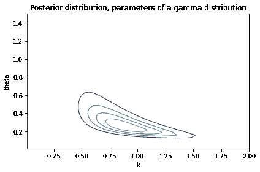</details><details class="hide above-input"><summary aria-label="切换隐藏内容">显示代码单元格内容 隐藏代码单元格内容</summary>

```py
# Solution

# I'll check the marginal distributions to make sure the
# range of the priors is wide enough

from utils import marginal

posterior_k = marginal(posterior, 0)
posterior_theta = marginal(posterior, 1) 
```</details> <details class="hide above-input"><summary aria-label="切换隐藏内容">显示代码单元格内容 隐藏代码单元格内容</summary>

```py
# Solution

# The marginal distribution for k is close to 0 at both ends

posterior_k.plot(color='C4')
decorate(xlabel='k',
         ylabel='PDF', 
         title='Posterior marginal distribution of k') 
```

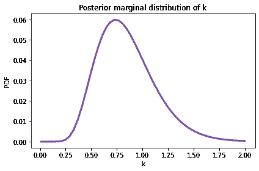</details><details class="hide above-input"><summary aria-label="切换隐藏内容">显示代码单元格内容 隐藏代码单元格内容</summary>

```py
# Solution

posterior_k.mean(), posterior_k.credible_interval(0.9) 
```

```py
(0.8437218523899558, array([0.4478, 1.3632])) 
```</details> <details class="hide above-input"><summary aria-label="切换隐藏内容">显示代码单元格内容 隐藏代码单元格内容</summary>

```py
# Solution

# Same with the marginal distribution of theta

posterior_theta.plot(color='C2')
decorate(xlabel='theta',
         ylabel='PDF', 
         title='Posterior marginal distribution of theta') 
```

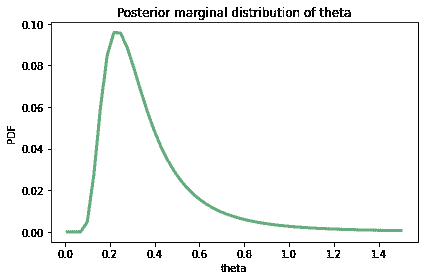</details><details class="hide above-input"><summary aria-label="切换隐藏内容">显示代码单元格内容 隐藏代码单元格内容</summary>

```py
# Solution

posterior_theta.mean(), posterior_theta.credible_interval(0.9) 
```

```py
(0.367761307460383, array([0.159 , 0.7848])) 
```</details> <details class="hide above-input"><summary aria-label="切换隐藏内容">显示代码单元格内容 隐藏代码单元格内容</summary>

```py
# Solution

# To compute the posterior predictive distribution,
# I'll stack the joint posterior to make a Series
# with a MultiIndex

posterior_series = posterior.stack()
posterior_series.head() 
```

```py
theta  k     
0.01   0.0100    4.306265e-156
       0.0498    1.304069e-145
       0.0896    2.463890e-141
       0.1294    2.077828e-138
       0.1692    4.227218e-136
dtype: float64 
```</details> <details class="hide above-input"><summary aria-label="切换隐藏内容">显示代码单元格内容 隐藏代码单元格内容</summary>

```py
# Solution

# I'll extend the predictive distribution up to 2 inches

low, high = 0.01, 2 
```</details> <details class="hide above-input"><summary aria-label="切换隐藏内容">显示代码单元格内容 隐藏代码单元格内容</summary>

```py
# Solution

# Now we can iterate through `posterior_series`
# and make a sequence of predictive Pmfs, one
# for each possible pair of parameters

from utils import pmf_from_dist

qs = np.linspace(low, high, num=101)
pmf_seq = []
for (theta, k) in posterior_series.index:
    dist = gamma_dist(k, theta)
    pmf = pmf_from_dist(dist, qs)
    pmf_seq.append(pmf) 
```</details> <details class="hide above-input"><summary aria-label="切换隐藏内容">显示代码单元格内容 隐藏代码单元格内容</summary>

```py
# Solution

# And we can use `make_mixture` to make the posterior predictive
# distribution

post_pred = make_mixture(posterior_series, pmf_seq) 
```</details> <details class="hide above-input"><summary aria-label="切换隐藏内容">显示代码单元格内容 隐藏代码单元格内容</summary>

```py
# Solution

# Here's what it looks like.

post_pred.make_cdf().plot(label='rainfall')
decorate(xlabel='Total rainfall (in)',
         ylabel='CDF',
         title='Posterior predictive distribution of rainfall') 
```

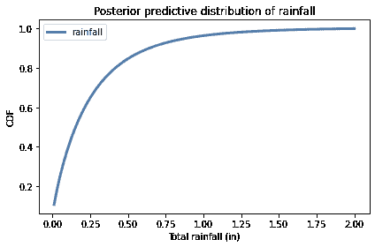</details><details class="hide above-input"><summary aria-label="切换隐藏内容">显示代码单元格内容 隐藏代码单元格内容</summary>

```py
# Solution 

# The probability of more than 1.5 inches of rain is small

cdf = post_pred.make_cdf()
p_gt = 1 - cdf(1.5)
p_gt 
```

```py
0.00900003598887611 
```</details> <details class="hide above-input"><summary aria-label="切换隐藏内容">显示代码单元格内容 隐藏代码单元格内容</summary>

```py
# Solution 

# So it's easier to interpret as the number of rainy
# days between events, on average

1 / p_gt 
```

```py
111.11066680577532 
```</details>
