# 回归

> 原文：[`allendowney.github.io/ThinkBayes2/chap17.html`](https://allendowney.github.io/ThinkBayes2/chap17.html)

在上一章中，我们看到了几个逻辑回归的例子，它基于这样一个假设，即结果的可能性，以对数几率的形式表达，是某个数量（连续或离散）的线性函数。

在本章中，我们将处理简单线性回归的示例，它模拟了两个量之间的关系。具体来说，我们将研究降雪量和马拉松世界纪录随时间的变化。

我们将使用的模型有三个参数，所以你可能想回顾一下我们在<<_MarkandRecapture>>中使用的三参数模型的工具。

## 更多的雪？

我印象中我们这里的雪不像过去那么多。我所说的“这里”是指我出生、长大和目前居住的马萨诸塞州诺福克县。我所说的“过去”是指与我年轻时相比，比如 1978 年我们得到了[27 英寸的雪](https://en.wikipedia.org/wiki/Northeastern_United_States_blizzard_of_1978)，我不得不在家呆了几个星期。

幸运的是，我们可以用数据来测试我的猜测。诺福克县碰巧是[蓝山气象观测站](https://en.wikipedia.org/wiki/Blue_Hill_Meteorological_Observatory)的所在地，该观测站保持着北美最古老的连续气象记录。

来自这个和许多其他气象站的数据可以从[国家海洋和大气管理局](https://www.ncdc.noaa.gov/cdo-web/search)（NOAA）获取。我收集了从 1967 年 5 月 11 日到 2020 年 5 月 11 日的蓝山天文台的数据。

以下单元格将数据下载为 CSV 文件。

<details class="hide above-input"><summary aria-label="Toggle hidden content">显示代码单元格内容 隐藏代码单元格内容</summary>

```py
download('https://github.com/AllenDowney/ThinkBayes2/raw/master/data/2239075.csv') 
```</details>

我们可以使用 Pandas 将数据读入`DataFrame`：

```py
import pandas as pd

df = pd.read_csv('2239075.csv', parse_dates=[2]) 
```

以下是最后几行的样子。

<details class="hide above-input"><summary aria-label="Toggle hidden content">显示代码单元格内容 隐藏代码单元格内容</summary>

```py
df.tail(3) 
```

|  | STATION | NAME | DATE | PRCP | SNOW | SNWD | TMAX | TMIN | TOBS | WESD | WT01 | WT03 | WT04 | WT05 | WT06 | WT08 | WT09 | WT11 | WT16 | WT18 |
| --- | --- | --- | --- | --- | --- | --- | --- | --- | --- | --- | --- | --- | --- | --- | --- | --- | --- | --- | --- | --- |
| 20452 | USC00190736 | BLUE HILL COOP, MA US | 2023-05-09 | 0.0 | 0.0 | 0.0 | 75 | 45.0 | 51.0 | NaN | NaN | NaN | NaN | NaN | NaN | NaN | NaN | NaN | NaN | NaN |
| 20453 | USC00190736 | BLUE HILL COOP, MA US | 2023-05-10 | 0.0 | 0.0 | 0.0 | 60 | 42.0 | 51.0 | NaN | NaN | NaN | NaN | NaN | NaN | NaN | NaN | NaN | NaN | NaN |

| 20454 | USC00190736 | BLUE HILL COOP, MA US | 2023-05-11 | 0.0 | 0.0 | 0.0 | 72 | 51.0 | 59.0 | NaN | NaN | NaN | NaN | NaN | NaN | NaN | NaN | NaN | NaN | NaN |</details>

我们将使用的列是：

+   `DATE`，即每次观测的日期，

+   `SNOW`，即以英寸为单位的总降雪量。

我将添加一个只包含日期年份部分的列。

```py
df['YEAR'] = df['DATE'].dt.year 
```

并使用`groupby`来累加每年的总降雪量。

```py
snow = df.groupby('YEAR')['SNOW'].sum() 
```

第一年和最后一年不完整，所以我会删除它们。

<details class="hide above-input"><summary aria-label="Toggle hidden content">显示代码单元格内容 隐藏代码单元格内容</summary>

```py
snow = snow.iloc[1:-1]
len(snow) 
```

```py
55 
```</details>

下图显示了我一生中每个完整年份的总降雪量。

<details class="hide above-input"><summary aria-label="Toggle hidden content">显示代码单元格源代码 隐藏代码单元格源代码</summary>

```py
from utils import decorate

snow.plot(ls='', marker='o', alpha=0.5)

decorate(xlabel='Year',
         ylabel='Total annual snowfall (inches)',
         title='Total annual snowfall in Norfolk County, MA') 
```</details> 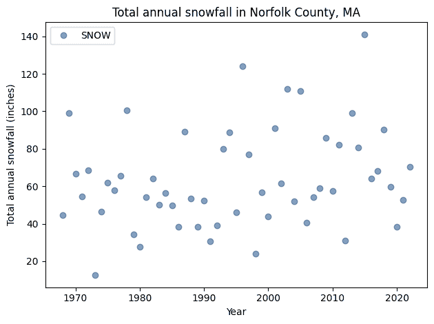

从这个图表来看，很难说降雪量是在增加、减少还是不变。在过去的十年中，我们有几年的降雪量比 1978 年多，包括 2015 年，这是波士顿地区现代历史上降雪最多的冬天，总降雪量达到 141 英寸。

这种问题——观察嘈杂的数据，想知道它是上升还是下降——正是我们可以用贝叶斯回归来回答的问题。

<details class="hide above-input"><summary aria-label="Toggle hidden content">显示代码单元格内容 隐藏代码单元格内容</summary>

```py
snow.loc[[1978, 1996, 2015]] 
```

```py
YEAR
1978    100.6
1996    124.2
2015    141.1
Name: SNOW, dtype: float64 
```</details>

## 回归模型

回归的基础（无论是贝叶斯还是非贝叶斯）是这样一个假设：这样的时间序列是两部分的总和：

1.  时间的线性函数，以及

1.  从不随时间变化的分布中抽取的随机值系列。

从数学上讲，回归模型是

$$y = a x + b + \epsilon$$

其中$y$是测量系列（本例中是降雪量），$x$是时间系列（年份），$\epsilon$是随机值系列。

$a$和$b$是数据线的斜率和截距。它们是未知参数，所以我们将使用数据来估计它们。

我们不知道$\epsilon$的分布，所以我们将额外假设它是一个均值为 0、未知标准差$\sigma$的正态分布。

为了查看这个假设是否合理，我将绘制总降雪量的分布和具有相同均值和标准差的正态模型。

这是一个代表降雪量分布的`Pmf`对象。

```py
from empiricaldist import Pmf

pmf_snowfall = Pmf.from_seq(snow) 
```

这里是数据的均值和标准差。

```py
mean, std = pmf_snowfall.mean(), pmf_snowfall.std()
mean, std 
```

```py
(63.62363636363636, 25.851147072396568) 
```

我将使用 SciPy 中的`norm`对象来计算具有相同均值和标准差的正态分布的 CDF。

```py
from scipy.stats import norm

dist = norm(mean, std)
qs = pmf_snowfall.qs
ps = dist.cdf(qs) 
```

以下是数据分布与正态模型的比较。

<details class="hide above-input"><summary aria-label="Toggle hidden content">显示代码单元格源代码 隐藏代码单元格源代码</summary>

```py
import matplotlib.pyplot as plt

plt.plot(qs, ps, color='C5', label='model')
pmf_snowfall.make_cdf().plot(label='data')

decorate(xlabel='Total snowfall (inches)',
         ylabel='CDF',
         title='Normal model of variation in snowfall') 
```</details> 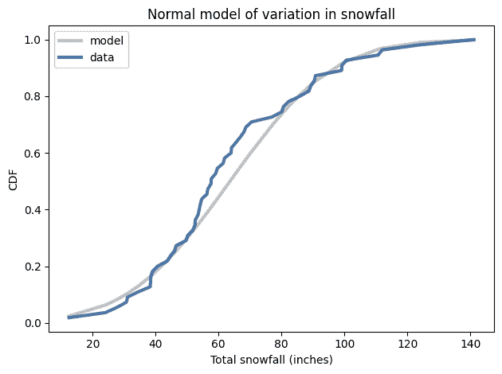

我们有比预期更多的冬天低于平均值，但总体上这看起来是一个合理的模型。

## 最小二乘回归

我们的回归模型有三个参数：斜率、截距和$\epsilon$的标准差。在我们能够估计它们之前，我们必须选择先验。为了帮助解决这个问题，我将使用 StatsModel 通过[最小二乘回归](https://en.wikipedia.org/wiki/Least_squares)来拟合数据。

首先，我将使用`reset_index`将`snow`（一个`Series`）转换为`DataFrame`。

```py
data = snow.reset_index()
data.head(3) 
```

|  | YEAR | SNOW |
| --- | --- | --- |
| 0 | 1968 | 44.7 |
| 1 | 1969 | 99.2 |
| 2 | 1970 | 66.8 |

结果是一个`DataFrame`，有两列，`YEAR`和`SNOW`，格式适用于 StatsModels。

就像我们在上一章中所做的那样，我将通过减去均值来对数据进行中心化。

```py
offset = round(data['YEAR'].mean())
data['x'] = data['YEAR'] - offset
offset 
```

```py
1995 
```

我将在`data`中添加一列，使因变量具有标准名称。

```py
data['y'] = data['SNOW'] 
```

现在，我们可以使用 StatsModels 来计算数据的最小二乘拟合并估计`slope`和`intercept`。

```py
import statsmodels.formula.api as smf

formula = 'y ~ x'
results = smf.ols(formula, data=data).fit()
results.params 
```

```py
Intercept    63.623636
x             0.376421
dtype: float64 
```

截距约为 64 英寸，是`x=0`时（即 1994 年初）预期的降雪量。估计的斜率表明总降雪量每年增加约 0.5 英寸。

`results`还提供了`resid`，这是一个残差数组，即数据与拟合线之间的差异。残差的标准差是`sigma`的估计值。

```py
results.resid.std() 
```

```py
25.382858670693558 
```

我们将使用这些估计值来选择参数的先验分布。

## 先验

我将为所有三个参数使用均匀分布。

```py
import numpy as np
from utils import make_uniform

qs = np.linspace(-0.5, 1.5, 51)
prior_slope = make_uniform(qs, 'Slope') 
```

```py
qs = np.linspace(54, 75, 41)
prior_inter = make_uniform(qs, 'Intercept') 
```

```py
qs = np.linspace(20, 35, 31)
prior_sigma = make_uniform(qs, 'Sigma') 
```

我使先验分布的长度不同有两个原因。首先，如果我们犯了错误并使用了错误的分布，那么如果它们的长度都不同，捕捉错误将更容易。

其次，它为最重要的参数`slope`提供了更精确的估计，并在最不重要的参数`sigma`上花费了更少的计算工作。

在<<_ThreeParameterModel>>中，我们制作了一个具有三个参数的联合分布。我将把这个过程封装在一个函数中：

```py
from utils import make_joint

def make_joint3(pmf1, pmf2, pmf3):
  """Make a joint distribution with three parameters."""
    joint2 = make_joint(pmf2, pmf1).stack()
    joint3 = make_joint(pmf3, joint2).stack()
    return Pmf(joint3) 
```

并使用它制作一个代表三个参数的联合分布的`Pmf`。

```py
prior = make_joint3(prior_slope, prior_inter, prior_sigma)
prior.head(3) 
```

|  |  |  | probs |
| --- | --- | --- | --- |
| 斜率 | 截距 | Sigma |  |
| --- | --- | --- | --- |
| -0.5 | 54.0 | 20.0 | 0.000015 |
| 20.5 | 0.000015 |
| 21.0 | 0.000015 |

`Pmf`的索引有三列，依次包含`slope`，`inter`和`sigma`的值。

有了三个参数，联合分布的大小开始变得很大。具体来说，它是先验分布长度的乘积。在这个例子中，先验分布有 51、41 和 31 个值，因此联合先验的长度为 64,821。

<details class="hide above-input"><summary aria-label="Toggle hidden content">显示代码单元格内容 隐藏代码单元格内容</summary>

```py
len(prior_slope), len(prior_inter), len(prior_sigma) 
```

```py
(51, 41, 31) 
```</details> <details class="hide above-input"><summary aria-label="Toggle hidden content">显示代码单元格内容 隐藏代码单元格内容</summary>

```py
len(prior_slope) * len(prior_inter) * len(prior_sigma) 
```

```py
64821 
```</details> <details class="hide above-input"><summary aria-label="Toggle hidden content">显示代码单元格内容 隐藏代码单元格内容</summary>

```py
len(prior) 
```

```py
64821 
```</details>

## 可能性

现在我们将计算数据的可能性。为了演示这个过程，让我们暂时假设参数是已知的。

```py
inter = 64
slope = 0.51
sigma = 25 
```

我将从`data`中提取`xs`和`ys`作为`Series`对象：

```py
xs = data['x']
ys = data['y'] 
```

并计算“残差”，即实际值`ys`与基于`slope`和`inter`的期望值之间的差异。

```py
expected = slope * xs + inter
resid = ys - expected 
```

根据模型，残差应该遵循均值为 0，标准差为`sigma`的正态分布。因此，我们可以使用 SciPy 中的`norm`来计算每个残差值的可能性。

```py
densities = norm(0, sigma).pdf(resid) 
```

结果是一个概率密度数组，每个元素对应数据集的一个元素；它们的乘积就是数据的可能性。

```py
likelihood = densities.prod()
likelihood 
```

```py
9.70222384229511e-112 
```

正如我们在上一章中看到的，任何特定数据集的可能性往往很小。如果太小，我们可能会超出浮点运算的限制。当发生这种情况时，我们可以通过对数变换来计算可能性来避免问题。但在这个例子中，这是不必要的。

## 更新

现在我们准备进行更新。首先，我们需要计算每组可能参数的数据的可能性。

```py
likelihood = prior.copy()

for slope, inter, sigma in prior.index:
    expected = slope * xs + inter
    resid = ys - expected
    densities = norm.pdf(resid, 0, sigma)
    likelihood[slope, inter, sigma] = densities.prod() 
```

这个计算比以前的许多例子要长。我们正在接近使用网格逼近所能做到的极限。

然而，我们可以以通常的方式进行更新：

```py
posterior = prior * likelihood
posterior.normalize() 
```

<details class="hide below-input"><summary aria-label="Toggle hidden content">显示代码单元格输出 隐藏代码单元格输出</summary>

```py
5.116955523342424e-113 
```</details>

结果是一个带有三级索引的`Pmf`，包含`slope`，`inter`和`sigma`的值。要从联合后验中获取边际分布，我们可以使用`Pmf.marginal`，我们在<<_ThreeParameterModel>>中看到了。

```py
posterior_slope = posterior.marginal(0)
posterior_inter = posterior.marginal(1)
posterior_sigma = posterior.marginal(2) 
```

这是`sigma`的后验分布：

<details class="hide above-input"><summary aria-label="Toggle hidden content">显示代码单元格源代码 隐藏代码单元格源代码</summary>

```py
posterior_sigma.plot()

decorate(xlabel='$\sigma$, standard deviation of $\epsilon/details>,
         ylabel='PDF',
         title='Posterior marginal distribution of $\sigma/details>) 
```</details> 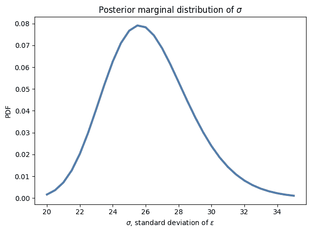

`sigma`的最可能值接近 26 英寸，这与我们基于数据标准差的估计一致。

然而，要说雪量是增加还是减少，我们并不真的关心`sigma`。这是一个“干扰参数”，所谓的是因为我们必须在模型的一部分中对其进行估计，但我们不需要它来回答我们感兴趣的问题。

然而，检查边际分布是很好的，以确保

+   位置与我们的预期一致，而

+   后验概率在范围的极端处接近 0，这表明先验分布覆盖了所有具有非零概率的参数。

在这个例子中，`sigma`的后验分布看起来不错。

这是`inter`的后验分布：

<details class="hide above-input"><summary aria-label="Toggle hidden content">显示代码单元格源代码 隐藏代码单元格源代码</summary>

```py
posterior_inter.plot(color='C1')
decorate(xlabel='intercept (inches)',
         ylabel='PDF',
         title='Posterior marginal distribution of intercept') 
```</details> 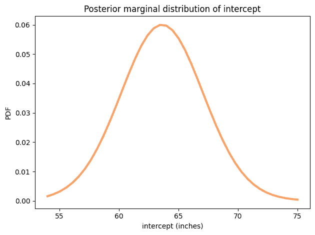<details class="hide above-input"><summary aria-label="Toggle hidden content">显示代码单元格内容 隐藏代码单元格内容</summary>

```py
from utils import summarize

summarize(posterior_inter) 
```

```py
63.65 [57.675 69.225] 
```</details>

后验均值约为 64 英寸，这是在范围的中点 1994 年的年度降雪量。

最后，这是`slope`的后验分布：

<details class="hide above-input"><summary aria-label="Toggle hidden content">显示代码单元格源代码 隐藏代码单元格源代码</summary>

```py
posterior_slope.plot(color='C4')
decorate(xlabel='Slope (inches per year)',
         ylabel='PDF',
         title='Posterior marginal distribution of slope') 
```</details> 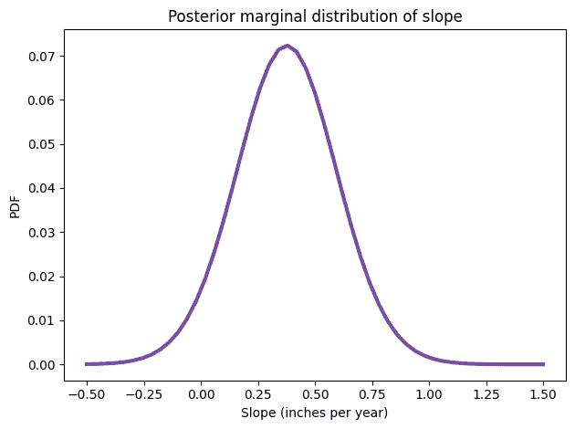<details class="hide above-input"><summary aria-label="Toggle hidden content">显示代码单元格内容 隐藏代码单元格内容</summary>

```py
summarize(posterior_slope) 
```

```py
0.376 [0.02 0.74] 
```</details>

后验均值约为 0.51 英寸，这与我们从最小二乘回归得到的估计值一致。

90%的可信区间是从 0.1 到 0.9，这表明我们对这个估计的不确定性非常高。事实上，仍然有一个很小的后验概率（约 2%）表明斜率是负的。

<details class="hide above-input"><summary aria-label="Toggle hidden content">显示代码单元格内容 隐藏代码单元格内容</summary>

```py
posterior_slope.make_cdf()(0) 
```

```py
array(0.04584032) 
```</details>

然而，更有可能的是我的推测是错误的：我们实际上这里的降雪量比过去更多，每年增加约半英寸，这是相当可观的。平均而言，我们每年的降雪量比我年轻时多 25 英寸。

这个例子表明，随着缓慢的趋势和嘈杂的数据，你的直觉可能会误导你。

现在，你可能会怀疑我年轻时高估了雪的数量，因为我喜欢它，而现在低估了，因为我不喜欢。但你会错的。

在 1978 年的暴风雪期间，我们没有除雪机，我和我哥哥不得不铲雪。我妹妹却不知道什么原因就逃过了。我们的车道大约有 60 英尺长，靠近车库处宽三辆车。我们还不得不铲克罗克先生的车道，但我们不允许收费。此外，我记得在这次挖掘中我不小心用铲子打到了我哥哥的头，因为头皮伤口出了很多血。

无论如何，重点是我不认为我年轻时高估了雪的数量，因为我对此有美好的回忆。

## 优化

我们在上一节中计算似然的方式非常慢。问题在于我们循环遍历了先验分布中的每一组可能的参数，而这些参数超过了 60000 个。

如果我们每次迭代可以做更多的工作，并且循环次数更少，我们期望它会更快。

为了做到这一点，我将解开先验分布：

<details class="hide above-input"><summary aria-label="Toggle hidden content">显示代码单元格内容 隐藏代码单元格内容</summary>

```py
joint3 = prior.unstack()
joint3.head(3) 
```

|  | Sigma | 20.0 | 20.5 | 21.0 | 21.5 | 22.0 | 22.5 | 23.0 | 23.5 | 24.0 | 24.5 | ... | 30.5 | 31.0 | 31.5 | 32.0 | 32.5 | 33.0 | 33.5 | 34.0 | 34.5 | 35.0 |
| --- | --- | --- | --- | --- | --- | --- | --- | --- | --- | --- | --- | --- | --- | --- | --- | --- | --- | --- | --- | --- | --- | --- |
| 斜率 | 截距 |  |  |  |  |  |  |  |  |  |  |  |  |  |  |  |  |  |  |  |  |  |  |
| --- | --- | --- | --- | --- | --- | --- | --- | --- | --- | --- | --- | --- | --- | --- | --- | --- | --- | --- | --- | --- | --- | --- |
| -0.5 | 54.000 | 0.000015 | 0.000015 | 0.000015 | 0.000015 | 0.000015 | 0.000015 | 0.000015 | 0.000015 | 0.000015 | 0.000015 | ... | 0.000015 | 0.000015 | 0.000015 | 0.000015 | 0.000015 | 0.000015 | 0.000015 | 0.000015 | 0.000015 | 0.000015 |
| 54.525 | 0.000015 | 0.000015 | 0.000015 | 0.000015 | 0.000015 | 0.000015 | 0.000015 | 0.000015 | 0.000015 | 0.000015 | ... | 0.000015 | 0.000015 | 0.000015 | 0.000015 | 0.000015 | 0.000015 | 0.000015 | 0.000015 | 0.000015 | 0.000015 |
| 55.050 | 0.000015 | 0.000015 | 0.000015 | 0.000015 | 0.000015 | 0.000015 | 0.000015 | 0.000015 | 0.000015 | 0.000015 | ... | 0.000015 | 0.000015 | 0.000015 | 0.000015 | 0.000015 | 0.000015 | 0.000015 | 0.000015 | 0.000015 | 0.000015 |

3 行×31 列</details>

结果是一个带有`斜率`和`截距`的`DataFrame`，行中有`sigmas`，列中有`sigmas`。

以下是`likelihood_regression`的一个版本，它以这种形式获取联合先验分布，并以相同的形式返回后验分布。

<details class="hide above-input"><summary aria-label="切换隐藏内容">显示代码单元格内容 隐藏代码单元格内容</summary>

```py
from utils import normalize

def update_optimized(prior, data):
  """Posterior distribution of regression parameters
 `slope`, `inter`, and `sigma`.

 prior: Pmf representing the joint prior
 data: DataFrame with columns `x` and `y`

 returns: Pmf representing the joint posterior
 """
    xs = data['x']
    ys = data['y']
    sigmas = prior.columns    
    likelihood = prior.copy()

    for slope, inter in prior.index:
        expected = slope * xs + inter
        resid = ys - expected
        resid_mesh, sigma_mesh = np.meshgrid(resid, sigmas)
        densities = norm.pdf(resid_mesh, 0, sigma_mesh)
        likelihood.loc[slope, inter] = densities.prod(axis=1)

    posterior = prior * likelihood
    normalize(posterior)
    return posterior 
```</details>

这个版本循环遍历所有可能的`斜率`和`截距`对，所以循环运行大约 2000 次。

<details class="hide above-input"><summary aria-label="切换隐藏内容">显示代码单元格内容 隐藏代码单元格内容</summary>

```py
len(prior_slope) * len(prior_inter) 
```

```py
2091 
```</details>

每次循环时，它使用网格网格计算所有`sigma`值的数据的可能性。结果是一个数组，每个数据点都有一列，每个`sigma`值都有一行。沿着列(`axis=1`)取乘积得到每个`sigma`值的数据概率，我们将其分配为`likelihood`中的一行。

<details class="hide above-input"><summary aria-label="切换隐藏内容">显示代码单元格内容 隐藏代码单元格内容</summary>

```py
%time posterior_opt = update_optimized(joint3, data) 
```

```py
CPU times: user 996 ms, sys: 5 µs, total: 996 ms
Wall time: 994 ms 
```</details>

我们以任何方式都会得到相同的结果。

<details class="hide above-input"><summary aria-label="切换隐藏内容">显示代码单元格内容 隐藏代码单元格内容</summary>

```py
np.allclose(posterior, posterior_opt.stack()) 
```

```py
True 
```</details>

但这个版本比上一个版本快大约 25 倍。

这种优化的原因是，NumPy 和 SciPy 中的许多函数都是用 C 编写的，因此它们运行速度比 Python 快。如果每次调用这些函数时都可以做更多的工作，并且在 Python 中运行循环的时间更少，那么您的代码通常会运行得更快。

在后验分布的这个版本中，`斜率`和`截距`在行中，`sigma`在列中。因此，我们可以使用`marginal`来获得`斜率`和`截距`的后验联合分布。

<details class="hide above-input"><summary aria-label="切换隐藏内容">显示代码单元格内容 隐藏代码单元格内容</summary>

```py
from utils import marginal

posterior2 = marginal(posterior_opt, 1)
posterior2.head(3) 
```

|  |  | 概率 |
| --- | --- | --- |
| 斜率 | 截距 |  |
| --- | --- | --- |
| -0.5 | 54.000 | 1.681717e-07 |
| 54.525 | 2.268085e-07 |

| 55.050 | 3.015062e-07 |</details>

结果是一个带有两列的`Pmf`，索引中有两列。要绘制它，我们必须将其解压缩。

<details class="hide above-input"><summary aria-label="切换隐藏内容">显示代码单元格内容 隐藏代码单元格内容</summary>

```py
joint_posterior = posterior2.unstack().transpose()
joint_posterior.head(3) 
```

| 斜率 | -0.50 | -0.46 | -0.42 | -0.38 | -0.34 | -0.30 | -0.26 | -0.22 | -0.18 | -0.14 | ... | 1.14 | 1.18 | 1.22 | 1.26 | 1.30 | 1.34 | 1.38 | 1.42 | 1.46 | 1.50 |
| --- | --- | --- | --- | --- | --- | --- | --- | --- | --- | --- | --- | --- | --- | --- | --- | --- | --- | --- | --- | --- | --- |
| 截距 |  |  |  |  |  |  |  |  |  |  |  |  |  |  |  |  |  |  |  |  |  |  |
| --- | --- | --- | --- | --- | --- | --- | --- | --- | --- | --- | --- | --- | --- | --- | --- | --- | --- | --- | --- | --- | --- |
| 54.000 | 1.681717e-07 | 2.848880e-07 | 4.744292e-07 | 7.761707e-07 | 0.000001 | 0.000002 | 0.000003 | 0.000005 | 0.000007 | 0.000010 | ... | 7.116789e-07 | 4.336070e-07 | 2.595674e-07 | 1.527668e-07 | 8.844849e-08 | 5.040388e-08 | 2.828465e-08 | 1.563589e-08 | 8.517697e-09 | 4.573661e-09 |
| 54.525 | 2.268085e-07 | 3.859703e-07 | 6.457296e-07 | 1.061331e-06 | 0.000002 | 0.000003 | 0.000004 | 0.000006 | 0.000009 | 0.000014 | ... | 9.723366e-07 | 5.896799e-07 | 3.513780e-07 | 2.058667e-07 | 1.186640e-07 | 6.733065e-08 | 3.762506e-08 | 2.071531e-08 | 1.124098e-08 | 6.013601e-09 |
| 55.050 | 3.015062e-07 | 5.153700e-07 | 8.661024e-07 | 1.430000e-06 | 0.000002 | 0.000004 | 0.000006 | 0.000009 | 0.000013 | 0.000019 | ... | 1.309030e-06 | 7.902856e-07 | 4.688054e-07 | 2.734522e-07 | 1.569383e-07 | 8.867160e-08 | 4.934762e-08 | 2.706205e-08 | 1.462927e-08 | 7.797870e-09 |

3 行×51 列</details>

这就是它的样子。

<details class="hide above-input"><summary aria-label="Toggle hidden content">显示代码单元格内容 隐藏代码单元格内容</summary>

```py
from utils import plot_contour

plot_contour(joint_posterior)
decorate(title='Posterior joint distribution of slope and intercept') 
```

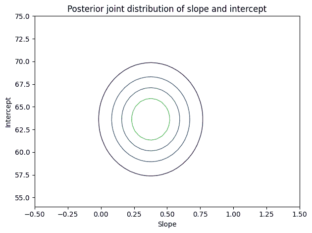</details>

等高线图中的椭圆与坐标轴对齐，这表明后验分布中的`slope`和`inter`之间没有相关性，这是我们预期的，因为我们对值进行了居中处理。

在这个例子中，激励问题是关于线的斜率，所以我们通过查看斜率的后验分布来回答它。

在下一个例子中，激励问题是关于预测的，所以我们将使用联合后验分布来生成预测分布。

## 马拉松世界纪录

对于许多跑步比赛来说，如果你绘制世界纪录的配速随时间的变化，结果会是一条非常直的线。人们，[包括我](http://allendowney.blogspot.com/2011/04/two-hour-marathon-in-2045.html)，已经对这种现象可能的原因进行了推测。

人们也对马拉松的世界纪录何时能否低于两小时进行了推测。（注：2019 年 Eliud Kipchoge 在两小时内完成了马拉松比赛，这是一个令人惊讶的成就，我非常欣赏，但由于几个原因，这并没有被视为世界纪录）。

因此，作为贝叶斯回归的第二个例子，我们将考虑马拉松（男子选手）的世界纪录进展，估计线性模型的参数，并使用该模型来预测何时选手将突破两小时的壁垒。

以下单元格下载了维基百科的一个网页，其中包括马拉松世界纪录表，并使用 Pandas 将数据放入`DataFrame`。

<details class="hide above-input"><summary aria-label="Toggle hidden content">显示代码单元格内容 隐藏代码单元格内容</summary>

```py
url = 'https://en.wikipedia.org/wiki/Marathon_world_record_progression#Men'
tables = pd.read_html(url)
len(tables) 
```

```py
5 
```</details>

如果这样不起作用，我已经复制了这个页面。以下单元格下载并解析它。

<details class="hide above-input"><summary aria-label="Toggle hidden content">显示代码单元格内容 隐藏代码单元格内容</summary>

```py
#import os

#datafile = 'Marathon_world_record_progression.html'
#download('https://github.com/AllenDowney/ThinkBayes2/raw/master/data/Marathon_world_record_progression.html')

#tables = pd.read_html(datafile)
#len(tables) 
```</details>

第一张表是我们想要的。

<details class="hide above-input"><summary aria-label="Toggle hidden content">显示代码单元格内容 隐藏代码单元格内容</summary>

```py
table = tables[0]
table.tail(3) 
```

|  | 时间 | 名字 | 国籍 | 日期 | 事件/地点 | 来源 | 注释 |
| --- | --- | --- | --- | --- | --- | --- | --- |
| 48 | 2:02:57 | Dennis Kimetto | 肯尼亚 | 2014 年 9 月 28 日 | 柏林马拉松 | IAAF[86][87] ARRS[83] | ARRS 指出 Kimetto 的延长时间为 2:02... |
| 49 | 2:01:39 | Eliud Kipchoge | 肯尼亚 | 2018 年 9 月 16 日 | 柏林马拉松 | IAAF[1] | NaN |

| 50 | 2:01:09 | Eliud Kipchoge | 肯尼亚 | 2022 年 9 月 25 日 | 柏林马拉松 | IAAF[88] | NaN |</details>

我们可以使用 Pandas 来解析日期。其中一些日期包括导致解析问题的注释，但参数`errors='coerce'`告诉 Pandas 用`NaT`填充无效日期，`NaT`是`NaN`的一种表示，表示“不是时间”。

<details class="hide above-input"><summary aria-label="Toggle hidden content">显示代码单元格内容 隐藏代码单元格内容</summary>

```py
table['date'] = pd.to_datetime(table['Date'], errors='coerce')
table['date'].head() 
```

```py
0   1908-07-24
1   1909-01-01
2   1909-02-12
3   1909-05-08
4          NaT
Name: date, dtype: datetime64[ns] 
```</details>

我们还可以使用 Pandas 来解析纪录时间。

显示代码单元格内容 隐藏代码单元格内容

```py
table['time'] = pd.to_timedelta(table['Time']) 
```</details>

并将时间转换为每小时的速度。

显示代码单元格内容 隐藏代码单元格内容

```py
table['y'] = 26.2 / table['time'].dt.total_seconds() * 3600
table['y'].head() 
```

```py
0    8.967143
1    9.099504
2    9.419942
3    9.465508
4    9.672854
Name: y, dtype: float64 
```</details>

以下函数绘制了结果。

显示代码单元格内容 隐藏代码单元格内容

```py
def plot_speeds(df):
  """Plot marathon world record speed as a function of time.

 df: DataFrame with date and mph
 """
    plt.axhline(13.1, color='C5', ls='--')
    plt.plot(df['date'], df['y'], 'o', 
             label='World record speed', 
             color='C1', alpha=0.5)

    decorate(xlabel='Date',
             ylabel='Speed (mph)') 
```</details>

这是结果的样子。虚线显示了完成两小时马拉松所需的速度，每小时 13.1 英里。

显示代码单元格内容 隐藏代码单元格内容

```py
plot_speeds(table) 
```

</details>

这不是一个完全的直线。在马拉松比赛的早期，记录速度迅速增加；自大约 1970 年以来，增速放缓了。

对于我们的分析，让我们关注最近的进展，从 1970 年开始。

显示代码单元格内容 隐藏代码单元格内容

```py
recent = table['date'] > pd.to_datetime('1970')
data = table.loc[recent].copy()
data.head() 
```

|  | 时间 | 姓名 | 国籍 | 日期 | 事件/地点 | 来源 | 注释 | 日期 | 时间 | y |
| --- | --- | --- | --- | --- | --- | --- | --- | --- | --- | --- |
| 32 | 2:09:28.8 | Ron Hill | 英国 | 1970 年 7 月 23 日 | 苏格兰爱丁堡 | ARRS[9] | NaN | 1970-07-23 | 0 天 02:09:28.800000 | 12.140871 |
| 33 | 2:09:12 | Ian Thompson | 英国 | 1974 年 1 月 31 日 | 新西兰基督城 | ARRS[9] | NaN | 1974-01-31 | 0 天 02:09:12 | 12.167183 |
| 34 | 2:09:05.6 | Shigeru So | 日本 | 1978 年 2 月 5 日 | 别府大分马拉松 | ARRS[9] | NaN | 1978-02-05 | 0 天 02:09:05.600000 | 12.177236 |
| 35 | 2:09:01 | Gerard Nijboer | 荷兰 | 1980 年 4 月 26 日 | 阿姆斯特丹马拉松 | ARRS[9] | NaN | 1980-04-26 | 0 天 02:09:01 | 12.184472 |

| 36 | 2:08:18 | Robert De Castella | 澳大利亚 | 1981 年 12 月 6 日 | 福冈马拉松 | IAAF,[53] ARRS[9] | NaN | 1981-12-06 | 0 天 02:08:18 | 12.252533 |</details>

在本章的笔记本中，您可以看到我如何加载和清理数据。结果是一个包含以下列（和我们不会使用的其他信息）的`DataFrame`：

+   `日期`，这是一个代表世界纪录被打破的日期的 Pandas `Timestamp`，和

+   `速度`，记录了以英里/小时为单位的创纪录配速。

这是结果的样子，从 1970 年开始：

显示代码单元格源代码 隐藏代码单元格源代码

```py
plot_speeds(data) 
```</details> 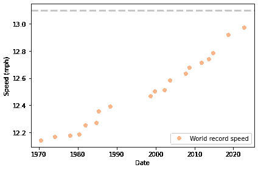

数据点大致落在一条直线上，尽管斜率可能在增加。

为了准备回归的数据，我将减去时间间隔的近似中点，1995 年。

```py
offset = pd.to_datetime('1995')
timedelta = table['date'] - offset 
```

当我们减去两个`Timestamp`对象时，结果是一个“时间差”，我们可以将其转换为秒，然后转换为年。

```py
data['x'] = timedelta.dt.total_seconds() / 3600 / 24 / 365.24 
```

显示代码单元格内容 隐藏代码单元格内容

```py
data['x'].describe() 
```

```py
count    19.000000
mean      2.161520
std      16.212660
min     -24.444201
25%     -11.633447
50%       4.810536
75%      15.236557
max      27.732450
Name: x, dtype: float64 
```

与前面的例子一样，我将使用最小二乘回归来计算参数的点估计，这将有助于选择先验。

```py
import statsmodels.formula.api as smf

formula = 'y ~ x'
results = smf.ols(formula, data=data).fit()
results.params 
```

```py
Intercept    12.464040
x             0.015931
dtype: float64 
```

估计的截距约为 12.5 英里/小时，这是 1995 年的插值世界纪录配速。估计的斜率约为每年 0.015 英里/小时，这是世界纪录配速根据模型的增长速度。

同样，我们可以使用残差的标准差作为`sigma`的点估计。

```py
results.resid.std() 
```

```py
0.04419653543387639 
```

这些参数让我们很好地了解了我们应该放置先验分布的位置。

## 先验

这是我为`斜率`、`截距`和`西格玛`选择的先验分布。

```py
qs = np.linspace(0.012, 0.018, 51)
prior_slope = make_uniform(qs, 'Slope') 
```

```py
qs = np.linspace(12.4, 12.5, 41)
prior_inter = make_uniform(qs, 'Intercept') 
```

```py
qs = np.linspace(0.01, 0.21, 31)
prior_sigma = make_uniform(qs, 'Sigma') 
```

这是联合先验分布。

```py
prior = make_joint3(prior_slope, prior_inter, prior_sigma)
prior.head() 
```

|  |  |  | 概率 |
| --- | --- | --- | --- |
| 斜率 | 截距 | 西格玛 |  |
| --- | --- | --- | --- |
| 0.012 | 12.4 | 0.010000 | 0.000015 |
| 0.016667 | 0.000015 |
| 0.023333 | 0.000015 |

现在我们可以像前面的例子一样计算可能性：

```py
xs = data['x']
ys = data['y']
likelihood = prior.copy()

for slope, inter, sigma in prior.index:
    expected = slope * xs + inter
    resid = ys - expected
    densities = norm.pdf(resid, 0, sigma)
    likelihood[slope, inter, sigma] = densities.prod() 
```

现在我们可以按照通常的方式进行更新。

```py
posterior = prior * likelihood
posterior.normalize() 
```

<details class="hide below-input"><summary aria-label="Toggle hidden content">显示代码单元格输出 隐藏代码单元格输出</summary>

```py
1161389020603.8816 
```</details>

并解包边际：

```py
posterior_slope = posterior.marginal(0)
posterior_inter = posterior.marginal(1)
posterior_sigma = posterior.marginal(2) 
```

<details class="hide above-input"><summary aria-label="Toggle hidden content">显示代码单元格内容 隐藏代码单元格内容</summary>

```py
posterior_sigma.plot(); 
```

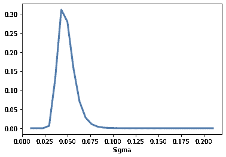</details>

这是`inter`的后验分布：

<details class="hide above-input"><summary aria-label="Toggle hidden content">显示代码单元格源代码 隐藏代码单元格源代码</summary>

```py
posterior_inter.plot(color='C1')
decorate(xlabel='intercept',
         ylabel='PDF',
         title='Posterior marginal distribution of intercept') 
```</details> 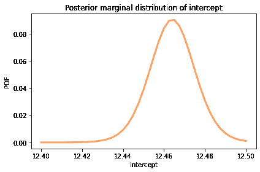<details class="hide above-input"><summary aria-label="Toggle hidden content">显示代码单元格内容 隐藏代码单元格内容</summary>

```py
summarize(posterior_inter) 
```

```py
12.464 [12.445  12.4825] 
```</details>

后验均值约为 12.5 英里，这是模型预测的日期范围中点的世界纪录马拉松配速，即 1994 年。

这是`斜率`的后验分布。

<details class="hide above-input"><summary aria-label="Toggle hidden content">显示代码单元格源代码 隐藏代码单元格源代码</summary>

```py
posterior_slope.plot(color='C4')
decorate(xlabel='Slope',
         ylabel='PDF',
         title='Posterior marginal distribution of slope') 
```</details> 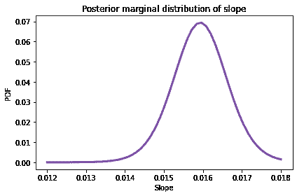<details class="hide above-input"><summary aria-label="Toggle hidden content">显示代码单元格内容 隐藏代码单元格内容</summary>

```py
summarize(posterior_slope) 
```

```py
0.016 [0.01476 0.01704] 
```</details>

后验均值约为每年 0.015 英里，或每十年 0.15 英里。

这很有趣，但它没有回答我们感兴趣的问题：何时会有两小时的马拉松？要回答这个问题，我们必须进行预测。

## 预测

为了生成预测，我将从参数的后验分布中抽取一个样本，然后使用回归方程将参数与数据结合起来。

`Pmf`提供了`choice`，我们可以使用它以后验概率作为权重进行有放回地随机抽样。

```py
sample = posterior.choice(101) 
```

结果是一个元组数组。遍历样本，我们可以使用回归方程来生成一系列`xs`的预测。

```py
xs = np.arange(-25, 50, 2)
pred = np.empty((len(sample), len(xs)))

for i, (slope, inter, sigma) in enumerate(sample):
    epsilon = norm(0, sigma).rvs(len(xs))
    pred[i] = inter + slope * xs + epsilon 
```

每个预测都是一个与`xs`长度相同的数组，我将其存储为`pred`中的一行。因此结果对于每个样本有一行，对于每个`x`的值有一列。

我们可以使用`percentile`来计算每列的第 5、50 和 95 百分位数。

```py
low, median, high = np.percentile(pred, [5, 50, 95], axis=0) 
```

为了展示结果，我将以线的形式绘制预测的中位数，并以阴影区域表示 90%的可信区间。

<details class="hide above-input"><summary aria-label="Toggle hidden content">显示代码单元格源代码 隐藏代码单元格源代码</summary>

```py
times = pd.to_timedelta(xs*365.24, unit='days') + offset

plt.fill_between(times, low, high, 
                 color='C2', alpha=0.1)
plt.plot(times, median, color='C2')

plot_speeds(data) 
```</details> 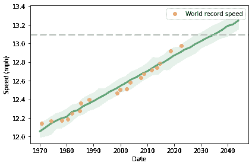

虚线显示了两小时马拉松配速，即每小时 13.1 英里。从视觉上，我们可以估计预测线在 2030 年到 2040 年之间达到目标配速。

为了使这更加精确，我们可以使用插值来查看预测何时到达终点。SciPy 提供了`interp1d`，默认情况下进行线性插值。

```py
from scipy.interpolate import interp1d

future = np.array([interp1d(high, xs)(13.1),
                   interp1d(median, xs)(13.1),
                   interp1d(low, xs)(13.1)]) 
```

<details class="hide above-input"><summary aria-label="Toggle hidden content">显示代码单元格内容 隐藏代码单元格内容</summary>

```py
dts = pd.to_timedelta(future*365.24, unit='day') + offset
pd.DataFrame(dict(datetime=dts),
             index=['early', 'median', 'late']) 
```

|  | 日期时间 |
| --- | --- |
| 早期 | 2028-03-24 16:47:21.722121600 |
| 中位数 | 2035-03-10 14:59:51.082915200 |

| 晚期 | 2040-12-29 22:53:36.679804800 |</details>

中位数预测为 2036 年，90%的可信区间为 2032 年至 2043 年。因此，在 2032 年之前，我们有大约 5%的机会看到两小时的马拉松比赛。

## 摘要

本章介绍了贝叶斯回归，它基于与最小二乘回归相同的模型；不同之处在于它为参数生成后验分布，而不是点估计。

在第一个示例中，我们研究了马萨诸塞州诺福克县降雪量的变化，并得出结论：现在的降雪量比我年轻时更多，与我的预期相反。

在第二个示例中，我们研究了男子马拉松世界纪录速度的进展，计算了回归参数的联合后验分布，并用它来预测未来 20 年的情况。

这些示例有三个参数，因此计算数据的可能性需要更长的时间。当参数超过三个时，使用网格算法变得不切实际。

在接下来的几章中，我们将探讨其他算法，这些算法可以减少我们需要进行贝叶斯更新的计算量，从而使得使用具有更多参数的模型成为可能。

但首先，您可能想要解决这些练习。

## 练习

**练习：** 我的印象是这里的气温比过去更暖和。在这个练习中，您可以对我的猜测进行测试。

我们将使用与建模降雪量相同的数据集；它还包括了我有生之年内马萨诸塞州诺福克县的每日最低和最高温度。

以下是数据。

<details class="hide above-input"><summary aria-label="Toggle hidden content">显示代码单元格内容 隐藏代码单元格内容</summary>

```py
df = pd.read_csv('2239075.csv', parse_dates=[2])
df.head(3) 
```

|  | STATION | NAME | DATE | PRCP | SNOW | SNWD | TMAX | TMIN | TOBS | WESD | WT01 | WT03 | WT04 | WT05 | WT06 | WT08 | WT09 | WT11 | WT16 | WT18 |
| --- | --- | --- | --- | --- | --- | --- | --- | --- | --- | --- | --- | --- | --- | --- | --- | --- | --- | --- | --- | --- |
| 0 | USC00190736 | BLUE HILL COOP, MA US | 1967-05-11 | 0.43 | 0.0 | 0.0 | 57 | 36.0 | NaN | NaN | NaN | NaN | NaN | NaN | NaN | NaN | NaN | NaN | NaN | NaN |
| 1 | USC00190736 | BLUE HILL COOP, MA US | 1967-05-12 | 0.00 | 0.0 | 0.0 | 58 | 39.0 | NaN | NaN | NaN | NaN | NaN | NaN | NaN | NaN | NaN | NaN | NaN | NaN |

| 2 | USC00190736 | BLUE HILL COOP, MA US | 1967-05-13 | 0.00 | 0.0 | 0.0 | 64 | 38.0 | NaN | NaN | NaN | NaN | NaN | NaN | NaN | NaN | NaN | NaN | NaN | NaN |</details>

同样，我将创建一个包含日期年份部分的列。

<details class="hide above-input"><summary aria-label="Toggle hidden content">显示代码单元格内容 隐藏代码单元格内容</summary>

```py
df['YEAR'] = df['DATE'].dt.year 
```</details>

该数据集包括`TMIN`和`TMAX`，它们是以华氏度为单位的每日最低和最高温度。我将创建一个新的列，其中包含每日最低和最高温度的中点。

<details class="hide above-input"><summary aria-label="Toggle hidden content">显示代码单元格内容 隐藏代码单元格内容</summary>

```py
df['TMID'] = (df['TMIN'] + df['TMAX']) / 2 
```</details>

现在我们可以按年份分组，并计算这些每日温度的平均值。

<details class="hide above-input"><summary aria-label="Toggle hidden content">显示代码单元格内容 隐藏代码单元格内容</summary>

```py
tmid = df.groupby('YEAR')['TMID'].mean()
len(tmid) 
```

```py
54 
```</details>

同样，我将删除第一年和最后一年，因为它们是不完整的。

<details class="hide above-input"><summary aria-label="Toggle hidden content">显示代码单元格内容 隐藏代码单元格内容</summary>

```py
complete = tmid.iloc[1:-1]
len(complete) 
```

```py
52 
```</details>

以下是时间序列的样子。

<details class="hide above-input"><summary aria-label="Toggle hidden content">显示代码单元格内容 隐藏代码单元格内容</summary>

```py
complete.plot(ls='', marker='o', alpha=0.5)

decorate(xlabel='Year',
         ylabel='Annual average of daily temperature (deg F)') 
```

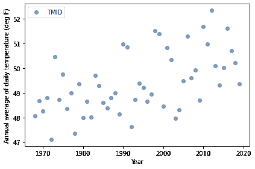</details>

与雪数据一样，我将把`Series`转换为`DataFrame`，以便为回归做准备。

<details class="hide above-input"><summary aria-label="Toggle hidden content">显示代码单元格内容 隐藏代码单元格内容</summary>

```py
data = complete.reset_index()
data.head() 
```

|  | 年份 | TMID |
| --- | --- | --- |
| 0 | 1968 | 48.071038 |
| 1 | 1969 | 48.687671 |
| 2 | 1970 | 48.258904 |
| 3 | 1971 | 48.804110 |

| 4 | 1972 | 47.112022 |</details> <details class="hide above-input"><summary aria-label="切换隐藏内容">显示代码单元格内容 隐藏代码单元格内容</summary>

```py
offset = round(data['YEAR'].mean())
offset 
```

```py
1994 
```</details> <details class="hide above-input"><summary aria-label="切换隐藏内容">显示代码单元格内容 隐藏代码单元格内容</summary>

```py
data['x'] = data['YEAR'] - offset
data['x'].mean() 
```

```py
-0.5 
```</details> <details class="hide above-input"><summary aria-label="切换隐藏内容">显示代码单元格内容 隐藏代码单元格内容</summary>

```py
data['y'] = data['TMID']
data['y'].std() 
```

```py
1.2389114009625752 
```</details>

现在我们可以使用 StatsModels 来估计参数。

<details class="hide above-input"><summary aria-label="切换隐藏内容">显示代码单元格内容 隐藏代码单元格内容</summary>

```py
import statsmodels.formula.api as smf

formula = 'y ~ x'
results = smf.ols(formula, data=data).fit()
results.params 
```

```py
Intercept    49.430172
x             0.044252
dtype: float64 
```</details>

并计算参数的标准差。

<details class="hide above-input"><summary aria-label="切换隐藏内容">显示代码单元格内容 隐藏代码单元格内容</summary>

```py
results.resid.std() 
```

```py
1.041705765390206 
```</details>

根据最小二乘回归模型，年均气温每年大约增加 0.044 华氏度。

为了量化这些参数的不确定性并为未来生成预测，我们可以使用贝叶斯回归。

1.  使用 StatsModels 生成回归参数的点估计。

1.  根据这些估计值为`slope`、`intercept`和`sigma`选择先验，并使用`make_joint3`生成联合先验分布。

1.  计算数据的似然性并计算参数的后验分布。

1.  提取`slope`的后验分布。我们对气温正在上升有多大的信心？

1.  从后验分布中抽取参数样本，并用它生成直到 2067 年的预测。

1.  绘制预测的中位数和 90%的可信区间，以及观察到的数据。

模型是否很好地拟合了数据？我们预计年均气温在我的（预期的）寿命内会增加多少？

<details class="hide above-input"><summary aria-label="切换隐藏内容">显示代码单元格内容 隐藏代码单元格内容</summary>

```py
# Solution

qs = np.linspace(0, 0.1, num=51)
prior_slope = make_uniform(qs, 'Slope') 
```</details> <details class="hide above-input"><summary aria-label="切换隐藏内容">显示代码单元格内容 隐藏代码单元格内容</summary>

```py
# Solution

qs = np.linspace(48, 52, num=41)
prior_inter = make_uniform(qs, 'Intercept') 
```</details> <details class="hide above-input"><summary aria-label="切换隐藏内容">显示代码单元格内容 隐藏代码单元格内容</summary>

```py
# Solution

qs = np.linspace(0.5, 2, num=31)
prior_sigma = make_uniform(qs, 'Sigma') 
```</details> <details class="hide above-input"><summary aria-label="切换隐藏内容">显示代码单元格内容 隐藏代码单元格内容</summary>

```py
# Solution

prior = make_joint3(prior_slope, prior_inter, prior_sigma)
prior.head() 
```

|  |  |  | 概率 |
| --- | --- | --- | --- |
| 斜率 | 截距 | Sigma |  |
| --- | --- | --- | --- |
| 0.0 | 48.0 | 0.50 | 0.000015 |
| 0.55 | 0.000015 |

| 0.60 | 0.000015 |</details> <details class="hide above-input"><summary aria-label="切换隐藏内容">显示代码单元格内容 隐藏代码单元格内容</summary>

```py
# Solution

xs = data['x']
ys = data['y']
likelihood = prior.copy()

for slope, inter, sigma in prior.index:
    expected = slope * xs + inter
    resid = ys - expected
    densities = norm.pdf(resid, 0, sigma)
    likelihood[slope, inter, sigma] = densities.prod() 
```</details> <details class="hide above-input"><summary aria-label="切换隐藏内容">显示代码单元格内容 隐藏代码单元格内容</summary>

```py
# Solution

posterior = prior * likelihood
posterior.normalize() 
```

```py
6.471589606597477e-36 
```</details> <details class="hide above-input"><summary aria-label="切换隐藏内容">显示代码单元格内容 隐藏代码单元格内容</summary>

```py
# Solution

posterior_slope = posterior.marginal(0)
posterior_inter = posterior.marginal(1)
posterior_sigma = posterior.marginal(2) 
```</details> <details class="hide above-input"><summary aria-label="切换隐藏内容">显示代码单元格内容 隐藏代码单元格内容</summary>

```py
# Solution

posterior_inter.plot()
decorate(xlabel='intercept (inches)',
         ylabel='PDF',
         title='Posterior marginal distribution of intercept') 
```

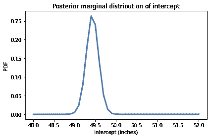</details><details class="hide above-input"><summary aria-label="切换隐藏内容">显示代码单元格内容 隐藏代码单元格内容</summary>

```py
# Solution

posterior_inter.mean(), posterior_inter.credible_interval(0.9) 
```

```py
(49.430172755332116, array([49.2, 49.7])) 
```</details> <details class="hide above-input"><summary aria-label="切换隐藏内容">显示代码单元格内容 隐藏代码单元格内容</summary>

```py
# Solution

posterior_slope.plot()
decorate(xlabel='Slope (inches per year)',
         ylabel='PDF',
         title='Posterior marginal distribution of slope') 
```

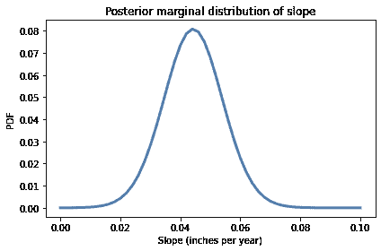</details><details class="hide above-input"><summary aria-label="切换隐藏内容">显示代码单元格内容 隐藏代码单元格内容</summary>

```py
# Solution

posterior_slope.mean(), posterior_slope.credible_interval(0.9) 
```

```py
(0.04425308067803314, array([0.028, 0.06 ])) 
```</details> <details class="hide above-input"><summary aria-label="切换隐藏内容">显示代码单元格内容 隐藏代码单元格内容</summary>

```py
# Solution

sample = posterior.choice(101)

years = np.arange(1967, 2067, 2)
xs = years - offset

pred = np.empty((len(sample), len(xs)))
for i, (slope, inter, sigma) in enumerate(sample):
    pred[i] = inter + slope * xs + norm(0, sigma).rvs(len(xs))

pred.shape 
```

```py
(101, 50) 
```</details> <details class="hide above-input"><summary aria-label="切换隐藏内容">显示代码单元格内容 隐藏代码单元格内容</summary>

```py
# Solution

low, median, high = np.percentile(pred, [5, 50, 95], axis=0)
median.shape 
```

```py
(50,) 
```</details> <details class="hide above-input"><summary aria-label="切换隐藏内容">显示代码单元格内容 隐藏代码单元格内容</summary>

```py
# Solution

plt.fill_between(years, low, high, alpha=0.1)
plt.plot(years, median, color='C0')

complete.plot(ls='', marker='o', alpha=0.5)

decorate(xlabel='Year',
         ylabel='Annual average of daily temperature (deg F)') 
```

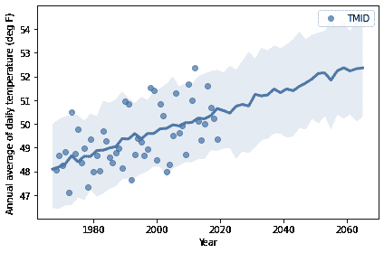</details><details class="hide above-input"><summary aria-label="切换隐藏内容">显示代码单元格内容 隐藏代码单元格内容</summary>

```py
# Solution

# median increase over my lifetime in degrees F

median[-1] - median[0] 
```

```py
4.264154393858554 
```</details>
