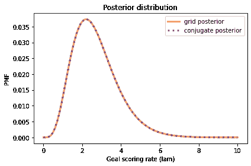
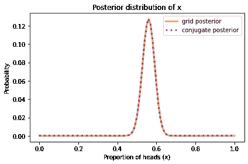
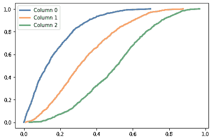
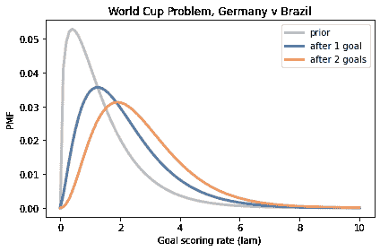
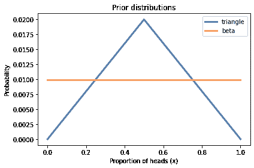
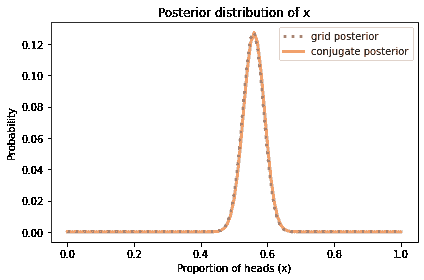
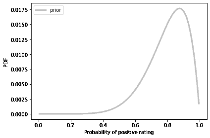
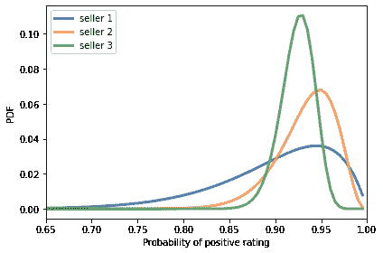

# 共轭先验

> 原文：[`allendowney.github.io/ThinkBayes2/chap18.html`](https://allendowney.github.io/ThinkBayes2/chap18.html)

在之前的章节中，我们已经使用网格近似来解决各种问题。我其中一个目标是要表明这种方法足以解决许多现实世界的问题。我认为这是一个很好的开始，因为它清楚地展示了这些方法的工作原理。

然而，正如我们在上一章中看到的，网格方法只能帮你走得更远。随着参数数量的增加，网格中的点数（字面上）呈指数级增长。对于超过 3-4 个参数，网格方法变得不切实际。

因此，在剩下的三章中，我将提出三种替代方案：

1.  在本章中，我们将使用**共轭先验**来加速我们已经完成的一些计算。

1.  在下一章中，我将介绍马尔可夫链蒙特卡洛（MCMC）方法，它可以在合理的时间内解决具有数十个甚至数百个参数的问题。

1.  在最后一章中，我们将使用近似贝叶斯计算（ABC）来解决难以用简单分布建模的问题。

我们将从世界杯问题开始。

## 重新审视世界杯问题

在<<_PoissonProcesses>>中，我们使用泊松过程解决了世界杯问题，将足球比赛中的进球建模为随机事件，这些事件在比赛的任何时间点都同样可能发生。

我们使用 gamma 分布来表示\(\lambda\)的先验分布，即进球率。我们使用泊松分布来计算\(k\)的概率，即进球数。

这是代表先验分布的 gamma 对象。

```py
from scipy.stats import gamma

alpha = 1.4
dist = gamma(alpha) 
```

这是一个网格近似。

```py
import numpy as np
from utils import pmf_from_dist

lams = np.linspace(0, 10, 101)
prior = pmf_from_dist(dist, lams) 
```

这是对于每个可能的`lam`值得分 4 个目标的可能性。

```py
from scipy.stats import poisson

k = 4
likelihood = poisson(lams).pmf(k) 
```

这是更新的方法。

```py
posterior = prior * likelihood
posterior.normalize() 
```

```py
0.05015532557804499 
```

到目前为止，这应该是熟悉的。现在我们将使用共轭先验来解决相同的问题。

## 共轭先验

在<<_TheGammaDistribution>>中，我提出了使用 gamma 分布作为先验的三个原因，并说有第四个原因我将稍后揭示。现在是时候了。

我选择 gamma 分布的另一个原因是它是泊松分布的“共轭先验”，所谓的共轭是因为这两个分布是相连的或耦合的，这就是“共轭”的含义。

在下一节中，我将解释它们是如何相连的，但首先我将向你展示这种联系的后果，即计算后验分布有一个非常简单的方法。

但是，为了演示它，我们必须从 gamma 分布的单参数版本切换到双参数版本。由于第一个参数称为`alpha`，你可能会猜到第二个参数称为`beta`。

以下函数接受`alpha`和`beta`，并创建一个代表具有这些参数的 gamma 分布的对象。

```py
def make_gamma_dist(alpha, beta):
  """Makes a gamma object."""
    dist = gamma(alpha, scale=1/beta)
    dist.alpha = alpha
    dist.beta = beta
    return dist 
```

这是先验分布，其中`alpha=1.4`，`beta=1`。

```py
alpha = 1.4
beta = 1

prior_gamma = make_gamma_dist(alpha, beta)
prior_gamma.mean() 
```

```py
1.4 
```

现在我声称，我们可以通过使用参数为`alpha+k`和`beta+1`的 gamma 分布来进行`k`个目标的贝叶斯更新，尽管没有证明。

```py
def update_gamma(prior, data):
  """Update a gamma prior."""
    k, t = data
    alpha = prior.alpha + k
    beta = prior.beta + t
    return make_gamma_dist(alpha, beta) 
```

这是我们在`t=1`场比赛中用`k=4`个目标更新的方法。

```py
data = 4, 1
posterior_gamma = update_gamma(prior_gamma, data) 
```

在我们用网格做的所有工作之后，我们可能会觉得通过添加两对数字来进行贝叶斯更新是荒谬的。所以让我们确认它是否有效。

我将使用离散近似的后验分布来创建一个`Pmf`。

```py
posterior_conjugate = pmf_from_dist(posterior_gamma, lams) 
```

下图显示了使用网格算法计算的结果以及我们计算的后验分布。

<details class="hide above-input"><summary aria-label="切换隐藏内容">显示代码单元格内容隐藏代码单元格内容</summary>

```py
from utils import decorate

def decorate_rate(title=''):
    decorate(xlabel='Goal scoring rate (lam)',
             ylabel='PMF',
             title=title) 
```</details> <details class="hide above-input"><summary aria-label="切换隐藏内容">显示代码单元格源代码隐藏代码单元格源代码</summary>

```py
posterior.plot(label='grid posterior', color='C1')
posterior_conjugate.plot(label='conjugate posterior', 
                         color='C4', ls=':')

decorate_rate('Posterior distribution') 
```</details> 

它们除了由于浮点近似而产生的小差异外，都是相同的。

<details class="hide above-input"><summary aria-label="Toggle hidden content">显示代码单元格内容 隐藏代码单元格内容</summary>

```py
np.allclose(posterior, posterior_conjugate) 
```

```py
True 
```</details>

## 实际是什么？

为了理解它是如何工作的，我们将写出伽玛先验的 PDF 和泊松似然的 PMF，然后将它们相乘，因为这就是贝叶斯更新所做的。我们会发现结果是一个伽玛分布，并推导出它的参数。

这是伽玛先验的概率密度，给定参数 \(\alpha\) 和 \(\beta\)，对于每个 \(\lambda\) 的值：

\[\lambda^{\alpha-1} e^{-\lambda \beta}\]

我省略了归一化因子；因为我们打算在更新后归一化后验分布，所以我们实际上不需要它。

现在假设一个团队在 \(t\) 场比赛中进了 \(k\) 个球。这个数据的概率由泊松分布的 PMF 给出，这是一个关于 \(k\) 的函数，参数是 \(\lambda\) 和 \(t\)。

\[\lambda^k e^{-\lambda t}\]

同样，我省略了归一化因子，这样更清楚地表明伽玛分布和泊松分布具有相同的函数形式。当我们将它们相乘时，我们可以将因子配对并加上指数。结果是未归一化的后验分布，

\[\lambda^{\alpha-1+k} e^{-\lambda(\beta + t)}\]

我们可以将其识别为具有参数 \(\alpha + k\) 和 \(\beta + t\) 的未归一化伽玛分布。

这个推导揭示了后验分布的参数意味着什么：\(\alpha\) 反映了已发生事件的数量；\(\beta\) 反映了经过的时间。

## 二项式似然

作为第二个例子，让我们再次看看欧元问题。当我们使用网格算法解决它时，我们从均匀先验开始：

```py
from utils import make_uniform

xs = np.linspace(0, 1, 101)
uniform = make_uniform(xs, 'uniform') 
```

我们使用二项分布来计算数据的似然，这是在 250 次尝试中出现 140 次正面的情况。

```py
from scipy.stats import binom

k, n = 140, 250
xs = uniform.qs
likelihood = binom.pmf(k, n, xs) 
```

然后我们按照通常的方式计算了后验分布。

```py
posterior = uniform * likelihood
posterior.normalize() 
```

<details class="hide below-input"><summary aria-label="Toggle hidden content">显示代码单元格输出 隐藏代码单元格输出</summary>

```py
0.003944617569326651 
```</details>

我们可以使用二项分布的共轭先验——贝塔分布更有效地解决这个问题。

贝塔分布在 0 和 1 之间，因此很适合表示像 `x` 这样的概率分布。它有两个参数，称为 `alpha` 和 `beta`，决定了分布的形状。

SciPy 提供了一个名为 `beta` 的对象，表示贝塔分布。以下函数接受 `alpha` 和 `beta`，并返回一个新的 `beta` 对象。

```py
import scipy.stats

def make_beta(alpha, beta):
  """Makes a beta object."""
    dist = scipy.stats.beta(alpha, beta)
    dist.alpha = alpha
    dist.beta = beta
    return dist 
```

原来均匀分布，我们用作先验的分布，是具有参数 `alpha=1` 和 `beta=1` 的贝塔分布。因此，我们可以创建一个表示均匀分布的 `beta` 对象，如下所示：

```py
alpha = 1
beta = 1

prior_beta = make_beta(alpha, beta) 
```

现在让我们来弄清楚如何进行更新。和之前的例子一样，我们将写出先验分布的 PDF 和似然函数的 PMF，然后将它们相乘。我们会发现乘积的形式和先验分布相同，并且我们将推导出它的参数。

这是贝塔分布的 PDF，它是关于 \(x\) 的函数，参数是 \(\alpha\) 和 \(\beta\)。

\[x^{\alpha-1} (1-x)^{\beta-1}\]

同样，我省略了归一化因子，因为我们打算在更新后归一化分布。

这是二项分布的 PMF，它是关于 \(k\) 的函数，参数是 \(n\) 和 \(x\)。

\[x^{k} (1-x)^{n-k}\]

同样，我省略了归一化因子。现在当我们将贝塔先验和二项式似然相乘时，结果是

\[x^{\alpha-1+k} (1-x)^{\beta-1+n-k}\]

我们将其识别为具有参数 \(\alpha+k\) 和 \(\beta+n-k\) 的未归一化贝塔分布。

因此，如果我们观察到在 n 次试验中有 k 次成功，我们可以通过使用参数为`alpha+k`和`beta+n-k`的贝塔分布来进行更新。这就是这个函数的作用：

```py
def update_beta(prior, data):
  """Update a beta distribution."""
    k, n = data
    alpha = prior.alpha + k
    beta = prior.beta + n - k
    return make_beta(alpha, beta) 
```

再次，共轭先验使我们能够洞察参数的含义；\(\alpha\)与观察到的成功次数有关；\(\beta\)与失败次数有关。

这是我们如何使用观察到的数据进行更新。

```py
data = 140, 250
posterior_beta = update_beta(prior_beta, data) 
```

为了确认它是否有效，我将评估`xs`的可能值的后验分布，并将结果放入`Pmf`中。

```py
posterior_conjugate = pmf_from_dist(posterior_beta, xs) 
```

我们可以将我们刚刚计算的后验分布与网格算法的结果进行比较。

<details class="hide above-input"><summary aria-label="Toggle hidden content">显示代码单元格内容 隐藏代码单元格内容</summary>

```py
def decorate_euro(title):
    decorate(xlabel='Proportion of heads (x)',
             ylabel='Probability',
             title=title) 
```</details> <details class="hide above-input"><summary aria-label="Toggle hidden content">显示代码单元格源代码 隐藏代码单元格源代码</summary>

```py
posterior.plot(label='grid posterior', color='C1')
posterior_conjugate.plot(label='conjugate posterior',
                        color='C4', ls=':')

decorate_euro(title='Posterior distribution of x') 
```</details> 

它们除了由于浮点近似而产生的小差异外是相同的。

到目前为止的例子都是我们已经解决的问题，所以让我们尝试一些新的东西。

<details class="hide above-input"><summary aria-label="Toggle hidden content">显示代码单元格内容 隐藏代码单元格内容</summary>

```py
np.allclose(posterior, posterior_conjugate) 
```

```py
True 
```</details>

## 狮子和老虎和熊

假设我们参观一个野生动物保护区，在那里我们知道唯一的动物是狮子和老虎和熊，但我们不知道每种动物的数量。在游览期间，我们看到 3 只狮子，2 只老虎和一只熊。假设每只动物有相等的机会出现在我们的样本中，那么我们下一次看到的动物是熊的概率是多少？

为了回答这个问题，我们将使用数据来估计每个物种的盛行率，也就是说，动物中属于每个物种的比例。如果我们知道盛行率，我们可以使用多项分布来计算数据的概率。例如，假设我们知道狮子、老虎和熊的比例分别为 0.4、0.3 和 0.3。

在这种情况下，数据的概率是：

```py
from scipy.stats import multinomial

data = 3, 2, 1
n = np.sum(data)
ps = 0.4, 0.3, 0.3

multinomial.pmf(data, n, ps) 
```

```py
0.10368 
```

现在，我们可以为盛行率选择一个先验，并使用多项分布进行贝叶斯更新，计算数据的概率。

但有一个更简单的方法，因为多项分布有一个共轭先验：狄利克雷分布。

## 狄利克雷分布

狄利克雷分布是一个多元分布，就像我们在<<_MultivariateNormalDistribution>>中使用的多元正态分布来描述企鹅测量的分布。

在这个例子中，分布中的数量是脚蹼长度和喙长度的对，分布的参数是均值向量和协方差矩阵。

在狄利克雷分布中，数量是概率向量\(\mathbf{x}\)，参数是向量\(\mathbf{\alpha}\)。

一个例子会让这一点更清楚。SciPy 提供了一个`dirichlet`对象，表示狄利克雷分布。这是一个实例，\(\mathbf{\alpha} = 1, 2, 3\)。

```py
from scipy.stats import dirichlet

alpha = 1, 2, 3
dist = dirichlet(alpha) 
```

由于我们提供了三个参数，结果是三个变量的分布。如果我们从这个分布中随机抽取一个值，就像这样：

```py
dist.rvs() 
```

```py
array([[0.53566485, 0.35129   , 0.11304515]]) 
```

<details class="hide above-input"><summary aria-label="Toggle hidden content">显示代码单元格内容 隐藏代码单元格内容</summary>

```py
dist.rvs().sum() 
```

```py
1.0 
```</details>

结果是一个包含三个值的数组。它们介于 0 和 1 之间，并且它们总是加起来等于 1，因此它们可以被解释为一组相互排斥且完全耗尽的结果的概率。

让我们看看这些值的分布是什么样子的。我将从这个分布中随机抽取 1000 个向量，就像这样：

```py
sample = dist.rvs(1000) 
```

<details class="hide above-input"><summary aria-label="Toggle hidden content">显示代码单元格内容 隐藏代码单元格内容</summary>

```py
sample.shape 
```

```py
(1000, 3) 
```</details>

结果是一个包含 1000 行和三列的数组。我将计算每列中值的`Cdf`。

```py
from empiricaldist import Cdf

cdfs = [Cdf.from_seq(col) 
        for col in sample.transpose()] 
```

结果是一个代表三个变量的边缘分布的`Cdf`对象列表。它们看起来是这样的。

<details class="hide above-input"><summary aria-label="切换隐藏内容">显示代码单元格源代码隐藏代码单元格源代码</summary>

```py
for i, cdf in enumerate(cdfs):
    label = f'Column {i}'
    cdf.plot(label=label)

decorate() 
```</details> 

第 0 列对应最低参数，包含最低概率。第 2 列对应最高参数，包含最高概率。

事实证明，这些边际分布是贝塔分布。以下函数接受参数序列`alpha`，并计算变量`i`的边缘分布：

```py
def marginal_beta(alpha, i):
  """Compute the ith marginal of a Dirichlet distribution."""
    total = np.sum(alpha)
    return make_beta(alpha[i], total-alpha[i]) 
```

我们可以用它来计算三个变量的边缘分布。

```py
marginals = [marginal_beta(alpha, i)
             for i in range(len(alpha))] 
```

下图显示了这些分布的 CDF 作为灰色线，并将它们与样本的 CDF 进行了比较。

<details class="hide above-input"><summary aria-label="切换隐藏内容">显示代码单元格源代码隐藏代码单元格源代码</summary>

```py
xs = np.linspace(0, 1, 101)

for i in range(len(alpha)):
    label = f'Column {i}'

    pmf = pmf_from_dist(marginals[i], xs)
    pmf.make_cdf().plot(color='C5')

    cdf = cdfs[i]
    cdf.plot(label=label, ls=':')

decorate() 
```</details> 

这证实了狄利克雷分布的边缘分布是贝塔分布。这很有用，因为狄利克雷分布是多项式似然函数的共轭先验。

如果先验分布是具有参数向量`alpha`的狄利克雷分布，数据是一组观测值`data`的向量，则后验分布是具有参数向量`alpha + data`的狄利克雷分布。

作为本章结束时的练习，您可以使用这种方法来解决狮子、老虎和熊的问题。

## 总结

阅读完本章后，如果你觉得自己被愚弄了，我理解。事实证明，这本书中的许多问题只需要进行一些算术运算就可以解决。那么为什么我们要费这么大劲使用网格算法呢？

遗憾的是，我们只能用共轭先验解决少数问题；事实上，本章包括了实践中大部分有用的问题。

对于绝大多数问题，没有共轭先验，也没有计算后验分布的捷径。这就是为什么我们需要网格算法和接下来两章中的方法，即近似贝叶斯计算（ABC）和马尔可夫链蒙特卡洛方法（MCMC）。

## 练习

**练习：**在世界杯问题的第二个版本中，我们用于更新的数据不是一场比赛中的进球数，而是直到第一个进球的时间。因此，数据的概率由指数分布给出，而不是泊松分布。

但事实证明，伽玛分布也是指数分布的共轭先验，因此也有一种简单的方法来计算这个更新。指数分布的 PDF 是关于\(t\)的函数，其中\(\lambda\)是参数。

\[\lambda e^{-\lambda t}\]

将伽玛先验的 PDF 乘以这个似然，确认结果是一个未归一化的伽玛分布，并看看你是否可以推导出它的参数。

写几行代码来使用这个问题版本的数据更新`prior_gamma`，这是在 11 分钟后的第一个目标和额外 12 分钟后的第二个目标之后的第一个目标。

记得用大约 90 分钟的游戏单位来表示这些数量。

<details class="hide above-input"><summary aria-label="切换隐藏内容">显示代码单元格内容隐藏代码单元格内容</summary>

```py
# Solution

"""
The unnormalized posterior is

\lambda^{\alpha-1+1} e^{-(\beta + t) \lambda}

which is an unnormalized gamma distribution with parameters
`alpha+1` and `beta+t`, which means that we observed 1 goal
in elapsed time `t`.

So we can use the same update function and call it like this:
"""

data = 1, 11/90
posterior1 = update_gamma(prior_gamma, data) 
```</details> <details class="hide above-input"><summary aria-label="切换隐藏内容">显示代码单元格内容隐藏代码单元格内容</summary>

```py
# Solution

# Here's the second update

data = 1, 12/90
posterior2 = update_gamma(posterior1, data) 
```</details> <details class="hide above-input"><summary aria-label="Toggle hidden content">显示代码单元格内容隐藏代码单元格内容</summary>

```py
# Solution

prior_gamma.mean(), posterior1.mean(), posterior2.mean() 
```

```py
(1.4, 2.1386138613861387, 2.7079646017699113) 
```</details> <details class="hide above-input"><summary aria-label="Toggle hidden content">显示代码单元格内容隐藏代码单元格内容</summary>

```py
# Solution

# And here's what the posteriors look like

pmf_from_dist(prior_gamma, lams).plot(color='C5', label='prior')
pmf_from_dist(posterior1, lams).plot(label='after 1 goal')
pmf_from_dist(posterior2, lams).plot(label='after 2 goals')

decorate_rate(title='World Cup Problem, Germany v Brazil') 
```

</details>

**练习：** 对于像欧元问题这样的似然函数是二项式的问题，我们可以通过一些算术运算进行贝叶斯更新，但前提是先验是一个贝塔分布。

如果我们想要一个均匀的先验分布，我们可以使用`alpha=1`和`beta=1`的贝塔分布。但是如果我们想要的先验分布不是贝塔分布怎么办？例如，在<<_TrianglePrior>>中，我们还用三角形先验解决了欧元问题，这不是一个贝塔分布。

在这些情况下，我们通常可以找到一个贝塔分布，它是我们想要的先验的一个足够好的近似。看看你是否能找到一个适合三角形先验的贝塔分布，然后使用`update_beta`进行更新。

使用`pmf_from_dist`制作一个近似后验分布的`Pmf`，并将其与我们刚刚使用网格算法计算的后验进行比较。它们之间的最大差异有多大？

这是三角形先验。

<details class="hide above-input"><summary aria-label="Toggle hidden content">显示代码单元格内容隐藏代码单元格内容</summary>

```py
from empiricaldist import Pmf

ramp_up = np.arange(50)
ramp_down = np.arange(50, -1, -1)

a = np.append(ramp_up, ramp_down)
xs = uniform.qs

triangle = Pmf(a, xs, name='triangle')
triangle.normalize() 
```

```py
2500 
```</details>

这是更新。

<details class="hide above-input"><summary aria-label="Toggle hidden content">显示代码单元格内容隐藏代码单元格内容</summary>

```py
k, n = 140, 250
likelihood = binom.pmf(k, n, xs)

posterior = triangle * likelihood
posterior.normalize() 
```

```py
0.007008842590059086 
```</details>

为了帮助你入门，这是我们用作均匀先验的贝塔分布。

<details class="hide above-input"><summary aria-label="Toggle hidden content">显示代码单元格内容隐藏代码单元格内容</summary>

```py
alpha = 1
beta = 1

prior_beta = make_beta(alpha, beta)
prior_beta.mean() 
```

```py
0.5 
```</details>

这是它与三角形先验的比较。

<details class="hide above-input"><summary aria-label="Toggle hidden content">显示代码单元格内容隐藏代码单元格内容</summary>

```py
prior_pmf = pmf_from_dist(prior_beta, xs)

triangle.plot(label='triangle')
prior_pmf.plot(label='beta')

decorate_euro('Prior distributions') 
```

</details>

现在由你来继续。

<details class="hide above-input"><summary aria-label="Toggle hidden content">显示代码单元格内容隐藏代码单元格内容</summary>

```py
# Solution

data = 140, 250
posterior_beta = update_beta(prior_beta, data)
posterior_beta.mean() 
```

```py
0.5595238095238095 
```</details> <details class="hide above-input"><summary aria-label="Toggle hidden content">显示代码单元格内容隐藏代码单元格内容</summary>

```py
# Solution

posterior_conjugate = pmf_from_dist(posterior_beta, xs) 
```</details> <details class="hide above-input"><summary aria-label="Toggle hidden content">显示代码单元格内容隐藏代码单元格内容</summary>

```py
# Solution

posterior.plot(label='grid posterior', ls=':')
posterior_conjugate.plot(label='conjugate posterior')

decorate(xlabel='Proportion of heads (x)',
         ylabel='Probability',
         title='Posterior distribution of x') 
```

</details><details class="hide above-input"><summary aria-label="Toggle hidden content">显示代码单元格内容隐藏代码单元格内容</summary>

```py
# Solution

# The largest absolute difference is pretty small

np.allclose(posterior, posterior_conjugate) 
```

```py
False 
```</details>

**练习：** [3Blue1Brown](https://en.wikipedia.org/wiki/3Blue1Brown) 是一个关于数学的 YouTube 频道；如果你还不知道它，我强烈推荐。在[这个视频](https://www.youtube.com/watch?v=8idr1WZ1A7Q)中，叙述者提出了这个问题：

> 你正在网上购买一个产品，看到有三个卖家以相同的价格提供相同的产品。其中一个卖家有 100%的积极评价，但只有 10 条评论。另一个卖家有 96%的积极评价，共有 50 条评论。还有一个卖家有 93%的积极评价，但共有 200 条评论。
> 
> 你应该从哪个卖家购买？

让我们思考如何对这种情景建模。假设每个卖家都有一些未知的概率`x`，能够提供满意的服务并获得积极评价，我们想选择具有最高`x`值的卖家。

这不是这种情况的唯一模型，也不一定是最好的。另一种选择可能是项目反应理论，其中卖家有不同的能力提供满意的服务，顾客有不同的满意度难度。

但第一个模型具有简单的优点，所以让我们看看它能带给我们什么。

1.  作为先验，我建议使用 `alpha=8`，`beta=2` 的贝塔分布。这个先验是什么样子的，它对卖家有什么暗示？

1.  使用数据更新三个卖家的先验，并绘制后验分布。哪个卖家具有最高的后验均值？

1.  我们对我们的选择应该有多大的信心？也就是说，具有最高后验均值的卖家实际上具有最高的 `x` 值的概率是多少？

1.  考虑一个贝塔先验，其中 `alpha=0.7`，`beta=0.5`。这个先验是什么样子的，它对卖家有什么暗示？

1.  使用这个先验再次运行分析，看看它对结果有什么影响。

注意：当你评估贝塔分布时，你应该限制 `xs` 的范围，使其不包括 0 和 1。当贝塔分布的参数小于 1 时，概率密度在 0 和 1 处趋于无穷大。从数学的角度来看，这并不是问题；它仍然是一个适当的概率分布。但从计算的角度来看，这意味着我们必须避免在 0 和 1 处评估概率密度函数。

<details class="hide above-input"><summary aria-label="切换隐藏内容">显示代码单元格内容 隐藏代码单元格内容</summary>

```py
# Solution

# The first prior implies that most sellers are 
# satisfactory most of the time, but none are perfect.

prior = make_beta(8, 2)

xs = np.linspace(0.005, 0.995, 199)
prior_pmf = pmf_from_dist(prior, xs)
prior_pmf.plot(color='C5', label='prior')

decorate(xlabel='Probability of positive rating',
         ylabel='PDF') 
```

</details><details class="hide above-input"><summary aria-label="切换隐藏内容">显示代码单元格内容 隐藏代码单元格内容</summary>

```py
# Solution

data1 = 10, 10
data2 = 48, 50
data3 = 186, 200 
``` </details> <details class="hide above-input"><summary aria-label="切换隐藏内容">显示代码单元格内容 隐藏代码单元格内容</summary>

```py
# Solution

seller1 = update_beta(prior, data1)
seller2 = update_beta(prior, data2)
seller3 = update_beta(prior, data3) 
``` </details> <details class="hide above-input"><summary aria-label="切换隐藏内容">显示代码单元格内容 隐藏代码单元格内容</summary>

```py
# Solution

seller1_pmf = pmf_from_dist(seller1, xs)
seller2_pmf = pmf_from_dist(seller2, xs)
seller3_pmf = pmf_from_dist(seller3, xs) 
``` </details> <details class="hide above-input"><summary aria-label="切换隐藏内容">显示代码单元格内容 隐藏代码单元格内容</summary>

```py
# Solution

seller1_pmf.plot(label='seller 1')
seller2_pmf.plot(label='seller 2')
seller3_pmf.plot(label='seller 3')

decorate(xlabel='Probability of positive rating',
         ylabel='PDF',
         xlim=(0.65, 1.0)) 
```

</details><details class="hide above-input"><summary aria-label="切换隐藏内容">显示代码单元格内容 隐藏代码单元格内容</summary>

```py
# Solution

seller1.mean(), seller2.mean(), seller3.mean() 
```

```py
(0.9, 0.9333333333333333, 0.9238095238095239) 
``` </details> <details class="hide above-input"><summary aria-label="切换隐藏内容">显示代码单元格内容 隐藏代码单元格内容</summary>

```py
# Solution

iters = 10000
a = np.empty((3, iters))

a[0] = seller1.rvs(iters)
a[1] = seller2.rvs(iters)
a[2] = seller3.rvs(iters) 
``` </details> <details class="hide above-input"><summary aria-label="切换隐藏内容">显示代码单元格内容 隐藏代码单元格内容</summary>

```py
# Solution

from empiricaldist import Pmf

best = np.argmax(a, axis=0)
Pmf.from_seq(best) 
```

|  | 概率 |
| --- | --- |
| 0 | 0.2948 |
| 1 | 0.4750 |

| 2 | 0.2302 |</details>

**练习：** 使用参数向量 `alpha = [1, 1, 1]` 的狄利克雷先验来解决狮子、老虎和熊的问题：

> 假设我们参观一个野生动物保护区，我们知道那里的动物只有狮子、老虎和熊，但我们不知道每种动物的数量。
> 
> 在游览期间，我们看到三只狮子，两只老虎和一只熊。假设每种动物在我们的样本中出现的机会是相等的，估计每种动物的普遍性。
> 
> 下一个我们看到的动物是熊的概率是多少？

<details class="hide above-input"><summary aria-label="切换隐藏内容">显示代码单元格内容 隐藏代码单元格内容</summary>

```py
# Solution

prior_alpha = np.array([1, 1, 1])
data = 3, 2, 1 
``` </details> <details class="hide above-input"><summary aria-label="切换隐藏内容">显示代码单元格内容 隐藏代码单元格内容</summary>

```py
# Solution

posterior_alpha = prior_alpha + data 
``` </details> <details class="hide above-input"><summary aria-label="切换隐藏内容">显示代码单元格内容 隐藏代码单元格内容</summary>

```py
# Solution

marginal_bear = marginal_beta(posterior_alpha, 2)
marginal_bear.mean() 
```

```py
0.2222222222222222 
```</details> <details class="hide above-input"><summary aria-label="切换隐藏内容">显示代码单元格内容 隐藏代码单元格内容</summary>

```py
# Solution

dist = dirichlet(posterior_alpha) 
```</details> <details class="hide above-input"><summary aria-label="切换隐藏内容">显示代码单元格内容 隐藏代码单元格内容</summary>

```py
# Solution

import pandas as pd

index = ['lion', 'tiger', 'bear']
pd.DataFrame(dist.mean(), index, columns=['prob']) 
```

|  | 概率 |
| --- | --- |
| 狮子 | 0.444444 |
| 老虎 | 0.333333 |

| 熊 | 0.222222 |</details>
