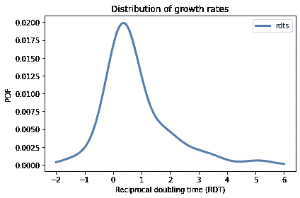
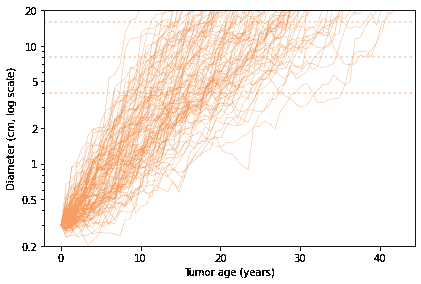
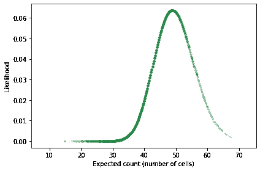
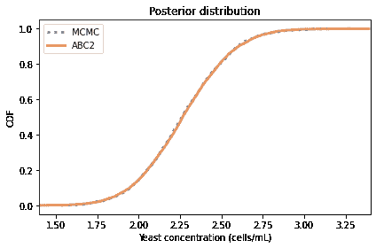
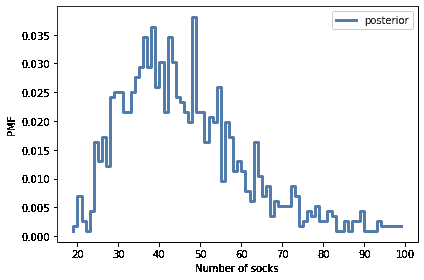

# 第二十章：近似贝叶斯计算

> 原文：[`allendowney.github.io/ThinkBayes2/chap20.html`](https://allendowney.github.io/ThinkBayes2/chap20.html)
> 
> 译者：[飞龙](https://github.com/wizardforcel)
> 
> 协议：[CC BY-NC-SA 4.0](http://creativecommons.org/licenses/by-nc-sa/4.0/)

本章介绍了一种应对最复杂问题的最后手段，即近似贝叶斯计算（ABC）。我说这是最后的手段，因为它通常需要比其他方法更多的计算，所以如果您可以以其他方式解决问题，那就应该这样做。然而，在本章的例子中，ABC 不仅易于实现，而且高效。

第一个例子是我对一个患有肾脏肿瘤的患者提出的问题的解决方案。我使用了医学期刊上的数据来模拟肿瘤生长，并使用模拟来估计肿瘤的年龄。

第二个例子是细胞计数模型，它在生物学、医学和酿酒学（啤酒制造）中都有应用。给定稀释样本的细胞计数，我们估计细胞的浓度。

最后，作为一项练习，您将有机会解决一个有趣的袜子计数问题。

## 肾脏肿瘤问题

我经常阅读并偶尔在[`reddit.com/r/statistics`](http://reddit.com/r/statistics)的在线统计论坛上发表贴子。2011 年 11 月，我读到了以下消息：

> “我患有第四期肾癌，正在尝试确定癌症是否在我从军队退休之前形成。…鉴于退伍和发现的日期，是否可能确定我患病的概率为 50/50？是否可能确定退伍日期上的概率？我的肿瘤在检测时为 15.5 厘米 x15 厘米。II 级。”

我联系了留言的作者以获取更多信息；我了解到，如果有“更可能是”的证据表明肿瘤是在他们服役期间形成的（还有其他考虑因素），退伍军人将获得不同的福利。因此，我同意帮助他回答他的问题。

由于肾脏肿瘤生长缓慢，通常不会引起症状，因此有时会不加治疗。因此，医生可以通过比较同一患者在不同时间的扫描来观察未经治疗的肿瘤的生长速率。有几篇论文报道了这些生长速率。

对于我的分析，我使用了[Zhang et al](https://pubs.rsna.org/doi/full/10.1148/radiol.2501071712)的一篇论文中的数据。他们以两种形式报告生长速率：

+   体积倍增时间，即肿瘤倍增的时间。

+   倒数倍增时间（RDT），即每年的倍增次数。

下一节将展示我们如何处理这些生长速率。

Zhang et al, 通过使用连续体积 CT 测量确定的肾脏肿瘤生长速率分布，2009 年 1 月《放射学》，250，137-144。

[`pubs.rsna.org/doi/full/10.1148/radiol.2501071712`](https://pubs.rsna.org/doi/full/10.1148/radiol.2501071712)

## 一个简单的生长模型

我们将从基于两个假设的肿瘤生长的简单模型开始：

+   肿瘤以恒定的倍增时间生长

+   它们大致呈球形。

我将定义两个时间点：

+   `t1`是我的通讯者退休时。

+   `t2`是肿瘤被检测到的时间。

`t1`和`t2`之间的时间约为 9.0 年。例如，假设肿瘤在`t1`时的直径为 1 厘米，我们可以估计它在`t2`时的大小。

我将使用以下函数来计算具有给定直径的球体的体积。

```py
import numpy as np

def calc_volume(diameter):
  """Converts a diameter to a volume."""
    factor = 4 * np.pi / 3
    return factor * (diameter/2.0)**3 
```

假设肿瘤是球形的，我们可以计算它在`t1`时的体积。

```py
d1 = 1
v1 = calc_volume(d1)
v1 
```

```py
0.5235987755982988 
```

Zhang et al.报告的中位体积倍增时间为 811 天，对应于每年 0.45 倍增。

```py
median_doubling_time = 811
rdt = 365 / median_doubling_time
rdt 
```

```py
0.45006165228113443 
```

我们可以计算在`t1`和`t2`之间的时间间隔内会发生的倍增次数：

```py
interval = 9.0
doublings = interval * rdt
doublings 
```

```py
4.05055487053021 
```

给定`v1`和倍增次数，我们可以计算`t2`时的体积。

```py
v2 = v1 * 2**doublings
v2 
```

```py
8.676351488087187 
```

以下函数计算具有给定体积的球体的直径。

```py
def calc_diameter(volume):
  """Converts a volume to a diameter."""
    factor = 3 / np.pi / 4
    return 2 * (factor * volume)**(1/3) 
```

因此，我们可以计算在`t2`时肿瘤的直径：

```py
d2 = calc_diameter(v2)
d2 
```

```py
2.5494480788327483 
```

如果肿瘤在`t1`时的直径为 1 厘米，并且以中位数速率生长，那么在`t2`时，直径将约为 2.5 厘米。

这个例子演示了生长模型，但它并没有回答我对方提出的问题。

## 更一般的模型

给定诊断时肿瘤的大小，我们想知道其年龄分布。为了找到它，我们将运行肿瘤生长的模拟，以获得在年龄条件下大小的分布。然后我们将计算在大小条件下的年龄分布。

模拟从一个小肿瘤开始，并运行以下步骤：

1.  从增长率的分布中选择一个值。

1.  计算间隔结束时肿瘤的大小。

1.  重复直到肿瘤超过最大相关大小。

因此，我们需要的第一件事是增长率的分布。

使用张等人的论文中的数据，我创建了一个名为`rdt_sample`的数组，其中包含了该研究中 53 名患者的 RDT 的估计值。

再次，RDT 代表“倒数加倍时间”，即每年的加倍次数。因此，如果`rdt=1`，肿瘤在一年内体积加倍。如果`rdt=2`，它会加倍两次；也就是说，体积会增加四倍。如果`rdt=-1`，它会减半。

<details class="hide above-input"><summary aria-label="Toggle hidden content">显示代码单元格内容 隐藏代码单元格内容</summary>

```py
# Data from the scatter plot in Figure 4

rdts = [5.089,  3.572,  3.242,  2.642,  1.982,  1.847,  1.908,  1.798,
        1.798,  1.761,  2.703, -0.416,  0.024,  0.869,  0.746,  0.257,
        0.269,  0.086,  0.086,  1.321,  1.052,  1.076,  0.758,  0.587,
        0.367,  0.416,  0.073,  0.538,  0.281,  0.122, -0.869, -1.431,
        0.012,  0.037, -0.135,  0.122,  0.208,  0.245,  0.404,  0.648,
        0.673,  0.673,  0.563,  0.391,  0.049,  0.538,  0.514,  0.404,
        0.404,  0.33,  -0.061,  0.538,  0.306]

rdt_sample = np.array(rdts)
len(rdt_sample) 
```

```py
53 
```</details>

我们可以使用 RDT 的样本来估计分布的概率密度函数。

```py
from utils import kde_from_sample

qs = np.linspace(-2, 6, num=201)
pmf_rdt = kde_from_sample(rdt_sample, qs) 
```

这是它的样子。

<details class="hide above-input"><summary aria-label="Toggle hidden content">显示代码单元格源代码 隐藏代码单元格源代码</summary>

```py
from utils import decorate

pmf_rdt.plot(label='rdts')

decorate(xlabel='Reciprocal doubling time (RDT)',
         ylabel='PDF',
         title='Distribution of growth rates') 
```</details> 

在下一节中，我们将使用这个分布来模拟肿瘤的生长。

## 模拟

现在我们准备好运行模拟了。从一个小肿瘤开始，我们将模拟一系列间隔，直到肿瘤达到最大大小。

在每个模拟间隔的开始时，我们将从增长率的分布中选择一个值，并计算最终肿瘤的大小。

我选择了 245 天（约 8 个月）的间隔，因为这是数据来源中测量之间的中位时间

对于初始直径，我选择了 0.3 厘米，因为小于这个值的癌症更不可能侵袭，也不太可能有快速生长所需的血液供应（参见[癌症原位](http://en.wikipedia.org/wiki/Carcinoma_in_situ)）。对于最大直径，我选择了 20 厘米。

```py
interval = 245 / 365      # year
min_diameter = 0.3        # cm
max_diameter = 20         # cm 
```

我将使用`calc_volume`来计算初始体积和最大体积：

```py
v0 = calc_volume(min_diameter)
vmax = calc_volume(max_diameter)
v0, vmax 
```

```py
(0.014137166941154066, 4188.790204786391) 
```

以下函数运行模拟。

```py
import pandas as pd

def simulate_growth(pmf_rdt):
  """Simulate the growth of a tumor."""
    age = 0
    volume = v0
    res = []

    while True:
        res.append((age, volume))
        if volume > vmax:
            break

        rdt = pmf_rdt.choice()
        age += interval 
        doublings = rdt * interval
        volume *= 2**doublings

    columns = ['age', 'volume']
    sim = pd.DataFrame(res, columns=columns)
    sim['diameter'] = calc_diameter(sim['volume'])
    return sim 
```

`simulate_growth`以一个代表 RDT 分布的`Pmf`作为参数。它初始化肿瘤的年龄和体积，然后运行一个循环，逐个模拟间隔。 

每次循环时，它都会检查肿瘤的体积，并在超过`vmax`时退出。

否则，它会从`pmf_rdt`中选择一个值，并更新`age`和`volume`。由于`rdt`是每年的加倍次数，我们将其乘以`interval`来计算每个间隔期间的加倍次数。

在循环结束时，`simulate_growth`将结果放入一个`DataFrame`中，并计算与每个体积相对应的直径。

这是我们调用这个函数的方式：

```py
sim = simulate_growth(pmf_rdt) 
```

以下是前几个间隔的结果：

```py
sim.head(3) 
```

|  | 年龄 | 体积 | 直径 |
| --- | --- | --- | --- |
| 0 | 0.000000 | 0.014137 | 0.300000 |
| 1 | 0.671233 | 0.014949 | 0.305635 |
| 2 | 1.342466 | 0.019763 | 0.335441 |

最后几个间隔。

```py
sim.tail(3) 
```

|  | 年龄 | 体积 | 直径 |
| --- | --- | --- | --- |
| 43 | 28.863014 | 1882.067427 | 15.318357 |
| 44 | 29.534247 | 2887.563277 | 17.667603 |
| 45 | 30.205479 | 4953.618273 | 21.149883 |

为了以图形方式显示结果，我将运行 101 次模拟：

```py
sims = [simulate_growth(pmf_rdt) for _ in range(101)] 
```

并绘制结果。

<details class="hide above-input"><summary aria-label="Toggle hidden content">显示代码单元格源代码 隐藏代码单元格源代码</summary>

```py
import matplotlib.pyplot as plt

diameters = [4, 8, 16]
for diameter in diameters:
    plt.axhline(diameter,
                color='C5', linewidth=2, ls=':')

for sim in sims:
    plt.plot(sim['age'], sim['diameter'],
             color='C1', linewidth=0.5, alpha=0.5)

decorate(xlabel='Tumor age (years)',
         ylabel='Diameter (cm, log scale)',
         ylim=[0.2, 20],
         yscale='log')

yticks = [0.2, 0.5, 1, 2, 5, 10, 20]
plt.yticks(yticks, yticks); 
```</details> 

在这个图中，每条细线显示了肿瘤随时间的模拟生长，直径采用对数刻度。虚线分别是 4、8 和 16 厘米。

通过在虚线上横向阅读，您可以了解每个尺寸的年龄分布。例如，横向阅读顶部线，我们可以看到直径为 16 厘米的肿瘤的年龄可能低至 10 年或高至 40 年，但最可能在 15 到 30 年之间。

为了更精确地计算这个分布，我们可以插值生长曲线，看看每个生长曲线何时通过给定的大小。以下函数接受模拟结果，并返回每个肿瘤达到给定直径时的年龄。

```py
from scipy.interpolate import interp1d

def interpolate_ages(sims, diameter):
  """Estimate the age when each tumor reached a given size."""
    ages = []
    for sim in sims:
        interp = interp1d(sim['diameter'], sim['age'])
        age = interp(diameter)
        ages.append(float(age))
    return ages 
```

我们可以这样调用这个函数：

```py
from empiricaldist import Cdf

ages = interpolate_ages(sims, 15)
cdf = Cdf.from_seq(ages)
print(cdf.median(), cdf.credible_interval(0.9)) 
```

```py
22.31854530374061 [13.47056554 34.49632276] 
```

对于一个直径为 15 厘米的肿瘤，中位年龄约为 22 年，90%的可信区间在 13 到 34 年之间，形成于 9 年之前的概率小于 1%。

```py
1 - cdf(9.0) 
```

```py
0.9900990099009901 
```

但这个结果基于两个可能有问题的建模决策：

+   在模拟中，每个间隔的生长速率独立于先前的生长速率。实际上，快速生长的肿瘤过去可能会快速生长。换句话说，生长速率可能存在串行相关性。

+   为了从线性测量转换为体积，我们假设肿瘤大致是球形的。

在额外的实验中，我实现了一个选择具有串行相关性的生长速率的模拟；其效果是快速生长的肿瘤生长更快，而生长缓慢的肿瘤生长更慢。然而，对于中等相关性（0.5），15 厘米肿瘤年龄小于 9 岁的概率只有约 1%。

假设肿瘤是球形的假设对于直径不超过几厘米的肿瘤可能是合理的，但对于线性尺寸为 15.5 x 15 厘米的肿瘤来说可能不合适。如果像看起来那样，这样大小的肿瘤相对较扁，它的体积可能与 6 厘米的球体相同。但即使有了这个较小的体积和相关性 0.5，这个肿瘤年龄小于 9 岁的概率约为 5%。

因此，即使考虑了建模误差，这样一个巨大的肿瘤在我的通讯者退伍后形成的可能性很小。

下图显示了直径为 4、8 和 15 厘米的肿瘤年龄分布。

<details class="hide above-input"><summary aria-label="Toggle hidden content">显示代码单元格内容 隐藏代码单元格内容</summary>

```py
for diameter in diameters:
    ages = interpolate_ages(sims, diameter)
    cdf = Cdf.from_seq(ages)
    cdf.plot(label=f'{diameter} cm')

decorate(xlabel='Tumor age (years)',
         ylabel='CDF') 
```

</details>

## 近似贝叶斯计算

此时，您可能会想知道为什么这个例子出现在一本关于贝叶斯统计的书中。我们从未定义先验分布或进行贝叶斯更新。为什么？因为我们不必这样做。

相反，我们使用模拟来计算一系列假设肿瘤的年龄和大小。然后，我们隐式地使用模拟结果形成年龄和大小的联合分布。如果我们从联合分布中选择一列，我们得到一个在年龄条件下的大小分布。如果我们选择一行，我们得到一个在大小条件下的年龄分布。

因此，这个例子就像我们在<<_Probability>>中看到的例子：如果你有所有的数据，你就不需要贝叶斯定理；你可以通过计数来计算概率。

这个例子是朝着近似贝叶斯计算（ABC）迈出的第一步。下一个例子是第二步。

## 细胞计数

这个例子来自[这篇博客文章](https://dataorigami.net/blogs/napkin-folding/bayesian-cell-counting)，作者是 Cameron Davidson-Pilon。在这篇文章中，他模拟了生物学家用来估计液体样本中细胞浓度的过程。他提出的例子是在“酵母浆”中计数细胞，这是酿造啤酒时使用的酵母和水的混合物。

这个过程有两个步骤：

+   首先，将浆液稀释，直到浓度低到足够低，以至于可以计数细胞。

+   然后，将小样本放在一个血细胞计数板上，这是一个专门的显微镜载玻片，上面有一个固定数量的液体在一个矩形网格上。

在显微镜中可以看到细胞和网格，从而可以准确计数细胞。

举个例子，假设我们从未知浓度的酵母浆开始。从 1 毫升样本开始，我们通过将其加入含 9 毫升水的摇床中并充分混合来稀释它。然后我们再次稀释，然后第三次。每次稀释都会将浓度减少 10 倍，因此三次稀释将浓度减少 1000 倍。

然后，我们将稀释后的样本加入血细胞计数板，其容量为 0.0001 毫升，分布在一个 5x5 的网格上。尽管网格有 25 个方格，但通常只检查其中的一部分，比如 5 个，并报告检查方格中的细胞总数。

这个过程足够简单，但在每个阶段都存在误差来源：

+   在稀释过程中，使用移液管测量液体时会引入测量误差。

+   血细胞计数板中的液体量可能会与规格不同。

+   在采样过程的每个步骤中，由于随机变化，我们可能选择的细胞数量多或少于平均值。

Davidson-Pilon 提出了一个描述这些错误的 PyMC 模型。我将首先复制他的模型；然后我们将为 ABC 进行调整。

假设网格中有 25 个方格，我们计数其中的 5 个，总细胞数为 49。

```py
total_squares = 25
squares_counted = 5
yeast_counted = 49 
```

以下是模型的第一部分，定义了`yeast_conc`的先验分布，即我们试图估计的酵母浓度。

`shaker1_vol`是第一个摇床中的水的实际体积，应为 9 毫升，但可能更高或更低，标准偏差为 0.05 毫升。`shaker2_vol`和`shaker3_vol`是第二个和第三个摇床中的体积。

```py
import pymc3 as pm
billion = 1e9

with pm.Model() as model:
    yeast_conc = pm.Normal("yeast conc", 
                           mu=2 * billion, sd=0.4 * billion)

    shaker1_vol = pm.Normal("shaker1 vol", 
                               mu=9.0, sd=0.05)
    shaker2_vol = pm.Normal("shaker2 vol", 
                               mu=9.0, sd=0.05)
    shaker3_vol = pm.Normal("shaker3 vol", 
                               mu=9.0, sd=0.05) 
```

现在，从酵母浆中抽取的样本应该是 1 毫升，但可能更多或更少。同样，第一个摇床和第二个摇床的样本也是如此。以下变量模拟了这些步骤。

```py
with model:
    yeast_slurry_vol = pm.Normal("yeast slurry vol",
                                    mu=1.0, sd=0.01)
    shaker1_to_shaker2_vol = pm.Normal("shaker1 to shaker2",
                                    mu=1.0, sd=0.01)
    shaker2_to_shaker3_vol = pm.Normal("shaker2 to shaker3",
                                    mu=1.0, sd=0.01) 
```

鉴于样本和摇床中的实际体积，我们可以计算有效稀释`final_dilution`，应为 1000，但可能更高或更低。

```py
with model:
    dilution_shaker1 = (yeast_slurry_vol / 
                        (yeast_slurry_vol + shaker1_vol))
    dilution_shaker2 = (shaker1_to_shaker2_vol / 
                        (shaker1_to_shaker2_vol + shaker2_vol))
    dilution_shaker3 = (shaker2_to_shaker3_vol / 
                        (shaker2_to_shaker3_vol + shaker3_vol))

    final_dilution = (dilution_shaker1 * 
                      dilution_shaker2 * 
                      dilution_shaker3) 
```

下一步是将第三个摇床的样本放入血细胞计数板的仓室中。仓室的容量应为 0.0001 毫升，但可能会有所不同；为了描述这种差异，我们将使用伽玛分布，以确保我们不会产生负值。

```py
with model:
    chamber_vol = pm.Gamma("chamber_vol", 
                           mu=0.0001, sd=0.0001 / 20) 
```

平均而言，仓室中的细胞数量是实际浓度、最终稀释和仓室容积的乘积。但实际数量可能会有所不同；我们将使用泊松分布来模拟这种差异。

```py
with model:
    yeast_in_chamber = pm.Poisson("yeast in chamber", 
        mu=yeast_conc * final_dilution * chamber_vol) 
```

最后，仓室中的每个细胞都有一定概率位于我们计数的方格中，概率为`p=squares_counted/total_squares`。因此，实际计数遵循二项分布。

```py
with model:
    count = pm.Binomial("count", 
                        n=yeast_in_chamber, 
                        p=squares_counted/total_squares,
                        observed=yeast_counted) 
```

模型指定后，我们可以使用`sample`从后验分布中生成样本。

```py
options = dict(return_inferencedata=False)

with model:
    trace = pm.sample(1000, **options) 
```

<details class="hide below-input"><summary aria-label="Toggle hidden content">Show code cell output Hide code cell output</summary>

```py
Multiprocess sampling (2 chains in 2 jobs)
CompoundStep
>NUTS: [chamber_vol, shaker2 to shaker3, shaker1 to shaker2, yeast slurry vol, shaker3 vol, shaker2 vol, shaker1 vol, yeast conc]
>Metropolis: [yeast in chamber] 
```

<progress value="4000" class="" max="4000" style="width:300px; height:20px; vertical-align: middle;">100.00% [4000/4000 00:03<00:00 Sampling 2 chains, 0 divergences]</progress>

```py
Sampling 2 chains for 1_000 tune and 1_000 draw iterations (2_000 + 2_000 draws total) took 4 seconds.
The estimated number of effective samples is smaller than 200 for some parameters. 
```</details>

我们可以使用样本来估计`yeast_conc`的后验分布并计算摘要统计信息。

```py
posterior_sample = trace['yeast conc'] / billion
cdf_pymc = Cdf.from_seq(posterior_sample)
print(cdf_pymc.mean(), cdf_pymc.credible_interval(0.9)) 
```

```py
2.2712488367301873 [1.8531491 2.7017654] 
```

后验均值约为每毫升 23 亿个细胞，90%的可信区间为 18 亿到 27 亿。

到目前为止，我们一直在追随 Davidson-Pilon 的脚步。对于这个问题，使用 MCMC 的解决方案已经足够。但它也提供了一个展示 ABC 的机会。

## 使用 ABC 进行细胞计数

ABC 的基本思想是，我们使用先验分布生成参数的样本，然后为样本中的每组参数模拟系统。

在这种情况下，由于我们已经有一个 PyMC 模型，我们可以使用`sample_prior_predictive`来进行抽样和模拟。

```py
with model:
    prior_sample = pm.sample_prior_predictive(10000) 
```

结果是一个包含参数先验分布和`count`的先验预测分布样本的字典。

```py
count = prior_sample['count']
print(count.mean()) 
```

```py
40.1144 
```

现在，为了从后验分布中生成样本，我们将仅选择模拟中输出`count`与观察数据 49 匹配的先验样本中的元素。

```py
mask = (count == 49)
mask.sum() 
```

```py
221 
```

我们可以使用`mask`来选择产生观察数据的模拟的`yeast_conc`的值。

```py
posterior_sample2 = prior_sample['yeast conc'][mask] / billion 
```

我们可以使用后验样本来估计后验分布的 CDF。

```py
cdf_abc = Cdf.from_seq(posterior_sample2)
print(cdf_abc.mean(), cdf_abc.credible_interval(0.9)) 
```

```py
2.275872303142668 [1.87509925 2.72428803] 
```

后验均值和可信区间与 MCMC 得到的类似。以下是分布的样子。

<details class="hide above-input"><summary aria-label="Toggle hidden content">显示代码单元格源代码 隐藏代码单元格源代码</summary>

```py
cdf_pymc.plot(label='MCMC', ls=':')
cdf_abc.plot(label='ABC')

decorate(xlabel='Yeast concentration (cells/mL)',
         ylabel='CDF',
         title='Posterior distribution',
         xlim=(1.4, 3.4)) 
```</details> 

这些分布是相似的，但 ABC 的结果更嘈杂，因为样本量较小。

## 何时到达近似部分？

到目前为止的示例类似于近似贝叶斯计算，但它们都没有展示 ABC 的所有元素。更一般地，ABC 的特点是：

1.  参数的先验分布。

1.  生成数据的系统的模拟。

1.  我们应该接受模拟输出与数据匹配的标准。

肾脏肿瘤示例是不典型的，因为我们没有明确表示年龄的先验分布。因为模拟生成年龄和大小的联合分布，我们能够直接从结果中获得年龄的边际后验分布。

酵母示例更典型，因为我们明确表示了参数的分布。但我们只接受输出与数据完全匹配的模拟。

结果是近似的，因为我们有来自后验分布的样本，而不是后验分布本身。但它在近似贝叶斯计算的意义上并不是近似的，通常接受输出与数据仅近似匹配的模拟。

为了展示这是如何工作的，我将使用近似匹配标准扩展酵母示例。

在前一节中，如果输出恰好为 49，则接受模拟，否则拒绝。结果，我们只从 10000 次模拟中得到了几百个样本，所以效率不是很高。

如果我们在输出接近 49 时给予“部分信用”，我们可以更好地利用模拟。但是多接近？以及多少信用？

回答这个问题的一种方法是回到模拟的倒数第二步，我们知道室内的单元数，并使用二项分布生成最终计数。

如果有`n`个单元在室内，每个单元有一个概率`p`被计数，这取决于它是否落在网格中的一个方格中被计数。

我们可以从先验样本中提取`n`，像这样：

```py
n = prior_sample['yeast in chamber']
n.shape 
```

```py
(10000,) 
```

并且像这样计算`p`：

```py
p = squares_counted/total_squares
p 
```

```py
0.2 
```

现在的想法是：我们将使用二项分布来计算数据`yeast_counted`的似然，对于每个`n`的值和固定值`p`。

```py
from scipy.stats import binom

likelihood = binom(n, p).pmf(yeast_counted).flatten() 
```

<details class="hide above-input"><summary aria-label="Toggle hidden content">显示代码单元格内容 隐藏代码单元格内容</summary>

```py
likelihood.shape 
```

```py
(10000,) 
```</details>

当期望计数`n * p`接近实际计数时，`likelihood`相对较高；当它距离较远时，`likelihood`较低。

以下是这些 likelihoods 与期望计数的散点图。

<details class="hide above-input"><summary aria-label="Toggle hidden content">显示代码单元格源代码 隐藏代码单元格源代码</summary>

```py
plt.plot(n*p, likelihood, '.', alpha=0.03, color='C2')

decorate(xlabel='Expected count (number of cells)',
         ylabel='Likelihood') 
```</details> 

我们不能使用这些可能性进行贝叶斯更新，因为它们是不完整的；也就是说，每个可能性是给定`n`的数据的概率，这是单次模拟的结果。

但是我们*可以*使用它们来加权模拟结果。我们不再要求模拟的输出完全匹配数据，而是使用可能性在输出接近时给予部分信用。

这样做：我将构建一个包含酵母浓度作为数量和可能性作为非标准化概率的`Pmf`。

```py
qs = prior_sample['yeast conc'] / billion
ps = likelihood
posterior_pmf = Pmf(ps, qs) 
```

在这个`Pmf`中，产生接近数据输出的`yeast_conc`值映射到更高的概率。如果我们对数量进行排序并标准化概率，结果就是对后验分布的估计。

```py
posterior_pmf.sort_index(inplace=True)
posterior_pmf.normalize()

print(posterior_pmf.mean(), posterior_pmf.credible_interval(0.9)) 
```

```py
2.2723483584950497 [1.85449376 2.70563828] 
```

后验均值和可信区间与我们从 MCMC 得到的值相似。这是后验分布的样子。

<details class="hide above-input"><summary aria-label="Toggle hidden content">显示代码单元格源代码隐藏代码单元格源代码</summary>

```py
cdf_pymc.plot(label='MCMC', ls=':')
#cdf_abc.plot(label='ABC')
posterior_pmf.make_cdf().plot(label='ABC2')

decorate(xlabel='Yeast concentration (cells/mL)',
         ylabel='CDF',
         title='Posterior distribution',
         xlim=(1.4, 3.4)) 
```</details> 

这些分布是相似的，但来自 MCMC 的结果有点嘈杂。在这个例子中，ABC 比 MCMC 更有效，需要更少的计算来生成对后验分布的更好估计。但这是不寻常的；通常 ABC 需要大量计算。因此，它通常是最后的方法。

## 摘要

在本章中，我们看到了两个近似贝叶斯计算（ABC）的例子，这是基于肿瘤生长和细胞计数的模拟。

ABC 的明确元素是：

1.  参数的先验分布。

1.  生成数据的系统的模拟。

1.  我们应该接受模拟输出与数据匹配的标准。

当系统过于复杂，无法使用 PyMC 等工具进行建模时，ABC 特别有用。例如，它可能涉及基于微分方程的物理模拟。在这种情况下，每次模拟可能需要大量计算，并且可能需要许多模拟来估计后验分布。

接下来，您将有机会练习另一个例子。

## 练习

**练习：** 这个练习基于[Rasmus Bååth 的一篇博客文章](http://www.sumsar.net/blog/2014/10/tiny-data-and-the-socks-of-karl-broman)，这篇文章是由 Karl Broman 的一条推特激发的，他写道：

> 洗衣房中前 11 只袜子是不同的，这表明有很多袜子。

假设您从洗衣房中拿出 11 只袜子，并发现它们中没有两只是一对。估计洗衣房中的袜子数量。

为了解决这个问题，我们将使用 Bååth 建议的模型，该模型基于以下假设：

+   洗衣房中包含一些成对袜子的数量`n_pairs`，以及一些奇数（未成对）袜子的数量`n_odds`。

+   这些袜子的成对不同，与未成对的袜子也不同；换句话说，每种类型的袜子数量要么是 1，要么是 2，从不会更多。

我们将使用 Bååth 建议的先验分布，即：

+   袜子的数量遵循均值为 30，标准差为 15 的负二项分布。

+   成对袜子的比例遵循参数`alpha=15`和`beta=2`的贝塔分布。

在本章的笔记本中，我将定义这些先验。然后您可以模拟抽样过程并使用 ABC 来估计后验分布。

<details class="hide above-input"><summary aria-label="Toggle hidden content">显示代码单元格内容隐藏代码单元格内容</summary>

```py
# Solution

n_pairs = 9
n_odds = 5

socks = np.append(np.arange(n_pairs), 
                  np.arange(n_pairs + n_odds))

print(socks) 
```

```py
[ 0  1  2  3  4  5  6  7  8  0  1  2  3  4  5  6  7  8  9 10 11 12 13] 
```</details> <details class="hide above-input"><summary aria-label="Toggle hidden content">显示代码单元格内容隐藏代码单元格内容</summary>

```py
# Solution

picked_socks = np.random.choice(socks, size=11, replace=False)
picked_socks 
```

```py
array([ 6,  5,  8,  7,  1,  0,  8,  5, 10, 12,  6]) 
```</details> <details class="hide above-input"><summary aria-label="Toggle hidden content">显示代码单元格内容隐藏代码单元格内容</summary>

```py
# Solution

values, counts = np.unique(picked_socks, return_counts=True)
values 
```

```py
array([ 0,  1,  5,  6,  7,  8, 10, 12]) 
``` </details> <details class="hide above-input"><summary aria-label="切换隐藏内容">显示代码单元格内容 隐藏代码单元格内容</summary>

```py
# Solution

counts 
```

```py
array([1, 1, 2, 2, 1, 2, 1, 1]) 
``` </details> <details class="hide above-input"><summary aria-label="切换隐藏内容">显示代码单元格内容 隐藏代码单元格内容</summary>

```py
# Solution

solo = np.sum(counts==1)
pairs = np.sum(counts==2)

solo, pairs 
```

```py
(5, 3) 
``` </details> <details class="hide above-input"><summary aria-label="切换隐藏内容">显示代码单元格内容 隐藏代码单元格内容</summary>

```py
# Solution

def pick_socks(n_pairs, n_odds, n_pick):
    socks = np.append(np.arange(n_pairs), 
                      np.arange(n_pairs + n_odds))

    picked_socks = np.random.choice(socks, 
                                    size=n_pick, 
                                    replace=False)

    values, counts = np.unique(picked_socks, 
                               return_counts=True)
    pairs = np.sum(counts==2)
    odds = np.sum(counts==1)
    return pairs, odds 
``` </details> <details class="hide above-input"><summary aria-label="切换隐藏内容">显示代码单元格内容 隐藏代码单元格内容</summary>

```py
# Solution

pick_socks(n_pairs, n_odds, 11) 
```

```py
(2, 7) 
``` </details> <details class="hide above-input"><summary aria-label="切换隐藏内容">显示代码单元格内容 隐藏代码单元格内容</summary>

```py
# Solution

data = (0, 11)
res = []
for i in range(10000):
    n_socks = prior_n_socks.rvs()
    if n_socks < 11:
        continue
    prop_pairs = prior_prop_pair.rvs()
    n_pairs = np.round(n_socks//2 * prop_pairs)
    n_odds = n_socks - n_pairs*2
    result = pick_socks(n_pairs, n_odds, 11)
    if result == data:
        res.append((n_socks, n_pairs, n_odds))

len(res) 
```

```py
1156 
``` </details> <details class="hide above-input"><summary aria-label="切换隐藏内容">显示代码单元格内容 隐藏代码单元格内容</summary>

```py
# Solution

columns = ['n_socks', 'n_pairs', 'n_odds']
results = pd.DataFrame(res, columns=columns)
results.head() 
```

|  | n_socks | n_pairs | n_odds |
| --- | --- | --- | --- |
| 0 | 52 | 25.0 | 2.0 |
| 1 | 54 | 26.0 | 2.0 |
| 2 | 41 | 18.0 | 5.0 |
| 3 | 35 | 14.0 | 7.0 |

| 4 | 57 | 19.0 | 19.0 |</details> <details class="hide above-input"><summary aria-label="切换隐藏内容">显示代码单元格内容 隐藏代码单元格内容</summary>

```py
# Solution

qs = np.arange(15, 100)
posterior_n_socks = Pmf.from_seq(results['n_socks'])
print(posterior_n_socks.median(),
      posterior_n_socks.credible_interval(0.9)) 
```

```py
44.0 [27\. 74.] 
``` </details> <details class="hide above-input"><summary aria-label="切换隐藏内容">显示代码单元格内容 隐藏代码单元格内容</summary>

```py
# Solution

posterior_n_socks.plot(label='posterior', drawstyle='steps')

decorate(xlabel='Number of socks',
         ylabel='PMF') 
```

</details>
