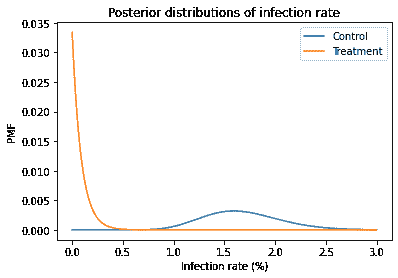
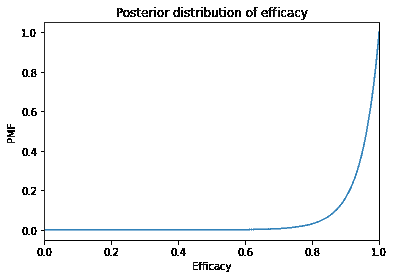

# 估计疫苗的有效性

> 原文：[`allendowney.github.io/ThinkBayes2/vaccine2.html`](https://allendowney.github.io/ThinkBayes2/vaccine2.html)

在最近的疫苗试验中，接种组没有人患病，因此疫苗制造商报告称其有效率为 100%。当然，现实世界中没有什么是 100%有效的，所以这个例子引发了一个问题：当病例数为 0 时，我们如何估计有效性？

在这篇文章中，我提出了一个贝叶斯的方法来回答这个问题——答案是大约 94%。

*如果你喜欢这篇文章，你可能也会喜欢[*Think Bayes*](https://greenteapress.com/wp/think-bayes/)的第二版。*

[点击这里在 Colab 上运行这篇文章](https://colab.research.google.com/github/AllenDowney/ThinkBayes2/blob/master/examples/vaccine2.ipynb)

## 数据

根据[这份新闻稿](https://www.pfizer.com/news/press-release/press-release-detail/pfizer-biontech-announce-positive-topline-results-pivotal)

> …在 12 至 15 岁有或没有 SARS-CoV-2 感染证据的青少年中进行的 3 期试验中，辉瑞-联德 COVID-19 疫苗 BNT162b2 表现出 100%的有效性和强大的抗体反应…

当然，疫苗在这个年龄组似乎像在成年人中一样有效，甚至可能更好，这是个好消息。但是报告说疫苗 100%有效有点奇怪。

新闻稿包括以下关于结果的细节

> 试验在美国招募了 2,260 名 12 至 15 岁的青少年。在试验中，安慰剂组（n=1,129）观察到 18 例 COVID-19 病例，而接种组（n=1,131）没有观察到病例。

由于接种组没有病例，认为疫苗有效是合理的，但在现实世界中，没有什么是 100%有效的。在更大的试验中，我们应该期望在接种组至少看到一个病例。但是我们如何估计尚未发生的事情的频率呢？

贝叶斯统计提供了一个明智的方法来做到这一点。

这是新闻稿中报道的数据。

```py
n_control = 1129
n_treatment = 1131

cases_control = 18
cases_treatment = 0 
```

为了估计疫苗的有效性，我将首先分别计算每组的风险。

## 贝塔分布

如果我们从均匀先验分布开始，后验分布是具有参数的贝塔分布

```py
alpha = cases + 1
beta = n - cases + 1 
```

我们可以使用 SciPy 制作代表后验的贝塔分布。

```py
from scipy.stats import beta

def make_beta(n, cases):
    return beta(cases+1, n-cases+1) 
```

这是对照组的后验分布。

```py
dist_control = make_beta(n_control, cases_control)
dist_control.mean() * 100 
```

```py
1.6799292661361624 
```

后验均值接近观察到的比例：

```py
cases_control / n_control * 100 
```

```py
1.5943312666076175 
```

这是治疗组的后验分布。

```py
dist_treatment = make_beta(n_treatment, cases_treatment)
dist_treatment.mean() * 100 
```

```py
0.088261253309797 
```

后验均值约为 0.1%，虽然很小，但不是 0。

为了计算风险比的分布，我将使用`empiricaldist`的`Pmf`对象做出两个后验分布的离散近似：

```py
import numpy as np
from empiricaldist import Pmf

def make_pmf(dist):
  """PMF to approximate a beta distribution.

 dist: SciPy `beta` object

 returns: Pmf
 """
    qs = np.linspace(8e-6, 0.03, 1000)
    ps = dist.pdf(qs)
    pmf = Pmf(ps, qs)
    pmf.normalize()
    return pmf 
```

这些是`Pmf`对象：

```py
pmf_control = make_pmf(dist_control).mul_dist(100)
pmf_treatment = make_pmf(dist_treatment).mul_dist(100) 
```

它们看起来是这样的：

```py
import matplotlib.pyplot as plt

pmf_control.plot(label='Control')
pmf_treatment.plot(label='Treatment')

plt.xlabel('Infection rate (%)')
plt.ylabel('PMF')
plt.title('Posterior distributions of infection rate')
plt.legend(); 
```



## 计算有效性

现在，为了计算有效性，我将使用这些分布来计算风险比`RR`的分布，然后计算有效性的分布，即风险比的补集`1-RR`。

我们可以使用`div_dist`来计算风险比。

```py
pmf_ratio = pmf_treatment.div_dist(pmf_control) 
```

这是风险比的 CDF。我将其截断为 1，因为更高的值具有非常低的概率；也就是说，我们相当确定治疗是有效的。

```py
pmf_ratio.make_cdf().plot()
plt.xlim([0, 1])

plt.xlabel('Risk ratio')
plt.ylabel('CDF')
plt.title('Posterior distribution of risk ratio'); 
```


要计算有效性的分布，我们必须计算`1-RR`的分布，其中`RR`是风险比。我们可以使用`empiricaldist`通过创建一个确定性的`Pmf`来做到这一点，其中包含数量`1`，并使用`sub_dist`来减去两个`Pmf`。

```py
efficacy = Pmf.from_seq(1).sub_dist(pmf_ratio) 
```

这是结果。

```py
efficacy.make_cdf().plot()
plt.xlim([0, 1])

plt.xlabel('Efficacy')
plt.ylabel('PMF')
plt.title('Posterior distribution of efficacy'); 
```



后验均值约为 94%。

```py
efficacy.mean() 
```

```py
0.9449759891115062 
```

95%的可信区间在 79%和 99.9%之间。

```py
efficacy.credible_interval(0.95) 
```

```py
array([0.78696377, 0.99943336]) 
```

根据这些估计，青少年的功效与成年人大致相同。

如果你喜欢这篇文章，你可能也会喜欢第二版的[*Think Bayes*](https://greenteapress.com/wp/think-bayes/)。

版权所有 2020 Allen Downey

代码：[MIT 许可证](https://opensource.org/licenses/MIT)

文本：[署名-非商业性使用-相同方式共享 4.0 国际 (CC BY-NC-SA 4.0)](https://creativecommons.org/licenses/by-nc-sa/4.0/)
