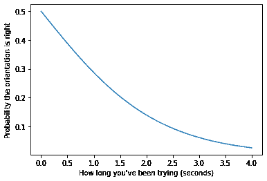
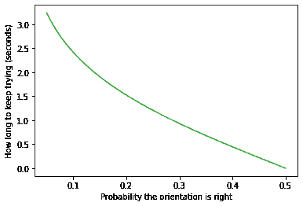
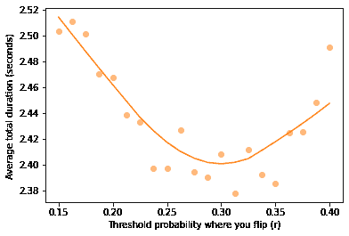
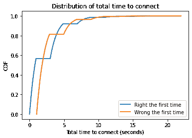
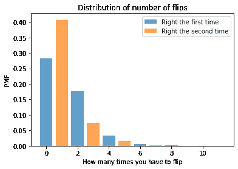

# 第二十三章：翻转 USB 连接器

> 原文：[`allendowney.github.io/ThinkBayes2/usb.html`](https://allendowney.github.io/ThinkBayes2/usb.html)
> 
> 译者：[飞龙](https://github.com/wizardforcel)
> 
> 协议：[CC BY-NC-SA 4.0](http://creativecommons.org/licenses/by-nc-sa/4.0/)


这个笔记本是第二版[*Think Bayes*](https://greenteapress.com/wp/think-bayes/)中的一个例子。

[点击这里在 Colab 上运行这个笔记本](https://colab.research.google.com/github/AllenDowney/ThinkBayes2/blob/master/examples/usb.ipynb)。

我不是第一个观察到插入 USB 连接器（特别是不可逆的矩形[Type A 连接器](https://en.wikipedia.org/wiki/USB)）有时需要尝试几次的人。有[关于它的迷因](https://knowyourmeme.com/memes/usb-insertion-issues)，有[关于它的漫画](https://www.smbc-comics.com/?id=2388)，仅在 Quora 上，[人们](https://www.quora.com/Why-do-you-always-have-to-flip-a-USB-twice-when-trying-to-plug-it-in-Shouldn-t-it-have-gone-in-the-first-time-when-you-had-it-the-right-way) [问过](https://www.quora.com/There-is-a-50-chance-of-plugging-in-a-USB-cable-the-right-way-on-the-first-try-Why-does-it-only-happen-20-of-the-time-when-I-do-it) [关于](https://www.quora.com/Why-doesnt-the-USB-go-in-the-first-time-but-does-after-youve-turn-it-a-few-times) [它](https://www.quora.com/People-that-can-plug-the-USB-in-on-their-first-try-How) [更](https://www.quora.com/Why-cant-we-plug-in-USB-devices-correctly-the-first-time) [一次](https://www.quora.com/Why-cant-we-plug-in-USB-devices-correctly-the-first-time)。

但我可能是第一个使用贝叶斯决策分析来找出插入 USB 连接器的最佳策略的人。具体来说，我已经计算出在翻转之前你应该在第一边尝试多长时间，在翻转之前你应该在第二边尝试多长时间，在第三边尝试多长时间，依此类推。

当然，我的分析是基于一些建模假设：

1.  最初，连接器方向正确的概率是 0.5。

1.  如果是的话，成功所需的时间遵循均值为 1.1 秒的指数分布。

1.  翻转连接器需要 0.1 秒。

有了这个，我们准备好开始了。

## 持续更新

第一步是根据你尝试的时间来确定连接器方向正确的概率。为此，我们可以使用贝叶斯表，这是我在[*Think Bayes*](https://allendowney.github.io/ThinkBayes2/chap02.html#bayes-tables)第二章中使用的贝叶斯定理的一种形式。

以下功能接受假设序列、先验概率和似然性，并返回一个表示贝叶斯表的 pandas `DataFrame`。

```py
import pandas as pd

def bayes_table(hypos, prior, likelihood):
  """Make a table showing a Bayesian update."""
    table = pd.DataFrame(dict(prior=prior, likelihood=likelihood), index=hypos)
    table['unnorm'] = table['prior'] * table['likelihood']
    prob_data = table['unnorm'].sum()
    table['posterior'] = table['unnorm'] / prob_data
    return table 
```

现在假设连接器方向正确的先验概率是 0.5，并且你已经尝试了 0.9 秒。你需要尝试这么长时间的概率是多少？

+   如果你在错误的一边，那就是 100%。

+   如果你在正确的一边，它由指数分布的生存函数（补充 CDF）给出，即$\exp(-\lambda t)$，其中$\lambda$是速率参数，$t$是时间。

以下函数计算这个似然性：

```py
import numpy as np

def expo_sf(t, lam):
  """Survival function of the exponential distribution."""
    return np.exp(-lam * t) 
```

我们可以使用这个函数来计算尝试 0.9 秒或更长时间的似然性，假设具有均值为 1.1 的指数分布。

```py
t = 0.9
mu = 1.1
lam = 1/mu

expo_sf(t, lam) 
```

```py
0.441233167759984 
```

结果是数据的似然性，假设连接器的方向是正确的。

现在让我们用两个假设制作一个贝叶斯表——连接器要么是正确的，要么是错误的——先验概率相等。

```py
hypos = ['Right way', 'Wrong way']
prior = [1/2, 1/2] 
```

这是每个假设的数据的似然性：

```py
likelihood = [expo_sf(t, lam), 1] 
```

把它放在一起，这是贝叶斯表。

```py
bayes_table(hypos, prior, likelihood) 
```

|  | 先验 | 似然性 | 非标准化 | 后验 |
| --- | --- | --- | --- | --- |
| 正确方向 | 0.5 | 0.441233 | 0.220617 | 0.30615 |
| 错误方向 | 0.5 | 1.000000 | 0.500000 | 0.69385 |

0.9 秒后，连接器方向错误的概率约为 69%，所以你可能想考虑尝试另一边。

但如果翻转需要 0.1 秒，也许你应该再试一会儿。为了弄清何时翻转，让我们再次对$\lambda$和$t$的一般值进行相同的分析。

## 泛化

为了最小化人为错误，我将使用 Sympy 进行代数运算。以下是我将使用的符号。

```py
from sympy import symbols, exp

t, lam, p, q, r = symbols('t lam p q r') 
```

这是再次使用符号的似然。

```py
likelihood = [exp(-lam * t), 1]
likelihood 
```

```py
[exp(-lam*t), 1] 
```

这是贝叶斯表，使用$p$和$q$作为假设的先验概率。

```py
prior = [p, q]
table = bayes_table(hypos, prior, likelihood)
table 
```

|  | 先验 | 似然 | 未归一化 | 后验 |
| --- | --- | --- | --- | --- |
| 正确方式 | p | exp(-lam*t) | p*exp(-lam*t) | p*exp(-lam*t)/(p*exp(-lam*t) + q) |
| 错误方式 | q | 1 | q | q/(p*exp(-lam*t) + q) |

从表中，我将选择正确方向的后验概率。

```py
expr = table.loc['Right way', 'posterior']
expr.simplify() 
```

$$\displaystyle \frac{p}{p + q e^{lam t}}$$

你可能会认出这是[逻辑函数](https://en.wikipedia.org/wiki/Logistic_function)的一种形式；我们可以这样计算：

```py
def logistic(p, lam, t):
    q = 1-p
    return p / (p + q * np.exp(lam * t)) 
```

让我们看看对于一系列`t`的值，假设先验概率为`p=0.5`，它是什么样子的。

```py
import matplotlib.pyplot as plt

ts = np.linspace(0, 4)
ps = logistic(p=0.5, lam=1/mu, t=ts)

plt.plot(ts, ps)
plt.xlabel("How long you've been trying (seconds)")
plt.ylabel("Probability the orientation is right"); 
```



几秒钟的摆弄后，你应该相当确信方向是错误的。

## 策略

现在，让我们考虑将信念转化为行动。让我从一个猜想开始：我怀疑最好的策略是在第一面尝试，直到正确方向的概率降到某个阈值以下（待确定），然后再尝试第二面，直到概率再次降到该阈值以下，并重复直到成功。

为了测试这个策略，我们将不得不根据先验概率`p`和阈值概率`r`的函数来确定尝试多长时间。同样，我将让 Sympy 来完成这项工作。

这是设置我们在上一节中计算的后验概率为`r`的方程。

```py
from sympy import Eq, solve

eqn = Eq(expr, r)
eqn 
```

$$\displaystyle \frac{p e^{- lam t}}{p e^{- lam t} + q} = r$$

这是关于`t`的解，用`p`、`q`、`r`和`lam`表示。

```py
solve(eqn, t)[0] 
```

$$\displaystyle \frac{\log{\left(\frac{p \left(1 - r\right)}{q r} \right)}}{lam}$$

这是我们如何用先验和后验几率来表达这个解决方案的方式。

```py
def wait_time(p, lam, r):
    q = 1-p
    prior_odds = p / q
    posterior_odds = r / (1-r)
    return np.log(prior_odds / posterior_odds) / lam 
```

让我们看看对于一系列`r`的值，假设先验概率为`p=0.5`，它是什么样子的。

```py
rs = np.linspace(0.05, 0.5)
ts = wait_time(p=0.5, lam=1/mu, r=rs)

plt.plot(rs, ts, color='C2')
plt.xlabel("Probability the orientation is right")
plt.ylabel("How long to keep trying (seconds)"); 
```



当阈值较低时，我们必须等待几秒钟才能达到它。随着阈值的增加，达到它的时间减少。我们将在下一节中使用这个函数来模拟这个策略。

## 模拟

作为优化的一步，让我们进行一次模拟。以下函数的参数为：

+   `correct`：一个布尔值，指示方向是否正确。

+   `p`：方向正确的先验概率。

+   `lam`：成功之前的时间分布的速率参数。

+   `r`：后验概率的阈值。

+   `flip`：连接器翻转所需的时间，以秒为单位。

+   `trace`：一个列表，指示我们到目前为止尝试和翻转的时间。

它运行模拟并返回等待和翻转时间的序列。这个序列的总和是连接所需的总时间。我们可以使用序列的长度来计算我们需要翻转的次数。

```py
def simulate(correct, p, lam, r, flip, trace):
    # figure out the maximum time we should try before flipping
    wait = wait_time(p, lam, r)

    # if we're on the correct side, see if we succeed before time's up
    if correct:
        t = np.random.exponential(1/lam)
        if t < wait:
            # if so, update and return the trace
            return trace + [t]

    # if time expired, add the wait time and flip time to the trace 
    # and make a recursive call to continue the simulation
    return simulate(not correct, 1-r, lam, r, flip, trace + [wait, flip]) 
```

这是一个测试运行，从正确的一面开始。

```py
simulate(correct=True, p=0.5, lam=1/mu, r=0.2, flip=0.1, trace=[]) 
```

```py
[0.24846062544031747] 
```

这是一个运行，我们从错误的一面开始。

```py
simulate(correct=False, p=0.5, lam=1/mu, r=0.2, flip=0.1, trace=[]) 
```

```py
[1.5249237972318797, 0.1, 0.8563018209476607] 
```

以下函数多次以初始概率`p=0.5`运行模拟，一半时间从正确的方向开始。

它返回两个数组，包含轨迹的长度和每次模拟的总持续时间。

```py
def run_simulations(lam, r, flip, iters=20000, flag=None):
    res = []
    for i in range(iters):
        correct = i%2 if flag is None else flag
        trace = simulate(correct, 0.5, lam, r, flip, [])
        res.append((len(trace), sum(trace)))

    return np.transpose(res) 
```

这是具有阈值概率`r=0.25`的平均总持续时间。

```py
lengths, totals = run_simulations(lam=1/mu, r=0.25, flip=0.1)
totals.mean() 
```

```py
2.4265255008111306 
```

使用这个阈值，平均需要大约 2 秒才能连接。

## 优化

现在让我们看看随着阈值概率`r`的一系列值的变化，平均持续时间是如何变化的：

```py
rs = np.linspace(0.15, 0.4, 21)
rs 
```

```py
array([0.15  , 0.1625, 0.175 , 0.1875, 0.2   , 0.2125, 0.225 , 0.2375,
       0.25  , 0.2625, 0.275 , 0.2875, 0.3   , 0.3125, 0.325 , 0.3375,
       0.35  , 0.3625, 0.375 , 0.3875, 0.4   ]) 
```

```py
np.random.seed(17)

res = []
for r in rs:
    lengths, totals = run_simulations(lam=1/mu, r=r, flip=0.1)
    res.append((r, totals.mean())) 
```


```py
from statsmodels.nonparametric.smoothers_lowess import lowess

def make_lowess(series):
  """Use LOWESS to compute a smooth line.

 series: pd.Series

 returns: pd.Series
 """
    endog = series.values
    exog = series.index.values

    smooth = lowess(endog, exog)
    index, data = np.transpose(smooth)

    return pd.Series(data, index=index) 
``` 

```py
def plot_series_lowess(series, color):
  """Plots a series of data points and a smooth line.

 series: pd.Series
 color: string or tuple
 """
    series.plot(lw=0, marker='o', color=color, alpha=0.5)
    smooth = make_lowess(series)
    smooth.plot(label='_', color=color) 
```

这就是结果的样子。

```py
rs, ts = np.transpose(res)
series = pd.Series(ts, rs)

plot_series_lowess(series, 'C1')

plt.xlabel("Threshold probability where you flip (r)")
plt.ylabel("Average total duration (seconds)"); 
```



`r`的最佳值接近`0.3`。 有了这个阈值，我们可以看到我们应该在第一面尝试多长时间，从先验概率`p=0.5`开始。

```py
r_opt = 0.3
wait_time(p=0.5, lam=1/mu, r=r_opt) 
```

```py
0.9320276464259238 
```

根据给定的`lam`和`flip`的值，最佳等待时间约为 0.9 秒。

如果我们必须翻转，第二面的先验概率为`p=1-r`，所以我们必须等待后验概率下降到`r`的时间是先验概率的两倍。

```py
wait_time(p=1-r_opt, lam=1/mu, r=r_opt) 
```

```py
1.864055292851848 
```

## 多少次翻转？

现在让我们使用`r`的最佳值运行模拟，看看总时间和翻转次数的分布是什么样子。

```py
lengths1, totals1 = run_simulations(lam=1/mu, r=r_opt, flip=0.1, flag=True)
lengths2, totals2 = run_simulations(lam=1/mu, r=r_opt, flip=0.1, flag=False) 
```

这是总时间的分布，表示为 CDF。


```py
try:
    import empiricaldist
except ImportError:
    !pip  install  empiricaldist 
```

```py
from empiricaldist import Cdf

Cdf.from_seq(totals1).plot(lw=2, label='Right the first time')
Cdf.from_seq(totals2).plot(lw=2, label='Wrong the first time')

plt.xlabel('Total time to connect (seconds)')
plt.ylabel('CDF')
plt.title('Distribution of total time to connect')
plt.legend(); 
```



```py
totals1.mean(), totals2.mean() 
```

```py
(2.2006236558767154, 2.616228241925388) 
```

```py
np.percentile(totals1, 90), np.percentile(totals2, 90) 
```

```py
(4.601034595944718, 5.636579992175272) 
```

```py
np.append(totals1, totals2).mean() 
```

```py
2.4084259489010518 
```

平均时间约为 2.4 秒，但有时需要更长的时间！

这是总翻转次数的分布。

```py
from empiricaldist import Pmf

flips1 = (lengths1-1) // 2
pmf1 = Pmf.from_seq(flips1) / 2
pmf1.bar(alpha=0.7, label='Right the first time')

flips2 = (lengths2-1) // 2
pmf2 = Pmf.from_seq(flips2) / 2
pmf2.bar(alpha=0.7, label='Right the second time')

plt.xlabel('How many times you have to flip')
plt.ylabel('PMF')
plt.title('Distribution of number of flips')
plt.legend(); 
```



```py
lengths = np.append(lengths1, lengths2)
flips = (lengths-1) // 2
Pmf.from_seq(flips).head(5) 
```

|  | 概率 |
| --- | --- |
| 0.0 | 0.282925 |
| 1.0 | 0.407050 |
| 2.0 | 0.177200 |
| 3.0 | 0.075200 |
| 4.0 | 0.032575 |

第一次就猜对的概率只有 28%左右。 这可能看起来很低，因为正确方向的概率是 50%，但请记住，即使我们从正确的方向开始，我们也有相当大的翻转的机会（在这种情况下，我们至少要翻转两次）。

最常见的结果是我们必须翻转一次，大约 40%的时间。 臭名昭著的双重翻转的概率约为 18%。

幸运的是，翻转三次或更多次的情况很少见。

## 摘要

有了这个，我认为我们已经解决了 USB 连接器的问题。

1.  对于给定的参数`lam`和`flip`，我们可以找到最小化连接平均时间的阈值概率`r`。

1.  在给定这个最佳值的情况下，我们可以估计总时间的分布以及我们必须翻转的次数。

遗憾的是，所有这些乐趣逐渐被[USB-C](https://en.wikipedia.org/wiki/USB-C)连接器的侵蚀所破坏，它是可逆的。

*如果你喜欢这篇文章，你可能也会喜欢第二版的[*Think Bayes*](https://greenteapress.com/wp/think-bayes/)*。

版权所有 2021 Allen Downey

代码：[MIT 许可证](https://opensource.org/licenses/MIT)

文本：[署名-非商业性使用-相同方式共享 4.0 国际 (CC BY-NC-SA 4.0)](https://creativecommons.org/licenses/by-nc-sa/4.0/)
