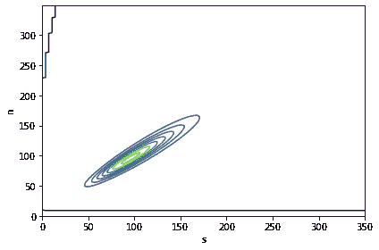
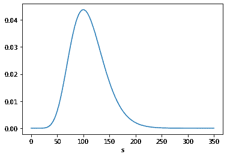
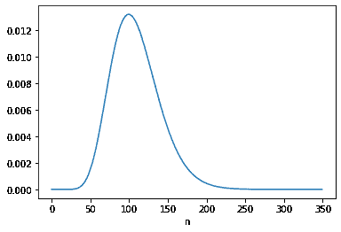
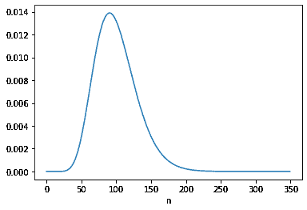
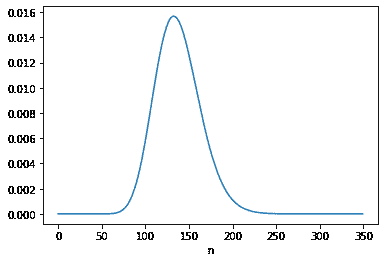
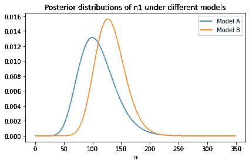

# 第二十六章：发射器-探测器问题

> 原文：[`allendowney.github.io/ThinkBayes2/radiation.html`](https://allendowney.github.io/ThinkBayes2/radiation.html)
> 
> 译者：[飞龙](https://github.com/wizardforcel)
> 
> 协议：[CC BY-NC-SA 4.0](http://creativecommons.org/licenses/by-nc-sa/4.0/)


[单击此处在 Colab 上运行此笔记本](https://colab.research.google.com/github/AllenDowney/ThinkBayes2/blob/master/examples/radiation.ipynb)

## 建模辐射传感器

这是 Jaynes 在《概率论》第 168 页的一个例子：

> 我们有一个放射源...发射某种粒子...有一个速率$p$，即每秒发射的粒子数，放射性核通过我们的计数器发送粒子；每个通过的粒子以速率$\theta$产生计数。通过测量不同秒数内的计数{c1，c2，...}，我们能对每秒通过计数器的粒子数{n1，n2，...}和源的强度有什么样的结论？

我在第一版的《Bayes 定理》中提出了一个[版本的这个问题](https://www.greenteapress.com/thinkbayes/html/thinkbayes015.html#sec130)，但我认为我解释得不好，我的解决方案有点混乱。在第二版中，我使用了更多的 NumPy 和 SciPy，这使得可以更清晰、更简洁地表达解决方案，所以让我再试一次。

作为放射源的模型，Jaynes 建议我们想象“$N$个核，每个核在任何一个秒内独立地具有概率$r$通过我们的计数器发送一个粒子”。如果$N$很大，$r$很小，那么在给定的一秒内发射的粒子数很好地由参数$s = N r$的泊松分布模拟，其中$s$是源的强度。

作为传感器的模型，我们假设“通过计数器的每个粒子独立地具有概率$\phi$进行计数”。因此，如果我们知道粒子的实际数量$n$和传感器的效率$\phi$，则计数的分布是$\mathrm{Binomial}(n, \phi)$。

有了这个，我们就准备好解决问题了，但首先，我不确定为什么 Jaynes 用$p$和$\theta$来陈述问题，然后用$s$和$\phi$来解决问题。这可能是一个疏忽，或者他可能想要引起读者注意的微妙区别。这本书充满了对这样的区别的严重警告，但在这种情况下，我看不到解释。

无论如何，遵循 Jaynes，我将从一个均匀的先验开始，覆盖足够广泛的值范围，以覆盖数据可能非常重要的区域。

```py
import numpy as np
from empiricaldist import Pmf

ss = np.linspace(0, 350, 101)
prior_s = Pmf(1, ss)
prior_s.head() 
```

|  | probs |
| --- | --- |
| 0.0 | 1 |
| 3.5 | 1 |
| 7.0 | 1 |

对于每个$s$的值，$n$的分布是泊松分布，因此我们可以使用 SciPy 的`poisson`函数形成$s$和$n$的联合先验。我将使用一系列值来表示$n$，再次覆盖数据可能非常重要的区域。

```py
from scipy.stats import poisson

ns = np.arange(0, 350)
S, N = np.meshgrid(ss, ns)
ps = poisson(S).pmf(N)
ps.shape 
```

```py
(350, 101) 
```

结果是一个数组，每个$n$的值对应一行，每个$s$的值对应一列。为了得到每对的先验概率，我们将每行乘以$s$的先验概率。以下函数封装了这个计算，并将结果放入一个代表联合先验的 Pandas`DataFrame`中。

```py
import pandas as pd

def make_joint(prior_s, ns):
    ss = prior_s.qs
    S, N = np.meshgrid(ss, ns)
    ps = poisson(S).pmf(N) * prior_s.ps
    joint = pd.DataFrame(ps, index=ns, columns=ss)
    joint.index.name = 'n'
    joint.columns.name = 's'
    return joint 
```

这是联合先验：

```py
joint = make_joint(prior_s, ns)
joint.head() 
```

| s | 0.0 | 3.5 | 7.0 | 10.5 | 14.0 | 17.5 | 21.0 | 24.5 | 28.0 | 31.5 | ... | 318.5 | 322.0 | 325.5 | 329.0 | 332.5 | 336.0 | 339.5 | 343.0 | 346.5 | 350.0 |
| --- | --- | --- | --- | --- | --- | --- | --- | --- | --- | --- | --- | --- | --- | --- | --- | --- | --- | --- | --- | --- | --- |
| n |  |  |  |  |  |  |  |  |  |  |  |  |  |  |  |  |  |  |  |  |  |
| --- | --- | --- | --- | --- | --- | --- | --- | --- | --- | --- | --- | --- | --- | --- | --- | --- | --- | --- | --- | --- | --- |
| 0 | 1.0 | 0.030197 | 0.000912 | 0.000028 | 8.315287e-07 | 2.510999e-08 | 7.582560e-10 | 2.289735e-11 | 6.914400e-13 | 2.087968e-14 | ... | 4.755624e-139 | 1.436074e-140 | 4.336568e-142 | 1.309530e-143 | 3.954438e-145 | 1.194137e-146 | 3.605981e-148 | 1.088912e-149 | 3.288229e-151 | 9.929590e-153 |
| 1 | 0.0 | 0.105691 | 0.006383 | 0.000289 | 1.164140e-05 | 4.394249e-07 | 1.592338e-08 | 5.609850e-10 | 1.936032e-11 | 6.577099e-13 | ... | 1.514666e-136 | 4.624158e-138 | 1.411553e-139 | 4.308354e-141 | 1.314851e-142 | 4.012300e-144 | 1.224230e-145 | 3.734968e-147 | 1.139371e-148 | 3.475357e-150 |
| 2 | 0.0 | 0.184959 | 0.022341 | 0.001518 | 8.148981e-05 | 3.844967e-06 | 1.671955e-07 | 6.872067e-09 | 2.710445e-10 | 1.035893e-11 | ... | 2.412106e-134 | 7.444895e-136 | 2.297302e-137 | 7.087242e-139 | 2.185939e-140 | 6.740663e-142 | 2.078131e-143 | 6.405469e-145 | 1.973961e-146 | 6.081874e-148 |
| 3 | 0.0 | 0.215785 | 0.052129 | 0.005313 | 3.802858e-04 | 2.242898e-05 | 1.170368e-06 | 5.612188e-08 | 2.529749e-09 | 1.087688e-10 | ... | 2.560853e-132 | 7.990854e-134 | 2.492573e-135 | 7.772342e-137 | 2.422749e-138 | 7.549543e-140 | 2.351752e-141 | 7.323587e-143 | 2.279925e-144 | 7.095520e-146 |
| 4 | 0.0 | 0.188812 | 0.091226 | 0.013946 | 1.331000e-03 | 9.812677e-05 | 6.144433e-06 | 3.437465e-07 | 1.770824e-08 | 8.565541e-10 | ... | 2.039079e-130 | 6.432637e-132 | 2.028331e-133 | 6.392751e-135 | 2.013910e-136 | 6.341616e-138 | 1.996049e-139 | 6.279975e-141 | 1.974985e-142 | 6.208580e-144 |

5 行×101 列

现在我们准备计算数据的可能性。在这个问题中，它只取决于$n$，而与$s$无关，因此我们只需要为每个$n$的值计算一次。

```py
from scipy.stats import binom

phi = 0.1
c = 10
likelihood = binom(ns, phi).pmf(c)
likelihood.shape 
```

```py
(350,) 
```

结果是一个可能性数组，每个$n$的值对应一个。要进行贝叶斯更新，我们需要将先验中的每一列与这个可能性数组相乘。我们可以使用`multiply`方法和`axis`参数来实现这一点。

```py
product = joint.multiply(likelihood, axis=0)
product.head() 
```

| s | 0.0 | 3.5 | 7.0 | 10.5 | 14.0 | 17.5 | 21.0 | 24.5 | 28.0 | 31.5 | ... | 318.5 | 322.0 | 325.5 | 329.0 | 332.5 | 336.0 | 339.5 | 343.0 | 346.5 | 350.0 |
| --- | --- | --- | --- | --- | --- | --- | --- | --- | --- | --- | --- | --- | --- | --- | --- | --- | --- | --- | --- | --- | --- |
| n |  |  |  |  |  |  |  |  |  |  |  |  |  |  |  |  |  |  |  |  |  |
| --- | --- | --- | --- | --- | --- | --- | --- | --- | --- | --- | --- | --- | --- | --- | --- | --- | --- | --- | --- | --- | --- |
| 0 | 0.0 | 0.0 | 0.0 | 0.0 | 0.0 | 0.0 | 0.0 | 0.0 | 0.0 | 0.0 | ... | 0.0 | 0.0 | 0.0 | 0.0 | 0.0 | 0.0 | 0.0 | 0.0 | 0.0 | 0.0 |
| 1 | 0.0 | 0.0 | 0.0 | 0.0 | 0.0 | 0.0 | 0.0 | 0.0 | 0.0 | 0.0 | ... | 0.0 | 0.0 | 0.0 | 0.0 | 0.0 | 0.0 | 0.0 | 0.0 | 0.0 | 0.0 |
| 2 | 0.0 | 0.0 | 0.0 | 0.0 | 0.0 | 0.0 | 0.0 | 0.0 | 0.0 | 0.0 | ... | 0.0 | 0.0 | 0.0 | 0.0 | 0.0 | 0.0 | 0.0 | 0.0 | 0.0 | 0.0 |
| 3 | 0.0 | 0.0 | 0.0 | 0.0 | 0.0 | 0.0 | 0.0 | 0.0 | 0.0 | 0.0 | ... | 0.0 | 0.0 | 0.0 | 0.0 | 0.0 | 0.0 | 0.0 | 0.0 | 0.0 | 0.0 |
| 4 | 0.0 | 0.0 | 0.0 | 0.0 | 0.0 | 0.0 | 0.0 | 0.0 | 0.0 | 0.0 | ... | 0.0 | 0.0 | 0.0 | 0.0 | 0.0 | 0.0 | 0.0 | 0.0 | 0.0 | 0.0 |

5 行×101 列

以下函数封装了这个计算，对结果进行了归一化，并返回了后验分布。

```py
from utils import normalize

def update(joint, phi, c):
    ns = joint.index
    likelihood = binom(ns, phi).pmf(c)
    posterior = joint.multiply(likelihood, axis=0)
    normalize(posterior)
    return posterior 
```

## 第一次更新

让我们用第一个例子测试更新函数，在*概率论*第 178 页：

> 在第一秒内，`c1 = 10`个计数被记录。我们能对粒子的数量`n1`说些什么吗？

这是更新：

```py
c1 = 10
phi = 0.1
posterior = update(joint, phi, c1)
posterior.head() 
```

| s | 0.0 | 3.5 | 7.0 | 10.5 | 14.0 | 17.5 | 21.0 | 24.5 | 28.0 | 31.5 | ... | 318.5 | 322.0 | 325.5 | 329.0 | 332.5 | 336.0 | 339.5 | 343.0 | 346.5 | 350.0 |
| --- | --- | --- | --- | --- | --- | --- | --- | --- | --- | --- | --- | --- | --- | --- | --- | --- | --- | --- | --- | --- | --- |
| n |  |  |  |  |  |  |  |  |  |  |  |  |  |  |  |  |  |  |  |  |  |
| --- | --- |
| 0 | 0.0 | 0.0 | 0.0 | 0.0 | 0.0 | 0.0 | 0.0 | 0.0 | 0.0 | 0.0 | 0.0 | ... | 0.0 | 0.0 | 0.0 | 0.0 | 0.0 | 0.0 | 0.0 | 0.0 | 0.0 | 0.0 |
| 1 | 0.0 | 0.0 | 0.0 | 0.0 | 0.0 | 0.0 | 0.0 | 0.0 | 0.0 | 0.0 | ... | 0.0 | 0.0 | 0.0 | 0.0 | 0.0 | 0.0 | 0.0 | 0.0 | 0.0 | 0.0 |
| 2 | 0.0 | 0.0 | 0.0 | 0.0 | 0.0 | 0.0 | 0.0 | 0.0 | 0.0 | 0.0 | ... | 0.0 | 0.0 | 0.0 | 0.0 | 0.0 | 0.0 | 0.0 | 0.0 | 0.0 | 0.0 |
| 3 | 0.0 | 0.0 | 0.0 | 0.0 | 0.0 | 0.0 | 0.0 | 0.0 | 0.0 | 0.0 | ... | 0.0 | 0.0 | 0.0 | 0.0 | 0.0 | 0.0 | 0.0 | 0.0 | 0.0 | 0.0 |
| 4 | 0.0 | 0.0 | 0.0 | 0.0 | 0.0 | 0.0 | 0.0 | 0.0 | 0.0 | 0.0 | ... | 0.0 | 0.0 | 0.0 | 0.0 | 0.0 | 0.0 | 0.0 | 0.0 | 0.0 | 0.0 |

5 行×101 列

下图是联合后验分布的等高线图。正如你所预料的，$s$和$n$高度相关；也就是说，如果我们相信$s$很低，我们应该相信$n$也很低，反之亦然，如果$s$很高。

```py
from utils import plot_contour

plot_contour(posterior); 
```



从后验分布中，我们可以提取$s$和$n$的边际分布。

```py
from utils import marginal

posterior_s = marginal(posterior, 0)
posterior_s.plot()
posterior_s.mean() 
```

```py
109.99983355767465 
```



```py
posterior_n = marginal(posterior, 1)
posterior_n.plot()
posterior_n.mean() 
```

```py
108.99984691276569 
```



$n$的后验均值接近 109，与方程 6.116 的结果一致。

```py
posterior_n.idxmax(), c/phi 
```

```py
(99, 100.0) 
```

MAP 为 99，比方程 6.113 的解析结果少 1，即 100。看起来 99 和 100 的后验概率是相同的，但浮点结果略有不同。

```py
posterior_n[99] - posterior_n[100] 
```

```py
5.065392549852277e-16 
```

## Jeffreys 先验

对于$s$的先验分布，我们可以使用 Jeffreys 先验，其中每个$s$值的先验概率与$1/s$成比例。这有“在某些参数变化下的不变性”的优点，这是“表达对比例参数的完全无知的唯一正确方式。”然而，杰恩斯建议，不清楚“在这个问题中$s$是否可以适当地被视为比例参数。”

尽管如此，他建议我们尝试一下，看看会发生什么。这是$s$的 Jeffreys 先验。

```py
prior_jeff = Pmf(1/ss[1:], ss[1:])
prior_jeff.head() 
```

|  | probs |
| --- | --- |
| 3.5 | 0.285714 |
| 7.0 | 0.142857 |
| 10.5 | 0.095238 |

我们可以用它来计算$s$和$n$的联合先验，并用`c1`更新它。

```py
joint_jeff = make_joint(prior_jeff, ns)
posterior_jeff = update(joint_jeff, phi, c1) 
```

这是$n$的边际后验分布：

```py
posterior_n = marginal(posterior_jeff, 1)
posterior_n.plot()
posterior_n.mean() 
```

```py
99.99995605790188 
```



```py
posterior_n.idxmax() 
```

```py
91 
```

后验均值接近 100，MAP 为 91；两者都与方程 6.122 的结果一致。

## 机器人 A

现在我们来到我认为这个例子最有趣的部分，即考虑在两种情景模型下的第二次观察：

> 两个机器人[A 和 B]对粒子源的先验信息不同。源隐藏在另一个房间，A 和 B 不被允许进入。A 对粒子源一无所知；就其所知，...另一个房间可能充满了来回奔跑的小[人]，他们先拿一个放射性源，然后又拿另一个，一直到出口窗口。
> 
> B 有一个额外的定性事实：[它]知道源是一个长寿命的放射性样本，在一个固定的位置。

换句话说，B 有理由相信源强度$s$从一个时间间隔到下一个是恒定的，而 A 承认$s$在每个时间间隔可能是不同的。

下图来自杰恩斯，图形地表示了这些模型（杰恩斯称它们为“逻辑情况”，因为他似乎对“模型”这个词过敏）。


对于 A 来说，“不同的间隔在逻辑上是独立的”，因此`c2 = 16`的更新从相同的先验开始。

```py
c2 = 16
posterior2 = update(joint, phi, c2) 
```

这是`n2`的后验边际分布。

```py
posterior_n2 = marginal(posterior2, 1)
posterior_n2.plot()
posterior_n2.mean() 
```

```py
168.947980523708 
```


```py
posterior_n2.idxmax() 
```

```py
160 
```

后验均值接近 169，这与方程 6.124 的结果一致。 MAP 是 160，这与 6.123 一致。

## 机器人 B

对于 B 来说，“逻辑情况”是不同的。如果我们认为$s$是恒定的，我们可以 - 而且应该！ - 在进行第二次更新时考虑第一次更新的信息。我们可以通过使用第一次更新的$s$的后验分布来形成第二次更新的联合先验，就像这样：

```py
joint = make_joint(posterior_s, ns)
posterior = update(joint, phi, c2)
posterior_n = marginal(posterior, 1)
posterior_n.plot()
posterior_n.mean() 
```

```py
137.499999315101 
```



$n$的后验均值接近 137.5，这与方程 6.134 一致。 MAP 是 132，比解析结果 133 少 1。但同样，除了浮点错误外，有两个相同概率的值。

```py
posterior_n.idxmax() 
```

```py
132 
```

```py
posterior_n[132] - posterior_n[133] 
```

```py
2.914335439641036e-16 
```

在 B 的模型下，第一个间隔的数据更新了我们对$s$的信念，这影响了我们对`n2`的信念。

## 另一种方式

这可能看起来并不令人惊讶，但杰恩斯在这个例子中还有一个额外的观点，那就是它也可以反过来运作：看到`c2`后，我们对$s$有更多的信息，这意味着我们可以 - 而且应该！ - 回过头重新考虑我们对`n1`的结论。

我们可以通过想象以相反的顺序进行实验来做到这一点，所以

1.  我们将再次从基于$s$的均匀分布的联合先验开始，

1.  基于`c2`进行更新，

1.  使用$s$的后验分布形成一个新的联合先验，

1.  基于`c1`进行更新，和

1.  提取`n1`的边际后验。

```py
joint = make_joint(prior_s, ns)
posterior = update(joint, phi, c2)
posterior_s = marginal(posterior, 0)
posterior_s.mean() 
```

```py
169.94393251129674 
```

```py
joint = make_joint(posterior_s, ns)
posterior = update(joint, phi, c1)
posterior_n2 = marginal(posterior, 1)
posterior_n2.mean() 
```

```py
131.49999935386944 
```

后验均值接近 131.5，这与方程 6.133 一致。 MAP 是 126，这比方程 6.132 的结果少 1，同样是由于浮点错误。

```py
posterior_n2.idxmax() 
```

```py
126 
```

```py
posterior_n2[126] - posterior_n2[127] 
```

```py
3.8163916471489756e-16 
```

这是`n1`的新分布与仅基于`c1`的原始分布的比较。

```py
joint = make_joint(prior_s, ns)
posterior = update(joint, phi, c1)
posterior_n = marginal(posterior, 1) 
```

```py
from utils import decorate

posterior_n.plot(label='Model A')
posterior_n2.plot(label='Model B')
decorate(title='Posterior distributions of n1 under different models') 
```



有了`c2`的额外信息：

+   我们更有可能给$s$的大值，因此我们也更有可能给`n1`的大值，

+   分布的宽度更窄，这表明有关$s$的更多信息意味着我们对`n1`有更多信息。

这是杰恩斯用来区分“逻辑和因果依赖”的几个例子之一。在这个例子中，因果依赖只朝前方向进行：“$s$是部分决定$n$的物理原因；然后$n$反过来是部分决定$c$的物理原因”。

因此，`c1`和`c2`在因果上是独立的：如果一个间隔内计数的粒子数异常高（或低），那并不会导致任何其他间隔内的粒子数更高或更低。

但是如果$s$是未知的，它们在*逻辑上*并不是独立的。例如，如果`c1`低于预期，这意味着更低的$s$更有可能，这意味着更低的`n2`更有可能，这意味着更低的`c2`更有可能。

而且，正如我们所看到的，它也可以反过来。例如，如果`c2`高于预期，这意味着更高的$s$，`n1`和`c1`更有可能。

如果您发现第二个结果更令人惊讶 - 也就是说，如果您认为`c2`改变了我们对`n1`的信念是奇怪的 - 那就意味着您（还）没有区分逻辑和因果依赖。
