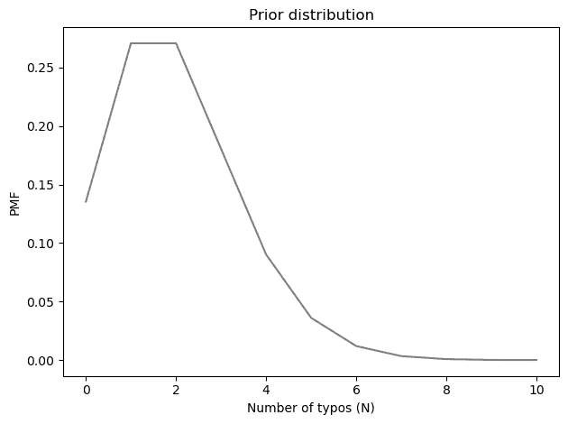
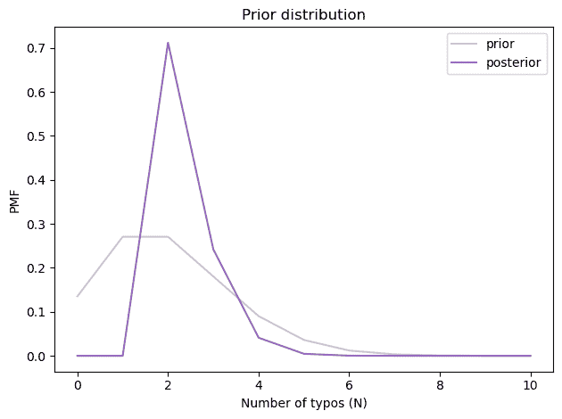
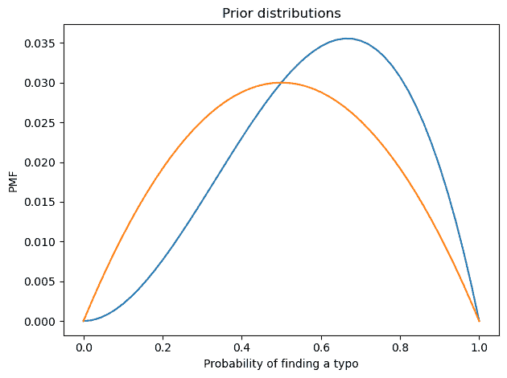
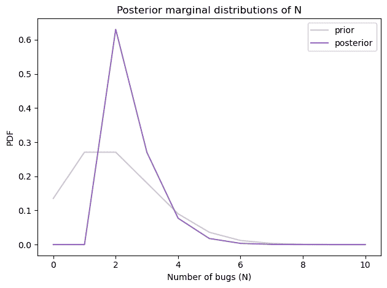
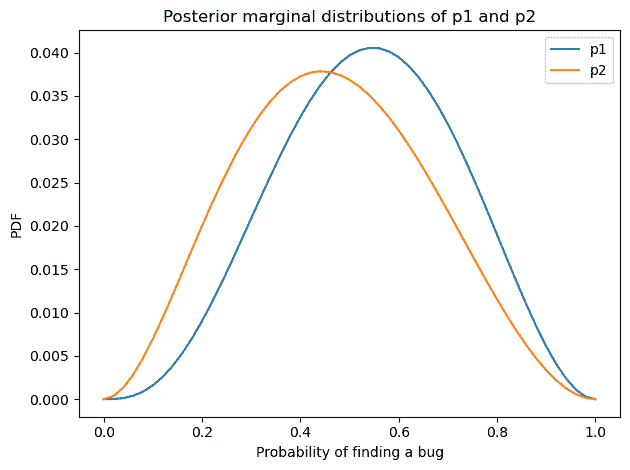

# 第二十九章：有多少错别字？

> 原文：[`allendowney.github.io/ThinkBayes2/ok.html`](https://allendowney.github.io/ThinkBayes2/ok.html)
> 
> 译者：[飞龙](https://github.com/wizardforcel)
> 
> 协议：[CC BY-NC-SA 4.0](http://creativecommons.org/licenses/by-nc-sa/4.0/)


当我几周前开始在[Brilliant](https://brilliant.org)工作时，我得知我的新同事之一，米歇尔·麦克斯威尼，刚刚出版了一本名为*OK*的书，这本书全都是关于“好”的。

当我们讨论出版的乐趣和苦难时，米歇尔提到她在出版后发现了书中的错别字。所以我自然而然地把它看作是一个找错别字的挑战。当我在寻找时，我非常喜欢这本书。如果你对词源学、语言学和历史感兴趣，我推荐这本书！

事实证明，我确实找到了一个错别字。当我告诉米歇尔时，她紧张地问我在哪一页。第 17 页。她看起来很失望 - 那不是她找到的同一个错别字。

现在，对于喜欢贝叶斯统计的人来说，这种情况引发了一些问题：

1.  在我们的对话之后，我们应该期望还有多少额外的错别字？

1.  如果她和我找到了相同的错别字，而不是不同的，我们会期望有多少错别字？

事实上，我在*Think Bayes*中使用了类似的情景[作为一个例子](https://allendowney.github.io/ThinkBayes2/chap15.html#the-lincoln-index-problem)。这本笔记本是基于我在那里提出的代码。如果有什么不清楚的地方，你可以阅读章节了解更多细节。

[您也可以点击此处在 Colab 上运行此笔记本](https://colab.research.google.com/github/AllenDowney/ThinkBayes2/blob/master/examples/ok.ipynb)。

## 一个热身问题

从问题的简单版本开始，假设我们知道`p0`和`p1`，分别是第一个和第二个读者找到任何给定错别字的概率。

例如，假设米歇尔有 66%的几率发现错别字，而我有 50%的几率。

```py
p0, p1 = 0.66, 0.5 
```

在这些假设下，我们可以计算一个数组，其中包含（按顺序）我们都找不到错别字的概率，只有第二个读者找到错别字的概率，只有第一个读者找到错别字的概率，以及我们都找到错别字的概率。

```py
def compute_probs(p0, p1):
  """Computes the probability for each of 4 categories."""
    q0 = 1-p0
    q1 = 1-p1
    return [q0*q1, q0*p1, p0*q1, p0*p1] 
```

```py
y = compute_probs(p0, p1)
y 
```

```py
[0.16999999999999998, 0.16999999999999998, 0.33, 0.33] 
```

根据假设的概率，我们有 33%的几率都找到错别字，有 17%的几率我们都没有找到。

## 先验

接下来，我们需要为错别字的总数选择一个先验。我将使用泊松分布，这是计数值的合理默认值。我将均值设为 2，这意味着在我们任何人读这本书之前，我们预计会有大约两个错别字。

```py
from utils import make_poisson_pmf

qs = np.arange(0, 11) 
lam = 2
prior_N = make_poisson_pmf(lam, qs)
prior_N.index.name = 'N'
prior_N.mean() 
```

```py
1.9999236196641172 
```

这是先验的样子。

显示代码单元格源代码 隐藏代码单元格源代码

```py
prior_N.plot(color='C7')

decorate(xlabel='Number of typos (N)',
         ylabel='PMF',
         title='Prior distribution') 
``` 

## 更新（简单版本）

为了表示数据，我将创建这些变量：

+   `k10`：第一个读者发现但第二个读者没有发现的错别字的数量

+   `k01`：第二个读者发现但第一个读者没有发现的错别字的数量

+   `k11`：两个读者都发现的错别字的数量

```py
k10 = 1
k01 = 1
k11 = 0 
```

我将数据放入一个数组中，其中 0 作为未知值`k00`的占位符，它是我们都没有发现的错别字的数量。

```py
data = np.array([0, k01, k10, k11]) 
```

现在我们可以使用多项分布来计算每个假设的`N`值的数据的可能性（暂时假设`y`中的概率已知）。

```py
from scipy.stats import multinomial

likelihood = prior_N.copy()
observed = data.sum()
x = data.copy()

for N in prior_N.qs:
    x[0] = N - observed
    likelihood[N] = multinomial.pmf(x, N, y) 
```

我们可以按照通常的方式计算后验。

```py
posterior_N = prior_N * likelihood
posterior_N.normalize() 
```

```py
0.0426675416210306 
```

这是它的样子。

显示代码单元格源代码 隐藏代码单元格源代码

```py
prior_N.plot(color='C7', alpha=0.4, label='prior')
posterior_N.plot(color='C4', label='posterior')

decorate(xlabel='Number of typos (N)',
         ylabel='PMF',
         title='Prior distribution') 
``` 

最可能的值是 2，后验均值约为 2.3，比先验均值略高一点。


```py
print(posterior_N.mean(), 
      posterior_N.credible_interval(0.9)) 
```

```py
2.3399999989281604 [2\. 3.] 
```

但请记住，这是基于我们知道`p0`和`p1`的假设。实际上，它们是未知的，但我们可以从数据中估计它们。

## 三参数模型

我们需要一个具有三个参数的模型：`N`，`p0`和`p1`。我们将再次使用`prior_N`作为`N`的先验分布，并且这里是`p0`和`p1`的先验分布：

```py
from empiricaldist import Pmf
from scipy.stats import beta as beta_dist

def make_beta(qs, alpha, beta, name=""):
    ps = beta_dist.pdf(qs, alpha, beta)
    pmf = Pmf(ps, qs)
    pmf.normalize()
    pmf.index.name = name
    return pmf 
```

```py
qs = np.linspace(0, 1, num=51)
prior_p0 = make_beta(qs, 3, 2, name='p0')
prior_p1 = make_beta(qs, 2, 2, name='p1') 
```

```py
prior_p0.plot()
prior_p1.plot()

decorate(xlabel='Probability of finding a typo',
         ylabel='PMF',
         title='Prior distributions') 
```



我使用 beta 分布构建了`p0`和`p1`的弱信息先验，分别为`0.66`和`0.5`。

## 联合先验

现在我们必须将边际先验组合成联合分布。我将首先将前两个放入`DataFrame`中。

```py
from utils import make_joint

joint2 = make_joint(prior_p0, prior_N)
joint2.shape 
```

```py
(11, 51) 
```

现在我将它们堆叠起来，并将结果放入`Pmf`中。

```py
joint2_pmf = Pmf(joint2.stack())
joint2_pmf.head(3) 
```

|  |  | 概率 |
| --- | --- | --- |
| N | p0 |  |
| --- | --- | --- |
| 0 | 0.00 | 0.000000 |
| 0.02 | 0.000013 |
| 0.04 | 0.000050 |

我们可以再次使用`make_joint`来添加第三个参数。

```py
joint3 = make_joint(prior_p1, joint2_pmf)
joint3.shape 
```

```py
(561, 51) 
```

结果是一个`DataFrame`，其中`N`和`p0`的值在`MultiIndex`中沿着行下降，`p1`的值在沿着列横向。

```py
joint3.head(3) 
```

|  | p1 | 0.00 | 0.02 | 0.04 | 0.06 | 0.08 | 0.10 | 0.12 | 0.14 | 0.16 | 0.18 | ... | 0.82 | 0.84 | 0.86 | 0.88 | 0.90 | 0.92 | 0.94 | 0.96 | 0.98 | 1.00 |
| --- | --- | --- | --- | --- | --- | --- | --- | --- | --- | --- | --- | --- | --- | --- | --- | --- | --- | --- | --- | --- | --- | --- |
| N | p0 |  |  |  |  |  |  |  |  |  |  |  |  |  |  |  |  |  |  |  |  |  |
| --- | --- | --- | --- | --- | --- | --- | --- | --- | --- | --- | --- | --- | --- | --- | --- | --- | --- | --- | --- | --- | --- | --- |
| 0 | 0.00 | 0.0 | 0.000000e+00 | 0.000000e+00 | 0.000000e+00 | 0.000000e+00 | 0.000000e+00 | 0.000000e+00 | 0.000000e+00 | 0.000000e+00 | 0.000000e+00 | ... | 0.000000e+00 | 0.000000e+00 | 0.000000e+00 | 0.000000e+00 | 0.000000e+00 | 0.000000e+00 | 0.000000e+00 | 0.000000e+00 | 0.000000e+00 | 0.0 |
| 0.02 | 0.0 | 2.997069e-08 | 5.871809e-08 | 8.624220e-08 | 1.125430e-07 | 1.376205e-07 | 1.614748e-07 | 1.841057e-07 | 2.055133e-07 | 2.256977e-07 | ... | 2.256977e-07 | 2.055133e-07 | 1.841057e-07 | 1.614748e-07 | 1.376205e-07 | 1.125430e-07 | 8.624220e-08 | 5.871809e-08 | 2.997069e-08 | 0.0 |
| 0.04 | 0.0 | 1.174362e-07 | 2.300791e-07 | 3.379286e-07 | 4.409848e-07 | 5.392478e-07 | 6.327174e-07 | 7.213937e-07 | 8.052767e-07 | 8.843664e-07 | ... | 8.843664e-07 | 8.052767e-07 | 7.213937e-07 | 6.327174e-07 | 5.392478e-07 | 4.409848e-07 | 3.379286e-07 | 2.300791e-07 | 1.174362e-07 | 0.0 |

3 行×51 列

现在我将再次应用`stack`：

```py
joint3_pmf = Pmf(joint3.stack())
joint3_pmf.head(3) 
```

|  |  |  | 概率 |
| --- | --- | --- | --- |
| N | p0 | p1 |  |
| --- | --- | --- | --- |
| 0 | 0.0 | 0.00 | 0.0 |
| 0.02 | 0.0 |
| 0.04 | 0.0 |

结果是一个`Pmf`，具有包含所有可能参数三元组的三列`MultiIndex`。

行数是三个先验中所有值的乘积：

```py
joint3_pmf.shape 
```

```py
(28611,) 
```

这仍然足够小，可以实际操作，但计算可能性的时间比前一个例子要长。

## 更新（三参数版本）

这是计算可能性的循环。它类似于上一节中的循环，只是`y`不再是常数；我们每次通过循环时都从`p0`和`p1`的假设值计算它。

```py
likelihood = joint3_pmf.copy()
observed = data.sum()
x = data.copy()

for N, p0, p1 in joint3_pmf.index:
    x[0] = N - observed
    y = compute_probs(p0, p1)
    likelihood[N, p0, p1] = multinomial.pmf(x, N, y) 
```

```py
/home/downey/miniconda3/envs/ThinkBayes2/lib/python3.10/site-packages/scipy/stats/_multivariate.py:3190: RuntimeWarning: invalid value encountered in subtract
  return gammaln(n+1) + np.sum(xlogy(x, p) - gammaln(x+1), axis=-1) 
```

我们可以按照通常的方式计算后验概率。

```py
posterior_pmf = joint3_pmf * likelihood
posterior_pmf.normalize() 
```

```py
0.03437554251769621 
```

这是后验边际分布`N`。

```py
posterior_N = posterior_pmf.marginal(0) 
```

```py
prior_N.plot(color='C7', alpha=0.4, label='prior')
posterior_N.plot(color='C4', label='posterior')

decorate(xlabel='Number of bugs (N)',
         ylabel='PDF',
         title='Posterior marginal distributions of N') 
```



为了计算至少存在一个未发现的打字错误的概率，我们可以将后验分布转换为生存函数（互补 CDF）：

```py
posterior_N.make_surv()[observed] 
```

```py
0.369576444173048 
```

大约有 37%的概率存在另一个打字错误 - 这是个好消息！

后验均值约为 2.5，比简单模型得到的结果略高。

```py
posterior_N.mean() 
```

```py
2.4963989774563107 
```

显然，我们对`p0`和`p1`的不确定性使得存在更多的错别字的可能性，而我们并不擅长发现它们。下面是`p0`和`p1`的后验分布。

显示代码单元格源代码 隐藏代码单元格源代码

```py
posterior_p1 = posterior_pmf.marginal(1)
posterior_p2 = posterior_pmf.marginal(2)

posterior_p1.plot(label='p1')
posterior_p2.plot(label='p2')

decorate(xlabel='Probability of finding a bug',
         ylabel='PDF',
         title='Posterior marginal distributions of p1 and p2') 
``` 

由于数据很少，后验分布仍然相当宽，但后验均值略小于先验。

```py
posterior_p1.mean(), posterior_p1.credible_interval(0.9) 
```

```py
(0.5383375553393667, array([0.24, 0.82])) 
```

```py
posterior_p2.mean(), posterior_p2.credible_interval(0.9) 
```

```py
(0.46718395159883724, array([0.16, 0.78])) 
```

Michelle 和我只发现了两个错别字的事实，这表明我们在发现错别字方面并不像先验所暗示的那样擅长。

到目前为止，我们已经回答了第一个问题：鉴于 Michelle 和我发现了不同的错误，剩余错别字的预期值约为 0.5。

在反事实情况下，如果我们发现了相同的错别字，我们会这样表示数据：

```py
k10 = 0
k01 = 0
k11 = 1 
```

如果我们用这些数据进行分析，我们会发现：

+   剩余错别字的预期数量约为 0.3（与 0.5 相比），

+   只有 25%的机会存在至少一个未发现的错别字，而且

+   我们会得出结论，Michelle 和我在发现错别字方面略有优势。

这本笔记本是基于《Think Bayes，第二版》的[这一章](https://allendowney.github.io/ThinkBayes2/chap15.html#the-lincoln-index-problem)。

版权所有 2023 Allen B. Downey

许可证：[署名-非商业性使用-相同方式共享 4.0 国际 (CC BY-NC-SA 4.0)](https://creativecommons.org/licenses/by-nc-sa/4.0/)
