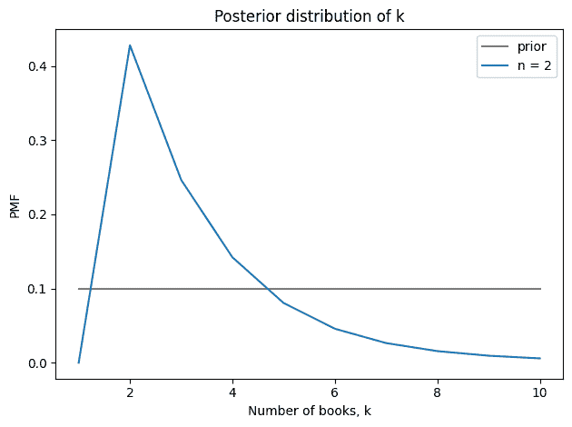
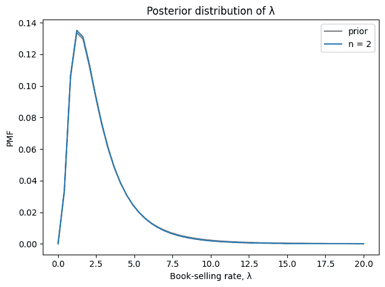
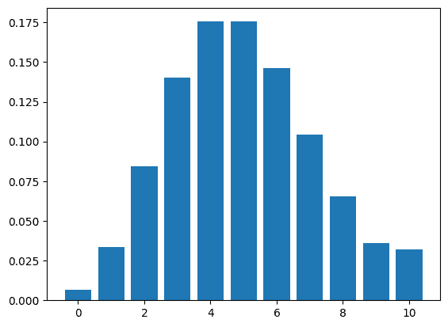
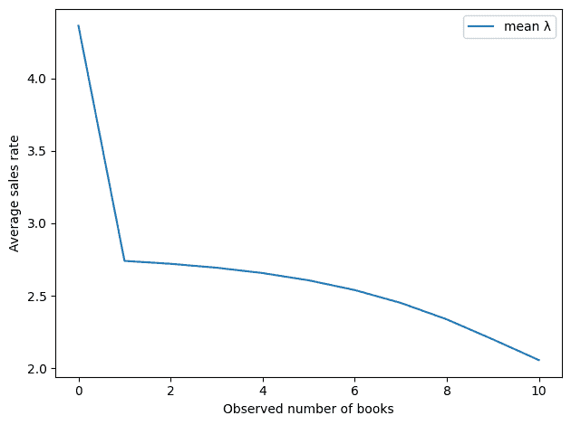
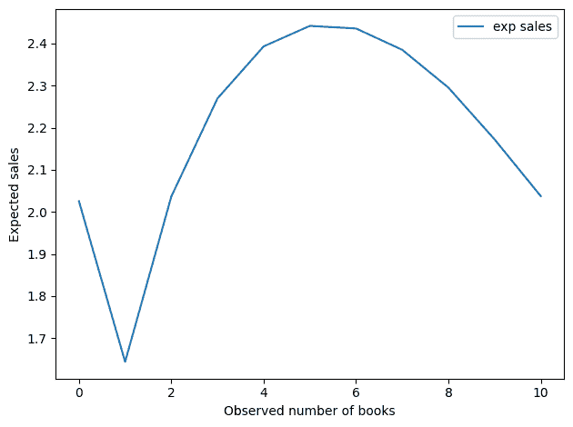

# 第三十章：多少本书？

> 原文：[`allendowney.github.io/ThinkBayes2/bookstore.html`](https://allendowney.github.io/ThinkBayes2/bookstore.html)
> 
> 译者：[飞龙](https://github.com/wizardforcel)
> 
> 协议：[CC BY-NC-SA 4.0](http://creativecommons.org/licenses/by-nc-sa/4.0/)


假设你是《可能是想多了》这本书的作者，当你去纽顿市的纽顿维尔书店时，你看到他们有两本你的书在展示。

他们只有几本书是好事吗，因为这表明他们开始时有更多的书并卖掉了一些？还是坏事，因为这表明他们只保留了少量的库存，而且他们还没有卖出。更一般地说，你想看到多少本书？

要回答这些问题，我们必须做出一些建模决策。为了保持简单，我将假设：

+   书店以某个未知周期的规律订购书。

+   在每个周期的开始，他们从`k`本书开始。

+   人们以每个周期`λ`本的速率购买这本书。

+   当你访问商店时，你会在周期内的一个随机时间`t`到达。

我们将首先为这些参数定义先验分布，然后根据观察到的数据进行更新。以下是我们需要的一些库。

```py
# If we're running on Colab, install empiricaldist
# https://pypi.org/project/empiricaldist/

import sys
IN_COLAB = 'google.colab' in sys.modules

if IN_COLAB:
    !pip  install  empiricaldist 
```

```py
# Get utils.py

import os

if not os.path.exists('utils.py'):
    !wget  https://github.com/AllenDowney/ThinkBayes2/raw/master/soln/utils.py 
```

```py
import numpy as np
import pandas as pd
import matplotlib.pyplot as plt

from empiricaldist import Pmf
from utils import decorate 
```

## 先验

对于一些书，商店只保留一本副本。对于其他书，它可能保留多达十本。如果我们对这个范围内的任何值都感到同样惊讶，`k`的先验分布在`1`和`10`之间是均匀的。

```py
ks = np.arange(1, 11)
prior_k = Pmf(1, ks)
prior_k.normalize()
prior_k.index.name = 'k' 
```

如果我们在周期的随机时间点到达，`t`的先验分布在`0`和`1`之间是均匀的，以周期为单位。

```py
ts = np.linspace(0, 1, 21)
prior_t = Pmf(1, ts)
prior_t.normalize()
prior_t.index.name = 't' 
```

现在让我们假设购书速率可能在每个周期之间的`2`和`3`本之间，但可能会大大提高——概率很低。我们可以选择一个具有合理均值和形状的对数正态分布。

```py
from scipy.stats import norm

λs = np.linspace(0.01, 20, 50)
qs = np.log(λs)

mu, sigma = 0.3, 0.7
ps = norm.pdf(qs, mu, sigma)

prior_λ = Pmf(ps, λs)
prior_λ.normalize()
prior_λ.index.name = 'λ'

prior_λ.mean() 
```

```py
2.7952013319456332 
```

这就是它的样子。

```py
prior_λ.plot()
decorate(xlabel='Book selling rate',
        ylabel='PMF',
        title='Prior') 
```


为了形成联合先验分布，我将使用`meshgrid`和`ij`索引顺序，使维度的顺序与参数的顺序相同：`k`、`λ`、`t`。

```py
def meshgrid(*args, **options):
    if 'indexing' not in options:
        options['indexing'] = 'ij'
    return np.meshgrid(*args, **options) 
```

```py
PK, Pλ, PT = meshgrid(prior_k, prior_λ, prior_t)
prior = PK * Pλ * PT
prior.shape 
```

```py
(10, 50, 21) 
```

## 更新

现在进行更新，我们需要处理两种情况：

+   如果我们观察到至少一本书`n`，数据的概率就是在周期`t`内以速率`λ`销售`k-n`本书的概率，这由泊松分布给出。

+   如果没有副本剩下，我们必须加上在这段时间内销售的书的数量可能超过`k`的概率，这由泊松生存函数给出。

以下函数计算参数的所有值的数据概率，乘以先验概率，并对结果进行归一化。

```py
from scipy.stats import poisson

def update(prior, n):
    K, λ, T = meshgrid(ks, λs, ts)

    like = poisson(mu=λ*T).pmf(K-n)
    if n == 0:
        like += poisson(mu=λ*T).sf(K)

    posterior = prior * like
    posterior /= posterior.sum()

    return posterior 
```

例如，我们将使用假设观察到的`2`本书进行更新。

```py
n = 2
posterior = update(prior, n) 
```

从联合后验中，我们可以提取`k`和`λ`的边际分布，并计算它们的均值。

```py
posterior_k = Pmf(posterior.sum(axis=(1, 2)), ks)
posterior_λ = Pmf(posterior.sum(axis=(0, 2)), λs)

posterior_k.mean(), posterior_λ.mean() 
```

```py
(3.294088962095148, 2.720709517121936) 
```

看到两本书表明商店每个周期开始时都有 3-4 本书，并且每个周期卖出 2-3 本。这是`k`的后验分布与其先验分布的比较。

```py
prior_k.plot(label=f'prior', color='gray')
posterior_k.plot(label=f'n = {n}')
decorate(xlabel='Number of books, k',
         ylabel='PMF',
         title='Posterior distribution of k') 
```



这是`λ`的后验分布。

```py
prior_λ.plot(label='prior', color='gray')
posterior_λ.plot(label=f'n = {n}')
decorate(xlabel='Book-selling rate, λ',
         ylabel='PMF',
         title='Posterior distribution of λ') 
```



看到两本书并不能提供太多关于书的销售速率的信息。

## 优化

现在让我们考虑更一般的问题，“你最想看到多少本书？”我们可以有两种回答方式：

+   一个答案可能是导致对`λ`估计最高的观察。但是如果书的销售速率相对较高，相对于`k`，书有时会脱销，导致销售损失。

+   因此，另一种选择是选择暗示每个周期销售的书的数量最多的观察。

为了计算第二个，我们需要以下函数，它生成一个代表以速率`λ`和上限`k`在一个周期内销售的书的分布的`Pmf`。

```py
def make_poisson(λ, k):
  """Make a truncated Poisson distribution.
 """
    qs = np.arange(k+1)
    ps = poisson.pmf(qs, λ)
    pmf = Pmf(ps, qs)

    # assign the total probability mass above `k` to `k`.
    pmf[k] += poisson.sf(k, λ)
    return pmf 
```

```py
pmf = make_poisson(5, 10)
pmf.bar() 
```



现在，如果我们有后验分布，我们可以计算每对参数的预期销售额，并制作一个将每个预期映射到其概率的 Pmf。

```py
def compute_sales(posterior):
  """Expected number of books sold per cycle.

 posterior: array of posterior probabilities for k, λ, t
 """
    # make the marginal joint posterior of k, λ
    posterior_joint = pd.DataFrame(posterior.sum(axis=2), 
                                   index=ks, columns=λs)

    res = []
    for (k, lam), p in posterior_joint.stack().items():
        exp_sales = make_poisson(lam, k).mean()
        res.append((p, exp_sales))

    ps, qs = np.transpose(res)
    pmf = Pmf(ps, qs)
    return pmf.mean() 
```

```py
compute_sales(posterior) 
```

```py
2.0364396231583672 
```

最后，让我们循环遍历可能的`n`值，并计算每个`n`的后验均值`k`和`λ`的值。

```py
res = []

for n in range(11):
    posterior = update(prior, n)
    posterior_k = Pmf(posterior.sum(axis=(1, 2)), ks)
    posterior_λ = Pmf(posterior.sum(axis=(0, 2)), λs)

    k, λ = posterior_k.mean(), posterior_λ.mean()
    sales = compute_sales(posterior)
    res.append((n, k, λ, sales))

df = pd.DataFrame(res, columns=['n', 'mean k', 'mean λ', 'exp sales'])
df 
```

|  | n | mean k | mean λ | exp sales |
| --- | --- | --- | --- | --- |
| --- | --- | --- | --- | --- |
| 0 | 0 | 2.409571 | 4.361937 | 2.025360 |
| 1 | 1 | 2.322331 | 2.740616 | 1.643844 |
| 2 | 2 | 3.294089 | 2.720710 | 2.036440 |
| 3 | 3 | 4.254728 | 2.693604 | 2.269578 |
| 4 | 4 | 5.199590 | 2.656726 | 2.393205 |
| 5 | 5 | 6.122093 | 2.606749 | 2.441859 |
| 6 | 6 | 7.013147 | 2.539618 | 2.435680 |
| 7 | 7 | 7.860703 | 2.450961 | 2.384995 |
| 8 | 8 | 8.649959 | 2.337343 | 2.295145 |
| 9 | 9 | 9.365430 | 2.199540 | 2.172083 |
| 10 | 10 | 10.000000 | 2.056530 | 2.037294 |

这是隐含的销售率作为观察到的书籍数量的函数。按照这个标准，最好的书籍数量是`0`。

```py
df['mean λ'].plot()
decorate(xlabel='Observed number of books',
         ylabel='Average sales rate') 
```



这是每个周期销售的书籍数量。

```py
df['exp sales'].plot()
decorate(xlabel='Observed number of books',
         ylabel='Expected sales')
df['exp sales'].argmax() 
```

```py
5 
```



这个结果更有趣。看到`0`本书仍然不错，但最佳值在`5`左右。

现在，我们不应该太认真地对待这个数值，因为它是基于非常少量的数据和许多假设 - 模型和先验中都是如此。但有趣的是，最优点既不是很多也不是没有。

感谢 Aubrey Clayton 提供[这条推文](https://twitter.com/aubreyclayton/status/1735467931490734251)，这给了我这篇文章的灵感。

版权所有 2023 年 Allen B. Downey

许可证：[署名-非商业性使用-相同方式共享 4.0 国际 (CC BY-NC-SA 4.0)](https://creativecommons.org/licenses/by-nc-sa/4.0/)
