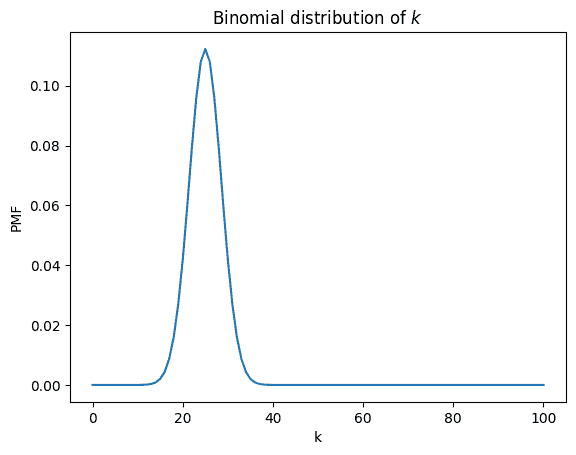
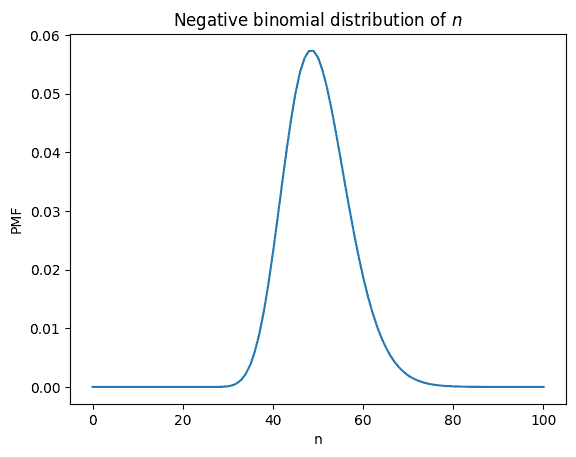
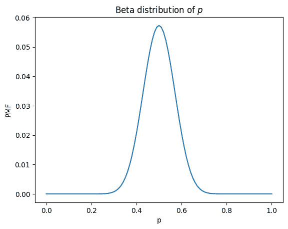
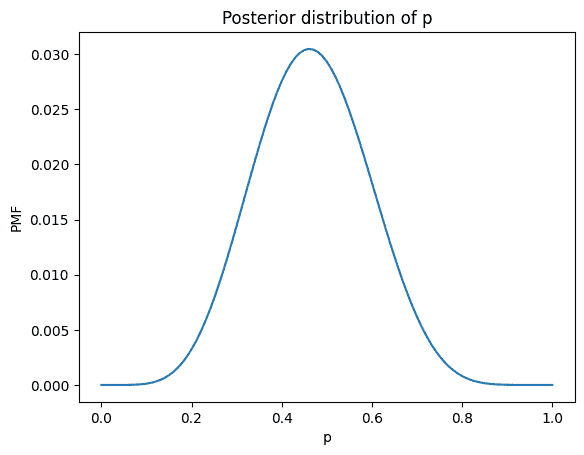
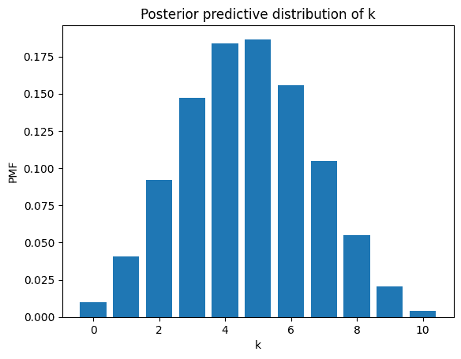
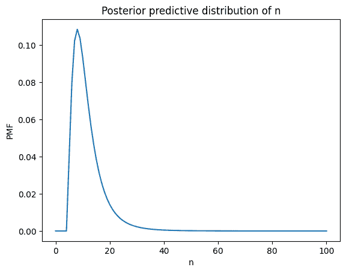

# 概率全知魔方

> 原文：[`allendowney.github.io/ThinkBayes2/beta_binomial.html`](https://allendowney.github.io/ThinkBayes2/beta_binomial.html)
> 
> 这个例子使用数组计算来探索共轭分布的概念。它是 *[Think Bayes](https://greenteapress.com/wp/think-bayes/)* 的扩展，[第十八章](https://allendowney.github.io/ThinkBayes2/chap18.html)，解释了如何使用共轭先验进行贝叶斯更新，计算量很小。

概率全知魔方是一个包含过去、现在和概率未来的三维数组。

起初，魔方似乎是一组二项分布的 PMF，但如果我们把它横过来，我们会发现它也是一组负二项分布的 PMF，如果我们再次把它横过来，它也是一组网格近似的贝塔分布。

这种三部分的性质是它具有执行贝叶斯更新的神奇能力的根源，我将进行演示。

```py
import numpy as np
import pandas as pd
import matplotlib.pyplot as plt 
```

## 制作魔方

假设你进行了 $n$ 次试验，成功的概率是 $p$。要计算 $k$ 次成功的概率，我们可以使用二项分布。

例如，这里是 $k$ 和 $n$ 的一系列值，以及 $p$ 的离散网格值。

```py
ks = np.arange(101)
ns = np.arange(101)
ps = np.linspace(0, 1, 101) 
```

我们可以使用 `meshgrid` 制作一个 $k$、$n$ 和 $p$ 的三维网格，使用 `binom` 在每个点上评估二项分布的 PMF。

```py
from scipy.stats import binom

K, N, P = np.meshgrid(ks, ns, ps, indexing='ij')
cube = binom.pmf(K, N, P)
cube.shape 
```

```py
(101, 101, 101) 
```

结果是**概率全知魔方**，因为它可以回答我们关于伯努利试验的所有问题。让我来演示一下。

## 二项分布

假设我们已知 $n$ 和 $p$，我们想知道 $k$ 的分布。我们可以通过沿着 $k$ 轴从魔方中选择一个向量来回答这个问题。

```py
n = 50
p = 50
pmf_k = cube[:, n, p] 
```

结果是一个归一化的 PMF。

```py
pmf_k.sum() 
```

```py
0.9999999999999996 
```

它看起来是这样的。

```py
plt.plot(ks, pmf_k)
plt.xlabel('k')
plt.ylabel('PMF')
plt.title('Binomial distribution of $k$'); 
```



因为我们使用 `binom` 计算魔方，所以不应该感到惊讶，发现这个魔方的切片是一个二项分布的 PMF。但为了确保，我们可以再次使用 `binom` 来确认。

```py
pmf_binom = binom.pmf(ks, n, p/100) 
```

我们可以检查结果是否一致。

```py
np.allclose(pmf_k, pmf_binom) 
```

```py
True 
```

因此，我们可以将魔方看作一组二项分布的 PMF。但我们也可以将其看作 $k$、$n$ 和 $p$ 的联合分布，这引发了一个问题：如果我们沿着 $n$ 和 $p$ 轴选择一个向量，我们会得到什么？

## 负二项分布

假设我们计划以概率 $p$ 进行伯努利试验，直到看到 $k$ 次成功。需要多少次试验？

我们可以通过沿着 $n$ 轴从魔方中选择一个向量来回答这个问题。

```py
k = 25
p = 50
pmf_n = cube[k, :, p].copy() 
```

结果接近我们想要的答案，但有一些问题需要解决。记住，魔方中的值来自二项分布的 PMF，看起来是这样的。

$$Pr(k; n, p) = \binom{n}{k} p^{k} (1-p)^{n-k}$$

第一项是二项式系数，表示我们可以找到 $k$ 次成功的 $n$ 个位置。但如果我们一直进行试验，直到看到 $k$ 次成功，我们知道最后一次试验会成功，这意味着我们只能找到其他 $k-1$ 次成功的 $n-1$ 个位置。

所以我们必须通过将元素除以 $n/k$ 来调整魔方中的值。

```py
np.seterr(divide='ignore', invalid='ignore')

pmf_n /= (ns / k)
pmf_n[0] = 0 
```

并且对结果进行归一化，得到一个合适的 PMF。

```py
pmf_n /= pmf_n.sum() 
```

它看起来是这样的。

```py
plt.plot(ns, pmf_n)
plt.xlabel('n')
plt.ylabel('PMF')
plt.title('Negative binomial distribution of $n$'); 
```



这是一个负二项分布，我们可以使用 `scipy.stats.nbinom` 来确认。

```py
from scipy.stats import nbinom

pmf_nbinom = nbinom.pmf(ns-k, k, p/100)
pmf_nbinom.sum() 
```

```py
0.9999999094998685 
```

```py
np.allclose(pmf_n, pmf_nbinom) 
```

```py
True 
```

为了看清这是如何工作的，我们可以比较二项分布的 PMF，它是一个以 $n$ 和 $p$ 为参数的分布，$k$ 为变量：

$$Pr(k; n, p) = \binom{n}{k} p^{k} (1-p)^{n-k}$$

以及负二项分布的 PMF，我将其写成了以 $n$ 为参数的分布，$k$ 和 $p$ 为参数：

$$Pr(n; k, p) = \binom{n-1}{k-1} p^k (1-p)^{n-k}$$

这不是参数化负二项分布最常见的方式，但它表明唯一的区别在于二项式系数，因为我们知道最后一次试验是成功的。

## beta 分布

假设我们有 101 个设备，这些设备以不同的概率进行伯努利试验。第一个设备的 p=0，第二个设备的 p=0.01，依此类推，直到最后一个设备的 p=1。

现在假设我们选择其中一个设备，使得所有的 p 值都是同样可能的。如果我们进行 n 次试验并观察到 k 次成功，那么 p 的分布是什么？

我们可以通过沿着 p 轴从立方体中选择一个向量来回答这个问题。

```py
k = 25
n = 50

pdf_p = cube[k, n, :].copy() 
```

结果没有被归一化。

```py
pdf_p.sum() 
```

```py
1.96078431372549 
```

但我们可以这样归一化。

```py
pdf_p /= pdf_p.sum() 
```

这就是它的样子。

```py
plt.plot(ps, pdf_p)
plt.xlabel('p')
plt.ylabel('PMF')
plt.title('Beta distribution of $p$'); 
```



这是一个 beta 分布，我们可以通过使用变量的改变来确认，$a = k+1$ and $b = n-k+1$，来运行`scipy.stats.beta`。

```py
from scipy.stats import beta

a = k + 1
b = n - k + 1
a, b 
```

```py
(26, 26) 
```

```py
pdf_beta = beta.pdf(ps, a, b)
pdf_beta /= pdf_beta.sum() 
```

```py
np.allclose(pdf_p, pdf_beta) 
```

```py
True 
```

为了看清楚这是如何工作的，让我们比较一下 beta 分布的概率密度函数

$$f(p, a, b) = \frac{1}{B(a, b)} p^{a-1} (1-p)^{b-1} $$

以及二项式分布的概率质量函数。

$$Pr(k; n, p) = \binom{n}{k} p^{k} (1-p)^{n-k}$$

通过变量的改变，它们是相同的，除了第一项，它对分布进行了归一化。

## 共轭先验

这种相似性是 beta 和二项式是共轭分布的原因，这意味着它们是相互关联的。这种关系对贝叶斯统计有一个有用的特性：如果 p 的先验分布是 beta，数据的似然性是二项式，后验分布也是 beta。

为了看清楚这是如何工作的，这是具有参数$a$和$b$的 beta 先验分布的概率密度函数。

$$p^{a-1} (1-p)^{b-1}$$

我省略了归一化因子-因为我们将在更新后对分布进行归一化，所以我们不需要它。

现在假设我们在 n 次试验中看到 k 次成功。这个数据的似然性由二项式分布给出，它有这个 PMF。

$$p^{k} (1-p)^{n-k}$$

同样，我省略了归一化因子。现在要得到未归一化的后验，我们将 beta 先验和二项式似然性相乘。结果是

$$p^{a-1+k} (1-p)^{b-1+n-k}$$

我们将其识别为具有参数$a+k$和$b+n-k$的未归一化的 beta 分布。

所以如果我们观察到 n 次试验中有 k 次成功，我们可以通过使用参数为 a+k 和 b+n-k 的 beta 后验来进行更新。

例如，假设先验是具有参数$a=2$和$b=3$的 beta 分布。

```py
a = 2
b = 3

prior = beta.pdf(ps, a, b) 
```

并假设我们在 10 次尝试中看到了 5 次成功。

```py
k = 5
n = 10

like = binom.pmf(k, n, ps) 
```

我们可以通过将先验和似然性相乘，然后对结果进行归一化来计算后验。

```py
posterior = prior * like
posterior /= posterior.sum() 
```

或者我们可以用更新后的参数计算 beta 分布。

```py
posterior_beta = beta.pdf(ps, a+k, b+n-k)
posterior_beta /= posterior_beta.sum() 
```

结果无论哪种方式都是相同的。

```py
np.allclose(posterior, posterior_beta) 
```

```py
True 
```

但我们不必通过进行显式更新或计算 beta 分布来计算后验，因为全知的概率立方体已经知道了答案-我们只需要问。

以下函数使用参数$a$和$b$，并查找在立方体中已经计算的相应的 beta 分布。

```py
def get_beta(a, b, cube):
    k = a - 1
    n = b + k - 1

    pdf = cube[k, n, :].copy()
    pdf /= pdf.sum()
    return pdf 
```

我们可以使用它从立方体中得到$p$的后验分布。

```py
posterior_cube = get_beta(a + k, b + n - k, cube) 
```

并确认我们得到了相同的结果。

```py
np.allclose(posterior_beta, posterior_cube) 
```

```py
True 
```

这就是它的样子。

```py
plt.plot(ps, posterior_cube)

plt.xlabel('p')
plt.ylabel('PMF')
plt.title('Posterior distribution of p'); 
```



## 使用 nbinom 进行更新

现在假设我们不是进行 n 次试验，而是一直进行试验，直到我们看到 k 次成功-假设这需要 n 次试验。

在这种情况下，我们可以使用负二项分布来计算数据的似然性。

```py
like2 = nbinom.pmf(n-k, k, ps)
like2[0] = 0 
```

我们可以以通常的方式进行更新。

```py
posterior2 = prior * like2
posterior2 /= posterior2.sum() 
```

结果在两种情况下是相同的：

+   如果我们事先决定要进行 n 次试验，并观察到 k 次成功，或者

+   如果我们一直进行试验，直到我们看到 k 次成功，并且这需要 n 次试验。

```py
np.allclose(posterior, posterior2) 
```

```py
True 
```

贝叶斯推断只取决于数据，而不是停止条件。或者，正如我的朋友泰德·邦恩所说：[谁知道人心中隐藏着什么邪恶？贝叶斯不在乎。](https://blog.richmond.edu/physicsbunn/2012/01/05/who-knows-what-evil-lurks-in-the-hearts-of-men-the-bayesian-doesnt-care/)

## 后验预测分布

概率全知方块知道我们在新数据的光下应该相信什么，但这还不是全部。它也知道未来，至少是概率上的。

更新后，我们可以通过计算加权的二项分布混合来获得后验预测分布，不同的$p$值，权重是后验概率。

我们可以通过从方块中选择$(k, p)$平面，乘以后验概率并消去$p$轴来做到这一点。

```py
post_pred_k = (cube[:, n, :] * posterior).sum(axis=1) 
```

结果是一个$k$上的分布。这是它的样子（去掉大于$n$的$k$的值）。

```py
plt.bar(ks[:n+1], post_pred_k[:n+1])

plt.xlabel('k')
plt.ylabel('PMF')
plt.title('Posterior predictive distribution of k'); 
```



二项分布的贝塔混合是贝塔二项分布，它有一个我们可以解析计算的 PMF。

```py
from scipy.stats import betabinom

post_pred_bb = betabinom.pmf(ks, n, a+k, b+n-k) 
```

所以我们可以确认，全知方块是正确的。

```py
np.allclose(post_pred_k, post_pred_bb) 
```

```py
True 
```

## 其他后验预测

我们还可以使用方块来计算给定所需成功次数$k$的$n$的后验预测分布。

我们首先从方块中选择$(n, p)$平面，这是一组负二项分布，只是我们必须通过除以$n/k$来纠正它们，就像我们上面做的那样。

实际上，我们只需要除以$n$，因为$k$是一个常数，会被归一化掉。

```py
plane = cube[k, :, :] / ns[:, None]
plane[0] = 0 
```

现在我们可以像前面的例子一样计算加权和，乘以后验概率并消去$p$轴。

```py
post_pred_n = (plane * posterior).sum(axis=1)
post_pred_n /= post_pred_n.sum() 
```

这是它的样子。

```py
plt.plot(ns, post_pred_n)

plt.xlabel('n')
plt.ylabel('PMF')
plt.title('Posterior predictive distribution of n'); 
```



负二项分布的贝塔加权混合是贝塔负二项分布，它有一个我们可以解析计算的 PMF。SciPy 没有一个可以做到这一点的函数，但我们可以使用`scipy.special`中的函数自己编写。

```py
import scipy.special as sps

def betanegbinom_pmf(n, r, a, b):
  """Compute the PMF of the beta-negative binomial distribution.

 Generated by ChatGPT, revised based on
 https://en.wikipedia.org/wiki/Beta_negative_binomial_distribution

 Parameters:
 - n: Number of trials before stopping.
 - r: Number of successes required.
 - a: Shape parameter of the beta distribution.
 - b: Shape parameter of the beta distribution.

 Returns:
 - PMF value for the given parameters.
 """
    k = n - r
    binomial_coefficient = sps.comb(r + k - 1, k)
    beta_num = sps.beta(a + r, b + k)
    beta_den = sps.beta(a, b)

    pmf = binomial_coefficient * (beta_num / beta_den)
    return pmf 
```

贝塔负二项分布的传统参数化使用$k$表示失败次数，$r$表示所需成功次数，因此我们必须改变一些变量以获得$n$上的分布。

```py
post_pred_bnb = betanegbinom_pmf(ns, k, a+k, b+n-k)
post_pred_bnb /= post_pred_bnb.sum() 
```

但我们可以确认，方块的结果与解析 PMF 一致。

```py
np.allclose(post_pred_n, post_pred_bnb) 
```

```py
True 
```

总之，概率全知方块包含了过去（先验分布）、现在（后验分布）和未来（后验预测分布）。

Bayes 思维，第二版

版权所有 2020 Allen B. Downey

许可证：[署名-非商业-相同方式共享 4.0 国际（CC BY-NC-SA 4.0）](https://creativecommons.org/licenses/by-nc-sa/4.0/)
