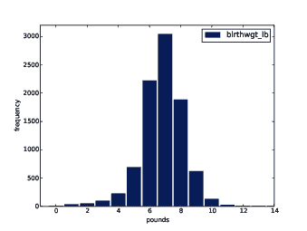
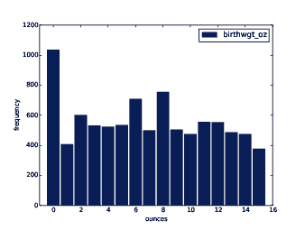
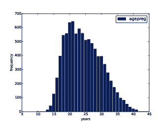
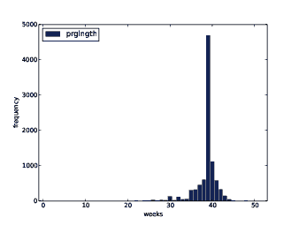
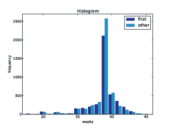

# 第二章 分布

> 原文：[`greenteapress.com/thinkstats2/html/thinkstats2003.html`](https://greenteapress.com/thinkstats2/html/thinkstats2003.html)

## 2.1 直方图

描述变量的最佳方法之一是报告数据集中出现的值以及每个值出现的次数。这个描述被称为变量的分布。

分布的最常见表示是直方图，它是一个显示每个值频率的图表。在这个上下文中，“频率”意味着该值出现的次数。

在 Python 中，计算频率的有效方法是使用字典。给定一系列值`t`：

```py
hist = {}
for x in t:
    hist[x] = hist.get(x, 0) + 1 
```

结果是一个从值到频率的字典。或者，您可以使用`collections`模块中定义的`Counter`类：

```py
from collections import Counter
counter = Counter(t) 
```

结果是一个`Counter`对象，它是字典的子类。

另一个选择是使用我们在上一章中看到的 pandas 方法`value_counts`。但是对于这本书，我创建了一个名为 Hist 的类，它表示直方图并提供对其进行操作的方法。

## 2.2 直方图的表示

Hist 构造函数可以接受序列、字典、pandas Series 或另一个 Hist。您可以像这样实例化一个 Hist 对象：

```py
>>> import thinkstats2
>>> hist = thinkstats2.Hist([1, 2, 2, 3, 5])
>>> hist
Hist({1: 1, 2: 2, 3: 1, 5: 1}) 
```

Hist 对象提供了`Freq`，它接受一个值并返回其频率：

```py
>>> hist.Freq(2)
2 
```

括号操作符也是一样的：

```py
>>> hist[2]
2 
```

如果查找一个从未出现过的值，频率就是 0。

```py
>>> hist.Freq(4)
0 
```

`Values`返回 Hist 中值的未排序列表：

```py
>>> hist.Values()
[1, 5, 3, 2] 
```

要按顺序循环遍历值，可以使用内置函数`sorted`：

```py
for val in sorted(hist.Values()):
    print(val, hist.Freq(val)) 
```

或者您可以使用`Items`来迭代值-频率对：

```py
for val, freq in hist.Items():
     print(val, freq) 
```

## 2.3 绘制直方图

> * * *
> 
> 
> 
> | 图 2.1：出生体重磅部分的直方图。 |
> | --- |
> 
> * * *

对于这本书，我编写了一个名为`thinkplot.py`的模块，它提供了用于绘制 Hists 和`thinkstats2.py`中定义的其他对象的函数。它基于`matplotlib`包中的`pyplot`。有关安装`matplotlib`的信息，请参见第 0.2 节。

要使用`thinkplot`绘制`hist`，请尝试以下操作：

```py
>>> import thinkplot
>>> thinkplot.Hist(hist)
>>> thinkplot.Show(xlabel='value', ylabel='frequency') 
```

您可以在[`greenteapress.com/thinkstats2/thinkplot.html`](http://greenteapress.com/thinkstats2/thinkplot.html)上阅读`thinkplot`的文档。

> * * *
> 
> 
> 
> | 图 2.2：出生体重盎司部分的直方图。 |
> | --- |
> 
> * * *

## 2.4 NSFG 变量

现在让我们回到 NSFG 的数据。本章的代码在`first.py`中。有关下载和使用此代码的信息，请参见第 0.2 节。

当您开始处理一个新的数据集时，我建议您逐个探索您计划使用的变量，一个很好的开始方法是查看直方图。

在第 1.6 节中，我们将`agepreg`从厘年转换为年，并将`birthwgt_lb`和`birthwgt_oz`合并为一个数量`totalwgt_lb`。在本节中，我将使用这些变量来演示直方图的一些特性。

> * * *
> 
> 
> 
> | 图 2.3：怀孕结束时母亲的年龄直方图。 |
> | --- |
> 
> * * *

我将从读取数据并选择活产记录开始：

```py
 preg = nsfg.ReadFemPreg()
    live = preg[preg.outcome == 1] 
```

括号中的表达式是一个布尔 Series，它从 DataFrame 中选择行并返回一个新的 DataFrame。接下来，我生成并绘制了活产婴儿的`birthwgt_lb`的直方图。

```py
 hist = thinkstats2.Hist(live.birthwgt_lb, label='birthwgt_lb')
    thinkplot.Hist(hist)
    thinkplot.Show(xlabel='pounds', ylabel='frequency') 
```

当传递给 Hist 的参数是 pandas Series 时，任何`nan`值都会被丢弃。`label`是一个字符串，在绘制 Hist 时出现在图例中。

> * * *
> 
> 
> 
> | 图 2.4：怀孕周数的直方图。 |
> | --- |
> 
> * * *

图 2.1 显示了结果。最常见的值，称为众数，是 7 磅。分布大致呈钟形，这是正态分布的形状，也称为高斯分布。但与真正的正态分布不同，这个分布是不对称的；它的尾部向左延伸的距离比向右延伸的距离更远。

图 2.2 显示了 `birthwgt_oz` 的直方图，即出生体重的盎司部分。理论上，我们期望这个分布是均匀的；也就是说，所有的值应该具有相同的频率。事实上，0 比其他值更常见，1 和 15 比较少见，可能是因为受访者将接近整数值的出生体重四舍五入了。

图 2.3 显示了 `agepreg` 的直方图，即母亲怀孕结束时的年龄。众数是 21 岁。分布大致呈钟形，但在这种情况下，尾部向右延伸的距离比向左延伸的距离更远；大多数母亲在 20 多岁，30 多岁的母亲较少。

图 2.4 显示了 `prglngth` 的直方图，即怀孕的周数。到目前为止，最常见的值是 39 周。左尾比右尾长；早产儿很常见，但怀孕很少超过 43 周，如果超过，医生通常会进行干预。

## 2.5  异常值

通过直方图，很容易识别最常见的值和分布的形状，但罕见的值并不总是可见。

在继续之前，检查异常值是一个好主意，这些异常值可能是测量和记录中的错误，也可能是罕见事件的准确报告。

Hist 提供了 `Largest` 和 `Smallest` 方法，它们接受一个整数 `n`，并从直方图中返回 `n` 个最大或最小的值：

```py
 for weeks, freq in hist.Smallest(10):
        print(weeks, freq) 
```

在活产的怀孕时长列表中，最低的 10 个值是 `[0, 4, 9, 13, 17, 18, 19, 20, 21, 22]`。10 周以下的值肯定是错误的；最有可能的解释是结果没有被正确编码。30 周以上的值可能是合法的。在 10 到 30 周之间，很难确定；一些值可能是错误的，但一些代表早产儿。

在范围的另一端，最高的值是：

```py
weeks  count
43     148
44     46
45     10
46     1
47     1
48     7
50     2 
```

大多数医生建议如果怀孕超过 42 周就进行引产，因此一些较长的值令人惊讶。特别是，50 周在医学上似乎不太可能。

处理异常值的最佳方法取决于“领域知识”；即数据来源和含义的信息。它还取决于您计划执行的分析。

在这个例子中，激发问题是第一胎婴儿是否倾向于早产（或晚产）。当人们提出这个问题时，他们通常对足月妊娠感兴趣，因此在这个分析中，我将专注于怀孕超过 27 周的情况。

## 2.6  第一胎婴儿

现在我们可以比较第一胎婴儿和其他婴儿的怀孕时长分布。我使用 `birthord` 分割了活产的 DataFrame，并计算了它们的直方图：

```py
 firsts = live[live.birthord == 1]
    others = live[live.birthord != 1]

    first_hist = thinkstats2.Hist(firsts.prglngth, label='first')
    other_hist = thinkstats2.Hist(others.prglngth, label='other') 
```

然后我在同一轴上绘制了它们的直方图：

```py
 width = 0.45
    thinkplot.PrePlot(2)
    thinkplot.Hist(first_hist, align='right', width=width)
    thinkplot.Hist(other_hist, align='left', width=width)
    thinkplot.Show(xlabel='weeks', ylabel='frequency',
                   xlim=[27, 46]) 
```

`thinkplot.PrePlot` 接受我们计划绘制的直方图数量；它使用这些信息来选择一个合适的颜色集合。

> * * *
> 
> 
> 
> | 图 2.5：怀孕时长的直方图。 |
> | --- |
> 
> * * *

`thinkplot.Hist` 通常使用 `align='center'`，这样每个条形图都居中于其值。对于这个图，我使用 `align='right'` 和 `align='left'` 将相应的条形图放置在值的两侧。

使用 `width=0.45`，两个条形图的总宽度为 0.9，留下了一些空间。

最后，我调整轴，只显示 27 到 46 周之间的数据。图 2.5 显示了结果。

直方图很有用，因为它们立即显示出最频繁的值。但它们不是比较两个分布的最佳选择。在这个例子中，“第一个宝宝”的数量比“其他宝宝”少，所以直方图中的一些明显差异是由于样本量。在下一章中，我们将使用概率质量函数来解决这个问题。

## 2.7  Summarizing distributions

直方图是样本分布的完整描述；也就是说，给定一个直方图，我们可以重建样本中的值（尽管不能重建它们的顺序）。

如果分布的细节很重要，可能需要呈现直方图。但通常我们希望用几个描述性统计数据总结分布。

我们可能想要报告的一些特征是：

+   central tendency: 值是否倾向于聚集在特定点周围？

+   modes: 是否有多个集群？

+   spread: 值之间有多少变异性？

+   tails: How quickly do the probabilities drop off as we move away from the modes?

+   outliers: 是否有远离模式的极端值？

旨在回答这些问题的统计数据称为摘要统计数据。到目前为止，最常见的摘要统计量是均值，它旨在描述分布的中心趋势。

如果你有一个包含`n`个值的样本，x[i]，那么均值 x 是值的总和除以值的数量；换句话说

| x =  |
| --- |

&#124; 1 &#124;

&#124;  &#124;

&#124; n &#124;

|   |
| --- |

&#124;   &#124;

&#124; ∑ &#124;

&#124; i &#124;

|  x[i]  |
| --- |

“均值”和“平均值”有时可以互换使用，但我做出了区分：

+   样本的“均值”是使用前面的公式计算的摘要统计量。

+   “平均值”是你可能选择用来描述中心趋势的几个摘要统计量之一。

有时均值是一组值的良好描述。例如，苹果的大小几乎都一样大（至少是超市出售的那些）。所以如果我买了 6 个苹果，总重量是 3 磅，那么说它们每个大约半磅是一个合理的摘要。

但南瓜更加多样化。假设我在花园里种植了几个品种，有一天我收获了三个装饰南瓜，每个重 1 磅，两个馅饼南瓜，每个重 3 磅，还有一个重 591 磅的大西洋巨型南瓜。这个样本的均值是 100 磅，但如果我告诉你“我花园里的平均南瓜重 100 磅”，那就是误导性的。在这个例子中，没有有意义的平均值，因为没有典型的南瓜。

## 2.8  Variance

如果没有一个单一的数字来总结南瓜的重量，我们可以用两个数字更好地描述：均值和方差。

方差是一个旨在描述分布的变异性或扩展的摘要统计量。一组值的方差是

| S² =  |
| --- |

&#124; 1 &#124;

&#124;  &#124;

&#124; n &#124;

|   |
| --- |

&#124;   &#124;

&#124; ∑ &#124;

&#124; i &#124;

|  (x[i] − x)²  |
| --- |

术语 x[i] − x 称为“偏差”，所以方差是均方偏差。方差的平方根 S 是标准差。

如果你有先前的经验，你可能已经看到了一个方差的公式，分母中有 n−1，而不是`n`。这个统计量用于使用样本估计总体方差。我们将在第八章回到这个问题。8

Pandas 数据结构提供了计算均值、方差和标准差的方法：

```py
 mean = live.prglngth.mean()
    var = live.prglngth.var()
    std = live.prglngth.std() 
```

对于所有活产，怀孕期的平均长度是 38.6 周，标准偏差是 2.7 周，这意味着我们应该预期 2-3 周的偏差是常见的。

怀孕期的方差是 7.3，这很难解释，特别是因为单位是周²，或者“平方周”。方差在某些计算中很有用，但它不是一个很好的摘要统计量。

## 2.9  Effect size

效应大小是一种旨在描述效应大小的摘要统计量。例如，要描述两组之间的差异，一个明显的选择是均值的差异。

第一个宝宝的平均怀孕期长为 38.601 周；其他宝宝为 38.523 周。差异为 0.078 周，相当于 13 小时。作为典型怀孕期长的一部分，这种差异约为 0.2%。

如果我们假设这个估计是准确的，这样的差异将没有实际后果。事实上，如果没有观察到大量的怀孕情况，很少有人会注意到这种差异。

另一种传达效果大小的方法是将组间差异与组内变异性进行比较。科恩的 d 是一种旨在做到这一点的统计量；它被定义为

| d =  |
| --- |

| x_1 − x_2 |

|    |

| s |

|    |
| --- |

其中 x_1 和 x_2 是组的均值，s 是“合并标准差”。下面是计算科恩的 d 的 Python 代码：

```py
def CohenEffectSize(group1, group2):
    diff = group1.mean() - group2.mean()

    var1 = group1.var()
    var2 = group2.var()
    n1, n2 = len(group1), len(group2)

    pooled_var = (n1 * var1 + n2 * var2) / (n1 + n2)
    d = diff / math.sqrt(pooled_var)
    return d 
```

在这个例子中，均值的差异是 0.029 标准差，这是很小的。为了让人有所了解，男性和女性身高的差异约为 1.7 个标准差（参见[`en.wikipedia.org/wiki/Effect_size`](https://en.wikipedia.org/wiki/Effect_size)）。

## 2.10  报告结果

我们已经看到了几种描述第一个宝宝和其他宝宝怀孕期长短差异的方法。我们应该如何报告这些结果呢？

答案取决于提问的人。科学家可能对任何（真实的）效果感兴趣，无论多么小。医生可能只关心临床上有意义的效果；也就是说，影响治疗决策的差异。怀孕的女性可能对与她相关的结果感兴趣，比如提前或推迟分娩的概率。

你报告结果的方式也取决于你的目标。如果你试图证明一个效应的重要性，你可能会选择强调差异的摘要统计数据。如果你试图安抚一个患者，你可能会选择将差异放在上下文中的统计数据。

当然，你的决定也应该受到职业道德的指导。说服别人是可以的；你*应该*设计能清晰讲述故事的统计报告和可视化。但你也应该尽力使你的报告诚实，并承认不确定性和局限性。

## 2.11  练习

练习 1 *根据本章的结果，假设有人要求你总结你对第一个宝宝是否会晚到的看法。*

*如果你想在晚间新闻中报道，你会使用哪些摘要统计数据？如果你想安抚焦虑的患者，你会使用哪些摘要统计数据？*

*最后，想象一下你是塞西尔·亚当斯，The Straight Dope 的作者（[*http://straightdope.com*](http://straightdope.com)），你的工作是回答这个问题，“第一个宝宝会晚到吗？”写一段清晰、准确和诚实地使用本章结果回答这个问题的段落。*

练习 2 *在你下载的存储库中，你应该会找到一个名为`chap02ex.ipynb`的文件；打开它。有些单元格已经填写好了，你应该执行它们。其他单元格会给出练习的说明。按照说明填写答案。*

*这个练习的解决方案在`chap02soln.ipynb`中*

在你下载的存储库中，你应该会找到一个名为`chap02ex.py`的文件；你可以将这个文件作为以下练习的起点。我的解决方案在`chap02soln.py`中。

练习 3 *分布的众数是最频繁出现的值；参见* [*http://wikipedia.org/wiki/Mode_(statistics)*](http://wikipedia.org/wiki/Mode_(statistics)) *。编写一个名为`Mode`的函数，该函数接受一个 Hist 并返回最频繁出现的值。*

*作为一个更具挑战性的练习，编写一个名为`AllModes`的函数，它以频率降序返回值-频率对的列表。*

练习 4 使用变量`totalwgt_lb`，调查第一个宝宝是更轻还是更重。计算 Cohen 的 d 来量化两组之间的差异。它与怀孕长度的差异相比如何？

## 2.12 术语表

+   分布：样本中出现的值及其频率。

+   直方图：从值到频率的映射，或显示这种映射的图表。

+   频率：值在样本中出现的次数。

+   模式：样本中最频繁出现的值，或者是最频繁出现的值之一。

+   正态分布：钟形分布的理想化；也称为高斯分布。

+   均匀分布：所有值具有相同频率的分布。

+   尾部：分布的高极端和低极端部分。

+   中心趋势：样本或总体的特征；直观地，它是一个平均值或典型值。

+   异常值：远离中心趋势的值。

+   传播：分布中值的分散程度的度量。

+   摘要统计量：量化分布某些方面的统计量，如中心趋势或传播。

+   方差：经常用来量化传播的摘要统计量。

+   标准差：方差的平方根，也用作传播的度量。

+   效应大小：旨在量化效应大小的摘要统计量，如组间差异。

+   临床意义：在实践中相关的结果，如组间差异。
