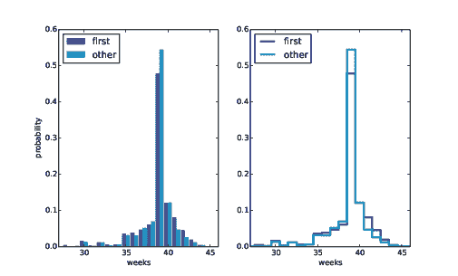
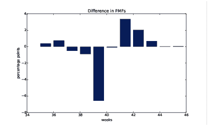
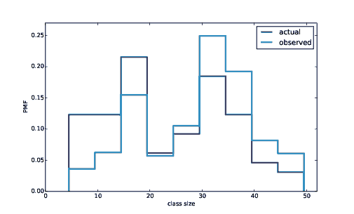

# 第三章  概率质量函数

> [`greenteapress.com/thinkstats2/html/thinkstats2004.html`](https://greenteapress.com/thinkstats2/html/thinkstats2004.html)

本章的代码在`probability.py`中。有关下载和使用此代码的信息，请参见第 0.2 节。

## 3.1  Pmfs

表示分布的另一种方法是概率质量函数（PMF），它将每个值映射到其概率。概率是作为样本大小`n`的分数表达的频率。要从频率到概率，我们通过`n`除以`n`，这称为归一化。

给定一个 Hist，我们可以制作一个字典，将每个值映射到其概率：

```py
n = hist.Total()
d = {}
for x, freq in hist.Items():
    d[x] = freq / n 
```

或者我们可以使用`thinkstats2`提供的 Pmf 类。与 Hist 一样，Pmf 构造函数可以接受列表、pandas Series、字典、Hist 或另一个 Pmf 对象。以下是一个简单列表的示例：

```py
>>> import thinkstats2
>>> pmf = thinkstats2.Pmf([1, 2, 2, 3, 5])
>>> pmf
Pmf({1: 0.2, 2: 0.4, 3: 0.2, 5: 0.2}) 
```

Pmf 已归一化，因此总概率为 1。

Pmf 和 Hist 对象在许多方面相似；实际上，它们从一个共同的父类继承了许多方法。例如，`Values`和`Items`方法对两者都起作用。最大的区别在于 Hist 将值映射到整数计数器；Pmf 将值映射到浮点概率。

要查找与值相关联的概率，请使用`Prob`：

```py
>>> pmf.Prob(2)
0.4 
```

括号运算符是等效的：

```py
>>> pmf[2]
0.4 
```

您可以通过增加与值相关联的概率来修改现有的 Pmf：

```py
>>> pmf.Incr(2, 0.2)
>>> pmf.Prob(2)
0.6 
```

或者您可以将概率乘以一个因子：

```py
>>> pmf.Mult(2, 0.5)
>>> pmf.Prob(2)
0.3 
```

如果修改了 Pmf，则结果可能未归一化；也就是说，概率可能不再总和为 1。要检查，可以调用`Total`，它返回概率的总和：

```py
>>> pmf.Total()
0.9 
```

要重新归一化，调用`Normalize`：

```py
>>> pmf.Normalize()
>>> pmf.Total()
1.0 
```

Pmf 对象提供了一个`Copy`方法，因此您可以制作并修改副本，而不会影响原始副本。

在本节中，我的符号可能看起来不一致，但有一个系统：我使用 Pmf 表示类的名称，`pmf`表示类的实例，PMF 表示概率质量函数的数学概念。

## 3.2  绘制 PMFs

`thinkplot`提供了绘制 Pmf 的两种方法：

+   要将 Pmf 绘制为条形图，可以使用`thinkplot.Hist`。如果 Pmf 中的值数量很少，则条形图最有用。

+   要将 Pmf 绘制为阶梯函数，可以使用`thinkplot.Pmf`。如果值的数量很大且 Pmf 平滑，则此选项最有用。此函数还适用于 Hist 对象。

此外，`pyplot`提供了一个名为`hist`的函数，它接受一个值序列，计算直方图并绘制它。由于我使用 Hist 对象，我通常不使用`pyplot.hist`。

> * * *
> 
> 
> 
> | 图 3.1：第一个宝宝和其他宝宝的怀孕长度的 PMF，使用条形图和阶梯函数。 |
> | --- |
> 
> * * *

图 3.1 显示了第一个宝宝和其他宝宝的怀孕长度的 PMF，使用条形图（左侧）和阶梯函数（右侧）。

通过绘制 PMF 而不是直方图，我们可以比较两个分布，而不会被样本大小的差异所误导。根据这个图，第一个宝宝似乎不太可能按时出生（第 39 周），而更有可能晚一点（第 41 周和 42 周）。

以下是生成图 3.1 的代码：

```py
 thinkplot.PrePlot(2, cols=2)
    thinkplot.Hist(first_pmf, align='right', width=width)
    thinkplot.Hist(other_pmf, align='left', width=width)
    thinkplot.Config(xlabel='weeks',
                     ylabel='probability',
                     axis=[27, 46, 0, 0.6])

    thinkplot.PrePlot(2)
    thinkplot.SubPlot(2)
    thinkplot.Pmfs([first_pmf, other_pmf])
    thinkplot.Show(xlabel='weeks',
                   axis=[27, 46, 0, 0.6]) 
```

`PrePlot`接受可选参数`rows`和`cols`，以制作一个图的网格，在本例中是两个图的一行。第一个图（左侧）使用`thinkplot.Hist`显示 Pmfs，正如我们以前所见。

对`PrePlot`的第二次调用重置了颜色生成器。然后，`SubPlot`切换到第二个图（右侧）并使用`thinkplot.Pmfs`显示 Pmfs。我使用了`axis`选项来确保两个图在相同的轴上，这通常是一个好主意，如果您打算比较两个图。

## 3.3  其他可视化

直方图和 PMF 在探索数据并尝试识别模式和关系时非常有用。一旦你对正在发生的事情有了想法，一个很好的下一步是设计一个可视化，使你已经识别的模式尽可能清晰。

在 NSFG 数据中，分布的最大差异在众数附近。因此，将数据放大到图表的那部分，并转换数据以强调差异是有意义的：

```py
 weeks = range(35, 46)
    diffs = []
    for week in weeks:
        p1 = first_pmf.Prob(week)
        p2 = other_pmf.Prob(week)
        diff = 100 * (p1 - p2)
        diffs.append(diff)

    thinkplot.Bar(weeks, diffs) 
```

在这段代码中，`weeks`是周的范围；`diffs`是两个 PMF 之间的百分点差异。图 3.2 显示了结果，呈现为条形图。这个图表使模式更加清晰：第一个宝宝在第 39 周出生的可能性较小，而在第 41 周和 42 周出生的可能性略高。

> * * *
> 
> 
> 
> | 图 3.2：按周的百分点差异。 |
> | --- |
> 
> * * *

现在我们应该暂时保持这个结论。我们使用相同的数据集来识别明显的差异，然后选择一个使差异明显的可视化。我们不能确定这种效应是真实的；它可能是由于随机变化。我们稍后会解决这个问题。

## 3.4  类大小悖论

在我们继续之前，我想演示你可以使用 Pmf 对象进行的一种计算；我称这个例子为“类大小悖论”。

在许多美国大学和大学，学生与教职员工的比例约为 10:1。但学生们经常会惊讶地发现他们的平均班级规模比 10 大。这种差异有两个原因：

+   学生通常每学期上 4-5 门课，但教授通常教 1 或 2 门课。

+   享受小班的学生人数很少，但大班的学生人数（咳咳！）很多。

第一个效应是显而易见的，至少一旦指出来；第二个则更加微妙。让我们看一个例子。假设一所大学在某个学期提供了 65 门课程，其规模分布如下：

```py
 size      count
 5- 9          8
10-14          8
15-19         14
20-24          4
25-29          6
30-34         12
35-39          8
40-44          3
45-49          2 
```

如果你问院长平均班级规模，他会构建一个 PMF，计算均值，并报告平均班级规模为 23.7。以下是代码：

```py
 d = { 7: 8, 12: 8, 17: 14, 22: 4,
          27: 6, 32: 12, 37: 8, 42: 3, 47: 2 }

    pmf = thinkstats2.Pmf(d, label='actual')
    print('mean', pmf.Mean()) 
```

但是如果你调查一组学生，问他们的课程中有多少学生，并计算平均值，你会认为平均班级规模更大。让我们看看有多大。

首先，我计算了学生观察到的分布，其中与每个班级规模相关的概率被班级中的学生人数“偏倚”了。

```py
def BiasPmf(pmf, label):
    new_pmf = pmf.Copy(label=label)

    for x, p in pmf.Items():
        new_pmf.Mult(x, x)

    new_pmf.Normalize()
    return new_pmf 
```

对于每个班级规模`x`，我们将概率乘以`x`，即观察到该班级规模的学生人数。结果是一个代表有偏分布的新 Pmf。

现在我们可以绘制实际和观察到的分布：

```py
 biased_pmf = BiasPmf(pmf, label='observed')
    thinkplot.PrePlot(2)
    thinkplot.Pmfs([pmf, biased_pmf])
    thinkplot.Show(xlabel='class size', ylabel='PMF') 
```

> * * *
> 
> 
> 
> | 图 3.3：班级规模的分布，实际和学生观察到的。 |
> | --- |
> 
> * * *

图 3.3 显示了结果。在有偏分布中，小班规模较少，大班规模较多。有偏分布的均值为 29.1，几乎比实际均值高 25%。

也可以反转这个操作。假设你想找到一所大学的班级规模分布，但你无法从院长那里获得可靠的数据。另一种选择是选择一组学生的随机样本，并询问他们的课程中有多少学生。

由于我们刚刚看到的原因，结果会有偏差，但你可以用它来估计实际的分布。这是一个取消偏差 Pmf 的函数：

```py
def UnbiasPmf(pmf, label):
    new_pmf = pmf.Copy(label=label)

    for x, p in pmf.Items():
        new_pmf.Mult(x, 1.0/x)

    new_pmf.Normalize()
    return new_pmf 
```

它类似于`BiasPmf`；唯一的区别是它将每个概率除以`x`，而不是相乘。

## 3.5  DataFrame 索引

在第 1.4 节中，我们读取了一个 pandas DataFrame，并用它来选择和修改数据列。现在让我们来看看行选择。首先，我创建一个随机数的 NumPy 数组，并用它来初始化一个 DataFrame：

```py
>>> import numpy as np
>>> import pandas
>>> array = np.random.randn(4, 2)
>>> df = pandas.DataFrame(array)
>>> df
          0         1
0 -0.143510  0.616050
1 -1.489647  0.300774
2 -0.074350  0.039621
3 -1.369968  0.545897 
```

默认情况下，行和列从零开始编号，但您可以提供列名：

```py
>>> columns = ['A', 'B']
>>> df = pandas.DataFrame(array, columns=columns)
>>> df
          A         B
0 -0.143510  0.616050
1 -1.489647  0.300774
2 -0.074350  0.039621
3 -1.369968  0.545897 
```

您还可以提供行名称。行名称的集合称为索引；行名称本身称为标签。

```py
>>> index = ['a', 'b', 'c', 'd']
>>> df = pandas.DataFrame(array, columns=columns, index=index)
>>> df
          A         B
a -0.143510  0.616050
b -1.489647  0.300774
c -0.074350  0.039621
d -1.369968  0.545897 
```

正如我们在上一章中看到的，简单的索引选择一个列，返回一个 Series：

```py
>>> df['A']
a   -0.143510
b   -1.489647
c   -0.074350
d   -1.369968
Name: A, dtype: float64 
```

要按标签选择行，可以使用`loc`属性，它返回一个 Series：

```py
>>> df.loc['a']
A   -0.14351
B    0.61605
Name: a, dtype: float64 
```

如果您知道行的整数位置，而不是其标签，可以使用`iloc`属性，它也返回一个 Series。

```py
>>> df.iloc[0]
A   -0.14351
B    0.61605
Name: a, dtype: float64 
```

`loc`也可以接受一个标签列表；在这种情况下，结果是一个 DataFrame。

```py
>>> indices = ['a', 'c']
>>> df.loc[indices]
         A         B
a -0.14351  0.616050
c -0.07435  0.039621 
```

最后，您可以使用切片按标签选择一系列行：

```py
>>> df['a':'c']
          A         B
a -0.143510  0.616050
b -1.489647  0.300774
c -0.074350  0.039621 
```

或者按整数位置：

```py
>>> df[0:2]
          A         B
a -0.143510  0.616050
b -1.489647  0.300774 
```

无论哪种情况，结果都是一个 DataFrame，但请注意，第一个结果包括切片的末尾；第二个结果则不包括。

我的建议是：如果您的行具有不是简单整数的标签，请一致使用标签，并避免使用整数位置。

## 3.6  练习

这些练习的解决方案在`chap03soln.ipynb`和`chap03soln.py`中

练习 1 *如果你调查孩子并问他们家里有多少孩子，就会出现类似班级规模悖论的情况。有很多孩子的家庭更有可能出现在你的样本中，而没有孩子的家庭则没有机会出现在样本中。*

*使用 NSFG 受访者变量`NUMKDHH`来构建家庭中 18 岁以下儿童的实际分布。*

*现在计算有偏差的分布，如果我们调查孩子并问他们家里有多少 18 岁以下的孩子（包括他们自己）。*

绘制实际和有偏差的分布，并计算它们的均值。作为起点，您可以使用`chap03ex.ipynb`。

练习 2

*在第 2.7 节中，我们通过将元素相加并除以 n 来计算样本的均值。如果给定一个 PMF，你仍然可以计算均值，但是过程略有不同：*

| x =  |
| --- |

&#124;   &#124;

&#124; ∑ &#124;

&#124; i &#124;

|  p[i] x[i]  |
| --- |

*其中* x[i] *是 PMF 中的唯一值，* p[i]=PMF(x[i])*. 类似地，您可以这样计算方差：*

| S² =  |
| --- |

&#124;   &#124;

&#124; ∑ &#124;

&#124; i &#124;

|  p[i] (x[i] − x)² |
| --- |

*编写名为`PmfMean`和`PmfVar`的函数，这些函数接受一个 Pmf 对象并计算均值和方差。要测试这些方法，请检查它们是否与 Pmf 提供的`Mean`和`Var`方法一致。*

练习 3 *我从这个问题开始，“第一个宝宝更有可能迟到吗？”为了解决这个问题，我计算了宝宝群体之间的均值差异，但我忽略了第一个宝宝和其他*同一个女人*之间可能存在差异的可能性。*

*为了解决这个问题的版本，选择至少有两个孩子的受访者并计算成对的差异。这个问题的表述是否会产生不同的结果？*

提示：使用`nsfg.MakePregMap`。

练习 4

*在大多数足球比赛中，每个人都同时开始。如果你是一个快跑者，你通常会在比赛开始时超过很多人，但是几英里后，你周围的每个人都以相同的速度前进。*

*当我第一次参加长距离（209 英里）接力赛时，我注意到一个奇怪的现象：当我超过另一个跑步者时，我通常要快得多，而当另一个跑步者超过我时，他通常要快得多。*

*起初，我以为速度的分布可能是双峰的；也就是说，有很多慢跑者和很多快跑者，但是在我的速度上很少。*

*然后我意识到我是受到了一个类似于班级规模影响的偏见的受害者。这场比赛有两个不同寻常的地方：它采用了分段起跑，所以团队在不同的时间开始；此外，许多团队包括不同水平能力的跑步者。*

结果，跑步者沿着赛道分散开来，速度和位置之间几乎没有关系。当我参加比赛时，我附近的跑步者（基本上）是比赛中的跑步者的随机样本。

那么偏见是从哪里来的呢？在我参加比赛的过程中，超越或被超越的机会与我们速度的差异成比例。我更有可能追上慢跑者，也更有可能被快跑者追上。但是速度相同的跑步者不太可能看到彼此。

编写一个名为`ObservedPmf`的函数，该函数接受表示跑步者实际速度分布的 Pmf，以及跑步观察者的速度，并返回一个新的 Pmf，表示观察者所看到的跑步者速度分布。

要测试您的函数，可以使用`relay.py`，该文件从马萨诸塞州德德姆的詹姆斯·乔伊斯 10 公里长跑比赛中读取结果，并将每个跑步者的配速转换为英里/小时。

计算如果您以 7.5 英里/小时的速度参加接力赛，您将观察到的速度分布。此练习的解决方案在`relay_soln.py`中。

## 3.7 术语表

+   概率质量函数（PMF）：将值映射到概率的分布表示。

+   概率：作为样本大小的分数表示的频率。

+   归一化：将频率除以样本大小以获得概率的过程。

+   索引：在 pandas DataFrame 中，索引是包含行标签的特殊列。
