# 第五章  建模分布

> 原文：[`greenteapress.com/thinkstats2/html/thinkstats2006.html`](https://greenteapress.com/thinkstats2/html/thinkstats2006.html)

到目前为止我们使用的分布称为经验分布，因为它们基于经验观察，这些观察必然是有限的样本。

另一种选择是解析分布，它的特征是 CDF 是一个数学函数。解析分布可以用来模拟经验分布。在这种情况下，模型是一个简化，省略了不需要的细节。本章介绍了常见的解析分布，并使用它们来模拟来自各种来源的数据。

本章的代码在`analytic.py`中。有关下载和使用此代码的信息，请参阅第 0.2 节。

## 5.1  指数分布

> * * *
> 
> 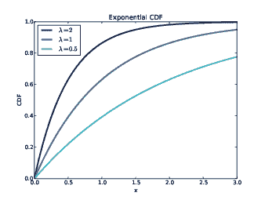
> 
> | 图 5.1：具有不同参数的指数分布的 CDF。 |
> | --- |
> 
> * * *

我将从指数分布开始，因为它相对简单。指数分布的 CDF 是

| CDF(x) = 1 − e^(−λ x)  |
| --- |

参数λ确定了分布的形状。图 5.1 显示了当λ = 0.5, 1 和 2 时的 CDF 的样子。

在现实世界中，当我们观察一系列事件并测量事件之间的时间（称为相邻时间）时，指数分布会出现。如果事件在任何时间都是等可能发生的，那么相邻时间的分布往往看起来像指数分布。

例如，我们将查看出生的相邻时间。1997 年 12 月 18 日，在澳大利亚布里斯班的一家医院，有 44 名婴儿出生。¹ 所有 44 名婴儿的出生时间都在当地报纸上报道；完整的数据集在名为`babyboom.dat`的文件中，位于`ThinkStats2`存储库中。

```py
 df = ReadBabyBoom()
    diffs = df.minutes.diff()
    cdf = thinkstats2.Cdf(diffs, label='actual')

    thinkplot.Cdf(cdf)
    thinkplot.Show(xlabel='minutes', ylabel='CDF') 
```

`ReadBabyBoom`读取数据文件，并返回一个包含`time`、`sex`、`weight_g`和`minutes`列的 DataFrame，其中`minutes`是转换为从午夜开始的分钟的出生时间。

> * * *
> 
> 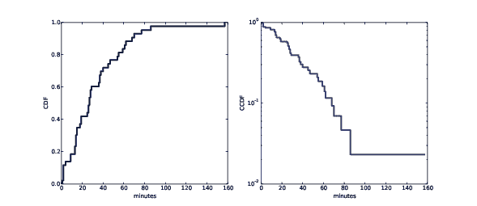
> 
> | 图 5.2：相邻时间的 CDF（左）和对数 y 轴上的 CCDF（右）。 |
> | --- |
> 
> * * *

`diffs`是连续出生时间之间的差异，`cdf`是这些相邻时间的分布。图 5.2 (左) 显示了 CDF。它似乎具有指数分布的一般形状，但我们如何判断呢？

一种方法是在对数 y 轴上绘制互补的 CDF，即 1 − CDF(x)。对于来自指数分布的数据，结果是一条直线。让我们看看为什么会这样。

如果你绘制了一个你认为是指数分布的数据集的互补 CDF（CCDF），你期望看到一个像这样的函数：

| y ≈ e^(−λ x)  |
| --- |

对两边取对数得到：

| logy ≈ −λ x |
| --- |

因此，在对数 y 轴上，CCDF 是一条斜率为−λ的直线。以下是我们如何生成这样的图：

```py
 thinkplot.Cdf(cdf, complement=True)
    thinkplot.Show(xlabel='minutes',
                   ylabel='CCDF',
                   yscale='log') 
```

使用参数`complement=True`，`thinkplot.Cdf`在绘图之前计算互补的 CDF。并且使用`yscale='log'`，`thinkplot.Show`将`y`轴设置为对数刻度。

图 5.2 (右) 显示了结果。它并不完全是直线，这表明指数分布不是这些数据的完美模型。最有可能的是，基本假设——即出生在一天中的任何时间都是等可能的——并不完全成立。尽管如此，使用指数分布模拟这个数据集可能是合理的。通过这种简化，我们可以用一个参数总结分布。

参数λ可以解释为速率；也就是说，平均每单位时间发生的事件数。在这个例子中，44 名婴儿在 24 小时内出生，因此速率是λ = 0.0306 每分钟出生。指数分布的均值是 1/λ，因此出生之间的平均时间是 32.7 分钟。

## 5.2 正态分布

正态分布，也称为高斯分布，通常被使用，因为它至少近似地描述了许多现象。事实证明，它之所以如此普遍，是有充分的理由的，我们将在第 14.4 节中讨论。

> * * *
> 
> 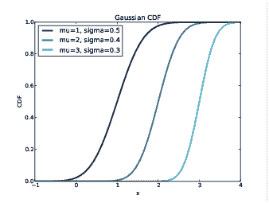
> 
> | 图 5.3：具有一系列参数的正态分布的 CDF。 |
> | --- |
> 
> * * *

正态分布由两个参数来表征：均值µ和标准差σ。当µ=0 且σ=1 时的正态分布称为标准正态分布。它的 CDF 由一个没有封闭形式解的积分定义，但有一些能够有效评估的算法。其中一个由 SciPy 提供：`scipy.stats.norm`是表示正态分布的对象；它提供一个方法`cdf`来评估标准正态分布的 CDF：

```py
>>> import scipy.stats
>>> scipy.stats.norm.cdf(0)
0.5 
```

这个结果是正确的：标准正态分布的中位数是 0（与均值相同），一半的值落在中位数以下，所以 CDF(0)是 0.5。

`norm.cdf`接受可选参数：`loc`，指定均值，和`scale`，指定标准差。

`thinkstats2`通过提供`EvalNormalCdf`函数使这个函数更容易使用，它接受参数`mu`和`sigma`并在`x`处评估 CDF：

```py
def EvalNormalCdf(x, mu=0, sigma=1):
    return scipy.stats.norm.cdf(x, loc=mu, scale=sigma) 
```

图 5.3 显示了具有一系列参数的正态分布的 CDF。这些曲线的 S 形是正态分布的一个可识别的特征。

在前一章中，我们看了 NSFG 中出生体重的分布。图 5.4 显示了所有活产婴儿体重的经验 CDF 和具有相同均值和方差的正态分布的 CDF。

> * * *
> 
> 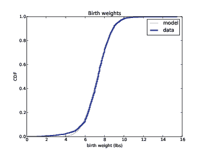
> 
> | 图 5.4：具有正态模型的出生体重的 CDF。 |
> | --- |
> 
> * * *

正态分布是这个数据集的一个很好的模型，所以如果我们用参数µ = 7.28 和σ = 1.24 来总结分布，得到的误差（模型和数据之间的差异）很小。

在第 10 个百分位以下，数据和模型之间存在差异；在正态分布中，有比我们预期更多的轻体重婴儿。如果我们特别关注早产婴儿，准确把握分布的这一部分将是很重要的，因此使用正态模型可能不合适。

## 5.3 正态概率图

对于指数分布和其他一些分布，我们可以使用简单的转换来测试解析分布是否是数据集的一个好模型。

对于正态分布，没有这样的转换，但有一种叫做正态概率图的替代方法。生成正态概率图有两种方法：困难的方法和简单的方法。如果你对困难的方法感兴趣，可以在[`en.wikipedia.org/wiki/Normal_probability_plot`](https://en.wikipedia.org/wiki/Normal_probability_plot)上阅读相关内容。以下是简单的方法：

1.  对样本中的值进行排序。

1.  从标准正态分布（µ=0 且σ=1）中生成一个与样本大小相同的随机样本，并对其进行排序。

1.  绘制样本中排序后的值与随机值的图。

如果样本的分布近似正态，结果将是一条具有截距`mu`和斜率`sigma`的直线。`thinkstats2`提供了`NormalProbability`，它接受一个样本并返回两个 NumPy 数组：

```py
xs, ys = thinkstats2.NormalProbability(sample) 
```

> * * *
> 
> 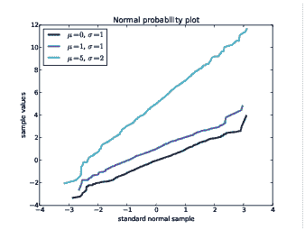
> 
> | 图 5.5：来自正态分布的随机样本的正态概率图。 |
> | --- |
> 
> * * *

`ys`包含了从`sample`中排序后的值；`xs`包含了来自标准正态分布的随机值。

为了测试`NormalProbability`，我生成了一些假样本，实际上是从具有不同参数的正态分布中抽取的。图 5.5 显示了结果。这些线大致是直的，尾部的值偏离程度比接近均值的值更大。

现在让我们用真实数据来试试。下面是用于生成前一节中出生体重数据的正态概率图的代码。它绘制了代表模型的灰线和代表数据的蓝线。

```py
def MakeNormalPlot(weights):
    mean = weights.mean()
    std = weights.std()

    xs = [-4, 4]
    fxs, fys = thinkstats2.FitLine(xs, inter=mean, slope=std)
    thinkplot.Plot(fxs, fys, color='gray', label='model')

    xs, ys = thinkstats2.NormalProbability(weights)
    thinkplot.Plot(xs, ys, label='birth weights') 
```

`weights`是一个 pandas Series 的出生体重；`mean`和`std`分别是均值和标准差。

`FitLine`接受一系列`xs`、一个截距和一个斜率；它返回`fxs`和`fys`，表示具有给定参数的线，在`xs`的值处进行评估。

`NormalProbability`返回包含标准正态分布值和`weights`值的`xs`和`ys`。如果体重的分布是正态的，数据应该与模型匹配。

> * * *
> 
> 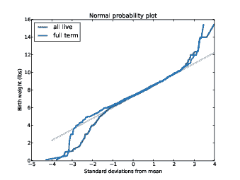
> 
> | 图 5.6：出生体重的正态概率图。 |
> | --- |
> 
> * * *

图 5.6 显示了所有活产儿和足月产儿（怀孕超过 36 周）的结果。两条曲线在均值附近与模型匹配，并在尾部偏离。最重的婴儿比模型预期的更重，最轻的婴儿更轻。

当我们只选择足月出生时，我们排除了一些最轻的体重，这减少了分布的尾部差异。

这个图表表明，正态模型在距离均值几个标准差的范围内很好地描述了分布，但在尾部不太好。它是否足够好用于实际目的取决于目的。

## 5.4 对数正态分布

如果一组值的对数具有正态分布，那么这些值就具有对数正态分布。对数正态分布的 CDF 与正态分布的 CDF 相同，只是用 logx 代替 x。

| CDFlognormal = CDFnormal |
| --- |

对数正态分布的参数通常用µ和σ表示。但要记住，这些参数*不是*均值和标准差；对数正态分布的均值是 exp(µ +σ²/2)，标准差很复杂（参见[`wikipedia.org/wiki/Log-normal_distribution`](http://wikipedia.org/wiki/Log-normal_distribution)）。

> * * *
> 
> 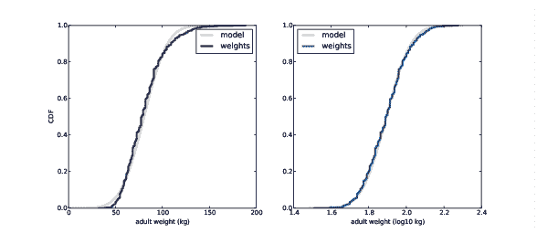
> 
> | 图 5.7：成年体重的 CDF（左）；对数成年体重的 CDF（右）。 |
> | --- |
> 
> * * *

如果一个样本大致是对数正态的，并且你绘制其对数的 CDF，结果将具有正态分布的特征形状。为了测试样本与对数正态模型的匹配程度，可以使用样本中值的对数制作正态概率图。

举个例子，让我们看一下成年人体重的分布，它大致是对数正态的。

国家慢性疾病预防和健康促进中心作为行为风险因素监测系统（BRFSS）的一部分，进行了一项年度调查。在 2008 年，他们采访了 414,509 名受访者，并询问了他们的人口统计信息、健康状况和健康风险。他们收集的数据包括 398,484 名受访者的体重（以千克为单位）。

本书的存储库包含`CDBRFS08.ASC.gz`，这是一个固定宽度的 ASCII 文件，包含了 BRFSS 的数据，以及`brfss.py`，它可以读取文件并分析数据。

> * * *
> 
> 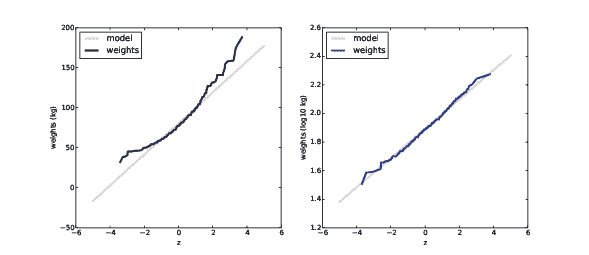
> 
> | 图 5.8：成年体重的正态概率图（左）和对数比例尺（右）。 |
> | --- |
> 
> * * *

图 5.7（左）显示了成年人体重的分布，采用线性比例和正态模型。图 5.7（右）显示了相同的分布，采用对数比例和对数正态模型。对数正态模型更匹配，但这种数据的表示并没有特别引人注目的差异。

图 5.8 显示了成年人体重 w 的正态概率图，以及它们的对数 log[10] w。现在显然数据与正态模型有很大偏差。另一方面，对数正态模型与数据很匹配。

## 5.5  帕累托分布

帕累托分布是以经济学家维尔弗雷多·帕累托命名的，他用它来描述财富的分布（参见[`wikipedia.org/wiki/Pareto_distribution`](http://wikipedia.org/wiki/Pareto_distribution)）。从那时起，它已被用来描述自然和社会科学中的现象，包括城市和城镇的规模，沙粒和陨石，森林火灾和地震。

帕累托分布的 CDF 是：

| CDF(x) = 1 −  | ⎛ ⎜

⎜

⎝ |

| x |

|  |

| x[m] |

|   | ⎞ ⎟

⎟

⎠ |

| −α |

|    |

|   |

|   |
| --- |

参数 x[m]和α确定了分布的位置和形状。x[m]是可能的最小值。图 5.9 显示了带有 x[m] = 0.5 和不同α值的帕累托分布的 CDF。

> * * *
> 
> 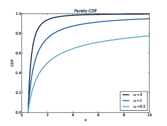
> 
> | 图 5.9：带有不同参数的帕累托分布的 CDF。 |
> | --- |
> 
> * * *

有一个简单的视觉测试可以表明经验分布是否符合帕累托分布：在对数-对数比例上，CCDF 看起来像一条直线。让我们看看为什么会这样。

如果你在线性比例上绘制帕累托分布的样本的 CCDF，你会期望看到一个像这样的函数：

| y ≈  | ⎛ ⎜

⎜

⎝ |

| x |

|  |

| x[m] |

|   | ⎞ ⎟

⎟

⎠ |

| −α |

|    |

|   |

|   |
| --- |

对两边取对数得到：

| logy ≈ −α (logx − logx[m]) |
| --- |

因此，如果你绘制 logy 与 logx，它应该看起来像一条斜率为−α，截距为α logx[m]的直线。

举个例子，让我们看看城市和城镇的规模。美国人口普查局发布了美国每个市和镇的人口。

> * * *
> 
> 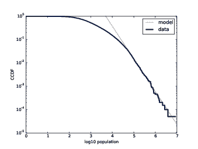
> 
> | 图 5.10：城市和城镇人口的 CCDF，采用对数-对数比例。 |
> | --- |
> 
> * * *

我从[`www.census.gov/popest/data/cities/totals/2012/SUB-EST2012-3.html`](http://www.census.gov/popest/data/cities/totals/2012/SUB-EST2012-3.html)下载了他们的数据；它在这本书的存储库中，文件名为`PEP_2012_PEPANNRES_with_ann.csv`。存储库还包含`populations.py`，它读取文件并绘制人口分布。

图 5.10 显示了城市和城镇人口的 CCDF，采用对数-对数比例。最大的 1%的城市和城镇，在 10^(−2)以下，沿着一条直线分布。因此，我们可以得出结论，正如一些研究人员所做的那样，这个分布的尾部符合帕累托模型。

另一方面，对数正态分布也很好地模拟了数据。图 5.11 显示了人口的 CDF 和对数正态模型（左），以及正态概率图（右）。两个图表都显示了数据和模型之间的良好一致性。

两种模型都不完美。帕累托模型只适用于最大的 1%的城市，但它更适合于分布的这一部分。对数正态模型更适合于其他 99%。哪种模型适用取决于分布的哪一部分是相关的。

> * * *
> 
> 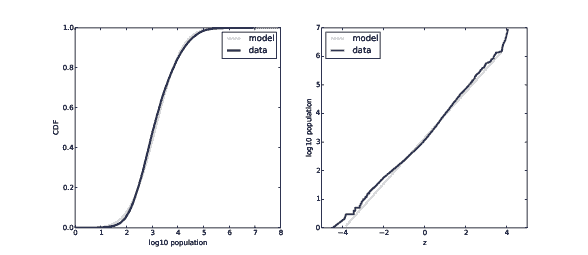
> 
> | 图 5.11：城市和城镇人口的对数-对数比例的 CDF（左），以及对数转换后人口的正态概率图（右）。 |
> | --- |
> 
> * * *

## 5.6  生成随机数

分析 CDF 可以用来生成具有给定分布函数的随机数，p = CDF(x)。如果有一种有效的方法来计算逆 CDF，我们可以通过从 0 到 1 之间的均匀分布中选择 p，然后选择 x = ICDF(p)来生成具有适当分布的随机值。

例如，指数分布的 CDF 是

| p = 1 − e^(−λ x) |
| --- |

求解 x 得到：

| x = −log(1 − p) / λ |
| --- |

因此，在 Python 中我们可以写成

```py
def expovariate(lam):
    p = random.random()
    x = -math.log(1-p) / lam
    return x 
```

`expovariate`接受`lam`并返回从参数为`lam`的指数分布中选择的随机值。

关于这个实现有两点需要注意：我将参数称为`lam`，因为`lambda`是 Python 的关键字。另外，由于 log0 是未定义的，我们必须小心一点。`random.random`的实现可以返回 0 但不返回 1，所以 1 − p 可以是 1 但不是 0，所以`log(1-p)`总是被定义的。

## 5.7 为什么建模？

在本章的开头，我说许多真实世界的现象可以用分析分布来建模。“那么，”你可能会问，“是什么？”

像所有模型一样，分析分布是一种抽象，这意味着它们省略了被认为是不相关的细节。例如，观察到的分布可能存在测量误差或特定于样本的怪癖；分析模型消除了这些特殊性。

分析模型也是一种数据压缩形式。当一个模型很好地适合数据集时，一小组参数可以总结大量数据。

有时候，当自然现象的数据符合分析分布时，会让人感到惊讶，但这些观察可以揭示物理系统的内在规律。有时我们可以解释为什么观察到的分布具有特定的形式。例如，帕累托分布经常是具有正反馈的生成过程的结果（即所谓的优先附着过程：参见[`wikipedia.org/wiki/Preferential_attachment`](http://wikipedia.org/wiki/Preferential_attachment)）。

此外，分析分布适合进行数学分析，正如我们将在第十四章中看到的那样。

但重要的是要记住，所有模型都是不完美的。真实世界的数据从来不完全符合分析分布。人们有时会说数据是由模型生成的；例如，他们可能会说人类身高的分布是正态的，或者收入的分布是对数正态的。从字面上讲，这些说法是不正确的；真实世界和数学模型之间总是存在差异。

如果模型捕捉了真实世界的相关方面并且省略了不需要的细节，那么模型就是有用的。但“相关”或“不需要”取决于你打算使用模型的用途。

## 5.8 练习

对于以下练习，你可以从`chap05ex.ipynb`开始。我的解决方案在`chap05soln.ipynb`中。

练习 1 *在 BRFSS（参见第 5.4 节），身高的分布大致上是具有参数* µ = 178 *cm 和* σ = 7.7 *cm 的男性正态分布，以及* µ = 163 *cm 和* σ = 7.3 *cm 的女性正态分布。*

*为了加入蓝人组，你必须是男性，身高在 5'10"到 6'1"之间（参见* [*http://bluemancasting.com*](http://bluemancasting.com)*）。美国男性人口中有多少百分比在这个范围内？提示：使用`scipy.stats.norm.cdf`。*

练习 2 *为了了解帕累托分布，让我们看看如果人类身高的分布是帕累托分布，世界会有多大不同。使用参数* x[m] = 1 *m 和* α = 1.7*，我们得到一个具有合理最小值 1 米和中位数 1.5 米的分布。*

*绘制这个分布。在帕累托世界中，人类的平均身高是多少？人口中有多少比平均身高矮？如果帕累托世界有 70 亿人口，我们预计有多少人的身高会超过 1 公里？我们预计最高的人的身高会是多少？*

练习 3

*威布尔分布是指数分布在失效分析中的一种推广（参见* [*http://wikipedia.org/wiki/Weibull_distribution*](http://wikipedia.org/wiki/Weibull_distribution)*）。它的 CDF 是*

| CDF(x) = 1 − e^(- (x / λ)^k) |
| --- |

*你能找到一个转换，使威布尔分布看起来像一条直线吗？这条直线的斜率和截距表示什么？*

*使用`random.weibullvariate`生成一个来自威布尔分布的样本，并用它来测试你的转换。*

练习 4 *对于较小的 n 值，我们不希望经验分布完全符合分析分布。评估拟合质量的一种方法是从分析分布中生成一个样本，然后看它与数据的匹配程度。*

*例如，在第 5.1 节中，我们绘制了出生之间的时间分布，并看到它大约是指数分布。但是这个分布只基于 44 个数据点。要查看数据是否可能来自指数分布，请生成 44 个值，这些值来自具有与数据相同均值的指数分布，大约是 33 分钟之间的出生。*

*绘制随机值的分布并将其与实际分布进行比较。你可以使用`random.expovariate`生成这些值。*

练习 5 *在这本书的存储库中，你会找到一组名为`mystery0.dat`、`mystery1.dat`等的数据文件。每个文件包含从分析分布生成的一系列随机数。*

*你还会找到`test_models.py`，一个从文件中读取数据并在各种转换下绘制 CDF 的脚本。你可以这样运行它：*

```py
*$ python test_models.py mystery0.dat* 
```

*根据这些图，你应该能够推断出每个文件生成了什么样的分布。如果你被难住了，你可以查看`mystery.py`，其中包含生成文件的代码。*

练习 6

*财富和收入的分布有时使用对数正态分布和帕累托分布进行建模。要查看哪个更好，让我们看一些数据。*

*当前人口调查（CPS）是劳工统计局和人口普查局为研究收入和相关变量而进行的联合努力。2013 年收集的数据可以从* [*http://www.census.gov/hhes/www/cpstables/032013/hhinc/toc.htm*](http://www.census.gov/hhes/www/cpstables/032013/hhinc/toc.htm)*获取。我下载了`hinc06.xls`，这是一个包含有关家庭收入信息的 Excel 电子表格，并将其转换为`hinc06.csv`，这是本书存储库中的一个 CSV 文件。你还会找到`hinc.py`，它读取这个文件。*

*从这个数据集中提取收入分布。本章中的任何分析分布是否是数据的良好模型？这个练习的解决方案在`hinc_soln.py`中。*

## 5.9 术语表

+   经验分布：样本中的值的分布。

+   分析分布：其 CDF 是一个解析函数的分布。

+   模型：一个有用的简化。分析分布通常是更复杂的经验分布的良好模型。

+   相邻时间：两个事件之间经过的时间。

+   补充 CDF：一个将值 x 映射到超过 x 的值的分数的函数，即 1 − CDF(x)。

+   标准正态分布：均值为 0，标准差为 1 的正态分布。

+   正态概率图：样本中的值与标准正态分布的随机值的图。

* * *

1

这个例子基于 Dunn 的信息和数据，“用于演示常见分布的简单数据集”，统计教育杂志 v.7，n.3（1999）。

2

我是通过[`mathworld.wolfram.com/LogNormalDistribution.html`](http://mathworld.wolfram.com/LogNormalDistribution.html)上的一条评论（没有引用）得知了这种可能性。随后，我找到了一篇提出对数变换并提出原因的论文：Penman and Johnson, “The Changing Shape of the Body Mass Index Distribution Curve in the Population,” Preventing Chronic Disease, 2006 July; 3(3): A74。在线链接：[`www.ncbi.nlm.nih.gov/pmc/articles/PMC1636707`](http://www.ncbi.nlm.nih.gov/pmc/articles/PMC1636707)。

3

疾病控制和预防中心（CDC）。行为风险因素监测系统调查数据。乔治亚州亚特兰大：美国卫生和公众服务部，疾病控制和预防中心，2008 年。
