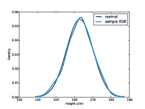
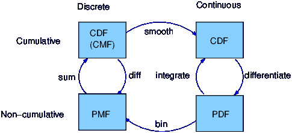
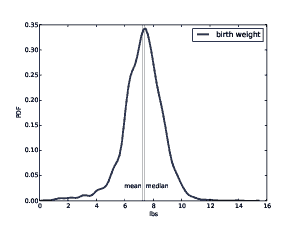
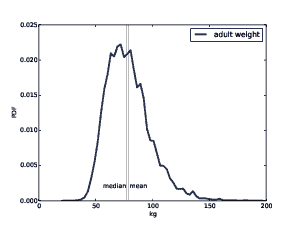

# 第六章：概率密度函数

> 原文：[`greenteapress.com/thinkstats2/html/thinkstats2007.html`](https://greenteapress.com/thinkstats2/html/thinkstats2007.html)
> 
> 译者：[飞龙](https://github.com/wizardforcel)
> 
> 协议：[CC BY-NC-SA 4.0](http://creativecommons.org/licenses/by-nc-sa/4.0/)


本章的代码在`density.py`中。有关下载和使用此代码的信息，请参见第 0.2 节。

## 6.1 PDFs

CDF 的导数称为概率密度函数，或 PDF。例如，指数分布的 PDF 是

```py
PDFexpo = λ e^(−λ x)   
```

正态分布的概率密度函数是

```py
PDFnormal = 
```

&#124; 1 &#124;

&#124;  &#124;

&#124;

&#124; σ  &#124; √ &#124;

&#124;  &#124;

&#124; 2 π &#124;

&#124;

&#124;

| exp | ⎡ ⎢

⎢

⎢

⎢

⎢

⎣ | − |

&#124; 1 &#124;

&#124;  &#124;

&#124; 2 &#124;

|  | ⎛ ⎜

⎜

⎝ |

&#124; x − µ &#124;

&#124;  &#124;

&#124; σ &#124;

|   | ⎞ ⎟

⎟

⎠ |

&#124; 2 &#124;

&#124;    &#124;

&#124;   &#124;

|   | ⎤ ⎥

⎥

⎥

⎥

⎥

⎦ |

通常对特定值 x 的 PDF 进行评估通常是没有用的。结果不是概率；它是概率*密度*。

在物理学中，密度是单位体积的质量；为了得到质量，你必须乘以体积，或者如果密度不是恒定的，你必须对体积进行积分。

类似地，概率密度测量 x 的单位概率。为了得到概率质量，你必须对 x 进行积分。

`thinkstats2`提供了一个名为 Pdf 的类，表示概率密度函数。每个 Pdf 对象都提供以下方法：

+   `Density`，它接受一个值`x`，并返回分布在`x`处的密度。

+   `Render`，它在一组离散值上评估密度，并返回一对序列：排序后的值`xs`和它们的概率密度`ds`。

+   `MakePmf`，它在一组离散值上评估`Density`，并返回一个近似于 Pdf 的归一化 Pmf。

+   `GetLinspace`返回`Render`和`MakePmf`使用的默认点集。

Pdf 是一个抽象的父类，这意味着你不应该实例化它；也就是说，你不能创建一个 Pdf 对象。相反，你应该定义一个从 Pdf 继承并提供`Density`和`GetLinspace`定义的子类。Pdf 提供`Render`和`MakePmf`。

例如，`thinkstats2`提供了一个名为`NormalPdf`的类，用于评估正态密度函数。

```py
class NormalPdf(Pdf):

    def __init__(self, mu=0, sigma=1, label=''):
        self.mu = mu
        self.sigma = sigma
        self.label = label

    def Density(self, xs):
        return scipy.stats.norm.pdf(xs, self.mu, self.sigma)

    def GetLinspace(self):
        low, high = self.mu-3*self.sigma, self.mu+3*self.sigma
        return np.linspace(low, high, 101) 
```

NormalPdf 对象包含参数`mu`和`sigma`。`Density`使用`scipy.stats.norm`，它是一个表示正态分布并提供`cdf`和`pdf`等方法的对象（参见第 5.2 节）。

以下示例使用 BRFSS（参见第 5.4 节）中成年女性身高的平均值和方差（以厘米为单位）创建一个 NormalPdf。然后它计算分布在距离平均值一个标准差的位置的密度。

```py
>>> mean, var = 163, 52.8
>>> std = math.sqrt(var)
>>> pdf = thinkstats2.NormalPdf(mean, std)
>>> pdf.Density(mean + std)
0.0333001 
```

结果约为 0.03，以概率质量每厘米为单位。再次强调，概率密度本身并没有太多意义。但如果我们绘制 Pdf，我们可以看到分布的形状：

```py
>>> thinkplot.Pdf(pdf, label='normal')
>>> thinkplot.Show() 
```

`thinkplot.Pdf`将 Pdf 绘制为平滑函数，与`thinkplot.Pmf`相反，后者将 Pmf 渲染为阶梯函数。图 6.1 显示了结果，以及从样本估计的 PDF，我们将在下一节中计算。

你可以使用`MakePmf`来近似 Pdf：

```py
>>> pmf = pdf.MakePmf() 
```

默认情况下，生成的 Pmf 包含从`mu - 3*sigma`到`mu + 3*sigma`等距的 101 个点。可选地，`MakePmf`和`Render`可以接受关键字参数`low`、`high`和`n`。

> * * *
> 
> 
> 
> | 图 6.1：美国成年女性身高的正态概率密度函数，以及 n=500 的样本的核密度估计。 |
> | --- |
> 
> * * *

## 6.2 核密度估计

核密度估计（KDE）是一种算法，它接受一个样本，并找到一个适当平滑的 PDF 来适应数据。你可以在[`en.wikipedia.org/wiki/Kernel_density_estimation`](http://en.wikipedia.org/wiki/Kernel_density_estimation)上阅读详细信息。

`scipy`提供了 KDE 的实现，`thinkstats2`提供了一个名为`EstimatedPdf`的类来使用它：

```py
class EstimatedPdf(Pdf):

    def __init__(self, sample):
        self.kde = scipy.stats.gaussian_kde(sample)

    def Density(self, xs):
        return self.kde.evaluate(xs) 
```

`__init__`接受一个样本并计算核密度估计。结果是一个提供`evaluate`方法的`gaussian_kde`对象。

`Density`接受一个值或序列，调用`gaussian_kde.evaluate`，并返回结果密度。名称中出现“高斯”一词是因为它使用基于高斯分布的滤波器来平滑 KDE。

这是一个示例，它从正态分布生成一个样本，然后制作一个 EstimatedPdf 来适应它：

```py
>>> sample = [random.gauss(mean, std) for i in range(500)]
>>> sample_pdf = thinkstats2.EstimatedPdf(sample)
>>> thinkplot.Pdf(sample_pdf, label='sample KDE') 
```

`sample`是一个包含 500 个随机身高的列表。`sample_pdf`是一个包含样本的估计 KDE 的 Pdf 对象。

图 6.1 显示了正态密度函数和基于 500 个随机身高样本的 KDE。估计结果与原始分布非常匹配。

使用 KDE 估计密度函数对于几个目的都是有用的。

+   可视化：在项目的探索阶段，CDF 通常是分布的最佳可视化方式。查看 CDF 后，您可以决定估计的 PDF 是否是分布的适当模型。如果是，它可以成为向不熟悉 CDF 的观众呈现分布的更好选择。

+   插值：估计的 PDF 是从样本到人口模型的一种方法。如果您有理由相信人口分布是平滑的，可以使用 KDE 来插值未出现在样本中的值的密度。

+   模拟：模拟通常基于样本的分布。如果样本量较小，可能适合使用 KDE 平滑样本分布，这样可以使模拟探索更多可能的结果，而不是复制观察到的数据。

## 6.3 分布框架

> * * *
> 
> 
> 
> | 图 6.2：关于分布函数表示的框架。 |
> | --- |
> 
> * * *

到目前为止，我们已经看到了 PMF、CDF 和 PDF；让我们花一分钟来回顾一下。图 6.2 显示了这些函数之间的关系。

我们从 PMF 开始，它代表了一组离散值的概率。要从 PMF 到 CDF，您需要将概率质量相加以获得累积概率。要从 CDF 返回到 PMF，您需要计算累积概率的差异。我们将在接下来的几节中看到这些操作的实现。

PDF 是连续 CDF 的导数；或者等价地，CDF 是 PDF 的积分。请记住，PDF 从值映射到概率密度；要获得概率，您必须进行积分。

要从离散到连续分布，可以进行各种形式的平滑。一种平滑的形式是假设数据来自解析连续分布（如指数分布或正态分布），并估计该分布的参数。另一个选项是核密度估计。

平滑的相反是离散化或量化。如果在离散点上评估 PDF，可以生成一个 PDF 的近似 PMF。您可以使用数值积分获得更好的近似。

为了区分连续和离散的 CDF，离散的 CDF 最好是“累积质量函数”，但据我所知，没有人使用这个术语。

## 6.4 Hist 实现

到目前为止，您应该知道如何使用`thinkstats2`提供的基本类型：Hist、Pmf、Cdf 和 Pdf。接下来的几节将提供有关它们如何实现的详细信息。这些材料可能有助于您更有效地使用这些类，但并非绝对必要。

Hist 和 Pmf 继承自一个名为`_DictWrapper`的父类。前导下划线表示这个类是“内部的”；也就是说，它不应该被其他模块中的代码使用。名称表明它是什么：一个字典包装器。它的主要属性是`d`，这个字典将值映射到它们的频率。

值可以是任何可散列类型。频率应该是整数，但可以是任何数值类型。

`_DictWrapper`包含适用于 Hist 和 Pmf 的方法，包括`__init__`、`Values`、`Items`和`Render`。它还提供修改器方法`Set`、`Incr`、`Mult`和`Remove`。这些方法都是用字典操作实现的。例如：

```py
# class _DictWrapper

    def Incr(self, x, term=1):
        self.d[x] = self.d.get(x, 0) + term

    def Mult(self, x, factor):
        self.d[x] = self.d.get(x, 0) * factor

    def Remove(self, x):
        del self.d[x] 
```

Hist 还提供了`Freq`，它查找给定值的频率。

因为 Hist 的运算符和方法都是基于字典的，所以这些方法的运行时间是恒定的；也就是说，随着 Hist 的增大，它们的运行时间不会增加。

## 6.5 Pmf 实现

Pmf 和 Hist 几乎是一样的，只是 Pmf 将值映射到浮点概率，而不是整数频率。如果概率之和为 1，Pmf 就被归一化了。

Pmf 提供了`Normalize`，它计算概率的总和并通过一个因子进行除法：

```py
# class Pmf

    def Normalize(self, fraction=1.0):
        total = self.Total()
        if total == 0.0:
            raise ValueError('Total probability is zero.')

        factor = float(fraction) / total
        for x in self.d:
            self.d[x] *= factor

        return total 
```

`fraction`确定归一化后的概率之和；默认值为 1。如果总概率为 0，Pmf 无法归一化，因此`Normalize`会引发`ValueError`。

Hist 和 Pmf 有相同的构造函数。它可以接受一个`dict`、Hist、Pmf 或 Cdf、pandas Series、一个(value, frequency)对的列表或一个值序列作为参数。

如果你实例化一个 Pmf，结果是归一化的。如果你实例化一个 Hist，它就不是。要构建一个未归一化的 Pmf，你可以创建一个空的 Pmf 并修改它。Pmf 修改器不会重新归一化 Pmf。

## 6.6 Cdf 实现

CDF 将值映射到累积概率，所以我可以将 CDF 实现为`_DictWrapper`。但是 CDF 中的值是有序的，而`_DictWrapper`中的值不是。此外，计算逆 CDF 通常是有用的；也就是说，从累积概率到值的映射。所以我选择的实现是两个排序列表。这样我就可以使用二分查找以对数时间进行正向或逆向查找。

Cdf 构造函数可以接受一个值序列或 pandas Series、一个将值映射到概率的字典、一对(value, probability)序列、Hist、Pmf 或 Cdf 作为参数。或者如果给定两个参数，它会将它们视为排序后的值序列和相应的累积概率序列。

给定一个序列、pandas Series 或字典，构造函数会生成一个 Hist。然后它使用 Hist 来初始化属性：

```py
 self.xs, freqs = zip(*sorted(dw.Items()))
        self.ps = np.cumsum(freqs, dtype=np.float)
        self.ps /= self.ps[-1] 
```

`xs`是值的排序列表；`freqs`是相应频率的列表。`np.cumsum`计算频率的累积和。通过总频率除以得到累积概率。对于`n`个值，构造 Cdf 的时间与`n logn`成正比。

这是`Prob`的实现，它接受一个值并返回其累积概率：

```py
# class Cdf
    def Prob(self, x):
        if x < self.xs[0]:
            return 0.0
        index = bisect.bisect(self.xs, x)
        p = self.ps[index - 1]
        return p 
```

`bisect`模块提供了二分查找的实现。这里是`Value`的实现，它接受累积概率并返回相应的值：

```py
# class Cdf
    def Value(self, p):
        if p < 0 or p > 1:
            raise ValueError('p must be in range [0, 1]')

        index = bisect.bisect_left(self.ps, p)
        return self.xs[index] 
```

给定一个 Cdf，我们可以通过计算连续累积概率之间的差异来计算 Pmf。如果你调用 Cdf 构造函数并传递一个 Pmf，它会通过调用`Cdf.Items`来计算差异：

```py
# class Cdf
    def Items(self):
        a = self.ps
        b = np.roll(a, 1)
        b[0] = 0
        return zip(self.xs, a-b) 
```

`np.roll`将`a`的元素向右移动，并将最后一个“滚动”回到开头。我们用 0 替换`b`的第一个元素，然后计算差异`a-b`。结果是一个概率的 NumPy 数组。

Cdf 提供了`Shift`和`Scale`，它们修改了 Cdf 中的值，但概率应该被视为不可变的。

## 6.7 Moments

每当你对样本进行抽样并将其减少到一个数字时，那个数字就是一个统计量。到目前为止我们看到的统计量包括均值、方差、中位数和四分位距。

原始矩是一种统计量。如果你有一组值 x[i]的样本，第 k 个原始矩是：

```py
m′[k] = 
```

&#124; 1 &#124;

&#124;  &#124;

&#124; n &#124;

```py
 
```

&#124;   &#124;

&#124; ∑ &#124;

&#124; i &#124;

```py
 x[i]^k 
```

或者如果你更喜欢 Python 的表示法：

```py
def RawMoment(xs, k):
    return sum(x**k for x in xs) / len(xs) 
```

当 k=1 时，结果是样本均值 x。其他原始矩本身意义不大，但它们在一些计算中使用。

中心矩更有用。第 k 个中心矩是：

```py
m[k] = 
```

&#124; 1 &#124;

&#124;  &#124;

&#124; n &#124;

```py
 
```

&#124;   &#124;

&#124; ∑ &#124;

&#124; i &#124;

```py
 (x[i] − x)^k 
```

或者在 Python 中：

```py
def CentralMoment(xs, k):
    mean = RawMoment(xs, 1)
    return sum((x - mean)**k for x in xs) / len(xs) 
```

当 k=2 时，结果是第二个中心矩，你可能会认出它是方差。方差的定义暗示了为什么这些统计量被称为矩。如果我们在每个位置 x[i]处沿着标尺附加一个重量，然后围绕均值旋转标尺，旋转重量的惯性矩是值的方差。如果你不熟悉惯性矩，请参见[`en.wikipedia.org/wiki/Moment_of_inertia`](http://en.wikipedia.org/wiki/Moment_of_inertia)。

当你报告基于矩的统计量时，重要的是要考虑单位。例如，如果值 x[i]是以厘米为单位的，第一个原始矩也是以厘米为单位的。但第二个矩是以平方厘米为单位，第三个矩是以立方厘米为单位，依此类推。

由于这些单位，矩本身很难解释。这就是为什么对于第二矩，通常报告标准差，它是方差的平方根，因此与 x[i]具有相同的单位。

## 6.8  偏度

偏度是描述分布形状的属性。如果分布围绕其中心趋势对称，它是无偏的。如果值向右延伸得更远，它是“右偏”，如果值向左延伸，它是“左偏”。

“偏斜”的使用并不具有“偏倚”的通常含义。偏度只描述分布的形状；它对抽样过程是否可能存在偏倚没有任何说明。

通常使用几种统计量来量化分布的偏度。给定一系列值 x[i]，可以这样计算样本偏度 g[1]：

```py
def StandardizedMoment(xs, k):
    var = CentralMoment(xs, 2)
    std = math.sqrt(var)
    return CentralMoment(xs, k) / std**k

def Skewness(xs):
    return StandardizedMoment(xs, 3) 
```

g[1]是第三个标准化矩，这意味着它已经被归一化，因此没有单位。

负偏度表示分布向左偏斜；正偏度表示分布向右偏斜。g[1]的大小表示偏度的强度，但单独来看很难解释。

在实践中，通常计算样本偏度并不是一个好主意。如果有任何异常值，它们对 g[1]的影响就会不成比例。

评估分布的不对称性的另一种方法是看均值和中位数之间的关系。极端值对均值的影响比对中位数的影响更大，因此在左偏的分布中，均值小于中位数。在右偏的分布中，均值大于中位数。

皮尔逊中位数偏度系数是基于样本均值和中位数之间的差异而衡量偏度的指标：

```py
g[p] = 3 (x − m) / S 
```

其中 x 是样本均值，m 是中位数，S 是标准差。或者在 Python 中：

```py
def Median(xs):
    cdf = thinkstats2.Cdf(xs)
    return cdf.Value(0.5)

def PearsonMedianSkewness(xs):
    median = Median(xs)
    mean = RawMoment(xs, 1)
    var = CentralMoment(xs, 2)
    std = math.sqrt(var)
    gp = 3 * (mean - median) / std
    return gp 
```

这个统计量是健壮的，这意味着它对异常值的影响较小。

> * * *
> 
> 
> 
> | 图 6.3：NSFG 出生体重数据的估计概率密度函数。 |
> | --- |
> 
> * * *

举个例子，让我们看一下 NSFG 怀孕数据中出生体重的偏度。以下是估计和绘制概率密度函数的代码：

```py
 live, firsts, others = first.MakeFrames()
    data = live.totalwgt_lb.dropna()
    pdf = thinkstats2.EstimatedPdf(data)
    thinkplot.Pdf(pdf, label='birth weight') 
```

图 6.3 显示了结果。左尾部似乎比右侧更长，因此我们怀疑分布是左偏的。平均值为 7.27 磅，略低于中位数 7.38 磅，因此与左偏一致。而且两个偏度系数都是负的：样本偏度为-0.59；皮尔逊中位数偏度为-0.23。

> * * *
> 
> 
> 
> | 图 6.4：来自 BRFSS 的成年人体重数据的估计 PDF。 |
> | --- |
> 
> * * *

现在让我们将这个分布与 BRFSS 中成年人体重的分布进行比较。同样，这是代码：

```py
 df = brfss.ReadBrfss(nrows=None)
    data = df.wtkg2.dropna()
    pdf = thinkstats2.EstimatedPdf(data)
    thinkplot.Pdf(pdf, label='adult weight') 
```

图 6.4 显示了结果。分布呈右偏态。确实，平均值为 79.0，大于中位数 77.3。样本偏度为 1.1，皮尔逊中位数偏度为 0.26。

偏度系数的符号指示分布是左偏还是右偏，但除此之外，它们很难解释。样本偏度不够健壮；也就是说，它更容易受到异常值的影响。因此，在应用于偏斜分布时，它的可靠性较低，而这正是它最相关的时候。

皮尔逊中位数偏度是基于计算的均值和方差，因此它也容易受到异常值的影响，但由于它不依赖于第三阶矩，所以它稍微更健壮。

## 6.9  练习

此练习的解决方案在`chap06soln.py`中。

练习 1

*收入分布被认为是右偏的。在这个练习中，我们将衡量这种偏斜有多强。*

*Current Population Survey (CPS)是劳工统计局和人口普查局共同研究收入和相关变量的努力。2013 年收集的数据可从[*http://www.census.gov/hhes/www/cpstables/032013/hhinc/toc.htm*](http://www.census.gov/hhes/www/cpstables/032013/hhinc/toc.htm)*获取。我下载了`hinc06.xls`，这是一个包含有关家庭收入信息的 Excel 电子表格，并将其转换为`hinc06.csv`，这是本书的存储库中可以找到的 CSV 文件。您还会找到`hinc2.py`，它读取此文件并转换数据。*

*数据集以一系列收入范围和每个范围内的受访者数量的形式存在。最低范围包括报告年度家庭收入“低于 5000 美元”的受访者。最高范围包括报告“25 万美元或更多”的受访者。*

*要从这些数据中估算均值和其他统计数据，我们必须对下限和上限以及每个范围内的值分布做一些假设。`hinc2.py`提供了`InterpolateSample`，它展示了对这些数据建模的一种方法。它接受一个包含每个范围的上限的列`income`和包含每个范围内受访者数量的`freq`的 DataFrame。*

*它还需要`log_upper`，这是假定的最高范围的上限，以`log10`美元表示。默认值`log_upper=6.0`表示受访者中最大收入为 10⁶美元，即一百万美元的假设。*

*`InterpolateSample`生成一个伪样本；也就是说，一个家庭收入样本，使得每个范围内的受访者数量与实际数据相同。它假设每个范围内的收入在 log10 比例上是等间距的。*

*计算结果样本的中位数、均值、偏度和皮尔逊偏度。报告收入低于均值的家庭比例是多少？结果如何取决于假定的上限？*

## 6.10  术语表

+   概率密度函数（PDF）：连续 CDF 的导数，将值映射到其概率密度的函数。

+   概率密度：一种可以在一定范围内积分以得出概率的数量。例如，如果值以厘米为单位，概率密度就以每厘米的概率单位为单位。

+   核密度估计（KDE）：一种基于样本估计 PDF 的算法。

+   离散化：用离散函数近似连续函数或分布。与平滑相反。

+   原始矩：基于数据求和的统计量，其次方。

+   中心矩：基于与均值的偏差的统计量，其次方。

+   标准化矩：没有单位的矩的比率。

+   偏度：衡量分布的不对称程度的指标。

+   样本偏度：基于矩的统计量，旨在量化分布的偏度。

+   皮尔逊中位数偏度系数：一种旨在基于中位数、均值和标准差量化分布偏度的统计量。

+   健壮：如果统计量相对不受异常值影响，则称其为健壮。
