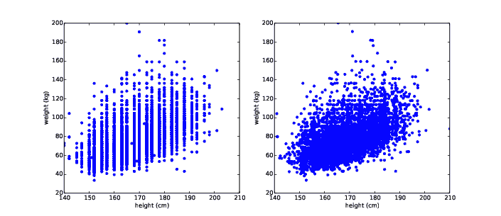
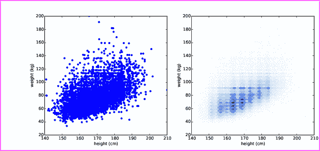
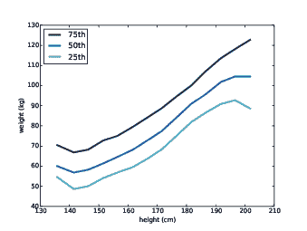
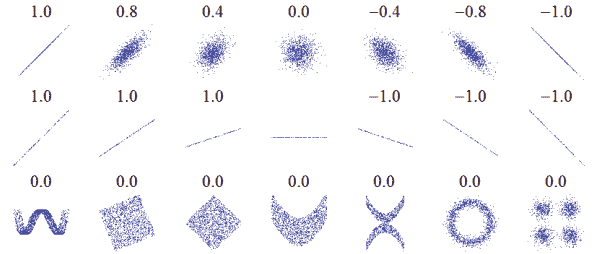

# 第七章：变量之间的关系

> 原文：[`greenteapress.com/thinkstats2/html/thinkstats2008.html`](https://greenteapress.com/thinkstats2/html/thinkstats2008.html)
> 
> 译者：[飞龙](https://github.com/wizardforcel)
> 
> 协议：[CC BY-NC-SA 4.0](http://creativecommons.org/licenses/by-nc-sa/4.0/)


到目前为止，我们只看了一个变量。在本章中，我们将研究变量之间的关系。如果知道一个变量，就能得到关于另一个变量的信息，那么这两个变量就是相关的。例如，身高和体重是相关的；较高的人往往体重更重。当然，这不是一个完美的关系：有矮胖的人和高瘦的人。但是，如果你想猜测某人的体重，如果你知道他们的身高，你会更准确。

本章的代码在`scatter.py`中。有关下载和使用此代码的信息，请参见第 0.2 节。

## 7.1  散点图

检查两个变量之间的关系的最简单方法是散点图，但是制作一个好的散点图并不总是容易。例如，我将为 BRFSS 中的受访者的体重与身高绘制散点图（参见第 5.4 节）。

以下是读取数据文件并提取身高和体重的代码：

```py
 df = brfss.ReadBrfss(nrows=None)
    sample = thinkstats2.SampleRows(df, 5000)
    heights, weights = sample.htm3, sample.wtkg2 
```

`SampleRows`选择数据的随机子集：

```py
def SampleRows(df, nrows, replace=False):
    indices = np.random.choice(df.index, nrows, replace=replace)
    sample = df.loc[indices]
    return sample 
```

`df`是 DataFrame，`nrows`是要选择的行数，`replace`是一个布尔值，指示是否应该进行有放回的抽样；换句话说，是否可以多次选择相同的行。

`thinkplot`提供`Scatter`，用于制作散点图：

```py
 thinkplot.Scatter(heights, weights)
    thinkplot.Show(xlabel='Height (cm)',
                   ylabel='Weight (kg)',
                   axis=[140, 210, 20, 200]) 
```

结果在图 7.1（左）中显示了关系的形状。正如我们预期的那样，较高的人往往体重更重。

> * * *
> 
> 
> 
> | 图 7.1：BRFSS 受访者体重与身高的散点图，未抖动（左），抖动（右）。 |
> | --- |
> 
> * * *

但这并不是数据的最佳表示，因为数据被打包到列中。问题在于，身高四舍五入到最接近的英寸，转换为厘米，然后再次四舍五入。一些信息在转换中丢失了。

我们无法恢复这些信息，但我们可以通过抖动数据来最小化散点图的影响，这意味着添加随机噪声以抵消四舍五入的影响。由于这些测量值四舍五入到最接近的英寸，它们可能偏差多达 0.5 英寸或 1.3 厘米。同样，重量可能偏差 0.5 公斤。

```py
 heights = thinkstats2.Jitter(heights, 1.3)
    weights = thinkstats2.Jitter(weights, 0.5) 
```

以下是`Jitter`的实现：

```py
def Jitter(values, jitter=0.5):
    n = len(values)
    return np.random.uniform(-jitter, +jitter, n) + values 
```

这些值可以是任何序列；结果是一个 NumPy 数组。

图 7.1（右）显示了结果。抖动减少了四舍五入的视觉效果，并使关系的形状更清晰。但是一般来说，你应该只为了可视化目的而抖动数据，并避免使用抖动的数据进行分析。

即使抖动了，这仍不是表示数据的最佳方式。有许多重叠的点，这隐藏了图中密集部分的数据，并且过分强调了异常值。这种效应称为饱和。

> * * *
> 
> 
> 
> | 图 7.2：抖动和透明度的散点图（左），六边形图（右）。 |
> | --- |
> 
> * * *

我们可以用`alpha`参数解决这个问题，这会使点部分透明：

```py
 thinkplot.Scatter(heights, weights, alpha=0.2) 
```

图 7.2（左）显示了结果。重叠的数据点看起来更暗，因此暗度与密度成正比。在这个图的版本中，我们可以看到之前不明显的两个细节：在几个高度处有垂直聚类和在 90 公斤或 200 磅附近的水平线。由于这些数据是基于磅的自我报告，最可能的解释是一些受访者报告了四舍五入的值。

透明度对于中等大小的数据集效果很好，但是这个图只显示了 BRFSS 中的前 5000 条记录，总共有 414509 条记录。

为了处理更大的数据集，另一个选择是六边形图，它将图形分成六边形箱，并根据落入每个箱中的数据点数量对每个箱进行着色。`thinkplot`提供`HexBin`：

```py
 thinkplot.HexBin(heights, weights) 
```

图 7.2（右侧）显示了结果。六边形图的优点是它能很好地显示关系的形状，并且对于大型数据集来说，它在时间和生成的文件大小方面都很高效。缺点是它使异常值不可见。

这个例子的要点是，要在不引入误导性的人为因素的情况下清晰地显示关系，制作散点图并不容易。

## 7.2 表征关系

散点图提供了变量之间关系的一般印象，但还有其他可视化方法可以更深入地了解关系的性质。其中一种选择是对一个变量进行分箱，并绘制另一个变量的百分位数。

NumPy 和 pandas 提供了用于分箱数据的函数：

```py
 df = df.dropna(subset=['htm3', 'wtkg2'])
    bins = np.arange(135, 210, 5)
    indices = np.digitize(df.htm3, bins)
    groups = df.groupby(indices) 
```

`dropna`删除具有列中任何`nan`的行。`arange`从 135 到 210（不包括）以 5 的增量生成一个 NumPy 数组的箱。

`digitize`计算包含`df.htm3`中每个值的箱的索引。结果是一个整数索引的 NumPy 数组。低于最低箱的值映射到索引 0。高于最高箱的值映射到`len(bins)`。

> * * *
> 
> 
> 
> | 图 7.3：一系列身高箱的体重百分位数。 |
> | --- |
> 
> * * *

`groupby`是一个 DataFrame 方法，返回一个 GroupBy 对象；在`for`循环中使用`groups`迭代组的名称和代表它们的 DataFrame。因此，例如，我们可以这样打印每个组中的行数：

```py
for i, group in groups:
    print(i, len(group)) 
```

现在，对于每个组，我们可以计算平均身高和体重的累积分布函数（CDF）：

```py
 heights = [group.htm3.mean() for i, group in groups]
    cdfs = [thinkstats2.Cdf(group.wtkg2) for i, group in groups] 
```

最后，我们可以绘制体重与身高的百分位数：

```py
 for percent in [75, 50, 25]:
        weights = [cdf.Percentile(percent) for cdf in cdfs]
        label = '%dth' % percent
        thinkplot.Plot(heights, weights, label=label) 
```

图 7.3 显示了结果。在 140 到 200 厘米之间，这些变量之间的关系大致是线性的。这个范围包括了超过 99%的数据，所以我们不必太担心极端情况。

## 7.3 相关性

相关性是一种旨在量化两个变量之间关系强度的统计量。

在测量相关性时的一个挑战是，我们想要比较的变量通常不是以相同的单位表示。即使它们是以相同的单位表示，它们也来自不同的分布。

这些问题有两种常见的解决方案：

1.  将每个值转换为标准分数，即与平均值的标准偏差数。这种转换导致了“皮尔逊积矩相关系数”。

1.  将每个值转换为其排名，即其在值排序列表中的索引。这种转换导致了“斯皮尔曼秩相关系数”。

如果 X 是一系列 n 个值，x[i]，我们可以通过减去平均值并除以标准差来转换为标准分数：z[i] = (x[i] − µ) / σ。

分子是一个偏差：与平均值的距离。除以σ标准化偏差，因此 Z 的值是无量纲的（没有单位），它们的分布具有均值 0 和方差 1。

如果 X 是正态分布的，那么 Z 也是正态分布的。但如果 X 是倾斜的或者有异常值，Z 也是如此；在这些情况下，使用百分位数排名更加稳健。如果我们计算一个新变量 R，使得 r[i]是 x[i]的排名，那么 R 的分布是均匀的，从 1 到 n，不管 X 的分布如何。

## 7.4 协方差

协方差是两个变量一起变化的倾向的度量。如果我们有两个系列 X 和 Y，它们与平均值的偏差是

| dx[i] = x[i] − x |
| --- |
| dy[i] = y[i] − ȳ |

其中 x 是 X 的样本均值，ȳ是 Y 的样本均值。如果 X 和 Y 一起变化，它们的偏差往往具有相同的符号。

如果我们将它们相乘，当偏差具有相同的符号时，乘积是正的，当偏差具有相反的符号时，乘积是负的。因此，将这些乘积相加可以衡量一起变化的倾向。

协方差是这些乘积的平均值：

```py
Cov(X,Y) = 
```

| 1 |

|  |

| n |

```py
 ∑dx[i] dy[i] 
```

其中 n 是两个序列的长度（它们必须是相同的长度）。

如果您学过线性代数，您可能会意识到`Cov`是偏差的点积，除以它们的长度。因此，如果两个向量相同，则协方差最大化，如果它们正交，则为 0，并且如果它们指向相反的方向，则为负。`thinkstats2`使用`np.dot`有效地实现`Cov`：

```py
def Cov(xs, ys, meanx=None, meany=None):
    xs = np.asarray(xs)
    ys = np.asarray(ys)

    if meanx is None:
        meanx = np.mean(xs)
    if meany is None:
        meany = np.mean(ys)

    cov = np.dot(xs-meanx, ys-meany) / len(xs)
    return cov 
```

默认情况下，`Cov`计算样本均值的偏差，或者您可以提供已知的均值。如果`xs`和`ys`是 Python 序列，`np.asarray`将它们转换为 NumPy 数组。如果它们已经是 NumPy 数组，`np.asarray`则不执行任何操作。

这个协方差的实现是为了解释的简单。NumPy 和 pandas 也提供了协方差的实现，但它们都对小样本量进行了校正，这是我们尚未涵盖的，`np.cov`返回一个协方差矩阵，这对我们现在来说已经超出需要了。

## 7.5 皮尔逊相关系数

协方差在某些计算中很有用，但很少作为摘要统计数据报告，因为它很难解释。在其他问题中，它的单位是 X 和 Y 的单位的乘积。例如，在 BRFSS 数据集中，体重和身高的协方差是 113 千克-厘米，不管那意味着什么。

解决这个问题的一个方法是将偏差除以标准差，得到标准分数，并计算标准分数的乘积：

```py
p[i] = 
```

| (x[i] − x) |

|  |

| S[X] |

|  |
| --- |

| (y[i] − ȳ) |

|  |

| S[Y] |

|  |
| --- |

其中 S[X]和 S[Y]分别是 X 和 Y 的标准差。这些乘积的均值是

```py
ρ = 
```

| 1 |

|  |

| n |

```py
 ∑p[i] 
```

或者我们可以通过分解 S[X]和 S[Y]来重写ρ：

```py
ρ = 
```

| Cov(X,Y) |

|  |

| S[X] S[Y] |

|  |
| --- |

这个值被称为皮尔逊相关系数，以 Karl Pearson 命名，他是一位有影响力的早期统计学家。它易于计算和解释。因为标准分数是无量纲的，所以ρ也是无量纲的。

这是`thinkstats2`中的实现：

```py
def Corr(xs, ys):
    xs = np.asarray(xs)
    ys = np.asarray(ys)

    meanx, varx = MeanVar(xs)
    meany, vary = MeanVar(ys)

    corr = Cov(xs, ys, meanx, meany) / math.sqrt(varx * vary)
    return corr 
```

`MeanVar`计算均值和方差比分别调用`np.mean`和`np.var`更有效率一些。

皮尔逊相关系数始终在-1 和+1 之间（包括两者）。如果ρ是正的，我们说相关性是正的，这意味着当一个变量很高时，另一个变量很可能也很高。如果ρ是负的，相关性是负的，所以当一个变量很高时，另一个变量很低。

ρ的大小表示相关性的强度。如果ρ为 1 或-1，则变量是完全相关的，这意味着如果您知道一个变量，您可以对另一个变量进行完美的预测。

现实世界中的大多数相关性并不完美，但仍然很有用。身高和体重的相关性为 0.51，与类似的人类相关变量相比是很强的相关性。

## 7.6 非线性关系

如果皮尔逊相关系数接近 0，很容易得出结论认为变量之间没有关系，但这个结论是无效的。皮尔逊相关系数只测量*线性*关系。如果存在非线性关系，ρ低估了它的强度。

> * * *
> 
> 
> 
> | 图 7.4：具有各种相关性的数据集示例。 |
> | --- |
> 
> * * *

图 7.4 来自[`wikipedia.org/wiki/Correlation_and_dependence`](http://wikipedia.org/wiki/Correlation_and_dependence)。它显示了几个精心构造的数据集的散点图和相关系数。

顶部一行显示了一系列相关性的线性关系；您可以使用此行来了解不同ρ值的不同情况。第二行显示了一系列斜率的完美相关性，这表明相关性与斜率无关（我们将很快讨论如何估计斜率）。第三行显示了明显相关的变量，但由于关系是非线性的，相关系数为 0。

这个故事的教训是，在盲目计算相关系数之前，您应该始终查看数据的散点图。

## 7.7 斯皮尔曼秩相关

如果变量之间的关系是线性的，并且变量大致正态分布，皮尔逊相关性效果很好。但是在存在异常值时不稳健。斯皮尔曼秩相关是一种替代方法，可以减轻异常值和偏斜分布的影响。要计算斯皮尔曼相关性，我们必须计算每个值的秩，即其在排序样本中的索引。然后我们计算秩的皮尔逊相关性。

`thinkstats2`提供了一个计算斯皮尔曼秩相关的函数：

```py
def SpearmanCorr(xs, ys):
    xranks = pandas.Series(xs).rank()
    yranks = pandas.Series(ys).rank()
    return Corr(xranks, yranks) 
```

我将参数转换为 pandas Series 对象，以便使用`rank`，它计算每个值的秩并返回一个 Series。然后我使用`Corr`来计算秩的相关性。

我还可以直接使用`Series.corr`并指定斯皮尔曼的方法：

```py
def SpearmanCorr(xs, ys):
    xs = pandas.Series(xs)
    ys = pandas.Series(ys)
    return xs.corr(ys, method='spearman') 
```

BRFSS 数据的斯皮尔曼秩相关为 0.54，略高于皮尔逊相关 0.51。差异可能有几个可能的原因，包括：

+   如果关系是非线性的，皮尔逊相关往往会低估关系的强度，以及

+   如果分布中包含偏斜或异常值，皮尔逊相关性可能会受到影响（无论方向如何）。斯皮尔曼秩相关性更加稳健。

在 BRFSS 示例中，我们知道体重分布大致呈对数正态分布；在对数变换下，它近似为正态分布，因此没有偏斜。因此，消除偏斜影响的另一种方法是使用对数体重和身高计算皮尔逊相关性：

```py
 thinkstats2.Corr(df.htm3, np.log(df.wtkg2)) 
```

结果为 0.53，接近秩相关系数 0.54。这表明体重分布的偏斜大部分解释了皮尔逊和斯皮尔曼相关性之间的差异。

## 7.8 相关性和因果关系

如果变量 A 和 B 相关，则有三种可能的解释：A 导致 B，或 B 导致 A，或其他一些因素导致 A 和 B。这些解释被称为“因果关系”。

仅仅相关性并不能区分这些解释，因此它不能告诉您哪些是真实的。这个规则通常用短语“相关性不意味着因果关系”来概括，这个短语非常简洁，甚至有自己的维基百科页面：[`wikipedia.org/wiki/Correlation_does_not_imply_causation`](http://wikipedia.org/wiki/Correlation_does_not_imply_causation)。

那么，您可以采取什么措施来提供因果关系的证据？

1.  使用时间。如果 A 在 B 之前发生，那么 A 可能导致 B，但反之则不然（至少根据我们对因果关系的共同理解）。事件的顺序可以帮助我们推断因果关系的方向，但这并不排除其他因素同时导致 A 和 B 的可能性。

1.  使用随机性。如果将大样本随机分成两组，并计算几乎任何变量的均值，您期望差异很小。如果两组在所有变量上几乎相同，只有一个变量不同，您可以消除虚假关系。

    即使您不知道相关变量是什么，这也适用，但如果您知道相关变量，效果会更好，因为您可以检查这些组是否相同。

这些想法是随机对照试验的动机，其中受试者被随机分配到两个（或更多）组：一个接受某种干预（如新药）的治疗组，以及一个不接受干预或其效果已知的对照组。

随机对照试验是证明因果关系最可靠的方法，也是基于科学的医学的基础（参见[`wikipedia.org/wiki/Randomized_controlled_trial`](http://wikipedia.org/wiki/Randomized_controlled_trial)）。

不幸的是，对照试验只在实验室科学、医学和其他几个学科中可能。在社会科学中，受控实验很少见，通常是因为不可能或不道德。

另一种方法是寻找自然实验，其中对于其他方面相似的组应用不同的“治疗”。自然实验的一个危险是组可能在不明显的方面有所不同。您可以在[`wikipedia.org/wiki/Natural_experiment`](http://wikipedia.org/wiki/Natural_experiment)上阅读更多关于这个主题的内容。

在某些情况下，可以使用回归分析来推断因果关系，这是第十一章的主题。

## 7.9 练习

这个练习的解决方案在`chap07soln.py`中。

练习 1 *使用 NSFG 的数据，制作出生体重与母亲年龄的散点图。绘制出生体重与母亲年龄的百分位数。计算 Pearson 和 Spearman 的相关性。你如何描述这些变量之间的关系？*

## 7.10 术语表

+   散点图：展示两个变量之间关系的可视化，每行数据显示一个点。

+   抖动：为了可视化而添加到数据中的随机噪音。

+   饱和度：当多个点叠加在一起时丢失信息。

+   相关性：衡量两个变量之间关系强度的统计量。

+   标准化：将一组值转换为它们的平均值为 0，方差为 1。

+   标准分数：已经标准化为从平均值的标准偏差中表达的值。

+   协方差：衡量两个变量一起变化倾向的度量。

+   等级：元素在排序列表中出现的索引。

+   随机对照试验：一种实验设计，其中受试者被随机分成组，不同的组被给予不同的治疗。

+   治疗组：在对照试验中接受某种干预的组。

+   对照组：在对照试验中不接受治疗或其效果已知的组。

+   自然实验：利用主体自然分组的实验设计，这些分组至少近似随机。
