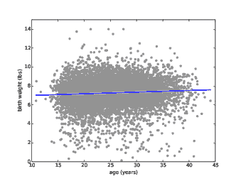
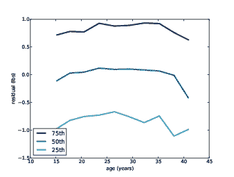
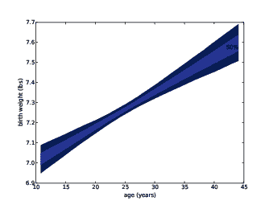
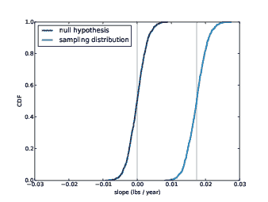

# 第十章 线性最小二乘法

> 原文：[`greenteapress.com/thinkstats2/html/thinkstats2011.html`](https://greenteapress.com/thinkstats2/html/thinkstats2011.html)

本章的代码在`linear.py`中。有关下载和使用此代码的信息，请参见第 0.2 节。

## 10.1 最小二乘拟合

相关系数衡量了关系的强度和符号，但没有衡量斜率。估计斜率的方法有几种，最常见的是线性最小二乘拟合。"线性拟合"是一条旨在模拟变量之间关系的直线。"最小二乘"拟合是使直线与数据之间的均方误差（MSE）最小化的拟合。

假设我们有一个点序列`ys`，我们希望将其表示为另一个序列`xs`的函数。如果`xs`和`ys`之间存在线性关系，截距为`inter`，斜率为`slope`，我们期望每个`y[i]`都是`inter + slope * x[i]`。

但除非相关性完美，否则这种预测只是近似的。直线的垂直偏差，或残差，是

```py
res = ys - (inter + slope * xs) 
```

残差可能是由于测量误差等随机因素，或者是未知的非随机因素。例如，如果我们试图预测体重与身高的关系，未知因素可能包括饮食、运动和体型。

如果我们错误地得到了参数`inter`和`slope`，残差会变大，因此直观上讲，我们想要的参数是能最小化残差的参数。

我们可以尝试最小化残差的绝对值，或它们的平方，或它们的立方；但最常见的选择是最小化残差的平方和，`sum(res**2)`。

为什么？有三个重要的原因和一个不太重要的原因：

+   平方具有将正负残差视为相同的特性，这通常是我们想要的。

+   平方会使较大的残差更加重要，但不会使最大的残差总是占主导地位。

+   如果残差是不相关的，并且服从均值为 0、方差恒定（但未知）的正态分布，那么最小二乘拟合也是`inter`和`slope`的最大似然估计。参见[`en.wikipedia.org/wiki/Linear_regression`](https://en.wikipedia.org/wiki/Linear_regression)。

+   最小化平方残差的`inter`和`slope`的值可以高效地计算。

当计算效率比选择最适合问题的方法更重要时，最后一个原因是有道理的。但现在已经不再是这种情况，因此值得考虑是否最小化残差的平方是正确的。

例如，如果你正在使用`xs`来预测`ys`的值，猜测过高可能比猜测过低更好（或更糟）。在这种情况下，你可能希望为每个残差计算一些成本函数，并最小化总成本`sum(cost(res))`。然而，计算最小二乘拟合是快速、简单且通常足够好的。

## 10.2 实现

`thinkstats2`提供了演示线性最小二乘法的简单函数：

```py
def LeastSquares(xs, ys):
    meanx, varx = MeanVar(xs)
    meany = Mean(ys)

    slope = Cov(xs, ys, meanx, meany) / varx
    inter = meany - slope * meanx

    return inter, slope 
```

`LeastSquares`接受序列`xs`和`ys`，并返回估计的参数`inter`和`slope`。有关其工作原理的详细信息，请参见[`wikipedia.org/wiki/Numerical_methods_for_linear_least_squares`](http://wikipedia.org/wiki/Numerical_methods_for_linear_least_squares)。

`thinkstats2`还提供了`FitLine`，它接受`inter`和`slope`，并返回`xs`序列的拟合直线。

```py
def FitLine(xs, inter, slope):
    fit_xs = np.sort(xs)
    fit_ys = inter + slope * fit_xs
    return fit_xs, fit_ys 
```

我们可以使用这些函数来计算母亲年龄作为出生体重的函数的最小二乘拟合。

```py
 live, firsts, others = first.MakeFrames()
    live = live.dropna(subset=['agepreg', 'totalwgt_lb'])
    ages = live.agepreg
    weights = live.totalwgt_lb

    inter, slope = thinkstats2.LeastSquares(ages, weights)
    fit_xs, fit_ys = thinkstats2.FitLine(ages, inter, slope) 
```

估计的截距和斜率分别为 6.8 磅和 0.017 磅/年。这些值以这种形式很难解释：截距是母亲年龄为 0 岁的婴儿的预期体重，在这种情况下是没有意义的，而斜率太小以至于难以理解。

通常情况下，不是在 x=0 处呈现截距，而是在 x 的均值处呈现截距更有帮助。在这种情况下，平均年龄约为 25 岁，25 岁母亲的平均婴儿体重为 7.3 磅。斜率为每年 0.27 盎司，或每十年 0.17 磅。

> * * *
> 
> 
> 
> | 图 10.1：出生体重和母亲年龄的散点图与线性拟合。 |
> | --- |
> 
> * * *

图 10.1 显示了出生体重和年龄的散点图以及拟合线。查看这样的图来评估关系是否是线性的，以及拟合线是否是关系的一个好模型是一个好主意。

## 10.3 残差

另一个有用的测试是绘制残差。`thinkstats2`提供了一个计算残差的函数：

```py
def Residuals(xs, ys, inter, slope):
    xs = np.asarray(xs)
    ys = np.asarray(ys)
    res = ys - (inter + slope * xs)
    return res 
```

`Residuals`接受序列`xs`和`ys`以及估计的参数`inter`和`slope`。它返回实际值与拟合线之间的差异。

> * * *
> 
> 
> 
> | 图 10.2：线性拟合的残差。 |
> | --- |
> 
> * * *

为了可视化残差，我按年龄对受访者进行分组，并计算每个组的百分位数，就像我们在第 7.2 节中看到的那样。图 10.2 显示了每个年龄组残差的 25th、50th 和 75th 百分位数。中位数接近零，符合预期，四分位距（IQR）约为 2 磅。因此，如果我们知道母亲的年龄，我们可以猜测婴儿的体重在一磅左右，大约 50%的时间，因为 50%的体重在 IQR 中。

理想情况下，这些线应该是平的，表明残差是随机的，并且是平行的，表明残差的方差对所有年龄组都是相同的。实际上，这些线几乎是平行的，所以这很好；但它们有一些曲率，表明关系是非线性的。尽管如此，线性拟合是一个简单的模型，可能对某些目的来说是足够好的。

## 10.4 估计

参数`slope`和`inter`是基于样本的估计值；像其他估计值一样，它们容易受到抽样偏差、测量误差和抽样误差的影响。如第八章所讨论的，抽样偏差是由非代表性抽样引起的，测量误差是由在收集和记录数据时的错误引起的，抽样误差是由于对样本而不是整个人口进行测量而引起的。

为了评估抽样误差，我们问：“如果我们再次运行这个实验，我们期望估计值有多大的变异性？”我们可以通过运行模拟实验并计算估计的抽样分布来回答这个问题。

我通过对数据进行重新抽样来模拟实验；也就是说，我将观察到的怀孕视为整个人口，并从观察到的样本中进行替换抽样。

```py
def SamplingDistributions(live, iters=101):
    t = []
    for _ in range(iters):
        sample = thinkstats2.ResampleRows(live)
        ages = sample.agepreg
        weights = sample.totalwgt_lb
        estimates = thinkstats2.LeastSquares(ages, weights)
        t.append(estimates)

    inters, slopes = zip(*t)
    return inters, slopes 
```

`SamplingDistributions`接受一个每个活产的行的 DataFrame，以及要模拟的实验次数`iters`。它使用`ResampleRows`来对观察到的怀孕进行重新抽样。我们已经看到了`SampleRows`，它从 DataFrame 中选择随机行。`thinkstats2`还提供了`ResampleRows`，它返回与原始样本大小相同的样本：

```py
def ResampleRows(df):
    return SampleRows(df, len(df), replace=True) 
```

重新抽样后，我们使用模拟样本来估计参数。结果是两个序列：估计的截距和估计的斜率。

我通过打印标准误差和置信区间来总结抽样分布：

```py
def Summarize(estimates, actual=None):
    mean = thinkstats2.Mean(estimates)
    stderr = thinkstats2.Std(estimates, mu=actual)
    cdf = thinkstats2.Cdf(estimates)
    ci = cdf.ConfidenceInterval(90)
    print('mean, SE, CI', mean, stderr, ci) 
```

`Summarize`接受一系列估计值和实际值。它打印出估计的平均值、标准误差和 90%的置信区间。

对于截距，平均估计值为 6.83，标准误差为 0.07，90%的置信区间为(6.71, 6.94)。估计的斜率，更紧凑的形式是 0.0174，SE 0.0028，CI (0.0126, 0.0220)。这个 CI 的低端和高端之间几乎相差一倍，所以应该被视为一个粗略的估计。

为了可视化估计的抽样误差，我们可以绘制所有拟合线，或者为了更简洁的表示，为每个年龄绘制一个 90%的置信区间。以下是代码：

```py
def PlotConfidenceIntervals(xs, inters, slopes,
                            percent=90, **options):
    fys_seq = []
    for inter, slope in zip(inters, slopes):
        fxs, fys = thinkstats2.FitLine(xs, inter, slope)
        fys_seq.append(fys)

    p = (100 - percent) / 2
    percents = p, 100 - p
    low, high = thinkstats2.PercentileRows(fys_seq, percents)
    thinkplot.FillBetween(fxs, low, high, **options) 
```

`xs`是母亲的年龄序列。`inters`和`slopes`是由`SamplingDistributions`生成的估计参数。`percent`表示要绘制的置信区间。

`PlotConfidenceIntervals`为每对`inter`和`slope`生成一个拟合线，并将结果存储在一个序列`fys_seq`中。然后它使用`PercentileRows`为每个`x`的值选择`y`的上下百分位数。对于 90%的置信区间，它选择第 5 和第 95 百分位数。`FillBetween`绘制填充两条线之间空间的多边形。

> * * *
> 
> 
> 
> | 图 10.3：50%和 90%置信区间显示由于截距和斜率的抽样误差而导致拟合线的变异性。 |
> | --- |
> 
> * * *

图 10.3 显示了拟合到母亲年龄的出生体重曲线的 50%和 90%置信区间。区域的垂直宽度代表抽样误差的影响；对于接近均值的值，影响较小，对于极端值，影响较大。

## 10.5 拟合优度

有几种方法可以衡量线性模型的质量或拟合优度。其中最简单的是残差的标准差。

如果你使用线性模型进行预测，`Std(res)`是你预测的均方根误差（RMSE）。例如，如果你使用母亲的年龄来猜测出生体重，你的猜测的 RMSE 将是 1.40 磅。

如果你在不知道母亲年龄的情况下猜测出生体重，你的猜测的 RMSE 是`Std(ys)`，即 1.41 磅。因此，在这个例子中，知道母亲的年龄并没有显著改善预测。

衡量拟合优度的另一种方法是决定系数，通常表示为 R²，称为“R 平方”：

```py
def CoefDetermination(ys, res):
    return 1 - Var(res) / Var(ys) 
```

`Var(res)`是使用模型进行猜测的 MSE，`Var(ys)`是没有使用模型的 MSE。因此，它们的比值是如果使用模型剩余 MSE 的分数，R²是模型消除的 MSE 的分数。

对于出生体重和母亲的年龄，R²为 0.0047，这意味着母亲的年龄预测了出生体重变异的大约半个百分点。

决定系数和皮尔逊相关系数之间有一个简单的关系：R² = ρ²。例如，如果ρ为 0.8 或-0.8，则 R² = 0.64。

尽管ρ和 R²经常用来量化关系的强度，但它们在预测能力方面并不容易解释。在我看来，`Std(res)`是对预测质量的最佳表示，特别是如果它与`Std(ys)`相关联。

例如，当人们谈论 SAT 的有效性（美国大学入学的标准化考试）时，他们经常谈论 SAT 分数与智力的其他衡量指标之间的相关性。

根据一项研究，SAT 总分和 IQ 分数之间的皮尔逊相关系数为ρ=0.72，听起来是一个很强的相关性。但是 R² = ρ² = 0.52，因此 SAT 分数仅解释了 IQ 变异的 52%。

IQ 分数通过`Std(ys) = 15`进行标准化，因此

```py
>>> var_ys = 15**2
>>> rho = 0.72
>>> r2 = rho**2
>>> var_res = (1 - r2) * var_ys
>>> std_res = math.sqrt(var_res)
10.4096 
```

因此，使用 SAT 分数来预测 IQ 将 RMSE 从 15 分降低到 10.4 分。0.72 的相关性仅导致 RMSE 减少了 31%。

如果你看到一个看起来令人印象深刻的相关性，记住 R²是 MSE 减少的更好指标，RMSE 的减少是预测能力的更好指标。

## 10.6 测试线性模型

母亲年龄对出生体重的影响很小，预测能力也很小。因此，表面上的关系可能是由于偶然性造成的。我们可以通过几种方式来测试线性拟合的结果。

一种选择是测试 MSE 的明显减少是否是由于偶然原因。在这种情况下，检验统计量是 R²，零假设是变量之间没有关系。我们可以通过排列来模拟零假设，就像在[9.5]节中测试母亲年龄和新生儿体重之间的相关性时一样。事实上，因为 R² = ρ²，对 R²的单侧检验等价于对ρ的双侧检验。我们已经做过那个测试，并且发现 p < 0.001，因此我们得出结论，母亲年龄和新生儿体重之间的明显关系在统计上是显著的。

另一种方法是测试明显斜率是否是由于偶然原因。零假设是斜率实际上为零；在这种情况下，我们可以将出生体重建模为围绕其均值的随机变化。这是这个模型的一个假设检验：

```py
class SlopeTest(thinkstats2.HypothesisTest):

    def TestStatistic(self, data):
        ages, weights = data
        _, slope = thinkstats2.LeastSquares(ages, weights)
        return slope

    def MakeModel(self):
        _, weights = self.data
        self.ybar = weights.mean()
        self.res = weights - self.ybar

    def RunModel(self):
        ages, _ = self.data
        weights = self.ybar + np.random.permutation(self.res)
        return ages, weights 
```

数据被表示为年龄和体重的序列。检验统计量是由`LeastSquares`估计的斜率。零假设的模型由所有婴儿的平均体重和与平均值的偏差表示。为了生成模拟数据，我们对偏差进行排列并将它们加到平均值上。

这是运行假设检验的代码：

```py
 live, firsts, others = first.MakeFrames()
    live = live.dropna(subset=['agepreg', 'totalwgt_lb'])
    ht = SlopeTest((live.agepreg, live.totalwgt_lb))
    pvalue = ht.PValue() 
```

p 值小于 0.001，因此尽管估计的斜率很小，但不太可能是由于偶然原因。

通过模拟零假设来估计 p 值是严格正确的，但有一个更简单的选择。记住我们已经在 10.4 节中计算了斜率的抽样分布。为了做到这一点，我们假设观察到的斜率是正确的，并通过重新抽样来模拟实验。

图 10.4 显示了斜率的抽样分布，来自 10.4 节，以及在零假设下生成的斜率分布。抽样分布围绕估计的斜率 0.017 磅/年中心，零假设下的斜率围绕 0 中心；但除此之外，这些分布是相同的。这些分布也是对称的，我们将在 14.4 节中看到原因。

> * * *
> 
> 
> 
> | 图 10.4：估计斜率的抽样分布和在零假设下生成的斜率分布。垂直线在 0 和观察到的斜率 0.017 磅/年处。 |
> | --- |
> 
> * * *

因此，我们可以两种方式估计 p 值：

+   计算零假设下的斜率超过观察到的斜率的概率。

+   计算抽样分布中斜率低于 0 的概率。(如果估计的斜率为负，我们将计算抽样分布中斜率高于 0 的概率。)

第二个选择更容易，因为我们通常希望计算参数的抽样分布。即使样本量较小且残差分布是倾斜的，它通常也足够好，因为 p 值不必精确。

这是使用抽样分布估计斜率的 p 值的代码：

```py
 inters, slopes = SamplingDistributions(live, iters=1001)
    slope_cdf = thinkstats2.Cdf(slopes)
    pvalue = slope_cdf[0] 
```

同样，我们发现 p < 0.001。

## 10.7 加权重抽样

到目前为止，我们已经将 NSFG 数据视为代表性样本，但正如我在 1.2 节中提到的，它并不是。这项调查有意过度采样了几个群体，以提高获得统计显著结果的机会；也就是说，以提高涉及这些群体的检验的功效。

这种调查设计对许多目的都很有用，但这意味着我们不能在不考虑抽样过程的情况下使用样本来估计一般人口的值。

对于每个受访者，NSFG 数据包括一个名为`finalwgt`的变量，它是受访者代表的一般人口数量。这个值称为抽样权重，或者只是“权重”。

举例来说，如果你在一个拥有 3 亿人口的国家中对 10 万人进行调查，每个受访者代表 3,000 人。如果你对某个群体进行了 2 倍的过采样，那么在过采样群体中的每个人的权重会更低，大约为 1500。

为了纠正过采样，我们可以使用重新采样；也就是说，我们可以使用与抽样权重成比例的概率从调查中抽取样本。然后，对于我们想要估计的任何数量，我们可以生成抽样分布、标准误差和置信区间。举例来说，我将估计有和没有抽样权重的情况下的平均出生体重。

在第 10.4 节中，我们看到了 `ResampleRows`，它从 DataFrame 中选择行，使每行具有相同的概率。现在我们需要使用与抽样权重成比例的概率来做同样的事情。`ResampleRowsWeighted` 接受一个 DataFrame，根据 `finalwgt` 中的权重重新对行进行抽样，并返回一个包含重新抽样行的 DataFrame：

```py
def ResampleRowsWeighted(df, column='finalwgt'):
    weights = df[column]
    cdf = Cdf(dict(weights))
    indices = cdf.Sample(len(weights))
    sample = df.loc[indices]
    return sample 
```

`weights` 是一个 Series；将其转换为字典会从索引到权重创建一个映射。在 `cdf` 中，值是索引，概率与权重成比例。

`indices` 是一系列行索引；`sample` 是一个包含所选行的 DataFrame。由于我们进行有放回的抽样，同一行可能会出现多次。

现在我们可以比较有和没有抽样权重的情况下的效果。没有抽样权重，我们会这样生成抽样分布：

```py
 estimates = [ResampleRows(live).totalwgt_lb.mean()
                 for _ in range(iters)] 
```

加权后，情况如下：

```py
 estimates = [ResampleRowsWeighted(live).totalwgt_lb.mean()
                 for _ in range(iters)] 
```

以下表格总结了结果：

|   | 平均出生重量 | 标准 | 90% 置信区间 |
| --- | --- | --- | --- |
|   | 体重（磅） | 误差 |   |
| 未加权 | 7.27 | 0.014 | (7.24, 7.29) |
| 加权 | 7.35 | 0.014 | (7.32, 7.37) |

在这个例子中，加权的效果很小但不可忽略。估计的平均值在加权和不加权的情况下的差异约为 0.08 磅，或者 1.3 盎司。这个差异远大于估计的标准误差 0.014 磅，这意味着这个差异不是由于偶然造成的。

## 10.8 练习

这个练习的解决方案在 `chap10soln.ipynb` 中。

练习 1

*使用 BRFSS 的数据，计算 log(体重) 与身高的线性最小二乘拟合。在这种一个变量经过对数变换的模型中，你会如何最好地呈现估计的参数？如果你试图猜测某人的体重，了解他们的身高会有多大帮助？*

*像 NSFG 一样，BRFSS 对一些群体进行了过采样，并为每个受访者提供了抽样权重。在 BRFSS 数据中，这些权重的变量名是 `finalwt`。使用重新采样，加权和不加权，来估计 BRFSS 受访者的平均身高、平均误差和 90% 置信区间。正确的加权对估计结果有多大影响？*

## 10.9 术语表

+   线性拟合：旨在模拟变量之间关系的一条线。

+   最小二乘拟合：最小化残差平方和的数据集模型。

+   残差：实际值与模型之间的偏差。

+   拟合优度：衡量模型与数据拟合程度的指标。

+   决定系数：旨在量化拟合优度的统计量。

+   抽样权重：与样本中的观察值相关联的值，表示其代表的人口部分。
