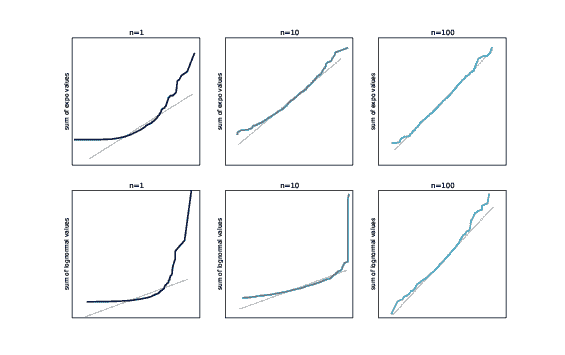
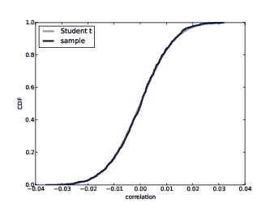
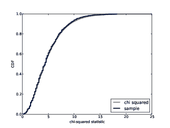

# 第十四章  分析方法

> 原文：[`greenteapress.com/thinkstats2/html/thinkstats2015.html`](https://greenteapress.com/thinkstats2/html/thinkstats2015.html)

这本书侧重于诸如模拟和重采样之类的计算方法，但我们解决的一些问题有解析解，可以快得多。

我在本章中介绍了一些这些方法，并解释了它们的工作原理。在本章末尾，我提出了整合计算和分析方法进行探索性数据分析的建议。

本章中的代码在`normal.py`中。有关下载和使用此代码的信息，请参阅第 0.2 节。

## 14.1  正态分布

作为一个激励性的例子，让我们回顾一下第 8.3 节中的问题：

> 假设你是一名研究野生动物保护区大猩猩的科学家。称重了 9 只大猩猩后，你发现样本均值 x=90 千克，样本标准差 S=7.5 千克。如果你使用 x 来估计总体均值，估计的标准误差是多少？

为了回答这个问题，我们需要 x 的抽样分布。在第 8.3 节中，我们通过模拟实验（称重 9 只大猩猩），计算每次模拟实验的 x，并累积估计的分布来近似这个分布。

结果是对抽样分布的近似。然后我们使用抽样分布来计算标准误差和置信区间：

1.  抽样分布的标准差是估计的标准误差；在这个例子中，它大约是 2.5 千克。

1.  抽样分布的第 5 和第 95 百分位之间的区间是 90%的置信区间。如果我们多次运行实验，我们期望估计值在这个区间内的概率是 90%。在这个例子中，90%的置信区间是(86, 94)千克。

现在我们将以相同的方式进行分析计算。我们利用成年雌性大猩猩的体重大致上是正态分布这一事实。正态分布有两个性质使它们适合进行分析：它们在线性变换和加法下是“封闭的”。为了解释这意味着什么，我需要一些符号。

如果一个量 X 的分布是参数为µ和σ的正态分布，你可以写成

| X ∼ N (µ, σ²) |
| --- |

其中符号∼表示“分布”，脚本字母 N 代表“正态分布”。

X 的线性变换是类似 X′ = a X + b 的东西，其中 a 和 b 是实数。如果 X′与 X 在同一个分布族中，那么这个分布族在线性变换下是封闭的。正态分布具有这个性质；如果 X ∼ N (µ, σ²)，

| X′ ∼ N (a µ + b, a² σ²)   |
| --- |

正态分布也是封闭的。如果 Z = X + Y，且 X ∼ N (µ[X], σ[X]²)和 Y ∼ N (µ[Y], σ[Y]²)那么

| Z ∼ N (µ[X] + µ[Y], σ[X]² + σ[Y]²)   |
| --- |

在特殊情况 Z = X + X 中，我们有

| Z ∼ N (2 µ[X], 2 σ[X]²)  |
| --- |

一般来说，如果我们抽取 n 个 X 的值并将它们相加，我们有

| Z ∼ N (n µ[X], n σ[X]²)   |
| --- |

## 14.2  抽样分布

现在我们有了计算 x 的抽样分布所需的一切。记住我们通过称重 n 只大猩猩，将总重量相加，然后除以 n 来计算 x。

假设大猩猩体重 X 的分布大致上是正态分布：

| X ∼ N (µ, σ²) |
| --- |

如果我们称重 n 只大猩猩，总重量 Y 的分布

| Y ∼ N (n µ, n σ²)  |
| --- |

使用方程 3。如果我们除以 n，样本均值 Z 的分布是

| Z ∼ N (µ, σ²/n)  |
| --- |

使用方程 1，其中 a = 1/n。 

Z 的分布是 x 的抽样分布。Z 的均值是µ，这表明 x 是µ的无偏估计。抽样分布的方差是σ² / n。

因此，抽样分布的标准差，也就是估计的标准误差，是σ / √n。在这个例子中，σ是 7.5 千克，n 是 9，所以标准误差是 2.5 千克。这个结果与我们通过模拟估计的结果一致，但计算速度更快！

我们还可以使用抽样分布来计算置信区间。x 的 90%置信区间是 Z 的第 5 和第 95 百分位之间的区间。由于 Z 服从正态分布，我们可以通过评估逆 CDF 来计算百分位数。

正态分布或其逆的 CDF 没有封闭形式，但有快速的数值方法，并且它们在 SciPy 中实现，正如我们在第 5.2 节中看到的那样。`thinkstats2`提供了一个包装函数，使得 SciPy 函数更容易使用：

```py
def EvalNormalCdfInverse(p, mu=0, sigma=1):
    return scipy.stats.norm.ppf(p, loc=mu, scale=sigma) 
```

给定概率`p`，它返回具有参数`mu`和`sigma`的正态分布的相应百分位数。对于 x 的 90%置信区间，我们可以这样计算第 5 和第 95 百分位数：

```py
>>> thinkstats2.EvalNormalCdfInverse(0.05, mu=90, sigma=2.5)
85.888

>>> thinkstats2.EvalNormalCdfInverse(0.95, mu=90, sigma=2.5)
94.112 
```

因此，如果我们多次运行实验，我们期望估计值 x 在（85.9, 94.1）的范围内约 90%的时间。同样，这与我们通过模拟得到的结果一致。

## 14.3 表示正态分布

为了使这些计算更容易，我定义了一个名为`Normal`的类，表示正态分布，并对前几节中的方程进行了编码。它看起来是这样的：

```py
class Normal(object):

    def __init__(self, mu, sigma2):
        self.mu = mu
        self.sigma2 = sigma2

    def __str__(self):
        return 'N(%g, %g)' % (self.mu, self.sigma2) 
```

因此，我们可以实例化一个代表大猩猩体重分布的正态分布：

```py
>>> dist = Normal(90, 7.5**2)
>>> dist
N(90, 56.25) 
```

`Normal`提供了`Sum`，它接受样本大小`n`，并使用方程 3 返回`n`个值的总和的分布：

```py
 def Sum(self, n):
        return Normal(n * self.mu, n * self.sigma2) 
```

正态分布也知道如何使用方程式 1 进行乘法和除法：

```py
 def __mul__(self, factor):
        return Normal(factor * self.mu, factor**2 * self.sigma2)

    def __div__(self, divisor):
        return 1 / divisor * self 
```

因此，我们可以计算样本大小为 9 的均值的抽样分布：

```py
>>> dist_xbar = dist.Sum(9) / 9
>>> dist_xbar.sigma
2.5 
```

抽样分布的标准差为 2.5 千克，正如我们在前一节中看到的。最后，Normal 提供了`Percentile`，我们可以用它来计算置信区间：

```py
>>> dist_xbar.Percentile(5), dist_xbar.Percentile(95)
85.888 94.113 
```

这与我们之前得到的答案相同。我们稍后将再次使用 Normal 类，但在继续之前，我们需要进行更多的分析。

## 14.4 中心极限定理

正如我们在前面的部分中看到的，如果我们添加从正态分布中抽取的值，总和的分布是正态的。大多数其他分布都没有这种特性；如果我们添加从其他分布中抽取的值，总和通常没有解析分布。

但是，如果我们从几乎任何分布中添加`n`个值，随着`n`的增加，总和的分布将收敛为正态分布。

更具体地说，如果值的分布具有均值和标准差µ和σ，则总和的分布大约为 N(n µ, n σ²)。

这个结果就是中心极限定理（CLT）。这是统计分析中最有用的工具之一，但它也有一些警告：

+   这些值必须是独立绘制的。如果它们相关，中心极限定理不适用（尽管在实践中这很少是一个问题）。

+   这些值必须来自相同的分布（尽管可以放宽此要求）。

+   这些值必须来自具有有限均值和方差的分布。因此，大多数帕累托分布都不合适。

+   收敛速度取决于分布的偏斜度。来自指数分布的总和对于小的`n`收敛。来自对数正态分布的总和需要更大的样本量。

中心极限定理解释了自然界中正态分布的普遍性。许多生物特征受到遗传和环境因素的影响，其效果是可加的。我们测量的特征是许多小效应的总和，因此它们的分布倾向于正态分布。

## 14.5 测试中心极限定理

为了了解中心极限定理的工作原理以及何时不适用，让我们进行一些实验。首先，我们将尝试指数分布：

```py
def MakeExpoSamples(beta=2.0, iters=1000):
    samples = []
    for n in [1, 10, 100]:
        sample = [np.sum(np.random.exponential(beta, n))
                  for _ in range(iters)]
        samples.append((n, sample))
    return samples 
```

`MakeExpoSamples`生成指数值总和的样本（我使用“指数值”作为“来自指数分布的值”的简称）。`beta`是分布的参数；`iters`是要生成的总和数量。

为了解释这个函数，我将从内部开始，逐步向外展开。每次调用`np.random.exponential`，我们都会得到一个`n`个指数值的序列，并计算其总和。`sample`是这些总和的列表，长度为`iters`。

很容易混淆`n`和`iters`：`n`是每个总和中的项数；`iters`是我们计算的总和的数量，以描述总和的分布。

返回值是一个`(n, sample)`对的列表。对于每对，我们制作一个正态概率图：

```py
def NormalPlotSamples(samples, plot=1, ylabel=''):
    for n, sample in samples:
        thinkplot.SubPlot(plot)
        thinkstats2.NormalProbabilityPlot(sample)

        thinkplot.Config(title='n=%d' % n, ylabel=ylabel)
        plot += 1 
```

`NormalPlotSamples`获取`MakeExpoSamples`生成的对列表，并生成一行正态概率图。

> * * *
> 
> 
> 
> | 图 14.1：指数值总和分布（顶部行）和对数正态值总和分布（底部行）。 |
> | --- |
> 
> * * *

图 14.1（顶部行）显示了结果。当`n=1`时，总和的分布仍然是指数分布，因此正态概率图不是一条直线。但是当`n=10`时，总和的分布近似正态，当`n=100`时，它几乎无法与正态区分开来。

图 14.1（底部行）显示了对数正态分布的类似结果。对数正态分布通常比指数分布更倾斜，因此总和的分布需要更长时间才能收敛。当`n=10`时，正态概率图远非直线，但当`n=100`时，它近似正态。

> * * *
> 
> 
> 
> | 图 14.2：帕累托值总和分布（顶部行）和相关指数值总和分布（底部行）。 |
> | --- |
> 
> * * *

帕累托分布甚至比对数正态分布更倾斜。根据参数的不同，许多帕累托分布没有有限的均值和方差。因此，中心极限定理不适用。图 14.2（顶部行）显示了帕累托值总和分布。即使当`n=100`时，正态概率图也远非直线。

我还提到了如果值相关，中心极限定理不适用。为了测试这一点，我从指数分布中生成了相关值。生成相关值的算法是：（1）生成相关的正态值，（2）使用正态 CDF 将值转换为均匀分布，（3）使用逆指数 CDF 将均匀值转换为指数分布。

`GenerateCorrelated`返回一个具有序列相关性`rho`的`n`个正态值的迭代器：

```py
def GenerateCorrelated(rho, n):
    x = random.gauss(0, 1)
    yield x

    sigma = math.sqrt(1 - rho**2)
    for _ in range(n-1):
        x = random.gauss(x*rho, sigma)
        yield x 
```

第一个值是标准正态值。每个后续值都取决于其前一个值：如果前一个值是`x`，则下一个值的均值是`x*rho`，方差为`1-rho**2`。请注意，`random.gauss`将标准差作为第二个参数，而不是方差。

`GenerateExpoCorrelated`将生成的序列转换为指数分布：

```py
def GenerateExpoCorrelated(rho, n):
    normal = list(GenerateCorrelated(rho, n))
    uniform = scipy.stats.norm.cdf(normal)
    expo = scipy.stats.expon.ppf(uniform)
    return expo 
```

`normal`是一系列相关的正态值。`uniform`是 0 到 1 之间的均匀值序列。`expo`是一系列相关的指数值。`ppf`代表“百分位点函数”，这是逆 CDF 的另一个名称。

图 14.2（底部行）显示了具有`rho=0.9`的相关指数值的总和分布。相关性减慢了收敛速度；尽管如此，当`n=100`时，正态概率图几乎是直线的。因此，即使在值相关的情况下中心极限定理并不严格适用，但在实践中，适度的相关性很少是一个问题。

这些实验旨在展示中心极限定理的工作原理，以及当它不适用时会发生什么。现在让我们看看我们如何使用它。

## 14.6  应用中心极限定理

为了了解为什么中心极限定理是有用的，让我们回到第 9.3 节中的例子：测试第一个孩子和其他孩子的怀孕周期的平均差异。正如我们所见，表面上的差异约为 0.078 周：

```py
>>> live, firsts, others = first.MakeFrames()
>>> delta = firsts.prglngth.mean() - others.prglngth.mean()
0.078 
```

记住假设检验的逻辑：我们计算一个 p 值，这是在零假设下观察到的差异的概率；如果很小，我们就得出结论说观察到的差异不太可能是由于偶然因素造成的。

在这个例子中，零假设是怀孕长度的分布对于第一个宝宝和其他宝宝是相同的。所以我们可以这样计算均值的抽样分布：

```py
 dist1 = SamplingDistMean(live.prglngth, len(firsts))
    dist2 = SamplingDistMean(live.prglngth, len(others)) 
```

两个抽样分布都基于相同的总体，即所有活产的总体。`SamplingDistMean`接受这些值的序列和样本大小，并返回代表抽样分布的正态对象：

```py
def SamplingDistMean(data, n):
    mean, var = data.mean(), data.var()
    dist = Normal(mean, var)
    return dist.Sum(n) / n 
```

`mean`和`var`是`data`的均值和方差。我们用正态分布`dist`来近似数据的分布。

在这个例子中，数据不是正态分布的，所以这个近似并不是很好。但是我们计算`dist.Sum(n) / n`，这是`n`个值的均值的抽样分布。即使数据不是正态分布的，均值的抽样分布也是由中心极限定理得到的。

接下来，我们计算均值差异的抽样分布。`Normal`类知道如何使用方程 2 进行减法：

```py
 def __sub__(self, other):
        return Normal(self.mu - other.mu,
                      self.sigma2 + other.sigma2) 
```

所以我们可以这样计算差异的抽样分布：

```py
>>> dist = dist1 - dist2
N(0, 0.0032) 
```

均值为 0，这是有道理的，因为我们期望来自同一分布的两个样本的均值平均来说是相同的。抽样分布的方差为 0.0032。

`Normal`提供了`Prob`，用于计算正态分布的 CDF。我们可以使用`Prob`来计算在零假设下差异与`delta`一样大的概率：

```py
>>> 1 - dist.Prob(delta)
0.084 
```

这意味着一个单侧检验的 p 值为 0.084。对于双侧检验，我们还会计算

```py
>>> dist.Prob(-delta)
0.084 
```

这是一样的，因为正态分布是对称的。两个尾部的和为 0.168，这与第 9.3 节中的估计一致，那里是 0.17。

## 14.7  相关性检验

在第 9.5 节中，我们对出生体重和母亲年龄之间的相关性使用了排列检验，并发现它在统计上是显著的，p 值小于 0.001。

现在我们可以用同样的方法进行分析。这种方法基于这个数学结果：给定两个正态分布且不相关的变量，如果我们生成一个大小为 n 的样本，计算 Pearson 相关系数 r，然后计算变换后的相关系数

| t = r  |
| --- |

&#124;  &#124;

&#124; √ &#124;

|

&#124;  &#124;

&#124;

&#124; n−2 &#124;

&#124;  &#124;

&#124; 1−r² &#124;

&#124;

|   |
| --- |

t 的分布是自由度为 n−2 的学生 t 分布。t 分布是一个解析分布；CDF 可以使用 gamma 函数有效地计算。

我们可以使用这个结果来计算零假设下相关性的抽样分布；也就是说，如果我们生成正态值的不相关序列，它们的相关性的分布是什么？`StudentCdf`接受样本大小`n`，并返回相关性的抽样分布：

```py
def StudentCdf(n):
    ts = np.linspace(-3, 3, 101)
    ps = scipy.stats.t.cdf(ts, df=n-2)
    rs = ts / np.sqrt(n - 2 + ts**2)
    return thinkstats2.Cdf(rs, ps) 
```

`ts`是 t 值的 NumPy 数组，`ps`包含相应的概率，使用 SciPy 中实现的学生 t 分布的 CDF 计算得到。t 分布的参数`df`代表“自由度”。我不会解释这个术语，但你可以在[`en.wikipedia.org/wiki/Degrees_of_freedom_(statistics)`](http://en.wikipedia.org/wiki/Degrees_of_freedom_(statistics))上了解它。

> * * *
> 
> 
> 
> | 图 14.3：不相关正态变量的相关性抽样分布。 |
> | --- |
> 
> * * *

从`ts`到相关系数`rs`的转换，我们应用逆变换，

| r = t /  | √ |
| --- | --- |

&#124;  &#124;

&#124; n − 2 + t² &#124;

|   |
| --- |

结果是在零假设下 r 的抽样分布。图 14.3 显示了这个分布以及我们在第 9.5 节中通过重新采样生成的分布。它们几乎是相同的。尽管实际分布不是正态的，皮尔逊相关系数是基于样本均值和方差的。根据中心极限定理，即使数据不是正态分布，这些基于矩的统计量也是正态分布的。

从图 14.3 可以看出，观察到的相关性 0.07，如果变量实际上是不相关的，这是不太可能发生的。使用分析分布，我们可以计算出有多大的可能性：

```py
 t = r * math.sqrt((n-2) / (1-r**2))
    p_value = 1 - scipy.stats.t.cdf(t, df=n-2) 
```

我们计算与`r=0.07`相对应的`t`的值，然后评估`t`的 t 分布。结果是`2.9e-11`。这个例子展示了分析方法的一个优点：我们可以计算非常小的 p 值。但在实践中，这通常并不重要。

## 14.8 卡方检验

在第 9.7 节中，我们使用卡方统计量来测试骰子是否不公正。卡方统计量衡量了表中期望值的总归一化偏差：

| χ² =  |
| --- |

&#124;   &#124;

&#124; ∑ &#124;

&#124; i &#124;

|   |
| --- |

&#124; (O[i] − E[i])² &#124;

&#124;  &#124;

&#124; E[i] &#124;

|   |
| --- |

卡方统计量被广泛使用的一个原因是，在零假设下它的抽样分布是分析的；出乎意料的是¹，它被称为卡方分布。与 t 分布一样，可以使用 gamma 函数有效地计算卡方 CDF。

> * * *
> 
> 
> 
> | 图 14.4：公平的六面骰子的卡方统计的抽样分布。 |
> | --- |
> 
> * * *

SciPy 提供了卡方分布的实现，我们用它来计算卡方统计的抽样分布：

```py
def ChiSquaredCdf(n):
    xs = np.linspace(0, 25, 101)
    ps = scipy.stats.chi2.cdf(xs, df=n-1)
    return thinkstats2.Cdf(xs, ps) 
```

图 14.4 显示了分析结果以及我们通过重新采样得到的分布。它们非常相似，尤其是在尾部，这通常是我们最关心的部分。

我们可以使用这个分布来计算观察到的检验统计量`chi2`的 p 值：

```py
 p_value = 1 - scipy.stats.chi2.cdf(chi2, df=n-1) 
```

结果是 0.041，这与第 9.7 节的结果一致。

卡方分布的参数再次是“自由度”。在这种情况下，正确的参数是`n-1`，其中`n`是表的大小，为 6。选择这个参数可能会很棘手；老实说，直到我生成了类似图 14.4 的东西，将分析结果与重新采样结果进行比较，我才能确信我是正确的。

## 14.9 讨论

本书侧重于重新采样和排列等计算方法。这些方法比分析有几个优点：

+   它们更容易解释和理解。例如，在初级统计课程中最困难的话题之一是假设检验。许多学生并不真正理解 p 值是什么。我认为我在第九章中提出的方法——模拟零假设并计算检验统计量——使基本思想更清晰。

+   它们是健壮且多功能的。分析方法通常基于实际情况可能不成立的假设。计算方法需要更少的假设，并且可以更容易地进行调整和扩展。

+   它们是可调试的。分析方法通常就像一个黑匣子：你输入数字，它们输出结果。但很容易出现细微错误，很难确信结果是正确的，如果结果不正确，很难找到问题所在。计算方法更适合增量开发和测试，这有助于增强结果的信心。

但是有一个缺点：计算方法可能会很慢。考虑到这些优缺点，我建议采用以下流程：

1.  在探索过程中使用计算方法。如果找到了满意的答案并且运行时间可接受，那么可以停止。

1.  如果运行时间不可接受，就寻找优化的机会。使用解析方法是优化的几种方法之一。

1.  如果用解析方法替换计算方法是合适的，那么可以将计算方法作为比较的基础，提供计算和解析结果之间的相互验证。

对我所处理的绝大多数问题来说，我不需要超出第一步。

## 14.10  练习

这些练习的解决方案在`chap14soln.py`中。

练习 1 *在第 5.4 节中，我们看到成年人体重的分布大致是对数正态分布。一个可能的解释是一个人每年增加的体重与他们当前的体重成比例。在这种情况下，成年体重是多个乘法因子的乘积：*

| w = w[0] f[1] f[2] … f[n]   |
| --- |

*其中* w *是成年体重，* w[0] *是出生体重，* f[i] *是第* i *年的体重增加因子。*

*一个产品的对数是因子的对数之和：*

| logw = logw[0] + logf[1] + logf[2] + ⋯ + logf[n]  |
| --- |

*因此，根据中心极限定理，对数* w *的分布对于大* n *来说近似正态，这意味着* w *的分布是对数正态的。*

*为了模拟这种现象，选择一个看起来合理的* f *分布，然后通过从出生体重分布中选择一个随机值，从* f *分布中选择一系列因子，并计算乘积来生成成年体重的样本。需要多少* n *值才能收敛到对数正态分布？*

练习 2 *在第 14.6 节中，我们使用中心极限定理找到了平均值之差* δ *的抽样分布，假设两个样本都来自同一总体的零假设。*

*我们还可以使用这个分布来找到估计的标准误差和置信区间，但这只是近似正确的。为了更精确，我们应该计算* δ *在备择假设下的抽样分布，即样本来自不同总体的假设。*

*计算这个分布并用它来计算平均值之差的标准误差和 90%置信区间。*

练习 3 *在最近的一篇论文中*^(*2*)*, Stein 等人调查了一项旨在减轻学生工程团队中性别刻板任务分配影响的干预效果。*

*在干预前后，学生们回答了一项调查，要求他们对课堂项目的每个方面进行评分，评分采用 7 分制。*

*干预前，男性学生报告的项目编程方面的分数高于女性学生；男性平均报告得分为 3.57，标准误差为 0.28。女性平均报告得分为 1.91，标准误差为 0.32。*

*计算性别差距（平均值之差）的抽样分布，并测试其是否具有统计学意义。因为你已经得到了估计平均值的标准误差，所以你不需要知道样本大小来计算抽样分布。*

*干预后，性别差距变小了：男性的平均分数为 3.44（标准误差 0.16）；女性的平均分数为 3.18（标准误差 0.16）。再次计算性别差距的抽样分布并进行测试。*

*最后，估计性别差距的变化；这种变化的抽样分布是什么，它是否具有统计学意义？*

* * *

1

不是真的。

2

“证据表明减轻学生工程团队中性别刻板任务分配影响的干预效果持久存在”，IEEE 教育前沿会议论文集，2014 年。
