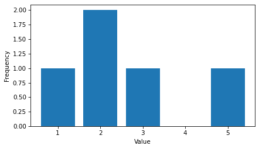
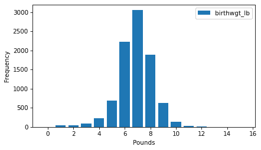
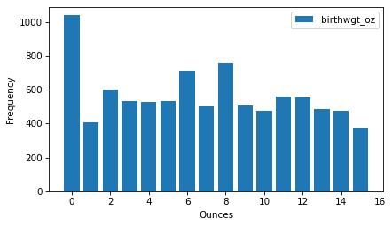
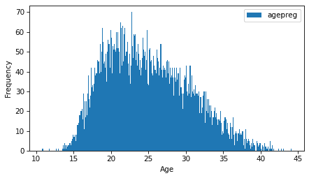
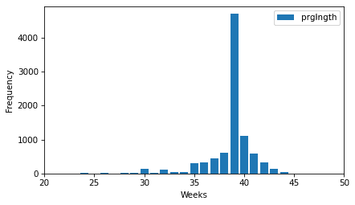
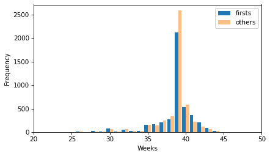

# 分布

> [原文链接](https://allendowney.github.io/ThinkStats/chap02.html)

本章介绍了统计学中最基本的思想之一，即分布。我们将从频率表开始——它表示数据集中的值及其出现的次数——并使用它们来探索来自国家家庭增长调查（NSFG）的数据。我们还将寻找极端或错误值，称为异常值，并考虑处理它们的方法。

[在此处运行此笔记本](https://colab.research.google.com/github/AllenDowney/ThinkStats/blob/v3/nb/chap02.ipynb)。

```py
from  os.path  import basename, exists

def  download(url):
    filename = basename(url)
    if not exists(filename):
        from  urllib.request  import urlretrieve

        local, _ = urlretrieve(url, filename)
        print("Downloaded " + local)

download("https://github.com/AllenDowney/ThinkStats/raw/v3/nb/thinkstats.py") 
```

```py
try:
    import  empiricaldist
except ImportError:
    %pip install empiricaldist 
```

```py
import  numpy  as  np
import  matplotlib.pyplot  as  plt
from  thinkstats  import decorate 
```

## 频率表

描述变量的一个方法是一个**频率表**，它包含变量的值及其**频率**——也就是说，每个值出现的次数。这种描述被称为变量的**分布**。

为了表示分布，我们将使用一个名为 `empiricaldist` 的库。在这个上下文中，“empirical”意味着这些分布是基于数据而不是数学模型。`empiricaldist` 提供了一个名为 `FreqTab` 的类，我们可以使用它来计算和绘制频率表。我们可以这样导入它。

```py
from  empiricaldist  import FreqTab 
```

为了展示它是如何工作的，我们将从一个小的值列表开始。

```py
t = [1.0, 2.0, 2.0, 3.0, 5.0] 
```

`FreqTab` 提供了一个名为 `from_seq` 的方法，它接受一个序列并将其转换为 `FreqTab` 对象。

```py
ftab = FreqTab.from_seq(t)
ftab 
```

|  | freqs |
| --- | --- |
| 1.0 | 1 |
| 2.0 | 2 |
| 3.0 | 1 |
| 5.0 | 1 |

`FreqTab` 对象是一种包含值及其频率的 Pandas `Series`。在这个例子中，值 `1.0` 对应频率 1，值 `2.0` 对应频率 2，等等。

`FreqTab` 提供了一个名为 `bar` 的方法，它将频率表绘制为条形图。

```py
ftab.bar()
decorate(xlabel="Value", ylabel="Frequency") 
```



因为 `FreqTab` 是 Pandas `Series`，我们可以使用方括号运算符来查找值并获取其频率。

```py
ftab[2.0] 
```

```py
np.int64(2) 
```

但与 Pandas `Series` 不同，我们还可以像函数一样调用 `FreqTab` 对象来查找值。

```py
ftab(2.0) 
```

```py
np.int64(2) 
```

如果我们查找 `FreqTab` 中不存在的值，函数语法将返回 `0`。

```py
ftab(4.0) 
```

```py
0 
```

`FreqTab` 对象有一个名为 `qs` 的属性，它返回一个值数组——`qs` 代表数量，尽管技术上并非所有值都是数量。

```py
ftab.qs 
```

```py
array([1., 2., 3., 5.]) 
```

`FreqTab` 还有一个名为 `fs` 的属性，它返回一个频率数组。

```py
ftab.fs 
```

```py
array([1, 2, 1, 1]) 
```

`FreqTab` 提供了一个 `items` 方法，我们可以使用它来遍历数量-频率对：

```py
for x, freq in ftab.items():
    print(x, freq) 
```

```py
1.0 1
2.0 2
3.0 1
5.0 1 
```

我们将在继续的过程中看到更多的 `FreqTab` 方法。

## NSFG 分布

当你开始使用一个新的数据集时，我建议你逐个探索你计划使用的变量，一个好的开始方式是查看频率表。

作为例子，让我们看看国家家庭增长调查（NSFG）的数据。在前一章中，我们下载了这个数据集，将其读入 Pandas `DataFrame`，并对几个变量进行了清理。我们用来加载数据和清理数据的代码在一个名为`nsfg.py`的模块中——关于安装此模块的说明在本章的笔记本中。

以下单元格下载数据文件并安装`statadict`，这是我们读取数据所需的。

```py
try:
    import  statadict
except ImportError:
    %pip install statadict 
```

```py
download("https://github.com/AllenDowney/ThinkStats/raw/v3/nb/nsfg.py")
download("https://github.com/AllenDowney/ThinkStats/raw/v3/data/2002FemPreg.dct")
download("https://github.com/AllenDowney/ThinkStats/raw/v3/data/2002FemPreg.dat.gz") 
```

我们可以这样导入它并读取妊娠文件。

```py
from  nsfg  import read_fem_preg

preg = read_fem_preg() 
```

在本章的例子中，我们将关注以活产结束的妊娠。我们可以使用`query`方法来选择`outcome`为 1 的行。

```py
live = preg.query("outcome == 1") 
```

在传递给`query`的字符串中，像`outcome`这样的变量名指的是`DataFrame`中的列名。这个字符串还可以包含像`==`这样的运算符和像`1`这样的操作数。

现在我们可以使用`FreqTab.from_seq`来计算每个数量在`birthwgt_lb`（出生体重的磅部分）中出现的次数。`name`参数给`FreqTab`对象一个名称，当我们在绘图时用作标签。

```py
ftab_lb = FreqTab.from_seq(live["birthwgt_lb"], name="birthwgt_lb") 
```

这里是分布的形状。

```py
ftab_lb.bar()
decorate(xlabel="Pounds", ylabel="Frequency") 
```



看到这样的分布，我们首先注意到的是形状，它类似于著名的钟形曲线，更正式地称为正态分布或高斯分布。分布的另一个显著特征是**峰值**，即最常见的值。要找到峰值，我们可以使用`idxmax`方法，它找到与最高频率相关的数量。

```py
ftab_lb.idxmax() 
```

```py
np.float64(7.0) 
```

`FreqTab`提供了一个名为`mode`的方法，它做的是同样的事情。

```py
ftab_lb.mode() 
```

```py
np.float64(7.0) 
```

在这个分布中，峰值在 7 磅。

作为另一个例子，这是`birthwgt_oz`的频率表，它是出生体重的盎司部分。

```py
ftab_oz = FreqTab.from_seq(live["birthwgt_oz"], name="birthwgt_oz")
ftab_oz.bar()
decorate(xlabel="Ounces", ylabel="Frequency") 
```



因为自然界不知道磅和盎司，我们可能会预期`birthwgt_oz`的所有值出现的可能性都是相同的——也就是说，这个分布应该是**均匀分布**。但看起来`0`比其他数值更常见，而`1`和`15`则不那么常见，这表明受访者会将接近整数磅的出生体重四舍五入。

作为另一个例子，让我们看看`agepreg`的频率表，这是妊娠结束时母亲的年龄。

```py
ftab_age = FreqTab.from_seq(live["agepreg"], name="agepreg") 
```

在 NSFG 中，年龄以年和月为单位记录，因此比我们之前看到的分布有更多的唯一值。因此，我们将`width=0.1`作为关键字参数传递给`bar`方法，该方法调整条形的宽度，以便它们不会重叠太多。

```py
ftab_age.bar(width=0.1)
decorate(xlabel="Age", ylabel="Frequency") 
```



分布非常粗略地呈钟形，但它是**右偏**的——也就是说，尾巴比左边延伸得更远。

最后，让我们看看`prglngth`的频率表，这是怀孕的周数。`xlim`参数将 x 轴的极限设置为从 20 周到 50 周的范围——这个范围之外没有很多值，它们可能是错误的。

```py
ftab_length = FreqTab.from_seq(live["prglngth"], name="prglngth")
ftab_length.bar()
decorate(xlabel="Weeks", ylabel="Frequency", xlim=[20, 50]) 
```



最常见的数量是 39 周。左尾比右尾长——早产的婴儿很常见，但怀孕很少超过 43 周，如果确实如此，医生通常会干预。

## 异常值

查看频率表，很容易识别分布的形状和最常见的数量，但稀有数量并不总是显而易见。在继续之前，检查**异常值**是个好主意，这些异常值可能是测量或记录错误，也可能是对稀有事件的准确报告。

为了识别异常值，以下函数接受一个`FreqTab`对象和一个整数`n`，并使用切片索引来选择`n`个最小的数量及其频率。

```py
def  smallest(ftab, n=10):
    return ftab[:n] 
```

在`prglngth`的频率表中，这里有 10 个最小的值。

```py
smallest(ftab_length) 
```

```py
prglngth
0     1
4     1
9     1
13    1
17    2
18    1
19    1
20    1
21    2
22    7
Name: prglngth, dtype: int64 
```

由于我们选择了活产行，怀孕长度小于 10 周肯定是错误。最可能的解释是结果没有被正确编码。长度超过 30 周可能是合法的。在 10 到 30 周之间，很难确定——一些数量可能是错误，但一些是正确记录的早产儿。

以下函数从`FreqTab`对象中选择最大值。

```py
def  largest(ftab, n=10):
    return ftab[-n:] 
```

这是数据集中最长的怀孕长度。

```py
largest(ftab_length) 
```

```py
prglngth
40    1116
41     587
42     328
43     148
44      46
45      10
46       1
47       1
48       7
50       2
Name: prglngth, dtype: int64 
```

再次强调，其中一些值可能是错误。大多数医生建议如果怀孕超过 41 周就进行引产，所以 50 周似乎不太可能是正确的。但是，在确定错误值和可能为稀有事件正确报告的值之间没有明确的界限。

处理异常值最好的方法取决于“领域知识”——也就是说，关于数据来源及其含义的信息。并且它取决于你计划执行的分析。

在这个例子中，激励问题是初生儿是否比其他婴儿更早或更晚。所以我们将使用不会因少量错误值而受到太大影响的统计数据。

## 初生儿

现在让我们比较初生儿和其他人的怀孕长度分布。我们可以使用`query`方法来选择代表初生儿和其他人的行。

```py
firsts = live.query("birthord == 1")
others = live.query("birthord != 1") 
```

为每个组制作一个`FreqTab`的怀孕长度表。

```py
ftab_first = FreqTab.from_seq(firsts["prglngth"], name="firsts")
ftab_other = FreqTab.from_seq(others["prglngth"], name="others") 
```

以下函数可以并排绘制两个频率表。

```py
def  two_bar_plots(ftab1, ftab2, width=0.45):
    ftab1.bar(align="edge", width=-width)
    ftab2.bar(align="edge", width=width, alpha=0.5) 
```

这是它们的分布情况。

```py
two_bar_plots(ftab_first, ftab_other)
decorate(xlabel="Weeks", ylabel="Frequency", xlim=[20, 50]) 
```



分布形状或异常值之间没有明显的差异。看起来更多的非初产妇在 39 周出生，但数据集中有更多的非初产妇，所以我们不应该直接比较计数。

```py
firsts["prglngth"].count(), others["prglngth"].count() 
```

```py
(np.int64(4413), np.int64(4735)) 
```

比较分布的均值，初产妇的平均出生时间似乎稍晚一些。

```py
first_mean = firsts["prglngth"].mean()
other_mean = others["prglngth"].mean()
first_mean, other_mean 
```

```py
(np.float64(38.60095173351461), np.float64(38.52291446673706)) 
```

但差异仅为 0.078 周，大约是 13 小时。

```py
diff = first_mean - other_mean
diff, diff * 7 * 24 
```

```py
(np.float64(0.07803726677754952), np.float64(13.11026081862832)) 
```

这种明显的差异可能有几个可能的原因：

+   首胎和其他人之间在平均怀孕长度上可能存在实际差异。

+   我们在这个数据集中看到的这种明显的差异可能是抽样过程中的偏差的结果——也就是说，调查受访者的选择。

+   这种明显的差异可能是测量误差的结果——例如，初产妇或其他人的自我报告的怀孕长度可能更准确。

+   这种明显的差异可能是抽样过程中的随机变化的结果。

在后面的章节中，我们将更仔细地考虑这些可能的原因，但现在我们将这个结果视为事实：在这个数据集中，这些组之间在怀孕长度上存在微小差异。

## 效应量

这种差异有时被称为“效应”。有几种方法可以量化效应的大小。最简单的是报告绝对差异——在这个例子中，差异是 0.078 周。

另一种方法是报告相对差异。例如，我们可能会说，初产妇的平均怀孕时间比其他人长 0.2%。

```py
diff / live["prglngth"].mean() * 100 
```

```py
np.float64(0.20237586646738304) 
```

另一种选择是报告一个**标准化**的效应量，这是一个旨在以不同数量和不同组之间可比较的方式量化效应大小的统计量。

标准化意味着我们以标准差的倍数来表示差异。因此，我们可能会倾向于写一些像这样的事情。

```py
diff / live["prglngth"].std() 
```

```py
np.float64(0.028877623375210403) 
```

但请注意，我们使用了两组来计算标准差。如果两组有显著差异，当我们把它们放在一起时，标准差会比任何一个组都大，这可能会使效应量看起来很小。

另一种选择是只使用一个组的标准差，但不确定是哪一个。因此，我们可以取两个标准差的平均值，但如果组的大小不同，这会给一个组过多的权重，而给另一个组不足的权重。

一种常见的解决方案是使用**合并标准差**，它是合并方差的平方根，而合并方差是各组方差的加权总和。为了计算它，我们将从方差开始。

```py
group1, group2 = firsts["prglngth"], others["prglngth"] 
```

```py
v1, v2 = group1.var(), group2.var() 
```

这里是加权总和，组大小作为权重。

```py
n1, n2 = group1.count(), group2.count()
pooled_var = (n1 * v1 + n2 * v2) / (n1 + n2) 
```

最后，这是合并标准差。

```py
np.sqrt(pooled_var) 
```

```py
np.float64(2.7022108144953862) 
```

合并标准差位于各组标准差之间。

```py
firsts["prglngth"].std(), others["prglngth"].std() 
```

```py
(np.float64(2.7919014146687204), np.float64(2.6158523504392375)) 
```

使用合并标准差的标准效应量被称为**Cohen 效应量**。这里有一个计算它的函数。

```py
def  cohen_effect_size(group1, group2):
    diff = group1.mean() - group2.mean()

    v1, v2 = group1.var(), group2.var()
    n1, n2 = group1.count(), group2.count()
    pooled_var = (n1 * v1 + n2 * v2) / (n1 + n2)

    return diff / np.sqrt(pooled_var) 
```

下面是平均怀孕长度差异的效应量。

```py
cohen_effect_size(firsts["prglngth"], others["prglngth"]) 
```

```py
np.float64(0.028879044654449834) 
```

在本例中，差异为 0.029 个标准差，这是一个小的差异。为了更好地理解这一点，男性和女性之间身高的差异大约是 1.7 个标准差。

## 报告结果

我们已经看到了几种描述第一胎和其他婴儿之间怀孕长度差异（如果有的话）的方法。我们应该如何报告这些结果？

答案取决于提问者是谁。科学家可能对任何（真实）效应都感兴趣，无论大小如何。医生可能只关心那些**实际有意义的**效应——也就是说，在实践中有意义的差异。一个孕妇可能对与她相关的研究结果感兴趣，比如早产的几率或晚产的几率。

你如何报告结果也取决于你的目标。如果你试图证明一个效应的重要性，你可能会选择强调差异的汇总统计量。如果你试图安慰一个病人，你可能会选择将差异置于背景中的统计量。

当然，你的决定也应该受到专业伦理的指导。说服人是可以的——你应该设计清晰讲述故事的统计报告和可视化。但你也应该尽力使你的报告诚实，并承认不确定性和局限性。

## 术语表

+   **分布**：数据集中值及其出现频率的集合。

+   **频率表**：从值到频率的映射。

+   **频率**：一个值在样本中出现的次数。

+   **偏态**：如果一个分布是不对称的，且极端数值在一个方向上比另一个方向延伸得更远，则该分布是偏态的。

+   **众数**：样本中最频繁的数值，或最频繁的数值之一。

+   **均匀分布**：一个分布，其中所有数值具有相同的频率。

+   **异常值**：分布中的一个极端数值。

+   **标准化**：如果一个统计量以不同数据集和领域可比的术语表示，则该统计量是标准化的。

+   **合并标准差**：一个统计量，它结合了两个或更多组的数据来计算一个共同的标准差。

+   **Cohen 效应量**：一个标准化的统计量，用于量化两组均值之间的差异。

+   **实际有意义的**：如果一个效应足够大，在实践中有意义，则该效应是实际有意义的。

## 练习

对于本章的练习，我们将加载 NSFG 女性受访者文件，该文件包含每个女性受访者的一个记录。下载数据和代码簿的说明在本书的笔记本中。

```py
download("https://github.com/AllenDowney/ThinkStats/raw/v3/data/2002FemResp.dct")
download("https://github.com/AllenDowney/ThinkStats/raw/v3/data/2002FemResp.dat.gz") 
```

女性受访者文件代码簿位于[`ftp.cdc.gov/pub/Health_Statistics/NCHS/Dataset_Documentation/NSFG/Cycle6Codebook-Female.pdf`](https://ftp.cdc.gov/pub/Health_Statistics/NCHS/Dataset_Documentation/NSFG/Cycle6Codebook-Female.pdf)。

`nsfg.py`模块提供了一个函数，用于读取女性受访者文件，清理一些变量，并返回一个`DataFrame`。

```py
from  nsfg  import read_fem_resp

resp = read_fem_resp()
resp.shape 
```

```py
(7643, 3092) 
```

这个`DataFrame`包含 3092 列，但我们只会使用其中的一小部分。

### 练习 2.1

我们将从`totincr`开始，它记录受访者的家庭总收入，用 1 到 14 的值进行编码。你可以阅读受访者文件的代码簿，以查看每个值代表什么收入水平。

创建一个表示这个变量分布的`FreqTab`对象，并将其绘制为条形图。

### 练习 2.2

制作一个记录每个受访者所生育子女数量的`parity`列频率表。你将如何描述这个分布的形状？

使用`largest`函数找到`parity`的最大值。你认为是否有任何值是错误的？

### 练习 2.3

让我们调查收入较高或较低的女性生育的孩子数量。使用查询方法选择收入最高的受访者（第 14 级）。仅绘制高收入受访者的`parity`频率表。

比较高收入受访者和其他人的平均`parity`。

计算这个差异的 Cohen 效应量。它与第一胎和其他人的怀孕长度差异相比如何？

这些结果是否表明收入较高的人生育的孩子较少，或者你能想到其他解释这个明显差异的原因吗？

[Think Stats: Python 中的探索性数据分析，第 3 版](https://allendowney.github.io/ThinkStats/index.html)

版权所有 2024 [艾伦·B·唐尼](https://allendowney.com)

代码许可：[MIT 许可](https://mit-license.org/)

文本许可：[Creative Commons Attribution-NonCommercial-ShareAlike 4.0 国际](https://creativecommons.org/licenses/by-nc-sa/4.0/)
