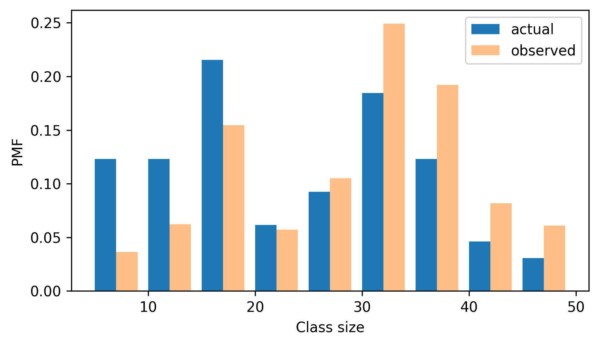
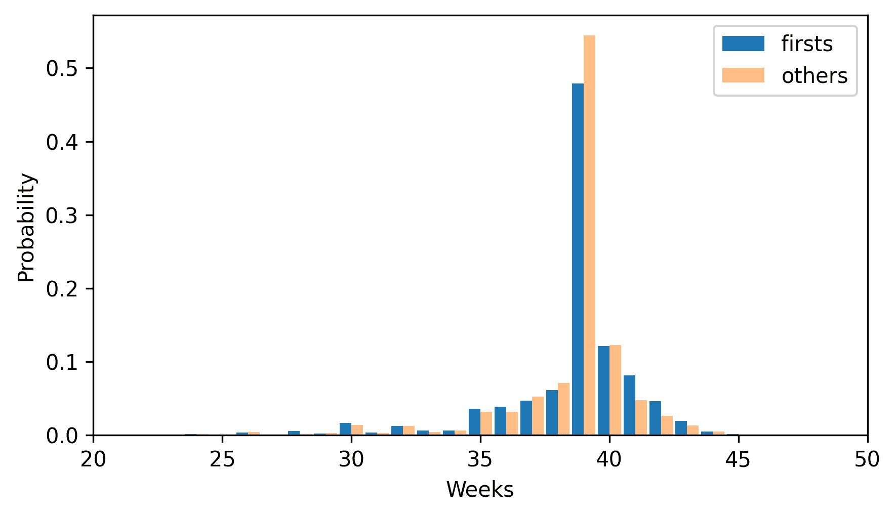
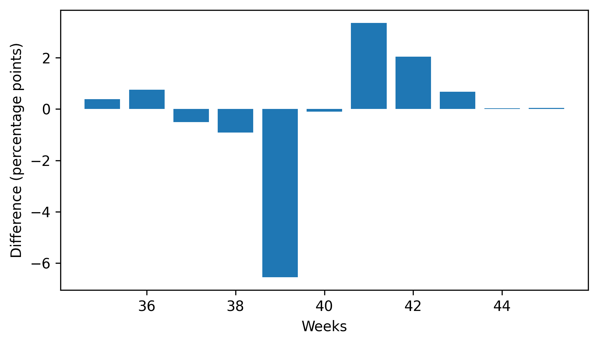
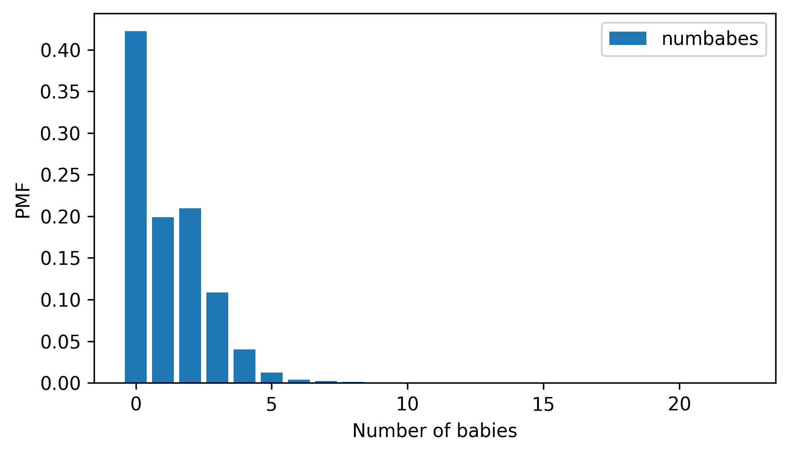

# 概率质量函数

> 原文：[`allendowney.github.io/ThinkStats/chap03.html`](https://allendowney.github.io/ThinkStats/chap03.html)

在上一章中，我们使用`FreqTab`对象表示分布，它包含一组值及其频率——即每个值出现的次数。在这一章中，我们将介绍另一种描述分布的方法，即概率质量函数（PMF）。

为了表示概率质量函数（PMF），我们将使用一个名为`Pmf`的对象，它包含一组值及其概率。我们将使用`Pmf`对象来计算分布的均值和方差，以及偏度，这表明它是左偏还是右偏。最后，我们将探讨一个称为“检查悖论”的现象如何导致样本给出对分布的偏见观点。

[在此处运行此笔记本](https://colab.research.google.com/github/AllenDowney/ThinkStats/blob/v3/nb/chap03.ipynb)。

```py
from  os.path  import basename, exists

def  download(url):
    filename = basename(url)
    if not exists(filename):
        from  urllib.request  import urlretrieve

        local, _ = urlretrieve(url, filename)
        print("Downloaded " + local)

download("https://github.com/AllenDowney/ThinkStats/raw/v3/nb/thinkstats.py") 
```

```py
try:
    import  empiricaldist
except ImportError:
    %pip install empiricaldist 
```

```py
import  numpy  as  np
import  pandas  as  pd
import  matplotlib.pyplot  as  plt

from  thinkstats  import decorate 
```

## PMFs

`Pmf`对象就像一个包含概率而不是频率的`FreqTab`。因此，创建`Pmf`的一种方法是从一个`FreqTab`开始。例如，这里有一个`FreqTab`，它表示一个短序列中值的分布。

```py
from  empiricaldist  import FreqTab

ftab = FreqTab.from_seq([1, 2, 2, 3, 5])
ftab 
```

|  | freqs |
| --- | --- |
| 1 | 1 |
| 2 | 2 |
| 3 | 1 |
| 5 | 1 |

频率的总和是原始序列的大小。

```py
n = ftab.sum()
n 
```

```py
np.int64(5) 
```

如果我们将频率除以`n`，它们代表比例，而不是计数。

```py
pmf = ftab / n
pmf 
```

|  | probs |
| --- | --- |
| 1 | 0.2 |
| 2 | 0.4 |
| 3 | 0.2 |
| 5 | 0.2 |

这个结果表示序列中有 20%的值是 1，40%是 2，依此类推。

我们也可以从以下意义上将这些比例视为概率：如果我们从原始序列中随机选择一个值，选择值为 1 的概率是 0.2，选择值为 2 的概率是 0.4，依此类推。

因为我们将除以`n`，所以概率的总和是 1，这意味着这个分布是**归一化的**。

```py
pmf.sum() 
```

```py
np.float64(1.0) 
```

归一化的`FreqTab`对象代表一个**概率质量函数**（PMF），之所以称为“概率质量函数”，是因为与离散值相关的概率也称为“概率质量”。

`empiricaldist`库提供了一个表示概率质量函数的`Pmf`对象，因此，我们不需要创建`FreqTab`对象然后对其进行归一化，我们可以直接创建`Pmf`对象。

```py
from  empiricaldist  import Pmf

pmf = Pmf.from_seq([1, 2, 2, 3, 5])
pmf 
```

|  | probs |
| --- | --- |
| 1 | 0.2 |
| 2 | 0.4 |
| 3 | 0.2 |
| 5 | 0.2 |

`Pmf`是归一化的，所以总概率是 1。

```py
pmf.sum() 
```

```py
np.float64(1.0) 
```

`Pmf`和`FreqTab`对象在许多方面都很相似。为了查找与一个值相关的概率，我们可以使用方括号操作符。

```py
pmf[2] 
```

```py
np.float64(0.4) 
```

或者使用括号来像函数一样调用`Pmf`。

```py
pmf(2) 
```

```py
np.float64(0.4) 
```

要给一个值分配一个概率，你必须使用方括号操作符。

```py
pmf[2] = 0.2
pmf(2) 
```

```py
np.float64(0.2) 
```

你可以通过增加与一个值相关的概率来修改现有的`Pmf`：

```py
pmf[2] += 0.3
pmf[2] 
```

```py
np.float64(0.5) 
```

或者你可以将一个概率乘以一个因子：

```py
pmf[2] *= 0.5
pmf[2] 
```

```py
np.float64(0.25) 
```

如果你修改一个`Pmf`，结果可能不会归一化——也就是说，概率可能不再加起来等于 1。

```py
pmf.sum() 
```

```py
np.float64(0.8500000000000001) 
```

`normalize` 方法通过除以总和来重新标准化 `Pmf`，并返回总和。

```py
pmf.normalize() 
```

```py
np.float64(0.8500000000000001) 
```

`Pmf` 对象提供了一个 `copy` 方法，这样你就可以创建并修改一个副本，而不会影响原始对象。

```py
pmf.copy() 
```

|  | probs |
| --- | --- |
| 1 | 0.235294 |
| 2 | 0.294118 |
| 3 | 0.235294 |
| 5 | 0.235294 |

与 `FreqTab` 对象一样，`Pmf` 对象有一个 `qs` 属性，可以访问数量，还有一个 `ps` 属性，可以访问概率。

它还有一个 `bar` 方法，可以将 `Pmf` 绘制为条形图，还有一个 `plot` 方法，可以将它绘制为折线图。

## 总结 PMF

在 第一章 中，我们通过将元素相加并除以元素数量来计算样本的平均值。这里有一个简单的例子。

```py
seq = [1, 2, 2, 3, 5]

n = len(seq)
mean = np.sum(seq) / n
mean 
```

```py
np.float64(2.6) 
```

现在假设我们计算序列值的 PMF。

```py
pmf = Pmf.from_seq(seq) 
```

给定 `Pmf`，我们仍然可以计算平均值，但过程不同——我们必须将概率和数量相乘，然后将乘积相加。

```py
mean = np.sum(pmf.ps * pmf.qs)
mean 
```

```py
np.float64(2.6) 
```

注意，我们不需要除以 `n`，因为我们已经在标准化 `Pmf` 时做了这件事。`Pmf` 对象有一个 `mean` 方法，做同样的事情。

```py
pmf.mean() 
```

```py
np.float64(2.6) 
```

给定一个 `Pmf`，我们可以通过计算每个数量与平均值的偏差来计算方差。

```py
deviations = pmf.qs - mean 
```

然后我们将平方偏差乘以概率，并将乘积相加。

```py
var = np.sum(pmf.ps * deviations**2)
var 
```

```py
np.float64(1.84) 
```

`var` 方法做同样的事情。

```py
pmf.var() 
```

```py
np.float64(1.84) 
```

从方差中，我们可以按照通常的方式计算标准差。

```py
np.sqrt(var) 
```

```py
np.float64(1.3564659966250536) 
```

或者 `std` 方法做同样的事情。

```py
pmf.std() 
```

```py
np.float64(1.3564659966250536) 
```

`Pmf` 还提供了一个 `mode` 方法，可以找到概率最高的值。

```py
pmf.mode() 
```

```py
np.int64(2) 
```

随着我们继续前进，我们将看到更多的方法，但这些都足以开始。

## 班级规模悖论

作为使用 `Pmf` 对象可以做到的事情的例子，让我们考虑一个我称之为“班级规模悖论”的现象。

在许多美国大学和学院中，学生与教师的比例大约是 10:1。但学生常常惊讶地发现，他们中的许多课程的学生人数超过 10 人，有时甚至更多。这种差异有两个原因：

+   学生通常每学期选修 4 或 5 门课程，但教授通常只教 1 或 2 门。

+   小班的学生人数少，大班的学生人数多。

第一个影响是明显的，至少一旦指出；第二个影响更为微妙。让我们看一个例子。假设某大学在某个学期提供了 65 门课程，并且我们给出了以下大小范围内的课程数量。

```py
ranges = pd.interval_range(start=5, end=50, freq=5, closed="left")
ranges.name = "class size"

data = pd.DataFrame(index=ranges)
data["count"] = [8, 8, 14, 4, 6, 12, 8, 3, 2]
data 
```

|  | count |
| --- | --- |
| class size |  |
| --- | --- |
| [5, 10) | 8 |
| [10, 15) | 8 |
| [15, 20) | 14 |
| [20, 25) | 4 |
| [25, 30) | 6 |
| [30, 35) | 12 |
| [35, 40) | 8 |
| [40, 45) | 3 |
| [45, 50) | 2 |

Pandas 函数 `interval_range` 创建一个 `Index`，其中每个标签代表一个值范围。符号 `[5, 10)` 表示 `5` 包含在区间内，而 `10` 不包含。由于我们不知道每个区间内班级的大小，让我们假设所有大小都是范围的中点。

```py
sizes = ranges.left + 2
sizes 
```

```py
Index([7, 12, 17, 22, 27, 32, 37, 42, 47], dtype='int64') 
```

现在让我们创建一个代表班级规模分布的`Pmf`。因为我们知道规模及其频率，我们可以直接创建一个`Pmf`，将计数、规模和名称作为参数传递。当我们对新的`Pmf`进行归一化时，结果是计数的总和。

```py
counts = data["count"]
actual_pmf = Pmf(counts, sizes, name="actual")
actual_pmf.normalize() 
```

```py
np.int64(65) 
```

如果你向大学询问平均班级规模，他们会报告这个分布的平均值，即 23.7。

```py
actual_pmf.mean() 
```

```py
np.float64(23.692307692307693) 
```

但如果你对一组学生进行调查，询问他们班级中有多少学生，并计算平均值，平均数会更大。让我们看看会大多少。

以下函数接受实际的班级规模`Pmf`，并创建一个新的`Pmf`，该`Pmf`代表学生观察到的班级规模。两个分布中的数量是相同的，但分布中的概率是乘以数量的，因为在规模为`x`的班级中，有`x`名学生观察到了这个班级。因此，观察到一个班级的概率与其规模成正比。

```py
def  bias(pmf, name):
    # multiply each probability by class size
    ps = pmf.ps * pmf.qs

    # make a new Pmf and normalize it
    new_pmf = Pmf(ps, pmf.qs, name=name)
    new_pmf.normalize()
    return new_pmf 
```

现在我们可以计算学生观察到的有偏差的`Pmf`。

```py
observed_pmf = bias(actual_pmf, name="observed") 
```

这里展示了这两个分布的形状。

```py
from  thinkstats  import two_bar_plots

two_bar_plots(actual_pmf, observed_pmf, width=2)
decorate(xlabel="Class size", ylabel="PMF") 
```



在观察到的分布中，小班级较少，大班级较多。有偏差的平均值是 29.1，比实际平均值高出近 25%。

```py
observed_pmf.mean() 
```

```py
np.float64(29.123376623376622) 
```

此操作也可以逆转。假设你想找到大学中班级规模分布，但你无法获得可靠的数据。一个选择是随机抽取学生样本，并询问他们班级中有多少学生。

由于我们刚刚看到的原因，结果会有偏差，但你可以用它来估计实际的分布。下面是一个通过除以大小来对`Pmf`进行去偏的函数。

```py
def  unbias(pmf, name):
    # divide each probability by class size
    ps = pmf.ps / pmf.qs

    new_pmf = Pmf(ps, pmf.qs, name=name)
    new_pmf.normalize()
    return new_pmf 
```

下面是结果。

```py
debiased_pmf = unbias(observed_pmf, "debiased")
debiased_pmf.mean() 
```

```py
np.float64(23.692307692307693) 
```

去偏`Pmf`的均值与最初实际分布的均值相同。

如果你认为这个例子很有趣，你可能喜欢《很可能是在过度思考》的第二章，其中包含了这个以及其他几个被称为“检查悖论”的例子。

## NSFG 数据

在上一章中，我们绘制了第一胎和其他婴儿的怀孕长度频率表。但由于组的大小不同，我们无法直接比较频率表。因为 PMFs 是归一化的，我们可以比较它们。所以让我们再次加载 NSFG 数据，并创建`Pmf`对象来表示怀孕长度的分布。

以下单元格下载数据文件并安装`statadict`，这是我们读取数据所需的。

```py
try:
    import  statadict
except ImportError:
    %pip install statadict 
```

```py
download("https://github.com/AllenDowney/ThinkStats/raw/v3/nb/nsfg.py")
download("https://github.com/AllenDowney/ThinkStats/raw/v3/data/2002FemPreg.dct")
download("https://github.com/AllenDowney/ThinkStats/raw/v3/data/2002FemPreg.dat.gz") 
```

`nsfg`模块提供了一个`read_nsfg_groups`函数，该函数读取数据，选择代表活产行的行，并将活产行分为第一胎和其他。它返回三个`DataFrame`对象。

```py
from  nsfg  import get_nsfg_groups

live, firsts, others = get_nsfg_groups() 
```

我们可以使用`firsts`和`others`来为每个组中的怀孕长度创建一个`Pmf`。

```py
first_pmf = Pmf.from_seq(firsts["prglngth"], name="firsts")
other_pmf = Pmf.from_seq(others["prglngth"], name="others") 
```

这里是第一胎和其他婴儿的 PMFs，以条形图的形式展示。

```py
two_bar_plots(first_pmf, other_pmf)
decorate(xlabel="Weeks", ylabel="Probability", xlim=[20, 50]) 
```



通过绘制 PMF 而不是频率表，我们可以比较两个分布，而不会因为样本大小的差异而误导。根据此图，第一胎婴儿似乎比其他人更不可能准时到达（第 39 周）并且更有可能迟到（第 41 周和第 42 周）。

## 其他可视化

FreqTabograms 和 PMFs 在探索数据并尝试识别模式和关系时非常有用。一旦你有了想法，下一步就是设计一个可视化，尽可能清晰地展示你已识别的模式。

在 NSFG 数据中，分布的最大差异接近峰值。因此，在图表的这一部分进行放大，并选择 35 周到 46 周的数据是有意义的。

当我们像调用函数一样调用`Pmf`对象时，我们可以查找一系列数量并获取一系列概率。

```py
weeks = range(35, 46)
first_pmf(weeks) 
```

```py
array([0.03602991, 0.03897575, 0.04713347, 0.06163608, 0.4790392 ,
       0.12145932, 0.08157716, 0.04645366, 0.01971448, 0.00521187,
       0.00135962]) 
```

```py
other_pmf(weeks) 
```

```py
array([0.03210137, 0.03146779, 0.05216473, 0.07074974, 0.54466737,
       0.12249208, 0.04794087, 0.02597677, 0.01288279, 0.00485744,
       0.00084477]) 
```

因此，我们可以这样计算概率的差异。

```py
diffs = first_pmf(weeks) - other_pmf(weeks)
diffs 
```

```py
array([ 0.00392854,  0.00750796, -0.00503126, -0.00911366, -0.06562817,
       -0.00103276,  0.03363629,  0.02047689,  0.00683169,  0.00035443,
        0.00051485]) 
```

这是它们的模样，乘以 100 以表示百分比点的差异。

```py
plt.bar(weeks, diffs * 100)
decorate(xlabel="Weeks", ylabel="Difference (percentage points)") 
```



此图使模式更清晰：第一胎婴儿在 39 周出生的可能性较小，而在 41 周和 42 周出生的可能性略大。

当我们在样本中看到这种模式时，我们不能确定它也在总体中成立——我们也不知道我们是否会在来自同一总体的另一个样本中看到它。我们将在第九章（chap09.html#chapter-hypothesis-testing）中重新审视这个问题。

## 术语表

本章的新术语不如前几章多。

+   **归一化**：如果一组概率的总和为 1，则称其为归一化。

+   **概率质量函数（PMF）**：一个将每个数量映射到其概率的函数。

## 练习

对于本章的练习，我们将使用 NSFG 受访者文件，其中每行代表一个受访者。下载数据的说明在本书的笔记本中。

```py
download("https://github.com/AllenDowney/ThinkStats/raw/v3/data/2002FemResp.dct")
download("https://github.com/AllenDowney/ThinkStats/raw/v3/data/2002FemResp.dat.gz") 
```

此数据集的代码簿位于[`ftp.cdc.gov/pub/Health_Statistics/NCHS/Dataset_Documentation/NSFG/Cycle6Codebook-Female.pdf`](https://ftp.cdc.gov/pub/Health_Statistics/NCHS/Dataset_Documentation/NSFG/Cycle6Codebook-Female.pdf)。

`nsfg.py`模块提供了一个函数，用于读取受访者文件并返回一个`DataFrame`。

```py
from  nsfg  import read_fem_resp

resp = read_fem_resp()
resp.shape 
```

```py
(7643, 3092) 
```

此`DataFrame`包含 7643 行和 3092 列。

### 练习 3.1

选择`numbabes`列，该列记录每个受访者的“出生存活婴儿数量”。创建一个`FreqTab`对象并显示该列值的频率。检查它们是否与代码簿中的频率一致。是否有任何特殊值应该替换为`NaN`？

然后创建一个`Pmf`对象并将其作为条形图绘制。分布是对称的，左偏斜还是右偏斜？

```py
pmf.bar()
decorate(xlabel="Number of babies", ylabel="PMF") 
```



### 练习 3.2

与均值标识分布中的中心点，方差量化其分散程度一样，还有一个称为**偏度**的统计量，它表明分布是向左还是向右偏斜。

给定一个样本，我们可以通过计算立方偏差之和并除以标准差立方来计算偏度。例如，以下是计算`numbabes`偏度的方法。

```py
numbabes = resp["numbabes"].replace(97, np.nan) 
```

```py
deviations = numbabes - numbabes.mean()
skewness = np.mean(deviations**3) / numbabes.std(ddof=0) ** 3
skewness 
```

```py
np.float64(1.7018914266755958) 
```

正值表示分布向右偏斜，负值表示它向左偏斜。

如果你给定的是一个`Pmf`而不是一系列值，你可以这样计算偏度：

1.  计算每个数量在`Pmf`中与均值的偏差。

1.  将偏差值立方，乘以`Pmf`中的概率，然后将乘积相加。

1.  将总和除以标准差立方。

编写一个名为`pmf_skewness`的函数，该函数接受一个`Pmf`对象并返回其偏度。

使用你的函数和`numbabes`的`Pmf`来计算偏度，并确认你得到我们上面计算出的相同结果。

### 练习 3.3

如果你调查儿童并询问他们家庭中有多少孩子，就会出现类似班级规模悖论的情况。有多个孩子的家庭更有可能出现在你的样本中，而没有孩子的家庭根本不可能出现在样本中。

从`resp`中选择`numkdhh`，它记录了每个受访者家庭中 18 岁以下孩子的数量。为这个列中的值创建一个`Pmf`。

使用`bias`函数计算如果我们调查儿童并询问他们家庭中有多少 18 岁以下的儿童（包括他们自己）时我们会看到的分布。

绘制实际和有偏分布，并计算它们的均值。

[Think Stats: Exploratory Data Analysis in Python, 3rd Edition](https://allendowney.github.io/ThinkStats/index.html)

版权所有 2024 [艾伦·B·唐尼](https://allendowney.com)

代码许可：[MIT License](https://mit-license.org/)

文本许可：[Creative Commons Attribution-NonCommercial-ShareAlike 4.0 International](https://creativecommons.org/licenses/by-nc-sa/4.0/)
