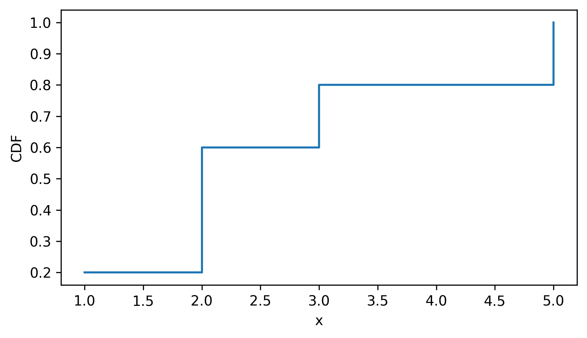
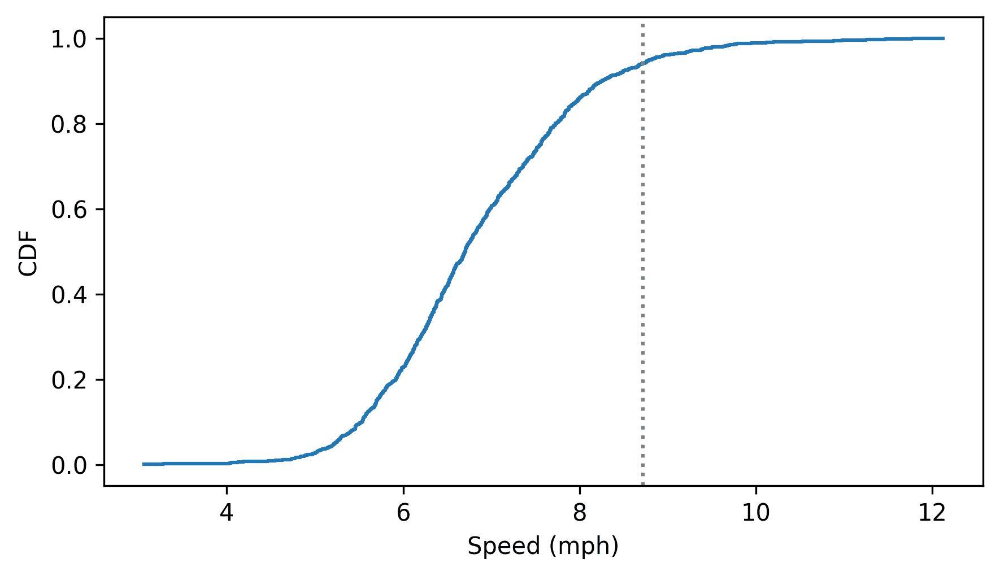
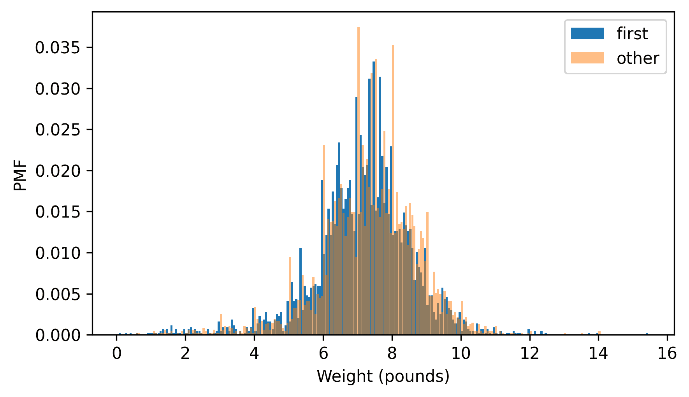
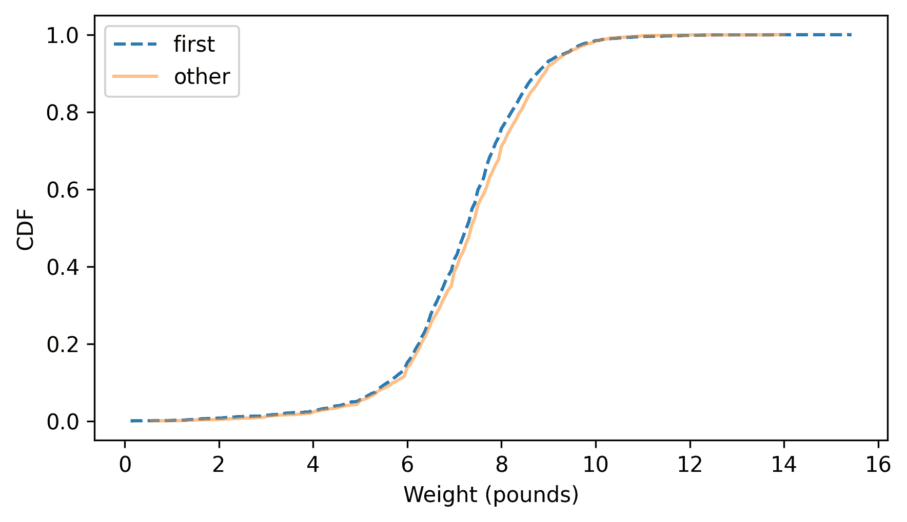
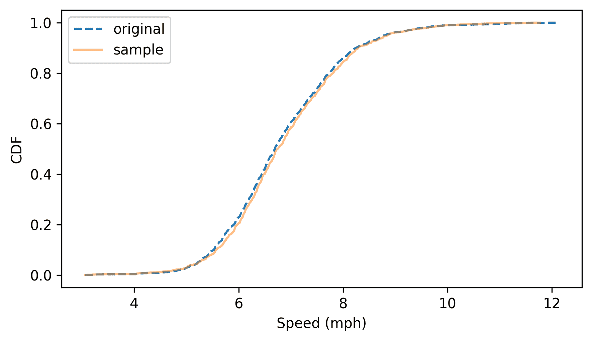
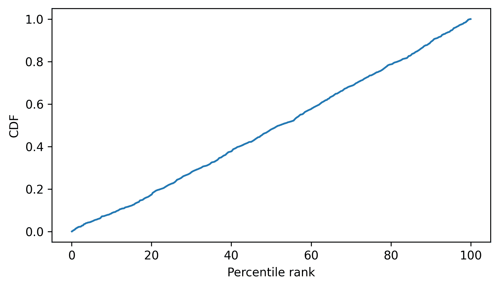

# 累积分布函数

> 原文：[`allendowney.github.io/ThinkStats/chap04.html`](https://allendowney.github.io/ThinkStats/chap04.html)

频率表和概率质量函数是表示分布最熟悉的方式，但正如我们将在本章中看到的，它们有局限性。一个替代方案是累积分布函数（CDF），它对于计算百分位数很有用，尤其是在比较分布时特别有用。

在本章中，我们还将计算基于百分位数的统计量来量化分布的位置、范围和偏度。

[在此处运行此笔记本](https://colab.research.google.com/github/AllenDowney/ThinkStats/blob/v3/nb/chap04.ipynb)。

```py
from  os.path  import basename, exists

def  download(url):
    filename = basename(url)
    if not exists(filename):
        from  urllib.request  import urlretrieve

        local, _ = urlretrieve(url, filename)
        print("Downloaded " + local)

download("https://github.com/AllenDowney/ThinkStats/raw/v3/nb/thinkstats.py") 
```

```py
try:
    import  empiricaldist
except ImportError:
    %pip install empiricaldist 
```

```py
import  numpy  as  np
import  pandas  as  pd
import  matplotlib.pyplot  as  plt

from  thinkstats  import decorate 
```

## 百分位数和百分位数排名

如果你参加过标准化考试，你可能会以原始分数和**百分位数排名**的形式收到你的成绩。在这个上下文中，百分位数排名是指得分与你相同或更低的人的百分比。所以如果你是“90 百分位数”，那么你的表现与参加考试的人中的 90%一样好或更好。

要理解百分位数和百分位数排名，让我们考虑一个基于跑步速度的例子。几年前我参加了马萨诸塞州的詹姆斯·乔伊斯漫步 10 公里公路赛跑。赛后，我下载了成绩来查看我的时间与其他跑者的比较。

下载数据的说明在本章的笔记本中。

```py
download("https://github.com/AllenDowney/ThinkStats/raw/v3/nb/relay.py")
download(
    "https://github.com/AllenDowney/ThinkStats/raw/v3/data/Apr25_27thAn_set1.shtml"
) 
```

`relay.py` 模块提供了一个函数，用于读取结果并返回 Pandas `DataFrame`。

```py
from  relay  import read_results

results = read_results()
results.head() 
```

|  | 排名 | 分组/总数 | 分组 | 总时间 | 净时间 | 每英里分钟 | 英里每小时 |
| --- | --- | --- | --- | --- | --- | --- | --- |
| 0 | 1 | 1/362 | M2039 | 30:43 | 30:42 | 4:57 | 12.121212 |
| 1 | 2 | 2/362 | M2039 | 31:36 | 31:36 | 5:06 | 11.764706 |
| 2 | 3 | 3/362 | M2039 | 31:42 | 31:42 | 5:07 | 11.726384 |
| 3 | 4 | 4/362 | M2039 | 32:28 | 32:27 | 5:14 | 11.464968 |
| 4 | 5 | 5/362 | M2039 | 32:52 | 32:52 | 5:18 | 11.320755 |

`results` 包含每个完成比赛的 1633 名跑者的一个行。我们将使用 `MPH` 这一列来量化性能，它包含每位跑者的平均速度（每小时英里）。我们将选择这一列并使用 `values` 提取速度作为一个 NumPy 数组。

```py
speeds = results["MPH"].values 
```

我以 42:44 的成绩完成比赛，因此我们可以这样找到我的行。

```py
my_result = results.query("Nettime == '42:44'")
my_result 
```

|  | 排名 | 分组/总数 | 分组 | 总时间 | 净时间 | 每英里分钟 | 英里每小时 |
| --- | --- | --- | --- | --- | --- | --- | --- |
| 96 | 97 | 26/256 | M4049 | 42:48 | 42:44 | 6:53 | 8.716707 |

我的行索引是 96，因此我们可以这样提取我的速度。

```py
my_speed = speeds[96] 
```

我们可以使用 `sum` 来计算与我速度或更慢的跑者的数量。

```py
(speeds <= my_speed).sum() 
```

```py
np.int64(1537) 
```

我们可以使用 `mean` 来计算与我速度或更慢的跑者的百分比。

```py
(speeds <= my_speed).mean() * 100 
```

```py
np.float64(94.12124923453766) 
```

结果是我的场内百分位数排名，大约是 94%。

更普遍地，以下函数计算序列中特定值的百分位数排名。

```py
def  percentile_rank(x, seq):
  """Percentile rank of x.

 x: value
 seq: sequence of values

 returns: percentile rank 0-100
 """
    return (seq <= x).mean() * 100 
```

在 `results` 中，`Division` 列表示每个跑者所在的分组，通过性别和年龄范围来识别——例如，我所在的分组是 M4049，包括 40 至 49 岁的男性跑者。我们可以使用 `query` 方法来选择我所在分组的行并提取他们的速度。

```py
my_division = results.query("Division == 'M4049'")
my_division_speeds = my_division["MPH"].values 
```

现在我们可以使用 `percentile_rank` 来计算我在我所在分组的百分位数排名。

```py
percentile_rank(my_speed, my_division_speeds) 
```

```py
np.float64(90.234375) 
```

反过来，如果我们给定一个百分位数排名，以下函数会找到序列中相应的值。

```py
def  percentile(p, seq):
    n = len(seq)
    i = (1 - p / 100) * (n + 1)
    return seq[round(i)] 
```

`n` 是序列中的元素数量；`i` 是具有给定百分位数排名的元素的索引。当我们查找百分位数排名时，相应的值被称为 **百分位数**。

```py
percentile(90, my_division_speeds) 
```

```py
np.float64(8.591885441527447) 
```

在我的分组中，第 90 个百分位数大约是 8.6 英里每小时。

现在，在那场比赛多年之后，我进入了 `M5059` 分组。那么让我们看看我需要跑多快才能在新分组中获得相同的百分位数排名。我们可以通过将我在 `M4049` 分组中的百分位数排名，大约 90.2%，转换为 `M5059` 分组中的速度来回答这个问题。

```py
next_division = results.query("Division == 'M5059'")
next_division_speeds = next_division["MPH"].values

percentile(90.2, next_division_speeds) 
```

```py
np.float64(8.017817371937639) 
```

与我具有相同百分位数排名的 `M5059` 分组的人跑了略超过 8 英里每小时。我们可以使用 `query` 来找到他。

```py
next_division.query("MPH > 8.01").tail(1) 
```

|  | Place | Div/Tot | Division | Guntime | Nettime | Min/Mile | MPH |
| --- | --- | --- | --- | --- | --- | --- | --- |
| 222 | 223 | 18/171 | M5059 | 46:30 | 46:25 | 7:29 | 8.017817 |

他以 46:25 的成绩完成比赛，在他所在分组中排名第 18，共有 171 人。

通过对百分位数和百分位数的介绍，我们为累积分布函数做好了准备。

## CDFs

**累积分布函数**，或称为 CDF，是描述一组值分布的另一种方式，与频率表或 PMF 一起。给定一个值 `x`，CDF 计算小于或等于 `x` 的值的比例。作为一个例子，我们将从一个简短的序列开始。

```py
t = [1, 2, 2, 3, 5] 
```

计算 CDF 的一种方法是从 PMF 开始。这里有一个 `Pmf` 对象，它代表了 `t` 中值的分布。

```py
from  empiricaldist  import Pmf

pmf = Pmf.from_seq(t)
pmf 
```

|  | probs |
| --- | --- |
| 1 | 0.2 |
| 2 | 0.4 |
| 3 | 0.2 |
| 5 | 0.2 |

如前一章所述，我们可以使用方括号操作符在 `Pmf` 中查找值。

```py
pmf[2] 
```

```py
np.float64(0.4) 
```

结果是序列中等于给定值的值的比例。在这个例子中，五个值中有两个等于 `2`，所以结果是 0.4。我们也可以将这个比例视为从序列中随机选择一个值等于 `2` 的概率。

`Pmf` 有一个 `make_cdf` 方法，它计算 `Pmf` 中概率的累积和。

```py
cdf = pmf.make_cdf()
cdf 
```

|  | probs |
| --- | --- |
| 1 | 0.2 |
| 2 | 0.6 |
| 3 | 0.8 |
| 5 | 1.0 |

结果是一个 `Cdf` 对象，它是一种 Pandas `Series` 类型。我们可以使用方括号操作符来查找值。

```py
cdf[2] 
```

```py
np.float64(0.6000000000000001) 
```

结果是序列中小于或等于给定值的值的比例。在这个例子中，序列中有三个值小于或等于`2`，所以结果是 0.6。我们也可以将这个比例视为从序列中随机选择一个值小于或等于`2`的概率。

我们可以使用括号来像函数一样调用`Cdf`对象。

```py
cdf(3) 
```

```py
array(0.8) 
```

累积分布函数对所有数字都定义，而不仅仅是序列中出现的数字。

```py
cdf(4) 
```

```py
array(0.8) 
```

为了可视化累积分布函数（Cdf），我们可以使用`step`方法，该方法将累积分布函数绘制为阶梯函数。

```py
cdf.step()
decorate(xlabel="x", ylabel="CDF") 
```



作为第二个例子，让我们创建一个表示上一节中跑步速度分布的累积分布函数（Cdf）。`Cdf`类提供了一个`from_seq`函数，我们可以用它从序列中创建一个`Cdf`对象。

```py
from  empiricaldist  import Cdf

cdf_speeds = Cdf.from_seq(speeds) 
```

下面是这个样子——垂直线是我的速度。

```py
cdf_speeds.step()
plt.axvline(my_speed, ls=":", color="gray")
decorate(xlabel="Speed (mph)", ylabel="CDF") 
```



如果我们查看我的速度，结果是与我速度或更慢的跑者的比例。如果我们乘以 100，我们得到我的百分位数排名。

```py
cdf_speeds(my_speed) * 100 
```

```py
np.float64(94.12124923453766) 
```

因此，这是思考累积分布函数的一种方式——给定一个值，它计算类似于百分位数排名的东西，只不过它是在 0 到 1 之间的比例，而不是 0 到 100 之间的百分比。

`Cdf`提供了一个`inverse`方法，它计算累积分布函数的逆——给定 0 到 1 之间的比例，它找到相应的值。

例如，如果有人说他们跑得和 50%的选手一样快或更快，我们可以这样找到他们的速度。

```py
cdf_speeds.inverse(0.5) 
```

```py
array(6.70391061) 
```

如果你有一个比例，并且使用逆 CDF 找到相应的值，结果被称为**分位数**——因此逆 CDF 有时被称为分位数函数。

如果你有一个分位数，并且使用 CDF 找到相应的比例，结果实际上并没有一个名字，奇怪的是。为了与百分位数和百分位数排名保持一致，它可以被称为“分位数排名”，但据我所知，没有人这样称呼它。最常见的是，它只是被称为“累积概率”。

## 比较累积分布函数

累积分布函数在比较分布时特别有用。作为一个例子，让我们比较第一个孩子和其他人的出生体重的分布。我们将再次加载 NSFG 数据集，并将其分为三个`DataFrames`：所有活产婴儿、第一个孩子和其他人。

下面的单元格下载数据文件并安装`statadict`，这是我们读取数据所需的。

```py
download("https://github.com/AllenDowney/ThinkStats/raw/v3/nb/nsfg.py")
download("https://github.com/AllenDowney/ThinkStats/raw/v3/data/2002FemPreg.dct")
download("https://github.com/AllenDowney/ThinkStats/raw/v3/data/2002FemPreg.dat.gz") 
```

```py
try:
    import  statadict
except ImportError:
    %pip install statadict 
```

```py
from  nsfg  import get_nsfg_groups

live, firsts, others = get_nsfg_groups() 
```

从`firsts`和`others`中，我们将选择总出生体重（以磅为单位），使用`dropna`删除`nan`值。

```py
first_weights = firsts["totalwgt_lb"].dropna()
first_weights.mean() 
```

```py
np.float64(7.201094430437772) 
```

```py
other_weights = others["totalwgt_lb"].dropna()
other_weights.mean() 
```

```py
np.float64(7.325855614973262) 
```

看起来，第一个孩子平均体重略轻。但是，有几种方式会导致这种差异——例如，可能有一小部分第一个孩子特别轻，或者一小部分其他孩子特别重。在这些情况下，分布会有不同的形状。另一种可能性是，分布可能有相同的形状，但位置不同。

要比较分布，我们可以尝试绘制概率质量函数（PMF）。

```py
from  empiricaldist  import Pmf

first_pmf = Pmf.from_seq(first_weights, name="first")
other_pmf = Pmf.from_seq(other_weights, name="other") 
```

但正如我们可以在以下图中看到的，它并不奏效。

```py
from  thinkstats  import two_bar_plots

two_bar_plots(first_pmf, other_pmf, width=0.06)
decorate(xlabel="Weight (pounds)", ylabel="PMF") 
```



我调整了柱子的宽度和透明度，以尽可能清楚地显示分布，但很难进行比较。有许多峰和谷，以及一些明显的变化，但很难判断哪些特征是有意义的。此外，很难看到整体模式；例如，从视觉上不明显哪个分布的均值更高。

这些问题可以通过数据分箱来解决——也就是说，将数量的范围分成不重叠的区间，并计算每个箱中数量的数量。分箱可能很有用，但很难正确确定箱的大小。如果它们足够大以平滑噪声，它们也可能平滑掉有用的信息。

一个好的替代方案是绘制累积分布函数（CDF）。

```py
first_cdf = first_pmf.make_cdf()
other_cdf = other_pmf.make_cdf() 
```

它们看起来是这样的。

```py
first_cdf.plot(ls="--")
other_cdf.plot(alpha=0.5)
decorate(xlabel="Weight (pounds)", ylabel="CDF") 
```



这张图使得分布的形状和它们之间的差异更加清晰。第一个孩子的曲线始终位于其他人的曲线左侧，这表明第一个孩子在整个分布中略轻——在中间点以上的差异更大。

## 百分位统计量

在第三章中，我们计算了算术平均值，它确定了分布中的中心点，以及标准差，它量化了分布的分散程度。在之前的练习中，我们计算了偏度，它表明分布是左偏还是右偏。所有这些统计量的一个缺点是它们对异常值敏感。数据集中单个极端值可以对均值、标准差和偏度产生重大影响。

一个替代方案是使用基于分布百分位的统计量，这些统计量通常更**稳健**，这意味着它们对异常值不太敏感。为了演示，让我们再次加载 NSFG 数据，但不进行任何数据清理。

```py
from  nsfg  import read_stata

dct_file = "2002FemPreg.dct"
dat_file = "2002FemPreg.dat.gz"

preg = read_stata(dct_file, dat_file) 
```

记住，出生体重记录在两列中，一列是磅，另一列是盎司。

```py
birthwgt_lb = preg["birthwgt_lb"]
birthwgt_oz = preg["birthwgt_oz"] 
```

如果我们用`birthwgt_oz`中的值创建一个`Hist`对象，我们可以看到它包括特殊的值 97、98 和 99，这些值表示缺失数据。

```py
from  empiricaldist  import Hist

Hist.from_seq(birthwgt_oz).tail(5) 
```

|  | 频率 |
| --- | --- |
| birthwgt_oz |  |
| --- | --- |
| 14.0 | 475 |
| 15.0 | 378 |
| 97.0 | 1 |
| 98.0 | 1 |
| 99.0 | 46 |

`birthwgt_lb`列包括相同的特殊值；它还包括值 51，这肯定是一个错误。

```py
Hist.from_seq(birthwgt_lb).tail(5) 
```

|  | freqs |
| --- | --- |
| birthwgt_lb |  |
| --- | --- |
| 15.0 | 1 |
| 51.0 | 1 |
| 97.0 | 1 |
| 98.0 | 1 |
| 99.0 | 57 |

现在让我们想象两种情况。在一种情况下，我们通过用`nan`替换缺失和无效值来清理这些变量，然后计算以磅为单位的总重量。将`birthwgt_oz_clean`除以 16 将其转换为十进制磅。

```py
birthwgt_lb_clean = birthwgt_lb.replace([51, 97, 98, 99], np.nan)
birthwgt_oz_clean = birthwgt_oz.replace([97, 98, 99], np.nan)

total_weight_clean = birthwgt_lb_clean + birthwgt_oz_clean / 16 
```

在另一种情况下，我们忽略了数据清理，并意外地用这些假数据计算了总重量。

```py
total_weight_bogus = birthwgt_lb + birthwgt_oz / 16 
```

假数据集只包含 49 个假数据，大约是数据的 0.5%。

```py
count1, count2 = total_weight_bogus.count(), total_weight_clean.count()
diff = count1 - count2

diff, diff / count2 * 100 
```

```py
(np.int64(49), np.float64(0.5421553441026776)) 
```

现在让我们计算两种情况下的数据平均值。

```py
mean1, mean2 = total_weight_bogus.mean(), total_weight_clean.mean()
mean1, mean2 
```

```py
(np.float64(7.319680587652691), np.float64(7.265628457623368)) 
```

假数据对平均值有适度的影响。如果我们认为清洁数据的平均值是正确的，那么假数据的平均值偏差不到 1%。

```py
(mean1 - mean2) / mean2 * 100 
```

```py
np.float64(0.74394294099376) 
```

这样的错误可能不会被察觉——但现在让我们看看标准差会发生什么变化。

```py
std1, std2 = total_weight_bogus.std(), total_weight_clean.std()
std1, std2 
```

```py
(np.float64(2.096001779161835), np.float64(1.4082934455690173)) 
```

```py
(std1 - std2) / std2 * 100 
```

```py
np.float64(48.83274403900607) 
```

假数据的标准差偏差接近 50%，因此这更加明显。最后，这是两个数据集的偏度。

```py
def  skewness(seq):
  """Compute the skewness of a sequence

 seq: sequence of numbers

 returns: float skewness
 """
    deviations = seq - seq.mean()
    return np.mean(deviations**3) / seq.std(ddof=0) ** 3 
```

```py
skew1, skew2 = skewness(total_weight_bogus), skewness(total_weight_clean)
skew1, skew2 
```

```py
(np.float64(22.251846195422484), np.float64(-0.5895062687577697)) 
```

```py
# how much is skew1 off by?
(skew1 - skew2) / skew2 
```

```py
np.float64(-38.74658112171128) 
```

假数据集的偏度偏差接近 40 倍，并且符号错误！添加了异常值后，分布强烈向右偏斜，正如大正偏度所指示的。但有效数据的分布略微向左偏斜，正如小负偏度所指示的。

这些结果表明，少数异常值对平均值有适度的影响，对标准差有强烈的影响，对偏度有灾难性的影响。

另一种方法是使用基于百分比的统计。具体来说：

+   中位数，即第 50 百分位数，像平均值一样，在分布中确定一个中心点。

+   四分位距，即第 25 百分位数和第 75 百分位数之间的差值，量化了分布的分散程度，就像标准差一样。

+   四分位距偏度使用分布的四分位数（第 25、第 50 和第 75 百分位数）来量化偏度。

`Cdf`对象提供了一种高效的方法来计算这些基于百分位的统计量。为了演示，让我们从假数据和清洁数据集中创建一个`Cdf`对象。

```py
cdf_total_weight_bogus = Cdf.from_seq(total_weight_bogus)
cdf_total_weight_clean = Cdf.from_seq(total_weight_clean) 
```

以下函数接受一个`Cdf`并使用其`inverse`方法来计算第 50 百分位数，即中位数（至少，这是定义数据集中位数的一种方法）。

```py
def  median(cdf):
    m = cdf.inverse(0.5)
    return m 
```

现在我们可以计算两个数据集的中位数。

```py
median(cdf_total_weight_bogus), median(cdf_total_weight_clean) 
```

```py
(array(7.375), array(7.375)) 
```

结果是相同的，因此在这种情况下，异常值对中位数没有任何影响。一般来说，异常值对中位数的影响小于对平均值的影响。

**四分位距**（IQR）是第 75 百分位数和第 25 百分位数之间的差值。以下函数接受一个`Cdf`并返回 IQR。

```py
def  iqr(cdf):
    low, high = cdf.inverse([0.25, 0.75])
    return high - low 
```

下面是两个数据集的四分位距。

```py
iqr(cdf_total_weight_bogus), iqr(cdf_total_weight_clean) 
```

```py
(np.float64(1.625), np.float64(1.625)) 
```

通常，异常值对四分位距的影响小于对标准差的影响——在这种情况下，它们完全没有影响。

最后，这是一个计算四分位数偏斜的函数，它依赖于三个统计数据：

+   中位数，

+   第 25 百分位数和第 75 百分位数的中间值，

+   半四分位距，即四分位距的一半。

```py
def  quartile_skewness(cdf):
    low, median, high = cdf.inverse([0.25, 0.5, 0.75])
    midpoint = (high + low) / 2
    semi_iqr = (high - low) / 2
    return (midpoint - median) / semi_iqr 
```

这里是两个数据集的四分位数偏斜。

```py
qskew1 = quartile_skewness(cdf_total_weight_bogus)
qskew2 = quartile_skewness(cdf_total_weight_clean)
qskew1, qskew2 
```

```py
(np.float64(-0.07692307692307693), np.float64(-0.07692307692307693)) 
```

这些例子中的少量异常值对这些四分位数偏斜没有影响。这些例子表明，基于百分位数的统计对异常值和数据中的错误不太敏感。

## 随机数

`Cdf` 对象提供了一种高效的方法来从分布中生成随机数。首先，我们从 0 到 1 之间的均匀分布中生成随机数。然后，在这些点上评估累积分布函数（CDF）的逆函数。以下函数实现了此算法。

```py
def  sample_from_cdf(cdf, n):
    ps = np.random.random(size=n)
    return cdf.inverse(ps) 
```

为了演示，让我们生成一个跑步速度的随机样本。

```py
sample = sample_from_cdf(cdf_speeds, 1001) 
```

为了确认它是否有效，我们可以比较样本和原始数据集的累积分布函数（CDF）。

```py
cdf_sample = Cdf.from_seq(sample)

cdf_speeds.plot(label="original", ls="--")
cdf_sample.plot(label="sample", alpha=0.5)

decorate(xlabel="Speed (mph)", ylabel="CDF") 
```



样本遵循原始数据的分布。为了理解此算法的工作原理，考虑以下问题：假设我们从跑步速度的总体中随机选择一个样本，并查找样本中速度的百分位数排名。现在假设我们计算百分位数排名的累积分布函数（CDF）。你认为它会是什么样子？

让我们来探究一下。以下是我们在生成的样本中的百分位数排名。

```py
percentile_ranks = cdf_speeds(sample) * 100 
```

这里是百分位数排名的累积分布函数（CDF）。

```py
cdf_percentile_rank = Cdf.from_seq(percentile_ranks)
cdf_percentile_rank.plot()

decorate(xlabel="Percentile rank", ylabel="CDF") 
```



百分位数排名的累积分布函数（CDF）在 0 到 1 之间接近一条直线。这是有道理的，因为在任何分布中，百分位数排名小于 50%的比例是 0.5；百分位数排名小于 90%的比例是 0.9，依此类推。

`Cdf` 提供了一个使用此算法的 `sample` 方法，因此我们也可以生成这样的样本。

```py
sample = cdf_speeds.sample(1001) 
```

## 术语表

+   **百分位数排名**：在分布中小于或等于给定数量的值的百分比。

+   **百分位数**：与给定百分位数排名相关联的分布中的值。

+   **累积分布函数（CDF）**：一个将值映射到小于或等于该值的分布比例的函数。

+   **分位数**：在分布中大于或等于给定比例的值的值。

+   **稳健**：如果一个统计量受极端值或异常值的影响较小，则称其为稳健。

+   **四分位距（IQR）**：第 75 百分位数和第 25 百分位数之间的差值，用于衡量分布的离散程度。

## 练习

### 练习 4.1

你出生时体重是多少？如果你不知道，打电话给你的母亲或其他人。如果没有人知道，你可以使用我的出生体重，8.5 磅，来进行这个练习。

使用 NSFG 数据（所有活产婴儿），计算出生体重的分布，并使用它来找到你的百分位数排名。如果你是第一个孩子，找到第一个孩子分布中的百分位数排名。否则使用其他人的分布。如果你在 90 个百分位数或更高，给你的母亲打个电话道歉。

```py
from  nsfg  import get_nsfg_groups

live, firsts, others = get_nsfg_groups() 
```

### 练习 4.2

在 NSFG 数据集中，对于活产婴儿，`babysex` 列表示婴儿是男性还是女性。我们可以使用 `query` 来选择男性和女性婴儿的行。

```py
male = live.query("babysex == 1")
female = live.query("babysex == 2")
len(male), len(female) 
```

```py
(4641, 4500) 
```

创建代表男性和女性婴儿出生体重分布的 `Cdf` 对象。绘制这两个 CDF。这两个分布的形状和位置有什么不同？

如果一个男婴体重为 8.5 磅，他的百分位数排名是多少？具有相同百分位数排名的女婴体重是多少？

### 练习 4.3

从 NSFG 数据集的怀孕数据中，选择 `agepreg` 列，创建一个 `Cdf` 来表示每次怀孕的怀孕年龄分布。使用 CDF 来计算年龄小于或等于 20 岁的百分比，以及年龄小于或等于 30 岁的百分比。使用这些结果来计算 20 到 30 岁之间的百分比。

```py
from  nsfg  import read_fem_preg

preg = read_fem_preg() 
```

### 练习 4.4

这里是之前在本章中提到的詹姆斯·乔伊斯漫步完成者的跑步速度。

```py
speeds = results["MPH"].values 
```

创建一个代表这些速度分布的 `Cdf`，并使用它来计算中位数、四分位数范围和四分位数偏斜。分布是向左还是向右偏斜？

### 练习 4.5

`np.random.random` 生成的数字应该在 0 和 1 之间是均匀的，这意味着样本的 CDF 应该是一条直线。让我们看看这是否正确。这里有一个 1001 个数字的样本。绘制这个样本的 CDF。它看起来像一条直线吗？

```py
t = np.random.random(1001) 
```

[Think Stats: 使用 Python 进行探索性数据分析，第 3 版](https://allendowney.github.io/ThinkStats/index.html)

版权 2024 [艾伦·B·唐尼](https://allendowney.com)

代码许可：[MIT 许可证](https://mit-license.org/)

文本许可：[Creative Commons 知识共享署名-非商业性使用-相同方式共享 4.0 国际](https://creativecommons.org/licenses/by-nc-sa/4.0/)
