# 模型分布

> 原文：[`allendowney.github.io/ThinkStats/chap05.html`](https://allendowney.github.io/ThinkStats/chap05.html)

我们迄今为止使用的分布被称为经验分布，因为它们基于经验观察——换句话说，数据。我们在现实世界中看到的许多数据集都可以被一个理论分布紧密近似，这通常基于一个简单的数学函数。本章介绍了这些理论分布及其可以用来建模的数据集。

作为例子，我们将看到：

+   在飞碟射击比赛中，命中和未命中的次数可以用二项分布很好地描述。

+   在像曲棍球和足球（足球）这样的游戏中，一场比赛中的进球数遵循泊松分布，进球之间的时间间隔遵循指数分布。

+   出生体重遵循正态分布，也称为高斯分布，而成年体重遵循对数正态分布。

如果你对这些分布——或者这些运动——不熟悉，我将解释你需要知道的内容。对于每个例子，我们将从一个基于简单模型的模拟开始，并展示模拟结果遵循理论分布。然后我们将看到实际数据与模型的一致性如何。

[点击此处运行此笔记本在 Colab](https://colab.research.google.com/github/AllenDowney/ThinkStats/blob/v3/nb/chap05.ipynb)。

```py
from  os.path  import basename, exists

def  download(url):
    filename = basename(url)
    if not exists(filename):
        from  urllib.request  import urlretrieve

        local, _ = urlretrieve(url, filename)
        print("Downloaded " + local)

download("https://github.com/AllenDowney/ThinkStats/raw/v3/nb/thinkstats.py") 
```

```py
try:
    import  empiricaldist
except ImportError:
    %pip install empiricaldist 
```

```py
import  numpy  as  np
import  pandas  as  pd
import  matplotlib.pyplot  as  plt

from  thinkstats  import decorate 
```

## 二项分布

作为第一个例子，我们将考虑飞碟射击这项运动，其中参赛者使用猎枪射击被抛入空中的粘土碟。在国际比赛中，包括奥运会，有五轮，每轮 25 个目标，根据需要增加轮次以确定胜者。

作为飞碟射击比赛的模型，假设每个参与者命中每个目标的概率相同，`p`。当然，这个模型是一种简化——在现实中，一些参赛者的概率比其他人高，即使是单个参赛者，也可能从一次尝试到下一次尝试而变化。但即使它不现实，这个模型也能做出一些令人惊讶的准确预测，正如我们将看到的。

为了模拟这个模型，我将使用以下函数，它接受目标数`n`和每个目标的命中概率`p`，并返回一个由 1 和 0 组成的序列，以表示命中和未命中。

```py
def  flip(n, p):
    choices = [1, 0]
    probs = [p, 1 - p]
    return np.random.choice(choices, n, p=probs) 
```

这里有一个模拟 25 个目标的例子，其中每个目标的命中概率为 90%。

```py
# Seed the random number generator so we get the same results every time
np.random.seed(1) 
```

```py
flip(25, 0.9) 
```

```py
array([1, 1, 1, 1, 1, 1, 1, 1, 1, 1, 1, 1, 1, 1, 1, 1, 1, 1, 1, 1, 1, 0,
       1, 1, 1]) 
```

如果我们生成一个更长的序列并计算结果的`Pmf`，我们可以确认 1 和 0 的比例是正确的，至少是近似正确的。

```py
from  empiricaldist  import Pmf

seq = flip(1000, 0.9)
pmf = Pmf.from_seq(seq)
pmf 
```

|  | probs |
| --- | --- |
| 0 | 0.101 |
| 1 | 0.899 |

现在我们可以使用`flip`来模拟一轮飞碟射击并返回命中的次数。

```py
def  simulate_round(n, p):
    seq = flip(n, p)
    return seq.sum() 
```

在一场大型比赛中，假设 200 名参赛者每人射击 5 轮，所有射击命中目标的概率相同，`p=0.9`。我们可以通过调用`simulate_round` 1000 次来模拟这样的比赛。

```py
n = 25
p = 0.9
results_sim = [simulate_round(n, p) for i in range(1000)] 
```

平均分接近`22.5`，这是`n`和`p`的乘积。

```py
np.mean(results_sim), n * p 
```

```py
(np.float64(22.522), 22.5) 
```

下面是结果分布的图示。

```py
from  empiricaldist  import Pmf

pmf_sim = Pmf.from_seq(results_sim, name="simulation results")

pmf_sim.bar()
decorate(xlabel="Hits", ylabel="PMF") 
```

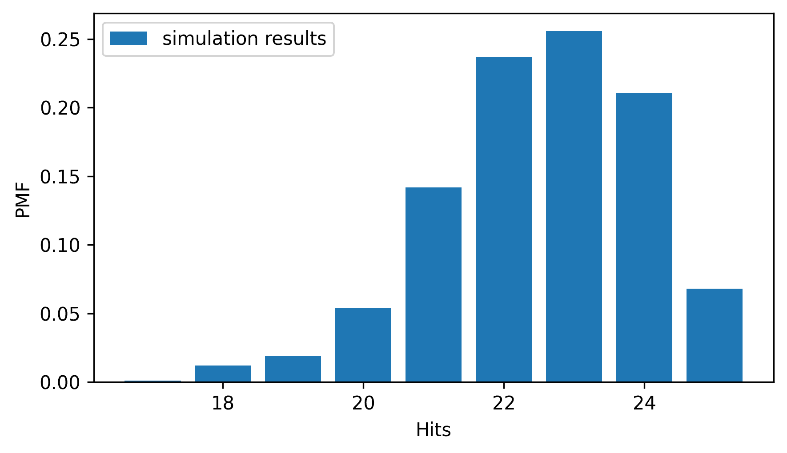

顶峰接近平均值，分布向左偏斜。

我们可以不运行模拟，而是预测这个分布。从数学上讲，这些结果的分布遵循**二项分布**，其 PMF 易于计算。

```py
from  scipy.special  import comb

def  binomial_pmf(k, n, p):
    return comb(n, k) * (p**k) * ((1 - p) ** (n - k)) 
```

SciPy 提供了`comb`函数，该函数计算从`n`个物品中每次取`k`个的组合数，通常读作“n 选 k”。

`binomial_pmf`计算在给定`p`的情况下，从`n`次尝试中得到`k`次命中的概率。如果我们用一系列的`k`值调用此函数，我们可以创建一个表示结果分布的`Pmf`。

```py
ks = np.arange(16, n + 1)
ps = binomial_pmf(ks, n, p)
pmf_binom = Pmf(ps, ks, name="binomial model") 
```

下面是它与模拟结果相比的图示。

```py
from  thinkstats  import two_bar_plots

two_bar_plots(pmf_sim, pmf_binom)
decorate(xlabel="Hits", ylabel="PMF") 
```

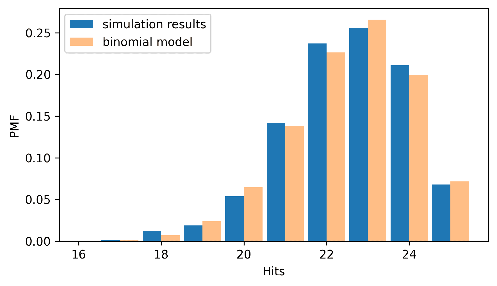

它们很相似，由于模拟结果中的随机变化，存在一些小的差异。这种一致性并不令人惊讶，因为模拟和模型基于相同的假设——尤其是每个尝试成功的概率相同的假设。对模型的一个更强测试是它与实际数据的比较。

从 2020 年夏季奥运会男子飞碟射击比赛的维基百科页面，我们可以提取一个表格，显示资格赛的结果。下载数据的说明在本书的笔记本中。

从[`en.wikipedia.org/wiki/Shooting_at_the_2020_Summer_Olympics_%E2%80%93_Men's_skeet`](https://en.wikipedia.org/wiki/Shooting_at_the_2020_Summer_Olympics_%E2%80%93_Men's_skeet)于 2024 年 7 月 15 日下载。

```py
filename = "Shooting_at_the_2020_Summer_Olympics_Mens_skeet" 
```

```py
download("https://github.com/AllenDowney/ThinkStats/raw/v3/data/" + filename) 
```

```py
tables = pd.read_html(filename)
table = tables[6]
table.head() 
```

|  | Rank | Athlete | Country | 1 | 2 | 3 | 4 | 5 | Total[3] | Shoot-off | Notes |
| --- | --- | --- | --- | --- | --- | --- | --- | --- | --- | --- | --- |
| 0 | 1 | Éric Delaunay | France | 25 | 25 | 25 | 24 | 25 | 124 | +6 | Q, OR |
| 1 | 2 | Tammaro Cassandro | Italy | 24 | 25 | 25 | 25 | 25 | 124 | +5 | Q, OR |
| 2 | 3 | Eetu Kallioinen | Finland | 25 | 25 | 24 | 25 | 24 | 123 | NaN | Q |
| 3 | 4 | Vincent Hancock | United States | 25 | 25 | 25 | 25 | 22 | 122 | +8 | Q |
| 4 | 5 | Abdullah Al-Rashidi | Kuwait | 25 | 25 | 24 | 25 | 23 | 122 | +7 | Q |

表格为每位选手一行，每轮比赛有一个列。我们将选择包含这些结果的列，并使用 NumPy 函数`flatten`将它们放入一个单一的数组中。

```py
columns = ["1", "2", "3", "4", "5"]
results = table[columns].values.flatten() 
```

有 30 名选手，我们有 150 轮 25 次射击的结果，总共 3575 次尝试中有 3750 次命中。

```py
total_shots = 25 * len(results)
total_hits = results.sum()
n, total_shots, total_hits 
```

```py
(25, 3750, np.int64(3575)) 
```

因此，整体成功率是 95.3%。

```py
p = total_hits / total_shots
p 
```

```py
np.float64(0.9533333333333334) 
```

现在让我们计算一个`Pmf`，它代表`n=25`和刚刚计算出的`p`值的二项分布。

```py
ps = binomial_pmf(ks, n, p)
pmf_binom = Pmf(ps, ks, name="binomial model") 
```

我们可以将这个分布与实际结果的`Pmf`进行比较。

```py
pmf_results = Pmf.from_seq(results, name="actual results")

two_bar_plots(pmf_results, pmf_binom)
decorate(xlabel="Hits", ylabel="PMF") 
```

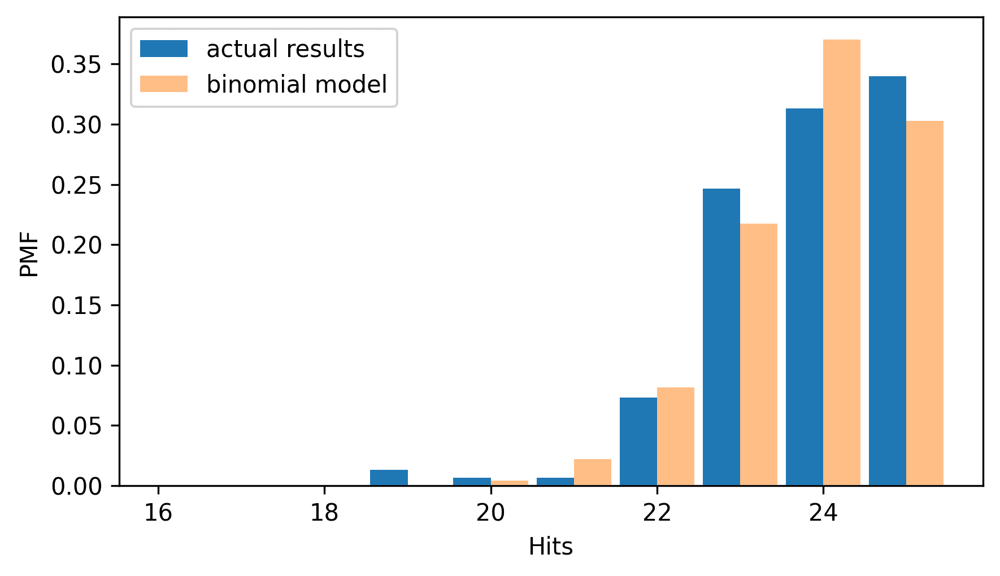

二项模型很好地拟合了数据的分布——尽管它做出了所有竞争者具有相同、不变能力的非现实假设。

## 泊松分布

作为另一个例子，其中体育赛事的结果遵循可预测的模式，让我们看看冰球比赛中进球的数量。

我们首先模拟一场 60 分钟的比赛，即 3600 秒，假设每场比赛平均进球数为 6 个，进球概率`p`在任何一秒都是相同的。

```py
n = 3600
m = 6
p = m / 3600
p 
```

```py
0.0016666666666666668 
```

现在我们可以使用以下函数来模拟`n`秒，并返回进球总数。

```py
def  simulate_goals(n, p):
    return flip(n, p).sum() 
```

如果我们模拟许多场比赛，我们可以确认每场比赛的平均进球数接近 6。

```py
goals = [simulate_goals(n, p) for i in range(1001)]
np.mean(goals) 
```

```py
np.float64(6.021978021978022) 
```

我们可以使用二项分布来模拟这些结果，但当`n`很大且`p`很小时，结果也可以很好地由一个**泊松分布**来模拟，该分布由通常用希腊字母λ表示的值指定，读作`lambda`，在代码中用变量`lam`（`lambda`不是一个合法的变量名，因为它是一个 Python 关键字）表示。`lam`代表进球率，在示例中为每场比赛 6 个进球。

泊松分布的概率质量函数（PMF）易于计算——给定`lam`，我们可以使用以下函数来计算一场比赛中出现`k`个进球的概率。

```py
from  scipy.special  import factorial

def  poisson_pmf(k, lam):
  """Compute the Poisson PMF.

 k (int or array-like): The number of occurrences
 lam (float): The rate parameter (λ) of the Poisson distribution

 returns: float or ndarray
 """
    return (lam**k) * np.exp(-lam) / factorial(k) 
```

SciPy 提供了`factorial`函数，该函数计算从`1`到`k`的整数的乘积。

如果我们用一系列`k`值调用`poisson_pmf`，我们可以创建一个`Pmf`，它表示结果的分布。

```py
lam = 6
ks = np.arange(20)
ps = poisson_pmf(ks, lam)
pmf_poisson = Pmf(ps, ks, name="Poisson model") 
```

并确认分布的均值接近 6。

```py
pmf_poisson.normalize()
pmf_poisson.mean() 
```

```py
np.float64(5.999925498375129) 
```

下图比较了模拟结果与具有相同均值的泊松分布。

```py
pmf_sim = Pmf.from_seq(goals, name="simulation")

two_bar_plots(pmf_sim, pmf_poisson)
decorate(xlabel="Goals", ylabel="PMF") 
```

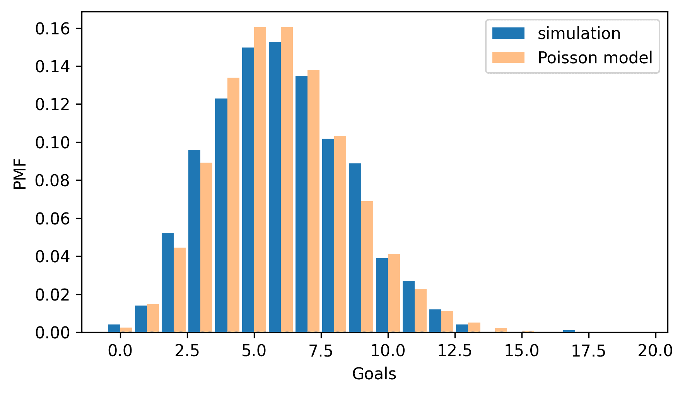

分布相似，只是由于随机变化存在一些小差异。这并不令人惊讶，因为模拟和泊松模型都是基于相同的假设，即在任何一秒进球的概率是相同的。因此，一个更强的测试是看看模型如何拟合真实数据。

从 HockeyReference 网站上，我下载了 2023-2024 赛季国家冰球联盟（NHL）常规赛中每场比赛的结果（不包括季后赛）。我提取了关于在 60 分钟常规比赛时间内进球的信息，不包括加时赛或点球大战。结果存储在一个 HDF 文件中，每个游戏有一个键，以及一个列表，列出了自比赛开始以来进球的时间，以秒为单位。下载数据的说明在本书的笔记本中。

从 2024 年 7 月 16 日下载的[`www.hockey-reference.com/leagues/NHL_2024_games.html`](https://www.hockey-reference.com/leagues/NHL_2024_games.html)的原始数据。

```py
download("https://github.com/AllenDowney/ThinkStats/raw/v3/data/nhl_2023_2024.hdf") 
```

下面是如何从文件中读取键。

```py
filename = "nhl_2023_2024.hdf"

with pd.HDFStore(filename, "r") as store:
    keys = store.keys()

len(keys), keys[0] 
```

```py
(1312, '/202310100PIT') 
```

在常规赛期间共有 1312 场比赛。每个键包含比赛日期和主队的三个字母缩写。我们可以使用`read_hdf`来查找键并获取进球时间的列表。

```py
times = pd.read_hdf(filename, key=keys[0])
times 
```

```py
0     424
1    1916
2    2137
3    3005
4    3329
5    3513
dtype: int64 
```

在赛季的第一场比赛中，共进了六个球，第一个进球是在比赛进行 424 秒后，最后一个进球是在 3513 秒后——比赛还剩下 87 秒。

```py
3600 - times[5] 
```

```py
np.int64(87) 
```

以下循环读取所有比赛的结果，计算每场比赛的进球数，并将结果存储在列表中。

```py
goals = []

for key in keys:
    times = pd.read_hdf(filename, key=key)
    n = len(times)
    goals.append(n) 
```

每场比赛的平均进球数略超过 6。

```py
lam = np.mean(goals)
lam 
```

```py
np.float64(6.0182926829268295) 
```

我们可以使用`poisson_pmf`来创建一个`Pmf`，它代表具有与数据相同均值的泊松分布。

```py
ps = poisson_pmf(ks, lam)
pmf_poisson = Pmf(ps, ks, name="Poisson model") 
```

下面是它与数据的概率质量函数（PMF）相比的图示。

```py
pmf_goals = Pmf.from_seq(goals, name="goals scored")

two_bar_plots(pmf_goals, pmf_poisson)
decorate(xlabel="Goals", ylabel="PMF") 
```

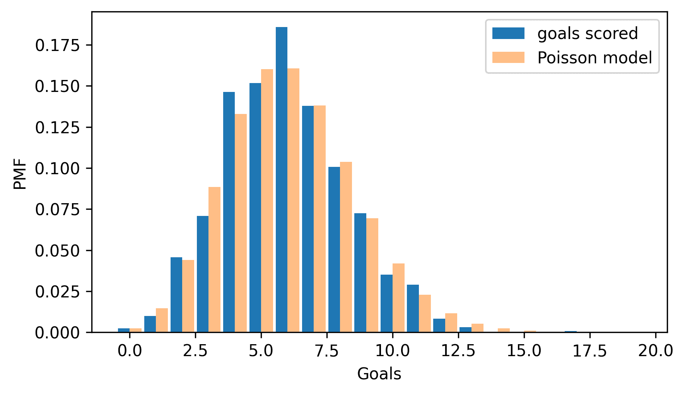

泊松分布很好地拟合了数据，这表明它是冰球进球过程的良好模型。

## 指数分布

在上一节中，我们模拟了一个简单的冰球比赛模型，其中进球在任何一秒被射中的概率相同。在相同的模型下，结果是，直到第一个进球的时间遵循一个**指数分布**。

为了演示，让我们再次假设球队平均每场比赛进 6 个球，并计算每秒进球的概率。

```py
n = 3600
m = 6
p = m / 3600
p 
```

```py
0.0016666666666666668 
```

以下函数模拟`n`秒，并使用`argmax`找到第一个进球的时间。

```py
def  simulate_first_goal(n, p):
    return flip(n, p).argmax() 
```

这是因为`flip`的结果是一串 1 和 0，所以最大值几乎总是 1。如果序列中至少有一个进球，`argmax`返回第一个进球的索引。如果没有进球，它返回 0，但这很少发生，所以我们忽略它。

我们将使用`simulate_first_goal`模拟 1001 场比赛，并创建一个直到第一个进球的时间列表。

```py
np.random.seed(3) 
```

```py
first_goal_times = [simulate_first_goal(n, p) for i in range(1001)]
mean = np.mean(first_goal_times)
mean 
```

```py
np.float64(597.7902097902098) 
```

直到第一个进球的平均时间是接近 600 秒，即 10 分钟。这很有道理——如果我们预计每 60 分钟比赛有 6 个进球，那么平均每 10 分钟就会有一个进球。

当`n`很大且`p`很小时，我们可以从数学上证明第一个进球的期望时间遵循指数分布。

因为模拟生成了许多独特的时间值，我们将使用累积分布函数（CDFs）来比较分布，而不是概率质量函数（PMFs）。指数分布的 CDF 很容易计算。

```py
def  exponential_cdf(x, lam):
  """Compute the exponential CDF.

 x: float or sequence of floats
 lam: rate parameter

 returns: float or NumPy array of cumulative probability
 """
    return 1 - np.exp(-lam * x) 
```

`lam`的值是单位时间内的平均事件数——在这个例子中是每秒的进球数。我们可以使用模拟结果的平均值来计算`lam`。

```py
lam = 1 / mean
lam 
```

```py
np.float64(0.0016728276636563566) 
```

如果我们用时间值的范围调用此函数，我们可以近似第一次进球时间的分布。NumPy 函数`linspace`创建一个等间距值的数组；在这个例子中，它计算从 0 到 3600 的 201 个值，包括两者。

```py
from  empiricaldist  import Cdf

ts = np.linspace(0, 3600, 201)
ps = exponential_cdf(ts, lam)
cdf_expo = Cdf(ps, ts, name="exponential model") 
```

下图比较了模拟结果与我们刚刚计算的指数分布。

```py
cdf_sim = Cdf.from_seq(first_goal_times, name="simulation")

cdf_expo.plot(ls=":", color="gray")
cdf_sim.plot()

decorate(xlabel="Time of first goal (seconds)", ylabel="CDF") 
```

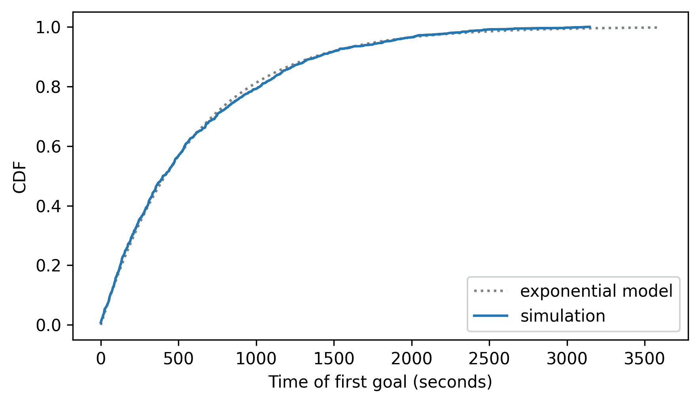

指数模型与模拟结果非常吻合——但更严格的测试是看看它在真实数据上的表现如何。

下面的循环读取所有比赛的结果，获取第一次进球的时间，并将结果存储在列表中。如果没有进球，它会在列表中添加`nan`。

```py
filename = "nhl_2023_2024.hdf"

with pd.HDFStore(filename, "r") as store:
    keys = store.keys() 
```

```py
firsts = []

for key in keys:
    times = pd.read_hdf(filename, key=key)
    if len(times) > 0:
        firsts.append(times[0])
    else:
        firsts.append(np.nan) 
```

为了估计进球率，我们可以使用`nanmean`，它计算时间的平均值，忽略`nan`值。

```py
lam = 1 / np.nanmean(firsts)
lam 
```

```py
np.float64(0.0015121567467720825) 
```

现在，我们可以使用与数据相同的进球率来计算指数分布的累积分布函数（CDF）。

```py
ps = exponential_cdf(ts, lam)
cdf_expo = Cdf(ps, ts, name="exponential model") 
```

为了计算数据的 CDF，我们将使用`dropna=False`参数，它包括末尾的`nan`值。

```py
cdf_firsts = Cdf.from_seq(firsts, name="data", dropna=False)
cdf_firsts.tail() 
```

|  | probs |
| --- | --- |
| 3286.0 | 0.996951 |
| 3581.0 | 0.997713 |
| NaN | 1.000000 |

下图比较了指数分布与数据的分布。

```py
cdf_expo.plot(ls=":", color="gray")
cdf_firsts.plot()

decorate(xlabel="Time of first goal (seconds)", ylabel="CDF") 
```

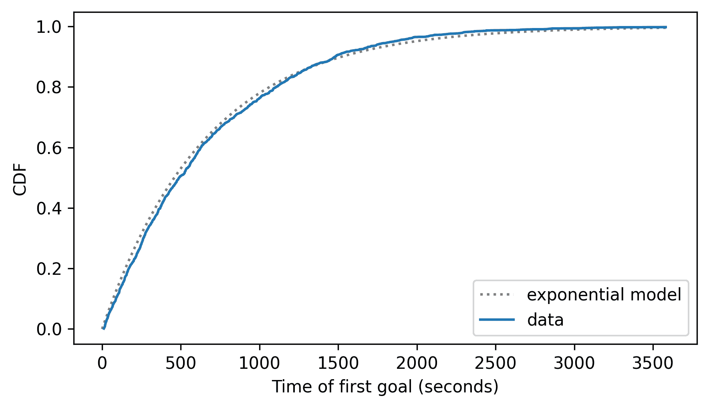

数据在某些地方偏离了模型——看起来在模型预测的前 1000 秒内进球比模型预测的少。但仍然，模型很好地拟合了数据。

这些模型的基础假设——进球的泊松模型和时间指数模型——是进球在任何游戏秒数中发生的可能性是相同的。如果你问一个曲棍球迷这是否正确，他们会说不是，而且他们会是对的——现实世界在许多方面违反了这样的假设。尽管如此，理论分布通常与真实数据非常吻合。

## 正态分布

我们在现实世界中测量的许多事物都遵循**正态分布**，也称为高斯分布或“钟形曲线”。为了了解这些分布的来源，让我们考虑一个关于巨型南瓜生长的模型。假设每天，如果天气不好，南瓜会增重 1 磅；如果天气晴朗，增重 2 磅；如果天气好，增重 3 磅。并且假设每天的天气以相同的概率是不好、晴朗或好。

我们可以使用以下函数来模拟`n`天的模型并返回总重量增加量。

```py
def  simulate_growth(n):
    choices = [1, 2, 3]
    gains = np.random.choice(choices, n)
    return gains.sum() 
```

NumPy 的`random`模块提供了一个`choice`函数，该函数从一个值序列中生成`n`个随机选择，在这个例子中是`choices`。

现在假设有 1001 人在不同地方、不同天气下种植巨型南瓜。如果我们模拟 100 天的生长过程，我们得到一个包含 1001 个重量的列表。

```py
sim_weights = [simulate_growth(100) for i in range(1001)]
m, s = np.mean(sim_weights), np.std(sim_weights)
m, s 
```

```py
(np.float64(199.37062937062936), np.float64(8.388630840376777)) 
```

平均值接近 200 磅，标准差约为 8 磅。为了查看重量是否遵循正态分布，我们将使用以下函数，该函数接受一个样本并创建一个`Cdf`，它代表具有与样本相同均值和标准差的正态分布，评估范围从平均值以下 4 个标准差到平均值以上 4 个标准差。

```py
from  scipy.stats  import norm

def  make_normal_model(data):
    m, s = np.mean(data), np.std(data)
    low, high = m - 4 * s, m + 4 * s
    qs = np.linspace(low, high, 201)
    ps = norm.cdf(qs, m, s)
    return Cdf(ps, qs, name="normal model") 
```

这就是我们的使用方法。

```py
cdf_model = make_normal_model(sim_weights) 
```

现在，我们可以创建一个代表模拟结果分布的`Cdf`。

```py
cdf_sim_weights = Cdf.from_seq(sim_weights, name="simulation") 
```

我们将使用以下函数来比较分布。`cdf_model`和`cdf_data`是`Cdf`对象。`xlabel`是一个字符串，`options`是一个选项字典，它控制`cdf_data`的绘图方式。

```py
def  two_cdf_plots(cdf_model, cdf_data, xlabel="", **options):
    cdf_model.plot(ls=":", color="gray")
    cdf_data.plot(**options)
    decorate(xlabel=xlabel, ylabel="CDF") 
```

下面是结果。

```py
two_cdf_plots(cdf_model, cdf_sim_weights, xlabel="Weight (pounds)") 
```

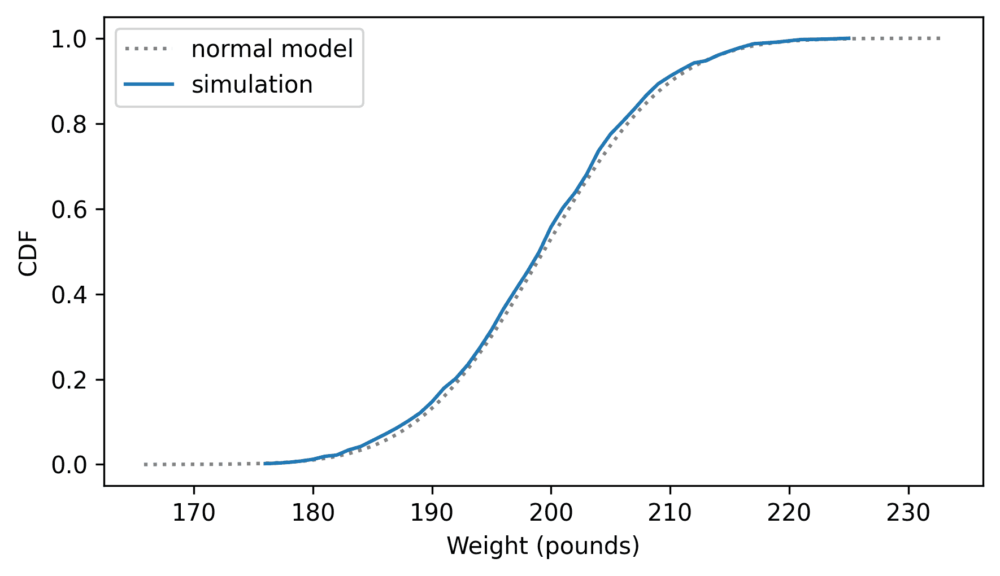

正态模型很好地拟合了权重的分布。一般来说，当我们累加足够的随机因素时，总和往往会遵循正态分布。这是中心极限定理的结果，我们将在第十四章中再次讨论。

但首先让我们看看正态分布如何拟合实际数据。作为一个例子，我们将查看国家家庭增长调查（NSFG）中出生体重的分布。我们可以使用`read_fem_preg`读取数据，然后选择`totalwgt_lb`列，该列记录以磅为单位的出生体重。

以下单元格下载数据文件并安装`statadict`，我们需要它来读取数据。

```py
download("https://github.com/AllenDowney/ThinkStats/raw/v3/nb/nsfg.py")
download("https://github.com/AllenDowney/ThinkStats/raw/v3/data/2002FemPreg.dct")
download("https://github.com/AllenDowney/ThinkStats/raw/v3/data/2002FemPreg.dat.gz") 
```

```py
try:
    import  statadict
except ImportError:
    %pip install statadict 
```

```py
import  nsfg

preg = nsfg.read_fem_preg()
birth_weights = preg["totalwgt_lb"].dropna() 
```

出生体重的平均值约为 7.27 磅，标准差为 1.4 磅，但正如我们所看到的，这个数据集中有一些异常值，可能是错误。

```py
m, s = np.mean(birth_weights), np.std(birth_weights)
m, s 
```

```py
(np.float64(7.265628457623368), np.float64(1.40821553384062)) 
```

为了减少异常值对估计均值和标准差的影响，我们将使用 SciPy 函数`trimboth`来移除最高和最低值。

```py
from  scipy.stats  import trimboth

trimmed = trimboth(birth_weights, 0.01)
m, s = np.mean(trimmed), np.std(trimmed)
m, s 
```

```py
(np.float64(7.280883100022579), np.float64(1.2430657948614345)) 
```

使用修剪后的数据，平均值略低，标准差显著降低。我们将使用修剪后的数据来制作正态模型。

```py
cdf_model = make_normal_model(trimmed) 
```

并将其与数据的`Cdf`进行比较。

```py
cdf_birth_weight = Cdf.from_seq(birth_weights, name='data')

two_cdf_plots(cdf_model, cdf_birth_weight, xlabel="Birth weight (pounds)") 
```

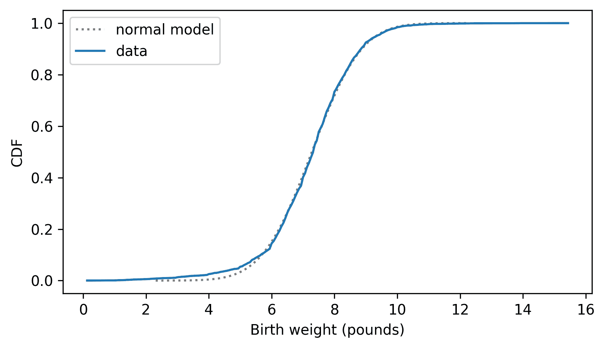

正态模型很好地拟合了数据，除了 5 磅以下的部分，那里的数据分布位于模型左侧——也就是说，最轻的婴儿比我们预期的正态分布要轻。现实世界通常比简单的数学模型更复杂。

在上一节中，我们假设南瓜每天增长 1-3 磅，根据天气情况模拟南瓜的生长。相反，让我们假设它们的增长与当前重量成正比，因此大南瓜每天增长的重量比小南瓜多——这可能是更现实的。

以下函数模拟这种比例增长，其中南瓜在天气恶劣时增加其体重的 3%，在天气晴朗时增加 5%，在天气良好时增加 7%。同样，我们将假设在任何给定的一天，天气恶劣、晴朗或良好的概率是相等的。

```py
def  simulate_proportionate_growth(n):
    choices = [1.03, 1.05, 1.07]
    gains = np.random.choice(choices, n)
    return gains.prod() 
```

如果南瓜增加了 3%的体重，最终体重是初始体重与因子 1.03 的乘积。因此，我们可以通过选择随机因子并将它们相乘来计算 100 天后的体重。

我们将调用这个函数 1001 次来模拟 1001 个南瓜并保存它们的体重。

```py
sim_weights = [simulate_proportionate_growth(100) for i in range(1001)]
np.mean(sim_weights), np.std(sim_weights) 
```

```py
(np.float64(130.80183363824722), np.float64(20.956047434921466)) 
```

平均体重约为 131 磅；标准差约为 21 磅。因此，在这个模型中，南瓜比上一个模型小，但变化更大。

我们可以用数学方法证明它们遵循**对数正态分布**，这意味着体重的对数遵循正态分布。为了检查，我们将计算体重的对数以及它们的均值和标准差。我们可以使用任何底数的对数，但我将使用底数为 10，因为这使结果更容易解释。

```py
log_sim_weights = np.log10(sim_weights)
m, s = np.mean(log_sim_weights), np.std(log_sim_weights)
m, s 
```

```py
(np.float64(2.1111299372609933), np.float64(0.06898607064749827)) 
```

现在我们将比较对数分布与具有相同均值和标准差的正态分布。

```py
cdf_model = make_normal_model(log_sim_weights)
cdf_log_sim_weights = Cdf.from_seq(log_sim_weights, name="simulation")

two_cdf_plots(
    cdf_model, cdf_log_sim_weights, xlabel="Pumpkin weight (log10 pounds)"
) 
```

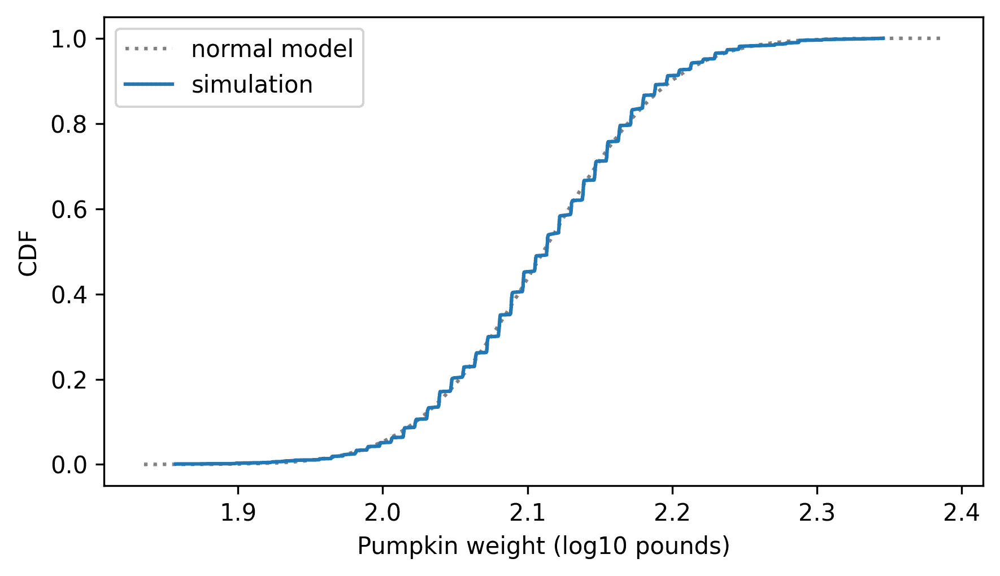

模型与模拟结果非常吻合，这正是我们预期的。

如果人们的体重变化与南瓜相似，即每年的体重变化与当前体重成比例，我们可能会预期成年体重的分布遵循对数正态分布。让我们找出答案。

国家慢性疾病预防和健康促进中心作为行为风险因素监测系统（BRFSS）的一部分进行年度调查。2008 年，他们采访了 414,509 名受访者，并询问了他们的人口统计信息、健康状况和健康风险。他们收集的数据中包括 398,484 名受访者的体重。下载数据的说明在本书的笔记本中。

```py
download("https://github.com/AllenDowney/ThinkStats/raw/v3/data/CDBRFS08.ASC.gz") 
```

`thinkstats`模块提供了一个函数，用于读取 BRFSS 数据并返回 Pandas `DataFrame`。

```py
from  thinkstats  import read_brfss

brfss = read_brfss() 
```

成人体重以公斤为单位记录在`wtkg2`列中。

```py
adult_weights = brfss["wtkg2"].dropna()
m, s = np.mean(adult_weights), np.std(adult_weights)
m, s 
```

```py
(np.float64(78.9924529968581), np.float64(19.546132387397257)) 
```

平均体重约为 79 公斤。在我们计算对数之前，让我们看看体重是否遵循正态分布。

```py
cdf_model = make_normal_model(adult_weights)
cdf_adult_weights = Cdf.from_seq(adult_weights, name="adult weight")

two_cdf_plots(cdf_model, cdf_adult_weights, xlabel="Adult weight (kilograms)") 
```

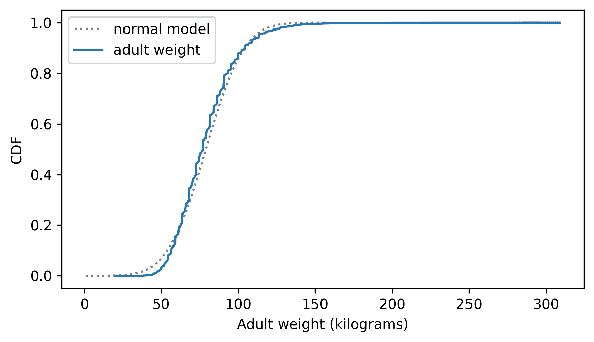

对于某些目的来说，正态分布可能足够好地描述这些数据，但让我们看看我们是否能做得更好。

这是对数转换后体重的分布和具有相同均值和标准差的正态模型。

```py
log_adult_weights = np.log10(adult_weights)
cdf_model = make_normal_model(log_adult_weights)

cdf_log_adult_weights = Cdf.from_seq(log_adult_weights, name="log adult weight") 
```

```py
two_cdf_plots(cdf_model, cdf_log_adult_weights, xlabel="Adult weight (log10 kg)") 
```

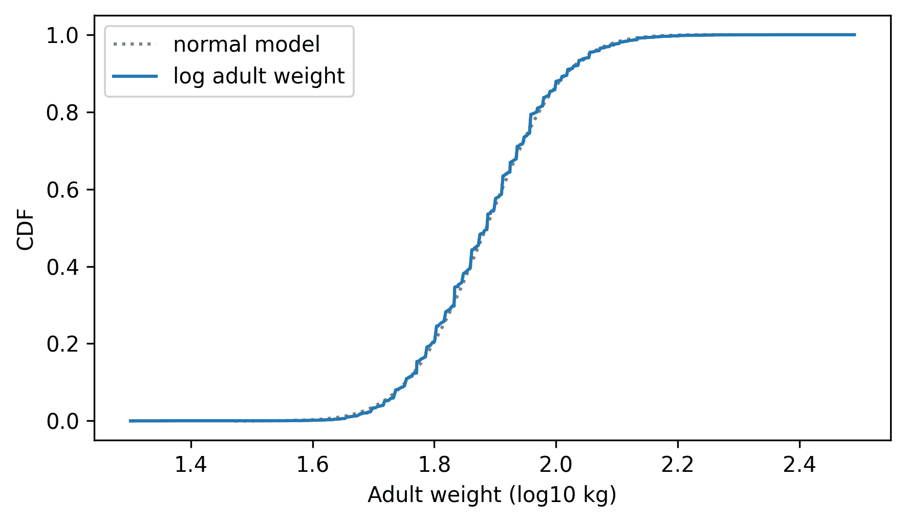

正态模型对对数的拟合优于对体重的拟合，这表明比例增长是体重增加比加性增长更好的模型。

## 为什么建模？

在本章的开头，我说过许多现实世界现象可以用理论分布来模拟。但可能不清楚为什么我们应该关心这一点。

与所有模型一样，理论分布是抽象的，这意味着它们忽略了被认为无关的细节。例如，观察到的分布可能包含测量误差或特定于样本的怪癖；理论模型忽略了这些特殊性。

理论模型也是一种数据压缩形式。当一个模型很好地拟合数据集时，一组小的数字可以总结大量数据。

当自然现象的数据符合理论分布时，有时会令人惊讶，但这些观察可以提供对物理系统的洞察。有时我们可以解释为什么观察到的分布具有特定的形式。例如，在前一节中我们发现成年人的体重很好地符合对数正态分布，这表明体重年复一年的变化可能与当前体重成比例。

此外，理论分布适合进行数学分析，正如我们在第十四章 Chapter 14 中将会看到的。

但重要的是要记住，所有模型都是不完美的。现实世界的数据永远不会完美地符合理论分布。人们有时会像谈论数据是由模型生成的；例如，他们可能会说人类身高的分布是正态的，或收入的分布是对数正态的。字面意义上，这些说法不能成立——现实世界和数学模型之间总是存在差异。

如果模型能够捕捉现实世界的相关方面并省略不必要的细节，那么模型是有用的。但相关或不必要取决于你打算如何使用该模型。

## 术语表

+   **二项分布**：一种理论分布，常用于模拟一系列成功或击中的次数。

+   **泊松分布**：一种理论分布，常用于模拟在一段时间内发生的事件数量。

+   **指数分布**：一种理论分布，常用于模拟事件之间的时间间隔。

+   **正态分布**：一种理论分布，常用于模拟呈对称、钟形曲线的数据。

+   **对数正态分布**：一种理论分布，常用于模拟遵循向右偏斜的钟形曲线的数据。

## 练习

### 练习 5.1

在 NSFG 受访者文件中，`numfmhh`列记录了每个受访者的家庭“家庭成员数量”。我们可以使用`read_fem_resp`来读取文件，并使用`query`来选择在受访时年龄为 25 岁或以上的受访者。

```py
download("https://github.com/AllenDowney/ThinkStats/raw/v3/data/2002FemResp.dct")
download("https://github.com/AllenDowney/ThinkStats/raw/v3/data/2002FemResp.dat.gz") 
```

```py
from  nsfg  import read_fem_resp

resp = read_fem_resp() 
```

```py
older = resp.query("age >= 25")
num_family = older["numfmhh"] 
```

计算这些较老受访者的 `numfmhh` 的概率质量函数（Pmf），并将其与具有相同均值的泊松分布进行比较。泊松模型与数据的拟合程度如何？

### 练习 5.2

在本章的早期，我们看到了在曲棍球比赛中第一个进球的时间遵循指数分布。如果我们的进球模型是正确的，那么在任何时间进球的可能性都是相同的，无论上一个进球已经过去多久。如果这是真的，我们预计进球之间的时间间隔也将遵循指数分布。

以下循环再次读取曲棍球数据，计算连续进球之间的时间（如果一场比赛中有多于一个进球），并将进球间时间收集到一个列表中。

```py
filename = "nhl_2023_2024.hdf"

with pd.HDFStore(filename, "r") as store:
    keys = store.keys() 
```

```py
intervals = []

for key in keys:
    times = pd.read_hdf(filename, key=key)
    if len(times) > 1:
        intervals.extend(times.diff().dropna()) 
```

使用 `exponential_cdf` 计算与观察到的间隔具有相同均值的指数分布的累积分布函数（CDF），并将此模型与数据的 CDF 进行比较。

### 练习 5.3

人类身高的分布更像是正态分布还是对数正态分布？为了找出答案，我们可以从 BRFSS 中选择身高数据，如下所示：

```py
adult_heights = brfss["htm3"].dropna()
m, s = np.mean(adult_heights), np.std(adult_heights)
m, s 
```

```py
(np.float64(168.82518961012298), np.float64(10.35264015645592)) 
```

计算这些值的累积分布函数（CDF），并将其与具有相同均值和标准差的正态分布进行比较。然后计算高度的对数，并将对数分布与正态分布进行比较。根据视觉比较，哪个模型更适合数据？

[《Think Stats：Python 中的探索性数据分析》（第 3 版）](https://allendowney.github.io/ThinkStats/index.html)

版权 2024 [艾伦·B·唐尼](https://allendowney.com)

代码许可：[MIT License](https://mit-license.org/)

文本许可：[Creative Commons Attribution-NonCommercial-ShareAlike 4.0 International](https://creativecommons.org/licenses/by-nc-sa/4.0/)
