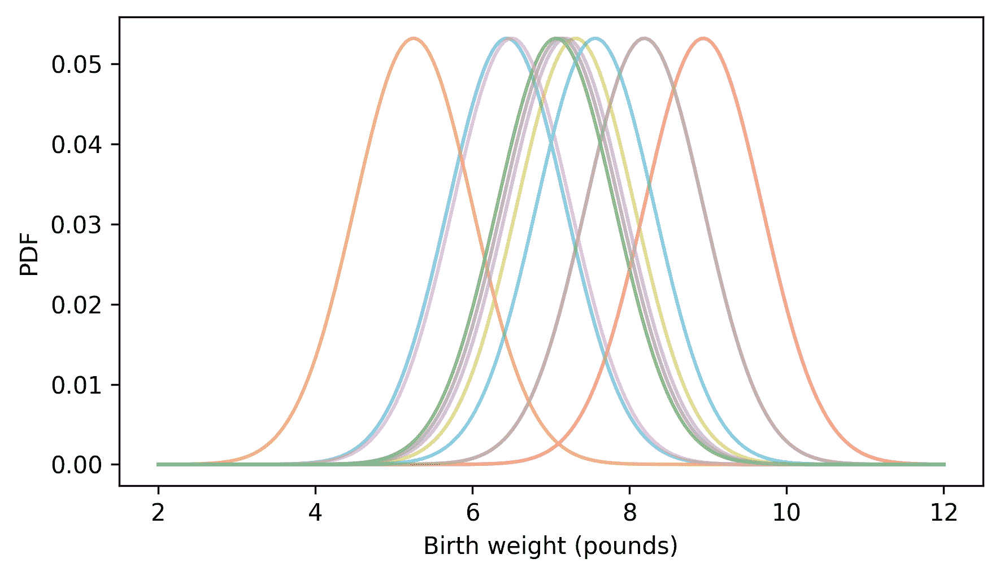

# 概率密度函数

> 原文：[`allendowney.github.io/ThinkStats/chap06.html`](https://allendowney.github.io/ThinkStats/chap06.html)

在上一章中，我们使用二项分布、泊松分布、指数分布和正态分布等理论分布来模拟数据。

二项分布和泊松分布是**离散的**，这意味着结果必须是不同的或独立的元素，比如击中和失误的整数次数，或者进球数。在离散分布中，每个结果都与一个概率质量相关联。

指数分布和正态分布是**连续的**，这意味着结果可以位于可能值范围内的任何点。在连续分布中，每个结果都与一个**概率密度**相关联。概率密度是一个抽象的概念，许多人一开始会觉得很难理解，但我们会一步一步来。作为第一步，让我们再次思考如何比较分布。

[点击此处运行此笔记本在 Colab 上](https://colab.research.google.com/github/AllenDowney/ThinkStats/blob/v3/nb/chap06.ipynb)。

```py
from  os.path  import basename, exists

def  download(url):
    filename = basename(url)
    if not exists(filename):
        from  urllib.request  import urlretrieve

        local, _ = urlretrieve(url, filename)
        print("Downloaded " + local)

download("https://github.com/AllenDowney/ThinkStats/raw/v3/nb/thinkstats.py") 
```

```py
try:
    import  empiricaldist
except ImportError:
    %pip install empiricaldist 
```

```py
import  numpy  as  np
import  pandas  as  pd
import  matplotlib.pyplot  as  plt

from  thinkstats  import decorate 
```

## 比较分布

在上一章中，当我们比较离散分布时，我们使用条形图来展示它们的概率质量函数（PMFs）。当我们比较连续分布时，我们使用线形图来展示它们的累积分布函数（CDFs）。

对于离散分布，我们也可以使用累积分布函数（CDFs）。例如，这里有一个参数为`lam=2.2`的泊松分布的概率质量函数（PMF），这是一个很好的模型，用于描述 NSFG 数据中家庭规模的分布。

下面的单元格下载数据文件并安装`statadict`，这是我们读取数据所需的。

```py
download("https://github.com/AllenDowney/ThinkStats/raw/v3/nb/nsfg.py")
download("https://github.com/AllenDowney/ThinkStats/raw/v3/data/2002FemResp.dct")
download("https://github.com/AllenDowney/ThinkStats/raw/v3/data/2002FemResp.dat.gz") 
```

```py
try:
    import  statadict
except ImportError:
    %pip install statadict 
```

我们可以使用`read_fem_resp`来读取受访者数据文件。

```py
from  nsfg  import read_fem_resp

resp = read_fem_resp() 
```

接下来，我们将选择 25 岁及以上人群的家庭规模。

```py
older = resp.query("age >= 25")
num_family = older["numfmhh"] 
```

然后创建一个`Pmf`来表示响应的分布。

```py
from  empiricaldist  import Pmf

pmf_family = Pmf.from_seq(num_family, name="data") 
```

这里还有一个表示具有相同均值的泊松分布的`Pmf`。

```py
from  thinkstats  import poisson_pmf

lam = 2.2
ks = np.arange(11)
ps = poisson_pmf(ks, lam)

pmf_poisson = Pmf(ps, ks, name="Poisson model") 
```

下面是数据分布与泊松模型的比较。

```py
from  thinkstats  import two_bar_plots

two_bar_plots(pmf_family, pmf_poisson)
decorate(xlabel="Number of family members") 
```


比较 PMFs，我们可以看到模型很好地拟合了数据，但有一些偏差。

为了了解这些偏差的实质，比较 CDFs 可能会有所帮助。我们可以使用`make_cdf`来计算数据和模型的 CDFs。

```py
cdf_family = pmf_family.make_cdf()
cdf_poisson = pmf_poisson.make_cdf() 
```

下面是它们的形状。

```py
from  thinkstats  import two_cdf_plots

two_cdf_plots(cdf_poisson, cdf_family)
decorate(xlabel="Number of family members") 
```


当我们比较 CDFs 时，偏差不那么明显，但我们能看到分布差异的具体位置和方式。概率质量函数（PMFs）往往强调小的差异——有时 CDFs 能更好地展现整体情况。

CDFs 也适用于连续数据。作为一个例子，让我们再次看看出生体重的分布，它位于 NSFG 怀孕文件中。

```py
download("https://github.com/AllenDowney/ThinkStats/raw/v3/data/2002FemPreg.dct")
download("https://github.com/AllenDowney/ThinkStats/raw/v3/data/2002FemPreg.dat.gz") 
```

```py
from  nsfg  import read_fem_preg

preg = read_fem_preg()
birth_weights = preg["totalwgt_lb"].dropna() 
```

这是我们在上一章中使用来拟合数据的正态模型的代码。

```py
from  scipy.stats  import trimboth
from  thinkstats  import make_normal_model

trimmed = trimboth(birth_weights, 0.01)
cdf_model = make_normal_model(trimmed) 
```

下面是数据分布与正态模型的比较。

```py
from  empiricaldist  import Cdf

cdf_birth_weight = Cdf.from_seq(birth_weights, name="sample")
two_cdf_plots(cdf_model, cdf_birth_weight, xlabel="Birth weight (pounds)") 
```


正如我们在上一章中看到的，正态模型很好地拟合了数据，除了最轻婴儿的范围。

在我看来，累积分布函数（CDFs）通常是比较数据与模型的最佳方式。但对于不熟悉 CDFs 的观众来说，还有一个选项：概率密度函数。

## 概率密度

我们将从正态分布的概率密度函数（PDF）开始，该函数计算给定`mu`和`sigma`的量`xs`的密度。

```py
def  normal_pdf(xs, mu, sigma):
  """Evaluates the normal probability density function."""
    z = (xs - mu) / sigma
    return np.exp(-(z**2) / 2) / sigma / np.sqrt(2 * np.pi) 
```

对于`mu`和`sigma`，我们将使用修剪后新生儿体重的均值和标准差。

```py
m, s = np.mean(trimmed), np.std(trimmed) 
```

现在我们将评估一系列重量的`normal_pdf`。

```py
low = m - 4 * s
high = m + 4 * s
qs = np.linspace(low, high, 201)
ps = normal_pdf(qs, m, s) 
```

然后绘制它。

```py
plt.plot(qs, ps, label="normal model", ls=":", color="gray")
decorate(xlabel="Birth weight (pounds)", ylabel="Density") 
```


结果看起来像钟形曲线，这是正态分布的特征。

当我们评估`normal_pdf`时，结果是概率密度。例如，这里是在均值处评估的密度函数，这是密度最高的地方。

```py
normal_pdf(m, m, s) 
```

```py
np.float64(0.32093416297880123) 
```

单独来看，概率密度并没有什么意义——最重要的是，它**不是**一个概率。说随机选择的新生儿体重等于`m`的概率是 32%是不正确的。事实上，新生儿体重真正、完全、精确地等于`m`——或任何其他特定值——的概率是零。

然而，我们可以使用概率密度来计算结果落在两个值之间的区间的概率，通过计算曲线下的面积。

我们可以用`normal_pdf`函数做到这一点，但使用定义在`thinkstats`模块中的`NormalPdf`类更方便。以下是如何创建与 NSFG 数据集中新生儿体重相同的均值和标准差的`NormalPdf`对象。

```py
from  thinkstats  import NormalPdf

pdf_model = NormalPdf(m, s, name="normal model")
pdf_model 
```

```py
NormalPdf(7.280883100022579, 1.2430657948614345, name='normal model') 
```

如果我们像调用函数一样调用这个对象，它将评估正态 PDF。

```py
pdf_model(m) 
```

```py
np.float64(0.32093416297880123) 
```

现在，为了计算概率密度函数（PDF）下的面积，我们可以使用以下函数，该函数接受一个`NormalPdf`对象和一个区间的边界，`low`和`high`。它评估`low`和`high`之间等间距的量，并使用 SciPy 函数`simpson`来估计曲线下的面积（`simpson`之所以这样命名，是因为它使用了一个称为辛普森方法的算法）。

```py
from  scipy.integrate  import simpson

def  area_under(pdf, low, high):
    qs = np.linspace(low, high, 501)
    ps = pdf(qs)
    return simpson(y=ps, x=qs) 
```

如果我们从图中的最低点到最高点计算曲线下的面积，结果接近 1。

```py
area_under(pdf_model, 2, 12) 
```

```py
np.float64(0.9999158086616793) 
```

如果我们将区间从负无穷大到正无穷大扩展，总面积正好是 1。

如果我们从 0——或任何远低于均值的值开始——我们可以计算体重小于或等于 8.5 磅的婴儿体重的比例。

```py
area_under(pdf_model, 0, 8.5) 
```

```py
np.float64(0.8366380335513807) 
```

你可能还记得，“小于或等于给定值的分数”是累积分布函数（CDF）的定义。因此，我们可以使用正态分布的 CDF 来计算相同的结果。

```py
from  scipy.stats  import norm

norm.cdf(8.5, m, s) 
```

```py
np.float64(0.8366380358092718) 
```

同样，我们可以使用密度曲线下的面积来计算 6 到 8 磅之间出生体重的分数。

```py
area_under(pdf_model, 6, 8) 
```

```py
np.float64(0.5671317752927691) 
```

或者，我们可以使用 CDF 来计算小于 8 的分数，然后减去小于 6 的分数。

```py
norm.cdf(8, m, s) - norm.cdf(6, m, s) 
```

```py
np.float64(0.5671317752921801) 
```

因此，CDF 是 PDF 曲线下的面积。如果你知道微积分，另一种表达相同意思的方式是 CDF 是 PDF 的积分。反之，PDF 是 CDF 的导数。

## 指数概率密度函数（PDF）

为了理解概率密度，看看另一个例子可能会有所帮助。在前一章中，我们使用指数分布来模拟冰球比赛中第一个进球的时间。我们使用了以下函数来计算指数 CDF，其中`lam`是每单位时间进球的速率。

```py
def  exponential_cdf(x, lam):
  """Compute the exponential CDF.

 x: float or sequence of floats
 lam: rate parameter

 returns: float or NumPy array of cumulative probability
 """
    return 1 - np.exp(-lam * x) 
```

我们可以这样计算指数分布的 PDF。

```py
def  exponential_pdf(x, lam):
  """Evaluates the exponential PDF.

 x: float or sequence of floats
 lam: rate parameter

 returns: float or NumPy array of probability density
 """
    return lam * np.exp(-lam * x) 
```

`thinkstats`提供了一个使用此函数来计算指数 PDF 的`ExponentialPdf`对象。我们可以用它来表示每场比赛 6 个进球的指数分布。

```py
from  thinkstats  import ExponentialPdf

lam = 6
pdf_expo = ExponentialPdf(lam, name="exponential model")
pdf_expo 
```

```py
ExponentialPdf(6, name='exponential model') 
```

`ExponentialPdf`提供了一个`plot`函数，我们可以用它来绘制 PDF - 注意，这里的单位是比赛，而不是前一章中的秒。

```py
qs = np.linspace(0, 1.5, 201)
pdf_expo.plot(qs, ls=":", color="gray")
decorate(xlabel="Time (games)", ylabel="Density") 
```


观察 y 轴，你可能注意到这些密度中的一些大于 1，这是一个提醒，概率密度不是一个概率。但是，密度曲线下的面积是一个概率，因此它永远不会大于 1。

如果我们从 0 到 1.5 场比赛的曲线下计算面积，我们可以确认结果接近 1。

```py
area_under(pdf_expo, 0, 1.5) 
```

```py
np.float64(0.999876590779019) 
```

如果我们将区间扩展得更大，结果略大于 1，但这是因为我们在数值上近似面积。从数学上讲，它正好是 1，正如我们可以使用指数 CDF 来确认的那样。

```py
from  thinkstats  import exponential_cdf

exponential_cdf(7, lam) 
```

```py
np.float64(1.0) 
```

我们可以使用密度曲线下的面积来计算任何区间内进球的概率。例如，这是 60 分钟比赛中第一分钟进球的概率。

```py
area_under(pdf_expo, 0, 1 / 60) 
```

```py
np.float64(0.09516258196404043) 
```

我们可以使用指数 CDF 来计算相同的结果。

```py
exponential_cdf(1 / 60, lam) 
```

```py
np.float64(0.09516258196404048) 
```

总结来说，如果我们评估 PDF，结果是概率密度 - 这不是一个概率。然而，如果我们计算 PDF 下的面积，结果是某个量落在区间内的概率。或者，我们也可以通过在区间的开始和结束处评估 CDF 并计算差值来找到相同的概率。

## 比较概率质量函数（PMFs）和概率密度函数（PDFs）

将样本的 PMF 与理论模型的 PDF 进行比较是一个常见的错误。例如，假设我们想将出生体重的分布与正态模型进行比较。这是一个表示数据分布的`Pmf`。

```py
pmf_birth_weight = Pmf.from_seq(birth_weights, name="data") 
```

我们已经有了`pdf_model`，它代表具有相同均值和标准差的正态分布的 PDF。如果我们把它们画在同一个轴上，会发生什么。

```py
pdf_model.plot(ls=":", color="gray")
pmf_birth_weight.plot()

decorate(xlabel="Birth weight (pounds)", ylabel="PMF? Density?") 
```


它效果不太好。一个原因是它们不在同一个单位上。PMF 包含概率质量，而 PDF 包含概率密度，所以我们不能比较它们，也不应该在同一个轴上绘制它们。

作为解决这个问题的第一次尝试，我们可以制作一个`Pmf`，通过在离散的点集上评估 PDF 来近似正态分布。`NormalPdf`提供了一个`make_pmf`方法来做这件事。

```py
pmf_model = pdf_model.make_pmf() 
```

结果是一个包含概率质量的标准化`Pmf`，所以我们至少可以把它画在和数据 PMF 相同的轴上。

```py
pmf_model.plot(ls=":", color="gray")
pmf_birth_weight.plot()

decorate(xlabel="Birth weight (pounds)", ylabel="PMF") 
```


但这仍然不是比较分布的好方法。一个问题就是两个`Pmf`对象包含不同数量的量，而且`pmf_birth_weight`中的量不是等间距的，所以概率质量实际上是不可比较的。

```py
len(pmf_model), len(pmf_birth_weight) 
```

```py
(201, 184) 
```

另一个问题就是数据的`Pmf`是嘈杂的。所以让我们试试别的。

## 核密度估计

我们不是用模型来制作 PMF，而是可以用数据来制作 PDF。为了展示这是如何工作的，我将从一个小的数据样本开始。

```py
# Set the random seed so we get the same results every time
np.random.seed(3) 
```

```py
n = 10
sample = birth_weights.sample(n) 
```

这个样本的`Pmf`看起来是这样的。

```py
for weight in sample:
    pmf = Pmf.from_seq([weight]) / n
    pmf.bar(width=0.08, alpha=0.5)

xlim = [1.5, 12.5]
decorate(xlabel="Birth weight (pounds)", ylabel="PMF", xlim=xlim) 
```


这种表示分布的方式将数据视为离散的，所以每个概率质量都堆叠在单个点上。但出生重量实际上是连续的，所以测量之间的量也是可能的。我们可以通过用连续概率密度替换每个离散概率质量来表示这种可能性，如下所示。

```py
qs = np.linspace(2, 12, 201)

for weight in sample:
    ps = NormalPdf(weight, 0.75)(qs) / n
    plt.plot(qs, ps, alpha=0.5)

decorate(xlabel="Birth weight (pounds)", ylabel="PDF", xlim=xlim) 
```



对于样本中的每个重量，我们创建一个以观察到的重量为均值的`NormalPdf` – 现在我们来把它们加起来。

```py
low_ps = np.zeros_like(qs)

for weight in sample:
    ps = NormalPdf(weight, 0.75)(qs) / n
    high_ps = low_ps + ps
    plt.fill_between(qs, low_ps, high_ps, alpha=0.5, lw=1, ec="white")
    low_ps = high_ps

decorate(xlabel="Birth weight (pounds)", ylabel="PDF", xlim=xlim) 
```


当我们为每个数据点加总概率密度时，结果是整个样本的概率密度估计。这个过程被称为**核密度估计**或 KDE。在这个上下文中，“核”是我们加总的小密度函数之一。因为我们使用的核是正态分布，也称为高斯分布，所以我们更具体地说，我们计算了一个高斯 KDE。

SciPy 提供了一个名为 `gaussian_kde` 的函数，该函数实现了此算法。以下是我们可以如何使用它来估计出生体重的分布。

```py
from  scipy.stats  import gaussian_kde

kde = gaussian_kde(birth_weights) 
```

结果是一个表示估计 PDF 的对象，我们可以通过像调用函数一样调用它来评估它。

```py
ps = kde(qs) 
```

这就是结果的样子。

```py
plt.plot(qs, ps)

decorate(xlabel="Birth weight (pounds)", ylabel="Density") 
```


`thinkstats` 提供了一个 `Pdf` 对象，它接受 `gaussian_kde` 的结果，以及一个表示应在何处评估密度的域。以下是我们的实现方法。

```py
from  thinkstats  import Pdf

domain = np.min(birth_weights), np.max(birth_weights)
kde_birth_weights = Pdf(kde, domain, name="data") 
```

`Pdf` 提供了一个 `plot` 方法，我们可以用它来比较样本的估计 PDF 与正态分布的 PDF。

```py
pdf_model.plot(ls=":", color="gray")
kde_birth_weights.plot()

decorate(xlabel="Birth weight (pounds)", ylabel="Density") 
```


核密度估计使得将数据集的分布与理论模型进行比较成为可能，对于某些听众来说，这是一种很好的可视化比较的方法。但对于熟悉 CDFs 的听众来说，比较 CDFs 通常更好。

## 分布框架

到目前为止，我们有一套完整的方式来表示分布：PMFs、CDFs 和 PDFs。以下图显示了这些表示以及从一个到另一个的转换。例如，如果我们有一个 `Pmf`，我们可以使用 `cumsum` 函数来计算概率的累积和，从而得到一个表示相同分布的 `Cdf`。

[链接](https://github.com/AllenDowney/ThinkStats/raw/v3/figs/distribution_framework.png)

为了演示这些转换，我们将使用一个新的数据集，该数据集“包含在澳大利亚布里斯班一家医院 24 小时内出生的 44 个婴儿的出生时间、性别和出生体重”，根据描述。下载数据的说明在本书的笔记本中。

根据文件中的信息

> 来源：Steele, S. (1997 年 12 月 21 日)，“圣诞节的十二个婴儿：24 小时婴儿潮”，*The Sunday Mail*（布里斯班），第 7 页。
> 
> 数据背后的故事：1997 年 12 月 18 日，在澳大利亚昆士兰州布里斯班 Mater Mothers’ Hospital，在 24 小时内出生了 44 个婴儿——创下了新纪录。对于这 44 个婴儿中的每一个，*The Sunday Mail* 记录了出生时间、孩子的性别和出生体重（克）。
> 
> 关于此数据集的更多信息可以在《统计学教育杂志》中找到“数据集和故事”文章“用于演示常见分布的简单数据集”（Dunn 1999）。
> 
> 从[`jse.amstat.org/datasets/babyboom.txt`](https://jse.amstat.org/datasets/babyboom.txt)下载

```py
download("https://github.com/AllenDowney/ThinkStats/raw/v3/data/babyboom.dat") 
```

我们可以像这样读取数据。

```py
from  thinkstats  import read_baby_boom

boom = read_baby_boom()
boom.head() 
```

|  | 时间 | 性别 | 体重 _g | 分钟 |
| --- | --- | --- | --- | --- |
| 0 | 5 | 1 | 3837 | 5 |
| 1 | 104 | 1 | 3334 | 64 |
| 2 | 118 | 2 | 3554 | 78 |
| 3 | 155 | 2 | 3838 | 115 |
| 4 | 257 | 2 | 3625 | 177 |

`minutes` 列记录“每个出生自午夜以来的分钟数”。因此，我们可以使用 `diff` 方法来计算每个连续出生之间的间隔。

```py
diffs = boom["minutes"].diff().dropna() 
```

如果出生在任何一分钟内发生的概率相等，我们预计这些间隔将遵循指数分布。在现实中，这个假设并不完全准确，但指数分布可能仍然是一个好的数据模型。

为了找出答案，我们将首先创建一个表示间隔分布的 `Pmf`。

```py
pmf_diffs = Pmf.from_seq(diffs, name="data")
pmf_diffs.bar(width=1)

decorate(xlabel="Interval (minutes)", ylabel="PMF") 
```


然后，我们可以使用 `make_cdf` 计算累积概率并将它们存储在 `Cdf` 对象中。

```py
cdf_diffs = pmf_diffs.make_cdf()
cdf_diffs.step()

decorate(xlabel="Interval (minutes)", ylabel="CDF") 
```


`Pmf` 和 `Cdf` 在意义上是等效的，即如果我们给出任何一个，我们都可以计算出另一个。为了演示，我们将使用 `make_pmf` 方法，该方法计算 `Cdf` 中连续概率之间的差异，并返回一个 `Pmf`。

```py
pmf_diffs2 = cdf_diffs.make_pmf() 
```

结果应该与原始 `Pmf` 相同，但可能会有小的浮点数错误。我们可以使用 `allclose` 来检查结果是否接近原始 `Pmf`。

```py
np.allclose(pmf_diffs, pmf_diffs2) 
```

```py
True 
```

它确实是。

从一个 `Pmf` 中，我们可以通过使用 `Pmf` 中的概率作为权重调用 `gaussian_kde` 来估计一个密度函数。

```py
kde = gaussian_kde(pmf_diffs.qs, weights=pmf_diffs.ps) 
```

要绘制结果，我们可以使用 `kde` 创建一个 `Pdf` 对象，并调用 `plot` 方法。

```py
domain = np.min(pmf_diffs.qs), np.max(pmf_diffs.qs)
kde_diffs = Pdf(kde, domain=domain, name="estimated density")

kde_diffs.plot(ls=":", color="gray")
decorate(xlabel="Interval (minutes)", ylabel="Density") 
```


为了查看估计的密度是否遵循指数模型，我们可以使用与数据相同均值的 `ExponentialCdf`。

```py
from  thinkstats  import ExponentialCdf

m = diffs.mean()
lam = 1 / m
cdf_model = ExponentialCdf(lam, name="exponential CDF") 
```

这是与数据 CDF 相比的样子。

```py
cdf_model.plot(ls=":", color="gray")
cdf_diffs.step()

decorate(xlabel="Interval (minutes)", ylabel="CDF") 
```


指数模型很好地拟合了数据的 CDF。

给定一个 `ExponentialCdf`，我们可以使用 `make_cdf` 来**离散化**CDF – 即通过在一系列等间距的数量上评估 CDF 来得到一个离散近似。

```py
qs = np.linspace(0, 160)
discrete_cdf_model = cdf_model.make_cdf(qs)
discrete_cdf_model.step(color="gray")

decorate(xlabel="Interval (minutes)", ylabel="CDF") 
```


最后，要从离散 CDF 转换到连续 CDF，我们可以在步骤之间进行插值，这就是如果我们使用 `plot` 方法而不是 `step` 方法时看到的情况。

```py
discrete_cdf_model.plot(color="gray")

decorate(xlabel="Interval (minutes)", ylabel="CDF") 
```


最后，PDF 是连续 CDF 的导数，而 CDF 是 PDF 的积分。

为了演示，我们可以使用 SymPy 定义指数分布的累积分布函数（CDF）并计算其导数。

```py
import  sympy  as  sp

x = sp.Symbol("x", real=True, positive=True)
λ = sp.Symbol("λ", real=True, positive=True)

cdf = 1 - sp.exp(-λ * x)
cdf 
```

\[\displaystyle 1 - e^{- x λ}\]

```py
pdf = sp.diff(cdf, x)
pdf 
```

\[\displaystyle λ e^{- x λ}\]

如果我们对结果进行积分，我们就会得到 CDF，尽管在这个过程中我们失去了积分常数。

```py
sp.integrate(pdf, x) 
```

\[\displaystyle - e^{- x λ}\]

这个例子展示了我们如何使用 `Pmf`、`Cdf` 和 `Pdf` 对象来表示概率质量函数、累积分布函数和概率密度函数，并演示了将每个转换为其他的过程。

## 术语表

+   **连续的**：如果一个量可以在数轴上的一个范围内取任何值，则该量是连续的。我们世界中测量的大多数事物——如重量、距离和时间——都是连续的。

+   **离散的**：如果一个量可以有一个有限的值集，如整数或类别，则该量是离散的。精确计数和分类变量也是离散的。

+   **概率密度函数 (PDF)**：一个函数，它显示了密度（不是概率）是如何在连续变量的值上分布的。PDF 在区间下的面积给出了变量落在该区间范围内的概率。

+   **概率密度**：PDF 在特定点的值；它本身不是概率，但它可以用来计算概率。

+   **核密度估计 (KDE)**：一种基于样本估计 PDF 的方法。

+   **离散化**：通过将连续量的范围划分为离散的级别或类别来近似连续量。

## 练习

### 练习 6.1

在世界杯足球（足球）比赛中，假设直到第一个进球的时间可以用速率 `lam=2.5` 个进球每场比赛的指数分布很好地建模。创建一个 `ExponentialPdf` 来表示这个分布，并使用 `area_under` 来计算直到第一个进球的时间小于半场比赛时间的概率。然后使用 `ExponentialCdf` 来计算相同的概率，并检查结果是否一致。

使用 `ExponentialPdf` 来计算第一个进球在比赛下半场得分的概率。然后使用 `ExponentialCdf` 来计算相同的概率，并检查结果是否一致。

### 练习 6.2

为了加入蓝人乐队，你必须是一名身高在 5’10” 到 6’1” 之间的男性，这大约是 178 到 185 厘米。让我们看看在美国的成年男性人口中有多少比例符合这一要求。

BRFSS 中男性参与者的身高可以用均值为 178 厘米和标准差 7 厘米的正态分布很好地建模。

```py
download("https://github.com/AllenDowney/ThinkStats/raw/v3/data/CDBRFS08.ASC.gz") 
```

```py
from  thinkstats  import read_brfss

brfss = read_brfss()
male = brfss.query("sex == 1")
heights = male["htm3"].dropna() 
```

```py
from  scipy.stats  import trimboth

trimmed = trimboth(heights, 0.01)
m, s = np.mean(trimmed), np.std(trimmed)
m, s 
```

```py
(np.float64(178.10278947124948), np.float64(7.017054887136004)) 
```

这是一个代表具有与修剪数据相同的均值和标准差的正态分布的 `NormalCdf` 对象。

```py
from  thinkstats  import NormalCdf

cdf_normal_model = NormalCdf(m, s, name='normal model') 
```

这是它与数据 CDF 的比较。

```py
cdf_height = Cdf.from_seq(heights, name="data")
cdf_normal_model.plot(ls=":", color="gray")
cdf_height.step()

xlim = [140, 210]
decorate(xlabel="Height (cm)", ylabel="CDF", xlim=xlim) 
```


使用 `gaussian_kde` 来创建一个近似男性身高的 PDF。提示：调查 `bw_method` 参数，它可以用来控制估计密度的平滑度。绘制估计密度，并将其与均值为 `m` 和标准差为 `s` 的 `NormalPdf` 进行比较。

使用 `NormalPdf` 和 `area_under` 来计算在正常模型中身高在 178 至 185 厘米之间的人的比例。使用 `NormalCdf` 来计算相同比例，并检查结果是否一致。最后，使用数据的经验 `Cdf` 来查看数据集中有多少人在同一范围内。

[Think Stats: Exploratory Data Analysis in Python, 3rd Edition](https://allendowney.github.io/ThinkStats/index.html)

版权所有 2024 [艾伦·B·唐尼](https://allendowney.com)

代码许可：[MIT 许可证](https://mit-license.org/)

文本许可：[Creative Commons Attribution-NonCommercial-ShareAlike 4.0 国际](https://creativecommons.org/licenses/by-nc-sa/4.0/)
