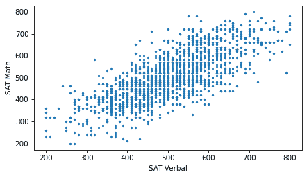

# 变量之间的关系

> 原文：[`allendowney.github.io/ThinkStats/chap07.html`](https://allendowney.github.io/ThinkStats/chap07.html)

到目前为止，我们一次只查看一个变量。在本章中，我们开始研究变量之间的关系。如果知道一个变量就能给你关于另一个变量的信息，那么这两个变量就是相关的。例如，身高和体重是相关的——个子高的人往往比较重。当然，这并不是一个完美的关系：也有又矮又重的人和又高又轻的人。但如果你试图猜测某人的体重，知道他们的身高会比不知道更准确。

本章介绍了多种可视化变量之间关系的方法，以及一种量化关系强度，即相关性的方法。

[点击此处运行此笔记本在 Colab 上](https://colab.research.google.com/github/AllenDowney/ThinkStats/blob/v3/nb/chap07.ipynb)。

```py
from  os.path  import basename, exists

def  download(url):
    filename = basename(url)
    if not exists(filename):
        from  urllib.request  import urlretrieve

        local, _ = urlretrieve(url, filename)
        print("Downloaded " + local)

download("https://github.com/AllenDowney/ThinkStats/raw/v3/nb/thinkstats.py") 
```

```py
try:
    import  empiricaldist
except ImportError:
    %pip install empiricaldist 
```

```py
import  numpy  as  np
import  pandas  as  pd
import  matplotlib.pyplot  as  plt

from  thinkstats  import decorate 
```

## 散点图

如果你遇到一个数学特别擅长的人，你会期望他们的语言技能比平均水平更好还是更差？一方面，你可能会想象人们会在一个或另一个领域专长，所以擅长一个领域的人可能在另一个领域不那么擅长。另一方面，你可能会期望一个一般都很聪明的人在两个领域都高于平均水平。让我们找出哪个是正确的。

我们将使用 1997 年国家青年纵向调查（NLSY97）的数据，该调查“追踪了 1980-84 年间出生的 8,984 名美国青年的生活”。公共数据集包括参与者在几个标准化测试中的得分，包括在大学入学中最常用的 SAT 和 ACT 测试。因为测试者会得到数学和语言部分的单独分数，我们可以使用这些数据来探索数学能力和语言能力之间的关系。

我使用 NLS Investigator 创建了一个摘录，其中包含我将用于此分析的自变量。在他们的许可下，我可以重新分发这个摘录。关于下载数据的说明在本书的笔记本中。

```py
download("https://github.com/AllenDowney/ThinkStats/raw/v3/data/nlsy97-extract.csv.gz") 
```

我们可以使用`read_csv`来读取数据，并使用`replace`将缺失数据的特殊代码替换为`np.nan`。

```py
missing_codes = [-1, -2, -3, -4, -5]
nlsy = pd.read_csv("nlsy97-extract.csv.gz").replace(missing_codes, np.nan)
nlsy.shape 
```

```py
(8984, 34) 
```

```py
nlsy.head() 
```

|  | R0000100 | R0490200 | R0536300 | R0536401 | R0536402 | R1235800 | R1318200 | R1482600 | R3961900 | R3989200 | ... | R9872200 | R9872300 | R9872400 | S1552700 | U0008900 | U1845500 | U3444000 | U4949700 | Z9083800 | Z9083900 |
| --- | --- | --- | --- | --- | --- | --- | --- | --- | --- | --- | --- | --- | --- | --- | --- | --- | --- | --- | --- | --- |
| 0 | 1 | NaN | 2 | 9 | 1981 | 1 | NaN | 4 | NaN | NaN | ... | 293.0 | 250.0 | 333.0 | NaN | 120000.0 | NaN | NaN | NaN | 16.0 | 4.0 |
| 1 | 2 | NaN | 1 | 7 | 1982 | 1 | 145.0 | 2 | NaN | NaN | ... | 114.0 | 230.0 | 143.0 | NaN | 98928.0 | 116000.0 | 188857.0 | 180000.0 | 14.0 | 2.0 |
| 2 | 3 | NaN | 2 | 9 | 1983 | 1 | 82.0 | 2 | NaN | NaN | ... | NaN | NaN | NaN | NaN | NaN | NaN | NaN | 75000.0 | 16.0 | 4.0 |
| 3 | 4 | NaN | 2 | 2 | 1981 | 1 | NaN | 2 | NaN | NaN | ... | 195.0 | 230.0 | 216.0 | NaN | 85000.0 | 45000.0 | NaN | NaN | 13.0 | 2.0 |
| 4 | 5 | NaN | 1 | 10 | 1982 | 1 | NaN | 2 | NaN | NaN | ... | 293.0 | 230.0 | 231.0 | NaN | 210000.0 | 212000.0 | NaN | 240000.0 | 12.0 | 2.0 |

5 行 × 34 列

`DataFrame`包含调查中每个 8984 名参与者的一个行，以及我选择的每个 34 个变量的一个列。列名本身没有太多意义，所以让我们用我们将使用的更可解释的名称来替换它们。

```py
nlsy["sat_verbal"] = nlsy["R9793800"]
nlsy["sat_math"] = nlsy["R9793900"] 
```

两个列都包含一些小于 200 的值，这是不可能的，因为 200 是最低分，所以我们将它们替换为`np.nan`。

```py
columns = ["sat_verbal", "sat_math"]

for column in columns:
    invalid = nlsy[column] < 200
    nlsy.loc[invalid, column] = np.nan 
```

接下来，我们将使用`dropna`来选择只有两个分数都有效的行。

```py
nlsy_valid = nlsy.dropna(subset=columns).copy()
nlsy_valid.shape 
```

```py
(1398, 36) 
```

SAT 分数是标准化的，所以平均分是 500，标准差是 100。在 NLSY 样本中，平均值和标准差接近这些值。

```py
sat_verbal = nlsy_valid["sat_verbal"]
sat_verbal.mean(), sat_verbal.std() 
```

```py
(np.float64(501.80972818311875), np.float64(108.36562024213643)) 
```

```py
sat_math = nlsy_valid["sat_math"]
sat_math.mean(), sat_math.std() 
```

```py
(np.float64(503.0829756795422), np.float64(109.8329973731453)) 
```

现在，为了看看这些变量之间是否存在关系，让我们看看一个**散点图**。

```py
plt.scatter(sat_verbal, sat_math)

decorate(xlabel="SAT Verbal", ylabel="SAT Math") 
```


使用`scatter`函数的默认选项，我们可以看到关系的一般形状。在测试的一个部分表现好的人，在其他部分也倾向于表现更好。

然而，这个版本的图形是**过度绘图**的，这意味着有很多重叠的点，这可能会产生误导性的关系印象。点密度最高的中心区域并不像应该的那样暗——相比之下，极端值比应该的更暗。过度绘图往往会给异常值过多的视觉权重。

我们可以通过减小标记的大小来改进图形，这样它们就重叠得更少。

```py
plt.scatter(sat_verbal, sat_math, s=5)

decorate(xlabel="SAT Verbal", ylabel="SAT Math") 
```



现在我们可以看到标记已经按行和列对齐，因为分数被四舍五入到最接近的 10 的倍数。在这个过程中，一些信息丢失了。

我们无法恢复这些信息，但我们可以通过**抖动**数据来最小化对散点图的影响，这意味着向数据中添加随机噪声以抵消四舍五入的影响。以下函数接受一个序列，并通过添加具有均值为 0 和给定标准差的正态分布的随机值来抖动它。结果是 NumPy 数组。

```py
def  jitter(seq, std=1):
    n = len(seq)
    return np.random.normal(0, std, n) + seq 
```

如果我们用标准差为 3 的分数进行抖动，散点图中的行和列就不再可见了。

```py
sat_verbal_jittered = jitter(sat_verbal, 3)
sat_math_jittered = jitter(sat_math, 3) 
```

```py
plt.scatter(sat_verbal_jittered, sat_math_jittered, s=5)

decorate(xlabel="SAT Verbal", ylabel="SAT Math") 
```


抖动减少了四舍五入的视觉影响，使关系的形状更清晰。但一般来说，你应该只为可视化目的抖动数据，避免使用抖动数据进行分析。

在这个例子中，即使调整了标记大小并抖动数据，仍然存在一些重叠。所以让我们再试一次：我们可以使用`alpha`关键字使标记部分透明。

```py
plt.scatter(sat_verbal_jittered, sat_math_jittered, s=5, alpha=0.2)

decorate(xlabel="SAT Verbal", ylabel="SAT Math") 
```


在透明度下，重叠的数据点看起来更暗，因此暗度与密度成正比。

虽然散点图是一种简单且广泛使用的可视化方法，但要正确使用它们可能很困难。一般来说，需要一些尝试和错误来调整标记大小、透明度和抖动，以找到变量之间关系的最佳视觉表示。

## 十分位数图

散点图提供了变量之间关系的总体印象，但还有其他可视化方法可以更深入地了解关系的本质。其中之一是**十分位数图**。

要生成十分位数图，我们将受访者按语言分数排序，并将他们分成 10 组，称为**十分位数**。我们可以使用`qcut`方法计算十分位数。

```py
deciles = pd.qcut(nlsy_valid["sat_verbal"], 10, labels=False) + 1
deciles.value_counts().sort_index() 
```

```py
sat_verbal
1     142
2     150
3     139
4     140
5     159
6     130
7     148
8     121
9     138
10    131
Name: count, dtype: int64 
```

每个十分位数的受访者数量大致相等。

现在，我们可以使用`groupby`方法根据`decile`将`DataFrame`分成组。

```py
df_groupby = nlsy_valid.groupby(deciles)
df_groupby 
```

```py
<pandas.core.groupby.generic.DataFrameGroupBy object at 0x7fa0adfd49d0> 
```

结果是一个`DataFrameGroupBy`对象，表示组。我们可以从中选择`sat_math`列。

```py
series_groupby = df_groupby["sat_math"]
series_groupby 
```

```py
<pandas.core.groupby.generic.SeriesGroupBy object at 0x7fa0b01af7d0> 
```

结果是一个`SeriesGroupBy`对象，表示每个十分位数的数学分数。我们可以使用`quantile`函数计算每个组的第 10、50 和 90 个百分位数。

```py
low = series_groupby.quantile(0.1)
median = series_groupby.quantile(0.5)
high = series_groupby.quantile(0.9) 
```

十分位数图显示了每个十分位数组的这些百分位数。在下面的图中，线表示中位数，阴影区域表示第 10 和第 90 百分位数之间的区域。

```py
xs = median.index
plt.fill_between(xs, low, high, alpha=0.2)
plt.plot(xs, median, label="median")

decorate(xlabel="SAT Verbal Decile", ylabel="SAT Math") 
```


作为一种替代方案，我们可以计算每个小组的中位数语言分数，并将这些值绘制在 x 轴上，而不是十分位数数字。

```py
xs = df_groupby["sat_verbal"].median()

plt.fill_between(xs, low, high, alpha=0.2)
plt.plot(xs, median, color="C0", label="median")

decorate(xlabel="SAT Verbal", ylabel="SAT Math") 
```


看起来这些变量之间的关系是线性的——也就是说，中位数语言分数的每次增加都对应着中位数数学分数的大致相等增加。

更普遍地说，我们可以将受访者分成任意数量的组，不一定非要是 10 个，我们可以在每个组中计算其他汇总统计量，而不仅仅是这些百分位数。

## 相关系数

当 NLSY 参与者处于 9 年级时，他们中的许多人参加了皮博迪个人成就测试（PIAT）的数学部分。让我们给包含结果的列一个更易理解的名称。

```py
nlsy["piat_math"] = nlsy["R1318200"]
nlsy["piat_math"].describe() 
```

```py
count    6044.000000
mean       93.903706
std        14.631148
min        55.000000
25%        84.000000
50%        92.000000
75%       103.000000
max       145.000000
Name: piat_math, dtype: float64 
```

下面是分数分布的图示。

```py
from  empiricaldist  import Cdf

cdf_piat_math = Cdf.from_seq(nlsy["piat_math"], name="PIAT math")
cdf_piat_math.step()
decorate(ylabel="CDF") 
```


在 9 年级 PIAT 表现良好的学生很可能在 12 年级 SAT 数学部分表现良好。对于参加了这两次测试的 NLSY 参与者，以下散点图显示了他们的分数之间的关系。它使用了`thinkstats`中的`scatter`函数，该函数调整标记大小和透明度，并可选择抖动数据。

```py
from  thinkstats  import scatter

scatter(nlsy, "piat_math", "sat_math")

decorate(xlabel="PIAT Math", ylabel="SAT Math") 
```


如预期，在 PIAT 中表现良好的学生也可能会在 SAT 数学中表现良好。如果数学和语言能力相关，我们预计他们在 SAT 语言部分也会表现良好。下图显示了 PIAT 和 SAT 语言分数之间的关系。

```py
scatter(nlsy, "piat_math", "sat_verbal")

decorate(xlabel="PIAT Math", ylabel="SAT Verbal") 
```


PIAT 分数较高的学生平均 SAT 语言分数也较高。

比较散点图，第一个图中的点可能更紧凑，而第二个图中的点可能更分散。如果是这样，这意味着 PIAT 数学分数比它们预测 SAT 语言分数更准确地预测 SAT 数学分数——如果它们确实如此，这是有道理的。

为了量化这些关系的强度，我们可以使用**皮尔逊相关系数**，通常简称为“相关系数”。为了理解相关系数，让我们从标准化开始。

为了标准化一个变量，我们减去平均值，然后除以标准差，就像这个函数中那样。

```py
def  standardize(xs):
  """Standardizes a sequence of numbers.

 xs: sequence of numbers

 returns: NumPy array
 """
    return (xs - np.mean(xs)) / np.std(xs) 
```

为了展示其用法，我们将选择`piat_math`和`sat_math`有效的行。

```py
valid = nlsy.dropna(subset=["piat_math", "sat_math"])
piat_math = valid["piat_math"]
sat_math = valid["sat_math"] 
```

并且将 PIAT 数学分数进行标准化。

```py
piat_math_standard = standardize(piat_math)
np.mean(piat_math_standard), np.std(piat_math_standard) 
```

```py
(np.float64(-2.4321756236287047e-16), np.float64(1.0)) 
```

结果是**标准分数**，也称为“z 分数”。由于标准分数的计算方式，平均值接近 0，标准差接近 1。

让我们也将 SAT 数学分数进行标准化。

```py
sat_math_standard = standardize(sat_math)
np.mean(sat_math_standard), np.std(sat_math_standard) 
```

```py
(np.float64(-1.737268302591932e-16), np.float64(0.9999999999999998)) 
```

下图显示了前 100 名参与者的这些分数序列。

使用`subplot`函数并带有参数`2, 1, 1`告诉 Matplotlib 创建多个图表，排列成两行一列，并初始化第一个图表。再次使用带有参数`2, 1, 2`的`subplot`函数初始化第二个图表。`axhline`函数绘制一个横跨轴宽的水平线。


这些变量之间有明显的相关性：当一个变量高于平均值时，另一个变量也很可能高于平均值。为了量化这种关系的强度，我们将逐元素相乘标准分数并计算乘积的平均值。

当两个分数都是正数时，它们的乘积是正数，因此它倾向于增加平均乘积。当两个分数都是负数时，它们的乘积也是正数，因此它也倾向于增加平均乘积。当分数有相反的符号时，乘积是负数，因此它减少了平均乘积。因此，平均乘积衡量了序列之间的相似性。

```py
np.mean(piat_math_standard * sat_math_standard) 
```

```py
np.float64(0.639735816517885) 
```

结果，大约为 0.64，是相关系数。这里有一种解释方式：如果某人的 PIAT 数学分数比平均值高一个标准差，我们预计他们的 SAT 数学分数平均会高出 0.64 个标准差。

如果我们以其他顺序乘以元素，结果也是相同的。

```py
np.mean(sat_math_standard * piat_math_standard) 
```

```py
np.float64(0.639735816517885) 
```

因此，相关系数是对称的：如果某人的 SAT 数学分数比平均值高一个标准差，我们预计他们的 PIAT 数学分数平均会高 0.64 个标准差。

相关系数是一个常用的统计量，因此 NumPy 提供了一个计算它的函数。

```py
np.corrcoef(piat_math, sat_math) 
```

```py
array([[1\.        , 0.63973582],
       [0.63973582, 1\.        ]]) 
```

结果是一个**相关矩阵**，每个变量都有一个行和一个列。左上角的值是`piat_math`与其自身的相关性。右下角的值是`sat_math`与其自身的相关性。任何变量与其自身的相关性是 1，这表示完全相关。

上右和下左的值是`piat_math`与`sat_math`以及`sat_math`与`piat_math`的相关性，这两个值必然是相等的。

`thinkstats`提供了一个`corrcoef`函数，它接受一个`DataFrame`和两个列名，选择两个列都有效的行，并计算它们的相关性。

```py
from  thinkstats  import corrcoef

corrcoef(nlsy, "piat_math", "sat_math") 
```

```py
np.float64(0.6397358165178849) 
```

我们可以使用这个函数来计算`piat_math`和`sat_verbal`之间的相关性。

```py
corrcoef(nlsy, "piat_math", "sat_verbal") 
```

```py
np.float64(0.509413914696731) 
```

相关系数为 0.51，因此如果某人的 PIAT 数学分数比平均值高一个标准差，我们预计他们的 SAT 语文分数平均会高出 0.51 个标准差。

如我们所预期，PIAT 数学分数比它们预测 SAT 语文分数更好地预测 SAT 数学分数。

## 相关系数的强度

随着你查看更多的散点图，你会对不同的相关性看起来是什么样子有一个感觉。为了帮助你培养这种感觉，以下图表展示了具有不同相关性的随机生成数据的散点图。

```py
np.random.seed(17)
xs = np.random.normal(size=300)
ys = np.random.normal(size=300) 
```


希腊字母ρ，读作“rho”，发音类似于“row”，是相关系数的传统符号。

相关系数也可以是负的。以下是具有一系列负相关性的随机数据的散点图。


相关系数总是在-1 和 1 之间。如果两个变量之间没有关系，它们的相关系数为 0——但如果相关系数为 0，这并不一定意味着没有关系。

尤其是在存在非线性关系的情况下，相关系数可能接近于 0。在以下每个例子中，变量之间存在明显的关系，即如果我们给出其中一个值，我们就可以对另一个值做出相当大的预测改进。但在每种情况下，相关系数都接近于 0。


相关系数量化了变量之间线性关系的强度。如果存在非线性关系，相关系数可能会误导。而且，如果相关系数接近于 0，这并不意味着没有关系。

## 排名相关性

NLSY 是纵向的，这意味着它随着时间的推移跟踪同一组人。我们一直在研究的群体包括 1980 年至 1984 年出生的人。那些参加 SAT 考试的人可能在 1990 年代末参加，当时他们大约 18 岁。因此，当他们在 2021 年谈论他们的收入时，他们已经 30 多岁或 40 多岁。让我们给收入数据列一个更易理解的名称。

```py
nlsy["income"] = nlsy["U4949700"]
nlsy["income"].describe() 
```

```py
count      6051.000000
mean     104274.239960
std      108470.571497
min           0.000000
25%       38000.000000
50%       80000.000000
75%      134157.000000
max      599728.000000
Name: income, dtype: float64 
```

这一列的值是毛家庭收入，即受访者及其家庭其他成员从所有来源报告的总收入，以美元（USD）为单位。以下是收入分布的图示。

```py
cdf_income = Cdf.from_seq(nlsy["income"])
cdf_income.step()

decorate(xlabel="Income (USD)", ylabel="CDF") 
```


注意到接近 600,000 的步骤——超过此阈值的值被限制以保护参与者的匿名性。现在，这是受访者 SAT 数学成绩和其未来收入的散点图。

```py
scatter(nlsy, "piat_math", "income")

decorate(xlabel="PIAT math", ylabel="Gross Family Income (USD)") 
```


看起来这些变量之间存在关系。以下是相关系数。

```py
corrcoef(nlsy, "piat_math", "income") 
```

```py
np.float64(0.30338587288641233) 
```

相关系数约为 0.3，这意味着如果某人在 15 岁时 PIAT 数学成绩比平均值高出一个标准差，我们预计他们在 40 岁时收入将比平均值高出约 0.3 个标准差。这不如 PIAT 成绩和 SAT 成绩之间的相关性强，但考虑到影响收入的因素数量，这相当强。

实际上，皮尔逊相关系数可能低估了关系的强度。正如我们在之前的散点图中可以看到的，两个变量在极端值方面都有明显的过剩。因为相关系数基于与平均值的偏差的乘积，它对这些极端值很敏感。

一个更稳健的替代方法是**秩相关**，它基于分数的秩而不是标准化分数。我们可以使用 Pandas 的`rank`方法来计算每个分数和每个收入的秩。

```py
valid = nlsy.dropna(subset=["piat_math", "income"])

piat_math_rank = valid["piat_math"].rank(method="first")
income_rank = valid["income"].rank(method="first") 
```

使用`method="first"`参数，`rank`将秩从 1 分配到序列的长度，即 4101。

```py
income_rank.min(), income_rank.max() 
```

```py
(np.float64(1.0), np.float64(4101.0)) 
```

这是一张收入秩与数学分数秩的散点图。

```py
plt.scatter(piat_math_rank, income_rank, s=5, alpha=0.2)

decorate(xlabel="PIAT math rank", ylabel="Income rank") 
```


这是秩之间的相关性。

```py
np.corrcoef(piat_math_rank, income_rank)[0, 1] 
```

```py
np.float64(0.38148396696764847) 
```

结果大约是 0.38，略高于皮尔逊相关系数，后者为 0.30。因为秩相关对极端值的影响不太敏感，所以它可能是衡量这些变量之间关系强度的一个更好的指标。

`thinkplot`提供了一个封装了本节代码的`rankcorr`函数。

```py
from  thinkstats  import rankcorr

rankcorr(nlsy, "piat_math", "income") 
```

```py
np.float64(0.38474681505344815) 
```

SciPy 提供了一个类似的功能，称为`spearmanr`，因为秩相关也称为斯皮尔曼相关。

```py
from  scipy.stats  import spearmanr

spearmanr(valid["piat_math"], valid["income"]).statistic 
```

```py
np.float64(0.38474681505344815) 
```

作为练习，你将有机会使用皮尔逊相关和秩相关来计算 SAT 语文分数和收入之间的相关性。

## 相关性与因果关系

如果变量 A 和 B 相关，这种明显的相关性可能是由于随机抽样造成的，或者可能是由于非代表性抽样造成的，或者可能表明总体中数量之间存在真实的相关性。

如果相关性是真实的，有三个可能的解释：A 导致 B，或者 B 导致 A，或者某些其他因素同时导致 A 和 B。这些解释被称为“因果关系”。

单独的相关性无法区分这些解释，因此它不能告诉你哪些是真实的。这个规则通常用短语“相关性不等于因果关系”来概括，这个短语如此简洁，以至于它有自己的维基百科页面。

[`wikipedia.org/wiki/Correlation_does_not_imply_causation`](http://wikipedia.org/wiki/Correlation_does_not_imply_causation)

那么，你该如何提供因果关系的证据呢？

1.  使用时间。如果 A 发生在 B 之前，那么 A 可以导致 B，但不能反过来。事件发生的顺序可以帮助我们推断因果关系的方向，但这并不排除其他因素同时导致 A 和 B 的可能性。

1.  使用随机性。如果你随机将一个大样本分成两组并计算几乎任何变量的平均值，你期望差异很小。如果两组在所有变量上几乎相同，但在 A 和 B 上不同，你可以排除其他因素同时导致 A 和 B 的可能性。

这些想法是**随机对照试验**的动机，在随机对照试验中，受试者被随机分配到两个（或更多）组：一个**干预组**，该组接受某种干预，如新药，和一个**对照组**，该组不接受干预，或接受已知效果的另一种治疗。随机对照试验是证明因果关系最可靠的方法，也是循证医学的基础。

不幸的是，有时控制试验是不可能的或不道德的。一种替代方法是寻找**自然实验**，在这种情况下，由于实验者无法控制的情况，相似的组被暴露于不同的条件中。

识别和测量因果关系是统计学的一个分支，称为**因果推断**。

## 术语表

+   **散点图**：一种可视化，通过为数据集中的每个观测值绘制一个点来显示两个变量之间的关系。

+   **过度绘图**：如果许多标记重叠，散点图就会过度绘图，这使得难以区分不同密度的区域，可能会错误地表示关系。

+   **抖动**：在图表中的数据点上添加随机噪声，以使重叠的值更易于可见。

+   **十分位图**：一种将数据根据一个变量分成十分位（十个组）的图表，然后对每个组总结另一个变量。

+   **十分位**：通过排序数据并将其分成大约相等的十部分所创建的组之一。

+   **皮尔逊相关系数**：一个统计量，用于衡量两个变量之间线性关系的强度和符号（正或负）。

+   **标准分数**：一个经过标准化处理的量，表示它相对于平均值的标准差。

+   **相关矩阵**：一个表格，显示数据集中每对变量的相关系数。

+   **秩相关**：一种通过使用值的秩而不是实际值来量化关系强度的稳健方法。

+   **随机对照试验**：一种实验，其中受试者被随机分配到接受不同治疗的组。

+   **干预组**：在实验中，接受正在测试的干预的组。

+   **对照组**：在实验中，不接受干预或接受已知效果的治疗的组。

+   **自然实验**：一种使用自然形成的组进行的实验，有时可以模仿随机分配。

+   **因果推断**：识别和量化因果关系的方法。

## 练习

### 练习 7.1

`thinkstats`模块提供了一个名为`decile_plot`的函数，它封装了本章前面的代码。我们可以这样调用它来可视化 SAT 语文和数学分数之间的关系。

```py
from  thinkstats  import decile_plot

decile_plot(nlsy, "sat_verbal", "sat_math")
decorate(xlabel="SAT Verbal", ylabel="SAT Math") 
```


制作 PIAT 数学分数和收入的十分位图。这似乎是线性关系吗？

### 练习 7.2

绘制收入与 SAT 数学分数的散点图。计算皮尔逊相关系数和等级相关系数。它们有显著差异吗？

绘制收入与 SAT 语文分数的散点图，并计算两个相关系数。哪个是未来收入的更强预测指标？

### 练习 7.3

让我们看看学生的高中平均成绩（GPA）与他们的 SAT 分数之间的相关性。这是 NLSY 数据集中编码 GPA 的变量。

```py
missing_codes = [-6, -7, -8, -9]
nlsy["gpa"] = nlsy["R9871900"].replace(missing_codes, np.nan) / 100
nlsy["gpa"].describe() 
```

```py
count    6004.000000
mean        2.818408
std         0.616357
min         0.100000
25%         2.430000
50%         2.860000
75%         3.260000
max         4.170000
Name: gpa, dtype: float64 
```

这就是 GPA 分布看起来像什么。

```py
cdf_income = Cdf.from_seq(nlsy["gpa"])
cdf_income.step()
decorate(xlabel="GPA", ylabel="CDF") 
```


绘制 GPA 与 SAT 数学分数之间的关系散点图，并计算相关系数。对于 GPA 与 SAT 语文分数之间的关系也做同样处理。哪个 SAT 分数是 GPA 更好的预测指标？

### 练习 7.4

让我们调查教育和收入之间的关系。NLSY 数据集包括一个列，报告了每个受访者的最高学位。这些值被编码为整数。

```py
nlsy["degree"] = nlsy["Z9083900"]
nlsy["degree"].value_counts().sort_index() 
```

```py
degree
0.0     877
1.0    1167
2.0    3531
3.0     766
4.0    1713
5.0     704
6.0      64
7.0     130
Name: count, dtype: int64 
```

但我们可以使用这些列表来解码它们。

```py
positions = [0, 1, 2, 3, 4, 5, 6, 7]
labels = [
    "None",
    "GED",
    "High school diploma",
    "Associate's degree",
    "Bachelor's degree",
    "Master's degree",
    "PhD",
    "Professional degree",
] 
```

并制作一个表示教育成就分布的`Pmf`。

```py
from  empiricaldist  import Pmf

Pmf.from_seq(nlsy["degree"]).bar()

plt.xticks(positions, labels, rotation=30, ha="right")
decorate(ylabel="PMF") 
```


绘制`income`与`degree`的散点图。为了避免重叠，对`degree`的值进行抖动，并调整标记大小和透明度。

使用`groupby`方法按`degree`对受访者进行分组。从`DataFrameGroupBy`对象中选择`income`列；然后使用`quantile`方法计算每个组的均值、10 分位数和 90 分位数。使用`fill_between`绘制 10 分位数和 90 分位数之间的区域，并使用`plot`绘制均值。

你能说些什么关于每增加一个学位所关联的收入溢价？

### 练习 7.4

行为风险因素监测系统（BRFSS）数据集包括大约 40 万受访者的自报身高和体重。下载数据的说明在本章的笔记本中。

绘制身高与体重的散点图。你可能需要抖动数据以模糊由于四舍五入而可见的行和列。由于样本量很大，你将不得不调整标记大小和透明度以避免重叠。此外，由于两种测量都有异常值，你可能想使用`xlim`和`ylim`来放大覆盖大多数受访者的区域。

这是我们如何加载数据的方法。

```py
download("https://github.com/AllenDowney/ThinkStats/raw/v3/data/CDBRFS08.ASC.gz") 
```

```py
from  thinkstats  import read_brfss

brfss = read_brfss()
brfss["htm3"].describe() 
```

```py
count    409129.000000
mean        168.825190
std          10.352653
min          61.000000
25%         160.000000
50%         168.000000
75%         175.000000
max         236.000000
Name: htm3, dtype: float64 
```

制作体重与身高的十分位图。这种关系看起来是线性的吗？计算相关系数和等级相关系数。它们有显著差异吗？你认为哪一个更好地量化了这些变量之间的关系？

[Think Stats: Exploratory Data Analysis in Python, 3rd Edition](https://allendowney.github.io/ThinkStats/index.html)

版权所有 2024 [艾伦·B·唐尼](https://allendowney.com)

代码许可：[MIT License](https://mit-license.org/)

文本许可：[Creative Commons Attribution-NonCommercial-ShareAlike 4.0 International](https://creativecommons.org/licenses/by-nc-sa/4.0/)
