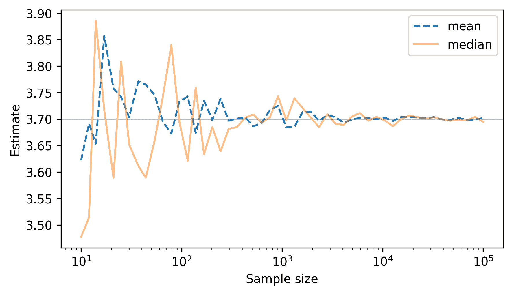
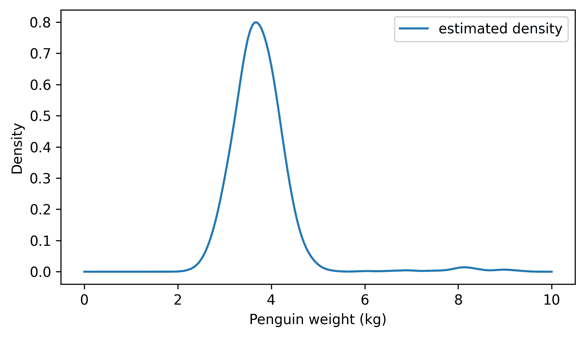
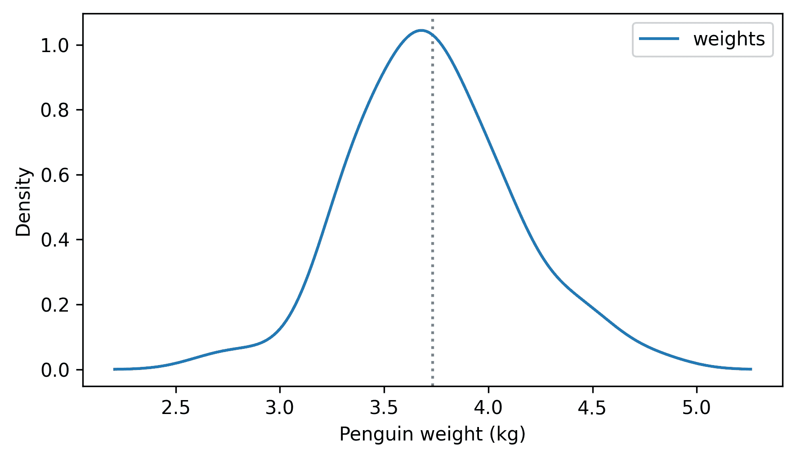
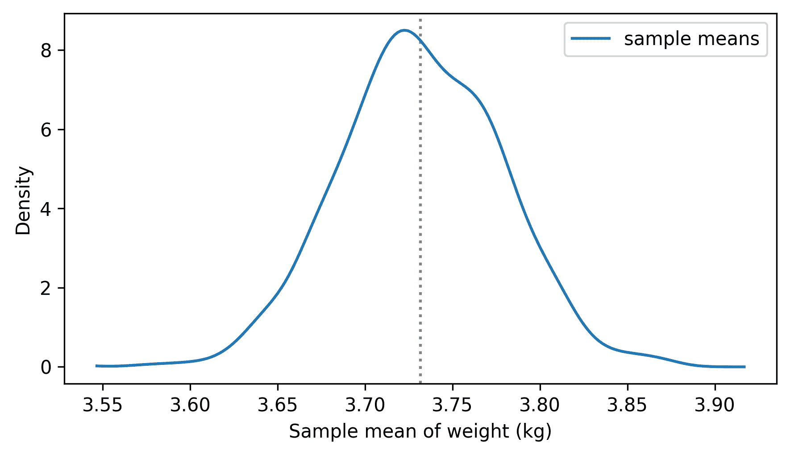

# 估计

> 原文：[`allendowney.github.io/ThinkStats/chap08.html`](https://allendowney.github.io/ThinkStats/chap08.html)

假设你居住在一个有 10,000 人的小镇上，你想预测即将到来的选举中谁会获胜。从理论上讲，你可以询问镇上的每个人他们打算投给谁，如果他们都诚实地回答，你就可以做出可靠的预测。

但即使在小镇上，调查整个种群可能也不太实际。幸运的是，这并不必要。如果你调查了人群的随机子集，你可以使用样本来推断人群的投票偏好。这个过程——使用样本对人群进行推断——被称为统计推断。

统计推断包括估计，这是本章的主题，以及假设检验，这是下一章的主题。

[点击此处运行此笔记本在 Colab](https://colab.research.google.com/github/AllenDowney/ThinkStats/blob/v3/nb/chap08.ipynb)。

```py
from  os.path  import basename, exists

def  download(url):
    filename = basename(url)
    if not exists(filename):
        from  urllib.request  import urlretrieve

        local, _ = urlretrieve(url, filename)
        print("Downloaded " + local)

download("https://github.com/AllenDowney/ThinkStats/raw/v3/nb/thinkstats.py") 
```

```py
try:
    import  empiricaldist
except ImportError:
    %pip install empiricaldist 
```

```py
import  numpy  as  np
import  pandas  as  pd
import  matplotlib.pyplot  as  plt

from  thinkstats  import decorate 
```  ## 企鹅称重

假设你是一名在南极洲的研究员，正在研究当地的企鹅种群。你的一个任务是监控企鹅在整个年度中的平均体重变化。由于不可能对环境中的每只企鹅进行称重，因此你的计划是每周随机抽取 10 只企鹅进行称重，并使用这些样本来估计整个种群的平均值——这被称为**种群均值**。

你可以使用许多方法来使用样本估计种群均值，但我们将考虑其中的两种：样本均值和样本中位数。它们都是合理的选择，但让我们看看哪个更好——并思考一下我们所说的“更好”是什么意思。

为了演示目的，我们假设企鹅的体重服从一个已知均值和标准差的正态分布，我将用`mu`和`sigma`表示，并赋予千克单位。

```py
mu = 3.7
sigma = 0.46 
```

这些值是正态分布的**参数**，这意味着它们指定了特定的分布。给定这些参数，我们可以使用 NumPy 来模拟抽样过程并生成任何大小的样本。例如，这里是一个假设的 10 个重量的样本。

```py
# Seed the random number generator so we get the same results every time
np.random.seed(1) 
```

```py
sample = np.random.normal(mu, sigma, size=10)
sample 
```

```py
array([4.44719887, 3.41859205, 3.45704099, 3.20643443, 4.09808751,
       2.6412922 , 4.50261341, 3.34984483, 3.84675798, 3.58528963]) 
```

这里是样本的平均值和中位数。

```py
np.mean(sample), np.median(sample) 
```

```py
(np.float64(3.6553151902291945), np.float64(3.521165310619601)) 
```

平均值和中位数差异足够大，以至于我们应该思考哪个是更好的估计。为了找出答案，我们将使用以下函数生成给定大小`n`的假设样本。

```py
def  make_sample(n):
    return np.random.normal(mu, sigma, size=n) 
```

作为第一次实验，让我们看看样本均值和样本中位数随着样本大小的增加是如何表现的。我们将使用 NumPy 函数`logspace`来创建一个从 10 到 100,000 的对数尺度上的`ns`范围。

```py
ns = np.logspace(1, 5).astype(int) 
```

我们可以使用列表推导来生成每个`n`值的假设样本，计算平均值，并收集结果：

```py
means = [np.mean(make_sample(n)) for n in ns] 
```

我们也会对中位数做同样的处理。

```py
medians = [np.median(make_sample(n)) for n in ns] 
```

用来估计总体属性的统计量，如样本均值或中位数，被称为**估计量**。

以下图示展示了随着样本量的增加，这些估计量是如何表现的。水平线显示了总体中的实际均值。

```py
plt.axhline(mu, color="gray", lw=1, alpha=0.5)
plt.plot(ns, means, "--", label="mean")
plt.plot(ns, medians, alpha=0.5, label="median")

decorate(xlabel="Sample size", xscale="log", ylabel="Estimate") 
```



对于这两个估计量，随着样本量的增加，估计值会收敛到实际值。这证明了它们是**一致的**，这是良好估计量应具备的一个属性。基于这个属性，均值和中位数看起来同样好。

在前面的图中，你可能会注意到估计值有时过高，有时过低——看起来变化大致对称于真实值。这表明另一个实验：如果我们收集许多相同大小的样本并计算许多估计值，估计值的平均值是多少？

下面的循环通过生成 10,001 个 10 只企鹅的样本并计算每个样本的均值来模拟这种场景。

```py
means = [np.mean(make_sample(n=10)) for i in range(10001)]
np.mean(means) 
```

```py
np.float64(3.70034508492869) 
```

均值平均值接近我们用来生成样本的实际均值：3.7 千克。

下面的循环模拟了相同的场景，但这次它计算每个样本的中位数。

```py
medians = [np.median(make_sample(n=10)) for i in range(10001)]
np.mean(medians) 
```

```py
np.float64(3.701214089907223) 
```

这些假设的中位数平均值也非常接近实际总体均值。

这些结果表明，样本均值和中位数是**无偏**估计量，这意味着它们在平均上是正确的。在不同的语境中，“偏差”这个词有不同的含义，这可能会引起混淆。在这个语境中，“无偏”意味着估计的平均值是实际值。

到目前为止，我们已经表明这两个估计量都是一致且无偏的，但仍然不清楚哪个更好。让我们再做一个实验：让我们看看哪个估计量更准确。在不同的语境中，“准确”这个词也有不同的含义——作为一种量化方法，让我们考虑**均方误差**（MSE）。以下函数计算估计值与实际值之间的差异，并返回这些误差平方的平均值。

```py
def  mse(estimates, actual):
  """Mean squared error of a sequence of estimates."""
    errors = np.asarray(estimates) - actual
    return np.mean(errors**2) 
```

注意，我们只能计算均方误差如果我们知道实际值。在实践中，我们通常不知道——毕竟，如果我们知道实际值，我们就不需要估计它了。但在我们的实验中，我们知道实际总体均值是 3.7 千克，因此我们可以用它来计算样本均值的均方误差。

```py
mse(means, mu) 
```

```py
np.float64(0.020871984891289382) 
```

如果我们有大小为 10 的样本，并使用样本均值来估计总体均值，平均平方误差大约为 0.021 千克平方。现在来看样本中位数的均方误差。

```py
mse(medians, mu) 
```

```py
np.float64(0.029022273128644173) 
```

如果我们使用样本中位数来估计总体均值，平均平方误差大约是 0.029 千克平方。在这个例子中，样本均值比样本中位数更好；而且一般来说，如果数据来自正态分布，它就是总体均值的最优无偏估计量，因为它最小化了均方误差（MSE）。

最小化 MSE 是一个估计量应该具备的良好属性，但 MSE 并不总是总结误差的最佳方式。一方面，它很难解释。在这个例子中，MSE 的单位是千克平方，因此很难说这意味着什么。

一个解决方案是使用均方误差的平方根，称为“均方根误差”（RMSE）。另一个选项是使用误差绝对值的平均值，称为“平均绝对误差”（MAE）。以下函数计算估计序列的 MAE。

```py
def  mae(estimates, actual):
  """Mean absolute error of a sequence of estimates."""
    errors = np.asarray(estimates) - actual
    return np.mean(np.abs(errors)) 
```

这是样本均值的 MAE。

```py
mae(means, mu) 
```

```py
np.float64(0.11540433749505272) 
```

以及样本中位数。

```py
mae(medians, mu) 
```

```py
np.float64(0.13654429774596036) 
```

平均来说，我们预计样本均值偏离大约 0.115 千克，样本中位数偏离 0.137 千克。所以样本均值可能是更好的选择，至少在这个例子中。

## 稳健性

现在让我们考虑一个不同的场景。假设有 2%的时间，当你试图称量企鹅时，它意外地按下了秤上的单位按钮，重量被记录为磅而不是千克。假设这个错误没有被注意到，它会在样本中引入一个异常值。

以下函数模拟了这种情况，将 2%的重量乘以每千克 2.2 磅的转换系数。

```py
def  make_sample_with_errors(n):
    sample = np.random.normal(mu, sigma, size=n)
    factor = np.random.choice([1, 2.2], p=[0.98, 0.02], size=n)
    return sample * factor 
```

为了看到这对此分布有什么影响，我们将生成一个大样本。

```py
sample = make_sample_with_errors(n=1000) 
```

为了绘制样本的分布，我们将使用核密度估计（KDE）和第六章中的`Pdf`对象。

```py
from  scipy.stats  import gaussian_kde
from  thinkstats  import Pdf

kde = gaussian_kde(sample)
domain = 0, 10
pdf = Pdf(kde, domain)
pdf.plot(label='estimated density')
decorate(xlabel="Penguin weight (kg)", ylabel="Density") 
```



除了接近 3.7 千克的峰值外，测量误差还引入了一个接近 8 千克的第二个峰值。

现在，让我们重复之前的实验，模拟许多大小为 10 的样本，计算每个样本的均值，然后计算样本均值的平均值。

```py
means = [np.mean(make_sample_with_errors(n=10)) for i in range(10001)]
np.mean(means) 
```

```py
np.float64(3.786352945690677) 
```

测量误差导致样本均值平均高于 3.7 千克。

现在让我们用样本中位数进行相同的实验。

```py
medians = [np.median(make_sample_with_errors(n=10)) for i in range(10001)]
np.mean(medians) 
```

```py
np.float64(3.7121869836715353) 
```

样本中位数的平均值也高于 3.7 千克，但它偏离的程度并不大。如果我们比较估计的 MSE，我们会看到样本中位数更准确。

```py
mse(means, mu), mse(medians, mu) 
```

```py
(np.float64(0.06853430354724438), np.float64(0.031164467796883758)) 
```

如果测量实际上来自正态分布，样本均值最小化 MSE，但这种情况违反了该假设，因此样本均值不最小化 MSE。样本中位数对异常值不太敏感，因此它更少有偏差，其 MSE 更小。能够很好地处理异常值（以及类似的假设违反）的估计量被称为**稳健的**。

## 估计方差

作为另一个例子，假设我们想要估计企鹅体重的方差。在第一章中，我们看到了计算样本方差有两种方法。我承诺稍后解释差异——现在就是时候了。

有两种计算样本方差的方法的原因是其中一种是对总体方差的偏估计，另一种是无偏估计。以下函数计算的是偏估计，即平方偏差之和除以`n`。

```py
def  biased_var(xs):
    # Compute variance with n in the denominator
    n = len(xs)
    deviations = xs - np.mean(xs)
    return np.sum(deviations**2) / n 
```

为了测试它，我们将模拟许多大小为 10 的样本，计算每个样本的偏方差，然后计算这些方差的平均值。

```py
biased_vars = [biased_var(make_sample(n=10)) for i in range(10001)]
np.mean(biased_vars) 
```

```py
np.float64(0.19049277659404473) 
```

结果大约是 0.19，但在这个例子中，我们知道实际总体方差大约是 0.21，因此这种样本方差的版本平均来说太低——这证实了它是偏的。

```py
actual_var = sigma**2
actual_var 
```

```py
0.2116 
```

以下函数计算的是无偏估计，即平方偏差之和除以`n-1`。

```py
def  unbiased_var(xs):
    # Compute variance with n-1 in the denominator
    n = len(xs)
    deviations = xs - np.mean(xs)
    return np.sum(deviations**2) / (n - 1) 
```

我们可以通过生成许多样本并计算每个样本的无偏方差来测试它。

```py
unbiased_vars = [unbiased_var(make_sample(n=10)) for i in range(10001)]
np.mean(unbiased_vars) 
```

```py
np.float64(0.21159109492300626) 
```

无偏样本方差的平均值非常接近实际值——如果它是无偏的，我们预期会是这样的。

当样本大小为 10 时，偏估计和无偏估计之间的差异大约是 10%，这可能是不可忽视的。当样本大小为 100 时，差异仅为 1%，这足够小，在实际情况中可能不会产生影响。

```py
n = 10
1 - (n - 1) / n 
```

```py
0.09999999999999998 
```

```py
n = 100
1 - (n - 1) / n 
```

```py
0.010000000000000009 
```  ## 抽样分布

到目前为止，我们一直在处理模拟数据，假设企鹅体重是从具有已知参数的正态分布中抽取的。现在让我们看看真实数据会发生什么。

在 2007 年至 2010 年期间，南极帕默站的研究人员测量并称重了来自当地种群中的 342 只企鹅。他们收集的数据是免费提供的——下载说明在本书的笔记本中。

以下单元格从由 Allison Horst 创建的存储库中下载数据。

Horst AM, Hill AP, Gorman KB (2020). palmerpenguins: Palmer Archipelago (Antarctica) penguin data. R package version 0.1.0\. [`allisonhorst.github.io/palmerpenguins/`](https://allisonhorst.github.io/palmerpenguins/). doi: 10.5281/zenodo.3960218.

数据是作为导致这篇论文的研究的一部分收集的：Gorman KB, Williams TD, Fraser WR (2014).南极企鹅（属 Pygoscelis）群落中的生态性别二态性和环境变异性。PLoS ONE 9(3):e90081\. [`doi.org/10.1371/journal.pone.0090081`](https://doi.org/10.1371/journal.pone.0090081)

```py
download(
    "https://raw.githubusercontent.com/allisonhorst/palmerpenguins/c19a904462482430170bfe2c718775ddb7dbb885/inst/extdata/penguins_raw.csv"
) 
```

我们可以使用 Pandas 读取数据。

```py
penguins = pd.read_csv("penguins_raw.csv").dropna(subset=["Body Mass (g)"])
penguins.shape 
```

```py
(342, 17) 
```

数据集包括三种企鹅物种。

```py
penguins["Species"].value_counts() 
```

```py
Species
Adelie Penguin (Pygoscelis adeliae)          151
Gentoo penguin (Pygoscelis papua)            123
Chinstrap penguin (Pygoscelis antarctica)     68
Name: count, dtype: int64 
```

对于第一个例子，我们将只选择帝企鹅。

```py
chinstrap = penguins.query('Species.str.startswith("Chinstrap")') 
```

我们将使用这个函数来绘制估计的 PDF。

```py
def  plot_kde(sample, name="estimated density", **options):
    kde = gaussian_kde(sample)
    m, s = np.mean(sample), np.std(sample)
    plt.axvline(m, color="gray", ls=":")

    domain = m - 4 * s, m + 4 * s
    pdf = Pdf(kde, domain, name)
    pdf.plot(**options) 
```

这里是帝企鹅体重（千克）的分布情况。垂直虚线表示样本均值。

```py
weights = chinstrap["Body Mass (g)"] / 1000
plot_kde(weights, "weights")
decorate(xlabel="Penguin weight (kg)", ylabel="Density") 
```



样本均值约为 3.7 千克。

```py
sample_mean = np.mean(weights)
sample_mean 
```

```py
np.float64(3.733088235294118) 
```

如果你被要求估计总体均值，3.7 千克是一个合理的选择——但这个估计有多精确呢？

回答那个问题的方法之一是计算均值的**抽样分布**，它显示了估计均值从一个样本到另一个样本的变化程度。如果我们知道总体中的实际均值和标准差，我们可以模拟抽样过程并计算抽样分布。但如果我们知道实际总体均值，我们就不需要估计它了！

幸运的是，有一种简单的方法可以近似抽样分布，称为**重采样**。其核心思想是使用样本来构建总体模型，然后使用该模型来模拟抽样过程。

更具体地说，我们将使用**参数重采样**，这意味着我们将使用样本来估计总体的参数，然后使用理论分布来生成新的样本。

以下函数使用正态分布实现了这个过程。请注意，新的样本大小与原始样本相同。

```py
def  resample(sample):
    # Generate a sample from a normal distribution
    m, s = np.mean(sample), np.std(sample)
    return np.random.normal(m, s, len(sample)) 
```

此循环使用`resample`生成许多样本并计算每个样本的均值。

```py
sample_means = [np.mean(resample(weights)) for i in range(1001)] 
```

以下图显示了这些样本均值的分布。

```py
plot_kde(sample_means, "sample means")
decorate(xlabel="Sample mean of weight (kg)", ylabel="Density") 
```



此结果近似了样本均值的抽样分布。它显示了如果我们收集许多相同大小的样本，我们预计样本均值会有多大的变化——假设我们的总体模型是准确的。

非正式地，我们可以看到，如果收集另一个相同大小的样本，样本均值可能低至 3.55，或者高至 3.9。

## 标准误

为了量化抽样分布的宽度，一个选项是计算其标准差——结果被称为**标准误**。

```py
standard_error = np.std(sample_means)
standard_error 
```

```py
np.float64(0.04626531069684985) 
```

在这种情况下，标准误约为 0.045 千克——因此如果我们收集许多样本，我们预计样本均值平均变化约为 0.045 千克。

人们经常混淆标准误和标准差。记住：

+   标准差量化了测量中的变化。

+   标准误量化了估计的精确度。

在这个数据集中，帝企鹅重量的标准差约为 0.38 千克。

```py
np.std(weights) 
```

```py
np.float64(0.3814986213564681) 
```

平均重量的标准误约为 0.046 千克。

```py
np.std(sample_means) 
```

```py
np.float64(0.04626531069684985) 
```

标准差告诉你企鹅体重差异有多大。标准误告诉你估计有多精确。它们是针对不同问题的答案。

然而，它们之间存在一种关系。如果我们知道标准差和样本大小，我们可以这样近似均值的标准误：

```py
def  approximate_standard_error(sample):
    n = len(sample)
    return np.std(sample) / np.sqrt(n) 
```

```py
approximate_standard_error(weights) 
```

```py
np.float64(0.046263503290595163) 
```

此结果接近我们通过重采样得到的结果。

## 置信区间

另一种总结抽样分布的方法是计算**置信区间**。例如，90%的置信区间包含了抽样分布中的 90%的值，我们可以通过计算第 5 百分位数和第 95 百分位数来找到。以下是帝企鹅平均体重的 90%置信区间。

```py
ci90 = np.percentile(sample_means, [5, 95])
ci90 
```

```py
array([3.6576334 , 3.80737506]) 
```

解释置信区间时，人们往往会说有 90%的概率，真实值落在 90%的置信区间内。在这个例子中，我们会说有 90%的概率，帝企鹅的总体均值在 3.66 至 3.81 公斤之间。

在一种称为**频率主义**的严格概率哲学下，这种解释是不被允许的，在许多统计学书籍中，你会被告知这种解释是错误的。

在我看来，这个禁令过于严格了。在合理的概率哲学下，置信区间意味着人们期望它意味着的东西：有 90%的概率，真实值落在 90%的置信区间内。

然而，置信区间仅量化了由于抽样引起的变异性——也就是说，只测量了部分人口。抽样分布没有考虑到其他错误来源，特别是抽样偏差和测量误差，这些是下一节的主题。

## 错误来源

假设你想要知道的不是南极企鹅的平均体重，而是你所在城市的女性的平均体重。你无法随机选择一个代表性的女性样本并对其进行称重。

一个简单的替代方案是“电话抽样”——也就是说，你可以从电话簿中随机选择号码，打电话并要求与成年女性通话，询问她的体重。但电话抽样存在明显的问题。

例如，样本仅限于电话号码被列出的人，因此排除了没有电话的人（他们可能比平均水平更穷）和电话号码未列出的人（他们可能比平均水平更富）。此外，如果你在白天打电话回家电话，你不太可能抽样到有工作的人。而且，如果你只抽样接电话的人，你不太可能抽样到共享电话线的人。

如果像收入、就业和家庭规模这样的因素与体重相关——而且这种可能性是合理的——那么你的调查结果会受到这样或那样的影响。这个问题被称为**抽样偏差**，因为它抽样过程的一个属性。

这个抽样过程也容易受到自我选择的影响，这是一种抽样偏差。有些人会拒绝回答问题，如果拒绝的倾向与体重相关，那么这会影响结果。

最后，如果你询问人们他们的体重，而不是实际称重，结果可能不准确。即使是有帮助的受访者，如果他们对自己的实际体重感到不舒服，也可能向上或向下取整。并不是所有受访者都有帮助。这些不准确是**测量误差**的例子。

当你报告一个估计量时，通过报告标准误差或置信区间来量化由于采样引起的变异性是有用的。但请记住，这种变异性只是错误的一个来源，而且通常不是最大的来源。

## 术语表

+   **总体均值（population mean）**：整个总体中某个量的真实均值，与从子集计算出的样本均值相对。

+   **参数（parameter）**：一组分布中指定特定分布的值之一——例如，正态分布的参数是均值和标准差。

+   **估计量（estimator）**：从样本中计算出的统计量，用于估计总体参数。

+   **一致（consistent）**：如果估计量随着样本大小的增加而收敛到参数的实际值，则估计量是一致的。

+   **无偏（unbiased）**：如果对于特定的样本大小，样本估计值的平均值等于参数的实际值，则估计量是无偏的。

+   **均方误差（MSE）**：估计量准确性的度量——它是估计值与真实参数值之间平均平方差的平均值，假设真实值是已知的。

+   **稳健（robust）**：如果估计量即使在数据集中包含异常值或错误，或者不完全遵循理论分布时仍保持准确，则估计量是稳健的。

+   **重采样（resampling）**：通过模拟采样过程来近似估计量的采样分布的方法。

+   **参数重采样（parametric resampling）**：一种重采样方法，它从样本数据中估计总体参数，然后使用理论分布来模拟采样过程。

+   **采样分布（sampling distribution）**：从同一总体中可能的样本中统计量的分布。

+   **标准误差（standard error）**：采样分布的标准差，它量化了由于随机采样（但不是测量误差或非代表性采样）导致的估计量的变异性。

+   **置信区间（confidence interval）**：包含采样分布中最可能值的区间。

+   **采样偏差（sampling bias）**：在收集样本的方式中存在的缺陷，使得样本无法代表总体。

+   **测量误差（measurement error）**：数据观察、测量或记录中的不准确。

## 练习

### 练习 8.1

重采样方法的一个优点是它们很容易扩展到其他统计量。在本章中，我们计算了企鹅重量的样本均值，然后使用重采样来近似均值的采样分布。现在让我们对标准差做同样的处理。

计算帝企鹅重量的样本标准差。然后使用`resample`来近似标准差的抽样分布。使用抽样分布来计算估计的标准误差和 90%的置信区间。

### 练习 8.2

行为风险因素监测系统（BRFSS）数据集包括美国成年人的自我报告身高和体重样本。使用这些数据来估计成年男性的平均身高。使用重采样来近似抽样分布并计算 90%的置信区间。

由于样本量非常大，置信区间非常小，这意味着随机抽样的变异性很小。但其他误差来源可能更大——你认为还有哪些误差来源会影响结果？

以下单元格下载数据，将其读入`DataFrame`，并选择男性受访者的身高。

```py
download("https://github.com/AllenDowney/ThinkStats/raw/v3/data/CDBRFS08.ASC.gz") 
```

```py
from  thinkstats  import read_brfss

brfss = read_brfss() 
```

```py
male = brfss.query("sex == 1")
heights = male["htm3"]
heights.describe() 
```

```py
count    154407.000000
mean        178.066221
std           7.723563
min          61.000000
25%         173.000000
50%         178.000000
75%         183.000000
max         236.000000
Name: htm3, dtype: float64 
```

### 练习 8.3

在足球和曲棍球等比赛中，进球之间的时间往往遵循指数分布（如我们在第六章中看到的章节 6）。假设我们观察到了进球之间的时间样本。如果我们假设样本来自指数分布，我们如何估计分布的实际均值？我们可能会考虑使用样本均值或样本中位数。让我们看看它们是否是一致的无偏估计量。对于实验，我们假设实际进球之间的平均时间是 10 分钟。

```py
actual_mean = 10 
```

以下函数从一个具有给定均值和样本大小的指数分布中生成样本。

```py
def  make_exponential(n):
    return np.random.exponential(actual_mean, size=n) 
```

使用此功能生成一系列不同大小的样本，并计算每个样本的平均值。随着`n`的增加，样本均值是否会收敛到实际均值？

接下来，生成一系列不同大小的样本，并计算每个样本的中位数。样本中位数是否会收敛到实际中位数？

这是给定均值的指数分布的实际中位数。

```py
actual_median = np.log(2) * actual_mean
actual_median 
```

```py
np.float64(6.931471805599453) 
```

接下来，生成许多大小为 10 的样本，并检查样本均值是否是总体均值的无偏估计量。

最后，检查样本中位数是否是总体中位数的无偏估计量。

### 练习 8.4

在本章中，我们测试了一个有偏方差估计量，并表明它实际上是有偏的。我们还表明无偏估计量是无偏的。现在让我们尝试标准差。

为了估计总体标准差，我们可以计算方差的有偏或无偏估计值的平方根，如下所示：

```py
def  biased_std(sample):
    # Square root of the biased estimator of variance
    var = biased_var(sample)
    return np.sqrt(var) 
```

```py
def  unbiased_std(sample):
    # Square root of the unbiased estimator of variance
    var = unbiased_var(sample)
    return np.sqrt(var) 
```

使用`make_sample`从均值为 3.7 和标准差为 0.46 的正态分布中计算许多大小为 10 的样本。检查这些样本中的任何一个是否是标准差的无偏估计量。

```py
# Here's an example using `make_sample`

mu, sigma = 3.7, 0.46
make_sample(n=10) 
```

```py
array([4.5279695 , 3.75698359, 4.09347143, 3.56308034, 3.17123233,
       4.40734952, 3.70858308, 4.15706704, 4.06716703, 3.7203591 ]) 
```

### 练习 8.5

这个练习基于德国坦克问题，这是第二次世界大战期间美国驻伦敦大使馆经济战部门实际分析的一个简化版本。

假设你是一名盟军间谍，你的任务是估计德国建造了多少辆坦克。作为数据，你有从`k`辆被捕获的坦克中恢复的序列号。

如果我们假设德国有`N`辆坦克，编号从 1 到`N`，并且这个范围内的所有坦克被捕获的可能性是相等的，我们可以这样估计`N`：

```py
def  estimate_tanks(sample):
    m = np.max(sample)
    k = len(sample)
    return m + (m - k) / k 
```

以一个例子来说明，假设`N`是 122。

```py
N = 122
tanks = np.arange(1, N + 1) 
```

我们可以使用以下函数来生成`k`辆坦克的随机样本。

```py
def  sample_tanks(k):
    return np.random.choice(tanks, replace=False, size=k) 
```

这里有一个例子。

```py
np.random.seed(17) 
```

```py
sample = sample_tanks(5)
sample 
```

```py
array([74, 71, 95, 10, 17]) 
```

下面是基于这个样本的估计。

```py
estimate_tanks(sample) 
```

```py
np.float64(113.0) 
```

检查这个估计器是否有偏差。

关于这个问题的更多内容，请参阅[这个维基百科页面][[`en.wikipedia.org/wiki/German_tank_problem`](https://en.wikipedia.org/wiki/German_tank_problem)]以及 Ruggles 和 Brodie 的《二战期间经济情报的经验方法》，美国统计学会杂志，1947 年 3 月，可在[这里](https://web.archive.org/web/20170123132042/https://www.cia.gov/library/readingroom/docs/CIA-RDP79R01001A001300010013-3.pdf)找到。

关于这个估计器如何工作的解释，你可能喜欢[这个视频](https://www.youtube.com/watch?v=WLCwMRJBhuI)。

### 练习 8.6

在几个体育项目中——尤其是篮球——许多球员和球迷相信一种称为“热手”的现象，这表明连续命中几个投篮的球员更有可能命中下一个，而连续失球的球员更有可能失球。

一篇著名的论文提出了一种测试“热手”现象是否真实或是一种错觉的方法，即通过观察职业篮球比赛中的连续命中和失球序列。对于每位球员，作者计算了投篮的整体概率和连续三次命中后的投篮条件概率。对于九位球员中的八位，他们发现连续三次命中后投篮的概率是*更低*的。基于这一点和其他结果，他们得出结论，没有“连续投篮结果之间存在正相关性的证据”。几十年来，许多人相信“热手”已经被驳倒了。

然而，这个结论是基于一个统计错误，至少部分如此。2018 年的一篇论文显示，第一篇论文中使用的统计量——连续三次命中后的投篮概率——是有偏差的。即使每次投篮的概率正好是 0.5，实际上没有相关性，连续三次命中后投篮的概率也是*小于 0.5*的。

这并不明显为什么这是真的，这也是为什么错误长期未被察觉的原因，我这里不会尝试解释它。但我们可以使用本章中的方法来检查它。我们将使用以下函数来生成概率为 0.5 且无相关性的 0 和 1 的序列。

```py
def  make_hits_and_misses(n):
    # Generate a random sequence of 0s and 1s
    return np.random.choice([0, 1], size=n) 
```

在本章的笔记本中，我提供了一个函数，该函数可以找到所有三个连续击中（1s）的子序列，并返回序列中跟随的元素。

```py
import  numpy  as  np

def  get_successors(seq, target_sum=3):
  """Get the successors of each subsequence that sums to a target value.

 Parameters:
 seq (array-like): Sequence of 1s and 0s.
 target_sum (int): The target sum of the subsequence. Default is 3.

 Returns:
 np.ndarray: Array of successors to subsequences that sum to `target_sum`.
 """
    # Check if the input sequence is too short
    if len(seq) < 3:
        return np.array([])

    # Compute the sum of each subsequence of length 3
    kernel = [1, 1, 1]
    corr = np.correlate(seq, kernel, mode="valid")

    # Find the indices where the subsequence sums to the target value
    indices = np.nonzero(corr == target_sum)[0]

    # Remove cases where the subsequence is at the end of the sequence
    indices = indices[indices < len(seq) - 3]

    # Find the successors of each valid subsequence
    successors = seq[indices + 3] if len(indices) > 0 else np.array([])

    return successors 
```

生成大量长度为 100 的序列，并对每个序列，找出每个紧随三个击中的投篮。计算这些投篮中击中的百分比。提示：如果序列不包含三个连续的击中，该函数将返回一个空序列，因此你的代码必须处理这种情况。

如果你多次运行这个模拟，平均击中百分比是多少？随着序列长度的增加或减少，这个结果如何变化？

著名的论文是 Gilovich, T., Vallone, R., & Tversky, A. (1985). The hot hand in basketball: On the misperception of random sequences. *认知心理学*，17(3)，295-314。

展示统计错误的论文是 Miller, J. B., & Sanjurjo, A. (2018). Surprised by the hot hand fallacy? A truth in the law of small numbers. *计量经济学*，86(6)，2019-2047。

第一篇论文[在此处可用](https://www.joelvelasco.net/teaching/122/Gilo.Vallone.Tversky.pdf)。第二篇[在此处可用](https://marketing.wharton.upenn.edu/wp-content/uploads/2018/11/Paper-Joshua-Miller.pdf)。关于这个主题的概述和错误解释，[你可能喜欢这个视频](https://www.youtube.com/watch?v=CR5vT44ZMK8)。

[Think Stats: Exploratory Data Analysis in Python, 3rd Edition](https://allendowney.github.io/ThinkStats/index.html)

版权所有 2024 [艾伦·B·唐尼](https://allendowney.com)

代码许可：[MIT License](https://mit-license.org/)

文本许可：[Creative Commons Attribution-NonCommercial-ShareAlike 4.0 International](https://creativecommons.org/licenses/by-nc-sa/4.0/)
