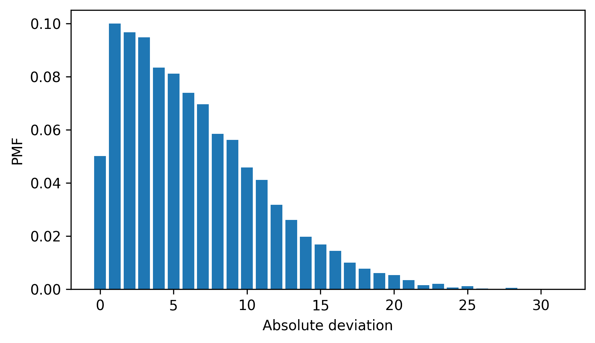
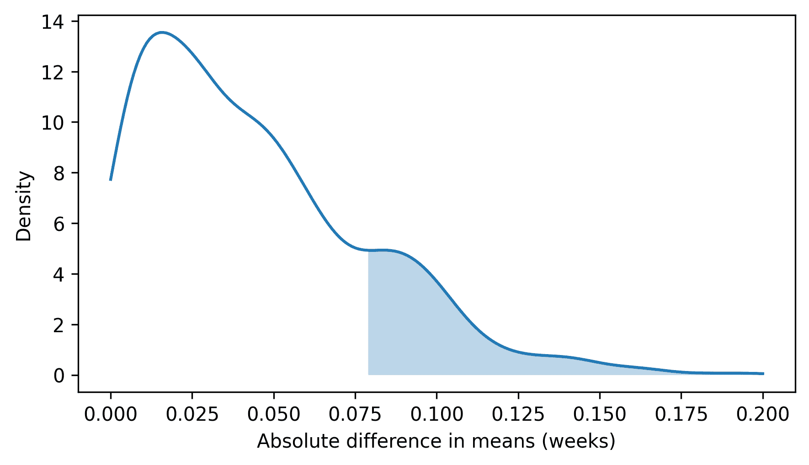
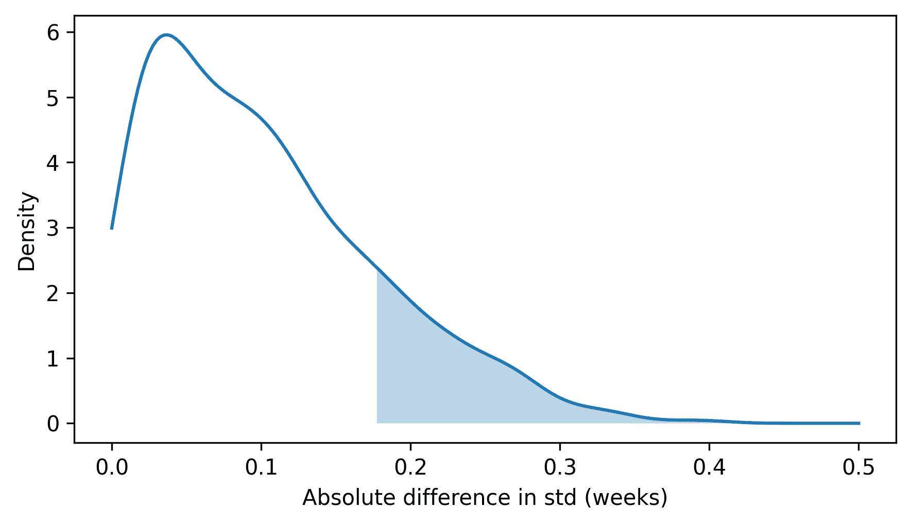
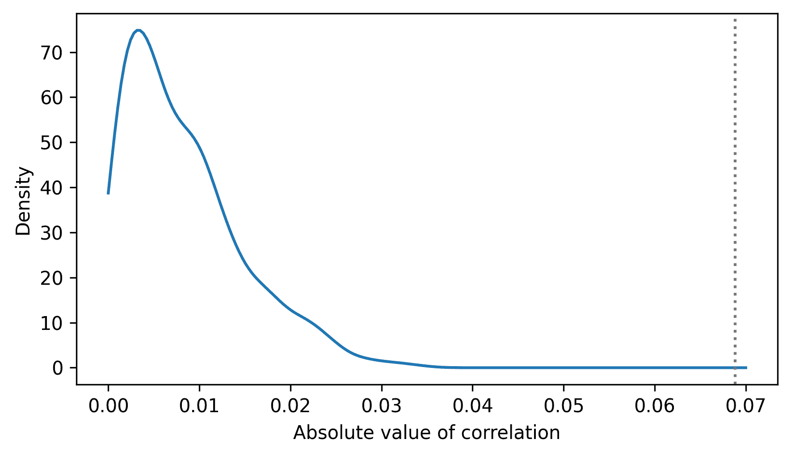
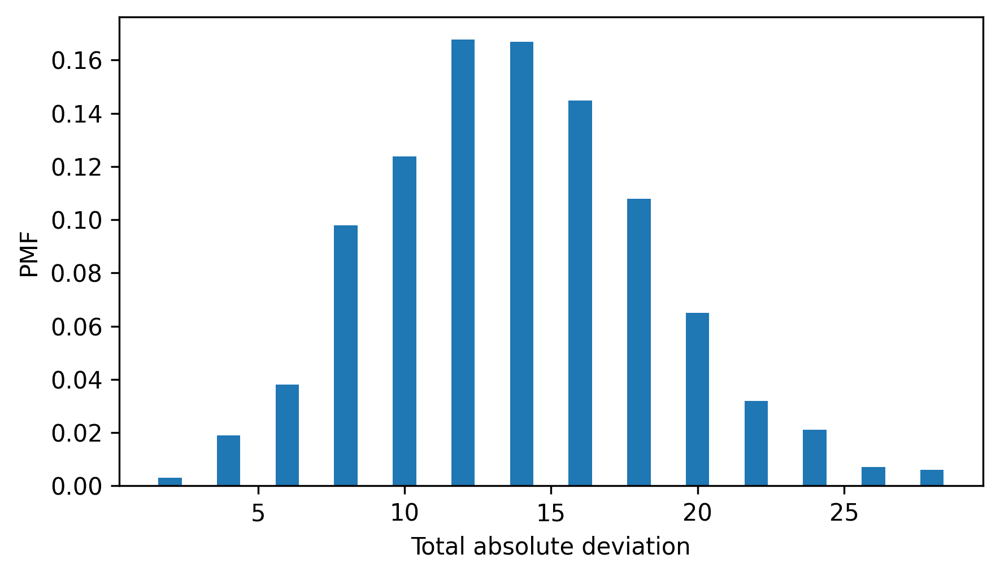
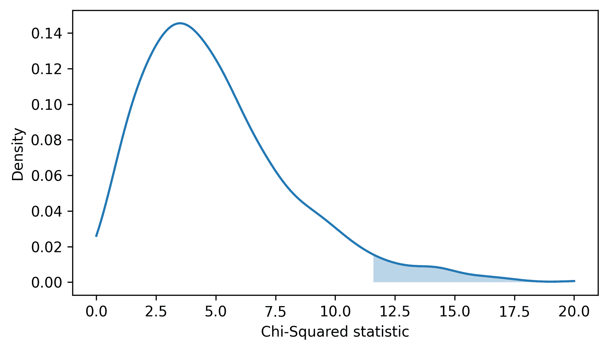

# 假设检验

> 原文：[`allendowney.github.io/ThinkStats/chap09.html`](https://allendowney.github.io/ThinkStats/chap09.html)

在这本书中我们探索的数据集中，我们看到了人群——以及企鹅——变量之间的相关性，以及回归线的斜率。这样的结果被称为**观察到的效应**，因为它们出现在样本中，与通常无法直接观察到的总体中的实际效应形成对比。当我们看到明显的效应时，我们应该考虑它是否可能存在于更大的总体中，或者它是否可能只是由于样本中的偶然性而出现。

有几种方式来表述这个问题，包括费舍尔零假设检验、奈曼-皮尔逊决策理论和贝叶斯假设检验。我这里展示的是这些方法在实践中常用的混合体。

[点击此处运行此笔记本在 Colab](https://colab.research.google.com/github/AllenDowney/ThinkStats/blob/v3/nb/chap09.ipynb)。

```py
from  os.path  import basename, exists

def  download(url):
    filename = basename(url)
    if not exists(filename):
        from  urllib.request  import urlretrieve

        local, _ = urlretrieve(url, filename)
        print("Downloaded " + local)

download("https://github.com/AllenDowney/ThinkStats/raw/v3/nb/thinkstats.py") 
```

```py
try:
    import  empiricaldist
except ImportError:
    %pip install empiricaldist 
```

```py
import  numpy  as  np
import  pandas  as  pd
import  matplotlib.pyplot  as  plt

from  thinkstats  import decorate 
```

## 抛硬币

我们将从 David MacKay 的书籍《信息论、推理和学习算法》中的一个例子开始，进行一个简单的示例。

当欧元硬币在 2002 年引入时，一位好奇的硬币爱好者将一枚比利时 1 欧元硬币翻转 250 次，并记录下正面朝上 140 次，反面朝上 110 次。如果硬币是完全平衡的，我们预计只有 125 个正面，所以这些数据表明硬币是有偏的。另一方面，我们并不期望每次都能得到正好 125 个正面，所以硬币实际上可能是公平的，而与期望值的偏差可能是由于偶然。为了看看这是否合理，我们可以进行假设检验。

我们将使用以下函数来计算如果硬币是公平的，观察到的数字与期望数字之间的绝对差异。

```py
n = 250
p = 0.5

def  abs_deviation(heads):
    expected = n * p
    return np.abs(heads - expected) 
```

在观察数据中，这个偏差是 15。

```py
heads = 140
tails = 110

observed_stat = abs_deviation(heads)
observed_stat 
```

```py
np.float64(15.0) 
```

如果硬币实际上是公平的，我们可以通过生成一个随机字符串序列来模拟抛硬币实验——要么是 `'H'` 或 `'T'`，概率相等——并计算 `'H'` 出现的次数。

```py
def  simulate_flips():
    flips = np.random.choice(["H", "T"], size=n)
    heads = np.sum(flips == "H")
    return heads 
```

每次我们调用这个函数时，我们都会得到一个模拟实验的结果。

```py
np.random.seed(1) 
```

```py
simulate_flips() 
```

```py
np.int64(119) 
```

下面的循环多次模拟实验，计算每个实验的偏差，并使用列表推导式将结果收集到一个列表中。

```py
simulated_stats = [abs_deviation(simulate_flips()) for i in range(10001)] 
```

结果是从假设硬币是公平的偏差分布中抽取的样本。以下是这些值的分布图。

```py
from  empiricaldist  import Pmf

pmf_effects = Pmf.from_seq(simulated_stats)
pmf_effects.bar()

decorate(xlabel="Absolute deviation", ylabel="PMF") 
```



接近 0 的值是最常见的；大于 10 的值较少见。记住观察数据的偏差是 15，我们可以看到这种程度的偏差是罕见的，但并非不可能。在这个例子中，模拟结果等于或超过 15 的大约 7.1%的时间。

```py
(np.array(simulated_stats) >= 15).mean() * 100 
```

```py
np.float64(7.079292070792921) 
```

因此，如果硬币是公平的，我们预计会偶然出现我们看到的偏差的大约 7.1%的时间。

我们可以得出结论，这种规模的效果并不常见，但即使硬币是公平的，这当然也不是不可能的。基于这个实验，我们不能排除硬币是公平的可能性。

这个例子展示了统计假设检验的逻辑。

+   我们从一个观察开始，250 次投掷中出现了 140 次正面，并提出了一个假设，即硬币是偏斜的——也就是说，正面的概率与 50%不同。

+   我们选择了一个**测试统计量**，它量化了观察到的效应的大小。在这个例子中，测试统计量是预期结果与实际观察到的绝对偏差。

+   我们定义了一个**零假设**，这是一个基于观察到的效应是由于偶然性这一假设的模型。在这个例子中，零假设是硬币是公平的。

+   接下来，我们计算了一个**p 值**，这是在零假设为真的情况下观察到观察到的效应的概率。在这个例子中，p 值是偏差达到 15 或更大的概率。

最后一步是解释结果。如果 p 值很小，我们得出结论，这种效应不太可能偶然发生。如果它很大，我们得出结论，这种效应可能合理地由偶然性解释。如果它位于中间，就像这个例子一样，我们可以说这种效应不太可能偶然发生，但我们不能排除这种可能性。

所有假设检验都基于这些元素——一个测试统计量、一个零假设和一个 p 值。

## 测试均值差异

在 NSFG 数据中，我们看到了初生儿的平均孕期略长于其他婴儿。现在让我们看看这种差异是否可能是偶然的。

下面的单元格下载数据并安装`statadict`，这是我们读取数据所需的。

```py
download("https://github.com/AllenDowney/ThinkStats/raw/v3/nb/nsfg.py")
download("https://github.com/AllenDowney/ThinkStats/raw/v3/data/2002FemPreg.dct")
download("https://github.com/AllenDowney/ThinkStats/raw/v3/data/2002FemPreg.dat.gz") 
```

```py
try:
    import  statadict
except ImportError:
    %pip install statadict 
```

函数`get_nsfg_groups`读取数据，选择活产，并将活产分为初生儿和其他婴儿。

```py
from  nsfg  import get_nsfg_groups

live, firsts, others = get_nsfg_groups() 
```

现在我们可以选择两组的孕期，以周为单位。

```py
data = firsts["prglngth"].values, others["prglngth"].values 
```

下面的函数接受数据作为两个序列的元组，并计算均值的绝对差异。

```py
def  abs_diff_means(data):
    group1, group2 = data
    diff = np.mean(group1) - np.mean(group2)
    return np.abs(diff) 
```

在初生儿和其他婴儿之间，观察到的孕期差异是 0.078 周。

```py
observed_diff = abs_diff_means(data)
observed_diff 
```

```py
np.float64(0.07803726677754952) 
```

因此，我们将要测试的假设是初生儿的孕期是否通常更长。零假设是两组的孕期实际上相同，而明显的差异是由于偶然性造成的。如果两组的孕期相同，我们可以将两组合并成一个单一的池子。为了模拟实验，我们可以使用 NumPy 函数`shuffle`将合并的值随机排序，然后使用切片索引选择与原始大小相同的两组。

```py
def  simulate_groups(data):
    group1, group2 = data
    n, m = len(group1), len(group2)

    pool = np.hstack(data)
    np.random.shuffle(pool)
    return pool[:n], pool[-m:] 
```

每次我们调用这个函数时，它都会返回一个序列的元组，我们可以将其传递给`abs_diff_means`。

```py
abs_diff_means(simulate_groups(data)) 
```

```py
np.float64(0.031193045602279312) 
```

以下循环模拟实验多次，并计算每个模拟数据集的均值差异。

```py
simulated_diffs = [abs_diff_means(simulate_groups(data)) for i in range(1001)] 
```

为了可视化结果，我们将使用以下函数，它接受模拟结果的样本并创建一个近似其分布的`Pmf`对象。

```py
from  scipy.stats  import gaussian_kde
from  empiricaldist  import Pmf

def  make_pmf(sample, low, high):
    kde = gaussian_kde(sample)
    qs = np.linspace(low, high, 201)
    ps = kde(qs)
    return Pmf(ps, qs) 
```

我们还将使用这个函数，它填充分布的尾部。

```py
from  thinkstats  import underride

def  fill_tail(pmf, observed, side, **options):
  """Fill the area under a PMF, right or left of an observed value."""
    options = underride(options, alpha=0.3)

    if side == "right":
        condition = pmf.qs >= observed
    elif side == "left":
        condition = pmf.qs <= observed

    series = pmf[condition]
    plt.fill_between(series.index, 0, series, **options) 
```

这是模拟结果的分布情况。阴影区域表示在零假设下均值差异超过观察到的差异的情况。这个区域的面积就是 p 值。

```py
pmf = make_pmf(simulated_diffs, 0, 0.2)
pmf.plot()
fill_tail(pmf, observed_diff, "right")
decorate(xlabel="Absolute difference in means (weeks)", ylabel="Density") 
```



以下函数计算 p 值，即模拟值中大于或等于观察值的比例。

```py
def  compute_p_value(simulated, observed):
  """Fraction of simulated values as big or bigger than the observed value."""
    return (np.asarray(simulated) >= observed).mean() 
```

在这个例子中，p 值大约是 18%，这意味着有 0.078 周这样的差异可能是偶然发生的。

```py
compute_p_value(simulated_diffs, observed_diff) 
```

```py
np.float64(0.1838161838161838) 
```

根据这个结果，我们不能确定怀孕长度对于第一个孩子来说通常会更长——这个数据集中的差异可能是偶然发生的。

注意，我们在两个假设检验的例子中都看到了相同的元素：一个检验统计量、一个零假设和零假设的模型。在这个例子中，检验统计量是均值之间的绝对差异。零假设是怀孕长度的分布实际上在两组中是相同的。我们通过将两组数据合并到一个池中，打乱池中的数据，并将其分成与原始大小相同的两组来模拟零假设。这个过程被称为**排列**，也就是打乱的意思。

这种假设检验的计算方法使得将不同统计量结合起来进行测试变得容易。

## 其他检验统计量

我们可能会想知道，对于第一个孩子来说，怀孕长度不仅仅是更长，也许还更不稳定。为了测试这个假设，我们可以使用两组标准差之间的绝对差异作为检验统计量。以下函数计算这个检验统计量。

```py
def  abs_diff_stds(data):
    group1, group2 = data
    diff = np.std(group1) - np.std(group2)
    return np.abs(diff) 
```

在 NSFG 数据集中，标准差之间的差异大约是 0.18。

```py
observed_diff = abs_diff_stds(data)
observed_diff 
```

```py
np.float64(0.17600895913991677) 
```

为了看看这个差异是否可能是偶然发生的，我们可以再次使用排列。以下循环模拟零假设多次，并计算每个模拟数据集的标准差差异。

```py
simulated_diffs = [abs_diff_stds(simulate_groups(data)) for i in range(1001)] 
```

这是结果分布的情况。同样，阴影区域表示在零假设下检验统计量超过观察到的差异的情况。

```py
pmf = make_pmf(simulated_diffs, 0, 0.5)
pmf.plot()
fill_tail(pmf, observed_diff, "right")
decorate(xlabel="Absolute difference in std (weeks)", ylabel="Density") 
```



我们可以通过计算结果中大于或等于观察到的差异的比例来估计这个区域的面积。

```py
compute_p_value(simulated_diffs, observed_diff) 
```

```py
np.float64(0.17082917082917082) 
```

p 值大约是 0.17，所以即使两个组相同，我们也能看到这么大的差异是有可能的。总之，我们不能确定孕妇的怀孕长度通常对第一个孩子来说更具有变异性——我们在这个数据集中看到的不同可能是偶然的。

## 测试相关性

我们可以使用相同的框架来测试相关性。例如，在 NSFG 数据集中，出生体重和母亲年龄之间存在相关性——年龄较大的母亲平均有更重的婴儿。但这种效果可能是偶然的吗？

为了找出答案，我们将首先准备数据。从活产中，我们将选择母亲年龄和出生体重都已知的情况。

```py
valid = live.dropna(subset=["agepreg", "totalwgt_lb"])
valid.shape 
```

```py
(9038, 244) 
```

然后，我们将选择相关的列。

```py
ages = valid["agepreg"]
birthweights = valid["totalwgt_lb"] 
```

以下函数接受一个包含`xs`和`ys`的元组，并计算相关性的幅度，无论是正还是负。

```py
def  abs_correlation(data):
    xs, ys = data
    corr = np.corrcoef(xs, ys)[0, 1]
    return np.abs(corr) 
```

在 NSFG 数据集中，相关性约为 0.07。

```py
data = ages, birthweights
observed_corr = abs_correlation(data)
observed_corr 
```

```py
np.float64(0.0688339703541091) 
```

原假设是母亲年龄和出生体重之间没有相关性。通过打乱观察到的值，我们可以模拟一个年龄和出生体重分布相同，但变量无关的世界。

以下函数接受一个包含`xs`和`ys`的元组，打乱`xs`并返回一个包含打乱后的`xs`和原始`ys`的元组。如果我们将`ys`打乱，或者两者都打乱，它也会工作。

```py
def  permute(data):
    xs, ys = data
    new_xs = xs.values.copy()
    np.random.shuffle(new_xs)
    return new_xs, ys 
```

打乱值的相关性通常接近 0。

```py
abs_correlation(permute(data)) 
```

```py
np.float64(0.0019269515502894237) 
```

以下循环生成许多打乱的数据集，并计算每个数据集的相关性。

```py
simulated_corrs = [abs_correlation(permute(data)) for i in range(1001)] 
```

下面是结果分布的图示。垂直虚线表示观察到的相关性。

```py
pmf = make_pmf(simulated_corrs, 0, 0.07)
pmf.plot()
plt.axvline(observed_corr, color="gray", ls=":")
decorate(xlabel="Absolute value of correlation", ylabel="Density") 
```



我们可以看到观察到的相关性位于分布的尾部，曲线下没有可见的区域。如果我们尝试计算 p 值，结果是 0，这表明在模拟中，打乱数据中的相关性没有超过观察到的值。

```py
compute_p_value(simulated_corrs, observed_corr) 
```

```py
np.float64(0.0) 
```

根据这个计算，我们可以得出结论，p 值可能小于 1000 分之一，但实际上并不是零。打乱数据的相关性超过观察值的可能性不大——但并非不可能。

当 p 值很小，传统上小于 0.05 时，我们可以说结果是**统计显著的**。但这种解释 p 值的方式一直存在问题，并且它正在逐渐被更少地使用。

一个问题是传统的阈值是任意的，并不适用于所有应用。另一个问题是这种对“显著”的使用具有误导性，因为它暗示这种效果在实践中很重要。母亲年龄与出生体重的相关性是一个很好的例子——它在统计上显著，但如此之小，以至于并不重要。

另一种方法是定性解释 p 值。

+   如果 p 值很大，那么观察到的效果可能只是偶然发生的。

+   ## 比例测试

作为最后的例子，让我们考虑一个需要仔细思考测试统计量选择的情况。假设你经营一家赌场，你怀疑一位顾客正在使用一个不诚实的骰子——也就是说，一个被修改过，使得其中一个面比其他面更有可能出现的骰子。你逮捕了这位被怀疑的作弊者并没收了骰子，但现在你必须证明这个骰子是不诚实的。你掷了 60 次骰子，并记录了从 1 到 6 每个结果的频率。这里是在`Hist`对象中的结果。

```py
from  empiricaldist  import Hist

qs = np.arange(1, 7)
freqs = [8, 9, 19, 5, 8, 11]
observed = Hist(freqs, qs)
observed.index.name = "outcome"
observed 
```

|  | 频率 |
| --- | --- |
| 5 | 8 |
| 观察数据的卡方统计量是 11.6。这个数字本身并没有什么意义，但我们可以将其与模拟掷骰子的结果进行比较。以下循环生成许多模拟数据集，并为每个数据集计算卡方统计量。 |
| 如果 p 值很小，我们通常可以排除效果是偶然发生的可能性——但我们应该记住，它仍然可能是由于非代表性抽样或测量误差。 |
| 2 | 9 |
| 3 | 19 |
| 4 | 5 |
| 1 | 8 |
| 6 | 11 |

平均来说，你期望每个值出现 10 次。在这个数据集中，值 3 比预期出现得更频繁，而值 4 出现得更少。但这些差异可能是偶然发生的吗？

为了测试这个假设，我们首先将计算每个结果的预期频率。

```py
num_rolls = observed.sum()
outcomes = observed.qs
expected = Hist(num_rolls / 6, outcomes) 
```

以下函数接受观察到的和预期的频率，并计算绝对差异的总和。

```py
def  total_abs_deviation(observed):
    return np.sum(np.abs(observed - expected)) 
```

在观察到的数据集中，这个测试统计量是 20。

```py
observed_dev = total_abs_deviation(observed)
observed_dev 
```

```py
np.float64(20.0) 
```

以下函数接受观察到的数据，模拟掷一个公平的骰子相同次数，并返回一个包含模拟频率的`Hist`对象。

```py
def  simulate_dice(observed):
    num_rolls = np.sum(observed)
    rolls = np.random.choice(observed.qs, num_rolls, replace=True)
    hist = Hist.from_seq(rolls)
    return hist 
```

以下循环多次模拟实验，并计算每个的绝对偏差总和。

```py
simulated_devs = [total_abs_deviation(simulate_dice(observed)) for i in range(1001)] 
```

这里是测试统计量在零假设下的分布情况。注意，总数总是偶数，因为每次一个结果比预期出现得更频繁时，另一个结果就必须出现得更少。

```py
pmf_devs = Pmf.from_seq(simulated_devs)
pmf_devs.bar()

decorate(xlabel="Total absolute deviation", ylabel="PMF") 
```



我们可以看到，总偏差为 20 并不罕见——p 值约为 13%，这意味着我们无法确定骰子是不诚实的。

```py
compute_p_value(simulated_devs, observed_dev) 
```

```py
np.float64(0.13086913086913088) 
```

但我们选择的测试统计量并不是唯一的选择。对于这样的问题，使用卡方统计量会更传统，我们可以这样计算。

```py
def  chi_squared_stat(observed):
    diffs = (observed - expected) ** 2
    return np.sum(diffs / expected) 
```

将偏差平方（而不是取绝对值）会给大的偏差更多的权重。通过除以`expected`来标准化偏差——尽管在这种情况下它对结果没有影响，因为预期的频率都是相等的。

```py
observed_chi2 = chi_squared_stat(observed)
observed_chi2 
```

```py
np.float64(11.6) 
```

| 结果 |  |

```py
simulated_chi2 = [chi_squared_stat(simulate_dice(observed)) for i in range(1001)] 
```

下面是这种检验统计量在零假设下的分布情况。阴影区域显示了超过观察值的结果。

```py
pmf = make_pmf(simulated_chi2, 0, 20)
pmf.plot()
fill_tail(pmf, observed_chi2, "right")
decorate(xlabel="Chi-Squared statistic", ylabel="Density") 
```



再次，阴影区域的面积是 p 值。

```py
compute_p_value(simulated_chi2, observed_chi2) 
```

```py
np.float64(0.04495504495504495) 
```

使用卡方统计量的 p 值大约为 0.04，这比我们使用总偏差得到的 0.13 小得多。如果我们认真对待 5%的阈值，我们会认为这个效应具有统计学意义。但考虑到两个测试的结果，我会说结论并不明确。我不会排除骰子是弯曲的可能性，但我也不会宣判这个被指控的作弊者有罪。

这个例子演示了一个重要的观点：p 值取决于检验统计量的选择和零假设模型，有时这些选择决定了效应是否具有统计学意义。

## 术语表

+   **假设检验**：一组用于检查观察到的效应是否可能是随机抽样的结果的方法。

+   **检验统计量**：在假设检验中用于量化观察到的效应大小的统计量。

+   **零假设**：基于样本中观察到的效应在总体中不存在的假设的系统模型。

+   **排列**：通过随机重新排列数据集来模拟零假设的方法。

+   **p 值**：在零假设下，效应与观察到的效应一样大的概率。

+   **具有统计学意义**：如果 p 值小于选定的阈值，通常为 5%，则效应具有统计学意义。在大数据集中，即使观察到的效应在实际中太小而不重要，也可能具有统计学意义。

## 练习

### 练习 9.1

让我们尝试使用第八章中的企鹅数据来进行假设检验。下载数据的说明在本书的笔记本中。

下面的单元格从由 Allison Horst 创建的存储库中下载数据。

Horst AM, Hill AP, Gorman KB (2020). palmerpenguins：帕默群岛（南极）企鹅数据。R 包版本 0.1.0。[`allisonhorst.github.io/palmerpenguins/`](https://allisonhorst.github.io/palmerpenguins/). doi: 10.5281/zenodo.3960218。

这些数据是作为导致本文的研究的一部分收集的：Gorman KB, Williams TD, Fraser WR (2014).南极企鹅（属 Pygoscelis）群落中的生态性两性差异和环境可变性。PLOS ONE 9(3):e90081。[`doi.org/10.1371/journal.pone.0090081`](https://doi.org/10.1371/journal.pone.0090081)

```py
download(
    "https://raw.githubusercontent.com/allisonhorst/palmerpenguins/c19a904462482430170bfe2c718775ddb7dbb885/inst/extdata/penguins_raw.csv"
) 
```

下面是如何读取数据和选择帝企鹅的示例。

```py
penguins = pd.read_csv("penguins_raw.csv").dropna(subset=["Body Mass (g)"])
chinstrap = penguins.query('Species.str.startswith("Chinstrap")')
chinstrap.shape 
```

```py
(68, 17) 
```

以下是我们可以如何提取雄性和雌性企鹅的重量（千克）。

```py
male = chinstrap.query("Sex == 'MALE'")
weights_male = male["Body Mass (g)"] / 1000
weights_male.mean() 
```

```py
np.float64(3.9389705882352937) 
```

```py
female = chinstrap.query("Sex == 'FEMALE'")
weights_female = female["Body Mass (g)"] / 1000
weights_female.mean() 
```

```py
np.float64(3.5272058823529413) 
```

使用`abs_diff_means`和`simulate_groups`在两组权重分布相同的零假设下生成大量模拟数据集，并计算每个数据集的均值差异。将模拟结果与观察到的差异进行比较，并计算 p 值。两组之间明显的差异是否可能是偶然造成的？

### 练习 9.2

使用前一个练习中的企鹅数据，我们可以提取雌性企鹅的喙顶深度和长度（喙顶是喙的顶部脊）。

```py
data = female["Culmen Depth (mm)"], female["Culmen Length (mm)"] 
```

这些变量之间的相关系数约为 0.26。

```py
observed_corr = abs_correlation(data)
observed_corr 
```

```py
np.float64(0.2563170802728449) 
```

让我们看看这种相关性是否可能偶然发生，即使实际上测量之间没有相关性。使用`permute`生成数据的多种排列，并使用`abs_correlation`计算每个排列的相关性。在零假设下绘制相关性的分布，并计算观察到的相关性的 p 值。你如何解释这个结果？

[Think Stats: Exploratory Data Analysis in Python, 3rd Edition](https://allendowney.github.io/ThinkStats/index.html)

版权所有 2024 [艾伦·B·唐尼](https://allendowney.com)

代码许可：[MIT License](https://mit-license.org/)

文本许可：[Creative Commons Attribution-NonCommercial-ShareAlike 4.0 国际](https://creativecommons.org/licenses/by-nc-sa/4.0/)
