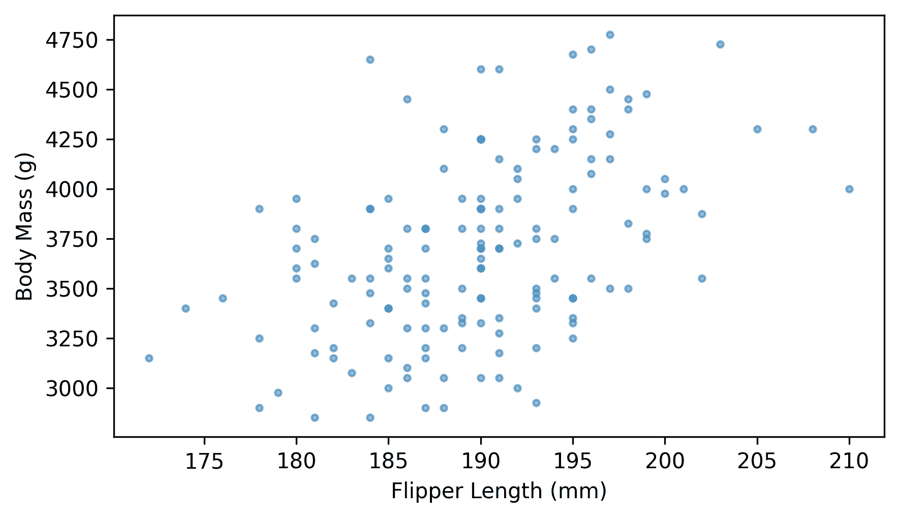
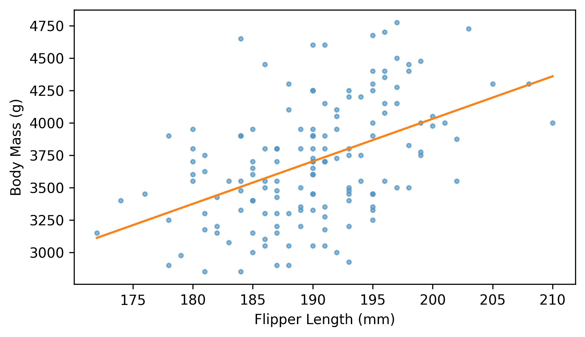
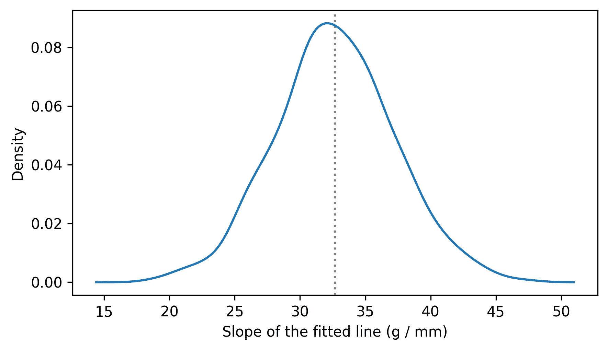
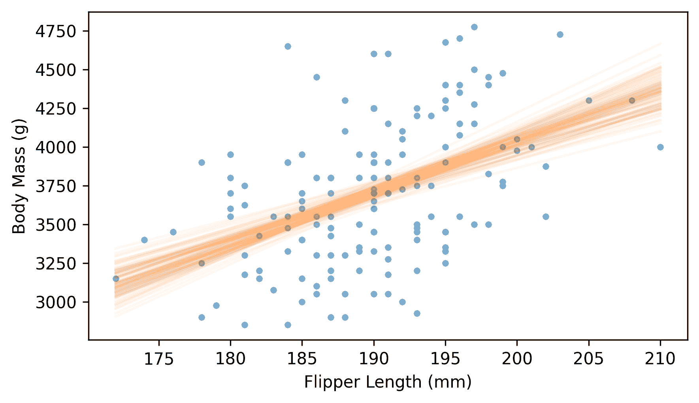
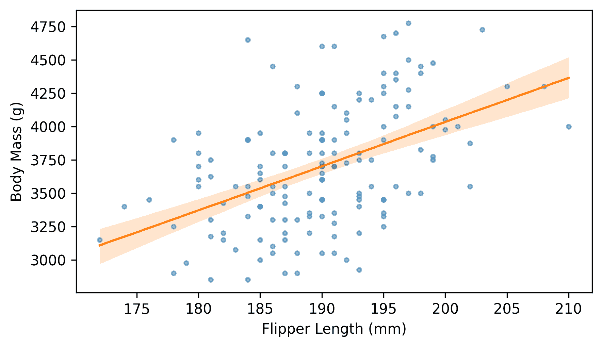
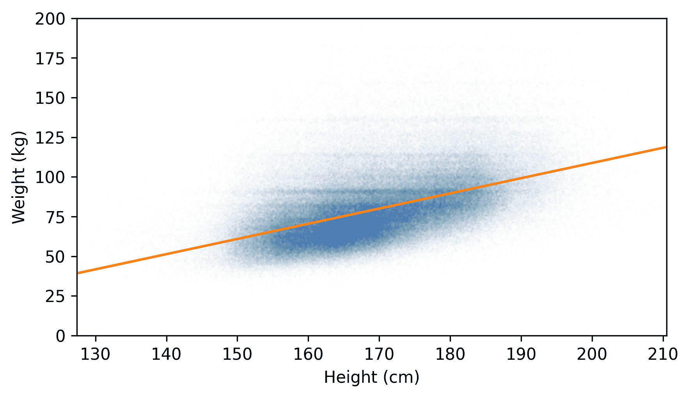
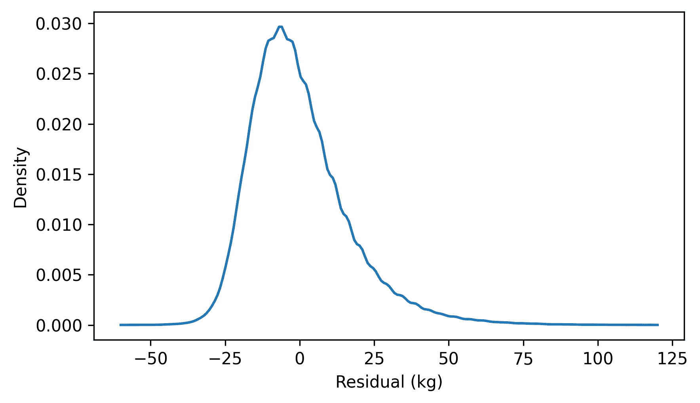
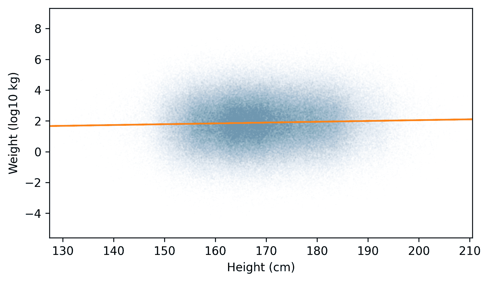
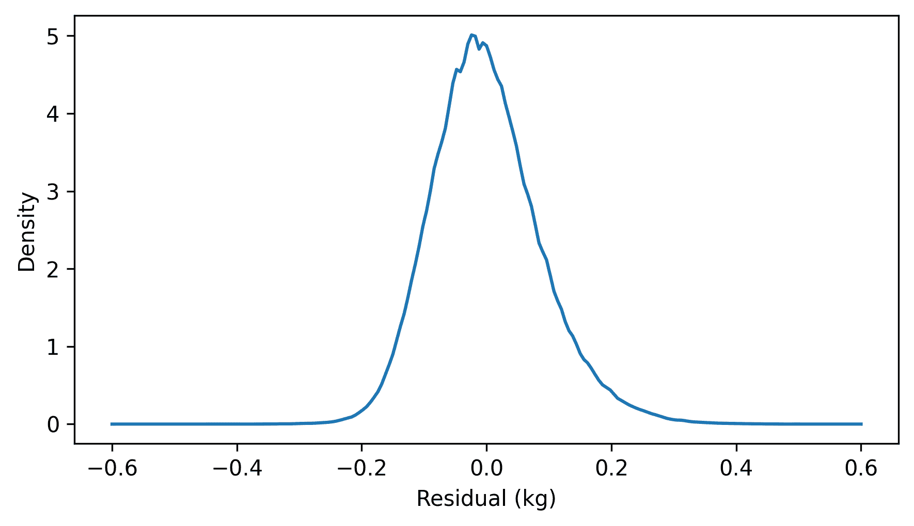
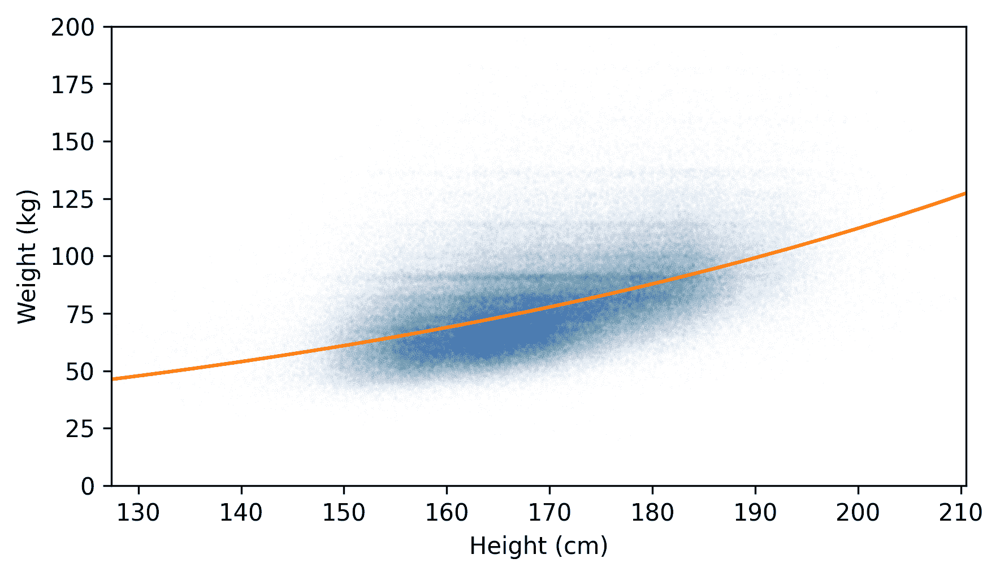

# 最小二乘法

> 原文：[`allendowney.github.io/ThinkStats/chap10.html`](https://allendowney.github.io/ThinkStats/chap10.html)

本章和下一章介绍了将模型拟合到数据中的概念。在这个上下文中，**模型**由变量之间关系的数学描述（例如一条直线）和随机变异性描述（例如正态分布）组成。

当我们说一个模型拟合数据时，我们通常意味着它最小化了误差，即模型和数据之间的距离。我们将从最广泛使用的一种拟合模型的方法开始，即最小化平方误差之和，这被称为最小二乘拟合。

我们还将从一次只处理两个变量的模型开始。下一章将介绍可以处理超过两个变量的模型。

[点击此处运行此笔记本在 Colab 上](https://colab.research.google.com/github/AllenDowney/ThinkStats/blob/v3/nb/chap10.ipynb)。

```py
from  os.path  import basename, exists

def  download(url):
    filename = basename(url)
    if not exists(filename):
        from  urllib.request  import urlretrieve

        local, _ = urlretrieve(url, filename)
        print("Downloaded " + local)

download("https://github.com/AllenDowney/ThinkStats/raw/v3/nb/thinkstats.py") 
```

```py
try:
    import  empiricaldist
except ImportError:
    %pip install empiricaldist 
```

```py
import  numpy  as  np
import  pandas  as  pd
import  matplotlib.pyplot  as  plt

from  thinkstats  import decorate 
```

## 最小二乘拟合

作为第一个例子，让我们回到第八章的场景章节 8。假设你是南极的研究员，研究当地的企鹅种群。作为数据收集的一部分，你捕获了一组企鹅，测量并称重它们——然后未受伤害地释放它们。

如你很快就会了解到，让企鹅在秤上停留足够长的时间以获得准确的测量可能很困难。假设对于一些企鹅，我们有鳍长和喙大小的测量数据，但没有体重。让我们看看我们是否可以使用其他测量数据来填补缺失的数据——这个过程被称为**插补**。

我们将首先探索重量和测量之间的关系，使用 2007 年至 2010 年间在南极帕默站收集的数据。他们收集的数据是免费提供的——下载说明在本书的笔记本中。

下一个单元将下载由 Allison Horst 创建的存储库中的数据。

Horst AM, Hill AP, Gorman KB (2020)。palmerpenguins：帕默群岛（南极）企鹅数据。R 包版本 0.1.0。[`allisonhorst.github.io/palmerpenguins/`](https://allisonhorst.github.io/palmerpenguins/)。doi: 10.5281/zenodo.3960218。

这些数据是作为导致这篇论文的研究的一部分收集的：Gorman KB, Williams TD, Fraser WR (2014)。南极企鹅（属 Pygoscelis）群落中的生态性别二态性和环境变异性。PLoS ONE 9(3):e90081。[`doi.org/10.1371/journal.pone.0090081`](https://doi.org/10.1371/journal.pone.0090081)

```py
download(
    "https://raw.githubusercontent.com/allisonhorst/palmerpenguins/c19a904462482430170bfe2c718775ddb7dbb885/inst/extdata/penguins_raw.csv"
) 
```

我们可以使用`read_csv`来读取数据。

```py
penguins = pd.read_csv("penguins_raw.csv").dropna(subset=["Body Mass (g)"])
penguins.shape 
```

```py
(342, 17) 
```

数据集包括对 151 只阿德利企鹅的测量数据。我们可以使用`query`来选择包含这些数据的行。

```py
adelie = penguins.query('Species.str.startswith("Adelie")')
len(adelie) 
```

```py
151 
```

现在假设我们知道一只阿德利企鹅的鳍长——让我们看看我们如何预测它的体重。首先，我们将从`DataFrame`中选择这些列。

```py
xvar = "Flipper Length (mm)"
yvar = "Body Mass (g)"

flipper_length = adelie[xvar]
body_mass = adelie[yvar] 
```

这里有一个散点图显示了这些数量之间的关系。

```py
plt.scatter(flipper_length, body_mass, marker=".", alpha=0.5)
decorate(xlabel=xvar, ylabel=yvar) 
```



看起来它们是相关的——我们可以通过计算相关系数来量化这种关系的强度。

```py
np.corrcoef(flipper_length, body_mass)[0, 1] 
```

```py
np.float64(0.4682016942179394) 
```

相关系数约为 0.47，这意味着鳍较长的企鹅往往更重。这很有用，因为它意味着如果我们知道企鹅的鳍长，我们就可以更准确地猜测它的体重——但仅仅相关系数本身并不能告诉我们如何做出这些猜测。为此，我们需要选择一条**最佳拟合线**。

定义“最佳”线的方法有很多，但对于此类数据，一个常见的选择是**线性最小二乘法**拟合，这是最小化均方误差（MSE）的直线。

SciPy 提供了一个名为`linregress`的函数，用于计算最小二乘拟合。这个名字是**线性回归**的简称，这是此类模型的另一种说法。`linregress`的参数是`x`值和`y`值，顺序如下。

```py
from  scipy.stats  import linregress

result = linregress(flipper_length, body_mass)
result 
```

```py
LinregressResult(slope=np.float64(32.83168975115009), intercept=np.float64(-2535.8368022002514), rvalue=np.float64(0.46820169421793933), pvalue=np.float64(1.3432645947790051e-09), stderr=np.float64(5.076138407990821), intercept_stderr=np.float64(964.7984274994059)) 
```

结果是一个包含拟合线的斜率和截距的`LinregressResult`对象，以及我们很快就会解包的其他信息。斜率约为 32.8，这意味着每增加 1 毫米的鳍长度，体重就会增加 32.8 克。

截距为-2535 克，这可能看起来有些不合逻辑，因为测量的重量不能是负数。如果我们使用斜率和截距来评估平均鳍长度的拟合线，这可能更有意义。

```py
x = flipper_length.mean()
y = result.intercept + result.slope * x
x, y 
```

```py
(np.float64(189.95364238410596), np.float64(3700.662251655629)) 
```

对于鳍长平均约为 190 毫米的企鹅，预期的体重约为 3700 克。

以下函数从`linregress`的结果和一个`xs`序列中找到每个`x`值的拟合线上的点。

```py
def  predict(result, xs):
    ys = result.intercept + result.slope * xs
    return ys 
```

`predict`这个名字在这里可能看起来有些奇怪——在自然语言中，**预测**通常与未来发生的事情有关，但在回归的上下文中，拟合线上的点也被称为预测。

我们可以使用`predict`来计算一系列鳍长度的线上的点。

```py
fit_xs = np.linspace(np.min(flipper_length), np.max(flipper_length))
fit_ys = predict(result, fit_xs) 
```

这是拟合线以及数据的散点图。

```py
plt.scatter(flipper_length, body_mass, marker=".", alpha=0.5)
plt.plot(fit_xs, fit_ys, color="C1")
decorate(xlabel=xvar, ylabel=yvar) 
```



如预期的那样，拟合线穿过数据的中心并遵循趋势。一些预测是准确的——但许多数据点离线很远。为了了解预测有多好（或有多坏），我们可以计算预测误差，即每个点与线的垂直距离。以下函数计算这些误差，这些误差也称为**残差**。

```py
def  compute_residuals(result, xs, ys):
    fit_ys = predict(result, xs)
    return ys - fit_ys 
```

这里是体重作为鳍长函数的残差。

```py
residuals = compute_residuals(result, flipper_length, body_mass) 
```

例如，我们可以查看数据集中第一只企鹅的结果。

```py
x = flipper_length[0]
y = predict(result, x)
x, y 
```

```py
(np.float64(181.0), np.float64(3406.699042757914)) 
```

被选中的企鹅鳍长为 181 毫米，预测的体重为 3407 克。现在让我们看看实际的体重是多少。

```py
body_mass[0], residuals[0] 
```

```py
(np.float64(3750.0), np.float64(343.30095724208604)) 
```

这只企鹅的实际重量是 3750 克，残差（减去预测值后）是 343 克。

平方残差的平均值是预测的均方误差（MSE）。

```py
mse = np.mean(residuals**2)
mse 
```

```py
np.float64(163098.85902884745) 
```

仅凭这个数字本身并没有太多意义。我们可以通过计算决定系数来使它更有意义。

## 决定系数

假设你想猜测一只企鹅的重量。如果你知道它的鳍长，你可以使用最小二乘法来提供你的猜测，MSE 量化了你的猜测的平均准确性。

但如果你不知道鳍长，你会猜什么？结果证明，猜测均值是最好的策略，因为它最小化了 MSE。如果我们总是猜测均值，预测误差就是与均值的偏差。

```py
deviations = body_mass - np.mean(body_mass) 
```

MSE 是均方偏差。

```py
np.mean(deviations**2) 
```

```py
np.float64(208890.28989956583) 
```

你可能还记得，均方偏差是方差。

```py
np.var(body_mass) 
```

```py
np.float64(208890.28989956583) 
```

因此，如果我们总是猜测均值，可以将质量的方差视为 MSE，如果我们使用回归线，则将残差的方差视为 MSE。如果我们计算这些方差的比率并从 1 中减去它，结果表示如果我们使用鳍长来提供猜测信息，MSE 减少了多少。

以下函数计算这个值，技术上称为 **决定系数**，但由于它表示为 \(R²\)，大多数人称之为“R 平方”。

```py
def  coefficient_of_determination(ys, residuals):
    return 1 - np.var(residuals) / np.var(ys) 
```

在这个例子中，\(R²\) 大约是 0.22，这意味着拟合线将 MSE 减少了 22%。

```py
R2 = coefficient_of_determination(body_mass, residuals)
R2 
```

```py
np.float64(0.21921282646854912) 
```

结果表明，决定系数 \(R²\) 和相关系数 \(r\) 之间存在关系。根据符号，你可能已经猜到了，\(r² = R²\)。

我们可以通过计算 \(R²\) 的平方根来证明这一点。

```py
r = np.sqrt(R2)
r 
```

```py
np.float64(0.4682016942179397) 
```

并将其与我们之前计算的相关性进行比较。

```py
corr = np.corrcoef(flipper_length, body_mass)[0, 1]
corr 
```

```py
np.float64(0.4682016942179394) 
```

它们除了由于浮点近似产生的小差异外，都是相同的。

`linregress` 函数也计算这个值，并将其作为 `RegressionResult` 对象的属性返回。

```py
result.rvalue 
```

```py
np.float64(0.46820169421793933) 
```

决定系数和相关性传达了大部分相同的信息，但它们的解释不同：

+   相关系数量化了关系强度，其范围从 -1 到 1。

+   \(R²\) 量化了拟合线减少 MSE 的能力。

此外，\(R²\) 总是正的，所以它不指示相关性是正还是负。

## 最小化 MSE

之前我说过，最小二乘法是使均方误差（MSE）最小化的直线。我们不会证明这一点，但我们可以通过向截距和斜率添加小的随机值来测试它，并检查 MSE 是否变得更糟。

```py
intercept = result.intercept + np.random.normal(0, 1)
slope = result.slope + np.random.normal(0, 1) 
```

要运行测试，我们需要创建一个具有 `intercept` 和 `slope` 属性的对象——我们将使用 `types` 模块提供的 `SimpleNamespace` 对象。

```py
from  types  import SimpleNamespace

fake_result = SimpleNamespace(intercept=intercept, slope=slope)
fake_result 
```

```py
namespace(intercept=np.float64(-2533.193389187175),
          slope=np.float64(32.15393529728294)) 
```

我们可以将此对象传递给 `compute_residuals` 并使用残差来计算 MSE。

```py
fake_residuals = compute_residuals(fake_result, flipper_length, body_mass)
fake_mse = np.mean(fake_residuals**2) 
```

如果我们将结果与最小二乘线的均方误差（MSE）进行比较，它总是更差。

```py
mse, fake_mse, fake_mse > mse 
```

```py
(np.float64(163098.85902884745), np.float64(179019.20812685465), np.True_) 
```

最小化均方误差很好，但“最佳”的定义不止这一个。一个替代方案是最小化误差的绝对值。另一个替代方案是最小化每个点到拟合线的最短距离，这被称为“总误差”。在某些情况下，过高估计可能比过低估计更好（或更差）。在这种情况下，你可能想为每个残差计算一个成本函数，并最小化总成本。

但是，最小二乘法拟合比这些替代方案更广泛地被使用，主要是因为它计算效率高。以下函数展示了如何做到这一点。

```py
def  least_squares(xs, ys):
    xbar = np.mean(xs)
    ybar = np.mean(ys)

    xdev = xs - xbar
    ydev = ys - ybar

    slope = np.sum(xdev * ydev) / np.sum(xdev**2)
    intercept = ybar - slope * xbar

    return intercept, slope 
```

为了测试这个函数，我们将再次使用翻车鱼长度和体重。

```py
intercept, slope = least_squares(flipper_length, body_mass)
intercept, slope 
```

```py
(np.float64(-2535.8368022002524), np.float64(32.831689751150094)) 
```

我们可以确认我们得到的结果与`linregress`得到的结果相同。

```py
np.allclose([intercept, slope], [result.intercept, result.slope]) 
```

```py
True 
```

当计算效率比选择最适合当前问题的方法更重要时，最小化均方误差是有意义的。但情况已不再如此，因此考虑是否应该最小化平方残差是有价值的。

## 估计

`slope`（斜率）和`intercept`（截距）参数是基于样本的估计。像其他估计一样，它们容易受到非代表性抽样、测量误差和随机抽样引起的变异性的影响。通常，很难量化非代表性抽样和测量误差的影响。而量化随机抽样的影响则更容易一些。

实现这一目标的一种方法是称为**自助法**的重新抽样方法：我们将样本视为整个总体，并从观察到的数据中用放回抽样的方式抽取新的样本。以下函数接受一个`DataFrame`，使用`sample`方法重新抽样行，并返回一个新的`DataFrame`。

```py
def  resample(df):
    n = len(df)
    return df.sample(n, replace=True) 
```

以下函数接受一个`DataFrame`，找到最小二乘法拟合，并返回拟合线的斜率。

```py
def  estimate_slope(df):
    xs, ys = df["Flipper Length (mm)"], df["Body Mass (g)"]
    result = linregress(xs, ys)
    return result.slope 
```

我们可以使用这些函数生成许多模拟数据集，并对每个数据集计算斜率。

```py
# Seed the random number generator so we get the same results every time

np.random.seed(1) 
```

```py
resampled_slopes = [estimate_slope(resample(adelie)) for i in range(1001)] 
```

结果是从斜率抽样分布中的一个样本。它看起来是这样的。

```py
from  thinkstats  import plot_kde

plot_kde(resampled_slopes)
decorate(xlabel="Slope of the fitted line (g / mm)", ylabel="Density") 
```



我们可以使用`percentile`来计算 90%置信区间。

```py
ci90 = np.percentile(resampled_slopes, [5, 95])
print(result.slope, ci90) 
```

```py
32.83168975115009 [25.39604591 40.21054526] 
```

因此，我们可以报告估计的斜率为 33 克/毫米，90%置信区间为[25, 40]克/毫米。

估计的标准误差是抽样分布的标准差。

```py
stderr = np.std(resampled_slopes)
stderr 
```

```py
np.float64(4.570238986584832) 
```

从`linregress`得到的`RegressionResult`对象提供了一个基于分布形状假设的标准误差近似值。

```py
result.stderr 
```

```py
np.float64(5.076138407990821) 
```

通过重新抽样计算的标准误差略小，但在实际应用中这种差异可能并不重要。

## 可视化不确定性

每次我们对数据集进行重采样时，都会得到不同的拟合线。为了了解这些线之间的变异性，一个选项是遍历它们并将它们全部绘制出来。以下函数接受一个重采样的 `DataFrame`，计算最小二乘拟合，并为一系列 `xs` 生成预测值。

```py
def  fit_line(df, fit_xs):
    xs, ys = df["Flipper Length (mm)"], df["Body Mass (g)"]
    result = linregress(xs, ys)
    fit_ys = predict(result, fit_xs)
    return fit_ys 
```

这里是我们将使用的 `xs` 序列。

```py
xs = adelie["Flipper Length (mm)"]
fit_xs = np.linspace(np.min(xs), np.max(xs)) 
```

下面是拟合线以及数据的散点图的样子。

```py
plt.scatter(flipper_length, body_mass, marker=".", alpha=0.5)

for i in range(101):
    fit_ys = fit_line(resample(adelie), fit_xs)
    plt.plot(fit_xs, fit_ys, color="C1", alpha=0.05)

decorate(xlabel=xvar, ylabel=yvar) 
```



在中间附近，拟合线彼此靠近 - 在极端情况下，它们相距较远。

另一种表示拟合线变异性的方法是绘制每个预测值的 90%置信区间。我们可以通过收集拟合线作为一个数组列表来实现这一点。

```py
fitted_ys = [fit_line(resample(adelie), fit_xs) for i in range(1001)] 
```

我们可以将这个数组列表视为一个二维数组，其中每一行对应一条拟合线，每一列对应于每个 `xs`。

我们可以使用 `percentile` 函数，并设置 `axis=0` 参数来找到与每个 `xs` 对应的 `ys` 的第 5、第 50 和第 95 百分位数。

```py
low, median, high = np.percentile(fitted_ys, [5, 50, 95], axis=0) 
```

现在我们将使用 `fill_between` 来绘制位于第 5 百分位数和第 95 百分位数之间的区域，这代表了 90%的置信区间，同时还包括每列的中值和数据的散点图。

```py
plt.scatter(flipper_length, body_mass, marker=".", alpha=0.5)

plt.fill_between(fit_xs, low, high, color="C1", lw=0, alpha=0.2)
plt.plot(fit_xs, median, color="C1")

decorate(xlabel=xvar, ylabel=yvar) 
```



这是表示由于随机抽样而导致的拟合线变异性的一种我最喜欢的方式。

## 转换

在拟合数据线之前，有时对其中一个或两个变量进行转换是有用的，例如通过计算值的平方、平方根或对数。为了演示，我们将使用行为风险因素监测系统（BRFSS）中的身高和体重数据，这些数据在第五章中描述。

下一个单元格将下载 BRFSS 数据。

```py
download("https://github.com/AllenDowney/ThinkStats/raw/v3/data/CDBRFS08.ASC.gz") 
```

我们可以像这样加载 BRFSS 数据。

```py
from  thinkstats  import read_brfss

brfss = read_brfss() 
```

接下来，我们将找到包含有效数据的行，并选择包含身高和体重的列。

```py
valid = brfss.dropna(subset=["htm3", "wtkg2"])
heights, weights = valid["htm3"], valid["wtkg2"] 
```

我们可以使用 `linregress` 函数来计算最小二乘拟合的斜率和截距。

```py
result_brfss = linregress(heights, weights)
result_brfss.intercept, result_brfss.slope 
```

```py
(np.float64(-82.65926054409877), np.float64(0.957074585033226)) 
```

斜率大约为 0.96，这意味着平均而言，每增加 1 厘米对应增加近 1 公斤。我们可以再次使用 `predict` 函数来生成一系列 `xs` 的预测值。

```py
fit_xs = np.linspace(heights.min(), heights.max())
fit_ys = predict(result_brfss, fit_xs) 
```

在我们绘制数据的散点图之前，对身高和体重进行抖动是有用的。

```py
from  thinkstats  import jitter

jittered_heights = jitter(heights, 2)
jittered_weights = jitter(weights, 1.5) 
```

我们将使用身高和体重的平均值和标准差来选择 \(x\) 轴的界限。

```py
m, s = heights.mean(), heights.std()
xlim = m - 4 * s, m + 4 * s
ylim = 0, 200 
```

这里展示的是经过抖动处理的数据的散点图以及拟合线。

```py
plt.scatter(jittered_heights, jittered_weights, alpha=0.01, s=0.1)
plt.plot(fit_xs, fit_ys, color="C1")
decorate(xlabel="Height (cm)", ylabel="Weight (kg)", xlim=xlim, ylim=ylim) 
```



拟合线没有穿过散点图中最密集的部分。这是因为重量并不遵循正态分布。正如我们在第五章中看到的，成年人的体重倾向于遵循对数正态分布，这种分布偏向于较大的值——这些值将拟合线向上拉。

另一个令人担忧的原因是残差的分布，看起来像这样。

```py
residuals = compute_residuals(result_brfss, heights, weights) 
```

```py
from  thinkstats  import make_pmf

pmf_kde = make_pmf(residuals, -60, 120)
pmf_kde.plot()

decorate(xlabel="Residual (kg)", ylabel="Density") 
```



残差的分布向右偏斜。单从这一点来看，这并不一定是问题，但它表明最小二乘拟合并没有正确地描述这些变量之间的关系。

如果重量遵循对数正态分布，它们的对数遵循正态分布。那么让我们看看如果我们拟合一个线来表示重量对高度的对数函数会发生什么。

```py
log_weights = np.log10(weights)
result_brfss2 = linregress(heights, log_weights)
result_brfss2.intercept, result_brfss2.slope 
```

```py
(np.float64(0.9930804163932876), np.float64(0.005281454169417777)) 
```

因为我们变换了一个变量，所以斜率和截距更难解释。但我们可以使用 `predict` 来计算拟合线。

```py
fit_xs = np.linspace(heights.min(), heights.max())
fit_ys = predict(result_brfss2, fit_xs) 
```

然后将其与变换数据的散点图一起绘制。

```py
jittered_log_weights = jitter(log_weights, 1.5)
plt.scatter(jittered_heights, jittered_log_weights, alpha=0.01, s=0.1)
plt.plot(fit_xs, fit_ys, color="C1")
decorate(xlabel="Height (cm)", ylabel="Weight (log10 kg)", xlim=xlim) 
```



拟合线穿过图表中最密集的部分，实际值在直线上下延伸大约相同的距离——因此残差的分布大致是对称的。

```py
residuals = compute_residuals(result_brfss2, heights, log_weights) 
```

```py
pmf_kde = make_pmf(residuals, -0.6, 0.6)
pmf_kde.plot()

decorate(xlabel="Residual (kg)", ylabel="Density") 
```



散点图的外观和残差的分布表明，高度和对数变换后的重量之间的关系很好地被拟合线描述。如果我们比较两个回归的 \(r\) 值，我们会看到高度与对数变换后的重量的相关性略高。

```py
result_brfss.rvalue, result_brfss2.rvalue 
```

```py
(np.float64(0.5087364789734582), np.float64(0.5317282605983435)) 
```

这意味着 \(R²\) 值也会稍微高一些。

```py
result_brfss.rvalue**2, result_brfss2.rvalue**2 
```

```py
(np.float64(0.2588128050383119), np.float64(0.28273494311893993)) 
```

如果我们用高度来猜测重量，如果我们处理的是对数变换后的重量，那么猜测会更好一些。

然而，变换数据使得模型的参数更难解释——在呈现结果之前反转变换可能会有所帮助。例如，以 10 为底的对数的逆是 10 为底的指数。这是逆变换后的拟合线，以及未变换的数据。

```py
plt.scatter(jittered_heights, jittered_weights, alpha=0.01, s=0.1)
plt.plot(fit_xs, 10**fit_ys, color="C1")
decorate(xlabel="Height (cm)", ylabel="Weight (kg)", xlim=xlim, ylim=ylim) 
```



与变换后的数据相比是直线的拟合线，与原始数据相比是曲线的。

## 术语表

+   **模型**：在回归的上下文中，模型是变量之间关系的数学描述——例如一条直线——以及随机变化的描述——例如正态分布。

+   **插补**：一种估计和填补数据集中缺失值的过程。

+   **最佳拟合线**：一条（或曲线）最好地描述变量之间关系的线（或曲线），通过某种“最佳”的定义。

+   **线性回归**：一种寻找最佳拟合线的方法。

+   **预测**：最佳拟合线上的一个点——在回归的上下文中，它不一定是关于未来的声明。

+   **残差**：观察值与最佳拟合线预测值之间的差异。

+   **线性最小二乘拟合**：一条使残差平方和最小的线。

+   **决定系数**：一个统计量，表示为\(R²\)，通常读作“R 平方”，它量化了模型拟合数据的好坏。

+   **自助重采样**：一种通过将样本视为总体并以与原始样本相同的大小进行有放回抽样的重采样方法。

## 练习

### 练习 10.1

在本章中，我们计算了企鹅体重作为鳍长度的函数的最小二乘拟合。数据集中还有两个其他测量值可以考虑：喙长和喙深（喙是喙顶部的脊）。

计算体重作为喙长函数的最小二乘拟合。绘制这些变量的散点图并绘制拟合线。

根据`RegressionResult`对象的`rvalue`属性，这些变量的相关系数是多少？决定系数是多少？哪个是体重更好的预测指标，喙长还是鳍长？

```py
xvar = "Culmen Length (mm)"
yvar = "Body Mass (g)"

culmen_length = adelie[xvar]
body_mass = adelie[yvar] 
```

### 练习 10.2

在本章中，我们使用重采样来近似拟合线的斜率的抽样分布。我们可以以相同的方式近似截距的抽样分布：

1.  编写一个名为`estimate_intercept`的函数，该函数接受一个重采样的`DataFrame`作为参数，计算企鹅体重作为鳍长度的最小二乘拟合，并返回截距。

1.  使用许多重采样的`adelie`调用该函数并收集截距。

1.  使用`plot_kde`绘制截距的抽样分布。

1.  计算标准误差和 90%置信区间。

1.  检查从重采样得到的标准误差是否与`RegressionResult`对象中的`intercept_stderr`属性一致——它可能略小一些。

### 练习 10.3

人的体质指数（BMI）是他们的体重（千克）除以他们的身高（米）的平方。在 BRFSS 数据集中，我们可以这样计算 BMI，在将身高从厘米转换为米之后。

```py
heights_m = heights / 100
bmis = weights / heights_m**2 
```

在这个定义中，高度是平方的，而不是提高到某个其他指数，这是因为观察——在统计学历史早期——平均体重大致与高度平方成正比。

为了验证这一点，我们可以使用 BRFSS 数据、最小二乘拟合和一些数学知识。假设体重与高度的不知指数\(a\)成正比。在这种情况下，我们可以写出：

\[w = b h^a\]

其中 \(w\) 是体重，\(h\) 是身高，\(b\) 是一个未知的比例常数。对等式两边取对数：

\[\log w = \log b + a \log h\]

因此，如果我们计算以对数变换的高度为函数的对数变换重量的最小二乘拟合，拟合线的斜率估计了未知的指数 \(a\)。

计算身高和体重的对数。你可以使用任何底数进行对数变换，只要两个变换使用相同的底数即可。计算最小二乘拟合。斜率接近 2 吗？

[《Python 数据探索：Think Stats》第 3 版](https://allendowney.github.io/ThinkStats/index.html)

版权所有 2024 [艾伦·B·唐尼](https://allendowney.com)

代码许可：[MIT 许可](https://mit-license.org/)

文本许可：[Creative Commons 署名-非商业性使用-相同方式共享 4.0 国际](https://creativecommons.org/licenses/by-nc-sa/4.0/)
