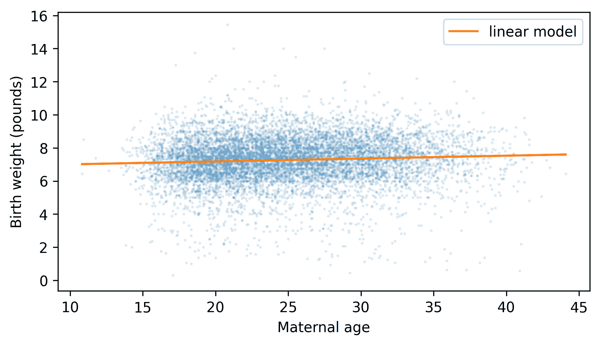
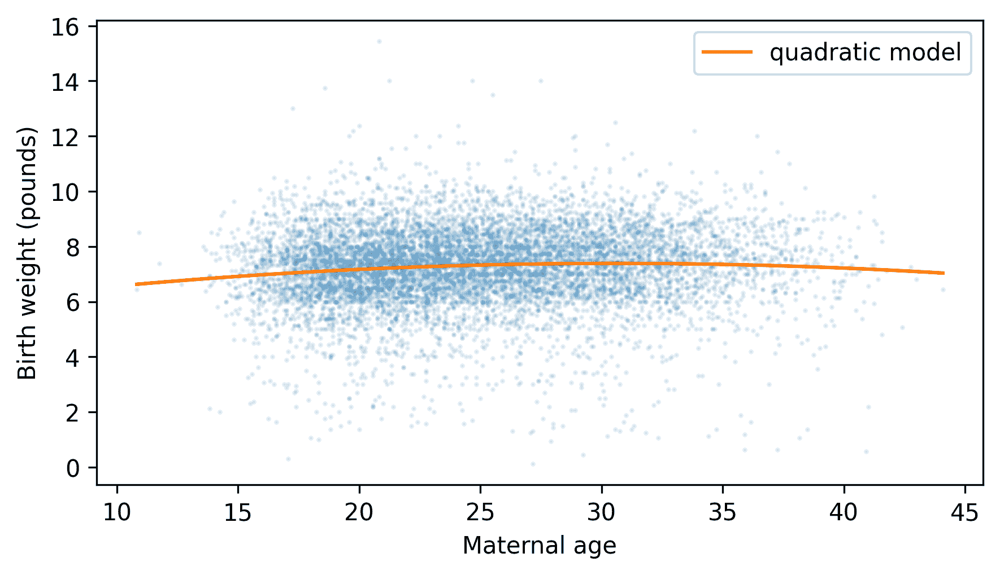
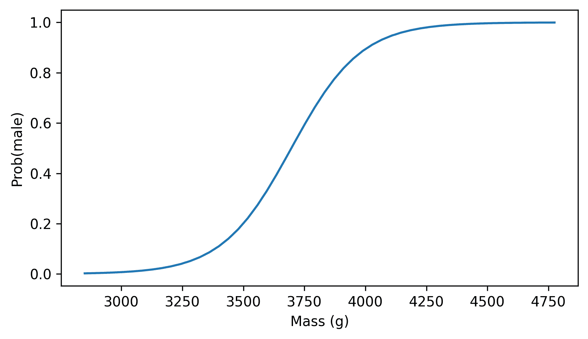
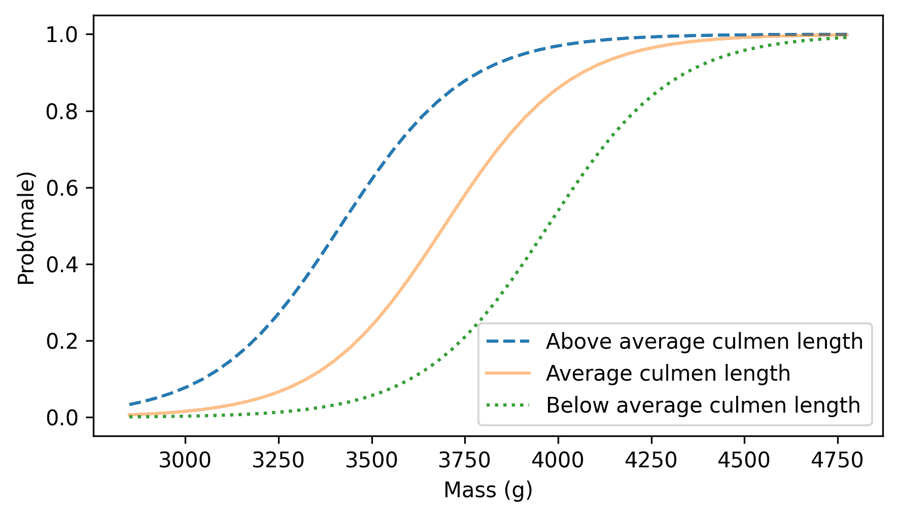

# 多元回归

> 原文：[`allendowney.github.io/ThinkStats/chap11.html`](https://allendowney.github.io/ThinkStats/chap11.html)

上一章中的线性最小二乘拟合是**回归**的一个例子，它是建模一组变量（称为**响应变量**或因变量）与另一组变量（称为**解释变量**或自变量）之间关系的一个更一般的问题。

在上一章的示例中，只有一个响应变量和一个解释变量，这被称为**简单回归**。在本章中，我们将继续探讨**多元回归**，其中包含多个解释变量，但仍然只有一个响应变量。如果有多个响应变量，那就是多元回归，我们在这本书中不会涉及。

[点击此处运行此笔记本在 Colab 上](https://colab.research.google.com/github/AllenDowney/ThinkStats/blob/v3/nb/chap11.ipynb)。

```py
from  os.path  import basename, exists

def  download(url):
    filename = basename(url)
    if not exists(filename):
        from  urllib.request  import urlretrieve

        local, _ = urlretrieve(url, filename)
        print("Downloaded " + local)

download("https://github.com/AllenDowney/ThinkStats/raw/v3/nb/thinkstats.py") 
```

```py
try:
    import  empiricaldist
except ImportError:
    %pip install empiricaldist 
```

```py
import  numpy  as  np
import  pandas  as  pd
import  matplotlib.pyplot  as  plt

from  thinkstats  import decorate 
```

## StatsModels

在上一章中，我们使用了 SciPy 函数 `linregress` 来计算最小二乘拟合。此函数执行简单回归，但不能执行多元回归。为此，我们将使用 `StatsModels`，这是一个提供多种回归和其他分析的包。

作为第一个例子，我们将继续探索企鹅数据。

以下单元格从 Allison Horst 创建的存储库中下载数据。

Horst AM, Hill AP, Gorman KB (2020)。palmerpenguins：帕默群岛（南极）企鹅数据。R 包版本 0.1.0。[`allisonhorst.github.io/palmerpenguins/`](https://allisonhorst.github.io/palmerpenguins/)。doi: 10.5281/zenodo.3960218。

数据是作为导致这篇论文的研究的一部分收集的：Gorman KB, Williams TD, Fraser WR (2014)。南极企鹅（属 Pygoscelis）群落中的生态性别二态性和环境可变性。PLoS ONE 9(3):e90081。[`doi.org/10.1371/journal.pone.0090081`](https://doi.org/10.1371/journal.pone.0090081)

```py
download(
    "https://raw.githubusercontent.com/allisonhorst/palmerpenguins/c19a904462482430170bfe2c718775ddb7dbb885/inst/extdata/penguins_raw.csv"
) 
```

当我们加载数据时，我们将使用以下字典来给出不包含空格的列名，这将使它们更容易与 StatsModels 一起使用。

```py
columns = {
    "Body Mass (g)": "mass",
    "Flipper Length (mm)": "flipper_length",
    "Culmen Length (mm)": "culmen_length",
    "Culmen Depth (mm)": "culmen_depth",
} 
```

现在我们可以加载数据，删除缺失体重的行，并重命名列。

```py
penguins = (
    pd.read_csv("penguins_raw.csv")
    .dropna(subset=["Body Mass (g)"])
    .rename(columns=columns)
)
penguins.shape 
```

```py
(342, 17) 
```

数据集包含三种企鹅物种。我们将仅使用阿德利企鹅。

```py
adelie = penguins.query('Species.str.startswith("Adelie")').copy()
len(adelie) 
```

```py
151 
```

在上一章中，我们计算了企鹅的鳍长和体重之间的最小二乘拟合。

```py
flipper_length = adelie["flipper_length"]
body_mass = adelie["mass"] 
```

作为提醒，以下是使用 `linregress` 实现的方法。

```py
from  scipy.stats  import linregress

result_linregress = linregress(flipper_length, body_mass)
result_linregress.intercept, result_linregress.slope 
```

```py
(np.float64(-2535.8368022002514), np.float64(32.83168975115009)) 
```

`StatsModels` 提供了两个接口（APIs）——我们将使用“公式”API，它使用 Patsy 公式语言来指定响应变量和解释变量。以下公式字符串指定响应变量 `mass` 是一个解释变量 `flipper_length` 的线性函数。

```py
formula = "mass ~ flipper_length" 
```

我们可以将此公式传递给 `StatsModels` 函数 `ols`，以及数据。

```py
import  statsmodels.formula.api  as  smf

model = smf.ols(formula, data=adelie)
type(model) 
```

```py
statsmodels.regression.linear_model.OLS 
```

名称 `ols` 代表“普通最小二乘法”，这表明此函数在最常见的或“普通”的假设下计算最小二乘拟合。

结果是一个表示模型的 `OLS` 对象。一般来说，模型是变量之间关系的简化描述。在这个例子中，它是一个线性模型，这意味着它假设响应变量是解释变量的线性函数。

`fit` 方法将模型拟合到数据，并返回一个包含结果的 `RegressionResults` 对象。

```py
result_ols = model.fit() 
```

```py
# Technically it's a RegressionResultsWrapper

type(result_ols) 
```

```py
statsmodels.regression.linear_model.RegressionResultsWrapper 
```

`RegressionResults` 对象包含大量信息，因此 `thinkstats` 提供了一个仅显示我们现在所需信息的函数。

```py
from  thinkstats  import display_summary

display_summary(result_ols) 
```

|  | coef | std err | t | P>&#124;t&#124; | [0.025 | 0.975] |
| --- | --- | --- | --- | --- | --- | --- |
| Intercept | -2535.8368 | 964.798 | -2.628 | 0.009 | -4442.291 | -629.382 |
| flipper_length | 32.8317 | 5.076 | 6.468 | 0.000 | 22.801 | 42.862 |
| R-squared: | 0.2192 |

第一列包含截距和斜率，即模型的 **系数**。我们可以确认它们与我们从 `linregress` 得到的系数相同。

```py
result_linregress.intercept, result_linregress.slope 
```

```py
(np.float64(-2535.8368022002514), np.float64(32.83168975115009)) 
```

第二列包含系数的标准误差 – 同样，它们与我们从 `linregress` 得到的值相同。

```py
result_linregress.intercept_stderr, result_linregress.stderr, 
```

```py
(np.float64(964.7984274994059), np.float64(5.076138407990821)) 
```

下一个列报告 \(t\) 统计量，用于计算 p 值 – 我们可以忽略它们，因为 p 值在下一列，标记为 `P>|t|`。`flipper_length` 的 p 值四舍五入到 0，但我们可以这样显示。

```py
result_ols.pvalues["flipper_length"] 
```

```py
np.float64(1.3432645947789321e-09) 
```

并确认 `linregress` 计算了相同的结果。

```py
result_linregress.pvalue 
```

```py
np.float64(1.3432645947790051e-09) 
```

p 值非常小，这意味着如果实际上体重和鳍长之间没有关系，我们几乎不可能偶然看到与估计值一样大的斜率。

最后两列，标记为 `[0.025` 和 `0.975]`，报告了截距和斜率的 95% 置信区间。因此，斜率的 95% 置信区间是 [22.8, 42.9]。

最后一行报告了模型的 \(R²\) 值，大约为 0.22 – 这意味着如果我们使用鳍长来预测体重，与只使用平均体重相比，我们可以将均方误差降低约 22%。

从简单相关得到的 \(R²\) 值是相关系数 \(r\) 的平方。因此，我们可以将 `ols` 计算出的 `rsquared` 与 `linregress` 计算出的 `rvalue` 的平方进行比较。

```py
result_ols.rsquared, result_linregress.rvalue**2 
```

```py
(np.float64(0.21921282646854878), np.float64(0.21921282646854875)) 
```

它们除了由于浮点近似产生的小差异外，都是相同的。

在我们进行多元回归之前，让我们计算一个更简单的回归，以 `culmen_length` 作为解释变量（culmen 是喙的顶部脊）。

```py
formula = "mass ~ culmen_length"
result = smf.ols(formula, data=adelie).fit()
display_summary(result) 
```

|  | coef | std err | t | P>&#124;t&#124; | [0.025 | 0.975] |
| --- | --- | --- | --- | --- | --- | --- |
| 截距 | 34.8830 | 458.439 | 0.076 | 0.939 | -870.998 | 940.764 |
| culmen_length | 94.4998 | 11.790 | 8.015 | 0.000 | 71.202 | 117.798 |
| R-squared: | 0.3013 |

再次，斜率的 p 值非常小，这意味着如果实际上质量和喙长之间没有关系，我们不太可能偶然看到这么大的斜率。你可能注意到与截距相关的 p 值较大，但这不是问题，因为我们不关心截距是否可能为零。在这个模型中，截距接近零，但这只是一个巧合——它并不表明模型存在问题。

这个模型的 \(R²\) 值约为 0.30，所以如果我们使用喙长而不是鳍长作为解释变量，MSE 的减少会略高（鳍长的 \(R²\) 值为 0.22）。现在，让我们看看将它们结合起来会发生什么。

## 接下来是多元回归

这里是关于质量是鳍长和喙长线性函数的多元回归模型的 Patsy 公式。

```py
formula = "mass ~ flipper_length + culmen_length" 
```

这里是将此模型拟合到数据的结果。

```py
result = smf.ols(formula, data=adelie).fit()
display_summary(result) 
```

|  | coef | std err | t | P>&#124;t&#124; | [0.025 | 0.975] |
| --- | --- | --- | --- | --- | --- | --- |
| Intercept | -3573.0817 | 866.739 | -4.122 | 0.000 | -5285.864 | -1860.299 |
| flipper_length | 22.7024 | 4.742 | 4.787 | 0.000 | 13.331 | 32.074 |
| culmen_length | 76.3402 | 11.644 | 6.556 | 0.000 | 53.331 | 99.350 |
| R-squared: | 0.3949 |

这个模型有三个系数：一个截距和两个斜率。与鳍长相关的斜率是 22.7，这意味着我们预计鳍长增加一毫米的企鹅，重量会增加 22.7 克——假设喙长相同。同样，我们预计喙长增加一毫米的企鹅，重量会增加 76.3 克——假设鳍长相同。

与两个斜率相关的 p 值都很小，这意味着两个解释变量的贡献不太可能偶然发生。

而 \(R²\) 值为 0.39，高于只有喙长（0.30）的模型和只有鳍长（0.22）的模型。因此，基于两个解释变量的预测比基于任何一个单独的解释变量都要好。

但它们并不像我们希望的那样好。如果鳍长减少了 MSE 的 22%，喙长减少了 30%，为什么两者加在一起不能总共减少 52% 呢？原因是解释变量彼此相关。

```py
from  thinkstats  import corrcoef

corrcoef(adelie, "flipper_length", "culmen_length") 
```

```py
np.float64(0.32578471516515944) 
```

一只鳍更长的企鹅平均来说喙也更长。解释变量包含一些彼此之间的信息，这意味着它们包含关于响应变量的部分相同信息。当我们向模型添加一个解释变量时，\(R²\) 的提高仅反映了新变量提供的新信息。

如果我们添加喙深作为第三个解释变量，我们会看到相同的模式。

```py
formula = "mass ~ flipper_length + culmen_length + culmen_depth"
result = smf.ols(formula, data=adelie).fit()
display_summary(result) 
```

|  | coef | std err | t | P>&#124;t&#124; | [0.025 | 0.975] |
| --- | --- | --- | --- | --- | --- | --- |
| Intercept | -4341.3019 | 795.117 | -5.460 | 0.000 | -5912.639 | -2769.964 |
| flipper_length | 17.4215 | 4.385 | 3.973 | 0.000 | 8.756 | 26.087 |
| culmen_length | 55.3676 | 11.133 | 4.973 | 0.000 | 33.366 | 77.369 |
| culmen_depth | 140.8946 | 24.216 | 5.818 | 0.000 | 93.037 | 188.752 |
| R-squared: | 0.5082 |

这个模型有四个系数。所有的 p 值都很小，这意味着每个解释变量的贡献不太可能偶然发生。并且 \(R²\) 值约为 0.51，略好于具有两个解释变量的先前模型（0.39），并且优于具有单个变量的任何模型（0.22 和 0.30）。

但再次，增量改进小于我们可能希望的，因为 culmen 深度与其他两个测量值相关。

```py
[
    corrcoef(adelie, "culmen_depth", "flipper_length"),
    corrcoef(adelie, "culmen_depth", "culmen_length"),
] 
```

```py
[np.float64(0.30762017939668534), np.float64(0.39149169183587634)] 
```

这个例子演示了多元回归的常见用途，通过结合多个解释变量来做出更好的预测。另一个常见用途是在控制另一组变量的贡献的同时，量化一组变量的贡献。

## 控制变量

在第 第四章 中，我们看到了第一个孩子平均比其他孩子轻。在第 第九章 中，我们看到了出生体重与母亲年龄相关——年龄较大的母亲平均有更重的孩子。

这些结果可能相关。如果第一个孩子的母亲比其他孩子的母亲年轻——这似乎很可能是这样——那么这或许可以解释为什么他们的孩子体重较轻。我们可以通过估计第一个孩子和其他孩子在出生体重上的差异，同时控制母亲的年龄，来使用多元回归测试这个假设。

下载 NSFG 数据的说明在本书的笔记本中。

以下单元格下载数据文件并安装 `statadict`，这是我们读取数据所需的。

```py
download("https://github.com/AllenDowney/ThinkStats/raw/v3/nb/nsfg.py")
download("https://github.com/AllenDowney/ThinkStats/raw/v3/data/2002FemPreg.dct")
download("https://github.com/AllenDowney/ThinkStats/raw/v3/data/2002FemPreg.dat.gz") 
```

```py
try:
    import  statadict
except ImportError:
    %pip install statadict 
```

我们可以使用 `get_nsfg_groups` 来读取数据，选择活产，并将活产分为第一个孩子和其他孩子。

```py
from  nsfg  import get_nsfg_groups

live, firsts, others = get_nsfg_groups() 
```

我们将使用 `dropna` 来选择具有有效出生体重、出生顺序和母亲年龄的行。

```py
valid = live.dropna(subset=["agepreg", "birthord", "totalwgt_lb"]).copy() 
```

现在，我们可以使用 `StatsModels` 来确认出生体重与年龄相关，并估计斜率——假设这是一种线性关系。

```py
formula = "totalwgt_lb ~ agepreg"
result_age = smf.ols(formula, data=valid).fit()
display_summary(result_age) 
```

|  | coef | std err | t | P>&#124;t&#124; | [0.025 | 0.975] |
| --- | --- | --- | --- | --- | --- | --- |
| Intercept | 6.8304 | 0.068 | 100.470 | 0.000 | 6.697 | 6.964 |
| agepreg | 0.0175 | 0.003 | 6.559 | 0.000 | 0.012 | 0.023 |
| R-squared: | 0.004738 |

斜率很小，只有每年 0.0175 磅。所以如果两个母亲的年龄相差十年，我们预计他们的孩子的体重将相差 0.175 磅。但是 p 值很小，所以即使实际上没有关系，这个斜率——尽管很小——也很可能不会出现。

\(R²\) 值也较小，这意味着母亲的年龄作为预测变量并不是非常有用。如果我们知道母亲的年龄，我们预测婴儿体重的能力几乎不会有所提高。

这种小 p 值和小\(R²\)值的组合是常见的混淆来源，因为它似乎自相矛盾——如果关系在统计上显著，它似乎应该具有预测性。但这个例子表明，这并不矛盾——一个关系可以是统计上显著的，但并不非常适合预测。如果我们可视化结果，我们会看到原因。首先，让我们选择相关的列。

```py
totalwgt = valid["totalwgt_lb"]
agepreg = valid["agepreg"] 
```

要计算拟合线，我们可以从`result_age`中提取截距和斜率，但不必这样做。`RegressionResults`对象提供了一个我们可以使用的`predict`方法。首先，我们将计算`agepreg`的值范围。

```py
agepreg_range = np.linspace(agepreg.min(), agepreg.max()) 
```

要使用`predict`，我们必须将解释变量的值放入一个`DataFrame`中。

```py
df = pd.DataFrame({"agepreg": agepreg_range}) 
```

`DataFrame`中的列必须与解释变量具有相同的名称。然后我们才能将其传递给`predict`。

```py
fit_ys = result_age.predict(df) 
```

结果是一个包含预测值的`Series`。以下是它们的形状，以及数据的散点图。

```py
plt.scatter(agepreg, totalwgt, marker=".", alpha=0.1, s=5)
plt.plot(agepreg_range, fit_ys, color="C1", label="linear model")

decorate(xlabel="Maternal age", ylabel="Birth weight (pounds)") 
```



因为拟合线的斜率很小，所以我们几乎看不到年轻母亲和年长母亲预期出生体重的差异。在每一个母亲年龄，出生体重的变化要大得多。

接下来，我们将使用`StatsModels`来确认第一个出生的孩子比其他孩子轻。为了实现这一点，我们将创建一个布尔`Series`，对于第一个出生的孩子为`True`，对于其他人则为`False`，并将其添加为名为`is_first`的新列。

```py
valid["is_first"] = valid["birthord"] == 1 
```

```py
from  thinkstats  import value_counts

# check the results
value_counts(valid["is_first"]) 
```

```py
is_first
False    4675
True     4363
Name: count, dtype: int64 
```

这是将出生体重作为响应变量，`is_first`作为解释变量的模型的公式。在 Patsy 公式语言中，`C`和变量名周围的括号表示它是**分类的**——也就是说，它代表像“第一个孩子”这样的类别，而不是像出生体重这样的测量值。

```py
formula = "totalwgt_lb ~ C(is_first)" 
```

现在我们可以拟合模型并显示结果，就像往常一样。

```py
result_first = smf.ols(formula, data=valid).fit()
display_summary(result_first) 
```

|  | coef | std err | t | P>&#124;t&#124; | [0.025 | 0.975] |
| --- | --- | --- | --- | --- | --- | --- |
| Intercept | 7.3259 | 0.021 | 356.007 | 0.000 | 7.286 | 7.366 |
| C(is_first)[T.True] | -0.1248 | 0.030 | -4.212 | 0.000 | -0.183 | -0.067 |
| R-squared: | 0.00196 |

在结果中，标签`C(is_first)[T.True]`表示`is_first`是一个分类变量，系数与值`True`相关。`True`前面的`T`代表“治疗”——在控制实验的语言中，第一个出生的孩子被视为治疗组，其他孩子被视为参照组。这些指定是任意的——我们也可以考虑第一个出生的孩子为参照组，其他人为治疗组。但我们需要知道哪个是哪个，以便解释结果。

截距约为 7.3，这意味着参考组的平均体重为 7.3 磅。`is_first` 的系数为 -0.12，这意味着治疗组（第一个孩子）的平均体重比参考组轻 0.12 磅。我们可以通过直接计算来检查这两个结果。

```py
others["totalwgt_lb"].mean() 
```

```py
np.float64(7.325855614973262) 
```

```py
diff_weight = firsts["totalwgt_lb"].mean() - others["totalwgt_lb"].mean()
diff_weight 
```

```py
np.float64(-0.12476118453549034) 
```

除了这些系数外，`StatsModels` 还计算了 p 值、置信区间和 \(R²\)。与第一个孩子相关的 p 值很小，这意味着两组之间的差异在统计上具有显著性。而 \(R²\) 值很小，这意味着如果我们试图猜测一个婴儿的体重，知道它是否是第一个孩子并不会有多大帮助。

现在我们来看一下，出生体重的差异是否可能是由于母亲年龄的差异。平均而言，第一个孩子的母亲比其他母亲年轻约 3.6 岁。

```py
diff_age = firsts["agepreg"].mean() - others["agepreg"].mean()
diff_age 
```

```py
np.float64(-3.5864347661500275) 
```

并且出生体重作为年龄函数的斜率是每年 0.0175 磅。

```py
slope = result_age.params["agepreg"]
slope 
```

```py
np.float64(0.017453851471802638) 
```

如果我们将斜率乘以年龄差异，我们就能得到由于母亲年龄差异而导致的第一个孩子和其他孩子预期出生体重的差异。

```py
slope * diff_age 
```

```py
np.float64(-0.0625970997216918) 
```

结果是 0.063 磅，大约是观察到的差异的一半。所以看起来观察到的出生体重差异可以部分地用母亲年龄的差异来解释。

使用多元回归，我们可以同时估计母亲年龄和第一个孩子的系数。

```py
formula = "totalwgt_lb ~ agepreg + C(is_first)"
result = smf.ols(formula, data=valid).fit()
display_summary(result) 
```

|  | coef | std err | t | P>&#124;t&#124; | [0.025 | 0.975] |
| --- | --- | --- | --- | --- | --- | --- |
| Intercept | 6.9142 | 0.078 | 89.073 | 0.000 | 6.762 | 7.066 |
| C(is_first)[T.True] | -0.0698 | 0.031 | -2.236 | 0.025 | -0.131 | -0.009 |
| agepreg | 0.0154 | 0.003 | 5.499 | 0.000 | 0.010 | 0.021 |
| R-squared: | 0.005289 |

`is_first` 的系数为 -0.0698，这意味着在考虑了母亲年龄差异后，第一个孩子平均比其他孩子轻 0.0698 磅。这大约是未考虑母亲年龄差异时差异的一半。

并且 p 值为 0.025，这仍然被认为是统计上显著的，但它处于一个边缘范围，我们不能排除这种大小的差异可能偶然发生的可能性。

由于这个模型考虑了由于母亲年龄导致的体重差异，我们可以说它**控制了**母亲年龄。但它假设体重和母亲年龄之间的关系是线性的。所以让我们看看这是否正确。

## 非线性关系

为了检查 `agepreg` 的贡献是否可能是非线性的，我们可以在数据集中添加一个新列，其中包含 `agepreg` 的平方值。

```py
valid["agepreg2"] = valid["agepreg"] ** 2 
```

现在我们可以定义一个包含线性关系和二次关系的模型。

```py
formula = "totalwgt_lb ~ agepreg + agepreg2" 
```

我们可以用通常的方式拟合这个模型。

```py
result_age2 = smf.ols(formula, data=valid).fit()
display_summary(result_age2) 
```

|  | coef | std err | t | P>&#124;t&#124; | [0.025 | 0.975] |
| --- | --- | --- | --- | --- | --- | --- |
| Intercept | 5.5720 | 0.275 | 20.226 | 0.000 | 5.032 | 6.112 |
| agepreg | 0.1186 | 0.022 | 5.485 | 0.000 | 0.076 | 0.161 |
| agepreg2 | -0.0019 | 0.000 | -4.714 | 0.000 | -0.003 | -0.001 |
| R-squared: | 0.00718 |

与二次项`agepreg2`相关的 p 值非常小，这表明它比我们预期的偶然性提供了更多关于出生体重的信息。并且该模型的\(R²\)值为 0.0072，高于线性模型的\(R²\)值（0.0047）。

通过估计`agepreg`和`agepreg2`的系数，我们实际上是在将抛物线拟合到数据中。为了验证这一点，我们可以使用`RegressionResults`对象为一系列母体年龄生成预测。

首先，我们将创建一个临时的`DataFrame`，其中包含名为`agepreg`和`agepreg2`的列，基于`agepreg_range`中的年龄范围。

```py
df = pd.DataFrame({"agepreg": agepreg_range})
df["agepreg2"] = df["agepreg"] ** 2 
```

现在，我们可以使用`predict`方法，将`DataFrame`作为参数传递，并返回一个预测的`Series`。

```py
fit_ys = result_age2.predict(df) 
```

下面是拟合的抛物线以及数据的散点图。

```py
plt.scatter(agepreg, totalwgt, marker=".", alpha=0.1, s=5)
plt.plot(agepreg_range, fit_ys, color="C1", label="quadratic model")

decorate(xlabel="Maternal age", ylabel="Birth weight (pounds)") 
```



曲率微妙，但暗示着最年轻和最年长的母亲的出生体重较低，而中间的较高。

二次模型比线性模型更好地捕捉这些变量之间的关系，这意味着它可以更有效地解释由于母体年龄差异导致的出生体重差异。因此，让我们看看当我们将`is_first`添加到二次模型中会发生什么。

```py
formula = "totalwgt_lb ~ agepreg + agepreg2 + C(is_first)"
result = smf.ols(formula, data=valid).fit()
display_summary(result) 
```

|  | coef | std err | t | P>&#124;t&#124; | [0.025 | 0.975] |
| --- | --- | --- | --- | --- | --- | --- |
| Intercept | 5.6923 | 0.286 | 19.937 | 0.000 | 5.133 | 6.252 |
| C(is_first)[T.True] | -0.0504 | 0.031 | -1.602 | 0.109 | -0.112 | 0.011 |
| agepreg | 0.1124 | 0.022 | 5.113 | 0.000 | 0.069 | 0.155 |
| agepreg2 | -0.0018 | 0.000 | -4.447 | 0.000 | -0.003 | -0.001 |
| R-squared: | 0.007462 |

通过更有效地控制母体年龄，我们估计第一个孩子与其他孩子之间的体重差异为 0.0504 磅，小于仅使用线性模型时的估计（0.0698 磅）。并且与`is_first`相关的 p 值为 0.109，这意味着这些组之间剩余的差异可能是由于偶然性。

我们可以得出结论，出生体重的差异至少部分地，可能全部地，是由母亲年龄的差异所解释的。

## 逻辑回归

线性回归基于一个模型，其中响应变量的期望值是解释变量的加权和以及一个截距。当响应变量是连续量，如出生体重或企鹅体重时，此模型是合适的，但当响应变量是离散量，如计数或类别时，则不合适。

对于这些类型的响应变量，我们可以使用**广义线性模型**或 GLMs。例如：

+   如果响应变量是计数，我们可以使用泊松回归。

+   如果它是只有两个类别的分类变量，我们可以使用逻辑回归。

+   如果它是具有两个以上类别的分类变量，我们可以使用多项逻辑回归。

+   如果它是有序的，并且类别可以按顺序排列，我们可以使用有序逻辑回归。

我们不会在这本书中涵盖所有这些——只涵盖最常用的**逻辑回归**。作为一个例子，我们将再次使用企鹅数据集，看看我们是否可以根据其体重和其他测量值来判断企鹅是雄性还是雌性。

`StatsModels` 提供了一个进行逻辑回归的函数——它被称为 `logit`，因为这是逻辑回归定义中出现的数学函数的名称。在我们能够使用 `logit` 函数之前，我们必须将响应变量转换，使其值为 `0` 和 `1`。

```py
adelie["y"] = (adelie["Sex"] == "MALE").astype(int) 
```

```py
adelie["y"].value_counts() 
```

```py
y
0    78
1    73
Name: count, dtype: int64 
```

我们将从以`y`作为响应变量和`质量`作为解释变量的简单模型开始。以下是创建和拟合模型的方法——参数`disp=False`抑制了关于拟合过程的输出。

```py
model = smf.logit("y ~ mass", data=adelie)
result = model.fit(disp=False) 
```

下面是结果。

```py
display_summary(result) 
```

|  | 系数 | 标准误 | z | P>&#124;z&#124; | [0.025 | 0.975] |
| --- | --- | --- | --- | --- | --- | --- |
| 截距 | -25.9871 | 4.221 | -6.156 | 0.000 | -34.261 | -17.713 |
| 质量 | 0.0070 | 0.001 | 6.138 | 0.000 | 0.005 | 0.009 |
| 伪 R 平方 | 0.5264 |

决定系数 \(R²\) 不适用于逻辑回归，但有一些替代方案被用作“伪 \(R²\) 值”。该模型的伪 \(R²\) 值约为 0.526，这本身并没有什么意义，但我们将用它来比较模型。

`质量`的系数为正，这意味着体重较重的企鹅更有可能是雄性。除此之外，系数不易解释——我们可以通过绘制预测图来更好地理解模型。我们将创建一个包含`质量`值范围的`DataFrame`，并使用`predict`来计算一系列预测值。

```py
mass = adelie["mass"]
mass_range = np.linspace(mass.min(), mass.max())
df = pd.DataFrame({"mass": mass_range})
fit_ys = result.predict(df) 
```

每个预测值都是企鹅为雄性的概率，这是其体重的函数。以下是预测值的外观。

```py
plt.plot(mass_range, fit_ys)

decorate(xlabel="Mass (g)", ylabel="Prob(male)") 
```



最轻的企鹅几乎肯定是雌性，而最重的企鹅很可能是雄性——在中间，体重为 3750 克的企鹅是雄性或雌性的可能性大致相等。

现在我们来看看如果我们添加其他测量值作为解释变量会发生什么。

```py
formula = "y ~ mass + flipper_length + culmen_length + culmen_depth"
model = smf.logit(formula, data=adelie)
result = model.fit(disp=False)
display_summary(result) 
```

|  | 系数 | 标准误 | z | P>&#124;z&#124; | [0.025 | 0.975] |
| --- | --- | --- | --- | --- | --- | --- |
| 截距 | -60.6075 | 13.793 | -4.394 | 0.000 | -87.642 | -33.573 |
| 质量 | 0.0059 | 0.001 | 4.153 | 0.000 | 0.003 | 0.009 |
| 翼展长度 | -0.0209 | 0.052 | -0.403 | 0.687 | -0.123 | 0.081 |
| 顶点长度 | 0.6208 | 0.176 | 3.536 | 0.000 | 0.277 | 0.965 |
| 顶点深度 | 1.0111 | 0.349 | 2.896 | 0.004 | 0.327 | 1.695 |
| 伪 R 平方 | 0.6622 |

该模型的伪 \(R²\) 值为 0.662，高于之前的模型（0.526）——因此，额外的测量包含区分雄性和雌性企鹅的信息。

culmen_length 和 depth 的 p 值很小，这表明它们比我们预期的偶然性贡献了更多信息。flipper_length 的 p 值很大，这表明如果你知道企鹅的体重和喙尺寸，flipper_length 不会提供额外的信息。

为了理解这个模型，让我们看看它的某些预测。我们将使用以下函数，它接受一系列质量和特定的`culmen_length`值。它将其他测量值设置为它们的平均值，计算作为质量函数的预测概率，并绘制结果。

```py
def  plot_predictions(mass_range, culmen_length, **options):
  """Plot predicted probabilities as a function of mass."""
    df = pd.DataFrame({"mass": mass_range})
    df["flipper_length"] = adelie["flipper_length"].mean()
    df["culmen_length"] = culmen_length
    df["culmen_depth"] = adelie["culmen_depth"].mean()
    fit_ys = result.predict(df)
    plt.plot(mass_range, fit_ys, **options) 
```

这里是`culmen_length`三个值的结果：平均值的 1 个标准差以上，平均值，和平均值的 1 个标准差以下。

```py
culmen_length = adelie["culmen_length"]
m, s = culmen_length.mean(), culmen_length.std() 
```

```py
plot_predictions(mass_range, m + s, ls="--", label="Above average culmen length")
plot_predictions(mass_range, m, alpha=0.5, label="Average culmen length")
plot_predictions(mass_range, m - s, ls=":", label="Below average culmen length")

decorate(xlabel="Mass (g)", ylabel="Prob(male)") 
```



正如我们在更简单的模型中看到的，体重较重的企鹅更有可能是雄性。此外，在任何体重下，喙较长的企鹅更有可能是雄性。

这个模型比它看起来更有用——事实上，它与用于收集此数据集的原始研究论文中使用的模型相似。该研究的主要主题是性二形性，即雄性和雌性身体差异的程度。量化二形性的方法之一是使用测量值来分类雄性和雌性。在一个二形性较高的物种中，我们预计这些分类将更加准确。

原始论文是 Gorman KB, Williams TD, Fraser WR (2014)。南极企鹅（属 Pygoscelis）群落中的生态性二形性和环境可变性。PLoS ONE 9(3):e90081。 [`doi.org/10.1371/journal.pone.0090081`](https://doi.org/10.1371/journal.pone.0090081)

为了测试这个方法，让我们尝试在另一种物种上使用相同的模型。除了我们之前工作的阿德利企鹅外，数据集还包含 123 只金图企鹅的测量值。我们将使用以下函数来选择它们。

```py
def  get_species(penguins, species):
    df = penguins.query(f'Species.str.startswith("{species}")').copy()
    df["y"] = (df["Sex"] == "MALE").astype(int)
    return df 
```

```py
gentoo = get_species(penguins, "Gentoo")
len(gentoo) 
```

```py
123 
```

这里是逻辑回归模型的预测结果。

```py
formula = "y ~ mass + flipper_length + culmen_length + culmen_depth"
model = smf.logit(formula, data=gentoo)
result = model.fit(disp=False)
display_summary(result) 
```

|  | coef | std err | z | P>&#124;z&#124; | [0.025 | 0.975] |
| --- | --- | --- | --- | --- | --- | --- |
| Intercept | -173.9123 | 62.326 | -2.790 | 0.005 | -296.069 | -51.756 |
| mass | 0.0105 | 0.004 | 2.948 | 0.003 | 0.004 | 0.017 |
| flipper_length | 0.2839 | 0.183 | 1.549 | 0.121 | -0.075 | 0.643 |
| culmen_length | 0.2734 | 0.285 | 0.958 | 0.338 | -0.286 | 0.833 |
| culmen_depth | 3.0843 | 1.291 | 2.389 | 0.017 | 0.554 | 5.614 |
| 伪\(R²\)： | 0.848 |

伪\(R²\)值为 0.848，高于我们用阿德利企鹅得到的值（0.662）。这意味着与阿德利企鹅相比，可以使用物理测量值更准确地分类金图企鹅，这表明金图企鹅的性二形性更高。

## 术语表

+   **回归**：一种估计系数的方法，使模型与数据拟合。

+   **响应变量**：回归模型试图预测的变量，也称为因变量。

+   **解释变量**：模型用来预测响应变量的变量，也称为独立变量。

+   **简单回归**：一个包含一个响应变量和一个解释变量的回归。

+   **多元回归**：一个包含多个解释变量但只有一个响应变量的回归。

+   **系数**：在回归模型中，系数是解释变量的截距和估计斜率。

+   **分类变量**：可以有一个离散值集的变量，通常不是数值。

+   **控制变量**：在回归中包含的变量，用于将解释变量的直接效应与间接效应分开。

+   **广义线性模型**：基于解释变量和响应变量之间不同数学关系的一系列回归模型。

+   **逻辑回归**：当响应变量只有两个可能值时使用的广义线性模型。

## 练习

### 练习 11.1

婴儿男孩比婴儿女孩重吗？为了回答这个问题，我们将再次使用 NSFG 数据。

拟合一个线性回归模型，以`totalwgt_lb`作为响应变量，以`babysex`作为分类解释变量——该变量的值为`1`表示男孩，`2`表示女孩。估计的体重差异是多少？这是否具有统计学意义？如果你控制了母亲的年龄——母亲的年龄是否解释了部分或全部的明显差异？

### 练习 11.2

特里弗斯-威尔拉德假说认为，对于许多哺乳动物，性别比例取决于“母体状况”——也就是说，像母亲的年龄、体型、健康状况和社会地位这样的因素。一些研究表明人类中存在这种效应，但结果不一。

查看 [`en.wikipedia.org/wiki/Trivers-Willard_hypothesis`](https://en.wikipedia.org/wiki/Trivers-Willard_hypothesis)。

让我们看看母亲的年龄和生男孩的概率之间是否存在关系。拟合一个逻辑回归模型，以婴儿的性别作为响应变量，母亲的年龄作为解释变量。年龄较大的母亲更有可能还是不太可能生男孩？如果你使用母亲的年龄的二次模型会怎样？

为了在逻辑回归中使用`babysex`作为响应变量，我们将它重新编码为男孩的值为`1`，女孩的值为`0`。

```py
valid["y"] = (valid["babysex"] == 1).astype(int) 
```

### 练习 11.3

对于阿德利企鹅，拟合一个线性回归模型，预测企鹅的体重作为`flipper_length`、`culmen_depth`和作为分类变量的`Sex`的函数。如果我们控制了鳍长和喙深，雄性企鹅会重多少？为一系列鳍长、雄性和雌性企鹅生成并绘制预测图，其中`culmen_depth`设置为平均值。

### 练习 11.4

让我们看看帝企鹅在数据集中是否比其他企鹅物种的异质性更多或更少，这是通过模型的伪 \(R²\) 值来衡量的。使用 `get_species` 函数来选择帝企鹅，然后使用逻辑回归来拟合一个以性别作为响应变量，所有四个测量值作为解释变量的逻辑回归模型。伪 \(R²\) 值与其他模型相比如何？

```py
chinstrap = get_species(penguins, "Chinstrap")
len(chinstrap) 
```

```py
68 
```

[《Think Stats：Python 中的探索性数据分析，第 3 版》](https://allendowney.github.io/ThinkStats/index.html)

版权所有 2024 [艾伦·B·唐尼](https://allendowney.com)

代码许可：[MIT 许可证](https://mit-license.org/)

文本许可：[Creative Commons 知识共享署名-非商业性使用-相同方式共享 4.0 国际](https://creativecommons.org/licenses/by-nc-sa/4.0/)
