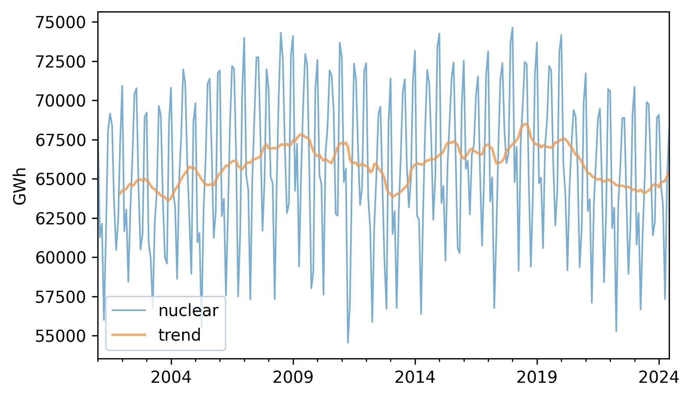
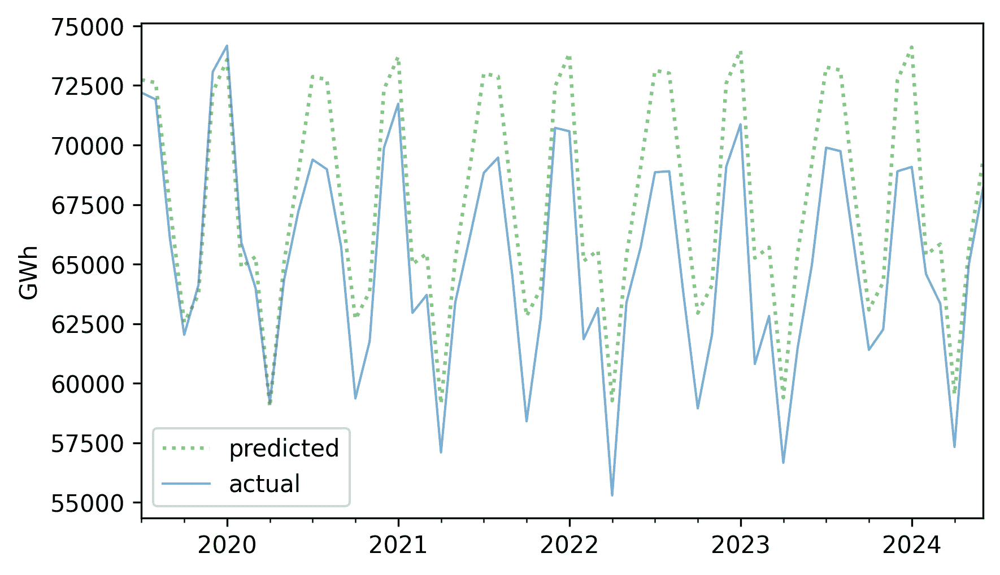

# 时间序列分析

> [`allendowney.github.io/ThinkStats/chap12.html`](https://allendowney.github.io/ThinkStats/chap12.html)

**时间序列**是从随时间变化的系统中获取的一系列测量值。我们在前几章中使用的大多数工具，如回归，也可以用于时间序列。但还有一些特别适用于此类数据的方法。

作为例子，我们将查看两个数据集：2001 年至 2024 年间美国的可再生能源发电量，以及同一时间段的天气数据。我们将开发将时间序列分解为长期趋势和重复季节性成分的方法。我们将使用线性回归模型来拟合和预测趋势。我们还将尝试一个广泛使用的分析时间序列数据模型，正式名称为“自回归积分移动平均”，简称 ARIMA。

*Think Stats* 的第三版现在可以从 [Bookshop.org](https://bookshop.org/a/98697/9781098190255) 和 [Amazon](https://amzn.to/42lmxwu) 购买（这些是联盟链接）。如果你正在享受免费的在线版本，考虑 [为我买杯咖啡](https://buymeacoffee.com/allendowney)。

[点击此处运行此笔记本在 Colab 上](https://colab.research.google.com/github/AllenDowney/ThinkStats/blob/v3/nb/chap12.ipynb)。

```py
from  os.path  import basename, exists

def  download(url):
    filename = basename(url)
    if not exists(filename):
        from  urllib.request  import urlretrieve

        local, _ = urlretrieve(url, filename)
        print("Downloaded " + local)

download("https://github.com/AllenDowney/ThinkStats/raw/v3/nb/thinkstats.py") 
```

```py
try:
    import  empiricaldist
except ImportError:
    %pip install empiricaldist 
```

```py
import  numpy  as  np
import  pandas  as  pd
import  matplotlib.pyplot  as  plt

from  thinkstats  import decorate

plt.rcParams["figure.dpi"] = 300 
```

## 电力

作为时间序列数据的例子，我们将使用美国能源信息署的数据集——它包括 2001 年至 2024 年间来自可再生能源的每月总发电量。下载数据的说明在本书的笔记本中。

下一个单元格将下载数据，我于 2024 年 9 月 17 日从 [`www.eia.gov/electricity/data/browser/`](https://www.eia.gov/electricity/data/browser/) 下载了这些数据。

```py
filename = "Net_generation_for_all_sectors.csv"
download("https://github.com/AllenDowney/ThinkStats/raw/v3/data/" + filename) 
```

加载数据后，我们必须进行一些转换，以便将其转换为易于处理的形式。

```py
elec = (
    pd.read_csv("Net_generation_for_all_sectors.csv", skiprows=4)
    .drop(columns=["units", "source key"])
    .set_index("description")
    .replace("--", np.nan)
    .transpose()
    .astype(float)
) 
```

在重新格式化的数据集中，每一列都是每月总发电量的序列，单位为千兆瓦时（GWh）。以下是列标签，显示了不同的电力来源或“部门”。

```py
elec.columns 
```

```py
Index(['Net generation for all sectors', 'United States',
       'United States : all fuels (utility-scale)', 'United States : nuclear',
       'United States : conventional hydroelectric',
       'United States : other renewables', 'United States : wind',
       'United States : all utility-scale solar', 'United States : geothermal',
       'United States : biomass',
       'United States : hydro-electric pumped storage',
       'United States : all solar',
       'United States : small-scale solar photovoltaic'],
      dtype='object', name='description') 
```

索引中的标签是表示月份和年份的字符串——以下是前 12 个月份。

```py
elec.index[:12] 
```

```py
Index(['Jan 2001', 'Feb 2001', 'Mar 2001', 'Apr 2001', 'May 2001', 'Jun 2001',
       'Jul 2001', 'Aug 2001', 'Sep 2001', 'Oct 2001', 'Nov 2001', 'Dec 2001'],
      dtype='object') 
```

如果我们将这些字符串替换为 Pandas `Timestamp` 对象，将更容易处理这些数据。我们可以使用 `date_range` 函数生成一系列 `Timestamp` 对象，从 2001 年 1 月开始，频率代码为 `"ME"`，代表“月末”，因此填充了每个月的最后一天。

```py
elec.index = pd.date_range(start="2001-01", periods=len(elec), freq="ME")
elec.index[:6] 
```

```py
DatetimeIndex(['2001-01-31', '2001-02-28', '2001-03-31', '2001-04-30',
               '2001-05-31', '2001-06-30'],
              dtype='datetime64[ns]', freq='ME') 
```

现在索引是一个 `DataTimeIndex`，数据类型为 `datetime64[ns]`，这是在 NumPy 中定义的——`64` 表示每个标签使用 64 位，`ns` 表示它具有纳秒精度。

## 分解

作为第一个例子，我们将看看从 2001 年 1 月到 2024 年 6 月的核电站发电量是如何变化的，并将时间序列分解为长期趋势和周期成分。以下是美国核电站的月度发电总量。

```py
actual_options = dict(color="C0", lw=1, alpha=0.6)
trend_options = dict(color="C1", alpha=0.6)
pred_options = dict(color="C2", alpha=0.6, ls=':')
model_options = dict(color="gray", alpha=0.6, ls='--') 
```

```py
nuclear = elec["United States : nuclear"]
nuclear.plot(label="nuclear", **actual_options)

decorate(ylabel="GWh") 
```


看起来有一些增加和减少，但它们很难清楚地看到，因为每个月之间有很大的变化。为了更清楚地看到长期趋势，我们可以使用 `rolling` 和 `mean` 方法来计算**移动平均**。

```py
trend = nuclear.rolling(window=12).mean() 
```

`window=12` 参数选择重叠的 12 个月份的区间，因此第一个区间包含从第一个开始的 12 个测量值，第二个区间包含从第二个开始的 12 个测量值，依此类推。对于每个区间，我们计算平均产量。

下面是结果的样子，包括原始数据。

```py
nuclear.plot(label="nuclear", **actual_options)
trend.plot(label="trend", **trend_options)
decorate(ylabel="GWh") 
```



趋势仍然相当多变。我们可以通过使用更长的窗口来进一步平滑它，但现在我们将坚持使用 12 个月的窗口。

如果我们从原始数据中减去趋势，结果是一个“去趋势”的时间序列，这意味着长期平均值接近常数。下面是它的样子。

```py
detrended = (nuclear - trend).dropna()
detrended.plot(label="detrended", **actual_options)
decorate(ylabel="GWh") 
```


看起来存在一个重复的年度模式，这是有道理的，因为电力的需求从季节到季节是变化的，它被用来在冬天产生热量和在夏天运行空调。为了描述这个年度模式，我们可以选择索引中 `datetime` 对象的月份部分，按月份对数据进行分组，并计算平均产量。下面是月平均产量的样子。

```py
monthly_averages = detrended.groupby(detrended.index.month).mean()
monthly_averages.plot(label="monthly average", **actual_options)
decorate(ylabel="GWh") 
```


在 x 轴上，第 1 个月是 1 月，第 12 个月是 12 月。电力生产在最冷和最热的月份最高，在 4 月和 10 月最低。

我们可以使用 `monthly_averages` 来构建数据的季节成分，这是一个与 `nuclear` 长度相同的序列，其中每个月的元素是该月的平均值。下面是它的样子。

```py
seasonal = monthly_averages[nuclear.index.month]
seasonal.index = nuclear.index
seasonal.plot(label="seasonal", **actual_options)
decorate(ylabel="GWh") 
```


每个 12 个月份的周期与其他周期相同。

趋势成分和季节成分的总和代表每个月的预期值。

```py
expected = trend + seasonal 
```

下面是它与原始序列相比的样子。

```py
expected.plot(label="expected", **pred_options)
nuclear.plot(label="actual", **actual_options)
decorate(ylabel="GWh") 
```


如果我们从原始序列中减去这个总和，结果就是残差成分，它代表了每个月相对于预期值的偏离。

```py
resid = nuclear - expected
resid.plot(label="residual", **actual_options)
decorate(ylabel="GWh") 
```


我们可以将残差视为影响能源生产的所有因素的总和，但这些因素既不是长期趋势也不是季节性成分所解释的。其中包括天气、因维护而停机的设备，以及由于特定事件引起的需求变化。由于残差是许多不可预测的，有时甚至无法知晓的因素的总和，我们通常将其视为一个随机量。

这就是残差的分布情况。

```py
from  thinkstats  import plot_kde

plot_kde(resid.dropna())
decorate(xlabel="Residual (GWh)", ylabel="Density") 
```


它类似于正态分布的钟形曲线，这与它是许多随机贡献的总和的假设是一致的。

为了量化这个模型如何描述原始序列，我们可以计算确定系数，它表示残差方差相对于原始序列方差的大小。

```py
rsquared = 1 - resid.var() / nuclear.var()
rsquared 
```

```py
np.float64(0.9054559977517084) 
```

\(R²\)值约为 0.92，这意味着长期趋势和季节性成分解释了序列中 92%的变化。这个\(R²\)值比我们之前章节中看到的要高得多，但在时间序列数据中这是常见的——尤其是在我们构建的模型类似于数据的这种情况下。

我们刚才所经历的过程被称为**季节性分解**。StatsModels 提供了一个执行此操作的函数，称为`seasonal_decompose`。

```py
from  statsmodels.tsa.seasonal  import seasonal_decompose

decomposition = seasonal_decompose(nuclear, model="additive", period=12) 
```

`model="additive"`参数表示加法模型，因此序列被分解为趋势、季节性成分和残差的总和。我们很快就会看到乘法模型。`period=12`参数表示季节性成分的持续时间为 12 个月。

结果是一个包含三个成分的对象。本章的笔记本提供了一个绘制它们的函数。

```py
def  plot_decomposition(original, decomposition):
    plt.figure(figsize=(6, 5))

    ax1 = plt.subplot(4, 1, 1)
    plt.plot(original, label="Original", color="C0", lw=1)
    plt.ylabel("Original")

    plt.subplot(4, 1, 2, sharex=ax1)
    plt.plot(decomposition.trend, label="Trend", color="C1", lw=1)
    plt.ylabel("Trend")

    plt.subplot(4, 1, 3, sharex=ax1)
    plt.plot(decomposition.seasonal, label="Seasonal", color="C2", lw=1)
    plt.ylabel("Seasonal")

    plt.subplot(4, 1, 4, sharex=ax1)
    plt.plot(decomposition.resid, label="Residual", color="C3", lw=1)
    plt.ylabel("Residual")

    plt.tight_layout() 
```

```py
plot_decomposition(nuclear, decomposition) 
```


结果与我们自己计算的结果相似，但由于实现细节的不同，存在一些小的差异。

这种季节性分解有助于了解时间序列的结构。正如我们将在下一节中看到的，它对于进行预测也是很有用的。

## 预测

我们可以使用季节分解的结果来预测未来。为了演示，我们将使用以下函数将时间序列拆分为一个**训练序列**，我们将用它来生成预测，以及一个**测试序列**，我们将用它来查看它们是否准确。

```py
def  split_series(series, n=60):
    training = series.iloc[:-n]
    test = series.iloc[-n:]
    return training, test 
```

在 `n=60` 的情况下，测试序列的持续时间为五年，始于 2019 年 7 月。

```py
training, test = split_series(nuclear)
test.index[0] 
```

```py
Timestamp('2019-07-31 00:00:00') 
```

现在，假设是 2019 年 6 月，你被要求生成核发电厂五年电力生产的预测。为了回答这个问题，我们将使用训练数据来构建模型，然后使用该模型来生成预测。我们将从训练数据的季节分解开始。

```py
decomposition = seasonal_decompose(training, model="additive", period=12)
trend = decomposition.trend 
```

现在，我们将对趋势拟合一个线性模型。解释变量 `months` 是从序列开始到当前月份的月份数。

```py
import  statsmodels.formula.api  as  smf

months = np.arange(len(trend))
data = pd.DataFrame({"trend": trend, "months": months}).dropna()
results = smf.ols("trend ~ months", data=data).fit() 
```

这是结果总结。

```py
from  thinkstats  import display_summary

display_summary(results) 
```

|  | coef | std err | t | P>&#124;t&#124; | [0.025 | 0.975] |
| --- | --- | --- | --- | --- | --- | --- |
| Intercept | 6.482e+04 | 131.524 | 492.869 | 0.000 | 6.46e+04 | 6.51e+04 |
| months | 10.9886 | 1.044 | 10.530 | 0.000 | 8.931 | 13.046 |
| R-squared: | 0.3477 |

\(R²\) 值约为 0.35，这表明模型并不特别适合数据。我们可以通过绘制拟合线来更好地理解这一点。我们将使用 `predict` 方法来计算训练数据和测试数据的预期值。

```py
months = np.arange(len(training) + len(test))
df = pd.DataFrame({"months": months})
pred_trend = results.predict(df)
pred_trend.index = nuclear.index 
```

这是趋势成分和线性模型。

```py
trend.plot(**trend_options)
pred_trend.plot(label="linear model", **model_options)
decorate(ylabel="GWh") 
```


有很多事情没有被线性模型捕捉到，但看起来总体上有一个上升趋势。

接下来，我们将使用分解中的季节成分来计算一系列月平均数。

```py
seasonal = decomposition.seasonal
monthly_averages = seasonal.groupby(seasonal.index.month).mean() 
```

我们可以通过在 `monthly_averages` 中查找拟合线的日期来预测季节成分。

```py
pred_seasonal = monthly_averages[pred_trend.index.month]
pred_seasonal.index = pred_trend.index 
```

最后，为了生成预测，我们将季节成分添加到趋势中。

```py
pred = pred_trend + pred_seasonal 
```

这是训练数据和预测值。

```py
pred.plot(label="prediction", **pred_options)
training.plot(label="training", **actual_options)
decorate(ylabel="GWh") 
```


预测值与训练数据拟合得相当好，基于长期趋势将继续的假设，预测看起来像是一个合理的预测。

现在，从未来的角度来看，让我们看看这个预测有多准确。以下是 2019 年 7 月至五年间的预测值和实际值。

```py
forecast = pred[test.index]
forecast.plot(label="predicted", **pred_options)
test.plot(label="actual", **actual_options)
decorate(ylabel="GWh") 
```



预测的第一年相当不错，但 2020 年核反应堆的生产低于预期——可能是由于 COVID-19 大流行——并且它从未回到长期趋势。

为了量化预测的准确性，我们将使用平均绝对百分比误差（MAPE），该函数如下计算。

```py
def  MAPE(predicted, actual):
    ape = np.abs(predicted - actual) / actual
    return np.mean(ape) * 100 
```

在这个例子中，预测的平均误差为 3.81%。

```py
MAPE(forecast, test) 
```

```py
np.float64(3.811940747879257) 
```

我们将在本章的后面回到这个例子，看看我们是否可以用不同的模型做得更好。

## 乘法模型

在上一节中我们使用的加法模型假设时间序列是长期趋势、季节性成分和残差的*和*，这意味着季节性成分和残差的幅度不会随时间变化。

作为违反这个假设的一个例子，让我们看看自 2014 年以来小规模太阳能发电的情况。

```py
solar = elec["United States : small-scale solar photovoltaic"].dropna()
solar.plot(label="solar", **actual_options)
decorate(ylabel="GWh") 
```


在这个区间内，总产量增加了几倍。很明显，季节性变化的幅度也增加了。

如果我们假设季节性和随机变化的幅度与趋势的幅度成正比，那么这表明了一种替代加法模型的方法，其中时间序列是三个成分的*乘积*。

要尝试这个乘法模型，我们将这个序列分为训练集和测试集。

```py
training, test = split_series(solar) 
```

使用`seasonal_decompose`函数并传入`model="multiplicative"`参数。

```py
decomposition = seasonal_decompose(training, model="multiplicative", period=12) 
```

这就是结果看起来像什么。

```py
plot_decomposition(training, decomposition) 
```


现在的季节性和残差成分是乘法因子。因此，季节性成分似乎从低于趋势约 25%变化到高于趋势约 25%。残差成分通常小于 5%，除了第一个周期中的一些较大因子。我们可以这样提取模型成分。

```py
trend = decomposition.trend
seasonal = decomposition.seasonal
resid = decomposition.resid 
```

这个模型的\(R²\)值非常高。

```py
rsquared = 1 - resid.var() / training.var()
rsquared 
```

```py
np.float64(0.9999999992978134) 
```

太阳能板的产量很大程度上取决于它所暴露的阳光，因此产量遵循年度周期是有意义的。

为了预测长期趋势，我们将使用二次模型。

```py
months = range(len(training))
data = pd.DataFrame({"trend": trend, "months": months}).dropna()
results = smf.ols("trend ~ months + I(months**2)", data=data).fit() 
```

在 Patsy 公式中，子串`I(months**2)`向模型添加了一个二次项，所以我们不必显式地计算它。以下是结果。

```py
display_summary(results) 
```

|  | 系数 | 标准误差 | t | P>&#124;t&#124; | [0.025 | 0.975] |
| --- | --- | --- | --- | --- | --- | --- |
| 截距 | 766.1962 | 13.494 | 56.782 | 0.000 | 739.106 | 793.286 |
| 月份 | 22.2153 | 0.938 | 23.673 | 0.000 | 20.331 | 24.099 |
| I(months ** 2) | 0.1762 | 0.014 | 12.480 | 0.000 | 0.148 | 0.205 |
| R-squared: | 0.9983 |

线性和二次项的 p 值非常小，这表明二次模型比线性模型能捕捉到更多关于趋势的信息——并且\(R²\)值非常高。

现在我们可以使用这个模型来计算过去和未来的趋势的预期值。

```py
months = range(len(solar))
df = pd.DataFrame({"months": months})
pred_trend = results.predict(df)
pred_trend.index = solar.index 
```

这就是它的样子。

```py
pred_trend.plot(label="quadratic model", **model_options)
trend.plot(**trend_options)
decorate(ylabel="GWh") 
```


二次模型很好地拟合了过去趋势。现在我们可以使用季节性成分来预测未来的季节性变化。

```py
monthly_averages = seasonal.groupby(seasonal.index.month).mean()
pred_seasonal = monthly_averages[pred_trend.index.month]
pred_seasonal.index = pred_trend.index 
```

最后，为了计算过去值的**回溯预测**和未来的预测，我们将趋势和季节成分相乘。

```py
pred = pred_trend * pred_seasonal 
```

这里是结果以及训练数据。

```py
training.plot(label="training", **actual_options)
pred.plot(label="prediction", **pred_options)
decorate(ylabel="GWh") 
```


这些预测与训练数据拟合得很好，预测看起来是合理的——现在让我们看看它们是否最终是准确的。以下是预测和测试数据。

```py
future = pred[test.index]
future.plot(label="prediction", **pred_options)
test.plot(label="actual", **actual_options)
decorate(ylabel="GWh") 
```


在前三年，预测非常好。之后，看起来实际增长超过了预期。

在这个例子中，季节分解对于建模和预测太阳能生产效果很好，但在先前的例子中，它对核能生产并不非常有效。在下一节中，我们将尝试不同的方法，即自回归。

## 自回归

自回归的第一个想法是未来将与过去相似。例如，在我们迄今为止查看的时间序列中，有一个明显的年度周期。所以如果你被要求预测下个月的预测，一个好的起点是上个月。

为了看看这可能有多好，让我们回到`nuclear`，它包含核发电厂的月度电力生产，并计算连续年份中同一月份的差异，这些差异被称为“年对年”差异。

```py
diff = (nuclear - nuclear.shift(12)).dropna()
diff.plot(label="year over year differences", **actual_options)
decorate(ylabel="GWh") 
```


这些差异的幅度远小于原始序列的幅度，这表明自回归的第二个想法，即预测这些差异可能比预测原始值更容易。

为了达到这个目的，让我们看看差异序列中连续元素之间是否存在相关性。如果有的话，我们可以使用这些相关性根据先前值预测未来值。

我将从创建一个`DataFrame`开始，将差异放在第一列，并将相同差异（滞后 1 个月、2 个月和 3 个月）放入后续列。这些列被命名为`lag1`、`lag2`和`lag3`，因为它们包含的序列已经被**滞后**或延迟。

```py
df_ar = pd.DataFrame({"diff": diff})
for lag in [1, 2, 3]:
    df_ar[f"lag{lag}"] = diff.shift(lag)

df_ar = df_ar.dropna() 
```

这里是这些列之间的相关性。

```py
df_ar.corr()[["diff"]] 
```

|  | diff |
| --- | --- |
| diff | 1.000000 |
| lag1 | 0.562212 |
| lag2 | 0.292454 |
| lag3 | 0.222228 |

这些相关性被称为滞后相关性或**自相关**——前缀“auto”表示我们正在取序列与其自身的相关性。作为一个特殊情况，`diff`和`lag1`之间的相关性被称为**序列相关性**，因为它是在序列中连续元素之间的相关性。

这些相关性足够强，足以表明它们应该有助于预测，所以让我们将它们放入多元回归中。以下函数使用`DataFrame`的列来创建一个 Patsy 公式，其中第一列作为响应变量，其他列作为解释变量。

```py
def  make_formula(df):
  """Make a Patsy formula from column names."""
    y = df.columns[0]
    xs = " + ".join(df.columns[1:])
    return f"{y} ~ {xs}" 
```

这里是一个线性模型的结果，该模型根据前三个值预测序列中的下一个值。

```py
formula = make_formula(df_ar)
results_ar = smf.ols(formula=formula, data=df_ar).fit()
display_summary(results_ar) 
```

|  | coef | std err | t | P>&#124;t&#124; | [0.025 | 0.975] |
| --- | --- | --- | --- | --- | --- | --- |
| Intercept | 24.2674 | 114.674 | 0.212 | 0.833 | -201.528 | 250.063 |
| lag1 | 0.5847 | 0.061 | 9.528 | 0.000 | 0.464 | 0.706 |
| lag2 | -0.0908 | 0.071 | -1.277 | 0.203 | -0.231 | 0.049 |
| lag3 | 0.1026 | 0.062 | 1.666 | 0.097 | -0.019 | 0.224 |
| R-squared: | 0.3239 |

现在，我们可以使用`predict`方法生成序列中过去值的预测。以下是这些回溯预测与数据相比的图示。

```py
pred_ar = results_ar.predict(df_ar)
pred_ar.plot(label="predictions", **pred_options)
diff.plot(label="differences", **actual_options)
decorate(ylabel="GWh") 
```


预测在某些地方很好，但\(R²\)值只有大约 0.319，所以还有改进的空间。

```py
resid_ar = (diff - pred_ar).dropna()
R2 = 1 - resid_ar.var() / diff.var()
R2 
```

```py
np.float64(0.3190252265690783) 
```

提高预测的一种方法是从该模型计算残差，并使用另一个模型来预测残差——这是自回归的第三个想法。

## 移动平均

假设现在是 2019 年 6 月，有人要求你预测 2020 年 6 月的值。你的第一个猜测可能是今年的值将在明年重复。

现在假设是 2020 年 5 月，有人要求你修改你对 2020 年 6 月的预测。你可以使用过去三个月的结果和上一节中的自相关模型来预测年同比增长率。

最后，假设你检查了最近几个月的预测，并发现它们一直过低。这表明下个月的预测也可能过低，因此你可以将其向上调整。基本假设是最近的预测误差可以预测未来的预测误差。

为了看看它们是否真的有效，我们可以创建一个`DataFrame`，其中第一列包含自回归模型的残差，其他列包含残差的滞后版本。在这个例子中，我将使用 1 个月和 6 个月的滞后。

```py
df_ma = pd.DataFrame({"resid": resid_ar})

for lag in [1, 6]:
    df_ma[f"lag{lag}"] = resid_ar.shift(lag)

df_ma = df_ma.dropna() 
```

我们可以使用`ols`为残差创建一个自回归模型。这个模型部分被称为“移动平均”，因为它以类似于移动平均效果的方式减少了预测中的变异性。我发现这个术语并不特别有帮助，但它是一种惯例。

无论如何，这里是对残差自回归模型的总结。

```py
formula = make_formula(df_ma)
results_ma = smf.ols(formula=formula, data=df_ma).fit()
display_summary(results_ma) 
```

|  | coef | std err | t | P>&#124;t&#124; | [0.025 | 0.975] |
| --- | --- | --- | --- | --- | --- | --- |
| Intercept | -14.0016 | 114.697 | -0.122 | 0.903 | -239.863 | 211.860 |
| lag1 | 0.0014 | 0.062 | 0.023 | 0.982 | -0.120 | 0.123 |
| lag6 | -0.1592 | 0.063 | -2.547 | 0.011 | -0.282 | -0.036 |
| R-squared: | 0.0247 |

\(R²\) 值相当小，所以看起来这个模型的部分不会很有帮助。但 6 个月滞后值的 p 值很小，这表明它比我们预期的偶然性贡献了更多信息。

现在，我们可以使用该模型来生成残差的反预测。

```py
pred_ma = results_ma.predict(df_ma) 
```

然后，为了生成逐年差异的反预测，我们将第二个模型的调整值添加到第一个模型的反预测中。

```py
pred_diff = pred_ar + pred_ma 
```

两个模型的总和的 \(R²\) 值约为 0.332，这略好于没有移动平均调整的结果（0.319）。

```py
resid_ma = (diff - pred_diff).dropna()
R2 = 1 - resid_ma.var() / diff.var()
R2 
```

```py
np.float64(0.3315101001391231) 
```

接下来，我们将利用这些逐年差异来生成原始值的反预测。

## 基于自回归的反预测

要生成反预测，我们首先将逐年差异放入与原始索引对齐的 `Series` 中。

```py
pred_diff = pd.Series(pred_diff, index=nuclear.index) 
```

使用 `isna` 检查 `NaN` 值，我们发现新 `Series` 的前 21 个元素缺失。

```py
n_missing = pred_diff.isna().sum()
n_missing 
```

```py
np.int64(21) 
```

这是因为我们通过 12 个月将 `Series` 平移来计算逐年差异，然后我们将第一个自回归模型的差异平移了 3 个月，并将第一个模型的残差平移了 6 个月用于第二个模型。每次我们像这样平移一个 `Series`，我们都会在开头丢失一些值，这些平移的总和是 21。

因此，在我们能够生成反预测之前，我们必须通过将原始数据的前 21 个元素复制到一个新的 `Series` 中来预热泵。

```py
pred_series = pd.Series(index=nuclear.index, dtype=float)
pred_series.iloc[:n_missing] = nuclear.iloc[:n_missing] 
```

现在，我们可以运行以下循环，它从索引 21（即第 22 个元素）填充到末尾。每个元素是前一年的值和预测的逐年差异的总和。

```py
for i in range(n_missing, len(pred_series)):
    pred_series.iloc[i] = pred_series.iloc[i - 12] + pred_diff.iloc[i] 
```

现在，我们将用 `NaN` 替换我们复制的元素，这样我们就不因“完美预测”前 21 个值而获得信用。

```py
pred_series[:n_missing] = np.nan 
```

这是与原始值相比的反预测的样子。

```py
pred_series.plot(label="predicted", **pred_options)
nuclear.plot(label="actual", **actual_options)
decorate(ylabel="GWh") 
```


它们看起来相当不错，\(R²\) 值约为 0.86。

```py
resid = (nuclear - pred_series).dropna()
R2 = 1 - resid.var() / nuclear.var()
R2 
```

```py
np.float64(0.8586566911201015) 
```

我们用来计算这些反预测的模型称为 SARIMA，它是被称为 ARIMA 的一组模型之一。这些缩写的每个部分都指代模型的一个元素。

+   **S** 代表季节性，因为第一步是计算相隔一个季节周期的值之间的差异。

+   **AR** 代表自回归，我们用它来建模差异中的滞后相关性。

+   **I** 代表积分，因为我们用来计算 `pred_series` 的迭代过程与微积分中的积分类似。

+   **MA** 代表移动平均，这是我们在第一个模型的残差上运行的第二个自回归模型的常规名称。

ARIMA 模型是建模时间序列数据的强大且多功能的工具。

## ARIMA

StatsModel 提供了一个名为 `tsa` 的库，代表“时间序列分析”——它包括一个名为 `ARIMA` 的函数，用于拟合 ARIMA 模型并生成预测。

为了拟合我们在前几节中开发的 SARIMA 模型，我们将使用两个元组作为参数调用此函数：`order` 和 `seasonal_order`。以下是 `order` 中与我们在前几节中使用的模型相对应的值。

```py
order = ([1, 2, 3], 0, [1, 6]) 
```

`order` 中的值表示：

+   应该在 AR 模型中包含哪些滞后项——在这个例子中是前三个。

+   它应该计算连续元素之间差异的次数——在这个例子中是 0，因为我们计算了季节差分，我们将在下一分钟讨论这一点。

+   应该在 MA 模型中包含哪些滞后项——在这个例子中是第一个和第六个。

现在是 `seasonal_order` 中的值。

```py
seasonal_order = (0, 1, 0, 12) 
```

第一个和第三个元素是 0，这意味着该模型不包含季节性 AR 或季节性 MA。第二个元素是 1，这意味着它计算季节差分——最后一个元素是季节周期。

这是我们将如何使用 `ARIMA` 来制作和拟合这个模型的示例。

```py
import  statsmodels.tsa.api  as  tsa

model = tsa.ARIMA(nuclear, order=order, seasonal_order=seasonal_order)
results_arima = model.fit()
display_summary(results_arima) 
```

|  | coef | std err | z | P>&#124;z&#124; | [0.025 | 0.975] |
| --- | --- | --- | --- | --- | --- | --- |
| ar.L1 | 0.0458 | 0.379 | 0.121 | 0.904 | -0.697 | 0.788 |
| ar.L2 | -0.0035 | 0.116 | -0.030 | 0.976 | -0.230 | 0.223 |
| ar.L3 | 0.0375 | 0.049 | 0.769 | 0.442 | -0.058 | 0.133 |
| ma.L1 | 0.2154 | 0.382 | 0.564 | 0.573 | -0.533 | 0.964 |
| ma.L6 | -0.0672 | 0.019 | -3.500 | 0.000 | -0.105 | -0.030 |
| sigma2 | 3.473e+06 | 1.9e-07 | 1.83e+13 | 0.000 | 3.47e+06 | 3.47e+06 |

结果包括 AR 模型中三个滞后项、MA 模型中两个滞后项以及 `sigma2` 的估计系数，`sigma2` 是残差的方差。

从 `results_arima` 中我们可以提取 `fittedvalues`，它包含回溯预测。由于我们在计算回溯预测时在开始处有缺失值，因此在 `fittedvalues` 的开始处也有不正确的值，我们将丢弃这些值。

```py
fittedvalues = results_arima.fittedvalues[n_missing:] 
```

拟合值与我们计算的类似，但并不完全相同——可能是因为 `ARIMA` 处理初始条件的方式不同。

```py
fittedvalues.plot(label="ARIMA model", **pred_options)
nuclear.plot(label="actual", **actual_options)
decorate(ylabel="GWh") 
```


\(R²\) 值也类似，但并不完全相同。

```py
resid = fittedvalues - nuclear
R2 = 1 - resid.var() / nuclear.var()
R2 
```

```py
np.float64(0.8262717330822065) 
```

`ARIMA` 函数使得实验不同的模型版本变得容易。

作为练习，尝试在 `order` 和 `seasonal_order` 中使用不同的值，看看你是否能找到一个具有更高 \(R²\) 的模型。

## 使用 ARIMA 进行预测

`ARIMA` 返回的对象提供了一个名为 `get_forecast` 的方法，该方法生成预测。为了演示，我们将时间序列分为训练集和测试集，并将相同的模型拟合到训练集。

```py
training, test = split_series(nuclear)
model = tsa.ARIMA(training, order=order, seasonal_order=seasonal_order)
results_training = model.fit() 
```

我们可以使用结果来为测试集生成预测。

```py
forecast = results_training.get_forecast(steps=len(test)) 
```

结果是一个包含一个名为 `forecast_mean` 的属性和一个返回置信区间的函数的对象。

```py
forecast_mean = forecast.predicted_mean
forecast_ci = forecast.conf_int()
forecast_ci.columns = ["lower", "upper"] 
```

我们可以像这样绘制结果，并与实际的时间序列进行比较。

```py
plt.fill_between(
    forecast_ci.index,
    forecast_ci.lower,
    forecast_ci.upper,
    lw=0,
    color="gray",
    alpha=0.2,
)
plt.plot(forecast_mean.index, forecast_mean, label="forecast", **pred_options)
plt.plot(test.index, test, label="actual", **actual_options)
decorate(ylabel="GWh") 
```


实际值几乎完全位于预测的置信区间内。以下是预测的 MAPE。

```py
MAPE(forecast_mean, test) 
```

```py
np.float64(3.3817549248044547) 
```

预测的平均误差为 3.38%，略好于我们从季节分解中得到的结果（3.81%）。

ARIMA 比季节分解更灵活，并且通常能做出更好的预测。在这个时间序列中，自相关性并不特别强，因此 ARIMA 的优势是适度的。

## 术语表

+   **时间序列**：一个数据集，其中每个值都与特定的时间相关联，通常表示在固定间隔内进行的测量。

+   **季节分解**：一种将时间序列分解为长期趋势、重复的季节成分和残差成分的方法。

+   **训练序列**：用于拟合模型的时间序列的一部分。

+   **测试序列**：用于检查模型生成的预测准确性的时间序列的一部分。

+   **回溯预测**：对过去观察到的值的预测，通常用于测试或验证模型。

+   **窗口**：时间序列中连续的值序列，用于计算移动平均。

+   **移动平均**：通过平均重叠窗口中的值来平滑波动的时间序列。

+   **序列相关性**：时间序列连续元素之间的相关性。

+   **自相关性**：时间序列与其自身位移或滞后版本之间的相关性。

+   **滞后**：序列相关性或自相关性中位移的大小。

## 练习

### 练习 12.1

作为季节分解的一个例子，让我们来模拟美国月平均地表温度。我们将使用来自 Our World in Data 的数据集，该数据集包括“从 1950 年到 2024 年，大多数国家地面以上 2 米处测量的空气温度[摄氏度]，包括陆地、海洋和内陆水面”，用于大多数国家。数据下载说明在本书的笔记本中。

```py
# The following cell downloads data prepared by Our World in Data,
# which I Downloaded September 18, 2024
# from https://ourworldindata.org/grapher/average-monthly-surface-temperature

# Based on modified data from Copernicus Climate Change Service information (2019)
# with "major processing" by Our World in Data 
```

```py
filename = "monthly-average-surface-temperatures-by-year.csv"
download("https://github.com/AllenDowney/ThinkStats/raw/v3/data/" + filename) 
```

我们可以像这样读取数据。

```py
temp = pd.read_csv("monthly-average-surface-temperatures-by-year.csv") 
```

```py
temp.head() 
```

|  | 实体 | 代码 | 年份 | 2024 | 2023 | 2022 | 2021 | 2020 | 2019 | 2018 | ... | 1959 | 1958 | 1956 | 1954 | 1952 | 1957 | 1955 | 1953 | 1951 | 1950 |
| --- | --- | --- | --- | --- | --- | --- | --- | --- | --- | --- | --- | --- | --- | --- | --- | --- | --- | --- | --- | --- |
| 0 | 阿富汗 | AFG | 1 | 3.300064 | -4.335608 | -0.322859 | -1.001608 | -2.560545 | 0.585145 | 1.042471 | ... | -2.333814 | 0.576404 | -3.351925 | -2.276692 | -2.812619 | -4.239172 | -2.191683 | -2.915993 | -3.126317 | -2.655707 |
| 1 | 阿富汗 | AFG | 2 | 1.024550 | 4.187041 | 2.165870 | 5.688000 | 2.880046 | 0.068664 | 3.622793 | ... | -1.545529 | 0.264962 | 0.455350 | -0.304205 | 0.798226 | -2.747945 | 1.999074 | 1.983414 | -2.642800 | -3.996040 |
| 2 | 阿富汗 | AFG | 3 | 5.843506 | 10.105444 | 10.483686 | 9.777976 | 6.916731 | 5.758049 | 10.794412 | ... | 5.942937 | 7.716459 | 5.090270 | 4.357703 | 4.796146 | 4.434027 | 7.066073 | 4.590406 | 3.054388 | 3.491112 |
| 3 | 阿富汗 | AFG | 4 | 11.627398 | 14.277164 | 17.227650 | 15.168276 | 12.686832 | 13.838840 | 14.321226 | ... | 13.752827 | 14.712909 | 11.982360 | 12.155265 | 13.119270 | 8.263829 | 10.418768 | 11.087193 | 9.682878 | 8.332797 |
| 4 | 阿富汗 | AFG | 5 | 18.957850 | 19.078170 | 19.962734 | 19.885902 | 18.884047 | 18.461287 | 18.100782 | ... | 17.388723 | 16.352045 | 20.125462 | 18.432117 | 17.614851 | 15.505956 | 15.599709 | 17.865084 | 17.095737 | 17.329062 |

5 行 × 78 列

下面的单元格从 2001 年到系列结束选择美国的数据，并将其打包到一个 Pandas `Series`中。

```py
temp_us = temp.query("Code == 'USA'")
columns = [str(year) for year in range(2000, 2025)]
temp_series = temp_us.loc[:, columns].transpose().stack()
temp_series.index = pd.date_range(start="2000-01", periods=len(temp_series), freq="ME") 
```

这就是它的样子。

```py
temp_series.plot(label="monthly average", **actual_options)
decorate(ylabel="Surface temperature (degC)") 
```


毫不奇怪，这里有一个明显的季节性模式。使用 12 个月为周期的加性季节分解。将线性模型拟合到趋势线。在这个区间内，地表温度的平均年增长是多少？如果你好奇，可以用其他区间或来自其他国家的数据重复这个分析。

### 练习 12.2

在本章的早期，我们使用乘性季节分解来模拟 2014 年至 2019 年小规模太阳能发电量，并预测 2019 年至 2024 年的产量。现在让我们用同样的方法来处理规模化的太阳能发电。这就是时间序列的样子。

```py
util_solar = elec["United States : all utility-scale solar"].dropna()
util_solar = util_solar[util_solar.index.year >= 2014]
util_solar.plot(**actual_options)
decorate(ylabel="GWh") 
```


使用`split_series`将数据分割成训练和测试系列。对训练系列进行 12 个月周期的乘性分解。将线性或二次模型拟合到趋势，并生成包括季节成分在内的五年预测。将预测与测试系列一起绘制，并计算平均绝对百分比误差（MAPE）。

### 练习 12.3

让我们看看 ARIMA 模型如何拟合美国水力发电站的产量。以下是 2001 年至 2024 年的时间序列图。

```py
hydro = elec["United States : conventional hydroelectric"]
hydro.plot(**actual_options)
decorate(ylabel="GWh") 
```


使用 12 个月季节周期的 SARIMA 模型拟合这些数据。在模型的自回归和移动平均部分尝试不同的滞后，看看是否能找到一个最大化模型\(R²\)值的组合。生成五年预测并绘制其置信区间。

注意：根据你包含在模型中的滞后，你可能会发现拟合值的前 12 到 24 个元素不可靠。你可能想在绘图或计算\(R²\)之前移除它们。

[《Think Stats：Python 中的探索性数据分析，第 3 版》](https://allendowney.github.io/ThinkStats/index.html)

版权所有 2024 [艾伦·B·唐尼](https://allendowney.com)

代码许可：[MIT 许可证](https://mit-license.org/)

文本许可：[Creative Commons 知识共享署名-非商业性使用-相同方式共享 4.0 国际](https://creativecommons.org/licenses/by-nc-sa/4.0/)
