# 生存分析

> 原文：[`allendowney.github.io/ThinkStats/chap13.html`](https://allendowney.github.io/ThinkStats/chap13.html)

生存分析是一种描述事物持续时间的分析方法。它通常用于研究人类寿命，但也适用于机械和电子组件的“生存”，或者更普遍地，用于任何事件发生之前的时间间隔——甚至空间间隔。

我们将从简单的例子开始，即灯泡的寿命，然后考虑一个更复杂的例子，即首次结婚的年龄以及过去 50 年美国这一变化。

[点击此处运行此笔记本在 Colab 上](https://colab.research.google.com/github/AllenDowney/ThinkStats/blob/v3/nb/chap13.ipynb)。

```py
from  os.path  import basename, exists

def  download(url):
    filename = basename(url)
    if not exists(filename):
        from  urllib.request  import urlretrieve

        local, _ = urlretrieve(url, filename)
        print("Downloaded " + local)

download("https://github.com/AllenDowney/ThinkStats/raw/v3/nb/thinkstats.py") 
```

```py
try:
    import  empiricaldist
except ImportError:
    %pip install empiricaldist 
```

```py
import  numpy  as  np
import  pandas  as  pd
import  matplotlib.pyplot  as  plt

from  thinkstats  import decorate 
```

## 生存函数

生存分析中的一个基本概念是**生存函数**，它表示在给定持续时间后存活下来的群体比例。作为一个例子，我们将计算灯泡寿命的生存函数。

我们将使用 2007 年进行的一项实验的数据。研究人员安装了 50 个新的灯泡，并持续点亮。他们每 12 小时检查一次灯泡，并记录任何失效的灯泡的寿命——直到所有 50 个灯泡都失效。下载数据的说明在本书的笔记本中。

下面的单元格下载了数据，其文档在此[链接](https://gist.github.com/epogrebnyak/7933e16c0ad215742c4c104be4fbdeb1)中。

数据集来源：

V.J. Menon 和 D.C. Agrawal，灯丝灯泡的更新率：理论与实验。失效分析预防杂志。2007 年 12 月，第 421 页，表 2/ DOI：10.1007/s11668-007-9074-9

```py
download(
    "https://gist.github.com/epogrebnyak/7933e16c0ad215742c4c104be4fbdeb1/raw/c932bc5b6aa6317770c4cbf43eb591511fec08f9/lamps.csv"
) 
```

我们可以像这样读取数据。

```py
df = pd.read_csv("lamps.csv", index_col=0)
df.tail() 
```

|  | h | f | K |
| --- | --- | --- | --- |
| i |  |  |  |
| --- | --- | --- | --- |
| 28 | 1812 | 1 | 4 |
| 29 | 1836 | 1 | 3 |
| 30 | 1860 | 1 | 2 |
| 31 | 1980 | 1 | 1 |
| 32 | 2568 | 1 | 0 |

`h`列包含以小时为单位的寿命。`f`列记录了在`h`的每个值下失效的灯泡数量。为了表示寿命的分布，我们将这些值放入`Pmf`对象中并对其进行归一化。

```py
from  empiricaldist  import Pmf

pmf_bulblife = Pmf(df["f"].values, index=df["h"])
pmf_bulblife.normalize() 
```

```py
np.int64(50) 
```

我们可以使用`make_cdf`来计算累积分布函数（CDF），它表示在`h`的每个值或之前失效的灯泡的比例。例如，78%的灯泡在 1656 小时或之前失效。

```py
cdf_bulblife = pmf_bulblife.make_cdf()
cdf_bulblife[1656] 
```

```py
np.float64(0.7800000000000002) 
```

生存函数是指在`h`的每个值之后失效的灯泡的比例，它是累积分布函数的补数。因此，我们可以这样计算它。

```py
complementary_cdf = 1 - cdf_bulblife
complementary_cdf[1656] 
```

```py
np.float64(0.21999999999999975) 
```

22%的灯泡在 1656 小时后失效。

`empiricaldist`库提供了一个表示生存函数的`Surv`对象，以及一个名为`make_surv`的方法来创建一个生存函数。

```py
surv_bulblife = cdf_bulblife.make_surv()
surv_bulblife[1656] 
```

```py
np.float64(0.21999999999999997) 
```

如果我们绘制累积分布函数（CDF）和生存函数，我们可以看到它们是互补的——也就是说，在`h`的所有值上它们的和为 1。

```py
cdf_bulblife.plot(ls="--", label="CDF")
surv_bulblife.plot(label="Survival")

decorate(xlabel="Light bulb duration (hours)", ylabel="Probability") 
```

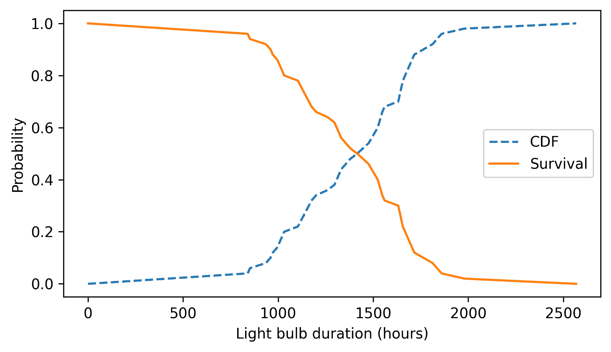

在这个意义上，累积分布函数（CDF）和生存函数是等价的——如果我们给出其中一个，我们可以计算出另一个——但在生存分析中，更常见的是使用生存曲线。计算生存曲线是下一个重要概念，即失效函数的步骤。

## 失效函数

在灯泡数据集中，`h`的每个值代表一个以小时`h`结束的 12 小时间隔——我将称之为“间隔`h`”。假设我们知道一个灯泡已经存活到间隔`h`，我们想知道它在间隔`h`内失效的概率。为了回答这个问题，我们可以使用生存函数，它表示超过间隔`h`的灯泡的比例，以及 PMF，它表示在间隔`h`内失效的比例。这两个值的和是可能在间隔`h`内失效的灯泡的比例，这些灯泡被称为“处于风险中”。例如，26%的灯泡在 1656 间隔内处于风险中。

```py
at_risk = pmf_bulblife + surv_bulblife
at_risk[1656] 
```

```py
np.float64(0.25999999999999995) 
```

并且 4%的所有灯泡在 1656 间隔内失效。

```py
pmf_bulblife[1656] 
```

```py
np.float64(0.04) 
```

**失效函数**是`pmf_bulblife`和`at_risk`的比率。

```py
hazard = pmf_bulblife / at_risk
hazard[1656] 
```

```py
np.float64(0.15384615384615388) 
```

在所有存活到 1656 区间的灯泡中，大约有 15%在 1656 区间内失效。

我们不必自己计算失效函数，可以使用`empiricaldist`，它提供了一个表示失效函数的`Hazard`对象，以及一个计算它的`make_hazard`方法。

```py
hazard_bulblife = surv_bulblife.make_hazard()
hazard_bulblife[1656] 
```

```py
np.float64(0.15384615384615397) 
```

这里展示了灯泡的失效函数是什么样的。

```py
hazard_bulblife.plot()
decorate(xlabel="Light bulb duration (hours)", ylabel="Hazard") 
```

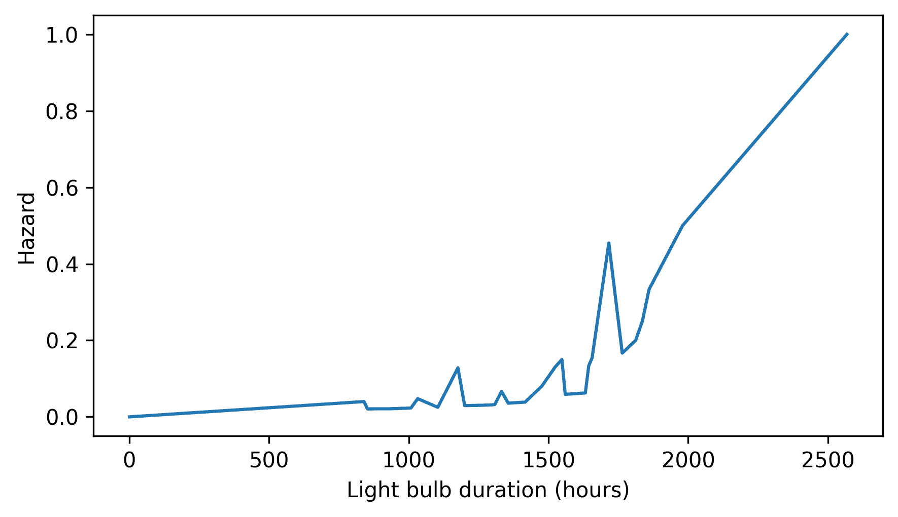

我们可以看到在某些地方失效函数比其他地方高，但这种方式可视化失效函数可能会误导人，尤其是在我们数据不多的一部分范围内。一个更好的选择是绘制**累积失效函数**，它是失效函数的累积和。

```py
cumulative_hazard = hazard_bulblife.cumsum()
cumulative_hazard.plot()

decorate(xlabel="Light bulb duration (hours)", ylabel="Cumulative hazard") 
```

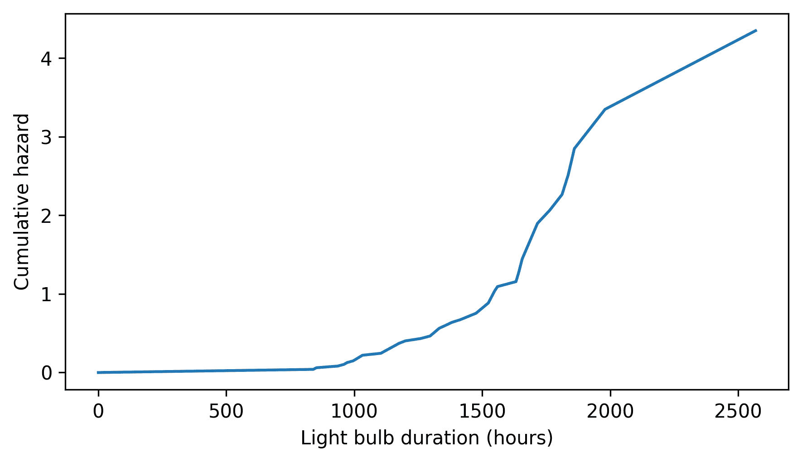

在失效概率高的地方，累积失效函数是陡峭的。在失效概率低的地方，累积失效函数是平缓的。在这个例子中，我们可以看到在 1500 到 2000 小时之间失效函数最高。之后，失效函数下降——尽管这个结果仅基于一个寿命异常长的灯泡，所以在其他数据集中可能看起来不同。

既然我们已经了解了生存和失效函数的一般概念，让我们将它们应用到更大的数据集上。

## 婚姻数据

在许多国家，人们的结婚年龄比以前晚，而且越来越多的人保持未婚。为了探索美国这些趋势，我们将使用生存分析工具和国家家庭成长调查（NSFG）的数据。

我们在前面章节中使用的 NSFG 数据集是怀孕文件，它包含每个调查受访者报告的怀孕的行。在本章中，我们将处理受访者文件，其中包含有关受访者本人的信息。

我已经整理了 1982 年至 2019 年之间进行的九次调查的回应，并选择了与婚姻相关的数据。下载此摘录的说明在本书的笔记本中。

以下单元格下载了数据，这是一个 CSV 文件，我创建的，它结合了 1982 年至 2019 年 NSFG 调查的多个迭代的数据。

数据准备详情请参阅[这个笔记本](https://github.com/AllenDowney/MarriageNSFG/blob/master/clean_nsfg.ipynb)。

```py
filename = "marriage_nsfg_female.csv.gz"
download("https://github.com/AllenDowney/ThinkStats/raw/v3/data/" + filename) 
```

我们可以像这样读取数据。

```py
resp = pd.read_csv("marriage_nsfg_female.csv.gz")
resp.shape 
```

```py
(70183, 34) 
```

摘录中包括超过 70,000 名受访者的每一行，并包含以下与年龄和婚姻相关的变量。

+   `cmbirth`：受访者的出生日期，对所有受访者都已知。

+   `cmintvw`：受访者被采访的日期，对所有受访者都已知。

+   `cmmarrhx`：如果适用且已知，受访者的首次结婚日期。

+   `evrmarry`：如果受访者在采访日期之前已经结婚，则为 1，否则为 0。

前三个变量编码为“世纪-月份”——即自 1899 年 12 月以来的整数月数。因此，世纪-月份 1 是 1900 年 1 月。

为了探索代际变化，我们将受访者按出生十年分组。我们将使用以下函数，它接受`cmbirth`的值并计算相应的出生十年。它使用整数除法运算符`//`除以 10 并向下取整。

```py
month0 = pd.to_datetime("1899-12-31")

def  decade_of_birth(cmbirth):
    date = month0 + pd.DateOffset(months=cmbirth)
    return date.year // 10 * 10 
```

我们可以使用此函数和`apply`方法来计算每个受访者的出生十年，并将其分配给一个名为`cohort`的新列。在这个上下文中，**群体**是一群有共同点的人——比如他们出生的十年——在分析中作为一个群体被对待。

`value_counts`的结果显示了每个群体中的人数。

```py
from  thinkstats  import value_counts

resp["cohort"] = resp["cmbirth"].apply(decade_of_birth)
value_counts(resp["cohort"]) 
```

```py
cohort
1930      325
1940     3608
1950    10631
1960    14953
1970    16438
1980    14271
1990     8552
2000     1405
Name: count, dtype: int64 
```

数据集包括 1950 年代至 1980 年代每个十年出生的 10,000 多名受访者，以及早期和后期十年中受访者较少。

接下来，我们将计算每个受访者在结婚时的年龄（如果适用）以及他们在采访时的年龄。

```py
resp["agemarr"] = (resp["cmmarrhx"] - resp["cmbirth"]) / 12
resp["age"] = (resp["cmintvw"] - resp["cmbirth"]) / 12 
```

要开始使用这些数据，我们将使用以下函数，它接受一个`DataFrame`和一个群体列表作为参数，并返回一个字典，将每个群体映射到一个`Surv`对象。对于每个群体，它选择他们首次结婚时的年龄，并使用`Surv.from_seq`来计算生存函数。`dropna=False`参数将`NaN`值包含在生存函数中，因此结果包括尚未结婚的人。

```py
from  empiricaldist  import Surv

def  make_survival_map(resp, cohorts):
    surv_map = {}

    grouped = resp.groupby("cohort")
    for cohort in cohorts:
        group = grouped.get_group(cohort)
        surv_map[cohort] = Surv.from_seq(group["agemarr"], dropna=False)

    return surv_map 
```

这是使用此函数的方法。

```py
cohorts = [1980, 1960, 1940]
surv_map = make_survival_map(resp, cohorts) 
```

下面是出生于 1940 年代、1960 年代和 1980 年代的人的结果。

```py
import  matplotlib.pyplot  as  plt
import  cycler

# Extract the default color cycle
default_colors = plt.rcParams["axes.prop_cycle"].by_key()["color"]

# Define the desired line styles
linestyles = ["--", "-", "-.", "--", "-", "-.", "--", "-", "-.", "--"]

# Ensure we cycle through styles and colors properly
custom_cycler = cycler.cycler(color=default_colors) + cycler.cycler(
    linestyle=linestyles
)

# Apply the new cycler
plt.rc("axes", prop_cycle=custom_cycler) 
```

```py
for cohort, surv in surv_map.items():
    surv.plot(label=f"{cohort}s")

ylim = [-0.05, 1.05]
decorate(xlabel="Age", ylabel="Prob never married", ylim=ylim) 
```

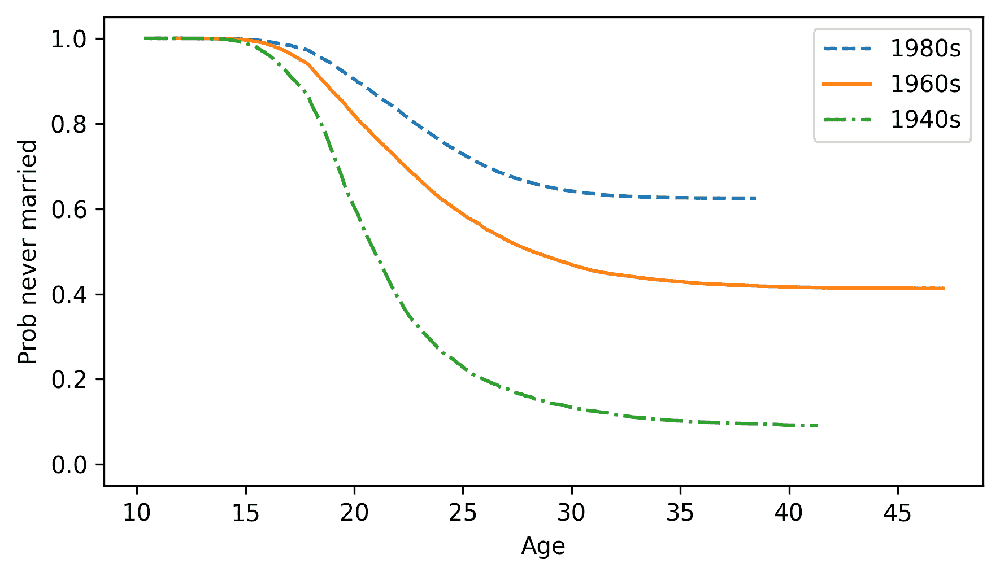

如果我们直接接受这些结果，它们表明早期世代的人结婚较早，而且更多的人最终结婚了。然而，我们不应立即解释这些结果，因为它们是不正确的。我们必须解决两个问题：

+   如第一章所述，NSFG 使用分层抽样，这意味着它故意对某些群体进行过抽样。

+   此外，这种计算生存函数的方法并没有充分考虑尚未结婚的人。

对于第一个问题，我们将使用一种称为**加权自助法**的重抽样方法。对于第二个问题，我们将使用一种称为 Kaplan-Meier 估计的方法。我们将从重抽样开始。

## 加权自助法

NSFG 数据集包括一个名为`finalwgt`的列，其中包含每个受访者的抽样权重，即他们所代表的总人口中的数量。我们可以在重抽样过程中使用这些权重来校正分层抽样。以下函数接受一个`DataFrame`和包含抽样权重的列名。它根据抽样权重重抽样`DataFrame`的行，并返回一个新的`DataFrame`。

```py
def  resample_rows_weighted(df, column="finalwgt"):
    n = len(df)
    weights = df[column]
    return df.sample(n, weights=weights, replace=True) 
```

当前数据集包括来自调查几个迭代周期的受访者，称为周期，因此为了重抽样，我们必须按周期对受访者进行分组，对每个组进行重抽样，然后将组重新组合。这正是以下函数所做的事情。

```py
def  resample_cycles(resp):
    grouped = resp.groupby("cycle")
    samples = [resample_rows_weighted(group) for _, group in grouped]
    return pd.concat(samples) 
```

要开始，我们将重抽样数据一次。

```py
# Seed the random number generator so we get the same results every time
np.random.seed(1) 
```

```py
sample = resample_cycles(resp) 
```

之后我们将多次重抽样数据，以便我们可以看到由于随机抽样引起的多少变异。

下图显示了重抽样后的结果，与之前章节未重抽样的结果（以虚线表示）进行了比较。

```py
for label, surv in surv_map.items():
    surv.plot(ls=":", color="gray", alpha=0.6)

survs_resampled = make_survival_map(sample, cohorts)

for label, surv in survs_resampled.items():
    surv.plot(label=label)

decorate(xlabel="Age", ylabel="Prob never married", ylim=ylim) 
```

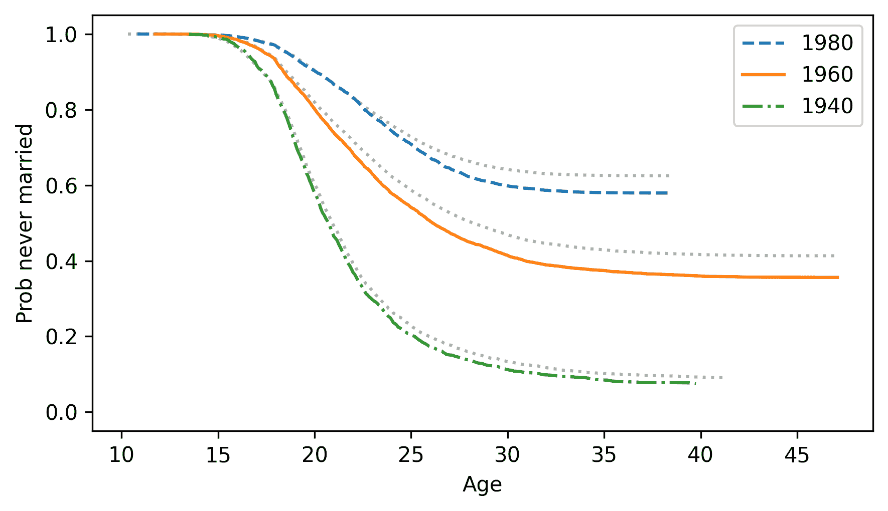

```py
plt.rc("axes", prop_cycle=plt.rcParamsDefault["axes.prop_cycle"]) 
```

有无重抽样的差异是显著的，这表明我们需要对分层抽样进行校正以获得准确的结果。

现在，让我们来解决第二个问题，处理不完整的数据。

## 估计风险函数

在灯泡示例中，我们知道所有 50 个灯泡的寿命，因此我们可以直接计算生存函数——我们还可以使用生存函数来计算风险函数。

在婚姻示例中，我们知道一些受访者在被采访之前已经结婚的初次结婚年龄。但对于从未结婚的受访者，我们不知道他们将来会在多大年龄结婚——或者是否会结婚。

这种缺失数据被称为**截尾**。这个术语可能听起来有些奇怪，因为截尾信息通常是故意隐藏的，但在这个情况下，它只是因为我们不知道未来。

然而，我们有一些可以工作的部分信息：如果某人在调查时未婚，我们知道他们结婚的年龄（如果他们结婚的话）必须大于他们当前的年龄。

我们可以使用这些部分信息来估计风险函数；然后我们可以使用风险函数来计算生存函数。这个过程被称为**Kaplan-Meier 估计**。

为了演示，我将从重新抽样的数据中选取一个队列。

```py
resp60 = sample.query("cohort == 1960") 
```

对于在调查时已婚的受访者，我们将选择他们的初婚年龄。共有 9921 人，我们将它们称为“完整”案例。

```py
complete = resp60.query("evrmarry == 1")["agemarr"]
complete.count() 
```

```py
np.int64(9921) 
```

对于那些未婚的受访者，我们将选择他们在调查时的年龄。共有 5468 人，我们将它们称为“持续”案例。

```py
ongoing = resp60.query("evrmarry == 0")["age"]
ongoing.count() 
```

```py
np.int64(5468) 
```

现在，为了估计风险函数，我们将计算每个年龄的“处于风险中”的案例总数，包括到那个年龄为止所有未婚的人。创建一个`FreqTab`对象，该对象按年龄统计完整和持续案例的数量将很方便。

```py
from  empiricaldist  import FreqTab

ft_complete = FreqTab.from_seq(complete)
ft_ongoing = FreqTab.from_seq(ongoing) 
```

例如，有 58 位受访者报告称他们在 25 岁时第一次结婚。

```py
ft_complete[25] 
```

```py
np.int64(58) 
```

还有 5 位在 25 岁时接受调查并报告称他们从未结婚的人。

```py
ft_ongoing[25] 
```

```py
np.int64(5) 
```

从这些`FreqTab`对象中，我们可以计算未归一化的`Surv`对象，这些对象包含超过每个年龄的完整和持续案例数量。

```py
surv_complete = ft_complete.make_surv()
surv_ongoing = ft_ongoing.make_surv() 
```

例如，有 2848 人报告称他们在 25 岁之后结婚。

```py
surv_complete[25] 
```

```py
np.int64(2848) 
```

以及 25 岁之后接受调查且从未结婚的 2273 人。

```py
surv_ongoing[25] 
```

```py
np.int64(2273) 
```

我们刚刚计算的四个数字之和是处于风险中的受访者人数——也就是说，在 25 岁时可能结婚的人。术语“处于风险中”是医学中生存分析的遗产，它通常指疾病或死亡的风险。在婚姻的背景下，这似乎有些不一致，因为婚姻通常被认为是一个积极的里程碑。话虽如此，这是我们的计算方法。

```py
at_risk = ft_complete[25] + ft_ongoing[25] + surv_complete[25] + surv_ongoing[25]
at_risk 
```

```py
np.int64(5184) 
```

其中，实际在 25 岁结婚的人数是`ft_complete[25]`。因此，我们可以这样计算 25 岁时的风险函数。

```py
hazard = ft_complete[25] / at_risk
hazard 
```

```py
np.float64(0.011188271604938271) 
```

这就是我们如何计算单个年龄的风险函数。现在让我们计算整个函数，适用于所有年龄。我们将使用`Index`类的`union`方法来计算一个包含`ft_complete`和`ft_ongoing`中所有年龄的 Pandas `Index`。

```py
ts = pd.Index.union(ft_complete.index, ft_ongoing.index) 
```

现在，我们可以通过在每个`FreqTab`和`Surv`对象中查找`ts`中的年龄来计算每个年龄处于风险中的人数。

```py
at_risk = ft_complete(ts) + ft_ongoing(ts) + surv_complete(ts) + surv_ongoing(ts) 
```

最后，我们可以计算每个年龄的风险函数，并将结果放入`Hazard`对象中。

```py
from  empiricaldist  import Hazard

hs = ft_complete(ts) / at_risk
hazard = Hazard(hs, ts) 
```

这就是累积风险函数的形状。

```py
hazard.cumsum().plot()

decorate(xlabel="Age", ylabel="Cumulative hazard") 
```

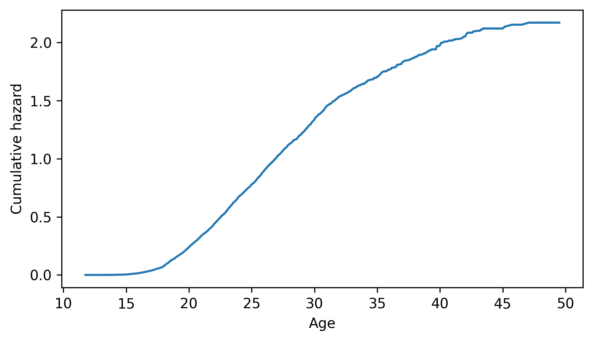

它在 20 岁到 30 岁之间最陡峭，这意味着未婚者在这些年龄段的结婚“风险”最大。之后，累积风险水平稳定，这意味着风险逐渐降低。

## 估计生存函数

如果我们给定一个生存函数，我们知道如何计算风险函数。现在让我们反过来。

这里有一个思考方式。风险函数表示如果你尚未结婚，在每一个年龄结婚的概率。所以风险函数的补数是每个年龄保持未婚的概率。

为了“生存”到给定的年龄`t`，你必须在每个年龄保持未婚，包括`t`。做到这一点的概率是互补风险函数的乘积，我们可以这样计算。

```py
ps = (1 - hazard).cumprod() 
```

`Hazard`对象有一个`make_surv`方法来完成这个计算。

```py
surv = hazard.make_surv() 
```

下面是结果的样子，与之前的结果（虚线）相比，之前的结果纠正了分层重采样，但没有处理截尾数据。

```py
survs_resampled[1960].plot(ls=":", color="gray", label="resampled")
surv.plot(label="Kaplan-Meier")

decorate(xlabel="Age", ylabel="Prob never married", ylim=ylim) 
```

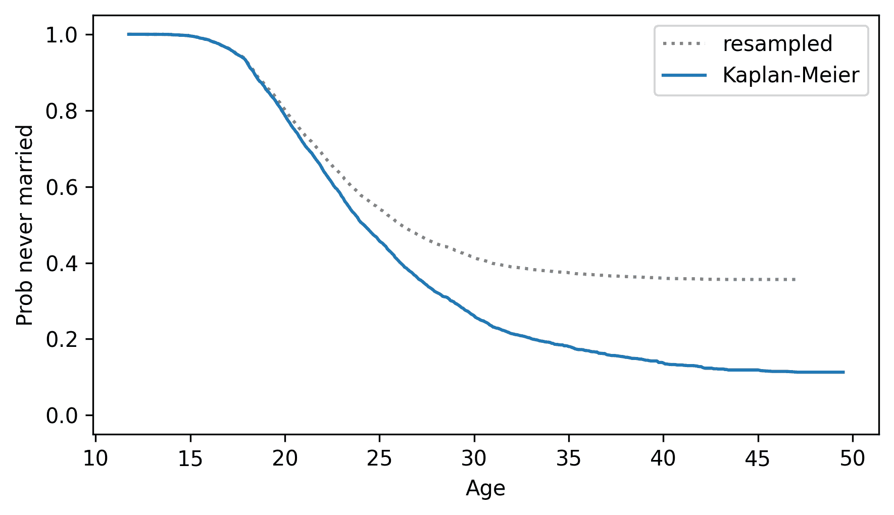

我们可以看到正确处理截尾数据的重要性。

这样的生存函数是 1986 年一篇著名杂志文章的基础 – 《新闻周刊》报道称，40 岁的未婚女性“被恐怖分子杀害的可能性”比结婚的可能性更大。这个说法被广泛报道，并成为流行文化的一部分，但当时是错误的（因为它是基于错误的分析），后来证明更加错误（因为文化变化已经在进行中）。2006 年，《新闻周刊》又发表了一篇文章，承认他们的错误。

我鼓励你阅读更多关于这篇文章、其依据的统计数据以及公众的反应。这应该会提醒你，进行统计分析时要有道德上的责任，用适当的怀疑态度来解释结果，并准确、诚实地向公众展示。

[Snopes 有关于这个主题的好文章](https://www.snopes.com/fact-check/marry-go-round/)。

以下函数封装了 Kaplan-Meier 估计的步骤。它接受完整和持续病例的生存时间序列作为参数，并返回一个`Hazard`对象。

```py
def  estimate_hazard(complete, ongoing):
  """Kaplan-Meier estimation."""
    ft_complete = FreqTab.from_seq(complete)
    ft_ongoing = FreqTab.from_seq(ongoing)

    surv_complete = ft_complete.make_surv()
    surv_ongoing = ft_ongoing.make_surv()

    ts = pd.Index.union(ft_complete.index, ft_ongoing.index)
    at_risk = ft_complete(ts) + ft_ongoing(ts) + surv_complete(ts) + surv_ongoing(ts)

    hs = ft_complete(ts) / at_risk
    return Hazard(hs, ts) 
```

下面是一个函数，它接受一组受访者，提取生存时间，调用`estimate_hazard`来获取风险函数，然后计算相应的生存函数。

```py
def  estimate_survival(group):
  """Estimate the survival function."""
    complete = group.query("evrmarry == 1")["agemarr"]
    ongoing = group.query("evrmarry == 0")["age"]
    hf = estimate_hazard(complete, ongoing)
    sf = hf.make_surv()
    return sf 
```

很快，我们将使用这些函数来计算生存函数的置信区间。但首先，让我们看看另一种计算 Kaplan-Meier 估计的方法。

## Lifelines

一个名为`lifelines`的 Python 包提供了生存分析的工具，包括计算 Kaplan-Meier 估计的函数。

以下单元格在需要时安装`lifelines`。

```py
try:
    import  lifelines
except ImportError:
    %pip install lifelines 
```

我们可以使用它来确认上一节中的结果是正确的。首先，我们将使用`estimate_survival`计算生存函数。

```py
surv = estimate_survival(resp60) 
```

接下来，我们将使用`lifelines`来计算它。首先，我们需要将数据转换成`lifelines`所需的格式。

```py
complete = complete.dropna()
durations = np.concatenate([complete, ongoing])
event_observed = np.concatenate([np.ones(len(complete)), np.zeros(len(ongoing))]) 
```

现在，我们可以创建一个`KaplanMeierFitter`对象并拟合数据。

```py
from  lifelines  import KaplanMeierFitter

kmf = KaplanMeierFitter()
kmf.fit(durations=durations, event_observed=event_observed) 
```

```py
<lifelines.KaplanMeierFitter:"KM_estimate", fitted with 15389 total observations, 5468 right-censored observations> 
```

在拟合数据后，我们可以调用`plot`函数来显示结果，包括估计的生存函数和置信区间——尽管在这个案例中置信区间是不正确的，因为它没有对分层抽样进行校正。

```py
kmf.plot()

decorate(xlabel="Age", ylabel="Prob never married", ylim=ylim) 
```

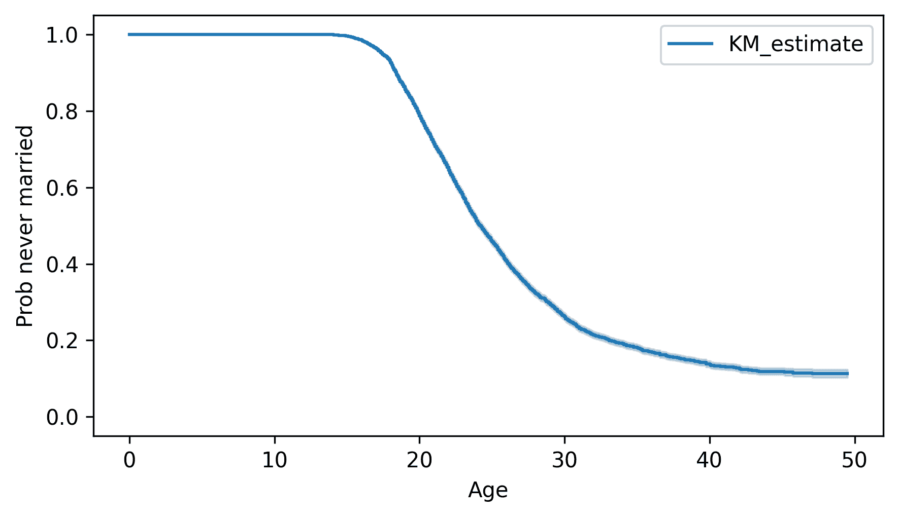

与我们计算的生存函数不同，`lifelines`中的生存函数从 0 开始。但其余的函数在浮点误差范围内是相同的。

```py
ps = kmf.survival_function_["KM_estimate"].drop(0)
np.allclose(ps, surv) 
```

```py
True 
```

在下一节中，我们将使用加权重采样来计算考虑分层抽样的置信区间。

## 置信区间

我们计算的 Kaplan-Meier 估计是基于数据集的单次重采样。为了了解由于随机抽样引起的变异程度，我们将使用多次重采样进行分析，并绘制结果。

我们将使用以下函数，该函数接受一个`DataFrame`和一个队列列表，为每个队列估计生存函数，并返回一个字典，将每个整数队列映射到一个`Surv`对象。

此函数与`make_survival_map`相同，除了它调用`estimate_survival`，该函数使用 Kaplan-Meier 估计，而不是`Surv.from_seq`，后者仅在无删失数据的情况下工作。

```py
def  estimate_survival_map(resp, cohorts):
  """Make a dictionary from cohorts to Surv objects."""
    surv_map = {}

    grouped = resp.groupby("cohort")
    for cohort in cohorts:
        group = grouped.get_group(cohort)
        surv_map[cohort] = estimate_survival(group)

    return surv_map 
```

以下循环生成了数据集的 101 次随机重采样，并创建了一个包含 101 个字典的列表，这些字典包含了估计的生存函数。

```py
cohorts = [1940, 1950, 1960, 1970, 1980, 1990]

surv_maps = [estimate_survival_map(resample_cycles(resp), cohorts) for i in range(101)] 
```

为了绘制结果，我们将使用以下函数，该函数接受一个字典列表、一个整数队列和一个颜色字符串。它遍历字典，选择给定队列的生存函数，并以几乎透明的线条绘制它——这是可视化重采样之间变异的一种方法。

```py
def  plot_cohort(surv_maps, cohort, color):
  """Plot results for a single cohort."""
    survs = [surv_map[cohort] for surv_map in surv_maps]
    for surv in survs:
        surv.plot(color=color, alpha=0.05)

    x, y = surv.index[-1], surv.iloc[-1]
    plt.text(x + 1, y, f"{cohort}s", ha="left", va="center") 
```

这里是 1940 年代到 1990 年代出生队列的结果。

```py
colors = [f"C{i}" for i in range(len(cohorts))]

for cohort, color in zip(cohorts, colors):
    plot_cohort(surv_maps, cohort, color)

xlim = [8, 55]
decorate(xlabel="Age", ylabel="Prob never married", xlim=xlim, ylim=ylim) 
```

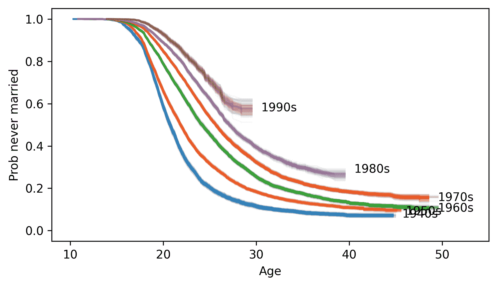

这种可视化对于探索来说已经足够好了，但线条看起来有些模糊，一些标签也重叠了。可能需要更多的工作来制作一个可用于发表的图表，但现在我们会保持简单。

可以看到几个明显的模式：

+   1940 年代出生的女性结婚最早——1950 年代和 1960 年代出生的队列结婚较晚，但未婚的比例大致相同。

+   1970 年代出生的女性结婚较晚，并且未婚的比例高于之前的队列。

+   1980 年代和 1990 年代出生的队列结婚的时间更晚，并且未婚的比例更高——尽管这些模式在未来可能会改变。

我们将不得不等待 NSFG 的下一个数据发布来了解更多信息。

## 预期剩余寿命

给定一个分布，我们可以计算预期剩余寿命作为已过时间的函数。例如，给定怀孕长度的分布，我们可以计算分娩的预期时间。为了演示，我们将使用 NSFG 的怀孕数据。

以下单元格下载数据文件并安装`statadict`，这是我们读取数据所需的。

```py
download("https://github.com/AllenDowney/ThinkStats/raw/v3/nb/nsfg.py")
download("https://github.com/AllenDowney/ThinkStats/raw/v3/data/2002FemPreg.dct")
download("https://github.com/AllenDowney/ThinkStats/raw/v3/data/2002FemPreg.dat.gz") 
```

```py
try:
    import  statadict
except ImportError:
    %pip install statadict 
```

我们将使用`get_nsfg_groups`来读取数据，并将其分为第一胎和其他。

```py
from  nsfg  import get_nsfg_groups

live, firsts, others = get_nsfg_groups() 
```

我们将首先对数据进行一次重采样。

```py
sample = resample_rows_weighted(live, "finalwgt") 
```

这是怀孕持续时间的 PMF。

```py
pmf_durations = Pmf.from_seq(sample["prglngth"]) 
```

现在假设是怀孕的第 36 周的开始。记住最常见的怀孕长度是 39 周，我们预计剩余时间为 3-4 周。为了使这个估计更精确，我们可以识别分布中等于或超过 36 周的那些值。

```py
t = 36
is_remaining = pmf_durations.qs >= t 
```

接下来，我们将创建一个新的`Pmf`对象，它只包含那些值，并将它们左移，使当前时间为 0。

```py
ps = pmf_durations.ps[is_remaining]
qs = pmf_durations.qs[is_remaining] - t

pmf_remaining = Pmf(ps, qs) 
```

由于我们选择了`Pmf`中的值的一个子集，概率不再加起来为 1，但我们可以归一化`Pmf`，使它们加起来为 1。

```py
pmf_remaining.normalize() 
```

```py
np.float64(0.9155006558810669) 
```

这是结果，它显示了第 36 周开始时的剩余时间分布。

```py
pmf_remaining.bar(label="Week 36")
decorate(xlabel="Remaining duration (weeks)", ylabel="PMF") 
```

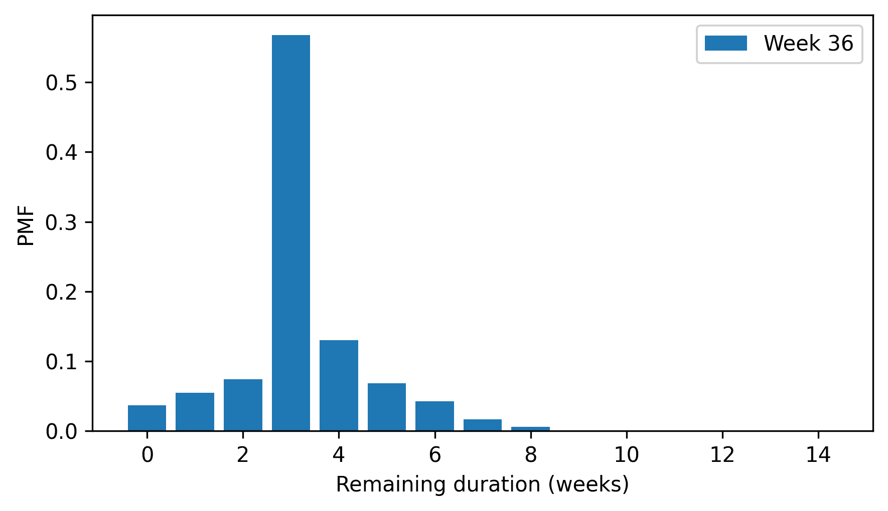

这个分布的均值是预期的剩余时间。

```py
pmf_remaining.mean() 
```

```py
np.float64(3.2145671641791043) 
```

以下函数封装了这些步骤，并计算给定时间`t`下`Pmf`的剩余时间分布。

```py
def  compute_pmf_remaining(pmf, t):
  """Distribution of remaining time."""
    is_remaining = pmf.qs >= t
    ps = pmf.ps[is_remaining]
    qs = pmf.qs[is_remaining] - t
    pmf_remaining = Pmf(ps, qs)
    pmf_remaining.normalize()
    return pmf_remaining 
```

以下函数接受一个怀孕长度的`Pmf`，并计算从第 36 周到第 43 周每周开始的预期剩余时间。

```py
def  expected_remaining(pmf):
    index = range(36, 44)
    expected = pd.Series(index=index)

    for t in index:
        pmf_remaining = compute_pmf_remaining(pmf, t)
        expected[t] = pmf_remaining.mean()

    return expected 
```

这是数据单次重采样的结果。

```py
expected = expected_remaining(pmf_durations)
expected 
```

```py
36    3.214567
37    2.337714
38    1.479095
39    0.610133
40    0.912517
41    0.784211
42    0.582301
43    0.589372
dtype: float64 
```

为了看到由于随机采样引起的多少变化，我们可以运行多次重采样分析，并绘制结果。

```py
for i in range(21):
    sample = resample_rows_weighted(live, "finalwgt")
    pmf_durations = Pmf.from_seq(sample["prglngth"])
    expected = expected_remaining(pmf_durations)
    expected.plot(color="C0", alpha=0.1)

decorate(
    xlabel="Weeks of pregnancy", ylabel="Expected remaining time (weeks)", ylim=[0, 3.4]
) 
```

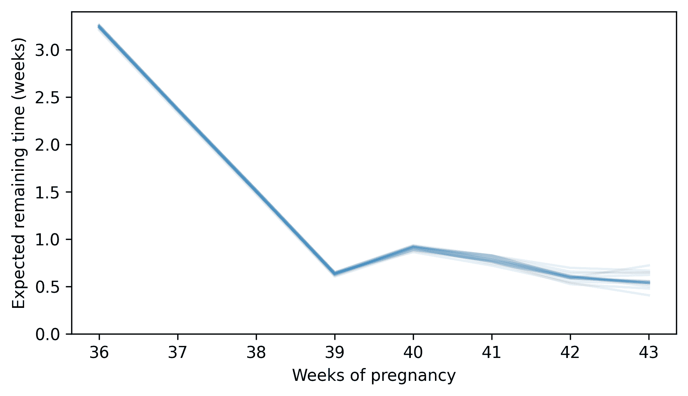

在第 36 周到第 39 周之间，预期的剩余时间逐渐减少，直到在第 39 周开始时，大约是 0.6 周。但之后，曲线趋于平稳。在第 40 周开始时，预期的剩余时间仍然接近 0.6 周——实际上略高——在第 41 周、第 42 周和第 43 周开始时，几乎相同。对于焦急等待婴儿出生的人来说，这种行为似乎相当残酷。

## 术语表

+   **生存分析**：一组描述和预测感兴趣事件发生时间的的方法，通常关注寿命或持续时间。

+   **生存函数**：一个将时间`t`映射到超过`t`的生存概率的函数。

+   **风险函数**：一个将`t`映射到在`t`时刻经历事件的案例比例的函数，这些案例在`t`时刻之前幸存。

+   **累积风险函数**：风险函数的累积和，通常对可视化很有用。

+   **加权 bootstrap**：一种使用采样权重来纠正分层抽样的重采样形式，通过模拟代表性样本。

+   **被审查的数据**：仅部分已知的数据，因为感兴趣的事件尚未发生或未被观察到。

+   **Kaplan-Meier 估计**：一种用于估计具有截尾观察值的数据集中的生存和风险函数的方法。

+   **队列**：具有共享特征（如出生十年）的一组主题，作为一个组进行分析。

## 练习

### 练习 13.1

我们可以使用本章中的方法估计婚姻持续时间的风险和生存函数。为了使事情简单，我们将只考虑第一次婚姻，并且我们将关注离婚作为终点，而不是分离或死亡。

在 NSFG 数据中，`cmdivorcx` 列包含每个受访者的第一次婚姻的离婚日期（如果适用），以世纪-月份编码。计算以离婚结束的婚姻的持续时间，以及至今仍在进行的婚姻的持续时间。

+   对于完整案例，计算 `cmdivorcx` 和 `cmmarrhx` 之间的经过时间。如果这两个值都有效——不是 `NaN` ——这意味着受访者的第一次婚姻以离婚结束。

+   为了识别持续案例，选择只结过一次婚并且仍然已婚的人。你可以使用 `fmarno`，它记录了每个受访者结婚的次数，以及 `fmarital`，它编码了他们的婚姻状况——值 1 表示受访者已婚。

在某些情况下，这些变量的值只是近似值，因此你可能会发现一小部分负数差异，但它们不应超过一年。

估计婚姻持续时间的风险和生存函数。绘制累积风险函数——离婚的危险性最高是在什么时候？绘制生存函数——有多少比例的婚姻以离婚结束？

```py
# I suggest you use a single resampling of the data

sample = resample_cycles(resp) 
```

### 练习 13.2

2012 年，南加州大学的一组人口统计学家估计了 19 世纪初和 20 世纪初出生在瑞典的人的预期寿命。对于 0 至 91 岁的年龄，他们估计了年龄特定的死亡率，即给定年龄死亡的人数占所有在该年龄之前存活下来的人的比例——你可能认识这是风险函数。

我使用在线图形数字化工具从他们的论文中的图表获取数据，并将其存储在 CSV 文件中。下载数据的说明在本书的笔记本中。

数据来源：Beltrán-Sánchez, H., Crimmins, E. M., & Finch, C. E. (2012). 早期队列死亡率预测队列的衰老速度：历史分析。*发育起源的健康与疾病杂志*，3(5)，380-386。

下面的单元格下载了数据。

```py
download(
    "https://github.com/AllenDowney/ThinkStats/raw/v3/data/mortality_rates_beltran2012.csv"
) 
```

我们可以像这样加载数据。

```py
mortality = pd.read_csv("mortality_rates_beltran2012.csv", header=[0, 1]).dropna() 
```

下面的函数将数据插值以创建一个具有从 0 到 99 岁每个年龄的近似死亡率的危险函数。

```py
from  scipy.interpolate  import interp1d
from  empiricaldist  import Hazard

def  make_hazard(ages, rates):
  """Make a Hazard function by interpolating a Series.

 series: Series

 returns: Hazard
 """
    interp = interp1d(ages, rates, fill_value="extrapolate")
    xs = np.arange(0, 100)
    ys = np.exp(interp(xs))
    return Hazard(ys, xs) 
```

现在我们可以创建一个这样的 `Hazard` 对象。

```py
ages = mortality["1800", "X"].values
rates = mortality["1800", "Y"].values
hazard = make_hazard(ages, rates) 
```

这就是死亡率的样子。

```py
hazard.plot()

decorate(xlabel="Age (years)", ylabel="Hazard") 
```

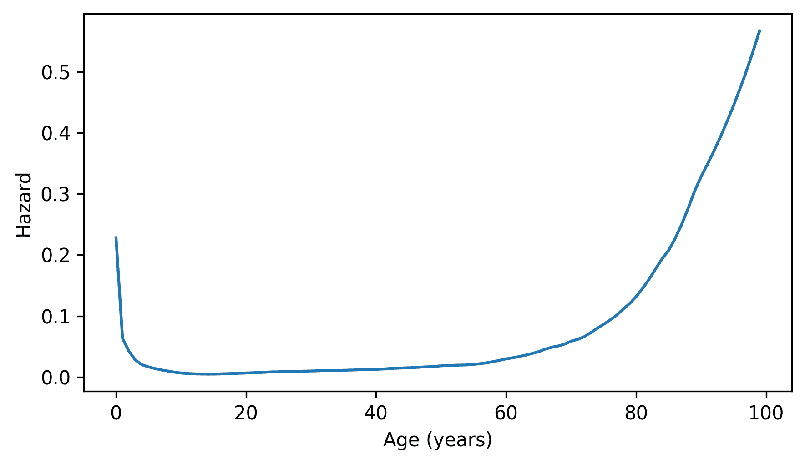

使用 `make_surv` 来根据这些比率制作生存函数，并使用 `make_cdf` 来计算相应的累积分布函数（CDF）。绘制结果。

然后使用 `make_pmf` 来制作表示寿命分布的 `Pmf` 对象，并绘制它。最后，使用 `compute_pmf_remaining` 来计算从 0 岁到 99 岁每个年龄的平均剩余寿命。绘制结果。

在剩余寿命曲线上，你应该会看到一个反直觉的模式——在生命的最初几年，剩余寿命会增加。因为 19 世纪初期的婴儿死亡率非常高，所以预期较大的孩子比年幼的孩子活得更久。大约 5 岁之后，预期寿命会回到我们预期的模式——年轻人预期比老年人活得更久。

如果你对这个主题感兴趣，可能会喜欢我的书《很可能是在过度思考》的第五章，该章节展示了来自统计学许多领域的类似反直觉结果。

可从 [`probablyoverthinking.it`](https://probablyoverthinking.it) 获取。

[《Think Stats：Python 中的探索性数据分析，第 3 版》](https://allendowney.github.io/ThinkStats/index.html)

版权所有 2024 [艾伦·B·唐尼](https://allendowney.com)

代码许可：[MIT 许可证](https://mit-license.org/)

文本许可：[Creative Commons Attribution-NonCommercial-ShareAlike 4.0 国际](https://creativecommons.org/licenses/by-nc-sa/4.0/)
